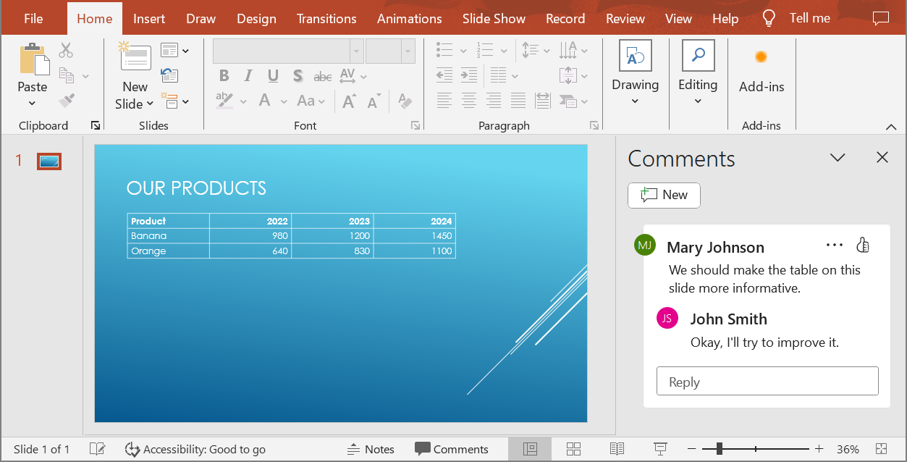

## **بررسی کلی**

این مقاله توضیح می‌دهد که چگونه می‌توانید ارائه‌های PowerPoint را با استفاده از Aspose.Slides برای C++ به HTML5 تبدیل کنید. این مقاله صادرات پایه، کنترل انیمیشن شکل‌ها و انتقال اسلایدها، و چیدمان نظرات را پوشش می‌دهد. همچنین خروجی HTML5 را با خروجی مبتنی بر SVG صادرات استاندارد HTML مقایسه می‌کند.

## **صادرات PowerPoint به HTML5**

مثال زیر یک ارائه را از پوشه کاری بارگذاری کرده و آن را در قالب HTML5 ذخیره می‌کند. این مثال از تنظیمات پیش‌فرض صادرات استفاده می‌کند؛ مثال بعدی نشان می‌دهد چگونه پخش انیمیشن را به‌صورت صریح کنترل کنید. مسیر ورودی را با مسیر ارائه خود جایگزین کنید.

```cpp
#include <DOM/Presentation.h>
#include <Export/SaveFormat.h>
#include <system/smart_ptr.h>

using namespace Aspose::Slides;
using namespace Aspose::Slides::Export;

auto presentation = System::MakeObject<Presentation>(u"pres.pptx");
presentation->Save(u"pres.html", SaveFormat::Html5);
presentation->Dispose();
```

{}

به‌جز سند HTML، صادرات فایل‌های CSS و JavaScript پشتیبان برای استایل اسلایدها، انیمیشن‌ها، افکت‌ها و ناوبری می‌نویسد. هنگام جابجایی یا انتشار خروجی، این فایل‌ها را همراه سند HTML نگه دارید. صفحه تولید‌شده همچنین jQuery و Anime.js را از CDNهای عمومی بارگذاری می‌کند؛ بدون آن‌ها ناوبری اسلاید و انیمیشن‌ها اجرا نمی‌شوند.

{}

برای صادرات بدون پخش انیمیشن شکل‌ها یا انتقال اسلایدها، مقدار `false` را به [set_AnimateShapes](https://reference.aspose.com/slides/cpp/aspose.slides.export/html5options/set_animateshapes/) و [set_AnimateTransitions](https://reference.aspose.com/slides/cpp/aspose.slides.export/html5options/set_animatetransitions/) در [Html5Options](https://reference.aspose.com/slides/cpp/aspose.slides.export/html5options/) پاس دهید. این تنظیمات مستقل هستند، بنابراین می‌توانید یکی را فعال و دیگری را غیرفعال کنید. این مثال ارائه را با هر دو نوع انیمیشن غیرفعال در صفحه تولید‌شده صادر می‌کند.

```cpp
#include <DOM/Presentation.h>
#include <Export/SaveFormat.h>
#include <system/smart_ptr.h>
#include <Export/Html5Options.h>

using namespace Aspose::Slides;
using namespace Aspose::Slides::Export;

auto html5Options = System::MakeObject<Html5Options>();
html5Options->set_AnimateShapes(false);
html5Options->set_AnimateTransitions(false);

auto presentation = System::MakeObject<Presentation>(u"pres.pptx");
presentation->Save(u"pres5.html", SaveFormat::Html5, html5Options);
presentation->Dispose();
```

## **صادرات PowerPoint به HTML**

صادرات استاندارد HTML از روش رندر متفاوتی استفاده می‌کند: محتویات اسلاید به‌صورت SVG داخل صفحه HTML نشان داده می‌شود. مثال زیر یک ارائه را به سند HTML تبدیل می‌کند که از این روش رندر استفاده می‌کند.

```cpp
#include <DOM/Presentation.h>
#include <Export/SaveFormat.h>
#include <system/smart_ptr.h>

using namespace Aspose::Slides;
using namespace Aspose::Slides::Export;

auto presentation = System::MakeObject<Presentation>(u"pres.pptx");
presentation->Save(u"pres.html", SaveFormat::Html);
presentation->Dispose();
```

کد ساده‌شده زیر ساختار صفحه تولید‌شده را نشان می‌دهد. عنصر SVG شامل محتوای رندر شده اسلاید است؛ متن جایگزین فقط برای نشان دادن آن محتواست و خروجی واقعی صادرات نیست.

```html
<body>
<div class="slide" name="slide" id="slideslideIface1">
     <svg version="1.1">
         <g> THE SLIDE CONTENT GOES HERE </g>
     </svg>
</div>
</body>
```

{}

صادرات مبتنی بر SVG اشکال PowerPoint را به‌عنوان عناصر HTML جداگانه عرضه نمی‌کند. هنگامی که به گزینه‌های انیمیشن شکل و انتقال اسلاید نیاز دارید، از صادرات HTML5 استفاده کنید.

{}

## **صادرات PowerPoint به نمای اسلاید HTML5**

صادرات HTML5 صفحه‌ای برای مشاهده و ناوبری اسلایدهای ارائه در مرورگر تولید می‌کند. این مثال مقدار `true` را به هر دو [set_AnimateShapes](https://reference.aspose.com/slides/cpp/aspose.slides.export/html5options/set_animateshapes/) و [set_AnimateTransitions](https://reference.aspose.com/slides/cpp/aspose.slides.export/html5options/set_animatetransitions/) می‌گذارد تا نمای اسلاید صادرشده بتواند افکت‌های موجود در ارائه منبع را پخش کند.

از ارائه‌ای استفاده کنید که از قبل شامل انیمیشن شکل‌ها و انتقال اسلایدها باشد تا اثر این تنظیمات را ببینید. فعال‌سازی آنها افکت‌های جدیدی به اسلایدهایی که فاقد آنها هستند اضافه نمی‌کند. پس از صادرات، سند HTML5 تولید‌شده را در مرورگر با دسترسی به فایل‌های پشتیبان باز کنید.

```cpp
#include <DOM/Presentation.h>
#include <Export/SaveFormat.h>
#include <system/smart_ptr.h>
#include <Export/Html5Options.h>

using namespace Aspose::Slides;
using namespace Aspose::Slides::Export;

auto html5Options = System::MakeObject<Html5Options>();
html5Options->set_AnimateShapes(true);
html5Options->set_AnimateTransitions(true);

auto presentation = System::MakeObject<Presentation>(u"pres.pptx");
presentation->Save(u"HTML5-slide-view.html", SaveFormat::Html5, html5Options);
presentation->Dispose();
```

## **تبدیل ارائه به سند HTML5 با نظرات**

می‌توانید نظرات اسلاید موجود را در خروجی HTML5 گنجانده و به خوانندگان اجازه دهید بازخورد را در کنار محتوای اسلاید مشاهده کنند. مثال این بخش فرض می‌کند که ارائه منبع شامل نظرات باشد همان‌طور که در ادامه نشان داده شده است. این نظرات صادر می‌شوند؛ نظرات جدید ایجاد نمی‌شوند.



یک شیء [NotesCommentsLayoutingOptions](https://reference.aspose.com/slides/cpp/aspose.slides.export/notescommentslayoutingoptions/) را به متد [set_SlidesLayoutOptions](https://reference.aspose.com/slides/cpp/aspose.slides.export/html5options/set_slideslayoutoptions/) در [Html5Options](https://reference.aspose.com/slides/cpp/aspose.slides.export/html5options/) پاس دهید. با فراخوانی [set_CommentsPosition](https://reference.aspose.com/slides/cpp/aspose.slides.export/notescommentslayoutingoptions/set_commentsposition/) و مقدار `CommentsPositions::Right` از شمارش [CommentsPositions](https://reference.aspose.com/slides/cpp/aspose.slides.export/commentspositions/) نظرات را در سمت راست هر اسلاید قرار دهید.

مثال زیر ارائه را به HTML5 صادر می‌کند با این چیدمان نظرات. ارائه‌ای بدون نظرات متن نظری برای نمایش نخواهد داشت.

```cpp
#include <DOM/Presentation.h>
#include <Export/SaveFormat.h>
#include <system/smart_ptr.h>
#include <Export/Html5Options.h>
#include <Export/NotesCommentsLayoutingOptions.h>
#include <Export/CommentsPositions.h>

using namespace Aspose::Slides;
using namespace Aspose::Slides::Export;

auto layoutOptions = System::MakeObject<NotesCommentsLayoutingOptions>();
layoutOptions->set_CommentsPosition(CommentsPositions::Right);

auto html5Options = System::MakeObject<Html5Options>();
html5Options->set_SlidesLayoutOptions(layoutOptions);

auto presentation = System::MakeObject<Presentation>(u"sample.pptx");
presentation->Save(u"output.html", SaveFormat::Html5, html5Options);
presentation->Dispose();
```

تصویر زیر سند HTML5 صادرشده را نشان می‌دهد که نظرات در کنار اسلاید نمایش داده می‌شوند.


## **حذف پیوندهای JavaScript هنگام صادرات**

فرض کنید فایل `hyperlinks.pptx` شامل متن پیوندی با هدف `javascript:alert('Hello')` و یک پیوند عادی `https://example.com/` باشد. برای حذف پیوند JavaScript هنگام صادرات، متد [SaveOptions::set_SkipJavaScriptLinks](https://reference.aspose.com/slides/cpp/aspose.slides.export/saveoptions/set_skipjavascriptlinks/) را با مقدار `true` فراخوانی کنید. مقدار پیش‌فرض `false` است، بنابراین این پیوندها فیلتر نمی‌شوند مگر اینکه این گزینه را فعال کنید.

مثال زیر ارائه را از پوشه کاری بارگذاری کرده و با استفاده از [Html5Options](https://reference.aspose.com/slides/cpp/aspose.slides.export/html5options/) صادر می‌کند:

```cpp
#include <DOM/Presentation.h>
#include <Export/SaveFormat.h>
#include <system/smart_ptr.h>
#include <Export/Html5Options.h>

using namespace Aspose::Slides;
using namespace Aspose::Slides::Export;

auto html5Options = System::MakeObject<Html5Options>();
html5Options->set_SkipJavaScriptLinks(true);

auto presentation = System::MakeObject<Presentation>(u"hyperlinks.pptx");
presentation->Save(u"filtered-html5.html", SaveFormat::Html5, html5Options);
presentation->Dispose();
```

فایل صادرشده پیوند JavaScript را حذف می‌کند ولی متن آن و پیوند HTTPS عادی را نگه می‌دارد. ارائه منبع بدون تغییر باقی می‌ماند.

این گزینه پیوندهای JavaScript را فیلتر می‌کند؛ تمام اسکریپت‌ها یا سایر محتوای فعال را حذف نمی‌کند و تضمینی برای انطباق با CSP نیست. برای مثال، خروجی HTML5 هنوز اسکریپت‌هایی برای ناوبری و انیمیشن اسلایدها شامل می‌شود.

## **پرسش‌های متداول**

**آیا می‌توانم کنترل کنم که انیمیشن‌های شیء و انتقال اسلایدها در HTML5 اجرا شوند یا نه؟**

بله، صادرات HTML5 گزینه‌های جداگانه‌ای برای فعال یا غیرفعال کردن [shape animations](https://reference.aspose.com/slides/cpp/aspose.slides.export/html5options/set_animateshapes/) و [slide transitions](https://reference.aspose.com/slides/cpp/aspose.slides.export/html5options/set_animatetransitions/) ارائه می‌دهد.

**آیا نظرات پشتیبانی می‌شوند و می‌توان آنها را نسبت به اسلاید در کجا قرار داد؟**

بله، نظرات موجود می‌توانند در خروجی HTML5 گنجانده شوند و از طریق [layout settings](https://reference.aspose.com/slides/cpp/aspose.slides.export/html5options/set_slideslayoutoptions/) برای یادداشت‌ها و نظرات، برای مثال در سمت راست اسلاید، موقعیت‌یابی شوند.

**آیا می‌توانم پیوندهایی که JavaScript اجرا می‌کنند را به‌دلیل امنیت یا دلایل CSP حذف کنم؟**

بله، متد [set_SkipJavaScriptLinks](https://reference.aspose.com/slides/cpp/aspose.slides.export/saveoptions/set_skipjavascriptlinks/) به شما اجازه می‌دهد تا پیوندهای دارای فراخوانی‌های JavaScript را هنگام ذخیره‌سازی نادیده بگیرید. مقدار پیش‌فرض `false` است. برای مثال، به بخش [Exclude JavaScript Hyperlinks During Export](/slides/fa/cpp/export-to-html5/#exclude-javascript-hyperlinks-during-export) برای مثال صادرات HTML5 و دامنه فیلتر مراجعه کنید. این تنظیم JavaScript مورد استفاده توسط نمایشگر HTML5 برای ناوبری و انیمیشن‌ها را حذف نمی‌کند.