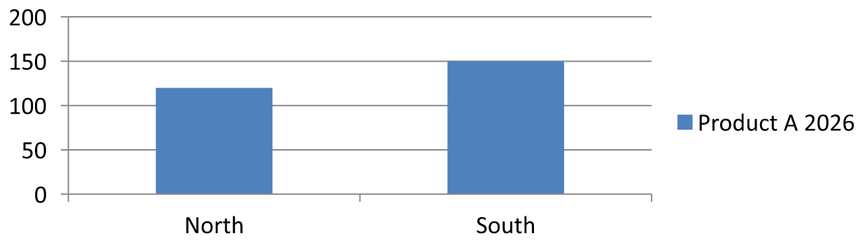

## **نمای کلی**

یک نمودار داده‌های ترسیم‌شده خود را در یک کتاب کار داده‌های نمودار ذخیره می‌کند. یک [IChartSeries](https://reference.aspose.com/slides/cpp/aspose.slides.charts/ichartseries/) یک مجموعه از مقادیر مرتبط را نشان می‌دهد و هر [IChartDataPoint](https://reference.aspose.com/slides/cpp/aspose.slides.charts/ichartdatapoint/) در این مجموعه به یک یا چند سلول کتاب کار ارجاع می‌دهد. اشیاء [IChartCategory](https://reference.aspose.com/slides/cpp/aspose.slides.charts/ichartcategory/) برچسب‌ها یا مقادیر گروه‌بندی مشترک بین مجموعه‌ها را فراهم می‌آورند. بنابراین نام مجموعه، دسته‌ها و مقادیر نقاط به اشیاء [IChartDataCell](https://reference.aspose.com/slides/cpp/aspose.slides.charts/ichartdatacell/) متصل می‌شوند و فقط به عنوان متن قابل نمایش ذخیره نمی‌شوند.

برای یک نمودار دسته‌بندی معمولی، کتاب کار پیش‌فرض از ردیف 0 برای نام‌های سری، ستون 0 برای نام‌های دسته و بقیه سلول‌ها برای مقادیر سری استفاده می‌کند. اندیس‌های worksheet، row و column که به [IChartDataWorkbook::GetCell](https://reference.aspose.com/slides/cpp/aspose.slides.charts/ichartdataworkbook/getcell/) پاس داده می‌شوند، صفر‑مبنای هستند. این طرح هنگام ایجاد نمودار با داده‌های پیش‌فرض مفید است، اما فرض نکنید که هر نمودار موجود از آن استفاده می‌کند. برای یک ارائه بارگذاری‌شده، قبل از تغییر مقادیر کتاب کار، سلول‌های ارجاع‌داده‌شده توسط سری‌ها، دسته‌ها و نقاط داده را بررسی کنید.

تنظیمات نمودار دارای سه حوزه متفاوت هستند:

- تنظیمات سطح سری، مانند [IChartSeries::get_Format](https://reference.aspose.com/slides/cpp/aspose.slides.charts/ichartseries/get_format/)، ظاهر پیش‌فرض تمام نقاط یک سری را فراهم می‌کند.
- تنظیمات نقطه داده، مانند [IChartDataPoint::get_Format](https://reference.aspose.com/slides/cpp/aspose.slides.charts/ichartdatapoint/get_format/)، ظاهر سری را برای یک نقطه خاص بازنویسی می‌کند.
- تنظیمات گروه برای مجموعه‌های سازگاری که به همان [IChartSeriesGroup](https://reference.aspose.com/slides/cpp/aspose.slides.charts/ichartseriesgroup/) تعلق دارند اعمال می‌شود. هنگام نیاز به تنظیم گزینه‌هایی مانند همپوشانی یا عرض فاصله، از [IChartSeries::get_ParentSeriesGroup](https://reference.aspose.com/slides/cpp/aspose.slides.charts/ichartseries/get_parentseriesgroup/) برای دسترسی به گروه استفاده کنید.

زمانی که پر شدن صریح برای نقطه یا سری تنظیم نشده باشد، سبک و تم نمودار ظاهر خودکار را تعیین می‌کند. وقتی هر دو قالب‌بندی سری و نقطه موجود باشد، قالب‌بندی نقطه برای آن نقطه برتری دارد.


## **تنظیم همپوشانی سری نمودار**

[IChartSeries::get_Overlap](https://reference.aspose.com/slides/cpp/aspose.slides.charts/ichartseries/get_overlap/) گزارش می‌دهد که نوارها یا ستون‌ها در یک نمودار 2D چه مقدار همپوشانی دارند، از ‑100 تا 100 درصد. این یک پیش‌نمایش فقط‑خواندنی از تنظیمات در گروه پدر سری است. برای به‌روز رسانی همه سری‌های سازگار در آن گروه، از [IChartSeriesGroup::set_Overlap](https://reference.aspose.com/slides/cpp/aspose.slides.charts/ichartseriesgroup/set_overlap/) فراخوانی کنید. این گزینه برای انواع نموداری که نوارها یا ستون‌های گروهی را نمایش می‌دهند اعمال می‌شود؛ در نمودار ترکیبی بر گروه‌های سری نامرتبط تأثیری ندارد.

مثال زیر همپوشانی برای گروهی که شامل اولین سری است تنظیم می‌کند:

```cpp
#include <cstdint>
#include <DOM/Chart/ChartType.h>
#include <DOM/Chart/IChartData.h>
#include <DOM/Chart/IChartSeries.h>
#include <DOM/Chart/IChartSeriesCollection.h>
#include <DOM/Chart/IChartSeriesGroup.h>
#include <DOM/IChart.h>
#include <DOM/IShapeCollection.h>
#include <DOM/ISlide.h>
#include <DOM/Presentation.h>
#include <Export/SaveFormat.h>
#include <system/shared_ptr.h>

using Aspose::Slides::Charts::ChartType;
using Aspose::Slides::Export::SaveFormat;
using Aspose::Slides::Presentation;

const int firstSlideIndex = 0;
const int firstSeriesIndex = 0;
const int8_t overlapPercent = 30;

auto presentation = System::MakeObject<Presentation>();
auto slide = presentation->get_Slide(firstSlideIndex);

// نمودار جدید شامل سری‌های نمونه، دسته‌ها و مقادیر است.
auto chart = slide->get_Shapes()->AddChart(ChartType::ClusteredColumn, 20.0f, 20.0f, 500.0f, 200.0f);

auto seriesCollection = chart->get_ChartData()->get_Series();
auto series = seriesCollection->idx_get(firstSeriesIndex);
series->get_ParentSeriesGroup()->set_Overlap(overlapPercent);

presentation->Save(u"series_overlap.pptx", SaveFormat::Pptx);
presentation->Dispose();
```

نتیجه:


## **تغییر رنگ پر شدن سری**

از [IChartSeries::get_Format](https://reference.aspose.com/slides/cpp/aspose.slides.charts/ichartseries/get_format/) برای تنظیم پر شدن پیش‌فرض یک سری کامل استفاده کنید. اگر یک نقطه قبلاً پر شدن صریح داشته باشد، تنظیم [IChartDataPoint::get_Format](https://reference.aspose.com/slides/cpp/aspose.slides.charts/ichartdatapoint/get_format/) آن، پر شدن سری را برای آن نقطه بازنویسی می‌کند.

مثال زیر پر شدن آبی ثابت را بر اولین سری اعمال می‌کند:

```cpp
#include <DOM/Chart/ChartType.h>
#include <DOM/Chart/IChartData.h>
#include <DOM/Chart/IChartSeries.h>
#include <DOM/Chart/IChartSeriesCollection.h>
#include <DOM/Chart/IFormat.h>
#include <DOM/FillType.h>
#include <DOM/IChart.h>
#include <DOM/IColorFormat.h>
#include <DOM/IFillFormat.h>
#include <DOM/IShapeCollection.h>
#include <DOM/ISlide.h>
#include <DOM/Presentation.h>
#include <Export/SaveFormat.h>
#include <drawing/color.h>
#include <system/shared_ptr.h>

using Aspose::Slides::Charts::ChartType;
using Aspose::Slides::Export::SaveFormat;
using Aspose::Slides::FillType;
using Aspose::Slides::Presentation;
using System::Drawing::Color;

const int firstSlideIndex = 0;
const int firstSeriesIndex = 0;

auto presentation = System::MakeObject<Presentation>();
auto slide = presentation->get_Slide(firstSlideIndex);

auto chart = slide->get_Shapes()->AddChart(ChartType::ClusteredColumn, 20.0f, 20.0f, 500.0f, 200.0f);

auto seriesCollection = chart->get_ChartData()->get_Series();
auto series = seriesCollection->idx_get(firstSeriesIndex);
auto seriesColor = Color::get_Blue();
series->get_Format()->get_Fill()->set_FillType(FillType::Solid);
series->get_Format()->get_Fill()->get_SolidFillColor()->set_Color(seriesColor);

presentation->Save(u"series_color.pptx", SaveFormat::Pptx);
presentation->Dispose();
```

نتیجه:


## **تغییر نام سری**

نام یک سری در کتاب کار داده‌های نمودار ذخیره می‌شود و معمولاً در راهنما (legend) نمایش داده می‌شود. در کتاب کار پیش‌فرض ایجاد شده برای یک نمودار ستون خوشه‌ای، سلول B1 در ردیف 0، ستون 1 قرار دارد و نام اولین سری را شامل می‌شود. ثابت‌های نامگذاری در مثال زیر این ساختار را صریح می‌کند:

```cpp
#include <DOM/Chart/ChartType.h>
#include <DOM/Chart/IChartData.h>
#include <DOM/Chart/IChartDataCell.h>
#include <DOM/Chart/IChartDataWorkbook.h>
#include <DOM/IChart.h>
#include <DOM/IShapeCollection.h>
#include <DOM/ISlide.h>
#include <DOM/Presentation.h>
#include <Export/SaveFormat.h>
#include <system/object_ext.h>
#include <system/shared_ptr.h>
#include <system/string.h>

using Aspose::Slides::Charts::ChartType;
using Aspose::Slides::Export::SaveFormat;
using Aspose::Slides::Presentation;
using System::ObjectExt;
using System::String;

const int firstSlideIndex = 0;
const int worksheetIndex = 0;
const int seriesNameRowIndex = 0;
const int firstSeriesColumnIndex = 1;

auto presentation = System::MakeObject<Presentation>();
auto slide = presentation->get_Slide(firstSlideIndex);

auto chart = slide->get_Shapes()->AddChart(ChartType::ClusteredColumn, 20.0f, 20.0f, 500.0f, 200.0f);

auto workbook = chart->get_ChartData()->get_ChartDataWorkbook();
auto seriesNameCell = workbook->GetCell(worksheetIndex, seriesNameRowIndex, firstSeriesColumnIndex);
auto seriesName = ObjectExt::Box<String>(u"Revenue");
seriesNameCell->set_Value(seriesName);

presentation->Save(u"series_name.pptx", SaveFormat::Pptx);
presentation->Dispose();
```

همچنین می‌توانید سلولی را که توسط [IChartSeries::get_Name](https://reference.aspose.com/slides/cpp/aspose.slides.charts/ichartseries/get_name/) ارجاع داده شده است، به‌روزرسانی کنید. این رویکرد از فرض یک ردیف و ستون خاص در یک نمودار موجود جلوگیری می‌کند:

```cpp
#include <DOM/Chart/ChartType.h>
#include <DOM/Chart/IChartCellCollection.h>
#include <DOM/Chart/IChartData.h>
#include <DOM/Chart/IChartDataCell.h>
#include <DOM/Chart/IChartSeries.h>
#include <DOM/Chart/IChartSeriesCollection.h>
#include <DOM/Chart/IStringChartValue.h>
#include <DOM/IChart.h>
#include <DOM/IShapeCollection.h>
#include <DOM/ISlide.h>
#include <DOM/Presentation.h>
#include <Export/SaveFormat.h>
#include <system/object_ext.h>
#include <system/shared_ptr.h>
#include <system/string.h>

using Aspose::Slides::Charts::ChartType;
using Aspose::Slides::Export::SaveFormat;
using Aspose::Slides::Presentation;
using System::ObjectExt;
using System::String;

const int firstSlideIndex = 0;
const int firstSeriesIndex = 0;
const int firstNameCellIndex = 0;

auto presentation = System::MakeObject<Presentation>();
auto slide = presentation->get_Slide(firstSlideIndex);

auto chart = slide->get_Shapes()->AddChart(ChartType::ClusteredColumn, 20.0f, 20.0f, 500.0f, 200.0f);

auto seriesCollection = chart->get_ChartData()->get_Series();
auto series = seriesCollection->idx_get(firstSeriesIndex);
auto seriesNameCells = series->get_Name()->get_AsCells();
auto seriesNameCell = seriesNameCells->idx_get(firstNameCellIndex);
auto seriesName = ObjectExt::Box<String>(u"Revenue");
seriesNameCell->set_Value(seriesName);

presentation->Save(u"series_name.pptx", SaveFormat::Pptx);
presentation->Dispose();
```

نتیجه:


### **ایجاد سری با نامی از چند سلول**

یک نام سری ترکیبی زمانی مفید است که نام محصول و دوره گزارش در سلول‌های جداگانه کتاب کار ذخیره شده باشند. برای مثال، می‌توانید `Product A` در B1 و `2026` در C1 را به یک نام سری ترکیب کنید در حالی که هر دو بخش به سلول‌های منبع خود مرتبط بمانند.

از [IChartDataWorkbook::GetCellCollection](https://reference.aspose.com/slides/cpp/aspose.slides.charts/ichartdataworkbook/getcellcollection/) برای دریافت محدوده نام استفاده کنید، سپس آن مجموعه را به [IChartSeriesCollection::Add](https://reference.aspose.com/slides/cpp/aspose.slides.charts/ichartseriescollection/add/) پاس دهید. آرگومان `skipHiddenCells` تعیین می‌کند که آیا سلول‌های مخفی شامل شوند یا نه: `true` آنها را حذف می‌کند، در حالی که `false` آنها را شامل می‌شود. این مثال از `false` برای شامل‌کردن همه سلول‌های محدوده نام استفاده می‌کند.

مثال زیر یک ارائه با یک سری و دو نقطه داده ایجاد می‌کند. سلول‌های B1:C1 فقط نام سری را فراهم می‌کنند؛ A2:A3 برچسب‌های دسته را فراهم می‌کنند و B2:B3 مقادیر عددی را فراهم می‌کنند.

```cpp
#include <DOM/Chart/ChartType.h>
#include <DOM/Chart/IChartCategoryCollection.h>
#include <DOM/Chart/IChartCellCollection.h>
#include <DOM/Chart/IChartData.h>
#include <DOM/Chart/IChartDataCell.h>
#include <DOM/Chart/IChartDataPointCollection.h>
#include <DOM/Chart/IChartDataWorkbook.h>
#include <DOM/Chart/IChartSeries.h>
#include <DOM/Chart/IChartSeriesCollection.h>
#include <DOM/IChart.h>
#include <DOM/IShapeCollection.h>
#include <DOM/ISlide.h>
#include <DOM/Presentation.h>
#include <Export/SaveFormat.h>
#include <system/object_ext.h>
#include <system/shared_ptr.h>
#include <system/string.h>

using namespace Aspose::Slides;
using namespace Aspose::Slides::Charts;
using namespace Aspose::Slides::Export;
using System::ObjectExt;
using System::String;

auto presentation = System::MakeObject<Presentation>();
auto slide = presentation->get_Slide(0);

auto chart = slide->get_Shapes()->AddChart(ChartType::ClusteredColumn, 50.0f, 50.0f, 620.0f, 180.0f);
auto chartData = chart->get_ChartData();

chartData->get_Series()->Clear();
chartData->get_Categories()->Clear();
chart->set_HasLegend(true);

auto workbook = chartData->get_ChartDataWorkbook();
workbook->Clear(0);

// این دو سلول نام سری را فراهم می‌کنند.
auto productName = ObjectExt::Box<String>(u"Product A");
auto reportingPeriod = ObjectExt::Box<String>(u"2026");
workbook->GetCell(0, 0, 1, productName);
workbook->GetCell(0, 0, 2, reportingPeriod);
auto nameCells = workbook->GetCellCollection(u"Sheet1!$B$1:$C$1", false);
auto series = chartData->get_Series()->Add(nameCells, ChartType::ClusteredColumn);

// Separate cells supply the categories and numeric data points.
auto northLabel = ObjectExt::Box<String>(u"North");
auto southLabel = ObjectExt::Box<String>(u"South");
auto northCategory = workbook->GetCell(0, 1, 0, northLabel);
auto southCategory = workbook->GetCell(0, 2, 0, southLabel);
chartData->get_Categories()->Add(northCategory);
chartData->get_Categories()->Add(southCategory);
auto northAmount = ObjectExt::Box<int>(120);
auto southAmount = ObjectExt::Box<int>(150);
auto northValue = workbook->GetCell(0, 1, 1, northAmount);
auto southValue = workbook->GetCell(0, 2, 1, southAmount);
series->get_DataPoints()->AddDataPointForBarSeries(northValue);
series->get_DataPoints()->AddDataPointForBarSeries(southValue);

presentation->Save(u"composite_series_name.pptx", SaveFormat::Pptx);
presentation->Dispose();
```

نام سری حاصل `Product A 2026` است، بین دو مقدار سلولی یک فاصله دارد. راهنما این را به‌عنوان یک ورودی برای هر دو ستون نمایش می‌دهد. تصویر زیر نتیجه را نشان می‌دهد:



## **دریافت رنگ پر شدن خودکار سری**

[IChartSeries::GetAutomaticSeriesColor](https://reference.aspose.com/slides/cpp/aspose.slides.charts/ichartseries/getautomaticseriescolor/) رنگ محاسبه‌شده از ایندکس سری و سبک نمودار را برمی‌گرداند. این رنگ زمانی استفاده می‌شود که پر شدن سری به‌طور صریح تعریف نشده باشد. فراخوانی این متد فقط رنگ محاسبه‌شده را می‌خواند؛ یک پر شدن جدید تعریف نمی‌کند.

مثال زیر رنگ خودکار هر سری پیش‌فرض را چاپ می‌کند:

```cpp
#include <DOM/Chart/ChartType.h>
#include <DOM/Chart/IChartData.h>
#include <DOM/Chart/IChartSeries.h>
#include <DOM/Chart/IChartSeriesCollection.h>
#include <DOM/IChart.h>
#include <DOM/IShapeCollection.h>
#include <DOM/ISlide.h>
#include <DOM/Presentation.h>
#include <drawing/color.h>
#include <system/console.h>
#include <system/shared_ptr.h>
#include <system/string.h>

using Aspose::Slides::Charts::ChartType;
using Aspose::Slides::Presentation;
using System::Console;
using System::String;

const int firstSlideIndex = 0;

auto presentation = System::MakeObject<Presentation>();
auto slide = presentation->get_Slide(firstSlideIndex);

auto chart = slide->get_Shapes()->AddChart(ChartType::ClusteredColumn, 20.0f, 20.0f, 500.0f, 200.0f);

auto seriesCollection = chart->get_ChartData()->get_Series();
const int seriesCount = seriesCollection->get_Count();
for (int seriesIndex = 0; seriesIndex < seriesCount; seriesIndex++)
{
    auto series = seriesCollection->idx_get(seriesIndex);
    auto automaticColor = series->GetAutomaticSeriesColor();
    auto colorName = automaticColor.get_Name();
    auto outputLine = String::Format(u"Series {0}: {1}", seriesIndex, colorName);
    Console::WriteLine(outputLine);
}

presentation->Dispose();
```

خروجی نمونه برای سبک پیش‌فرض نمودار:

```text
Series 0: ff4f81bd
Series 1: ffc0504d
Series 2: ff9bbb59
```

رنگ‌های دقیق بسته به سبک و تم نمودار متفاوت هستند.

## **تنظیم رنگ پر شدن معکوس برای یک سری نمودار**

برای سری‌های نوار، ستون و حباب، [IChartSeries::set_InvertIfNegative](https://reference.aspose.com/slides/cpp/aspose.slides.charts/ichartseries/set_invertifnegative/) می‌تواند مقادیر منفی را با یک پر شدن متفاوت نمایش دهد. پر شدن معمولی سری را به‌صورت ثابت تنظیم کنید، معکوس‌سازی را فعال کنید و رنگ مقدار منفی را از طریق [IChartSeries::get_InvertedSolidFillColor](https://reference.aspose.com/slides/cpp/aspose.slides.charts/ichartseries/get_invertedsolidfillcolor/) اختصاص دهید. اعداد منفی در کتاب کار تغییر نمی‌کنند؛ فقط رنگ نمایش آنها تغییر می‌یابد.

مثال زیر داده‌های پیش‌فرض نمودار را با یک سری جایگزین می‌کند. ردیف 0 worksheet نام سری را دارد، ستون 0 نام‌های دسته و ستون 1 مقادیر را دارد:

```cpp
#include <DOM/Chart/ChartType.h>
#include <DOM/Chart/IChartCategoryCollection.h>
#include <DOM/Chart/IChartData.h>
#include <DOM/Chart/IChartDataCell.h>
#include <DOM/Chart/IChartDataPointCollection.h>
#include <DOM/Chart/IChartDataWorkbook.h>
#include <DOM/Chart/IChartSeries.h>
#include <DOM/Chart/IChartSeriesCollection.h>
#include <DOM/Chart/IFormat.h>
#include <DOM/FillType.h>
#include <DOM/IChart.h>
#include <DOM/IColorFormat.h>
#include <DOM/IFillFormat.h>
#include <DOM/IShapeCollection.h>
#include <DOM/ISlide.h>
#include <DOM/Presentation.h>
#include <Export/SaveFormat.h>
#include <drawing/color.h>
#include <system/object_ext.h>
#include <system/shared_ptr.h>
#include <system/string.h>

using Aspose::Slides::Charts::ChartType;
using Aspose::Slides::Export::SaveFormat;
using Aspose::Slides::FillType;
using Aspose::Slides::Presentation;
using System::Drawing::Color;
using System::ObjectExt;
using System::String;

const int firstSlideIndex = 0;
const int worksheetIndex = 0;
const int headerRowIndex = 0;
const int categoryColumnIndex = 0;
const int firstSeriesColumnIndex = 1;
const int firstDataRowIndex = 1;
const int categoryCount = 3;

const String categoryNames[] = {u"Category 1", u"Category 2", u"Category 3"};
const int seriesValues[] = {-20, 50, -30};

auto presentation = System::MakeObject<Presentation>();
auto slide = presentation->get_Slide(firstSlideIndex);

auto chart = slide->get_Shapes()->AddChart(ChartType::ClusteredColumn, 20.0f, 20.0f, 500.0f, 200.0f);
auto chartData = chart->get_ChartData();
auto workbook = chartData->get_ChartDataWorkbook();

auto seriesCollection = chartData->get_Series();
seriesCollection->Clear();
chartData->get_Categories()->Clear();

auto seriesName = ObjectExt::Box<String>(u"Series 1");
auto seriesNameCell = workbook->GetCell(worksheetIndex, headerRowIndex, firstSeriesColumnIndex, seriesName);
auto chartType = chart->get_Type();
auto series = seriesCollection->Add(seriesNameCell, chartType);

for (int categoryIndex = 0; categoryIndex < categoryCount; categoryIndex++)
{
    const int dataRowIndex = firstDataRowIndex + categoryIndex;
    auto categoryName = categoryNames[categoryIndex];
    const int seriesValue = seriesValues[categoryIndex];

    auto boxedCategoryName = ObjectExt::Box<String>(categoryName);
    auto categoryCell = workbook->GetCell(worksheetIndex, dataRowIndex, categoryColumnIndex, boxedCategoryName);
    chartData->get_Categories()->Add(categoryCell);

    auto boxedSeriesValue = ObjectExt::Box<int>(seriesValue);
    auto valueCell = workbook->GetCell(worksheetIndex, dataRowIndex, firstSeriesColumnIndex, boxedSeriesValue);
    series->get_DataPoints()->AddDataPointForBarSeries(valueCell);
}

auto automaticSeriesColor = series->GetAutomaticSeriesColor();
auto invertedSeriesColor = Color::get_Red();
series->get_Format()->get_Fill()->set_FillType(FillType::Solid);
series->get_Format()->get_Fill()->get_SolidFillColor()->set_Color(automaticSeriesColor);
series->set_InvertIfNegative(true);
series->get_InvertedSolidFillColor()->set_Color(invertedSeriesColor);

presentation->Save(u"inverted_solid_fill_color.pptx", SaveFormat::Pptx);
presentation->Dispose();
```

نتیجه:


می‌توانید معکوس‌سازی را برای یک نقطه از طریق [IChartDataPoint::set_InvertIfNegative](https://reference.aspose.com/slides/cpp/aspose.slides.charts/ichartdatapoint/set_invertifnegative/) فعال کنید. در مثال زیر معکوس‌سازی برای سری غیرفعال و فقط برای نقطه انتخاب‌شده فعال شده است. همچنین برای نشان دادن اثر، نقطه یک مقدار منفی دریافت کرده است:

```cpp
#include <DOM/Chart/ChartType.h>
#include <DOM/Chart/IChartData.h>
#include <DOM/Chart/IChartDataCell.h>
#include <DOM/Chart/IChartDataPoint.h>
#include <DOM/Chart/IChartSeries.h>
#include <DOM/Chart/IChartSeriesCollection.h>
#include <DOM/Chart/IDoubleChartValue.h>
#include <DOM/Chart/IFormat.h>
#include <DOM/FillType.h>
#include <DOM/IChart.h>
#include <DOM/IColorFormat.h>
#include <DOM/IFillFormat.h>
#include <DOM/IShapeCollection.h>
#include <DOM/ISlide.h>
#include <DOM/Presentation.h>
#include <Export/SaveFormat.h>
#include <drawing/color.h>
#include <system/object_ext.h>
#include <system/shared_ptr.h>

using Aspose::Slides::Charts::ChartType;
using Aspose::Slides::Export::SaveFormat;
using Aspose::Slides::FillType;
using Aspose::Slides::Presentation;
using System::Drawing::Color;
using System::ObjectExt;

const int firstSlideIndex = 0;
const int firstSeriesIndex = 0;
const int targetDataPointIndex = 2;
const int negativeValue = -30;

auto presentation = System::MakeObject<Presentation>();
auto slide = presentation->get_Slide(firstSlideIndex);

auto chart = slide->get_Shapes()->AddChart(ChartType::ClusteredColumn, 20.0f, 20.0f, 500.0f, 200.0f);

auto seriesCollection = chart->get_ChartData()->get_Series();
auto series = seriesCollection->idx_get(firstSeriesIndex);
auto automaticSeriesColor = series->GetAutomaticSeriesColor();
auto invertedSeriesColor = Color::get_Red();
series->get_Format()->get_Fill()->set_FillType(FillType::Solid);
series->get_Format()->get_Fill()->get_SolidFillColor()->set_Color(automaticSeriesColor);
series->get_InvertedSolidFillColor()->set_Color(invertedSeriesColor);
series->set_InvertIfNegative(false);

auto dataPoint = series->get_DataPoint(targetDataPointIndex);
auto boxedNegativeValue = ObjectExt::Box<int>(negativeValue);
dataPoint->get_YValue()->get_AsCell()->set_Value(boxedNegativeValue);
dataPoint->set_InvertIfNegative(true);

presentation->Save(u"data_point_invert_color_if_negative.pptx", SaveFormat::Pptx);
presentation->Dispose();
```

## **پاک کردن مقدار نقطه داده خاص**

برای خالی کردن یک نقطه بدون حذف نقاط دیگر، سلول پشتیبان کتاب کار آن را به `nullptr` تنظیم کنید. برای یک نمودار ستون، مقدار ترسیمی از طریق [IChartDataPoint::get_YValue](https://reference.aspose.com/slides/cpp/aspose.slides.charts/ichartdatapoint/get_yvalue/) در دسترس است. نقطه داده در همان موقعیت دسته باقی می‌ماند، اما نمودار مقدار آن را بر اساس تنظیمات خالی‑مقدار نمودار به‌عنوان خالی در نظر می‌گیرد.

مثال زیر فقط نقطه دوم در اولین سری را پاک می‌کند:

```cpp
#include <DOM/Chart/ChartType.h>
#include <DOM/Chart/IChartData.h>
#include <DOM/Chart/IChartDataCell.h>
#include <DOM/Chart/IChartDataPoint.h>
#include <DOM/Chart/IChartSeries.h>
#include <DOM/Chart/IChartSeriesCollection.h>
#include <DOM/Chart/IDoubleChartValue.h>
#include <DOM/IChart.h>
#include <DOM/IShapeCollection.h>
#include <DOM/ISlide.h>
#include <DOM/Presentation.h>
#include <Export/SaveFormat.h>
#include <system/shared_ptr.h>

using Aspose::Slides::Charts::ChartType;
using Aspose::Slides::Export::SaveFormat;
using Aspose::Slides::Presentation;

const int firstSlideIndex = 0;
const int firstSeriesIndex = 0;
const int targetDataPointIndex = 1;

auto presentation = System::MakeObject<Presentation>();
auto slide = presentation->get_Slide(firstSlideIndex);

auto chart = slide->get_Shapes()->AddChart(ChartType::ClusteredColumn, 20.0f, 20.0f, 500.0f, 200.0f);

auto seriesCollection = chart->get_ChartData()->get_Series();
auto series = seriesCollection->idx_get(firstSeriesIndex);
auto dataPoint = series->get_DataPoint(targetDataPointIndex);
dataPoint->get_YValue()->get_AsCell()->set_Value(nullptr);

presentation->Save(u"clear_data_point_value.pptx", SaveFormat::Pptx);
presentation->Dispose();
```

نمودارهای پراکندگی از سلول‌های X و Y جداگانه استفاده می‌کنند و نمودارهای حباب نیز از یک سلول اندازه استفاده می‌کنند. فقط سلولی که نمایانگر مقدار مورد نظر شماست را پاک کنید. هنگام حذف سایر نقاط، از فراخوانی [IChartDataPointCollection::Clear](https://reference.aspose.com/slides/cpp/aspose.slides.charts/ichartdatapointcollection/clear/) خودداری کنید، زیرا این متد همه نقاط را از مجموعه حذف می‌کند.

## **کنترل نمایش سلول‌های خالی**

سلول‌های مخفی که حاوی مقادیر هستند موردی متفاوت از سلول‌های خالی هستند. برای شامل یا حذف داده‌ها از ردیف‌ها و ستون‌های مخفی worksheet، به [Include Data from Hidden Rows and Columns](/slides/fa/cpp/chart-workbook/#include-data-from-hidden-rows-and-columns) مراجعه کنید.

یک سلول کتاب کار خالی نمایانگر داده‌های گمشده است؛ سلولی که `0` داشته باشد نمایانگر یک مقدار عددی شناخته‌شده است. برای خالی کردن یک سلول، با `nullptr` به [IChartDataCell::set_Value](https://reference.aspose.com/slides/cpp/aspose.slides.charts/ichartdatacell/set_value/) فراخوانی کنید. صفر عددی به‌عنوان صفر باقی می‌ماند، صرف‌نظر از تنظیم خالی‑سلول.

از [IChart::set_DisplayBlanksAs](https://reference.aspose.com/slides/cpp/aspose.slides.charts/ichart/set_displayblanksas/) برای انتخاب نحوه نمایش سلول‌های خالی توسط نمودار استفاده کنید. این تنظیم برای کل نمودار اعمال می‌شود. این تنظیم نحوه ترسیم خالی‌ها را تغییر می‌دهد، بدون آنکه سلول کتاب کار خالی را با صفر یا مقدار درونی‌سازی‌شده پر کند.

مثال زیر یک نمودار خطی با یک سری ایجاد می‌کند، مقدار روز 3 را پاک می‌کند و همان نمودار را با هر حالت ذخیره می‌کند. نیازی به فایل ورودی نیست. [IChartDataWorkbook](https://reference.aspose.com/slides/cpp/aspose.slides.charts/ichartdataworkbook/) از worksheet 0، ستون 0 برای برچسب‌های دسته و ستون 1 برای مقادیر استفاده می‌کند؛ ردیف 0 نام سری را نگه می‌دارد. داده نهایی `10, 20, empty, 30, 40` است.

```cpp
#include <array>
#include <DOM/Chart/ChartType.h>
#include <DOM/Chart/DisplayBlanksAsType.h>
#include <DOM/Chart/IChartCategoryCollection.h>
#include <DOM/Chart/IChartData.h>
#include <DOM/Chart/IChartDataCell.h>
#include <DOM/Chart/IChartDataPointCollection.h>
#include <DOM/Chart/IChartDataWorkbook.h>
#include <DOM/Chart/IChartSeries.h>
#include <DOM/Chart/IChartSeriesCollection.h>
#include <DOM/IChart.h>
#include <DOM/IShapeCollection.h>
#include <DOM/ISlide.h>
#include <DOM/Presentation.h>
#include <Export/SaveFormat.h>
#include <system/object_ext.h>
#include <system/shared_ptr.h>
#include <system/string.h>

using namespace Aspose::Slides;
using namespace Aspose::Slides::Charts;
using namespace Aspose::Slides::Export;
using System::ObjectExt;
using System::String;

auto presentation = System::MakeObject<Presentation>();
auto slide = presentation->get_Slide(0);

auto chart = slide->get_Shapes()->AddChart(ChartType::LineWithMarkers, 40.0f, 40.0f, 640.0f, 400.0f);
auto chartData = chart->get_ChartData();
auto workbook = chartData->get_ChartDataWorkbook();

chartData->get_Series()->Clear();
chartData->get_Categories()->Clear();

auto seriesName = ObjectExt::Box<String>(u"Measurements");
auto seriesNameCell = workbook->GetCell(0, 0, 1, seriesName);
auto series = chartData->get_Series()->Add(seriesNameCell, chart->get_Type());
auto values = std::array<int, 5>{10, 20, 25, 30, 40};

for (auto i = 0; i < values.size(); i++)
{
    auto categoryName = String::Format(u"Day {0}", i + 1);
    auto boxedCategoryName = ObjectExt::Box<String>(categoryName);
    auto categoryCell = workbook->GetCell(0, i + 1, 0, boxedCategoryName);
    chartData->get_Categories()->Add(categoryCell);
    auto boxedValue = ObjectExt::Box<int>(values[i]);
    auto valueCell = workbook->GetCell(0, i + 1, 1, boxedValue);
    series->get_DataPoints()->AddDataPointForLineSeries(valueCell);
}

// روز 3 را به‌صورت واقعی خالی بگذارید، در حالی‌که دسته و نقطه داده آن را نگه می‌دارید.
workbook->GetCell(0, 3, 1)->set_Value(nullptr);

auto modes = std::array<DisplayBlanksAsType, 3>{DisplayBlanksAsType::Gap, DisplayBlanksAsType::Zero, DisplayBlanksAsType::Span};
for (auto mode : modes)
{
    chart->set_DisplayBlanksAs(mode);
    auto outputPath = String::Format(u"empty_cells_{0}.pptx", mode);
    presentation->Save(outputPath, SaveFormat::Pptx);
}

presentation->Dispose();
```

هر فایل خروجی حالت اختصاص داده‌شده قبل از ذخیره‌سازی را ذخیره می‌کند: `empty_cells_Gap.pptx`، `empty_cells_Zero.pptx` و `empty_cells_Span.pptx`. برای ذخیره تنها یک نسخه، حالت دلخواه را تنظیم کنید و یک بار ارائه را ذخیره کنید به‌جای تکرار بر روی تمام حالت‌ها.

مقایسه زیر همان داده‌ها را در هر سه فایل نشان می‌دهد. روز 3 در هر حالت در کتاب کار خالی است:


اثر قابل مشاهده بسته به نوع نمودار متفاوت است. یک نمودار خطی سه حالت را به‌راحتی مقایسه می‌کند. نمودارهای نوار و ستون خطی برای اتصال بین دسته‌های گم‌شده ندارند، بنابراین `Span` نمی‌تواند بخش متصل‌شده نشان داده‌شده در بالا را تولید کند؛ یک ستون گم‌شده و یک ستون با ارتفاع صفر نیز می‌توانند مشابه به نظر برسند. به‌همین ترتیب، یک نمودار پراکندگی فقط با نشانگرها هیچ خطی برای اتصال ندارد. انتظار داشتن سه نتیجه متمایز برای هر نوع نمودار نیست؛ خروجی را برای نوعی که استفاده می‌کنید بررسی کنید.

## **تنظیم عرض فاصله سری**

عرض فاصله فضای بین خوشه‌های نوار یا ستون مجاور است که به‌صورت درصدی از عرض نوار یا ستون بیان می‌شود. مشابه همپوشانی، این مقدار متعلق به گروه پدر سری است نه به یک سری. برای گروه یکبار از [IChartSeriesGroup::set_GapWidth](https://reference.aspose.com/slides/cpp/aspose.slides.charts/ichartseriesgroup/set_gapwidth/) فراخوانی کنید. مقدار بزرگتر فضای بیشتری بین خوشه‌ها ایجاد می‌کند؛ مقدار کوچکتر آن‌ها را فشرده‌تر می‌سازد.

مثال زیر عرض فاصله را تغییر می‌دهد و فقط ارائه نهایی را ذخیره می‌کند:

```cpp
#include <cstdint>
#include <DOM/Chart/ChartType.h>
#include <DOM/Chart/IChartData.h>
#include <DOM/Chart/IChartSeries.h>
#include <DOM/Chart/IChartSeriesCollection.h>
#include <DOM/Chart/IChartSeriesGroup.h>
#include <DOM/IChart.h>
#include <DOM/IShapeCollection.h>
#include <DOM/ISlide.h>
#include <DOM/Presentation.h>
#include <Export/SaveFormat.h>
#include <system/shared_ptr.h>

using Aspose::Slides::Charts::ChartType;
using Aspose::Slides::Export::SaveFormat;
using Aspose::Slides::Presentation;

const int firstSlideIndex = 0;
const int firstSeriesIndex = 0;
const uint16_t gapWidthPercent = 30;

auto presentation = System::MakeObject<Presentation>();
auto slide = presentation->get_Slide(firstSlideIndex);

auto chart = slide->get_Shapes()->AddChart(ChartType::StackedColumn, 20.0f, 20.0f, 500.0f, 200.0f);

auto seriesCollection = chart->get_ChartData()->get_Series();
auto series = seriesCollection->idx_get(firstSeriesIndex);
series->get_ParentSeriesGroup()->set_GapWidth(gapWidthPercent);

presentation->Save(u"gap_width_30.pptx", SaveFormat::Pptx);
presentation->Dispose();
```

نتیجه:


## **سوالات متداول**

**کدام انواع نمودار از سری داده پشتیبانی می‌کنند؟**

تمام انواع نمودارهای تعریف‌شده توسط شمارش [ChartType](https://reference.aspose.com/slides/cpp/aspose.slides.charts/charttype/) از داده‌های نمودار استفاده می‌کنند، اما سری‌های آنها ساختار یا تنظیمات ارزش یکسانی ندارند. به‌عنوان مثال، نمودارهای دسته‌ای از دسته‌ها و مقادیر استفاده می‌کنند، نمودارهای پراکندگی از مقادیر X و Y، و نمودارهای حباب اندازه حباب‌ها را اضافه می‌کنند. از روش ایجاد نقطه‑داده‌ای که با نوع سری همخوانی دارد استفاده کنید. گزینه‌هایی مانند همپوشانی و عرض فاصله فقط برای گروه‌های نوار یا ستون سازگار اعمال می‌شوند.

**یک گروه سری نمودار چیست؟**

یک [IChartSeriesGroup](https://reference.aspose.com/slides/cpp/aspose.slides.charts/ichartseriesgroup/) شامل سری‌های سازگاری است که تنظیمات نموداری سطح‑گروه را به‌اشتراک می‌گذارند. یک نمودار ترکیبی می‌تواند بیش از یک گروه داشته باشد، بنابراین تغییر گروه دست‌یافته از طریق یک سری لزوماً تمام سری‌های نمودار را تغییر نمی‌دهد.

**آیا یک نمودار تازه‌ساخته شامل داده‌های پیش‌فرض می‌شود؟**

بله. به‌صورت پیش‌فرض، [IShapeCollection::AddChart](https://reference.aspose.com/slides/cpp/aspose.slides/ishapecollection/addchart/) نمونه سری‌ها، دسته‌ها و مقادیر را ایجاد می‌کند. می‌توانید این سلول‌ها را ویرایش کنید یا قبل از افزودن مجموعه دادهٔ کاملاً سفارشی، هر دو مجموعه سری و دسته را پاک کنید. یک overload نیز می‌تواند نموداری بدون داده‌های پیش‌فرض ایجاد کند.

**شیءهای نمودار چگونه به سلول‌های کتاب کار متصل می‌شوند؟**

نام‌های سری، برچسب‌های دسته و مقادیر نقطه‑داده به سلول‌های یک [IChartDataWorkbook](https://reference.aspose.com/slides/cpp/aspose.slides.charts/ichartdataworkbook/) ارجاع می‌دهند. تغییر یک سلول ارجاع‌شده عنصر متناظر در نمودار را به‌روز می‌کند. هنگام ساخت داده‌های سفارشی، ردیف‌های دسته و ردیف‌های مقادیر سری را به‌هم‌راست کنید تا هر نقطه زیر دستهٔ موردنظر ترسیم شود.

**چگونه یک نقطه را به‌جای کل سری پاک کنم؟**

سلول مقدار مربوطه را به `nullptr` تنظیم کنید تا موقعیت دستهٔ نقطه به‌عنوان نقطهٔ خالی حفظ شود. فقط زمانی که قصد حذف تمام نقاط یک سری را دارید، از [IChartDataPointCollection::Clear](https://reference.aspose.com/slides/cpp/aspose.slides.charts/ichartdatapointcollection/clear/) استفاده کنید. اگر دسته‌ها نیز حذف شوند، همه سری‌ها را طوری به‌روزرسانی کنید که مقادیرشان با مجموعهٔ دسته‌ها هم‌راستا بماند.

**نقاط خالی چگونه نمایش داده می‌شوند؟**

نتیجه بسته به نوع نمودار و [IChart::get_DisplayBlanksAs](https://reference.aspose.com/slides/cpp/aspose.slides.charts/ichart/get_displayblanksas/) متفاوت است. نمودارهای پشتیبانی‌شده می‌توانند خالی‌ها را به‌صورت فاصله، مقدار صفر یا با وصل کردن نقاط همجوار نمایش دهند. تنظیمی را انتخاب کنید که با معنای داده‌های گمشده در ارائهٔ شما مطابقت داشته باشد. برای مثال کامل و مقایسهٔ بصری به [کنترل نمایش سلول‌های خالی](#control-the-display-of-empty-cells) مراجعه کنید.

**مقادیر منفی چگونه قالب‌بندی می‌شوند؟**

برای سری‌های نوار، ستون و حباب پشتیبانی‌شده، با فراخوانی [IChartSeries::set_InvertIfNegative](https://reference.aspose.com/slides/cpp/aspose.slides.charts/ichartseries/set_invertifnegative/) و تنظیم رنگ از طریق [IChartSeries::get_InvertedSolidFillColor](https://reference.aspose.com/slides/cpp/aspose.slides.charts/ichartseries/get_invertedsolidfillcolor/) می‌توانید قالب‌بندی منفی را تغییر دهید. می‌توانید این رفتار را برای یک نقطهٔ منفرد با [IChartDataPoint::set_InvertIfNegative](https://reference.aspose.com/slides/cpp/aspose.slides.charts/ichartdatapoint/set_invertifnegative/) نادیده بگیرید. این متدها فقط قالب‌بندی را تحت تأثیر قرار می‌دهند، نه مقادیر عددی ذخیره‌شده.

**زمانی که هم سری و هم نقطه قالب‌بندی شده باشند، کدام یک برتر است؟**

قالب‌بندی صریح نقطه‑داده برای آن نقطه برتر است. نقاط دیگر همچنان از قالب‌بندی صریح سری یا، اگر قالب‌بندی سری تعریف نشده باشد، از سبک و تم خودکار نمودار استفاده می‌کنند. تنظیمات گروهی مانند همپوشانی و عرض فاصله موقعیت‌گذاری را کنترل می‌کنند و بازنویسی‌های سطح‑نقطه نیستند.

**آیا محدودیتی برای تعداد سری‌های یک نمودار وجود دارد؟**

Aspose.Slides محدودیت ثابت جداگانه‌ای برای تعداد سری‌ها اعمال نمی‌کند. در عمل، محدودیت‌های فایل ارائه، حافظه موجود، زمان رندر و خوانایی نمودار تعیین‌کننده حد قابل استفاده هستند.

**اگر ستون‌ها بیش از حد نزدیک یا دور باشند، چه کاری باید انجام دهم؟**

بر روی گروه پدر سری مرتبط، از [IChartSeriesGroup::set_GapWidth](https://reference.aspose.com/slides/cpp/aspose.slides.charts/ichartseriesgroup/set_gapwidth/) فراخوانی کنید. برای افزایش فاصله بین خوشه‌ها مقدار را بزرگتر کنید یا برای نزدیک‌تر کردن خوشه‌ها مقدار را کوچکتر کنید.