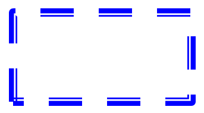

## **مقدمه**

در پاورپوینت می‌توانید اشکال را به اسلایدها اضافه کنید. چون اشکال از خطوط تشکیل شده‌اند، می‌توانید با تغییر یا اعمال اثرات به خطوط بیرونی آن‌ها را قالب‌بندی کنید. علاوه بر این، می‌توانید با تعیین تنظیماتی که نحوه پر شدن داخلی آن‌ها را کنترل می‌کند، اشکال را قالب‌بندی کنید.


Aspose.Slides برای C++ رابط‌ها و متدهایی را ارائه می‌دهد که به شما امکان می‌دهد اشکال را با استفاده از همان گزینه‌های موجود در پاورپوینت قالب‌بندی کنید.

## **قالب‌بندی خطوط**

با استفاده از Aspose.Slides می‌توانید یک سبک خط سفارشی برای یک شکل مشخص کنید. مراحل زیر روش کار را توضیح می‌دهند:

1. یک نمونه از کلاس [Presentation](https://reference.aspose.com/slides/fa/cpp/aspose.slides/presentation/) ایجاد کنید.
1. یک ارجاع به اسلاید را بر اساس ایندکس آن دریافت کنید.
1. یک [IAutoShape](https://reference.aspose.com/slides/fa/cpp/aspose.slides/iautoshape/) به اسلاید اضافه کنید.
1. خط‌سبک [line style](https://reference.aspose.com/slides/fa/cpp/aspose.slides/linestyle/) شکل را تنظیم کنید.
1. عرض خط را تنظیم کنید.
1. سبک خط ‌[dash style](https://reference.aspose.com/slides/fa/cpp/aspose.slides/linedashstyle/) را تنظیم کنید.
1. رنگ خط برای شکل را تنظیم کنید.
1. پرزنتیشن اصلاح‌شده را به‌عنوان فایل PPTX ذخیره کنید.

کد زیر نحوه قالب‌بندی یک `AutoShape` مستطیلی را نشان می‌دهد:

```cpp
// نمونه‌سازی کلاس Presentation که نمایانگر یک فایل ارائه است.
auto presentation = MakeObject<Presentation>();

// دریافت اولین اسلاید.
auto slide = presentation->get_Slide(0);

// یک شکل خودکار از نوع Rectangle اضافه کنید.
auto shape = slide->get_Shapes()->AddAutoShape(ShapeType::Rectangle, 50, 150, 150, 75);

// رنگ پر کردن برای شکل مستطیل تنظیم کنید.
shape->get_FillFormat()->set_FillType(FillType::NoFill);

// قالب‌بندی خطوط مستطیل را اعمال کنید.
shape->get_LineFormat()->set_Style(LineStyle::ThickThin);
shape->get_LineFormat()->set_Width(7);
shape->get_LineFormat()->set_DashStyle(LineDashStyle::Dash);

// رنگ خط مستطیل را تنظیم کنید.
shape->get_LineFormat()->get_FillFormat()->set_FillType(FillType::Solid);
shape->get_LineFormat()->get_FillFormat()->get_SolidFillColor()->set_Color(Color::get_Blue());

// فایل PPTX را بر روی دیسک ذخیره کنید.
presentation->Save(u"formatted_lines.pptx", SaveFormat::Pptx);
presentation->Dispose();
```

نتیجه:



## **قالب‌بندی سبک‌های اتصال**

در اینجا سه گزینه نوع اتصال موجود است:

* گرد
* میتر
* بویل

به‌ طور پیش‌فرض، وقتی پاورپوینت دو خط را در یک زاویه (مانند گوشه‌ی یک شکل) به‌هم می‌پیوندد، از تنظیم **گرد** استفاده می‌کند. اما اگر شکل با زوایای تیز رسم می‌کنید، ممکن است گزینه **میتر** را ترجیح دهید.


کد C++ زیر نشان می‌دهد که چگونه سه مستطیل (مانند تصویر بالا) با استفاده از تنظیمات نوع اتصال میتر، بویل و گرد ساخته شدند:

```cpp
// نمونه‌سازی کلاس Presentation که نمایانگر یک فایل ارائه است.
auto presentation = MakeObject<Presentation>();

// دریافت اولین اسلاید.
auto slide = presentation->get_Slide(0);

// سه شکل خودکار از نوع Rectangle اضافه کنید.
auto shape1 = slide->get_Shapes()->AddAutoShape(ShapeType::Rectangle, 20, 20, 150, 75);
auto shape2 = slide->get_Shapes()->AddAutoShape(ShapeType::Rectangle, 210, 20, 150, 75);
auto shape3 = slide->get_Shapes()->AddAutoShape(ShapeType::Rectangle, 20, 135, 150, 75);

// رنگ پر کردن برای هر شکل مستطیلی تنظیم کنید.
shape1->get_FillFormat()->set_FillType(FillType::Solid);
shape1->get_FillFormat()->get_SolidFillColor()->set_Color(Color::get_Black());
shape2->get_FillFormat()->set_FillType(FillType::Solid);
shape2->get_FillFormat()->get_SolidFillColor()->set_Color(Color::get_Black());
shape3->get_FillFormat()->set_FillType(FillType::Solid);
shape3->get_FillFormat()->get_SolidFillColor()->set_Color(Color::get_Black());

// عرض خط را تنظیم کنید.
shape1->get_LineFormat()->set_Width(15);
shape2->get_LineFormat()->set_Width(15);
shape3->get_LineFormat()->set_Width(15);

// رنگ خط هر مستطیل را تنظیم کنید.
shape1->get_LineFormat()->get_FillFormat()->set_FillType(FillType::Solid);
shape1->get_LineFormat()->get_FillFormat()->get_SolidFillColor()->set_Color(Color::get_Blue());
shape2->get_LineFormat()->get_FillFormat()->set_FillType(FillType::Solid);
shape2->get_LineFormat()->get_FillFormat()->get_SolidFillColor()->set_Color(Color::get_Blue());
shape3->get_LineFormat()->get_FillFormat()->set_FillType(FillType::Solid);
shape3->get_LineFormat()->get_FillFormat()->get_SolidFillColor()->set_Color(Color::get_Blue());

// سبک اتصال را تنظیم کنید.
shape1->get_LineFormat()->set_JoinStyle(LineJoinStyle::Miter);
shape2->get_LineFormat()->set_JoinStyle(LineJoinStyle::Bevel);
shape3->get_LineFormat()->set_JoinStyle(LineJoinStyle::Round);

// متن را به هر مستطیل اضافه کنید.
shape1->get_TextFrame()->set_Text(u"Miter Join Style");
shape2->get_TextFrame()->set_Text(u"Bevel Join Style");
shape3->get_TextFrame()->set_Text(u"Round Join Style");

// فایل PPTX را بر روی دیسک ذخیره کنید.
presentation->Save(u"join_styles.pptx", SaveFormat::Pptx);
presentation->Dispose();
```

## **پر کردن با گرادیان**

در پاورپوینت، پر کردن با گرادیان یک گزینه قالب‌بندی است که به شما اجازه می‌دهد ترکیبی پیوسته از رنگ‌ها را روی یک شکل اعمال کنید. به‌ عنوان مثال می‌توانید دو یا چند رنگ را به‌گونه‌ای که یکی به تدریج به دیگری محو شود، اعمال کنید.

در ادامه نحوه اعمال پر کردن با گرادیان به یک شکل با استفاده از Aspose.Slides آورده شده است:

1. یک نمونه از کلاس [Presentation](https://reference.aspose.com/slides/fa/cpp/aspose.slides/presentation/) ایجاد کنید.
1. یک ارجاع به اسلاید را بر اساس ایندکس آن دریافت کنید.
1. یک [IAutoShape](https://reference.aspose.com/slides/fa/cpp/aspose.slides/iautoshape/) به اسلاید اضافه کنید.
1. مقدار [FillType](https://reference.aspose.com/slides/fa/cpp/aspose.slides/filltype/) شکل را به `Gradient` تنظیم کنید.
1. دو رنگ دلخواه خود را با موقعیت‌های تعریف‌شده با استفاده از متدهای `Add` مجموعه توقف‌های گرادیان که توسط رابط [IGradientFormat](https://reference.aspose.com/slides/fa/cpp/aspose.slides/igradientformat/) در دسترس است، اضافه کنید.
1. پرزنتیشن اصلاح‌شده را به‌عنوان فایل PPTX ذخیره کنید.

کد C++ زیر نحوه اعمال اثر پر کردن با گرادیان به یک بیضی را نشان می‌دهد:

```cpp
// نمونه‌سازی کلاس Presentation که نمایانگر یک فایل ارائه است.
auto presentation = MakeObject<Presentation>();

// دریافت اولین اسلاید.
auto slide = presentation->get_Slide(0);

// یک شکل خودکار از نوع Ellipse اضافه کنید.
auto shape = slide->get_Shapes()->AddAutoShape(ShapeType::Ellipse, 50, 50, 150, 75);

// قالب‌بندی گرادیان را بر روی بیضی اعمال کنید.
shape->get_FillFormat()->set_FillType(FillType::Gradient);
shape->get_FillFormat()->get_GradientFormat()->set_GradientShape(GradientShape::Linear);

// جهت گرادیان را تنظیم کنید.
shape->get_FillFormat()->get_GradientFormat()->set_GradientDirection(GradientDirection::FromCorner2);

// دو نقطه توقف گرادیان اضافه کنید.
shape->get_FillFormat()->get_GradientFormat()->get_GradientStops()->Add(1.0f, PresetColor::Purple);
shape->get_FillFormat()->get_GradientFormat()->get_GradientStops()->Add(0.0f, PresetColor::Red);

// فایل PPTX را بر روی دیسک ذخیره کنید.
presentation->Save(u"gradient_fill.pptx", SaveFormat::Pptx);
presentation->Dispose();
```

نتیجه:


## **پر کردن با الگو**

در پاورپوینت، پر کردن با الگو یک گزینه قالب‌بندی است که به شما امکان می‌دهد یک طرح دو رنگی—مانند نقطه‌ها، خطوط، شبکات یا شطرنجی—را بر روی یک شکل اعمال کنید. می‌توانید رنگ‌های سفارشی برای پیش‌زمینه و پس‌زمینه الگو انتخاب کنید.

Aspose.Slides بیش از ۴۵ سبک الگوی پیش‌تعریف‌شده را ارائه می‌دهد که می‌توانید برای بهبود ظاهر ارائه‌های خود از آن‌ها استفاده کنید. حتی پس از انتخاب یک الگوی پیش‌تعریف‌شده، می‌توانید دقیقاً رنگ‌هایی که باید استفاده شوند را مشخص کنید.

در ادامه نحوه اعمال پر کردن با الگو به یک شکل با استفاده از Aspose.Slides آورده شده است:

1. یک نمونه از کلاس [Presentation](https://reference.aspose.com/slides/fa/cpp/aspose.slides/presentation/) ایجاد کنید.
1. یک ارجاع به اسلاید را بر اساس ایندکس آن دریافت کنید.
1. یک [IAutoShape](https://reference.aspose.com/slides/fa/cpp/aspose.slides/iautoshape/) به اسلاید اضافه کنید.
1. مقدار [FillType](https://reference.aspose.com/slides/fa/cpp/aspose.slides/filltype/) شکل را به `Pattern` تنظیم کنید.
1. یک سبک الگو از گزینه‌های پیش‌تعریف‌شده انتخاب کنید.
1. [Background Color](https://reference.aspose.com/slides/fa/cpp/aspose.slides/ipatternformat/get_backcolor/) الگو را تنظیم کنید.
1. [Foreground Color](https://reference.aspose.com/slides/fa/cpp/aspose.slides/ipatternformat/get_forecolor/) الگو را تنظیم کنید.
1. پرزنتیشن اصلاح‌شده را به‌عنوان فایل PPTX ذخیره کنید.

کد C++ زیر نحوه اعمال پر کردن با الگو به یک مستطیل را نشان می‌دهد:

```cpp
// نمونه‌سازی کلاس Presentation که نمایانگر یک فایل ارائه است.
auto presentation = MakeObject<Presentation>();

// دریافت اولین اسلاید.
auto slide = presentation->get_Slide(0);

// یک شکل خودکار از نوع Rectangle اضافه کنید.
auto shape = slide->get_Shapes()->AddAutoShape(ShapeType::Rectangle, 50, 50, 150, 75);

// نوع پر کردن را به Pattern تنظیم کنید.
shape->get_FillFormat()->set_FillType(FillType::Pattern);

// سبک الگو را تنظیم کنید.
shape->get_FillFormat()->get_PatternFormat()->set_PatternStyle(PatternStyle::Trellis);

// رنگ‌های پس‌زمینه و پیش‌زمینه الگو را تنظیم کنید.
shape->get_FillFormat()->get_PatternFormat()->get_BackColor()->set_Color(Color::get_LightGray());
shape->get_FillFormat()->get_PatternFormat()->get_ForeColor()->set_Color(Color::get_Yellow());

// فایل PPTX را بر روی دیسک ذخیره کنید.
presentation->Save(u"pattern_fill.pptx", SaveFormat::Pptx);
presentation->Dispose();
```

نتیجه:


## **پر کردن با تصویر**

در پاورپوینت، پر کردن با تصویر یک گزینه قالب‌بندی است که به شما اجازه می‌دهد تصویری را داخل یک شکل قرار دهید—به‌طوری که تصویر به‌عنوان پس‌زمینهٔ شکل استفاده شود.

در ادامه نحوه استفاده از Aspose.Slides برای اعمال پر کردن با تصویر به یک شکل آورده شده است:

1. یک نمونه از کلاس [Presentation](https://reference.aspose.com/slides/fa/cpp/aspose.slides/presentation/) ایجاد کنید.
1. یک ارجاع به اسلاید را بر اساس ایندکس آن دریافت کنید.
1. یک [IAutoShape](https://reference.aspose.com/slides/fa/cpp/aspose.slides/iautoshape/) به اسلاید اضافه کنید.
1. مقدار [FillType](https://reference.aspose.com/slides/fa/cpp/aspose.slides/filltype/) شکل را به `Picture` تنظیم کنید.
1. حالت پر کردن تصویر را به `Tile` (یا حالت دلخواه دیگر) تنظیم کنید.
1. یک شیء [IPPImage](https://reference.aspose.com/slides/fa/cpp/aspose.slides/ippimage/) از تصویری که می‌خواهید استفاده کنید، ایجاد کنید.
1. تصویر را به متد `ISlidesPicture.set_Image` پاس دهید.
1. پرزنتیشن اصلاح‌شده را به‌عنوان فایل PPTX ذخیره کنید.

فرض کنید فایلی به نام "lotus.png" با تصویر زیر داریم:


کد C++ زیر نحوه پر کردن یک شکل با تصویر را نشان می‌دهد:

```cpp
// نمونه‌سازی کلاس Presentation که نمایانگر یک فایل ارائه است.
auto presentation = MakeObject<Presentation>();

// دریافت اولین اسلاید.
auto slide = presentation->get_Slide(0);

// یک شکل خودکار از نوع Rectangle اضافه کنید.
auto shape = slide->get_Shapes()->AddAutoShape(ShapeType::Rectangle, 50, 50, 255, 130);

// نوع پر کردن را به Picture تنظیم کنید.
shape->get_FillFormat()->set_FillType(FillType::Picture);

// حالت پر کردن تصویر را تنظیم کنید.
shape->get_FillFormat()->get_PictureFillFormat()->set_PictureFillMode(PictureFillMode::Tile);

// یک تصویر بارگذاری کنید و آن را به منابع ارائه اضافه کنید.
auto image = Images::FromFile(u"lotus.png");
auto picture = presentation->get_Images()->AddImage(image);
image->Dispose();

// تصویر را تنظیم کنید.
shape->get_FillFormat()->get_PictureFillFormat()->get_Picture()->set_Image(picture);

// فایل PPTX را بر روی دیسک ذخیره کنید.
presentation->Save(u"picture_fill.pptx", SaveFormat::Pptx);
presentation->Dispose();
```

نتیجه:


### **تصویر کاشی‌شده به عنوان بافت**

اگر می‌خواهید یک تصویر کاشی‌شده را به‌عنوان بافت تنظیم کنید و رفتار کاشی‌بندی را سفارشی کنید، می‌توانید از متدهای زیر رابط [IPictureFillFormat](https://reference.aspose.com/slides/fa/cpp/aspose.slides/ipicturefillformat/) و کلاس [PictureFillFormat](https://reference.aspose.com/slides/fa/cpp/aspose.slides/picturefillformat/) استفاده کنید:

- [set_PictureFillMode](https://reference.aspose.com/slides/fa/cpp/aspose.slides/ipicturefillformat/set_picturefillmode/): حالت پر کردن تصویر را تعیین می‌کند—یا `Tile` یا `Stretch`.
- [set_TileAlignment](https://reference.aspose.com/slides/fa/cpp/aspose.slides/ipicturefillformat/set_tilealignment/): تراز کاشی‌ها را درون شکل مشخص می‌کند.
- [set_TileFlip](https://reference.aspose.com/slides/fa/cpp/aspose.slides/ipicturefillformat/set_tileflip/): تعیین می‌کند که آیا کاشی به‌صورت افقی، عمودی یا هر دو برعکس شود.
- [set_TileOffsetX](https://reference.aspose.com/slides/fa/cpp/aspose.slides/ipicturefillformat/set_tileoffsetx/): به‌صورت افقی (به‌واحد نقطه) از مبدأ شکل مقدار جابجایی X را تنظیم می‌کند.
- [set_TileOffsetY](https://reference.aspose.com/slides/fa/cpp/aspose.slides/ipicturefillformat/set_tileoffsety/): به‌صورت عمودی (به‌واحد نقطه) از مبدأ شکل مقدار جابجایی Y را تنظیم می‌کند.
- [set_TileScaleX](https://reference.aspose.com/slides/fa/cpp/aspose.slides/ipicturefillformat/set_tilescalex/): مقیاس افقی کاشی را به‌صورت درصد تعریف می‌کند.
- [set_TileScaleY](https://reference.aspose.com/slides/fa/cpp/aspose.slides/ipicturefillformat/set_tilescaley/): مقیاس عمودی کاشی را به‌صورت درصد تعریف می‌کند.

کد نمونه زیر نشان می‌دهد چگونه یک شکل مستطیلی با پر کردن تصویر کاشی‌شده اضافه کرده و گزینه‌های کاشی را پیکربندی کنید:

```cpp
// نمونه‌سازی کلاس Presentation که نمایانگر یک فایل ارائه است.
auto presentation = MakeObject<Presentation>();

// دریافت اولین اسلاید.
auto firstSlide = presentation->get_Slide(0);

// اضافه کردن یک شکل خودکار مستطیل.
auto shape = firstSlide->get_Shapes()->AddAutoShape(ShapeType::Rectangle, 50, 50, 190, 95);

// نوع پر کردن شکل را به Picture تنظیم کنید.
shape->get_FillFormat()->set_FillType(FillType::Picture);

// تصویر را بارگذاری کنید و به منابع ارائه اضافه کنید.
auto sourceImage = Images::FromFile(u"lotus.png");
auto presentationImage = presentation->get_Images()->AddImage(sourceImage);
sourceImage->Dispose();

// تصویر را به شکل اختصاص دهید.
auto pictureFillFormat = shape->get_FillFormat()->get_PictureFillFormat();
pictureFillFormat->get_Picture()->set_Image(presentationImage);

// پیکربندی حالت پر کردن تصویر و ویژگی‌های کاشی‌بندی.
pictureFillFormat->set_PictureFillMode(PictureFillMode::Tile);
pictureFillFormat->set_TileOffsetX(-32);
pictureFillFormat->set_TileOffsetY(-32);
pictureFillFormat->set_TileScaleX(50);
pictureFillFormat->set_TileScaleY(50);
pictureFillFormat->set_TileAlignment(RectangleAlignment::BottomRight);
pictureFillFormat->set_TileFlip(TileFlip::FlipBoth);

// ذخیره فایل PPTX بر روی دیسک.
presentation->Save(u"tile.pptx", SaveFormat::Pptx);
presentation->Dispose();
```

نتیجه:


## **پر کردن با رنگ ثابت**

در پاورپوینت، پر کردن با رنگ ثابت یک گزینه قالب‌بندی است که شکل را با یک رنگ یکنواخت پر می‌کند. این رنگ پس‌زمینه ساده بدون هیچ‌گونه گرادیان، بافت یا الگو اعمال می‌شود.

برای اعمال پر کردن با رنگ ثابت به یک شکل با استفاده از Aspose.Slides، مراحل زیر را دنبال کنید:

1. یک نمونه از کلاس [Presentation](https://reference.aspose.com/slides/fa/cpp/aspose.slides/presentation/) ایجاد کنید.
1. یک ارجاع به اسلاید را بر اساس ایندکس آن دریافت کنید.
1. یک [IAutoShape](https://reference.aspose.com/slides/fa/cpp/aspose.slides/iautoshape/) به اسلاید اضافه کنید.
1. مقدار [FillType](https://reference.aspose.com/slides/fa/cpp/aspose.slides/filltype/) شکل را به `Solid` تنظیم کنید.
1. رنگ پر کردن دلخواه خود را به شکل اختصاص دهید.
1. پرزنتیشن اصلاح‌شده را به‌عنوان فایل PPTX ذخیره کنید.

کد C++ زیر نحوه اعمال پر کردن با رنگ ثابت به یک مستطیل در اسلاید پاورپوینت را نشان می‌دهد:

```cpp
// نمونه‌سازی کلاس Presentation که نمایانگر یک فایل ارائه است.
auto presentation = MakeObject<Presentation>();

// دریافت اولین اسلاید.
auto slide = presentation->get_Slide(0);

// یک شکل خودکار از نوع Rectangle اضافه کنید.
auto shape = slide->get_Shapes()->AddAutoShape(ShapeType::Rectangle, 50, 50, 150, 75);

// نوع پر کردن را به Solid تنظیم کنید.
shape->get_FillFormat()->set_FillType(FillType::Solid);

// رنگ پر کردن را تنظیم کنید.
shape->get_FillFormat()->get_SolidFillColor()->set_Color(Color::get_Yellow());

// فایل PPTX را بر روی دیسک ذخیره کنید.
presentation->Save(u"solid_color_fill.pptx", SaveFormat::Pptx);
presentation->Dispose();
```

نتیجه:


## **تنظیم شفافیت**

در پاورپوینت، وقتی پر کردن رنگ ثابت، گرادیان، تصویر یا بافت را بر روی اشکال اعمال می‌کنید، می‌توانید سطح شفافیت را نیز تنظیم کنید تا میزان شفافیت پر کردن را کنترل کنید. مقدار شفافیت بالاتر باعث می‌شود شکل بیشتر شفاف باشد و پس‌زمینه یا اشیای زیرین به‌صورت جزئی دیده شوند.

Aspose.Slides به شما امکان می‌دهد سطح شفافیت را با تنظیم مقدار آلفا در رنگ مورد استفاده برای پر کردن تنظیم کنید. در ادامه نحوه انجام این کار آمده است:

1. یک نمونه از کلاس [Presentation](https://reference.aspose.com/slides/fa/cpp/aspose.slides/presentation/) ایجاد کنید.
1. یک ارجاع به اسلاید را بر اساس ایندکس آن دریافت کنید.
1. یک [IAutoShape](https://reference.aspose.com/slides/fa/cpp/aspose.slides/iautoshape/) به اسلاید اضافه کنید.
1. مقدار [FillType](https://reference.aspose.com/slides/fa/cpp/aspose.slides/filltype/) را به `Solid` تنظیم کنید.
1. از `Color` برای تعریف رنگی با شفافیت استفاده کنید (مؤلفه `alpha` شفافیت را کنترل می‌کند).
1. پرزنتیشن را ذخیره کنید.

کد C++ زیر نحوه اعمال رنگ پر کردن شفاف به یک مستطیل را نشان می‌دهد:

```cpp
// نمونه‌سازی کلاس Presentation که نمایانگر یک فایل ارائه است.
auto presentation = MakeObject<Presentation>();

// دریافت اولین اسلاید.
auto slide = presentation->get_Slide(0);

// اضافه کردن یک شکل خودکار مستطیل ثابت.
auto solidShape = slide->get_Shapes()->AddAutoShape(ShapeType::Rectangle, 50, 50, 150, 75);

// اضافه کردن یک شکل خودکار مستطیل شفاف بر روی شکل ثابت.
auto transparentShape = slide->get_Shapes()->AddAutoShape(ShapeType::Rectangle, 80, 80, 150, 75);
transparentShape->get_FillFormat()->set_FillType(FillType::Solid);
transparentShape->get_FillFormat()->get_SolidFillColor()->set_Color(Color::FromArgb(204, 255, 255, 0));

// ذخیره فایل PPTX بر روی دیسک.
presentation->Save(u"shape_transparency.pptx", SaveFormat::Pptx);
presentation->Dispose();
```

نتیجه:


## **چرخاندن اشکال**

Aspose.Slides به شما امکان می‌دهد اشکال را در ارائه‌های پاورپوینت چرخانده و موقعیت آن‌ها را با تنظیمات خاصی تنظیم کنید.

برای چرخاندن یک شکل در اسلاید، مراحل زیر را دنبال کنید:

1. یک نمونه از کلاس [Presentation](https://reference.aspose.com/slides/fa/cpp/aspose.slides/presentation/) ایجاد کنید.
1. یک ارجاع به اسلاید را بر اساس ایندکس آن دریافت کنید.
1. یک [IAutoShape](https://reference.aspose.com/slides/fa/cpp/aspose.slides/iautoshape/) به اسلاید اضافه کنید.
1. ویژگی چرخش شکل را به زاویه موردنظر تنظیم کنید.
1. پرزنتیشن را ذخیره کنید.

کد C++ زیر چرخش یک شکل به‌مقدار 5 درجه را نشان می‌دهد:

```cpp
// نمونه‌سازی کلاس Presentation که نمایانگر یک فایل ارائه است.
auto presentation = MakeObject<Presentation>();

// دریافت اولین اسلاید.
auto slide = presentation->get_Slide(0);

// یک شکل خودکار از نوع Rectangle اضافه کنید.
auto shape = slide->get_Shapes()->AddAutoShape(ShapeType::Rectangle, 50, 50, 150, 75);

// چرخاندن شکل به‌مقدار 5 درجه.
shape->set_Rotation(5);

// فایل PPTX را بر روی دیسک ذخیره کنید.
presentation->Save(u"shape_rotation.pptx", SaveFormat::Pptx);
presentation->Dispose();
```

نتیجه:


## **افزودن اثرات برجستگی 3 بعدی**

Aspose.Slides به شما اجازه می‌دهد اثرات برجستگی 3 بعدی را بر روی اشکال با پیکربندی ویژگی‌های [ThreeDFormat](https://reference.aspose.com/slides/fa/cpp/aspose.slides/threedformat/) اعمال کنید.

برای افزودن اثرات برجستگی 3 بعدی به یک شکل، مراحل زیر را دنبال کنید:

1. یک نمونه از کلاس [Presentation](https://reference.aspose.com/slides/fa/cpp/aspose.slides/presentation/) ایجاد کنید.
1. یک ارجاع به اسلاید را بر اساس ایندکس آن دریافت کنید.
1. یک [IAutoShape](https://reference.aspose.com/slides/fa/cpp/aspose.slides/iautoshape/) به اسلاید اضافه کنید.
1. ویژگی‌های [ThreeDFormat](https://reference.aspose.com/slides/fa/cpp/aspose.slides/threedformat/) شکل را برای تعریف تنظیمات برجستگی پیکربندی کنید.
1. پرزنتیشن را ذخیره کنید.

کد C++ زیر نشان می‌دهد چگونه اثرات برجستگی 3 بعدی را بر روی یک شکل اعمال کنید:

```cpp
// یک نمونه از کلاس Presentation ایجاد کنید.
auto presentation = MakeObject<Presentation>();

auto slide = presentation->get_Slide(0);

// اضافه کردن یک شکل به اسلاید.
auto shape = slide->get_Shapes()->AddAutoShape(ShapeType::Ellipse, 50, 50, 100, 100);
shape->get_FillFormat()->set_FillType(FillType::Solid);
shape->get_FillFormat()->get_SolidFillColor()->set_Color(Color::get_Green());
shape->get_LineFormat()->get_FillFormat()->set_FillType(FillType::Solid);
shape->get_LineFormat()->get_FillFormat()->get_SolidFillColor()->set_Color(Color::get_Orange());
shape->get_LineFormat()->set_Width(2.0);

// تنظیم ویژگی‌های ThreeDFormat شکل.
shape->get_ThreeDFormat()->set_Depth(4.0);
shape->get_ThreeDFormat()->get_BevelTop()->set_BevelType(BevelPresetType::Circle);
shape->get_ThreeDFormat()->get_BevelTop()->set_Height(6);
shape->get_ThreeDFormat()->get_BevelTop()->set_Width(6);
shape->get_ThreeDFormat()->get_Camera()->set_CameraType(CameraPresetType::OrthographicFront);
shape->get_ThreeDFormat()->get_LightRig()->set_LightType(LightRigPresetType::ThreePt);
shape->get_ThreeDFormat()->get_LightRig()->set_Direction(LightingDirection::Top);

// ذخیره ارائه به‌صورت فایل PPTX.
presentation->Save(u"3D_bevel_effect.pptx", SaveFormat::Pptx);
presentation->Dispose();
```

نتیجه:


## **افزودن اثرات چرخش 3 بعدی**

Aspose.Slides به شما اجازه می‌دهد اثرات چرخش 3 بعدی را بر روی اشکال با پیکربندی ویژگی‌های [ThreeDFormat](https://reference.aspose.com/slides/fa/cpp/aspose.slides/threedformat/) اعمال کنید.

برای اعمال چرخش 3 بعدی به یک شکل:

1. یک نمونه از کلاس [Presentation](https://reference.aspose.com/slides/fa/cpp/aspose.slides/presentation/) ایجاد کنید.
1. یک ارجاع به اسلاید را بر اساس ایندکس آن دریافت کنید.
1. یک [IAutoShape](https://reference.aspose.com/slides/fa/cpp/aspose.slides/iautoshape/) به اسلاید اضافه کنید.
1. از متدهای [set_CameraType](https://reference.aspose.com/slides/fa/cpp/aspose.slides/icamera/set_cameratype/) و [set_LightType](https://reference.aspose.com/slides/fa/cpp/aspose.slides/ilightrig/set_lighttype/) برای تعریف چرخش 3 بعدی استفاده کنید.
1. پرزنتیشن را ذخیره کنید.

کد C++ زیر نشان می‌دهد چگونه اثرات چرخش 3 بعدی را بر روی یک شکل اعمال کنید:

```cpp
// یک نمونه از کلاس Presentation ایجاد کنید.
auto presentation = MakeObject<Presentation>();

auto slide = presentation->get_Slide(0);

auto shape = slide->get_Shapes()->AddAutoShape(ShapeType::Rectangle, 50, 50, 150, 75);
shape->get_TextFrame()->set_Text(u"Hello, Aspose!");

shape->get_ThreeDFormat()->set_Depth(6);
shape->get_ThreeDFormat()->get_Camera()->SetRotation(40, 35, 20);
shape->get_ThreeDFormat()->get_Camera()->set_CameraType(CameraPresetType::IsometricLeftUp);
shape->get_ThreeDFormat()->get_LightRig()->set_LightType(LightRigPresetType::Balanced);

// ارائه را به‌عنوان فایل PPTX ذخیره کنید.
presentation->Save(u"3D_rotation_effect.pptx", SaveFormat::Pptx);
presentation->Dispose();
```

نتیجه:


## **بازنشانی قالب‌بندی**

کد C++ زیر نشان می‌دهد چگونه قالب‌بندی یک اسلاید را بازنشانی کرده و موقعیت، اندازه و قالب‌بندی تمام اشکالی که دارای جای‌نگهدارنده در [LayoutSlide](https://reference.aspose.com/slides/fa/cpp/aspose.slides/layoutslide/) هستند را به تنظیمات پیش‌فرض برگردانید:

```cpp
auto presentation = MakeObject<Presentation>(u"sample.pptx");

for (auto&& slide : presentation->get_Slides())
{
    // بازنشانی هر شکلی در اسلاید که یک جای‌نگهدارنده در طرح‌بندی دارد.
    slide->Reset();
}

presentation->Save(u"reset_formatting.pptx", SaveFormat::Pptx);
presentation->Dispose();
```

## **پرسش‌های متداول**

**آیا قالب‌بندی شکل بر اندازه نهایی فایل ارائه تأثیر می‌گذارد؟**

تنها به‌صورت جزئی. تصاویر و رسانه‌های جاسازی‌شده بیشتر فضای فایل را اشغال می‌کنند، در حالی که پارامترهای شکل مانند رنگ‌ها، اثرات و گرادیان‌ها به‌عنوان متادیتا ذخیره می‌شوند و تقریباً هیچ حجم اضافی اضافه نمی‌کنند.

**چگونه می‌توانم اشکالی را در یک اسلاید که قالب‌بندی یکسانی دارند شناسایی کنم تا بتوانم آن‌ها را گروه‌بندی کنم؟**

ویژگی‌های اصلی قالب‌بندی هر شکل—تنظیمات پر، خط و اثر—را مقایسه کنید. اگر تمام مقادیر متناظر یکسان بودند، سبک‌های آن‌ها را یکسان در نظر بگیرید و منطقی این اشکال را گروه‌بندی کنید که مدیریت سبک‌های بعدی را ساده می‌کند.

**آیا می‌توانم مجموعه‌ای از سبک‌های سفارشی شکل را در فایلی جداگانه ذخیره کرده و در ارائه‌های دیگر دوباره استفاده کنم؟**

بله. اشکال نمونه با سبک‌های دلخواه را در یک اسلاید قالب یا فایل قالب .POTX ذخیره کنید. هنگام ایجاد یک ارائه جدید، قالب را باز کنید، اشکال سبک‌دار موردنیاز را کپی کنید و قالب‌بندی آن‌ها را در مکان‌های لازم دوباره اعمال کنید.