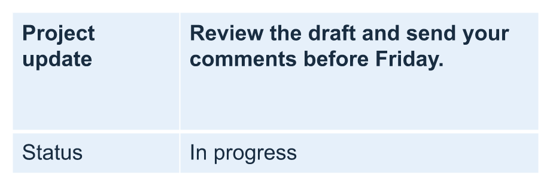

## **معرفی**

Aspose.Slides for C++ به شما امکان مدیریت ساختار جدول و قالب‌بندی آن را در ارائه‌های PowerPoint از طریق کلاس [Table](https://reference.aspose.com/slides/cpp/aspose.slides/table/) و رابط‌ کاربری [ITable](https://reference.aspose.com/slides/cpp/aspose.slides/itable/) می‌دهد. می‌توانید یک سطر سرصفحه تعیین کنید، سطرها و ستون‌ها را کلون یا حذف کنید و قالب‌بندی متن را به یک سطر یا ستون کامل اعمال کنید.

این مقاله این عملیات‌ها را با مثال‌های C++ توضیح می‌دهد. همچنین نشان می‌دهد چگونه پیش‌تنظیم سبک جدول را بازیابی کنید تا بتوانید دوباره از آن استفاده کنید. شاخص‌های سطر و ستون جدول از صفر آغاز می‌شوند.

## **کنترل ارتفاع سطر**

از [IRow::set_MinimalHeight](https://reference.aspose.com/slides/cpp/aspose.slides/irow/set_minimalheight/) برای تنظیم حداقل ارتفاع سطر بر حسب نقطه استفاده کنید. این مقدار یک حد پایین است، نه ارتفاع ثابت. متد [IRow::get_Height](https://reference.aspose.com/slides/cpp/aspose.slides/irow/get_height/) ارتفاع واقعی را برمی‌گرداند؛ این مقدار را نمی‌توان به طور مستقیم تنظیم کرد. سطر را از طریق [ITable::get_Rows](https://reference.aspose.com/slides/cpp/aspose.slides/itable/get_rows/) دسترسی پیدا کنید.

مثال فایل [row-height-input.pptx](row-height-input.pptx) را بارگذاری می‌کند که یک جدول به عنوان اولین شکل در اولین اسلاید دارد. سطر اول آن از ۷۰ نقطه شروع می‌شود. سلول‌ها از متن Arial با اندازه ۱۸ نقطه، بسته شدن متن و حاشیهٔ بالایی و پایینی ۶ نقطه استفاده می‌کنند؛ متن طولانی‌تر در ستون دوم به خطوط متعدد می‌پیچد. مثال حداقل را به ۱۰۰ نقطه افزایش می‌دهد، سپس به ۲۰ نقطه کاهش می‌دهد، بعد از هر تغییر ارتفاع واقعی را چاپ می‌کند و هر دو نتیجه را ذخیره می‌نماید.

```cpp
#include <DOM/Presentation.h>
#include <DOM/ISlide.h>
#include <DOM/IShapeCollection.h>
#include <DOM/Table/ITable.h>
#include <Export/SaveFormat.h>
#include <DOM/Table/IRowCollection.h>
#include <DOM/Table/IRow.h>
#include <system/console.h>

using namespace Aspose::Slides;
using namespace Aspose::Slides::Export;
using namespace System;

auto presentation = MakeObject<Presentation>(u"row-height-input.pptx");
auto slide = presentation->get_Slide(0);

auto table = ExplicitCast<ITable>(slide->get_Shape(0));
auto row = table->get_Rows()->idx_get(0);

row->set_MinimalHeight(100);
Console::WriteLine(u"Increased: minimum = {0:F1}, actual = {1:F1} pt", row->get_MinimalHeight(), row->get_Height());
presentation->Save(u"row-height-increased.pptx", SaveFormat::Pptx);

row->set_MinimalHeight(20);
Console::WriteLine(u"Decreased: minimum = {0:F1}, actual = {1:F1} pt", row->get_MinimalHeight(), row->get_Height());
presentation->Save(u"row-height-decreased.pptx", SaveFormat::Pptx);
```

با ارائهٔ ارائه‌شده، افزایش حداقل فضای بیشتری به سطر اضافه می‌کند. کاهش آن این فضای اضافه را حذف می‌کند، اما ارتفاع واقعی بیشتر از ۲۰ نقطه می‌ماند زیرا متن و حاشیه‌های سلول به فضای بیشتری نیاز دارند. فقط کاهش حداقل نمی‌تواند سطر را زیر فضای مورد نیاز محتوا هدایت کند.

چند عامل بر ارتفاع واقعی تأثیر می‌گذارند:

- **متن و اندازهٔ قلم:** متن طولانی‌تر، شکست خط صریح یا قلم بزرگ‌تر می‌تواند فضای عمودی بیشتری بطلبد.
- **پوشش‌دهی و عرض ستون:** با فعال بودن پوشش‌دهی، کاهش عرض ستون با [IColumn::set_Width](https://reference.aspose.com/slides/cpp/aspose.slides/icolumn/set_width/) می‌تواند خطوط بیشتری ایجاد کند. ستون عریض‌تر می‌تواند فضای عمودی مورد نیاز را کاهش دهد.
- **حاشیهٔ سلول:** [ICell::set_MarginTop](https://reference.aspose.com/slides/cpp/aspose.slides/icell/set_margintop/) و [ICell::set_MarginBottom](https://reference.aspose.com/slides/cpp/aspose.slides/icell/set_marginbottom/) حاشیه‌هایی را که فضای عمودی اضافه می‌کند کنترل می‌کنند. [ICell::set_MarginLeft](https://reference.aspose.com/slides/cpp/aspose.slides/icell/set_marginleft/) و [ICell::set_MarginRight](https://reference.aspose.com/slides/cpp/aspose.slides/icell/set_marginright/) حاشیه‌هایی را که عرض متن را کاهش می‌دهد و می‌تواند پوشش‌دهی اضافی ایجاد کند، تنظیم می‌کنند.

برای این جدول بدون سلول‌های ادغام‌شده، سلولی که بیشترین فضای عمودی را می‌طلبد، حد پایین محتوا‑محور برای تمام سطر را تعیین می‌کند. برای کوتاه‌تر کردن سطر ممکن است لازم باشد متن را کوتاه کنید، اندازهٔ قلم یا حاشیه‌ها را کاهش دهید یا ستون را عریض‌تر کنید.

تصاویر زیر همان جدول را با مقیاس یکسان نشان می‌دهند. در اجرای .NET مرجع نمایش داده‌شده در اینجا، ارتفاع‌های واقعی ۷۰، ۱۰۰ و ۵۵٫۲ نقطه بودند: سطر نهایی بلندتر از حداقل ۲۰ نقطه باقی ماند. اندازه‌گیری دقیق متن می‌تواند با قلم‌های موجود در محیط شما متفاوت باشد. نتایج ذخیره‌شده را دانلود کنید: [increased minimum](row-height-increased.pptx) و [decreased minimum](row-height-decreased.pptx).

| اصلی: حداقل ۷۰ pt، واقعی ۷۰ pt | افزایش یافته: حداقل ۱۰۰ pt، واقعی ۱۰۰ pt | کاهش یافته: حداقل ۲۰ pt، واقعی ۵۵٫۲ pt |
| --- | --- | --- |
|  |  |  |

## **تنظیم سطر اول به عنوان سرصفحه**

از متد [set_FirstRow](https://reference.aspose.com/slides/cpp/aspose.slides/itable/set_firstrow/) برای علامت‌گذاری سطر اول به عنوان سرصفحه استفاده کنید. ظاهر آن بستگی به سبک جدولی دارد که بر جدول اعمال شده است.

1. ارائه را با کلاس [Presentation](https://reference.aspose.com/slides/cpp/aspose.slides/presentation/) بارگذاری کنید.
2. اولین اسلاید را دسترسی پیدا کنید.
3. جدول ذخیره‌شده به عنوان اولین شکل در اسلاید را دسترسی پیدا کنید.
4. قالب‌بندی سرصفحه را برای سطر اول فعال کنید.
5. ارائهٔ اصلاح‌شده را ذخیره کنید.

مثال به `table.pptx` نیاز دارد که جدول به عنوان اولین شکل در اولین اسلاید دارد. قالب‌بندی سرصفحه برای سطر اول فعال می‌شود و `First_row_header.pptx` ذخیره می‌شود.

```cpp
#include <DOM/Presentation.h>
#include <DOM/ISlide.h>
#include <DOM/IShapeCollection.h>
#include <DOM/Table/ITable.h>
#include <Export/SaveFormat.h>

using namespace Aspose::Slides;
using namespace Aspose::Slides::Export;
using namespace System;

auto presentation = MakeObject<Presentation>(u"table.pptx");
auto slide = presentation->get_Slide(0);

auto table = ExplicitCast<ITable>(slide->get_Shape(0));
table->set_FirstRow(true);

presentation->Save(u"First_row_header.pptx", SaveFormat::Pptx);
```

## **کلون کردن سطر یا ستون جدول**

سطرها یا ستون‌ها را کلون کنید تا محتوا و قالب‌بندی آن‌ها را مجدداً استفاده کنید. می‌توانید یک کپی را به انتهای جدول اضافه کنید یا در موقعیت خاصی وارد کنید.

1. ارائه را با کلاس [Presentation](https://reference.aspose.com/slides/cpp/aspose.slides/presentation/) بارگذاری کنید.
2. اولین اسلاید را دسترسی پیدا کنید.
3. عرض ستون‌ها و ارتفاع سطرها را تعریف کنید.
4. جدول را با متد [AddTable](https://reference.aspose.com/slides/cpp/aspose.slides/ishapecollection/addtable/) اضافه کنید.
5. سطرهای مورد نیاز را کلون کنید.
6. ستون‌های مورد نیاز را کلون کنید.
7. ارائهٔ اصلاح‌شده را ذخیره کنید.

مثال به `Test.pptx` نیاز دارد که حداقل یک اسلاید داشته باشد. جدولی با سه ستون و پنج سطر ایجاد می‌کند که ابعاد آن‌ها بر حسب نقطه مشخص شده‌اند. کپی‌های سطر و ستون اول را اضافه می‌کند، سپس کپی‌های سطر و ستون دوم را در شاخص ۳ (موقعیت چهارم) وارد می‌کند. جدول نهایی دارای هفت سطر و پنج ستون است. آرگومان `false` کلون شدن در سطرها یا ستون‌های ادغام‌شدهٔ همجوار را غیرفعال می‌کند؛ این جدول سلول ادغام‌شده‌ای ندارد.

```cpp
#include <DOM/Presentation.h>
#include <DOM/ISlide.h>
#include <DOM/IShapeCollection.h>
#include <DOM/Table/ITable.h>
#include <Export/SaveFormat.h>
#include <DOM/Table/IRowCollection.h>
#include <DOM/Table/IColumnCollection.h>
#include <DOM/ITextFrame.h>
#include <DOM/Table/ICell.h>
#include <system/array.h>

using namespace Aspose::Slides;
using namespace Aspose::Slides::Export;
using namespace System;

auto presentation = MakeObject<Presentation>(u"Test.pptx");
auto slide = presentation->get_Slide(0);

auto columnWidths = MakeArray<double>({ 50, 50, 50 });
auto rowHeights = MakeArray<double>({ 50, 30, 30, 30, 30 });
auto table = slide->get_Shapes()->AddTable(100, 50, columnWidths, rowHeights);

table->idx_get(0, 0)->get_TextFrame()->set_Text(u"Row 1 Cell 1");
table->idx_get(1, 0)->get_TextFrame()->set_Text(u"Row 1 Cell 2");
table->get_Rows()->AddClone(table->get_Rows()->idx_get(0), false);

table->idx_get(0, 1)->get_TextFrame()->set_Text(u"Row 2 Cell 1");
table->idx_get(1, 1)->get_TextFrame()->set_Text(u"Row 2 Cell 2");
table->get_Rows()->InsertClone(3, table->get_Rows()->idx_get(1), false);

table->get_Columns()->AddClone(table->get_Columns()->idx_get(0), false);
table->get_Columns()->InsertClone(3, table->get_Columns()->idx_get(1), false);

presentation->Save(u"table_out.pptx", SaveFormat::Pptx);
```

## **حذف سطر یا ستون از جدول**

سطرها یا ستون‌هایی که دیگر نیازی به آن‌ها ندارید را از جدول حذف کنید. حذف یک مورد، شاخص‌های سطرها یا ستون‌های پس از آن را جابجا می‌کند.

1. یک ارائه با کلاس [Presentation](https://reference.aspose.com/slides/cpp/aspose.slides/presentation/) ایجاد کنید.
2. اولین اسلاید را دسترسی پیدا کنید.
3. عرض ستون‌ها و ارتفاع سطرها را تعریف کنید.
4. جدول را با متد [AddTable](https://reference.aspose.com/slides/cpp/aspose.slides/ishapecollection/addtable/) اضافه کنید.
5. سطر دوم و ستون دوم را حذف کنید.
6. ارائهٔ اصلاح‌شده را ذخیره کنید.

این مثال جدول سه × سه‌ای ایجاد می‌کند و سطر و ستون با شاخص ۱ را حذف می‌کند، در نتیجه جدول دو × دو در `TestTable_out.pptx` باقی می‌ماند. ابعاد بر حسب نقطه است. آرگومان `false` حذف سطرها یا ستون‌های ادغام‌شدهٔ همجوار را غیرفعال می‌کند؛ این جدول سلول ادغام‌شده‌ای ندارد.

```cpp
#include <DOM/Presentation.h>
#include <DOM/ISlide.h>
#include <DOM/IShapeCollection.h>
#include <DOM/Table/ITable.h>
#include <Export/SaveFormat.h>
#include <DOM/Table/IRowCollection.h>
#include <DOM/Table/IColumnCollection.h>
#include <system/array.h>

using namespace Aspose::Slides;
using namespace Aspose::Slides::Export;
using namespace System;

auto presentation = MakeObject<Presentation>();
auto slide = presentation->get_Slide(0);

auto columnWidths = MakeArray<double>({ 100, 50, 30 });
auto rowHeights = MakeArray<double>({ 30, 50, 30 });
auto table = slide->get_Shapes()->AddTable(100, 100, columnWidths, rowHeights);

table->get_Rows()->RemoveAt(1, false);
table->get_Columns()->RemoveAt(1, false);

presentation->Save(u"TestTable_out.pptx", SaveFormat::Pptx);
```

## **تنظیم قالب‌بندی متن در سطح سطر جدول**

قالب‌بندی متن را برای تمام سطرها اعمال کنید تا سلول‌های آن منسجم بمانند. می‌توانید ویژگی‌های قلم، قالب‌بندی پاراگراف و جهت متن را بدون قالب‌بندی هر سلول به‌طور جداگانه تنظیم کنید.

1. ارائه را با کلاس [Presentation](https://reference.aspose.com/slides/cpp/aspose.slides/presentation/) بارگذاری کنید.
2. جدول را در اولین اسلاید دسترسی پیدا کنید.
3. ارتفاع قلم را با [set_FontHeight](https://reference.aspose.com/slides/cpp/aspose.slides/baseportionformat/set_fontheight/) برای سطر اول تنظیم کنید.
4. تراز و حاشیهٔ راست پاراگراف را با [set_Alignment](https://reference.aspose.com/slides/cpp/aspose.slides/iparagraphformat/set_alignment/) و [set_MarginRight](https://reference.aspose.com/slides/cpp/aspose.slides/iparagraphformat/set_marginright/) برای سطر اول تنظیم کنید.
5. جهت متن را با [set_TextVerticalType](https://reference.aspose.com/slides/cpp/aspose.slides/textframeformat/set_textverticaltype/) برای سطر دوم تنظیم کنید.
6. ارائهٔ اصلاح‌شده را ذخیره کنید.

مثال به `table.pptx` نیاز دارد که جدول به عنوان اولین شکل در اولین اسلاید دارد و حداقل دو سطر دارد. متن ۲۵ نقطه‌ای، تراز راست و حاشیهٔ راست ۲۰ نقطه‌ای را بر سطر اول اعمال می‌کند، سپس متن عمودی را در سطر دوم تنظیم می‌کند.

```cpp
#include <DOM/Presentation.h>
#include <DOM/ISlide.h>
#include <DOM/IShapeCollection.h>
#include <DOM/Table/ITable.h>
#include <Export/SaveFormat.h>
#include <DOM/Table/IRowCollection.h>
#include <DOM/PortionFormat.h>
#include <DOM/ParagraphFormat.h>
#include <DOM/TextAlignment.h>
#include <DOM/TextFrameFormat.h>
#include <DOM/TextVerticalType.h>
#include <DOM/Table/IRow.h>

using namespace Aspose::Slides;
using namespace Aspose::Slides::Export;
using namespace System;

auto presentation = MakeObject<Presentation>(u"table.pptx");
auto slide = presentation->get_Slide(0);

auto table = ExplicitCast<ITable>(slide->get_Shape(0));

auto portionFormat = MakeObject<PortionFormat>();
portionFormat->set_FontHeight(25);
table->get_Rows()->idx_get(0)->SetTextFormat(portionFormat);

auto paragraphFormat = MakeObject<ParagraphFormat>();
paragraphFormat->set_Alignment(TextAlignment::Right);
paragraphFormat->set_MarginRight(20);
table->get_Rows()->idx_get(0)->SetTextFormat(paragraphFormat);

auto textFrameFormat = MakeObject<TextFrameFormat>();
textFrameFormat->set_TextVerticalType(TextVerticalType::Vertical);
table->get_Rows()->idx_get(1)->SetTextFormat(textFrameFormat);

presentation->Save(u"row_formatting.pptx", SaveFormat::Pptx);
```

## **تنظیم قالب‌بندی متن در سطح ستون جدول**

قالب‌بندی متن را برای تمام ستون‌ها اعمال کنید تا سلول‌های آن منسجم بمانند. می‌توانید ویژگی‌های قلم، قالب‌بندی پاراگراف و جهت متن را بدون قالب‌بندی هر سلول به‌طور جداگانه تنظیم کنید.

1. ارائه را با کلاس [Presentation](https://reference.aspose.com/slides/cpp/aspose.slides/presentation/) بارگذاری کنید.
2. جدول را در اولین اسلاید دسترسی پیدا کنید.
3. ارتفاع قلم را با [set_FontHeight](https://reference.aspose.com/slides/cpp/aspose.slides/baseportionformat/set_fontheight/) برای ستون اول تنظیم کنید.
4. تراز و حاشیهٔ راست پاراگراف را با [set_Alignment](https://reference.aspose.com/slides/cpp/aspose.slides/iparagraphformat/set_alignment/) و [set_MarginRight](https://reference.aspose.com/slides/cpp/aspose.slides/iparagraphformat/set_marginright/) برای ستون اول تنظیم کنید.
5. جهت متن را با [set_TextVerticalType](https://reference.aspose.com/slides/cpp/aspose.slides/textframeformat/set_textverticaltype/) برای ستون دوم تنظیم کنید.
6. ارائهٔ اصلاح‌شده را ذخیره کنید.

مثال به `table.pptx` نیاز دارد که جدول به عنوان اولین شکل در اولین اسلاید دارد و حداقل دو ستون دارد. متن ۲۵ نقطه‌ای، تراز راست و حاشیهٔ راست ۲۰ نقطه‌ای را بر ستون اول اعمال می‌کند، سپس متن عمودی را در ستون دوم تنظیم می‌کند.

```cpp
#include <DOM/Presentation.h>
#include <DOM/ISlide.h>
#include <DOM/IShapeCollection.h>
#include <DOM/Table/ITable.h>
#include <Export/SaveFormat.h>
#include <DOM/Table/IColumnCollection.h>
#include <DOM/PortionFormat.h>
#include <DOM/ParagraphFormat.h>
#include <DOM/TextAlignment.h>
#include <DOM/TextFrameFormat.h>
#include <DOM/TextVerticalType.h>
#include <DOM/Table/IColumn.h>

using namespace Aspose::Slides;
using namespace Aspose::Slides::Export;
using namespace System;

auto presentation = MakeObject<Presentation>(u"table.pptx");
auto slide = presentation->get_Slide(0);

auto table = ExplicitCast<ITable>(slide->get_Shape(0));

auto portionFormat = MakeObject<PortionFormat>();
portionFormat->set_FontHeight(25);
table->get_Columns()->idx_get(0)->SetTextFormat(portionFormat);

auto paragraphFormat = MakeObject<ParagraphFormat>();
paragraphFormat->set_Alignment(TextAlignment::Right);
paragraphFormat->set_MarginRight(20);
table->get_Columns()->idx_get(0)->SetTextFormat(paragraphFormat);

auto textFrameFormat = MakeObject<TextFrameFormat>();
textFrameFormat->set_TextVerticalType(TextVerticalType::Vertical);
table->get_Columns()->idx_get(1)->SetTextFormat(textFrameFormat);

presentation->Save(u"column_formatting.pptx", SaveFormat::Pptx);
```

## **دریافت ویژگی‌های سبک جدول**

از متد [get_StylePreset](https://reference.aspose.com/slides/cpp/aspose.slides/itable/get_stylepreset/) برای بازیابی پیش‌تنظیم اعمال‌شده به یک جدول و استفاده دوباره از آن در جدول دیگر استفاده کنید. این روش پیش‌تنظیم را شناسایی می‌کند نه بازنویسی‌های قالب‌بندی سلول‌های منفرد.

مثال جدولی ایجاد می‌کند، از [TableStylePreset::DarkStyle1](https://reference.aspose.com/slides/cpp/aspose.slides/tablestylepreset/) استفاده می‌کند و پیش‌تنظیم را می‌خواند. `DarkStyle1` چاپ می‌شود و جدول در `table.pptx` ذخیره می‌شود.

```cpp
#include <DOM/Presentation.h>
#include <DOM/ISlide.h>
#include <DOM/IShapeCollection.h>
#include <DOM/Table/ITable.h>
#include <Export/SaveFormat.h>
#include <system/array.h>
#include <system/console.h>
#include <DOM/TableStylePreset.h>

using namespace Aspose::Slides;
using namespace Aspose::Slides::Export;
using namespace System;

auto presentation = MakeObject<Presentation>();
auto slide = presentation->get_Slide(0);

auto columnWidths = MakeArray<double>({ 100, 150 });
auto rowHeights = MakeArray<double>({ 5, 5, 5 });
auto table = slide->get_Shapes()->AddTable(10, 10, columnWidths, rowHeights);
table->set_StylePreset(TableStylePreset::DarkStyle1);

Console::WriteLine(u"{0}", table->get_StylePreset());

presentation->Save(u"table.pptx", SaveFormat::Pptx);
```

## **سوالات متداول**

**آیا می‌توانم تم‌ها/سبک‌های PowerPoint را به جدول قبلاً ساخته‌شده اعمال کنم؟**

بله. جدول تم اسلاید/چیدمان/مستر را به ارث می‌برد و همچنان می‌توانید پرکننده‌ها، حاشیه‌ها و رنگ‌های متن را بالای آن تم بازنویسی کنید.

**آیا می‌توانم سطرهای جدول را همچون Excel مرتب کنم؟**

خیر، جداول Aspose.Slides قابلیت مرتب‌سازی یا فیلتر داخلی ندارند. ابتدا داده‌ها را در حافظه مرتب کنید، سپس سطرهای جدول را به ترتیب جدید پر کنید.

**آیا می‌توانم ستون‌های نواریک (خط‌خط) داشته باشم در حالی که رنگ‌های سفارشی را برای سلول‌های خاص حفظ کنم؟**

بله. نواریک ستون‌ها را فعال کنید، سپس سلول‌های خاص را با قالب‌بندی محلی بازنویسی کنید؛ قالب‌بندی سطح سلول بر سبک جدول ارجحیت دارد.