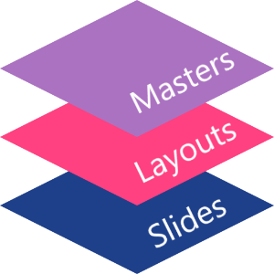

## **مرور کلی**

یک **اسلاید مستر** تنظیمات طراحی مشترک برای گروهی از اسلایدها را تعریف می‌کند. می‌تواند شامل شکل‌های مشترک، لوگوها، پس‌زمینه‌ها، سبک‌های متن، تنظیمات تم و تنظیمات پاورقی باشد. در پاورپوینت، ویرایش اسلاید مستر روش معمول برای حفظ یکپارچگی ارائه بدون تکرار قالب‌بندی یکسان در هر اسلاید است.

Aspose.Slides for C++ مدل مشابهی را پشتیبانی می‌کند. یک ارائه می‌تواند شامل یک یا چند اسلاید مستر باشد و هر اسلاید مستر می‌تواند شامل چندین اسلاید لایه‌بندی باشد. اسلایدهای معمولاً به‌طور مستقیم به اسلاید مستر ارجاع نمی‌دهند. در عوض، یک اسلاید معمولی از یک اسلاید لایه‌بندی استفاده می‌کند و آن لایه‌بندی به یک اسلاید مستر تعلق دارد.

سطح‌بندی به شکل زیر است:

1. **اسلاید مستر** – تنظیمات طراحی و تم مشترک را تعریف می‌کند.  
1. **اسلاید لایه‌بندی** – ترتیب خاصی از نگهدارنده‌ها و قالب‌بندی سطح لایه‌بندی را تعریف می‌کند.  
1. **اسلاید معمولی** – محتوای واقعی ارائه را در خود دارد و از یک اسلاید لایه‌بندی استفاده می‌کند.



در Aspose.Slides، یک اسلاید مستر توسط رابط [IMasterSlide](https://reference.aspose.com/slides/fa/cpp/aspose.slides/imasterslide/) نمایش داده می‌شود. تمام اسلایدهای مستر موجود در یک ارائه از طریق مجموعه [Presentation::get_Masters](https://reference.aspose.com/slides/fa/cpp/aspose.slides/presentation/get_masters/) در دسترس هستند که پیاده‌سازی [IMasterSlideCollection](https://reference.aspose.com/slides/fa/cpp/aspose.slides/imasterslidecollection/) را ارائه می‌دهد.

{}
هنگامی که یک ویژگی در بیش از یک سطح تعریف شده باشد، سطح خاص‌تر برنده می‌شود. برای مثال، اگر یک اسلاید مستر و یک اسلاید لایه‌بندی هر دو پس‌زمینه‌ای تعریف کنند، اسلایدهای مبتنی بر آن لایه‌بندی از پس‌زمینه لایه‌بندی استفاده می‌کنند. برای اطلاعات بیشتر درباره اسلایدهای لایه‌بندی، به [Apply or Change Slide Layouts](/slides/fa/cpp/slide-layout/) مراجعه کنید.
{}

## **دسترسی به اسلایدهای مستر**

در پاورپوینت، می‌توانید نمای اسلاید مستر را از **View** > **Slide Master** باز کنید.


در Aspose.Slides، از مجموعه `get_Masters()` برای دسترسی به اسلایدهای مستر استفاده کنید:

```cpp
#include <DOM/IMasterLayoutSlideCollection.h>
#include <DOM/IMasterSlide.h>
#include <DOM/IMasterSlideCollection.h>
#include <DOM/Presentation.h>
#include <system/console.h>
using namespace Aspose::Slides;
using namespace System;

auto presentation = System::MakeObject<Presentation>(u"presentation.pptx");

auto firstMasterSlide = presentation->get_Master(0);
auto masterSlideCount = presentation->get_Masters()->get_Count();
auto firstMasterLayoutSlideCount = firstMasterSlide->get_LayoutSlides()->get_Count();

System::Console::WriteLine(System::String(u"Master slides: ") + masterSlideCount);
System::Console::WriteLine(System::String(u"Layouts in the first master: ") + firstMasterLayoutSlideCount);

presentation->Dispose();
```

همچنین می‌توانید اسلاید مستر استفاده شده توسط یک اسلاید معمولی را از طریق لایه‌بندی آن به دست آورید:

```cpp
#include <DOM/ILayoutSlide.h>
#include <DOM/IMasterSlide.h>
#include <DOM/ISlide.h>
#include <DOM/Presentation.h>
#include <system/console.h>
using namespace Aspose::Slides;
using namespace System;

auto presentation = System::MakeObject<Presentation>(u"presentation.pptx");

auto slide = presentation->get_Slide(0);
auto layoutSlide = slide->get_LayoutSlide();
auto masterSlide = layoutSlide->get_MasterSlide();
auto masterSlideName = masterSlide->get_Name();

System::Console::WriteLine(masterSlideName);

presentation->Dispose();
```

## **محتویات یک اسلاید مستر**

اسلاید مستر یک شیء شبیه اسلاید است. این شیء رابط [IBaseSlide](https://reference.aspose.com/slides/fa/cpp/aspose.slides/ibaseslide/) را پیاده‌سازی می‌کند، بنابراین بسیاری از ویژگی‌های اسلاید مشترک با اسلایدهای معمولی و لایه‌بندی در دسترس است. اعضای مخصوص مستر در صفحه API [IMasterSlide](https://reference.aspose.com/slides/fa/cpp/aspose.slides/imasterslide/) فهرست شده‌اند.

برخی از اعضای پرکاربرد اسلاید مستر عبارتند از:

| عضو | هدف |
| --- | --- |
| `get_Background()` | پس‌زمینه سطح مستر را تنظیم می‌کند. |
| `get_Shapes()` | شکل‌های قرار گرفته بر روی مستر، مانند لوگوها، قاب‌های تصویر و متن مشترک را ذخیره می‌کند. |
| `get_LayoutSlides()` | اسلایدهای لایه‌بندی متعلق به مستر را ذخیره می‌کند. |
| `get_ThemeManager()` | دسترسی به APIهای تم مستر را فراهم می‌کند. |
| `get_HeaderFooterManager()` | سرصفحه‌ها، پاورقی‌ها، تاریخ‌ها و شماره اسلایدها را برای مستر و لایه‌های فرزند آن کنترل می‌کند. |
| `GetDependingSlides()` | اسلایدهای معمولی که از طریق لایه‌هایشان به مستر وابسته‌اند را برمی‌گرداند. |

## **اضافه کردن تصویر به اسلاید مستر**

هنگامی که تصویری را به یک اسلاید مستر اضافه می‌کنید، بر روی اسلایدهایی که از لایه‌های آن مستر استفاده می‌کنند نمایش داده می‌شود. این برای لوگوها، واترمارک‌ها، نواری‌های تزئینی و سایر عناصر بصری تکراری مفید است.

مثال زیر یک لوگو را به اولین اسلاید مستر اضافه می‌کند:

```cpp
#include <DOM/IImageCollection.h>
#include <DOM/IMasterSlide.h>
#include <DOM/IShapeCollection.h>
#include <DOM/Presentation.h>
#include <DOM/ShapeType.h>
#include <Export/SaveFormat.h>
#include <system/io/file.h>
using namespace Aspose::Slides;
using namespace Aspose::Slides::Export;
using namespace System::IO;

auto presentation = System::MakeObject<Presentation>(u"presentation.pptx");

auto masterSlide = presentation->get_Master(0);
auto logoBytes = System::IO::File::ReadAllBytes(u"logo.png");
auto logoImage = presentation->get_Images()->AddImage(logoBytes);

masterSlide->get_Shapes()->AddPictureFrame(
    ShapeType::Rectangle,
    20.0f,
    20.0f,
    80.0f,
    80.0f,
    logoImage);

presentation->Save(u"presentation-with-logo.pptx", SaveFormat::Pptx);
presentation->Dispose();
```

برای اطلاعات بیشتر درباره قاب‌های تصویر، به [Picture Frame](/slides/fa/cpp/picture-frame/) مراجعه کنید.

## **کنترل نمایش گرافیک‌های مستر**

از [IBaseSlide::set_ShowMasterShapes](https://reference.aspose.com/slides/fa/cpp/aspose.slides/ibaseslide/set_showmastershapes/) برای مخفی کردن گرافیک‌های ارث‌برده شده از مستر (مانند لوگوها یا اشکال تزئینی) بدون حذف آن‌ها از مستر استفاده کنید. مقدار `false` را به [Slide::set_ShowMasterShapes](https://reference.aspose.com/slides/fa/cpp/aspose.slides/slide/set_showmastershapes/) در اسلایدی که می‌خواهید این گرافیک‌ها حذف شوند، پاس دهید و مقدار `true` را در اسلایدهایی که باید نمایش داده شوند، استفاده کنید.

مثال خودکفا زیر یک نوار تزئینی آبی را بر روی یک مستر و دو اسلایدی که از همان لایه خالی استفاده می‌کنند، ایجاد می‌کند. نوار در اسلاید اول قابل مشاهده و در اسلاید دوم مخفی است. نیازی به ارائه ورودی یا تصویر ندارید.

```cpp
#include <DOM/FillType.h>
#include <DOM/IAutoShape.h>
#include <DOM/IColorFormat.h>
#include <DOM/IFillFormat.h>
#include <DOM/ILayoutSlide.h>
#include <DOM/ILineFormat.h>
#include <DOM/IMasterLayoutSlideCollection.h>
#include <DOM/IMasterSlide.h>
#include <DOM/IShapeCollection.h>
#include <DOM/ISlide.h>
#include <DOM/ISlideCollection.h>
#include <DOM/ISlideSize.h>
#include <DOM/Presentation.h>
#include <DOM/ShapeType.h>
#include <DOM/SlideLayoutType.h>
#include <Export/SaveFormat.h>
#include <drawing/color.h>

using namespace Aspose::Slides;
using namespace Aspose::Slides::Export;
using namespace System;
using namespace System::Drawing;

auto presentation = MakeObject<Presentation>();
auto masterSlide = presentation->get_Master(0);
auto layoutSlide = masterSlide->get_LayoutSlides()->GetByType(SlideLayoutType::Blank);
layoutSlide->set_ShowMasterShapes(true);

auto slideHeight = presentation->get_SlideSize()->get_Size().get_Height();
auto band = masterSlide->get_Shapes()->AddAutoShape(ShapeType::Rectangle, 0.0f, 0.0f, 60.0f, slideHeight);
band->get_FillFormat()->set_FillType(FillType::Solid);
band->get_FillFormat()->get_SolidFillColor()->set_Color(Color::get_SteelBlue());
band->get_LineFormat()->get_FillFormat()->set_FillType(FillType::NoFill);

auto visibleSlide = presentation->get_Slide(0);
visibleSlide->set_LayoutSlide(layoutSlide);
visibleSlide->get_Shapes()->Clear();

auto hiddenSlide = presentation->get_Slides()->AddEmptySlide(layoutSlide);

visibleSlide->set_ShowMasterShapes(true);
hiddenSlide->set_ShowMasterShapes(false);

presentation->Save(u"master-graphics.pptx", SaveFormat::Pptx);
presentation->Dispose();
```

این مثال از لایه **Blank** ارائه‌شده با یک ارائه جدید استفاده می‌کند و نگهدارنده‌های اولیه اسلاید را حذف می‌نماید.

### **انتخاب دامنهٔ تنظیم**

یک اسلاید معمولی از مستر خود از طریق [ISlide::get_LayoutSlide](https://reference.aspose.com/slides/fa/cpp/aspose.slides/islide/get_layoutslide/) و [ILayoutSlide::get_MasterSlide](https://reference.aspose.com/slides/fa/cpp/aspose.slides/ilayoutslide/get_masterslide/) استفاده می‌کند. تنظیم این ویژگی بر روی یک اسلاید منفرد فقط بر همان اسلاید تاثیر می‌گذارد. مقدار `false` به [LayoutSlide::set_ShowMasterShapes](https://reference.aspose.com/slides/fa/cpp/aspose.slides/layoutslide/set_showmastershapes/) گرافیک‌های مستر را برای اسلایدهایی که از آن لایه مشترک استفاده می‌کنند مخفی می‌کند، حتی اگر تنظیم شخصی اسلاید آن‌ها `true` باشد. برای مخفی کردن گرافیک فقط در یک اسلاید، ویژگی اسلاید را تغییر دهید و لایهٔ مشترک را دست نخورده بمانید.

این تنظیم به‌عنوان کنترل نمایش بر روی خود اسلاید مستر پشتیبانی نمی‌شود. بر روی مستر همیشه مقدار `false` برگردانده می‌شود و اختصاص مقدار `true` منجر به `System::NotSupportedException` می‌شود. این ویژگی را بر روی یک اسلاید معمولی یا یک لایه اعمال کنید.

### **تمیز کردن گرافیک‌ها از پس‌زمینه**

| عملیات | اثر |
| --- | --- |
| مخفی کردن گرافیک‌های مستر | نمایش گرافیک‌های ارث‌برده شده از مستر را بدون حذف آن‌ها یا تغییر شکل‌های اسلاید کنترل می‌کند. |
| تغییر پرشدن پس‌زمینه اسلاید | رنگ، گرادیان یا تصویر پس‌زمینه را تغییر می‌دهد. گرافیک‌های مستر شکل‌های جداگانه‌ای هستند و می‌توانند بر روی آن پس‌زمینه دیده شوند. برای جزئیات بیشتر به [Presentation Background](/slides/fa/cpp/presentation-background/) مراجعه کنید. |
| حذف یک شکل از مستر | شکل منبع مشترک را حذف می‌کند، به‌طوری که دیگر برای هیچ اسلایدی که از آن مستر استفاده می‌کند در دسترس نیست. |

## **کار با نگهدارنده‌ها**

نگهدارنده‌ها معمولا بر روی اسلایدهای لایه‌بندی تعریف می‌شوند. اسلاید مستر سبک و تم مشترکی را که آن لایه‌ها به ارث می‌برند فراهم می‌کند، در حالی که هر لایه تصمیم می‌گیرد کدام نگهدارنده‌ها در دسترس هستند و در کجا قرار می‌گیرند.

در پاورپوینت، دستورات نگهدارنده در نمای اسلاید مستر موجود است.


برای اضافه کردن نگهدارنده‌های جدید با Aspose.Slides، بر روی اسلاید لایه‌بندی که به مستر تعلق دارد کار کنید:

```cpp
#include <DOM/ILayoutPlaceholderManager.h>
#include <DOM/ILayoutSlide.h>
#include <DOM/IMasterLayoutSlideCollection.h>
#include <DOM/IMasterSlide.h>
#include <DOM/ISlideCollection.h>
#include <DOM/Presentation.h>
#include <DOM/SlideLayoutType.h>
#include <Export/SaveFormat.h>
using namespace Aspose::Slides;
using namespace Aspose::Slides::Export;

auto presentation = System::MakeObject<Presentation>(u"presentation.pptx");

auto masterSlide = presentation->get_Master(0);
auto blankLayoutSlide = masterSlide->get_LayoutSlides()->GetByType(SlideLayoutType::Blank);

if (blankLayoutSlide == nullptr)
{
    blankLayoutSlide = masterSlide->get_LayoutSlides()->Add(SlideLayoutType::Blank, u"Blank");
}

blankLayoutSlide->get_PlaceholderManager()->AddTextPlaceholder(
    60.0f,
    120.0f,
    600.0f,
    80.0f);

presentation->get_Slides()->AddEmptySlide(blankLayoutSlide);
presentation->Save(u"presentation-with-placeholder.pptx", SaveFormat::Pptx);
presentation->Dispose();
```

همچنین می‌توانید شکل‌های نگهدارنده‌ای که پیشاپیش بر روی اسلاید مستر وجود دارند را قالب‌بندی کنید. مثال زیر نگهدارندهٔ عنوان را پیدا کرده و یک پرشدن گرادیان خطی به آن اعمال می‌کند:

```cpp
#include <DOM/FillType.h>
#include <DOM/GradientShape.h>
#include <DOM/IAutoShape.h>
#include <DOM/IFillFormat.h>
#include <DOM/IGradientFormat.h>
#include <DOM/IGradientStopCollection.h>
#include <DOM/IMasterSlide.h>
#include <DOM/IPlaceholder.h>
#include <DOM/IShapeCollection.h>
#include <DOM/PlaceholderType.h>
#include <DOM/Presentation.h>
#include <Export/SaveFormat.h>
#include <drawing/color.h>
using namespace Aspose::Slides;
using namespace Aspose::Slides::Export;
using namespace System::Drawing;

auto presentation = System::MakeObject<Presentation>(u"presentation.pptx");

auto masterSlide = presentation->get_Master(0);
System::SharedPtr<IAutoShape> titlePlaceholder;

for (auto&& shape : masterSlide->get_Shapes())
{
    auto autoShape = System::AsCast<IAutoShape>(shape);

    if (autoShape != nullptr &&
        autoShape->get_Placeholder() != nullptr &&
        autoShape->get_Placeholder()->get_Type() == PlaceholderType::Title)
    {
        titlePlaceholder = autoShape;
        break;
    }
}

if (titlePlaceholder != nullptr)
{
    auto fillFormat = titlePlaceholder->get_FillFormat();
    fillFormat->set_FillType(FillType::Gradient);

    auto gradientFormat = fillFormat->get_GradientFormat();
    gradientFormat->set_GradientShape(GradientShape::Linear);

    auto gradientStops = gradientFormat->get_GradientStops();
    auto redGradientColor = System::Drawing::Color::FromArgb(255, 0, 0);
    auto purpleGradientColor = System::Drawing::Color::FromArgb(128, 0, 128);

    gradientStops->Add(0.0f, redGradientColor);
    gradientStops->Add(255.0f, purpleGradientColor);
}

presentation->Save(u"presentation-title-style.pptx", SaveFormat::Pptx);
presentation->Dispose();
```


برای گزینه‌های بیشتر قالب‌بندی نگهدارنده و متن، به [Set Prompt Text in Placeholder](/slides/fa/cpp/manage-placeholder/) و [Text Formatting](/slides/fa/cpp/text-formatting/) مراجعه کنید.

## **تغییر پس‌زمینهٔ اسلاید مستر**

پس‌زمینهٔ مستر توسط لایه‌ها و اسلایدهایی که آن را بازنویسی نمی‌کنند، به ارث برده می‌شود. مثال زیر رنگ پس‌زمینهٔ ثابت را برای اولین اسلاید مستر تنظیم می‌کند:

```cpp
#include <DOM/BackgroundType.h>
#include <DOM/FillType.h>
#include <DOM/IBackground.h>
#include <DOM/IColorFormat.h>
#include <DOM/IFillFormat.h>
#include <DOM/IMasterSlide.h>
#include <DOM/Presentation.h>
#include <Export/SaveFormat.h>
#include <drawing/color.h>
using namespace Aspose::Slides;
using namespace Aspose::Slides::Export;
using namespace System::Drawing;

auto presentation = System::MakeObject<Presentation>(u"presentation.pptx");

auto masterSlide = presentation->get_Master(0);
auto masterBackgroundColor = System::Drawing::Color::get_ForestGreen();

masterSlide->get_Background()->set_Type(BackgroundType::OwnBackground);
masterSlide->get_Background()->get_FillFormat()->set_FillType(FillType::Solid);
masterSlide->get_Background()->get_FillFormat()->get_SolidFillColor()->set_Color(masterBackgroundColor);

presentation->Save(u"presentation-master-background.pptx", SaveFormat::Pptx);
presentation->Dispose();
```

برای موضوعات مرتبط، به [Presentation Background](/slides/fa/cpp/presentation-background/) و [Presentation Theme](/slides/fa/cpp/presentation-theme/) مراجعه کنید.

## **کلون کردن اسلاید مستر به ارائهٔ دیگر**

از [IMasterSlideCollection::AddClone](https://reference.aspose.com/slides/fa/cpp/aspose.slides/imasterslidecollection/addclone/) برای کپی کردن یک اسلاید مستر به ارائهٔ دیگری استفاده کنید. مستر کپی‌شده سپس می‌تواند توسط لایه‌ها و اسلایدهای موجود در ارائه مقصد استفاده شود.

```cpp
#include <DOM/IMasterSlideCollection.h>
#include <DOM/Presentation.h>
#include <Export/SaveFormat.h>
using namespace Aspose::Slides;
using namespace Aspose::Slides::Export;

auto sourcePresentation = System::MakeObject<Presentation>(u"source.pptx");
auto destinationPresentation = System::MakeObject<Presentation>(u"destination.pptx");

auto sourceMasterSlide = sourcePresentation->get_Master(0);
auto clonedMasterSlide = destinationPresentation->get_Masters()->AddClone(sourceMasterSlide);

destinationPresentation->Save(u"destination-with-master.pptx", SaveFormat::Pptx);
destinationPresentation->Dispose();
sourcePresentation->Dispose();
```

اگر نیاز به کلون کردن اسلایدهای معمولی همراه با مستر آن‌ها دارید، به [Clone Slides](/slides/fa/cpp/clone-slides/) مراجعه کنید.

## **اضافه کردن چندین اسلاید مستر**

یک ارائه می‌تواند شامل چندین اسلاید مستر باشد. این برای بخش‌های مختلف که نیاز به برندینگ، ساختار صفحه یا تنظیمات تم متفاوتی دارند مفید است.


مثال زیر مستر پیش‌فرض را کلون می‌کند، برای کلون پس‌زمینه‌ای متفاوت تعیین می‌کند، یک لایه زیر آن مستر کلون‌شده ایجاد می‌کند و اسلاید جدیدی بر پایه آن لایه می‌افزاید:

```cpp
#include <DOM/BackgroundType.h>
#include <DOM/FillType.h>
#include <DOM/IBackground.h>
#include <DOM/IColorFormat.h>
#include <DOM/IFillFormat.h>
#include <DOM/IMasterLayoutSlideCollection.h>
#include <DOM/IMasterSlide.h>
#include <DOM/IMasterSlideCollection.h>
#include <DOM/ISlideCollection.h>
#include <DOM/Presentation.h>
#include <DOM/SlideLayoutType.h>
#include <Export/SaveFormat.h>
#include <drawing/color.h>
using namespace Aspose::Slides;
using namespace Aspose::Slides::Export;
using namespace System::Drawing;

auto presentation = System::MakeObject<Presentation>(u"presentation.pptx");

auto defaultMasterSlide = presentation->get_Master(0);
auto sectionMasterSlide = presentation->get_Masters()->AddClone(defaultMasterSlide);
auto sectionMasterBackgroundColor = System::Drawing::Color::get_LightSteelBlue();

sectionMasterSlide->get_Background()->set_Type(BackgroundType::OwnBackground);
sectionMasterSlide->get_Background()->get_FillFormat()->set_FillType(FillType::Solid);
sectionMasterSlide->get_Background()->get_FillFormat()->get_SolidFillColor()->set_Color(sectionMasterBackgroundColor);

auto sourceBlankLayout = defaultMasterSlide->get_LayoutSlides()->GetByType(SlideLayoutType::Blank);

if (sourceBlankLayout == nullptr)
{
    sourceBlankLayout = defaultMasterSlide->get_LayoutSlide(0);
}

auto sectionBlankLayout = sectionMasterSlide->get_LayoutSlides()->AddClone(sourceBlankLayout);

presentation->get_Slides()->AddEmptySlide(sectionBlankLayout);
presentation->Save(u"presentation-with-multiple-masters.pptx", SaveFormat::Pptx);
presentation->Dispose();
```

## **مقایسهٔ اسلایدهای مستر**

اسلایدهای مستر می‌توانند با متد `Equals` که از [IBaseSlide](https://reference.aspose.com/slides/fa/cpp/aspose.slides/ibaseslide/) به ارث برده می‌شود، مقایسه شوند. این مقایسه ساختار و محتوای ثابت مانند اشکال، متن، قالب‌بندی، انیمیشن‌ها و سایر تنظیمات اسلاید را بررسی می‌کند. شناسه‌های منحصر به فرد مانند شناسهٔ اسلاید یا مقادیر پویا مانند تاریخ جاری را در نظر نمی‌گیرد.

```cpp
#include <DOM/IMasterSlide.h>
#include <DOM/IMasterSlideCollection.h>
#include <DOM/Presentation.h>
#include <system/console.h>
using namespace Aspose::Slides;
using namespace System;

auto firstPresentation = System::MakeObject<Presentation>(u"first.pptx");
auto secondPresentation = System::MakeObject<Presentation>(u"second.pptx");
auto firstPresentationMasterCount = firstPresentation->get_Masters()->get_Count();
auto secondPresentationMasterCount = secondPresentation->get_Masters()->get_Count();

for (int32_t firstMasterIndex = 0;
     firstMasterIndex < firstPresentationMasterCount;
     firstMasterIndex++)
{
    for (int32_t secondMasterIndex = 0;
         secondMasterIndex < secondPresentationMasterCount;
         secondMasterIndex++)
    {
        auto firstMasterSlide = firstPresentation->get_Master(firstMasterIndex);
        auto secondMasterSlide = secondPresentation->get_Master(secondMasterIndex);
        auto areMasterSlidesEqual = firstMasterSlide->Equals(secondMasterSlide);

        if (areMasterSlidesEqual)
        {
            System::Console::WriteLine(
                System::String::Format(
                    u"first.pptx master #{0} equals second.pptx master #{1}",
                    firstMasterIndex,
                    secondMasterIndex));
        }
    }
}

secondPresentation->Dispose();
firstPresentation->Dispose();
```

برای اطلاعات بیشتر، به [Compare Presentation Slides](/slides/fa/cpp/compare-slides/) مراجعه کنید.

## **تنظیم نماى اسلاید مستر به عنوان نماى پیش‌فرض**

از متد `set_LastView` در [ViewProperties](https://reference.aspose.com/slides/fa/cpp/aspose.slides/viewproperties/) برای کنترل نمایی که PowerPoint ابتدا باز می‌کند استفاده کنید. مثال زیر ارائه را در نمای اسلاید مستر باز می‌کند:

```cpp
#include <DOM/IViewProperties.h>
#include <DOM/Presentation.h>
#include <Export/SaveFormat.h>
#include <ViewType.h>
using namespace Aspose::Slides;
using namespace Aspose::Slides::Export;

auto presentation = System::MakeObject<Presentation>(u"presentation.pptx");

presentation->get_ViewProperties()->set_LastView(ViewType::SlideMasterView);
presentation->Save(u"presentation-master-view.pptx", SaveFormat::Pptx);
presentation->Dispose();
```

برای تنظیمات بیشتر نما، به [Save Presentation](/slides/fa/cpp/save-presentation/) مراجعه کنید.

## **حذف اسلایدهای مستر استفاده‌نشده**

گاهی اوقات ارائه‌ها شامل اسلایدهای مستری می‌شوند که دیگر توسط هیچ اسلاید معمولی استفاده نمی‌شوند. حذف مسترهای استفاده‌نشده می‌تواند اندازه فایل را کاهش دهد و نگهداری قالب را ساده‌تر کند.

از [MasterSlideCollection::RemoveUnused](https://reference.aspose.com/slides/fa/cpp/aspose.slides/masterslidecollection/removeunused/) برای حذف مسترهای استفاده‌نشده از مجموعه `get_Masters()` استفاده کنید:

```cpp
#include <DOM/IMasterSlideCollection.h>
#include <DOM/Presentation.h>
#include <Export/SaveFormat.h>
using namespace Aspose::Slides;
using namespace Aspose::Slides::Export;

auto presentation = System::MakeObject<Presentation>(u"presentation.pptx");

presentation->get_Masters()->RemoveUnused(true);
presentation->Save(u"presentation-clean.pptx", SaveFormat::Pptx);
presentation->Dispose();
```

همچنین می‌توانید از متد کم‌کد [Compress::RemoveUnusedMasterSlides](https://reference.aspose.com/slides/fa/cpp/aspose.slides.lowcode/compress/removeunusedmasterslides/) استفاده کنید:

```cpp
#include <DOM/Presentation.h>
#include <Export/SaveFormat.h>
#include <LowCode/Compress.h>
using namespace Aspose::Slides;
using namespace Aspose::Slides::Export;
using namespace Aspose::Slides::LowCode;

auto presentation = System::MakeObject<Presentation>(u"presentation.pptx");

LowCode::Compress::RemoveUnusedMasterSlides(presentation);
presentation->Save(u"presentation-clean.pptx", SaveFormat::Pptx);
presentation->Dispose();
```

## **سوالات متداول**

**تفاوت اسلاید مستر و اسلاید لایه‌بندی چیست؟**  
اسلاید مستر تنظیمات طراحی مشترکی مانند تم، پس‌زمینه، اشکال مشترک و سبک‌های متن را تعریف می‌کند. اسلاید لایه‌بندی به یک اسلاید مستر تعلق دارد و ترتیب خاصی از نگهدارنده‌ها را تعیین می‌کند. یک اسلاید معمولی از یک اسلاید لایه‌بندی استفاده می‌کند، بنابراین هم از لایه‌بندی و هم از مستر ارث می‌برد.

**آیا یک ارائه می‌تواند چندین اسلاید مستر داشته باشد؟**  
بله. یک ارائه می‌تواند چندین اسلاید مستر داشته باشد. هنگامیکه بخش‌های مختلف نیاز به سیستم‌های بصری یا برندینگ متفاوت دارند، از مسترهای متعدد استفاده کنید.

**آیا باید نگهدارنده‌ها را به اسلاید مستر اضافه کنم یا به اسلاید لایه‌بندی؟**  
در اکثر موارد، نگهدارنده‌ها را به اسلایدهای لایه‌بندی اضافه کنید. عناصر بصری مشترک و قالب‌بندی‌های عمومی را روی اسلاید مستر بگذارید و سپس نگهدارنده‌های محتوا را روی لایه‌هایی که اسلایدهای معمولی استفاده می‌کنند، قرار دهید.

**آیا می‌توانم یک اسلاید مستر که هنوز استفاده می‌شود را حذف کنم؟**  
نه. اسلاید مستری که اسلایدهای وابسته دارد نمی‌تواند به‌صورت مستقیم حذف شود. ابتدا آن اسلایدها را به لایه‌های تحت مستر دیگری منتقل کنید یا از روش پاکسازی مسترهای استفاده‌نشده که تنها مسترهای بدون استفاده را حذف می‌کند، استفاده نمایید.