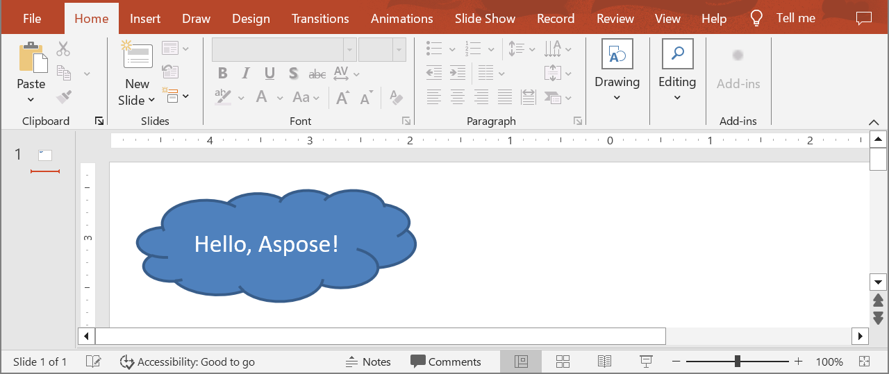

## **بررسی کلی**

این مقاله نشان می‌دهد چگونه یک ارائه در Aspose.Slides ایجاد کنید، محتوای ساده‌ای را به یک اسلاید اضافه کنید و نتیجه را به صورت فایل ذخیره کنید. همچنین نحوه ایجاد و ذخیره یک ارائه جدید، باز کردن یک ارائه موجود در فرمت پشتیبانی‌شده و ذخیره آن در فرمت دیگر را نیز نشان می‌دهد. علاوه بر این، مقاله شامل پرسش‌های متداول کوتاهی در مورد فرمت‌ها، قالب‌ها، اندازه اسلاید، واحدها، مصرف حافظه، همزمانی، لایسنس، امضای دیجیتال و پشتیبانی از VBA است.

## **ایجاد یک ارائه**

ایجاد یک فایل PowerPoint از ابتدا در Aspose.Slides for Java به سادگی نمونه‌سازی کلاس [Presentation](https://reference.aspose.com/slides/fa/java/com.aspose.slides/presentation/) است. سازنده به طور خودکار یک دک خالی با یک اسلاید فراهم می‌کند، به طوری که بلافاصله می‌توانید اشکال، متن، نمودار یا هر محتوای دیگری که برنامه‌تان نیاز دارد را روی آن اضافه کنید. پس از ویرایش آن اسلاید یا افزودن اسلایدهای جدید، می‌توانید نتیجه را به فرمت‌های PPTX، PPT قدیمی یا حتی OpenDocument ذخیره کنید. نمونه کد کوتاهی که در زیر آمده است، این جریان کاری را با افزودن یک شکل ساده به اولین اسلاید نشان می‌دهد.

1. یک نمونه از کلاس [Presentation](https://reference.aspose.com/slides/fa/java/com.aspose.slides/presentation/) ایجاد کنید.
1. با استفاده از اندیس، به اسلاید ارجاع پیدا کنید.
1. یک شیء [IAutoShape](https://reference.aspose.com/slides/fa/java/com.aspose.slides/iautoshape/) از نوع `Cloud` با روش `addAutoShape` که توسط مجموعه `Shapes` ارائه شده است، اضافه کنید.
1. متن را به شکل خودکار اضافه کنید.
1. ارائهٔ تغییر یافته را به صورت فایل PPTX ذخیره کنید.

در مثال زیر، یک شکل ابر به اولین اسلاید ارائه اضافه می‌شود.

```java
// یک نمونه از کلاس Presentation که نمایانگر یک فایل ارائه است را ایجاد کنید.
Presentation presentation = new Presentation();
try {
    // اولین اسلاید را دریافت کنید.
    ISlide slide = presentation.getSlides().get_Item(0);

    // یک شکل خودکار از نوع Cloud اضافه کنید.
    IAutoShape autoShape = slide.getShapes().addAutoShape(ShapeType.Cloud, 20, 20, 200, 80);
    autoShape.getTextFrame().setText("Hello, Aspose!");

    // ارائه را به عنوان فایل PPTX ذخیره کنید.
    presentation.save("new_presentation.pptx", SaveFormat.Pptx);
} finally {
    presentation.dispose();
}
```

نتیجه:



## **پرسش‌های متداول**

**چه فرمت‌هایی می‌توانم برای ذخیرهٔ یک ارائه جدید استفاده کنم؟**

می‌توانید به [PPTX, PPT و ODP](/slides/fa/java/save-presentation/) ذخیره کنید و به فرمت‌های [PDF](/slides/fa/java/convert-powerpoint-to-pdf/)، [XPS](/slides/fa/java/convert-powerpoint-to-xps/)، [HTML](/slides/fa/java/convert-powerpoint-to-html/)، [SVG](/slides/fa/java/convert-powerpoint-to-png/) و [تصاویر](/slides/fa/java/convert-powerpoint-to-png/) و غیره صادر کنید.

**آیا می‌توانم از یک الگو (POTX/POTM) شروع کنم و به صورت PPTX عادی ذخیره کنم؟**

بله. الگو را بارگذاری کنید و به فرمات دلخواه ذخیره کنید؛ فرمت‌های POTX/POTM/PPTM و مشابه آن‌ها [پشتیبانی می‌شوند](/slides/fa/java/supported-file-formats/).

**چگونه می‌توانم هنگام ایجاد ارائه، اندازه/نسبت تصویر اسلاید را کنترل کنم؟**

[اندازه اسلاید](/slides/fa/java/slide-size/) را تنظیم کنید (از جمله تنظیمات پیش‌فرض مانند 4:3 و 16:9 یا ابعاد سفارشی) و تعیین کنید محتوا چگونه مقیاس‌بندی شود.

**اندازها و مختصات به چه واحدی اندازه‌گیری می‌شوند؟**

به نقطه: 1 اینچ برابر با 72 واحد است.

**چگونه می‌توانم ارائه‌های بسیار بزرگ (با تعداد زیاد فایل‌های رسانه‌ای) را برای کاهش مصرف حافظه مدیریت کنم؟**

از [استراتژی‌های مدیریت BLOB](/slides/fa/java/manage-blob/) استفاده کنید، ذخیره‌سازی در حافظه را با استفاده از فایل‌های موقت محدود کنید و ترجیحاً از جریان‌های مبتنی بر فایل به جای جریان‌های صرفاً حافظه‌ای استفاده کنید.

**آیا می‌توانم ارائه‌ها را به صورت موازی ایجاد/ذخیره کنم؟**

نمی‌توانید بر روی همان نمونهٔ [Presentation](https://reference.aspose.com/slides/fa/java/com.aspose.slides/presentation/) از [چندین نخ](/slides/fa/java/multithreading/) عملیات انجام دهید. برای هر نخ یا فرآیند یک نمونهٔ جداگانه و ایزوله اجرا کنید.

**چگونه می‌توانم واترمارک آزمایشی و محدودیت‌ها را حذف کنم؟**

یک [لایسنس اعمال کنید](/slides/fa/java/licensing/) یک‌بار برای هر پردازش. XML لایسنس باید بدون تغییر باقی بماند و تنظیم لایسنس در صورت استفاده از چندین نخ باید همگام‌سازی شود.

**آیا می‌توانم فایل PPTX ایجاد شده را به صورت دیجیتالی امضا کنم؟**

بله. [امضای دیجیتال](/slides/fa/java/digital-signature-in-powerpoint/) (اضافه و تأیید) برای ارائه‌ها پشتیبانی می‌شود.

**آیا ماکروها (VBA) در ارائه‌های ایجاد شده پشتیبانی می‌شوند؟**

بله. می‌توانید [پروژه‌های VBA را ایجاد/ویرایش](/slides/fa/java/presentation-via-vba/) کنید و فایل‌های دارای ماکرو مانند PPTM/PPSM را ذخیره نمایید.