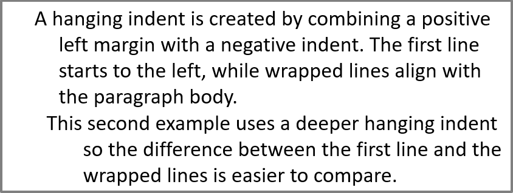

## **Introduction**

Aspose.Slides تمام رابط‌ها و کلاس‌های مورد نیاز برای کار با متن‌های PowerPoint، پاراگراف‌ها و بخش‌ها در Java را فراهم می‌کند.

* Aspose.Slides رابط [ITextFrame](https://reference.aspose.com/slides/fa/java/com.aspose.slides/itextframe/) را فراهم می‌کند تا بتوانید اشیائی که نمایانگر یک پاراگراف هستند را اضافه کنید. یک شیء `ITextFame` می‌تواند یک یا چند پاراگراف داشته باشد (هر پاراگراف از طریق یک بازگشت carriage ایجاد می‌شود).
* Aspose.Slides رابط [IParagraph](https://reference.aspose.com/slides/fa/java/com.aspose.slides/iparagraph/) را فراهم می‌کند تا بتوانید اشیائی که نمایانگر بخش‌ها هستند را اضافه کنید. یک شیء `IParagraph` می‌تواند یک یا چند بخش داشته باشد (مجموعه‌ای از اشیاء iPortions).
* Aspose.Slides رابط [IPortion](https://reference.aspose.com/slides/fa/java/com.aspose.slides/iportion/) را فراهم می‌کند تا بتوانید اشیائی که نمایانگر متن‌ها و ویژگی‌های قالب‌بندی آن‌ها هستند را اضافه کنید.

یک شیء `IParagraph` قادر است متونی با ویژگی‌های قالب‌بندی متفاوت را از طریق اشیاء زیرین `IPortion` خود مدیریت کند.

## **Add Multiple Paragraphs Containing Multiple Portions**

این مراحل نحوه افزودن یک فریم متن شامل ۳ پاراگراف و هر پاراگراف شامل ۳ بخش را نشان می‌دهند:

1. یک نمونه از کلاس [Presentation](https://reference.aspose.com/slides/fa/java/com.aspose.slides/presentation/) ایجاد کنید.
2. از طریق اندیس، به مرجع اسلاید مربوطه دسترسی پیدا کنید.
3. یک مستطیل [IAutoShape](https://reference.aspose.com/slides/fa/java/com.aspose.slides/iautoshape/) به اسلاید اضافه کنید.
4. `ITextFrame` مرتبط با [IAutoShape](https://reference.aspose.com/slides/fa/java/com.aspose.slides/iautoshape/) را دریافت کنید.
5. دو شیء [IParagraph](https://reference.aspose.com/slides/fa/java/com.aspose.slides/iparagraph/) ایجاد کنید و به مجموعه `IParagraphs` مربوط به [ITextFrame](https://reference.aspose.com/slides/fa/java/com.aspose.slides/itextframe/) اضافه کنید.
6. برای هر `IParagraph` جدید سه شیء [IPortion](https://reference.aspose.com/slides/fa/java/com.aspose.slides/iportion/) (دو شیء Portion برای پاراگراف پیش‌فرض) ایجاد کنید و هر شیء `IPortion` را به مجموعه IPortion مربوط به هر `IParagraph` اضافه کنید.
7. برای هر بخش متنی تنظیم کنید.
8. ویژگی‌های قالب‌بندی دلخواه خود را با استفاده از خصوصیات قالب‌بندی موجود در شیء `IPortion` بر هر بخش اعمال کنید.
9. ارائه تغییر یافته را ذخیره کنید.

این کد Java پیاده‌سازی مراحل افزودن پاراگراف‌های حاوی بخش‌ها است:

```java
// یک شیء از کلاس Presentation که فایل PPTX را نمایان می‌کند را ایجاد کنید
Presentation pres = new Presentation();
try {
    // دسترسی به اولین اسلاید
    ISlide slide = pres.getSlides().get_Item(0);

    // اضافه کردن یک AutoShape از نوع Rectangle
    IAutoShape ashp = slide.getShapes().addAutoShape(ShapeType.Rectangle, 50, 150, 300, 150);

    // دسترسی به TextFrame خود AutoShape
    ITextFrame tf = ashp.getTextFrame();

    // ایجاد پاراگراف‌ها و Portionها با قالب‌بندی‌های متنی مختلف
    IParagraph para0 = tf.getParagraphs().get_Item(0);
    IPortion port01 = new Portion();
    IPortion port02 = new Portion();
    para0.getPortions().add(port01);
    para0.getPortions().add(port02);

    IParagraph para1 = new Paragraph();
    tf.getParagraphs().add(para1);
    IPortion port10 = new Portion();
    IPortion port11 = new Portion();
    IPortion port12 = new Portion();
    para1.getPortions().add(port10);
    para1.getPortions().add(port11);
    para1.getPortions().add(port12);

    IParagraph para2 = new Paragraph();
    tf.getParagraphs().add(para2);
    IPortion port20 = new Portion();
    IPortion port21 = new Portion();
    IPortion port22 = new Portion();
    para2.getPortions().add(port20);
    para2.getPortions().add(port21);
    para2.getPortions().add(port22);

    for (int i = 0; i < 3; i++) 
    {
        for (int j = 0; j < 3; j++) 
        {
            IPortion portion = tf.getParagraphs().get_Item(i).getPortions().get_Item(j); 
            portion.setText("Portion0" + j);
            if (j == 0) {
                portion.getPortionFormat().getFillFormat().setFillType(FillType.Solid);
                portion.getPortionFormat().getFillFormat().getSolidFillColor().setColor(Color.RED);
                portion.getPortionFormat().setFontBold(NullableBool.True);
                portion.getPortionFormat().setFontHeight(15);
            } else if (j == 1) {
                portion.getPortionFormat().getFillFormat().setFillType(FillType.Solid);
                portion.getPortionFormat().getFillFormat().getSolidFillColor().setColor(Color.BLUE);
                portion.getPortionFormat().setFontItalic(NullableBool.True);
                portion.getPortionFormat().setFontHeight(18);
            }
        }
    }

    // نوشتن PPTX بر روی دیسک
    pres.save("multiParaPort_out.pptx", SaveFormat.Pptx);
} finally {
    if (pres != null) pres.dispose();
}
```

## **Manage Paragraph Bullets**

فهرست‌های بولت به شما کمک می‌کنند اطلاعات را به‌سرعت و به‌صورت کارآمد سازماندهی و ارائه کنید. پاراگراف‌های بولت‌دار همیشه خواناتر و قابل فهم‌تر هستند.

1. یک نمونه از کلاس [Presentation](https://reference.aspose.com/slides/fa/java/com.aspose.slides/presentation/) ایجاد کنید.
2. از طریق اندیس، به مرجع اسلاید مربوطه دسترسی پیدا کنید.
3. یک [autoshape](https://reference.aspose.com/slides/fa/java/com.aspose.slides/iautoshape/) به اسلاید انتخاب شده اضافه کنید.
4. به `TextFrame` موجود در autoshape دسترسی پیدا کنید.
5. پاراگراف پیش‌فرض در `TextFrame` را حذف کنید.
6. اولین نمونه پاراگراف را با استفاده از کلاس [Paragraph](https://reference.aspose.com/slides/fa/java/com.aspose.slides/paragraph/) ایجاد کنید.
7. `Type` بولت را برای پاراگراف به `Symbol` تنظیم کنید و کاراکتر بولت را تنظیم کنید.
8. متن پاراگراف را تنظیم کنید.
9. `Indent` پاراگراف را برای بولت تنظیم کنید.
10. رنگی برای بولت انتخاب کنید.
11. ارتفاع بولت را تنظیم کنید.
12. پاراگراف جدید را به مجموعه پاراگراف‌های `TextFrame` اضافه کنید.
13. پاراگراف دوم را اضافه کنید و فرآیند مراحل ۷ تا ۱۳ را تکرار کنید.
14. ارائه را ذخیره کنید.

این کد Java نشان می‌دهد چگونه یک بولت پاراگرافی اضافه کنید:

```java
// یک کلاس Presentation که فایل PPTX را نمایان می‌کند را ایجاد می‌کند
Presentation pres = new Presentation();
try {
    // به اولین اسلاید دسترسی پیدا می‌کند
    ISlide slide = pres.getSlides().get_Item(0);
    
    // یک Autoshape اضافه می‌کند و به آن دسترسی پیدا می‌کند
    IAutoShape aShp = slide.getShapes().addAutoShape(ShapeType.Rectangle, 200, 200, 400, 200);

    // به فریم متن autoshape دسترسی پیدا می‌کند
    ITextFrame txtFrm = aShp.getTextFrame();

    // پاراگراف پیش‌فرض را حذف می‌کند
    txtFrm.getParagraphs().removeAt(0);

    // یک پاراگراف ایجاد می‌کند
    Paragraph para = new Paragraph();

    // سبک بولت پاراگراف و نماد آن را تنظیم می‌کند
    para.getParagraphFormat().getBullet().setType(BulletType.Symbol);
    para.getParagraphFormat().getBullet().setChar((char)8226);

    // متن پاراگراف را تنظیم می‌کند
    para.setText("Welcome to Aspose.Slides");

    // تورفتگی بولت را تنظیم می‌کند
    para.getParagraphFormat().setIndent(25);

    // رنگ بولت را تنظیم می‌کند
    para.getParagraphFormat().getBullet().getColor().setColorType(ColorType.RGB);
    para.getParagraphFormat().getBullet().getColor().setColor(Color.BLACK);
    para.getParagraphFormat().getBullet().setBulletHardColor(NullableBool.True); // IsBulletHardColor را به true تنظیم می‌کند تا از رنگ بولت دلخواه استفاده شود

    // ارتفاع بولت را تنظیم می‌کند
    para.getParagraphFormat().getBullet().setHeight(100);

    // پاراگراف را به فریم متن اضافه می‌کند
    txtFrm.getParagraphs().add(para);

    // پاراگراف دوم را ایجاد می‌کند
    Paragraph para2 = new Paragraph();

    // نوع و سبک بولت پاراگراف را تنظیم می‌کند
    para2.getParagraphFormat().getBullet().setType(BulletType.Numbered);
    para2.getParagraphFormat().getBullet().setNumberedBulletStyle(NumberedBulletStyle.BulletCircleNumWDBlackPlain);

    // متن پاراگراف را اضافه می‌کند
    para2.setText("This is numbered bullet");

    // تورفتگی بولت را تنظیم می‌کند
    para2.getParagraphFormat().setIndent(25);

    para2.getParagraphFormat().getBullet().getColor().setColorType(ColorType.RGB);
    para2.getParagraphFormat().getBullet().getColor().setColor(Color.BLACK);
    para2.getParagraphFormat().getBullet().setBulletHardColor(NullableBool.True); // IsBulletHardColor را به true تنظیم می‌کند تا از رنگ بولت دلخواه استفاده شود

    // ارتفاع بولت را تنظیم می‌کند
    para2.getParagraphFormat().getBullet().setHeight(100);

    // پاراگراف را به فریم متن اضافه می‌کند
    txtFrm.getParagraphs().add(para2);
    
    // ارائه تغییر یافته را ذخیره می‌کند
    pres.save("Bullet_out.pptx", SaveFormat.Pptx);
} finally {
    if (pres != null) pres.dispose();
}
```

## **Manage Picture Bullets**

فهرست‌های بولت به شما کمک می‌کنند اطلاعات را به‌سرعت و به‌صورت کارآمد سازماندهی و ارائه کنید. پاراگراف‌های تصویری خواناتر و قابل فهم‌تر هستند.

1. یک نمونه از کلاس [Presentation](https://reference.aspose.com/slides/fa/java/com.aspose.slides/presentation/) ایجاد کنید.
2. از طریق اندیس، به مرجع اسلاید مربوطه دسترسی پیدا کنید.
3. یک [autoshape](https://reference.aspose.com/slides/fa/java/com.aspose.slides/iautoshape/) به اسلاید اضافه کنید.
4. به `TextFrame` موجود در autoshape دسترسی پیدا کنید.
5. پاراگراف پیش‌فرض در `TextFrame` را حذف کنید.
6. اولین نمونه پاراگراف را با استفاده از کلاس [Paragraph](https://reference.aspose.com/slides/fa/java/com.aspose.slides/paragraph/) ایجاد کنید.
7. تصویر را با استفاده از [IPPImage](https://reference.aspose.com/slides/fa/java/com.aspose.slides/ippimage/) بارگذاری کنید.
8. نوع بولت را به [Picture](https://reference.aspose.com/slides/fa/java/com.aspose.slides/ippimage/) تنظیم کنید و تصویر را تنظیم کنید.
9. متن پاراگراف را تنظیم کنید.
10. `Indent` پاراگراف را برای بولت تنظیم کنید.
11. رنگی برای بولت انتخاب کنید.
12. ارتفاع بولت را تنظیم کنید.
13. پاراگراف جدید را به مجموعه پاراگراف‌های `TextFrame` اضافه کنید.
14. پاراگراف دوم را اضافه کنید و فرآیند را بر اساس مراحل قبلی تکرار کنید.
15. ارائه تغییر یافته را ذخیره کنید.

این کد Java نشان می‌دهد چگونه بولت‌های تصویری را اضافه و مدیریت کنید:

```java
// یک کلاس Presentation که فایل PPTX را نمایان می‌کند را ایجاد می‌کند
Presentation presentation = new Presentation();
try {
    // به اولین اسلاید دسترسی می‌یابد
    ISlide slide = presentation.getSlides().get_Item(0);

    // تصویر بولت‌ها را ایجاد می‌کند
    IPPImage picture;
    IImage image = Images.fromFile("bullets.png");
    try {
        picture = presentation.getImages().addImage(image);
    } finally {
        if (image != null) image.dispose();
    }
    // Autoshape را اضافه می‌کند و به آن دسترسی می‌یابد
    IAutoShape autoShape = slide.getShapes().addAutoShape(ShapeType.Rectangle, 200, 200, 400, 200);

    // فریم متن autoshape را دسترسی می‌یابد
    ITextFrame textFrame = autoShape.getTextFrame();

    // پاراگراف پیش‌فرض را حذف می‌کند
    textFrame.getParagraphs().removeAt(0);

    // یک پاراگراف جدید ایجاد می‌کند
    Paragraph paragraph = new Paragraph();
    paragraph.setText("Welcome to Aspose.Slides");

    // سبک بولت پاراگراف و تصویر را تنظیم می‌کند
    paragraph.getParagraphFormat().getBullet().setType(BulletType.Picture);
    paragraph.getParagraphFormat().getBullet().getPicture().setImage(picture);

    // ارتفاع بولت را تنظیم می‌کند
    paragraph.getParagraphFormat().getBullet().setHeight(100);

    // پاراگراف را به فریم متن اضافه می‌کند
    textFrame.getParagraphs().add(paragraph);

    // ارائه را به صورت فایل PPTX ذخیره می‌کند
    presentation.save("ParagraphPictureBulletsPPTX_out.pptx", SaveFormat.Pptx);

    // ارائه را به صورت فایل PPT ذخیره می‌کند
    presentation.save("ParagraphPictureBulletsPPT_out.ppt", SaveFormat.Ppt);
} catch (IOException e) {
} finally {
    if (presentation != null) presentation.dispose();
}
```

## **Manage Multilevel Bullets**

فهرست‌های بولت به شما کمک می‌کنند اطلاعات را به‌سرعت و به‌صورت کارآمد سازماندهی و ارائه کنید. بولت‌های چندسطحی خواناتر و قابل فهم‌تر هستند.

1. یک نمونه از کلاس [Presentation](https://reference.aspose.com/slides/fa/java/com.aspose.slides/presentation/) ایجاد کنید.
2. از طریق اندیس، به مرجع اسلاید مربوطه دسترسی پیدا کنید.
3. یک [autoshape](https://reference.aspose.com/slides/fa/java/com.aspose.slides/iautoshape/) در اسلاید جدید اضافه کنید.
4. به `TextFrame` موجود در autoshape دسترسی پیدا کنید.
5. پاراگراف پیش‌فرض در `TextFrame` را حذف کنید.
6. اولین پاراگراف را از طریق کلاس [Paragraph](https://reference.aspose.com/slides/fa/java/com.aspose.slides/paragraph/) ایجاد کنید و عمق آن را به 0 تنظیم کنید.
7. دومین پاراگراف را از طریق کلاس `Paragraph` ایجاد کنید و عمق آن را به 1 تنظیم کنید.
8. سومین پاراگراف را از طریق کلاس `Paragraph` ایجاد کنید و عمق آن را به 2 تنظیم کنید.
9. چهارمین پاراگراف را از طریق کلاس `Paragraph` ایجاد کنید و عمق آن را به 3 تنظیم کنید.
10. پاراگراف‌های جدید را به مجموعه پاراگراف‌های `TextFrame` اضافه کنید.
11. ارائه تغییر یافته را ذخیره کنید.

این کد Java نشان می‌دهد چگونه بولت‌های چندسطحی را اضافه و مدیریت کنید:

```java
// یک شیء از کلاس Presentation که فایل PPTX را نمایان می‌کند را ایجاد می‌کند
Presentation pres = new Presentation();
try {
    // به اولین اسلاید دسترسی می‌یابد
    ISlide slide = pres.getSlides().get_Item(0);

    // Autoshape را اضافه می‌کند و به آن دسترسی می‌یابد
    IAutoShape aShp = slide.getShapes().addAutoShape(ShapeType.Rectangle, 200, 200, 400, 200);

    // فریم متن autoshape ایجاد شده را دسترسی می‌یابد
    ITextFrame text = aShp.addTextFrame("");

    // پاراگراف پیش‌فرض را پاک می‌کند
    text.getParagraphs().clear();

    // پاراگراف اول را اضافه می‌کند
    IParagraph para1 = new Paragraph();
    para1.setText("Content");
    para1.getParagraphFormat().getBullet().setType(BulletType.Symbol);
    para1.getParagraphFormat().getBullet().setChar((char)8226);
    para1.getParagraphFormat().getDefaultPortionFormat().getFillFormat().setFillType(FillType.Solid);
    para1.getParagraphFormat().getDefaultPortionFormat().getFillFormat().getSolidFillColor().setColor(Color.BLACK);
    // سطح بولت را تنظیم می‌کند
    para1.getParagraphFormat().setDepth((short)0);

    // پاراگراف دوم را اضافه می‌کند
    IParagraph para2 = new Paragraph();
    para2.setText("Second Level");
    para2.getParagraphFormat().getBullet().setType(BulletType.Symbol);
    para2.getParagraphFormat().getBullet().setChar('-');
    para2.getParagraphFormat().getDefaultPortionFormat().getFillFormat().setFillType(FillType.Solid);
    para2.getParagraphFormat().getDefaultPortionFormat().getFillFormat().getSolidFillColor().setColor(Color.BLACK);
    // سطح بولت را تنظیم می‌کند
    para2.getParagraphFormat().setDepth((short)1);

    // پاراگراف سوم را اضافه می‌کند
    IParagraph para3 = new Paragraph();
    para3.setText("Third Level");
    para3.getParagraphFormat().getBullet().setType(BulletType.Symbol);
    para3.getParagraphFormat().getBullet().setChar((char)8226);
    para3.getParagraphFormat().getDefaultPortionFormat().getFillFormat().setFillType(FillType.Solid);
    para3.getParagraphFormat().getDefaultPortionFormat().getFillFormat().getSolidFillColor().setColor(Color.BLACK);
    // سطح بولت را تنظیم می‌کند
    para3.getParagraphFormat().setDepth((short)2);

    // پاراگراف چهارم را اضافه می‌کند
    IParagraph para4 = new Paragraph();
    para4.setText("Fourth Level");
    para4.getParagraphFormat().getBullet().setType(BulletType.Symbol);
    para4.getParagraphFormat().getBullet().setChar('-');
    para4.getParagraphFormat().getDefaultPortionFormat().getFillFormat().setFillType(FillType.Solid);
    para4.getParagraphFormat().getDefaultPortionFormat().getFillFormat().getSolidFillColor().setColor(Color.BLACK);
    // سطح بولت را تنظیم می‌کند
    para4.getParagraphFormat().setDepth((short)3);

    // پاراگراف‌ها را به مجموعه اضافه می‌کند
    text.getParagraphs().add(para1);
    text.getParagraphs().add(para2);
    text.getParagraphs().add(para3);
    text.getParagraphs().add(para4);

    // ارائه را به صورت فایل PPTX ذخیره می‌کند
    pres.save("MultilevelBullet.pptx", SaveFormat.Pptx);
} finally {
    if (pres != null) pres.dispose();
}
```

## **Manage a Paragraph with a Custom Numbered List**

رابط [IBulletFormat](https://reference.aspose.com/slides/fa/java/com.aspose.slides/ibulletformat/) ویژگی [NumberedBulletStartWith](https://reference.aspose.com/slides/fa/java/com.aspose.slides/ibulletformat/#setNumberedBulletStartWith-short-) و سایر ویژگی‌ها را فراهم می‌کند تا بتوانید پاراگراف‌ها را با شماره‌گذاری یا قالب‌بندی دلخواه مدیریت کنید.

1. یک نمونه از کلاس [Presentation](https://reference.aspose.com/slides/fa/java/com.aspose.slides/presentation/) ایجاد کنید.
2. به اسلاید حاوی پاراگراف دسترسی پیدا کنید.
3. یک [autoshape](https://reference.aspose.com/slides/fa/java/com.aspose.slides/iautoshape/) به اسلاید اضافه کنید.
4. به `TextFrame` موجود در autoshape دسترسی پیدا کنید.
5. پاراگراف پیش‌فرض در `TextFrame` را حذف کنید.
6. اولین پاراگراف را از طریق کلاس [Paragraph](https://reference.aspose.com/slides/fa/java/com.aspose.slides/paragraph/) ایجاد کنید و [NumberedBulletStartWith](https://reference.aspose.com/slides/fa/java/com.aspose.slides/ibulletformat/#setNumberedBulletStartWith-short-) را روی 2 تنظیم کنید.
7. دومین پاراگراف را از طریق کلاس `Paragraph` ایجاد کنید و `NumberedBulletStartWith` را روی 3 تنظیم کنید.
8. سومین پاراگراف را از طریق کلاس `Paragraph` ایجاد کنید و `NumberedBulletStartWith` را روی 7 تنظیم کنید.
9. پاراگراف‌های جدید را به مجموعه پاراگراف‌های `TextFrame` اضافه کنید.
10. ارائه تغییر یافته را ذخیره کنید.

این کد Java نشان می‌دهد چگونه پاراگراف‌ها را با شماره‌گذاری یا قالب‌بندی دلخواه مدیریت کنید:

```java
Presentation presentation = new Presentation();
try {
    IAutoShape shape = presentation.getSlides().get_Item(0).getShapes().addAutoShape(ShapeType.Rectangle, 200, 200, 400, 200);

    // به فریم متن autoshape ایجاد شده دسترسی پیدا می‌کند
    ITextFrame textFrame = shape.getTextFrame();

    // پاراگراف پیش‌فرض موجود را حذف می‌کند
    textFrame.getParagraphs().removeAt(0);

    // لیست اول
    Paragraph paragraph1 = new Paragraph();
    paragraph1.setText("bullet 2");
    paragraph1.getParagraphFormat().setDepth((short)4);
    paragraph1.getParagraphFormat().getBullet().setNumberedBulletStartWith((short)2);
    paragraph1.getParagraphFormat().getBullet().setType(BulletType.Numbered);
    textFrame.getParagraphs().add(paragraph1);

    Paragraph paragraph2 = new Paragraph();
    paragraph2.setText("bullet 3");
    paragraph2.getParagraphFormat().setDepth((short)4);
    paragraph2.getParagraphFormat().getBullet().setNumberedBulletStartWith((short)3);
    paragraph2.getParagraphFormat().getBullet().setType(BulletType.Numbered);
    textFrame.getParagraphs().add(paragraph2);


    Paragraph paragraph5 = new Paragraph();
    paragraph5.setText("bullet 7");
    paragraph5.getParagraphFormat().setDepth((short)4);
    paragraph5.getParagraphFormat().getBullet().setNumberedBulletStartWith((short)7);
    paragraph5.getParagraphFormat().getBullet().setType(BulletType.Numbered);
    textFrame.getParagraphs().add(paragraph5);

    presentation.save("SetCustomBulletsNumber-slides.pptx", SaveFormat.Pptx);
} finally {
    if (presentation != null) presentation.dispose();
}
```

## **Set First-Line Indent for a Paragraph**

از متد [IParagraphFormat.setIndent](https://reference.aspose.com/slides/fa/java/com.aspose.slides/iparagraphformat/#setIndent-float-) برای کنترل تورفتگی خط اول یک پاراگراف استفاده کنید. این متد فقط خط اول را نسبت به حاشیه چپ پاراگراف جابه‌جا می‌کند. مقدار مثبت خط اول را به راست می‌برد، در حالی که خطوط باقی‌مانده به بدنه پاراگراف متصل می‌مانند.

زمانی که نیاز به جابه‌جایی کل پاراگراف دارید، از [IParagraphFormat.setMarginLeft](https://reference.aspose.com/slides/fa/java/com.aspose.slides/iparagraphformat/#setMarginLeft-float-) استفاده کنید. زمانی که فقط می‌خواهید خط اول جابه‌جا شود، از [IParagraphFormat.setIndent](https://reference.aspose.com/slides/fa/java/com.aspose.slides/iparagraphformat/#setIndent-float-) استفاده کنید.

مثال زیر چند پاراگراف ایجاد می‌کند و مقادیر تورفتگی متفاوتی را برای نشان دادن تأثیر تورفتگی خط اول بر چیدمان پاراگراف اعمال می‌نماید.

1. یک نمونه از کلاس [Presentation](https://reference.aspose.com/slides/fa/java/com.aspose.slides/presentation/) ایجاد کنید.
2. اسلاید هدف را دریافت کنید.
3. یک [AutoShape](https://reference.aspose.com/slides/fa/java/com.aspose.slides/autoshape/) مستطیلی به اسلاید اضافه کنید.
4. یک [TextFrame](https://reference.aspose.com/slides/fa/java/com.aspose.slides/textframe/) خالی به شکل اضافه کنید و پاراگراف پیش‌فرض را حذف کنید.
5. چند پاراگراف ایجاد کنید و مقادیر مختلف [Indent](https://reference.aspose.com/slides/fa/java/com.aspose.slides/iparagraphformat/#setIndent-float-) را برای آن‌ها تنظیم کنید.
6. پاراگراف‌ها را به فریم متن اضافه کنید.
7. ارائه تغییر یافته را ذخیره کنید.

این کد نشان می‌دهد چگونه تورفتگی یک پاراگراف را تنظیم کنید:

```java
Presentation presentation = new Presentation();
try {
    ISlide slide = presentation.getSlides().get_Item(0);

    IAutoShape rectangleShape = slide.getShapes().addAutoShape(ShapeType.Rectangle, 50, 50, 420, 220);
    rectangleShape.getFillFormat().setFillType(FillType.NoFill);
    rectangleShape.getLineFormat().getFillFormat().setFillType(FillType.Solid);
    rectangleShape.getLineFormat().getFillFormat().getSolidFillColor().setColor(Color.GRAY);

    ITextFrame textFrame = rectangleShape.addTextFrame("");
    textFrame.getTextFrameFormat().setAutofitType(TextAutofitType.Shape);
    textFrame.getParagraphs().removeAt(0);

    Paragraph firstParagraph = new Paragraph();
    firstParagraph.getParagraphFormat().getDefaultPortionFormat().getFillFormat().setFillType(FillType.Solid);
    firstParagraph.getParagraphFormat().getDefaultPortionFormat().getFillFormat().getSolidFillColor().setColor(Color.BLACK);
    firstParagraph.setText("No first-line indent. Wrapped lines start at the same position as the first line.");
    firstParagraph.getParagraphFormat().setMarginLeft(20f);
    firstParagraph.getParagraphFormat().setIndent(0f);

    Paragraph secondParagraph = new Paragraph();
    secondParagraph.getParagraphFormat().getDefaultPortionFormat().getFillFormat().setFillType(FillType.Solid);
    secondParagraph.getParagraphFormat().getDefaultPortionFormat().getFillFormat().getSolidFillColor().setColor(Color.BLACK);
    secondParagraph.setText("First-line indent of 20 points. The first line moves to the right, while wrapped lines remain aligned to the paragraph body.");
    secondParagraph.getParagraphFormat().setMarginLeft(20f);
    secondParagraph.getParagraphFormat().setIndent(20f);

    Paragraph thirdParagraph = new Paragraph();
    thirdParagraph.getParagraphFormat().getDefaultPortionFormat().getFillFormat().setFillType(FillType.Solid);
    thirdParagraph.getParagraphFormat().getDefaultPortionFormat().getFillFormat().getSolidFillColor().setColor(Color.BLACK);
    thirdParagraph.setText("First-line indent of 40 points. This paragraph shows a larger first-line offset to make the effect easier to see.");
    thirdParagraph.getParagraphFormat().setMarginLeft(20f);
    thirdParagraph.getParagraphFormat().setIndent(40f);

    textFrame.getParagraphs().add(firstParagraph);
    textFrame.getParagraphs().add(secondParagraph);
    textFrame.getParagraphs().add(thirdParagraph);

    presentation.save("paragraph_indent.pptx", SaveFormat.Pptx);
}
finally {
    presentation.dispose();
}
```

نتیجه:


## **Set Hanging Indent for a Paragraph**

تورفتگی معلق یک چیدمان پاراگراف است که در آن خط اول به سمت چپ خطوط باقی‌مانده شروع می‌شود. در Aspose.Slides این اثر را با متد [IParagraphFormat.setIndent](https://reference.aspose.com/slides/fa/java/com.aspose.slides/iparagraphformat/#setIndent-float-) ایجاد می‌کنید. برای جابه‌جایی خط اول به سمت چپ مقدار منفی به `Indent` بدهید.

در عمل، [IParagraphFormat.setMarginLeft](https://reference.aspose.com/slides/fa/java/com.aspose.slides/iparagraphformat/#setMarginLeft-float-) موقعیت چپ بدنه پاراگراف را تعیین می‌کند و [IParagraphFormat.setIndent](https://reference.aspose.com/slides/fa/java/com.aspose.slides/iparagraphformat/#setIndent-float-) موقعیت خط اول نسبت به آن حاشیه را تنظیم می‌کند. برای ایجاد تورفتگی معلق، مقدار `MarginLeft` را مثبت و مقدار `Indent` را منفی تنظیم کنید.

این قالب‌بندی برای کتابشناسی‌ها، مراجع، واژه‌نامه‌ها و سایر پاراگراف‌هایی که خطوط بسته‌بندی‌شده باید تحت بدنه پاراگراف نه زیر اولین کاراکتر خط اول قرار گیرند، مفید است.

1. یک نمونه از کلاس [Presentation](https://reference.aspose.com/slides/fa/java/com.aspose.slides/presentation/) ایجاد کنید.
2. اسلاید هدف را دریافت کنید.
3. یک [AutoShape](https://reference.aspose.com/slides/fa/java/com.aspose.slides/autoshape/) مستطیلی به اسلاید اضافه کنید.
4. یک [TextFrame](https://reference.aspose.com/slides/fa/java/com.aspose.slides/textframe/) خالی به شکل اضافه کنید و پاراگراف پیش‌فرض را حذف کنید.
5. برای هر پاراگراف مقدار مثبت [MarginLeft](https://reference.aspose.com/slides/fa/java/com.aspose.slides/iparagraphformat/#setMarginLeft-float-) تنظیم کنید.
6. مقدار منفی [Indent](https://reference.aspose.com/slides/fa/java/com.aspose.slides/iparagraphformat/#setIndent-float-) بدهید تا اثر تورفتگی معلق ایجاد شود.
7. پاراگراف‌ها را به فریم متن اضافه کنید.
8. ارائه تغییر یافته را ذخیره کنید.

این کد نشان می‌دهد چگونه تورفتگی معلق برای یک پاراگراف تنظیم کنید:

```java
Presentation presentation = new Presentation();
try {
    ISlide slide = presentation.getSlides().get_Item(0);

    IAutoShape rectangleShape = slide.getShapes().addAutoShape(ShapeType.Rectangle, 50, 50, 420, 220);
    rectangleShape.getFillFormat().setFillType(FillType.NoFill);
    rectangleShape.getLineFormat().getFillFormat().setFillType(FillType.Solid);
    rectangleShape.getLineFormat().getFillFormat().getSolidFillColor().setColor(Color.GRAY);

    ITextFrame textFrame = rectangleShape.addTextFrame("");
    textFrame.getTextFrameFormat().setAutofitType(TextAutofitType.Shape);
    textFrame.getParagraphs().removeAt(0);

    Paragraph firstParagraph = new Paragraph();
    firstParagraph.getParagraphFormat().getDefaultPortionFormat().getFillFormat().setFillType(FillType.Solid);
    firstParagraph.getParagraphFormat().getDefaultPortionFormat().getFillFormat().getSolidFillColor().setColor(Color.BLACK);
    firstParagraph.setText("A hanging indent is created by combining a positive left margin with a negative indent. The first line starts to the left, while wrapped lines align with the paragraph body.");
    firstParagraph.getParagraphFormat().setMarginLeft(40f);
    firstParagraph.getParagraphFormat().setIndent(-20f);

    Paragraph secondParagraph = new Paragraph();
    secondParagraph.getParagraphFormat().getDefaultPortionFormat().getFillFormat().setFillType(FillType.Solid);
    secondParagraph.getParagraphFormat().getDefaultPortionFormat().getFillFormat().getSolidFillColor().setColor(Color.BLACK);
    secondParagraph.setText("This second example uses a deeper hanging indent so the difference between the first line and the wrapped lines is easier to compare.");
    secondParagraph.getParagraphFormat().setMarginLeft(60f);
    secondParagraph.getParagraphFormat().setIndent(-30f);

    textFrame.getParagraphs().add(firstParagraph);
    textFrame.getParagraphs().add(secondParagraph);

    presentation.save("hanging_indent.pptx", SaveFormat.Pptx);
}
finally {
    presentation.dispose();
}
```

نتیجه:



## **Manage End Paragraph Run Properties**

1. یک نمونه از کلاس [Presentation](https://reference.aspose.com/slides/fa/java/com.aspose.slides/presentation/) ایجاد کنید.
1. مرجع اسلاید حاوی پاراگراف را از طریق موقعیت آن دریافت کنید.
1. یک مستطیل [autoshape](https://reference.aspose.com/slides/fa/java/com.aspose.slides/iautoshape/) به اسلاید اضافه کنید.
1. یک [TextFrame](https://reference.aspose.com/slides/fa/java/com.aspose.slides/itextframe/) با دو پاراگراف به مستطیل اضافه کنید.
1. `FontHeight` و نوع فونت را برای پاراگراف‌ها تنظیم کنید.
1. ویژگی‌های End را برای پاراگراف‌ها تنظیم کنید.
1. ارائه تغییر یافته را به عنوان فایل PPTX بنویسید.

این کد Java نشان می‌دهد چگونه ویژگی‌های End را برای پاراگراف‌ها در PowerPoint تنظیم کنید:

```java
Presentation pres = new Presentation();
try {
    IAutoShape shape = pres.getSlides().get_Item(0).getShapes().addAutoShape(ShapeType.Rectangle, 10, 10, 200, 250);

    Paragraph para1 = new Paragraph();
    para1.getPortions().add(new Portion("Sample text"));

    Paragraph para2 = new Paragraph();
    para2.getPortions().add(new Portion("Sample text 2"));

    PortionFormat portionFormat = new PortionFormat();
    portionFormat.setFontHeight(48);
    portionFormat.setLatinFont(new FontData("Times New Roman"));
    para2.setEndParagraphPortionFormat(portionFormat);

    shape.getTextFrame().getParagraphs().add(para1);
    shape.getTextFrame().getParagraphs().add(para2);

    pres.save(resourcesOutputPath+"pres.pptx", SaveFormat.Pptx);
} finally {
    if (pres != null) pres.dispose();
}
```

## **Import HTML Text into Paragraphs**

Aspose.Slides پشتیبانی پیشرفته‌ای برای وارد کردن متن HTML به پاراگراف‌ها فراهم می‌کند.

1. یک نمونه از کلاس [Presentation](https://reference.aspose.com/slides/fa/java/com.aspose.slides/presentation/) ایجاد کنید.
2. از طریق اندیس، به مرجع اسلاید مربوطه دسترسی پیدا کنید.
3. یک [autoshape](https://reference.aspose.com/slides/fa/java/com.aspose.slides/iautoshape/) به اسلاید اضافه کنید.
4. `autoshape` را با [ITextFrame](https://reference.aspose.com/slides/fa/java/com.aspose.slides/itextframe/) دسترسی پیدا کنید.
5. پاراگراف پیش‌فرض در `ITextFrame` را حذف کنید.
6. فایل HTML منبع را در یک TextReader بخوانید.
7. اولین پاراگراف را از طریق کلاس [Paragraph](https://reference.aspose.com/slides/fa/java/com.aspose.slides/paragraph/) ایجاد کنید.
8. محتوای فایل HTML را از TextReader خوانده شده به [ParagraphCollection](https://reference.aspose.com/slides/fa/java/com.aspose.slides/paragraphcollection/) فریم متن اضافه کنید.
9. ارائه تغییر یافته را ذخیره کنید.

این کد Java پیاده‌سازی مراحل وارد کردن متن‌های HTML در پاراگراف‌ها است:

```java
// یک نمونه خالی از ارائه ایجاد کنید
Presentation pres = new Presentation();
try {
    // به اسلاید پیش‌فرض اول ارائه دسترسی پیدا کنید
    ISlide slide = pres.getSlides().get_Item(0);

    // افزودن AutoShape برای دربرگیری محتوای HTML
    IAutoShape ashape = slide.getShapes().addAutoShape(ShapeType.Rectangle, 10, 10,
            (float)pres.getSlideSize().getSize().getWidth() - 20, (float)pres.getSlideSize().getSize().getHeight() - 10);

    ashape.getFillFormat().setFillType(FillType.NoFill);

    // افزودن فریم متن به شکل
    ashape.addTextFrame("");

    // پاک کردن تمام پاراگراف‌ها در فریم متن اضافه شده
    ashape.getTextFrame().getParagraphs().clear();

    // بارگذاری فایل HTML با استفاده از StreamReader
    TextReader tr = new StreamReader("file.html");

    // اضافه کردن متن از StreamReader HTML به فریم متن
    ashape.getTextFrame().getParagraphs().addFromHtml(tr.readToEnd());

    // ذخیره ارائه
    pres.save("output_out.pptx", SaveFormat.Pptx);
} finally {
    if (pres != null) pres.dispose();
}
```

## **Export Paragraph Text to HTML**

Aspose.Slides پشتیبانی پیشرفته‌ای برای استخراج متن‌ها (موجود در پاراگراف‌ها) به HTML فراهم می‌کند.

1. یک نمونه از کلاس [Presentation](https://reference.aspose.com/slides/fa/java/com.aspose.slides/presentation/) ایجاد کنید و ارائه مورد نظر را بارگذاری کنید.
2. از طریق اندیس، به مرجع اسلاید مربوطه دسترسی پیدا کنید.
3. به شکل حاوی متنی که می‌خواهید به HTML صادر شود دسترسی پیدا کنید.
4. به [TextFrame](https://reference.aspose.com/slides/fa/java/com.aspose.slides/textframe/) شکل دسترسی پیدا کنید.
5. یک نمونه از `StreamWriter` ایجاد کنید و فایل HTML جدید را اضافه کنید.
6. یک اندیس شروع به StreamWriter بدهید و پاراگراف‌های مورد نظر خود را صادر کنید.

این کد Java نشان می‌دهد چگونه متن‌های پاراگراف PowerPoint را به HTML صادر کنید:

```java
// Load the presentation file
Presentation pres = new Presentation("ExportingHTMLText.pptx");
try {
    // Acesss the default first slide of presentation
    ISlide slide = pres.getSlides().get_Item(0);

    // Desired index
    int index = 0;

    // Accessing the added shape
    IAutoShape ashape = (IAutoShape) slide.getShapes().get_Item(index);

    // Creating output HTML file
    OutputStream os = new FileOutputStream("output.html");
    Writer writer = new OutputStreamWriter(os, "UTF-8");

    //Extracting first paragraph as HTML
    // Writing Paragraphs data to HTML by providing paragraph starting index, total paragraphs to be copied
    writer.write(ashape.getTextFrame().getParagraphs().exportToHtml(0, ashape.getTextFrame().getParagraphs().getCount(), null));
    writer.close();
} catch (IOException e) {
} finally {
    if (pres != null) pres.dispose();
}
```

## **Save a Paragraph as an Image**

در این بخش، دو مثال برای نشان دادن نحوه ذخیره یک پاراگراف متنی، نمایانده‌شده توسط رابط [IParagraph](https://reference.aspose.com/slides/fa/java/com.aspose.slides/iparagraph/)، به عنوان تصویر بررسی می‌شوند. هر دو مثال شامل دریافت تصویر شکل حاوی پاراگراف با استفاده از متدهای `getImage` رابط [IShape](https://reference.aspose.com/slides/fa/java/com.aspose.slides/ishape/)، محاسبه مرزهای پاراگراف درون شکل و استخراج آن به عنوان تصویر بیت‌مپ هستند. این روش‌ها به شما امکان می‌دهند بخش‌های خاصی از متن را از ارائه‌های PowerPoint استخراج و به‌صورت تصویر ذخیره کنید.

فرض کنید فایلی به نام sample.pptx داریم که شامل یک اسلاید است و اولین شکل آن یک جعبه متن با سه پاراگراف می‌باشد.


**مثال 1**

در این مثال، دومین پاراگراف به‌صورت تصویر استخراج می‌شود. برای این کار، تصویر شکل را از اسلاید اول استخراج کرده، مرزهای دومین پاراگراف در فریم متن شکل را محاسبه می‌کنیم. سپس پاراگراف روی یک تصویر بیت‌مپ جدید رسم می‌شود و به فرمت PNG ذخیره می‌گردد. این روش زمانی مفید است که نیاز به ذخیره یک پاراگراف مشخص به‌صورت تصویر جداگانه داشته باشید و بخواهید ابعاد و قالب‌بندی دقیق متن حفظ شود.

```java
Presentation presentation = new Presentation("sample.pptx");
try {
    IAutoShape firstShape = (IAutoShape) presentation.getSlides().get_Item(0).getShapes().get_Item(0);

    // شکل را به صورت یک بیت‌مپ در حافظه ذخیره می‌کند.
    IImage shapeImage = firstShape.getImage();
    ByteArrayOutputStream shapeImageStream = new ByteArrayOutputStream();
    shapeImage.save(shapeImageStream, ImageFormat.Png);
    shapeImage.dispose();

    // یک بیت‌مپ شکل را از حافظه ایجاد می‌کند.
    InputStream shapeImageInputStream = new ByteArrayInputStream(shapeImageStream.toByteArray());
    BufferedImage shapeBitmap = ImageIO.read(shapeImageInputStream);

    // مرزهای پاراگراف دوم را محاسبه می‌کند.
    IParagraph secondParagraph = firstShape.getTextFrame().getParagraphs().get_Item(1);
    Rectangle2D paragraphRectangle = secondParagraph.getRect();

    // مختصات و اندازه تصویر خروجی را محاسبه می‌کند (حداقل اندازه - 1×1 پیکسل).
    int imageX = (int) Math.floor(paragraphRectangle.getX());
    int imageY = (int) Math.floor(paragraphRectangle.getY());
    int imageWidth = Math.max(1, (int) Math.ceil(paragraphRectangle.getWidth()));
    int imageHeight = Math.max(1, (int) Math.ceil(paragraphRectangle.getHeight()));

    // بیت‌مپ شکل را برش می‌دهد تا فقط بیت‌مپ پاراگراف به دست آید.
    BufferedImage paragraphBitmap = shapeBitmap.getSubimage(imageX, imageY, imageWidth, imageHeight);

    ImageIO.write(paragraphBitmap, "png", new File("paragraph.png"));
} catch (IOException e) {
} finally {
    if (presentation != null) presentation.dispose();
}
```

نتیجه:


**مثال 2**

در این مثال، رویکرد قبلی با افزودن عوامل مقیاس به تصویر پاراگراف گسترش می‌یابد. شکل از ارائه استخراج می‌شود و با عامل مقیاس `2` ذخیره می‌گردد. این کار خروجی با وضوح بالاتر فراهم می‌کند. سپس مرزهای پاراگراف با توجه به مقیاس محاسبه می‌شوند. مقیاس‌گذاری زمانی مفید است که به تصویر دقیق‌تری برای استفاده در مطالب چاپی با کیفیت بالا نیاز داشته باشید.

```java
float imageScaleX = 2f;
float imageScaleY = imageScaleX;

Presentation presentation = new Presentation("sample.pptx");
try {
    IAutoShape firstShape = (IAutoShape) presentation.getSlides().get_Item(0).getShapes().get_Item(0);

    // شکل را به صورت بیت‌مپ در حافظه ذخیره می‌کند با مقیاس‌بندی.
    IImage shapeImage = firstShape.getImage(ShapeThumbnailBounds.Shape, imageScaleX, imageScaleY);
    ByteArrayOutputStream shapeImageStream = new ByteArrayOutputStream();
    shapeImage.save(shapeImageStream, ImageFormat.Png);
    shapeImage.dispose();

    // یک بیت‌مپ شکل را از حافظه ایجاد می‌کند.
    InputStream shapeImageInputStream = new ByteArrayInputStream(shapeImageStream.toByteArray());
    BufferedImage shapeBitmap = ImageIO.read(shapeImageInputStream);

    // مرزهای پاراگراف دوم را محاسبه می‌کند.
    IParagraph secondParagraph = firstShape.getTextFrame().getParagraphs().get_Item(1);
    Rectangle2D paragraphRectangle = secondParagraph.getRect();
    paragraphRectangle.setRect(
            paragraphRectangle.getX() * imageScaleX,
            paragraphRectangle.getY() * imageScaleY,
            paragraphRectangle.getWidth() * imageScaleX,
            paragraphRectangle.getHeight() * imageScaleY
    );

    // مختصات و اندازه تصویر خروجی را محاسبه می‌کند (حداقل اندازه - 1×1 پیکسل).
    int imageX = (int) Math.floor(paragraphRectangle.getX());
    int imageY = (int) Math.floor(paragraphRectangle.getY());
    int imageWidth = Math.max(1, (int) Math.ceil(paragraphRectangle.getWidth()));
    int imageHeight = Math.max(1, (int) Math.ceil(paragraphRectangle.getHeight()));

    // بیت‌مپ شکل را برش می‌دهد تا فقط بیت‌مپ پاراگراف به دست آید.
    BufferedImage paragraphBitmap = shapeBitmap.getSubimage(imageX, imageY, imageWidth, imageHeight);

    ImageIO.write(paragraphBitmap, "png", new File("paragraph.png"));
} catch (IOException e) {
} finally {
    if (presentation != null) presentation.dispose();
}
```

## **FAQ**

**آیا می‌توانم به‌طور کامل بسته شدن خط‌بندی داخل یک فریم متن را غیرفعال کنم؟**

بله. از تنظیم بسته شدن خط فریم متن ([setWrapText](https://reference.aspose.com/slides/fa/java/com.aspose.slides/textframeformat/#setWrapText-byte-)) استفاده کنید تا بسته شدن خاموش شود و خطوط در لبه‌های فریم شکسته نشوند.

**چگونه می‌توانم مرزهای دقیق روی اسلاید یک پاراگراف خاص را دریافت کنم؟**

می‌توانید مستطیل محدوده (Bounding Rectangle) پاراگراف (و حتی یک بخش منفرد) را استخراج کنید تا موقعیت و اندازه دقیق آن را روی اسلاید بدانید.

**کنترل ترازبندی پاراگراف (چپ/راست/وسط/توجیه) کجا انجام می‌شود؟**

[Alignment](https://reference.aspose.com/slides/fa/java/com.aspose.slides/paragraphformat/#setAlignment-int-) یک تنظیم سطح پاراگراف در [ParagraphFormat](https://reference.aspose.com/slides/fa/java/com.aspose.slides/paragraphformat/) است؛ برای تمام پاراگراف اعمال می‌شود، صرف‌نظر از قالب‌بندی هر بخش جداگانه.

**آیا می‌توانم زبان بررسی املای را فقط برای بخشی از پاراگراف (مثلاً یک کلمه) تنظیم کنم؟**

بله. زبان در سطح بخش تنظیم می‌شود ([PortionFormat.setLanguageId](https://reference.aspose.com/slides/fa/java/com.aspose.slides/baseportionformat/#setLanguageId-java.lang.String-))، بنابراین می‌توانید چند زبان مختلف را در یک پاراگراف داشته باشید.