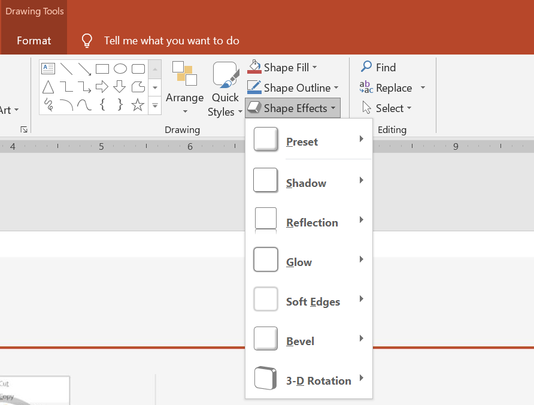

## **معرفی**

در حالی که افکت‌ها در PowerPoint می‌توانند برای برجسته کردن یک شکل استفاده شوند، آنها با [پرکردن‌ها](/slides/fa/java/shape-formatting/#gradient-fill) یا خطوط مرزی متفاوت هستند. با استفاده از افکت‌های PowerPoint می‌توانید انعکاس‌های واقعی بر روی یک شکل ایجاد کنید، تابش یک شکل را گسترش دهید و غیره.



* PowerPoint شش افکت ارائه می‌دهد که می‌توانند بر روی اشکال اعمال شوند. می‌توانید یک یا چند افکت را بر روی یک شکل اعمال کنید. 

* برخی ترکیب‌های افکت از سایرین جذاب‌تر به نظر می‌رسند. به همین دلیل گزینه‌های PowerPoint تحت **پیش تنظیم** قرار دارند. گزینه‌های پیش تنظیم در واقع ترکیب شناخته‌شده‌ای از دو یا چند افکت با ظاهر خوب هستند. به این ترتیب، با انتخاب یک پیش تنظیم، نیازی به صرف وقت برای آزمایش یا ترکیب افکت‌های مختلف برای یافتن ترکیب مناسب ندارید.

Aspose.Slides دارای ویژگی‌ها و متدهایی تحت کلاس [EffectFormat](https://reference.aspose.com/slides/fa/java/com.aspose.slides/EffectFormat) است که به شما امکان می‌دهد همان افکت‌ها را به اشکال در ارائه‌های PowerPoint اعمال کنید.

## **اعمال افکت سایه**

این کد Java نشان می‌دهد چگونه افکت سایه خارجی ([OuterShadowEffect](https://reference.aspose.com/slides/fa/java/com.aspose.slides/EffectFormat#setOuterShadowEffect--)) را بر روی یک مستطیل اعمال کنید:

```java
Presentation pres = new Presentation();
try {
    IShape shape = pres.getSlides().get_Item(0).getShapes().addAutoShape(ShapeType.RoundCornerRectangle, 20, 20, 200, 150);

    shape.getEffectFormat().enableOuterShadowEffect();
    shape.getEffectFormat().getOuterShadowEffect().getShadowColor().setColor(Color.DARK_GRAY);
    shape.getEffectFormat().getOuterShadowEffect().setDistance(10);
    shape.getEffectFormat().getOuterShadowEffect().setDirection(45);

    pres.save("output.pptx", SaveFormat.Pptx);
} finally {
    if (pres != null) pres.dispose();
}
```

## **اعمال افکت انعکاس**

این کد Java نشان می‌دهد چگونه افکت انعکاس را بر روی یک شکل اعمال کنید:

```java
Presentation pres = new Presentation();
try {
    IShape shape = pres.getSlides().get_Item(0).getShapes().addAutoShape(ShapeType.RoundCornerRectangle, 20, 20, 200, 150);

    shape.getEffectFormat().enableReflectionEffect();
    shape.getEffectFormat().getReflectionEffect().setRectangleAlign(RectangleAlignment.Bottom);
    shape.getEffectFormat().getReflectionEffect().setDirection(90);
    shape.getEffectFormat().getReflectionEffect().setDistance(55);
    shape.getEffectFormat().getReflectionEffect().setBlurRadius(4);

    pres.save("reflection.pptx", SaveFormat.Pptx);
} finally {
    if (pres != null) pres.dispose();
}
```

## **اعمال افکت تاب**

این کد Java نشان می‌دهد چگونه افکت تاب را بر روی یک شکل اعمال کنید:

```java
Presentation pres = new Presentation();
try {
    IShape shape = pres.getSlides().get_Item(0).getShapes().addAutoShape(ShapeType.RoundCornerRectangle, 20, 20, 200, 150);

    shape.getEffectFormat().enableGlowEffect();
    shape.getEffectFormat().getGlowEffect().getColor().setColor(Color.MAGENTA);
    shape.getEffectFormat().getGlowEffect().setRadius(15);

    pres.save("glow.pptx", SaveFormat.Pptx);
} finally {
    if (pres != null) pres.dispose();
}
```

## **اعمال افکت لبه‌های نرم**

این کد Java نشان می‌دهد چگونه لبه‌های نرم را بر روی یک شکل اعمال کنید:

```java
Presentation pres = new Presentation();
try {
    IShape shape = pres.getSlides().get_Item(0).getShapes().addAutoShape(ShapeType.RoundCornerRectangle, 20, 20, 200, 150);

    shape.getEffectFormat().enableSoftEdgeEffect();
    shape.getEffectFormat().getSoftEdgeEffect().setRadius(15);

    pres.save("softEdges.pptx", SaveFormat.Pptx);
} finally {
    if (pres != null) pres.dispose();
}
```

## **سئوالات متداول**

**آیا می‌توانم چندین افکت را روی یک شکل اعمال کنم؟**

بله، می‌توانید افکت‌های مختلف مانند سایه، انعکاس و تاب را بر روی یک شکل ترکیب کنید تا ظاهر پویا‌تری به‌دست آورید.

**به چه شکل‌هایی می‌توانم افکت اعمال کنم؟**

می‌توانید افکت‌ها را به انواع مختلفی از اشکال اعمال کنید، از جمله اشکال خودکار، نمودارها، جداول، تصاویر، اشیاء SmartArt، اشیاء OLE و غیره.

**آیا می‌توانم افکت‌ها را به اشکال گروهبندی شده اعمال کنم؟**

بله، می‌توانید افکت‌ها را به اشکال گروهبندی شده اعمال کنید. افکت بر روی کل گروه اعمال خواهد شد.