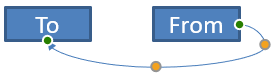

## **معرفی**

یک اتصال‌کنندهٔ PowerPoint یک خط ویژه است که دو شکل را به هم متصل یا لینک می‌کند و حتی زمانی که شکل‌ها جابجا یا دوباره موقعیت‌یابی می‌شوند، به آن‌ها متصل می‌ماند.  

اتصال‌کننده‌ها معمولاً به *نقطه‌های اتصال* (نقاط سبز) متصل می‌شوند که به‌صورت پیش‌فرض در تمام شکل‌ها وجود دارند. نقطه‌های اتصال وقتی که نشانگر به آن‌ها نزدیک شود ظاهر می‌شوند.  

*نقطه‌های تنظیم* (نقطه‌های نارنجی) که فقط در برخی اتصال‌کننده‌ها موجود‌اند، برای تغییر موقعیت و شکل اتصال‌کننده‌ها استفاده می‌شوند.  

## **انواع اتصال‌کننده‌ها**

در PowerPoint می‌توانید از اتصال‌کننده‌های مستقیم، زاویه‌دار (خمیده) و منحنی استفاده کنید.  

Aspose.Slides این اتصال‌کننده‌ها را فراهم می‌کند:

| اتصال‌کننده | تصویر | تعداد نقاط تنظیم |
| ------------------------------ | ------------------------------------------------------------ | --------------------------- |
| `ShapeType.Line` |  | 0 |
| `ShapeType.StraightConnector1` |  | 0 |
| `ShapeType.BentConnector2` |  | 0 |
| `ShapeType.BentConnector3` |  | 1 |
| `ShapeType.BentConnector4` |  | 2 |
| `ShapeType.BentConnector5` |  | 3 |
| `ShapeType.CurvedConnector2` |  | 0 |
| `ShapeType.CurvedConnector3` |  | 1 |
| `ShapeType.CurvedConnector4` |  | 2 |
| `ShapeType.CurvedConnector5` |  | 3 |

## **اتصال اشکال با استفاده از اتصال‌کننده‌ها**

1. یک نمونه از کلاس [Presentation](https://apireference.aspose.com/slides/fa/java/com.aspose.slides/Presentation) ایجاد کنید.  
1. مرجع اسلاید را از طریق ایندکس آن دریافت کنید.  
1. دو [AutoShape](https://reference.aspose.com/slides/fa/java/com.aspose.slides/AutoShape) را به اسلاید اضافه کنید با استفاده از متد `addAutoShape` که در شیء `Shapes` قرار دارد.  
1. یک اتصال‌کننده اضافه کنید با استفاده از متد `addConnector` که در شیء `Shapes` قرار دارد و نوع اتصال‌کننده را تعریف کنید.  
1. اشکال را با استفاده از اتصال‌کننده متصل کنید.  
1. متد `reroute` را فراخوانی کنید تا کوتاه‌ترین مسیر اتصال اعمال شود.  
1. ارائه (presentation) را ذخیره کنید.  

این کد Java نشان می‌دهد چگونه بین دو شکل (یک بیضی و یک مستطیل) یک اتصال‌کننده (یک اتصال‌کننده خمیده) اضافه کنید:

```Java
// یک کلاس ارائه (Presentation) را که نمایانگر فایل PPTX است ایجاد می‌کند
Presentation pres = new Presentation();
try {
    // مجموعه اشکال را برای یک اسلاید خاص دسترسی می‌یابد
    IShapeCollection shapes = pres.getSlides().get_Item(0).getShapes();
    
    // یک شکل خودکار بیضی (Ellipse) اضافه می‌کند
    IAutoShape ellipse = shapes.addAutoShape(ShapeType.Ellipse, 0, 100, 100, 100);
    
    // یک شکل خودکار مستطیل (Rectangle) اضافه می‌کند
    IAutoShape rectangle = shapes.addAutoShape(ShapeType.Rectangle, 100, 300, 100, 100);
    
    // یک شکل اتصال‌کننده را به مجموعه اشکال اسلاید اضافه می‌کند
    IConnector connector = shapes.addConnector(ShapeType.BentConnector2, 0, 0, 10, 10);
    
    // اشکال را با استفاده از اتصال‌کننده متصل می‌کند
    connector.setStartShapeConnectedTo(ellipse);
    connector.setEndShapeConnectedTo(rectangle);
    
    // متد reroute را فراخوانی می‌کند که مسیر کوتاه‌ترین خودکار بین اشکال را تنظیم می‌کند
    connector.reroute();
    
    // ارائه را ذخیره می‌کند
    pres.save("output.pptx", SaveFormat.Pptx);
} finally {
    if (pres != null) pres.dispose();
}
```

{} 

متد `Connector.reroute` یک اتصال‌کننده را دوباره مسیربندی می‌کند و آن را مجبور می‌کند تا کوتاه‌ترین مسیر ممکن بین اشکال را بگیرد. برای رسیدن به هدف خود، این متد ممکن است نقاط `setStartShapeConnectionSiteIndex` و `setEndShapeConnectionSiteIndex` را تغییر دهد. 

{} 

## **مشخص کردن نقطهٔ اتصال**

اگر می‌خواهید یک اتصال‌کننده دو شکل را با استفاده از نقاط خاصی روی اشکال متصل کند، باید نقطه‌های اتصال دلخواه خود را به این شکل مشخص کنید:

1. یک نمونه از کلاس [Presentation](https://reference.aspose.com/slides/fa/java/com.aspose.slides/Presentation) ایجاد کنید.  
1. مرجع اسلاید را از طریق ایندکس آن دریافت کنید.  
1. دو [AutoShape](https://reference.aspose.com/slides/fa/java/com.aspose.slides/AutoShape) را به اسلاید اضافه کنید با استفاده از متد `addAutoShape` که در شیء `Shapes` قرار دارد.  
1. یک اتصال‌کننده اضافه کنید با استفاده از متد `addConnector` که در شیء `Shapes` قرار دارد و نوع اتصال‌کننده را تعریف کنید.  
1. اشکال را با استفاده از اتصال‌کننده متصل کنید.  
1. نقطه‌های اتصال دلخواه خود را روی اشکال تنظیم کنید.  
1. ارائه را ذخیره کنید.  

این کد Java عملی را نشان می‌دهد که در آن یک نقطهٔ اتصال دلخواه مشخص می‌شود:

```java
// یک کلاس ارائه (Presentation) را که نمایانگر یک فایل PPTX است ایجاد می‌کند
Presentation pres = new Presentation();
try {
    // مجموعه اشکال را برای یک اسلاید خاص دسترسی می‌یابد
    IShapeCollection shapes = pres.getSlides().get_Item(0).getShapes();

    // یک شکل خودکار بیضی (Ellipse) اضافه می‌کند
    IAutoShape ellipse = shapes.addAutoShape(ShapeType.Ellipse, 0, 100, 100, 100);

    // یک شکل خودکار مستطیل (Rectangle) اضافه می‌کند
    IAutoShape rectangle = shapes.addAutoShape(ShapeType.Rectangle, 100, 300, 100, 100);

    // یک شکل اتصال‌کننده را به مجموعه اشکال اسلاید اضافه می‌کند
    IConnector connector = shapes.addConnector(ShapeType.BentConnector2, 0, 0, 10, 10);

    // اشکال را با استفاده از اتصال‌کننده متصل می‌کند
    connector.setStartShapeConnectedTo(ellipse);
    connector.setEndShapeConnectedTo(rectangle);

    // اندیس نقطه اتصال دلخواه را بر روی شکل بیضی تنظیم می‌کند
    int wantedIndex = 6;

    // بررسی می‌کند که آیا اندیس دلخواه کمتر از حداکثر تعداد سایت‌ها است یا نه
    if (ellipse.getConnectionSiteCount() > wantedIndex) 
    {
        // نقطه اتصال دلخواه را بر روی شکل خودکار بیضی تنظیم می‌کند
        connector.setStartShapeConnectionSiteIndex(wantedIndex);
    }

    // ارائه را ذخیره می‌کند
    pres.save("output.pptx", SaveFormat.Pptx);
} finally {
    if (pres != null) pres.dispose();
}
```

## **تنظیم یک نقطهٔ اتصال‌کننده**

می‌توانید یک اتصال‌کننده موجود را از طریق نقاط تنظیم آن تنظیم کنید. فقط اتصال‌کننده‌هایی که نقاط تنظیم دارند می‌توانند به این روش تغییر یابند. جدول زیر را در **[انواع اتصال‌کننده‌ها](/slides/fa/java/connector/#types-of-connectors)** مشاهده کنید.  

### **مورد ساده**

در نظر بگیرید که یک اتصال‌کننده بین دو شکل (A و B) از یک شکل سوم (C) عبور می‌کند:


```java
Presentation pres = new Presentation();
try {

    ISlide sld = pres.getSlides().get_Item(0);
    IShape shape = sld.getShapes().addAutoShape(ShapeType.Rectangle, 300, 150, 150, 75);
    IShape shapeFrom = sld.getShapes().addAutoShape(ShapeType.Rectangle, 500, 400, 100, 50);
    IShape shapeTo = sld.getShapes().addAutoShape(ShapeType.Rectangle, 100, 100, 70, 30);

    IConnector connector = sld.getShapes().addConnector(ShapeType.BentConnector5, 20, 20, 400, 300);

    connector.getLineFormat().setEndArrowheadStyle(LineArrowheadStyle.Triangle);
    connector.getLineFormat().getFillFormat().setFillType(FillType.Solid);
    connector.getLineFormat().getFillFormat().getSolidFillColor().setColor(Color.BLACK);

    connector.setStartShapeConnectedTo(shapeFrom);
    connector.setEndShapeConnectedTo(shapeTo);
    connector.setStartShapeConnectionSiteIndex(2);
} finally {
    if (pres != null) pres.dispose();
}
```

برای جلوگیری یا دور زدن شکل سوم، می‌توانیم اتصال‌کننده را با جابه‌جایی خط عمودی آن به سمت چپ به این شکل تنظیم کنیم:


```java
IAdjustValue adj2 = connector.getAdjustments().get_Item(1);
adj2.setRawValue(adj2.getRawValue() + 10000);
```

### **موارد پیچیده** 

برای انجام تنظیمات پیچیده‌تر، باید موارد زیر را در نظر بگیرید:

* یک نقطهٔ تنظیم‌پذیر اتصال‌کننده به‌طور قوی به فرمولی که موقعیت آن را محاسبه و تعیین می‌کند مرتبط است. بنابراین تغییر مکان نقطه ممکن است شکل اتصال‌کننده را تغییر دهد.  
* نقاط تنظیم اتصال‌کننده در یک آرایه به‌صورت ترتیب سخت‌گیرانه‌ای تعریف می‌شوند. نقاط تنظیم از نقطهٔ شروع اتصال‌کننده تا نقطهٔ پایان شماره‌گذاری می‌شوند.  
* مقادیر نقاط تنظیم درصدی از عرض/ارتفاع شکل اتصال‌کننده را نشان می‌دهند.  
  * شکل توسط نقاط شروع و پایان اتصال‌کننده ضربدر ۱۰۰۰ محدود می‌شود.  
  * اولین نقطه، دومین نقطه و سومین نقطه به ترتیب درصد از عرض، درصد از ارتفاع و دوباره درصد از عرض را تعریف می‌کنند.  
* برای محاسبهٔ مختصات نقاط تنظیم اتصال‌کننده، باید چرخش اتصال‌کننده و انعکاس آن را در نظر بگیرید. **Note** اینکه زاویهٔ چرخش تمام اتصال‌کننده‌های نشان داده‌شده در **[انواع اتصال‌کننده‌ها](/slides/fa/java/connector/#types-of-connectors)** برابر با ۰ است.  

#### **مورد 1**

در نظر بگیرید دو شیء قاب متن از طریق یک اتصال‌کننده به هم متصل هستند:


```java
// یک کلاس ارائه (Presentation) را که نمایانگر یک فایل PPTX است ایجاد می‌کند
Presentation pres = new Presentation();
try {
    // اولین اسلاید در ارائه را دریافت می‌کند
    ISlide sld = pres.getSlides().get_Item(0);
    // اشکالی را اضافه می‌کند که از طریق یک اتصال‌کننده به هم متصل می‌شوند
    IAutoShape shapeFrom = sld.getShapes().addAutoShape(ShapeType.Rectangle, 100, 100, 60, 25);
    shapeFrom.getTextFrame().setText("From");
    IAutoShape shapeTo = sld.getShapes().addAutoShape(ShapeType.Rectangle, 500, 100, 60, 25);
    shapeTo.getTextFrame().setText("To");
    // یک اتصال‌کننده اضافه می‌کند
    IConnector connector = sld.getShapes().addConnector(ShapeType.BentConnector4, 20, 20, 400, 300);
    // جهت اتصال‌کننده را مشخص می‌کند
    connector.getLineFormat().setEndArrowheadStyle(LineArrowheadStyle.Triangle);
    // رنگ اتصال‌کننده را مشخص می‌کند
    connector.getLineFormat().getFillFormat().setFillType(FillType.Solid);
    connector.getLineFormat().getFillFormat().getSolidFillColor().setColor(Color.RED);
    // ضخامت خط اتصال‌کننده را مشخص می‌کند
    connector.getLineFormat().setWidth(3);
    
    // اشکال را با استفاده از اتصال‌کننده به هم متصل می‌کند
    connector.setStartShapeConnectedTo(shapeFrom);
    connector.setStartShapeConnectionSiteIndex(3);
    connector.setEndShapeConnectedTo(shapeTo);
    connector.setEndShapeConnectionSiteIndex(2);
    
    // نقاط تنظیم اتصال‌کننده را دریافت می‌کند
    IAdjustValue adjValue_0 = connector.getAdjustments().get_Item(0);
    IAdjustValue adjValue_1 = connector.getAdjustments().get_Item(1);

} finally {
    if (pres != null) pres.dispose();
}
```

**تنظیم**

می‌توانیم مقادیر نقاط تنظیم اتصال‌کننده را با افزایش درصدهای عرض و ارتفاع مربوطه به ترتیب ۲۰٪ و ۲۰۰٪ تغییر دهیم:

```java
// مقادیر نقاط تنظیم را تغییر می‌دهد
adjValue_0.setRawValue(adjValue_0.getRawValue() + 20000);
adjValue_1.setRawValue(adjValue_1.getRawValue() + 200000);
```

نتیجه:


برای تعریف مدلی که بتواند مختصات و شکل بخش‌های فردی اتصال‌کننده را تعیین کند، یک شکل ایجاد می‌کنیم که به مؤلفهٔ افقی اتصال‌کننده در نقطهٔ `connector.getAdjustments().get_Item(0)` متناظر باشد:

```java
// رسم مؤلفه عمودی اتصال‌کننده
float x = connector.getX() + connector.getWidth() * adjValue_0.getRawValue() / 100000;
float y = connector.getY();
float height = connector.getHeight() * adjValue_1.getRawValue() / 100000;
sld.getShapes().addAutoShape( ShapeType .Rectangle, x, y, 0, height);
```

نتیجه:


#### **مورد 2**

در **مورد 1**، یک عملیات ساده تنظیم اتصال‌کننده را با استفاده از اصول پایه نشان دادیم. در شرایط عادی، باید چرخش اتصال‌کننده و نمایش آن (که توسط `connector.getRotation()`, `connector.getFrame().getFlipH()`, و `connector.getFrame().getFlipV()` تنظیم می‌شود) را در نظر بگیرید. اکنون این فرآیند را نشان می‌دهیم.

اول، یک شیء قاب متن جدید (**To 1**) به اسلاید اضافه می‌کنیم (برای مقاصد اتصال) و یک اتصال‌کنندهٔ جدید (سبز) ایجاد می‌کنیم که آن را به اشیائی که قبلاً ساختیم متصل می‌کند.

```java
// یک شیء بایندینگ جدید ایجاد می‌کند
IAutoShape shapeTo_1 = sld.getShapes().addAutoShape(ShapeType.Rectangle, 100, 400, 60, 25);
shapeTo_1.getTextFrame().setText("To 1");
// یک اتصال‌کننده جدید ایجاد می‌کند
connector = sld.getShapes().addConnector(ShapeType.BentConnector4, 20, 20, 400, 300);
connector.getLineFormat().setEndArrowheadStyle(LineArrowheadStyle.Triangle);
connector.getLineFormat().getFillFormat().setFillType(FillType.Solid);
connector.getLineFormat().getFillFormat().getSolidFillColor().setColor(Color.CYAN);
connector.getLineFormat().setWidth(3);
// اشیاء را با استفاده از اتصال‌کننده تازه ایجاد شده متصل می‌کند
connector.setStartShapeConnectedTo(shapeFrom);
connector.setStartShapeConnectionSiteIndex(2);
connector.setEndShapeConnectedTo(shapeTo_1);
connector.setEndShapeConnectionSiteIndex(3);
// نقاط تنظیم اتصال‌کننده را دریافت می‌کند
adjValue_0 = connector.getAdjustments().get_Item(0);
adjValue_1 = connector.getAdjustments().get_Item(1);
// مقادیر نقاط تنظیم را تغییر می‌دهد
adjValue_0.setRawValue(adjValue_0.getRawValue() + 20000);
adjValue_1.setRawValue(adjValue_1.getRawValue() + 200000);
```

نتیجه:


دوم، یک شکل ایجاد می‌کنیم که به مؤلفهٔ افقی اتصال‌کننده‌ای که از طریق نقطهٔ تنظیم جدید `connector.getAdjustments().get_Item(0)` می‌گذرد، متناظر باشد. مقادیر `connector.getRotation()`, `connector.getFrame().getFlipH()`, و `connector.getFrame().getFlipV()` را استفاده می‌کنیم و فرمول تبدیل مختصات معروف برای چرخش حول یک نقطهٔ داده‌شدهٔ x0 را اعمال می‌کنیم:

X = (x — x0) * cos(alpha) — (y — y0) * sin(alpha) + x0;  
Y = (x — x0) * sin(alpha) + (y — y0) * cos(alpha) + y0;

در مورد ما، زاویهٔ چرخش شیء ۹۰ درجه است و اتصال‌کننده به‌صورت عمودی نمایش داده می‌شود، بنابراین کد مربوطه به این صورت است:

```java
// مختصات اتصال‌کننده را ذخیره می‌کند
x = connector.getX();
y = connector.getY();
// مختصات اتصال‌کننده را در صورت نیاز اصلاح می‌کند
if (connector.getFrame().getFlipH() == NullableBool.True)
{
    x += connector.getWidth();
}
if (connector.getFrame().getFlipV() == NullableBool.True)
{
    y += connector.getHeight();
}
// مقدار نقطه تنظیم را به عنوان مختصات می‌گیرد
x += connector.getWidth() * adjValue_0.getRawValue() / 100000;
//  تبدیل مختصات زیرا Sin(90) = 1 و Cos(90) = 0
float xx = connector.getFrame().getCenterX() - y + connector.getFrame().getCenterY();
float yy = x - connector.getFrame().getCenterX() + connector.getFrame().getCenterY();
// عرض مؤلفه افقی را با استفاده از مقدار نقطه تنظیم دوم تعیین می‌کند
float width = connector.getHeight() * adjValue_1.getRawValue() / 100000;
IAutoShape shape = sld.getShapes().addAutoShape(ShapeType.Rectangle, xx, yy, width, 0);
shape.getLineFormat().getFillFormat().setFillType(FillType.Solid);
shape.getLineFormat().getFillFormat().getSolidFillColor().setColor(Color.RED);
```

نتیجه:


ما محاسبات مربوط به تنظیمات ساده و نقاط تنظیم پیچیده (نقاط تنظیم با زاویهٔ چرخش) را نشان دادیم. با استفاده از این دانش می‌توانید مدل خودتان را ایجاد کنید (یا کدی بنویسید) تا یک شیء `GraphicsPath` دریافت کنید یا حتی مقادیر نقاط تنظیم اتصال‌کننده را بر اساس مختصات خاص اسلاید تنظیم کنید.  

## **یابدن زاویهٔ خطوط اتصال‌کننده**

1. یک نمونه از کلاس ایجاد کنید.  
1. مرجع اسلاید را از طریق ایندکس آن دریافت کنید.  
1. به شکل خطی اتصال‌کننده دسترسی پیدا کنید.  
1. از عرض خط، ارتفاع، ارتفاع فریم شکل و عرض فریم شکل برای محاسبهٔ زاویه استفاده کنید.  

این کد Java عملی را نشان می‌دهد که در آن زاویهٔ یک شکل خطی اتصال‌کننده محاسبه شد:

```java
Presentation pres = new Presentation("ConnectorLineAngle.pptx");
try {
    Slide slide = (Slide)pres.getSlides().get_Item(0);
    
    for (int i = 0; i < slide.getShapes().size(); i++)
    {
        double dir = 0.0;
        Shape shape = (Shape)slide.getShapes().get_Item(i);
        if (shape instanceof AutoShape)
        {
            AutoShape ashp = (AutoShape)shape;
            if (ashp.getShapeType() == ShapeType.Line)
            {
                dir = getDirection(ashp.getWidth(), ashp.getHeight(),
                        ashp.getFrame().getFlipH() > 0, ashp.getFrame().getFlipV() > 0);
            }
        }
        else if (shape instanceof Connector)
        {
            Connector ashp = (Connector)shape;
            dir = getDirection(ashp.getWidth(), ashp.getHeight(),
                    ashp.getFrame().getFlipH() > 0, ashp.getFrame().getFlipV() > 0);
        }

        System.out.println(dir);
    }
} finally {
    if (pres != null) pres.dispose();
}
```

```java
public static double getDirection(float w, float h, boolean flipH, boolean flipV)
{
    float endLineX = w * (flipH ? -1 : 1);
    float endLineY = h * (flipV ? -1 : 1);
    float endYAxisX = 0;
    float endYAxisY = h;
    double angle = (Math.atan2(endYAxisY, endYAxisX) - Math.atan2(endLineY, endLineX));
    if (angle < 0) angle += 2 * Math.PI;
    return angle * 180.0 / Math.PI;
}
```

## **سوالات متداول**

**چگونه می‌توانم متوجه شوم که یک اتصال‌کننده می‌تواند به یک شکل خاص «چسبانده» شود؟**  

بررسی کنید که آیا شکل سایت‌های اتصال ([connection sites](https://reference.aspose.com/slides/fa/java/com.aspose.slides/shape/#getConnectionSiteCount--)) را در اختیار می‌گذارد یا نه. اگر هیچ‌کدام وجود نداشته باشد یا تعداد آن‌ها صفر باشد، چسباندن در دسترس نیست؛ در این صورت از نقاط انتهایی آزاد استفاده کنید و به‌صورت دستی موقعیت دهی کنید. بهتر است پیش از اتصال تعداد سایت‌ها را بررسی کنید.  

**اگر یکی از اشکال متصل را حذف کنم، چه اتفاقی برای اتصال‌کننده می‌افتد؟**  

سرهای آن جدا می‌شوند؛ اتصال‌کننده به عنوان یک خط عادی با نقاط شروع/پایان آزاد روی اسلاید باقی می‌ماند. می‌توانید آن را حذف کنید یا اتصالات را دوباره اختصاص دهید و در صورت نیاز، از [reroute](https://reference.aspose.com/slides/fa/java/com.aspose.slides/connector/#reroute--) استفاده کنید.  

**آیا بایندینگ‌های اتصال‌کننده هنگام کپی کردن یک اسلاید به ارائهٔ دیگری حفظ می‌شود؟**  

به‌طور کلی بله، به شرطی که اشکال هدف نیز کپی شوند. اگر اسلاید بدون اشکال متصل به آن وارد فایل دیگری شود، سرها آزاد می‌شوند و لازم است آن‌ها را دوباره متصل کنید.