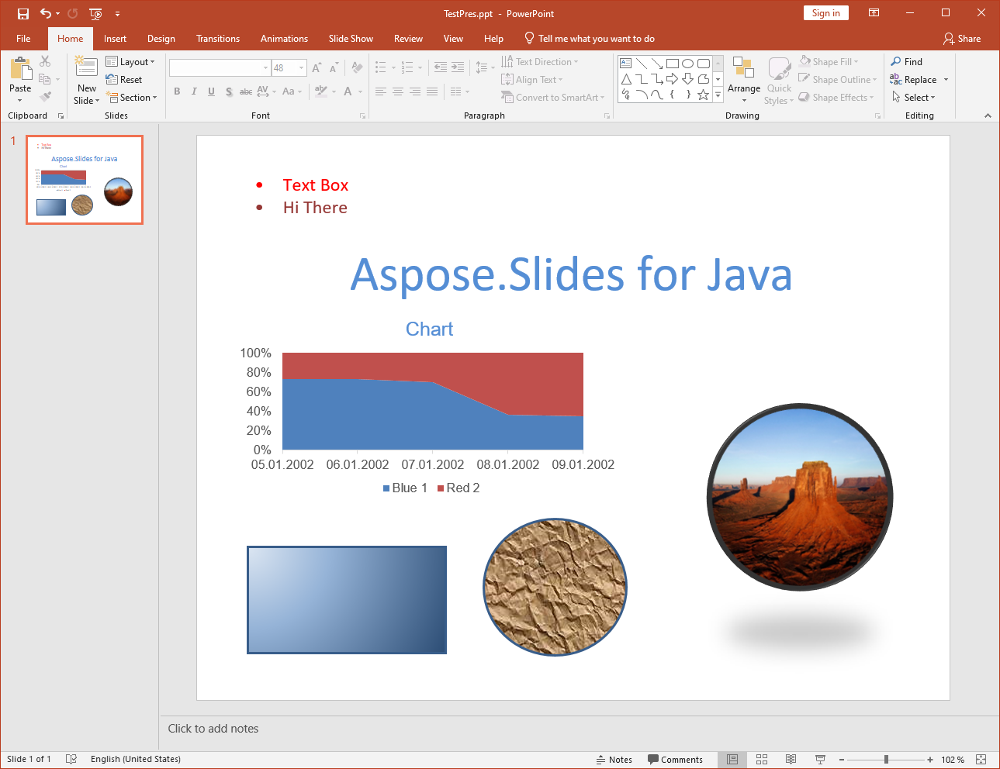

{} 

تبدیل PPT به PPTX در Aspose.Slides for Java پشتیبانی می‌شود. اکثر ویژگی‌های ارائه - اسلایدهای اصلی، ساختار و غیره - هنگام تبدیل از یک فرمت به فرمت دیگر حفظ می‌شوند، اما [چند محدودیت](/slides/fa/java/ppt-to-pptx-conversion/) وجود دارد.

{} 
## **ویژگی‌های پشتیبانی‌شده در تبدیل**
Aspose.Slides for Java پشتیبانی جزئی برای تبدیل قالب فایل PPT به PPTX را فراهم می‌کند. پشتیبانی از تبدیل به‌تازگی در Aspose.Slides for Java معرفی شده است، بنابراین چند محدودیت دارد و برای ارائه‌های ساده بهترین عملکرد را دارد. مزیت اصلی که Aspose.Slides for Java هنگام تبدیل PPT به PPTX ارائه می‌دهد، سهولت استفاده از API است. برای مشاهده مثال‌های کد، درباره [تبدیل PPT به PPTX]() بخوانید. در ادامه، فهرست‌ها توضیح می‌دهند کدام ویژگی‌ها پشتیبانی می‌شوند و کدام‌ها برای تبدیل PPT به PPTX پشتیبانی نمی‌شوند.

**ارائه PPT منبع**

**پس از تبدیل به PPTX**

## **ویژگی‌های پشتیبانی‌شده**
ویژگی‌های زیر برای تبدیل پشتیبانی می‌شوند:

- تبدیل ساختار اسلایدهای اصلی، چیدمان‌ها و اسلایدها.
- تبدیل نمودارها.
- گروه‌بندی اشکال.
- تبدیل اشکال خودکار شامل مستطیل‌ها و بیضی‌ها.
- اشکال با هندسه سفارشی.
- بافت‌ها و سبک‌های پر کردن تصاویر برای اشکال خودکار.
- تبدیل مکان‌گیرها.
- تبدیل خطوط و چندضلعی‌های باز.
- قالب‌های خط و پر کردن.
- سبک‌های پر کردن گرادیان.
- فریم‌های OLE، جدول‌ها، فریم‌های ویدئو و صدا و غیره.
- ویژگی‌های انیمیشن و نمایش اسلاید.
- تبدیل متن در فریم‌های متنی و نگهدارنده‌های متن.