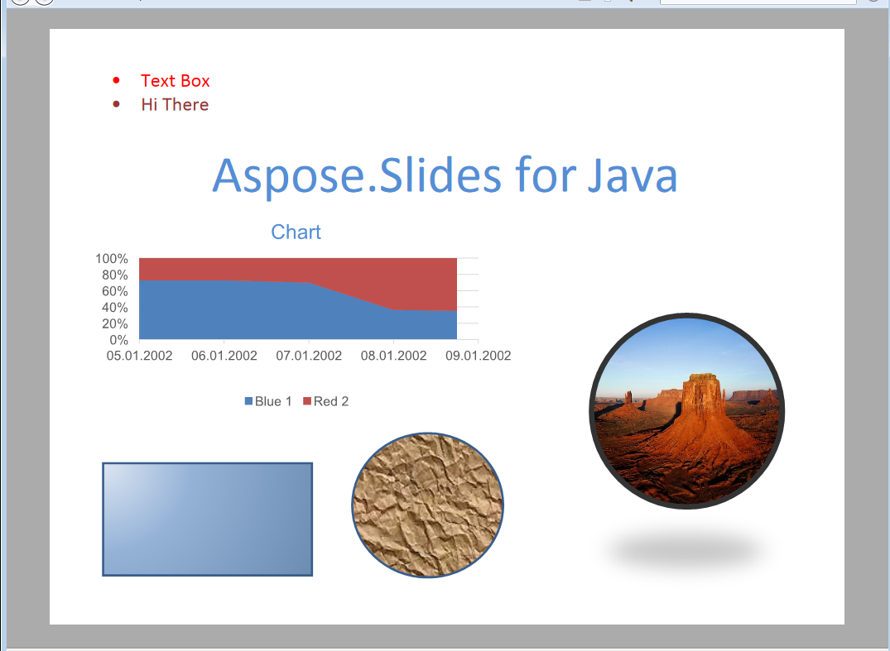

{}

این صفحه تاریخی است و برای پیوندهای موجود نگه داشته شده است. این صفحه نسخهٔ فعلی Aspose.Slides برای Java را توصیف نمی‌کند. برای قالب‌هایی که Aspose.Slides برای Java بارگذاری، وارد، ذخیره و رندر می‌کند و API هر یک، به [Supported File Formats](/slides/fa/java/supported-file-formats/) مراجعه کنید. برای راهنمای تبدیل XPS فعلی، به [Convert PowerPoint Presentations to XPS](/slides/fa/java/convert-powerpoint-to-xps/) مراجعه کنید.

{}

{}

[XML Paper Specification](https://en.wikipedia.org/wiki/Open_XML_Paper_Specification) یک زبان توصیف صفحه و فرمت سند ثابت است که در اصل توسط مایکروسافت توسعه یافته است. مشابه PDF، XPS برای حفظ صحت سند و ارائهٔ نمایش دستگاه‌نابنانی طراحی شده است.

{}

## **XPS در Aspose.Slides برای Java**
هر سند ارائه‌ای که توسط Aspose.Slides برای Java بارگذاری می‌شود می‌تواند به فرمت XPS تبدیل شود. Aspose.Slides برای Java از موتور چیدمان صفحه و رندر با دقت بالا استفاده می‌کند تا خروجی را در قالب سند XPS با چیدمان ثابت تولید کند.
می‌توانید دربارهٔ استخراج اسناد ارائه به اسناد XPS از طریق Aspose.Slides برای Java در [Convert PowerPoint Presentations to XPS](/slides/fa/java/convert-powerpoint-to-xps/) بیاموزید.

**ارائهٔ ورودی**

**یک ارائه تبدیل‌شده به XPS**

