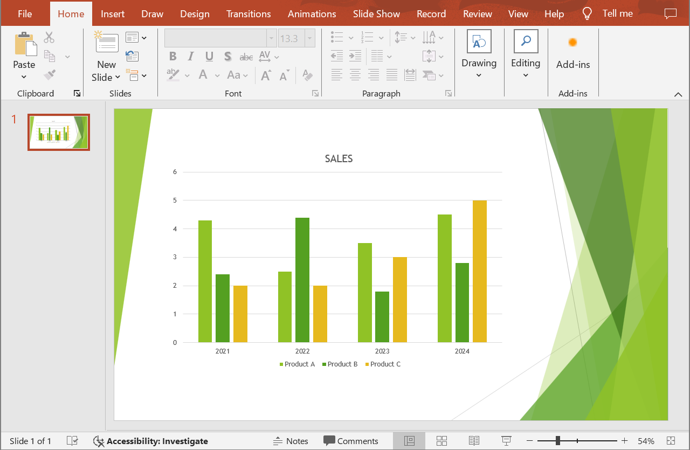

## **نمای کلی**

این مقاله راه حلی برای توسعه‌دهندگان جهت تبدیل ارائه‌های PowerPoint و OpenDocument به اسناد Word با استفاده از Aspose.Slides برای .NET و Aspose.Words برای .NET ارائه می‌دهد. راهنمای گام به گام شما را در تمام مراحل فرآیند تبدیل همراهی می‌کند.

## **تبدیل یک ارائه به سند Word**

دستورالعمل‌های زیر را برای تبدیل یک ارائه PowerPoint یا OpenDocument به سند Word دنبال کنید:

1. یک شی از کلاس [Presentation](https://reference.aspose.com/slides/fa/net/aspose.slides/presentation/) ایجاد کنید و فایل ارائه را بارگذاری کنید.
2. یک شی از کلاس‌های [Document](https://reference.aspose.com/words/net/aspose.words/document/) و [DocumentBuilder](https://reference.aspose.com/words/net/aspose.words/documentbuilder/) ایجاد کنید تا سند Word تولید شود.
3. اندازه صفحه سند Word را با استفاده از ویژگی [DocumentBuilder.PageSetup](https://reference.aspose.com/words/net/aspose.words/documentbuilder/pagesetup/) طوری تنظیم کنید که با ارائه مطابقت داشته باشد.
4. حاشیه‌ها را در سند Word با استفاده از ویژگی [DocumentBuilder.PageSetup](https://reference.aspose.com/words/net/aspose.words/documentbuilder/pagesetup/) تنظیم کنید.
5. تمام اسلایدهای ارائه را با استفاده از ویژگی [Presentation.Slides](https://reference.aspose.com/slides/fa/net/aspose.slides/presentation/slides/fa/) مرور کنید.
    - یک تصویر اسلاید با استفاده از متد `GetImage` از اینترفیس [ISlide](https://reference.aspose.com/slides/fa/net/aspose.slides/islide/) تولید کنید و آن را در یک حافظه‌نگهدار (memory stream) ذخیره کنید.
    - تصویر اسلاید را با استفاده از متد `InsertImage` از کلاس [DocumentBuilder](https://reference.aspose.com/words/net/aspose.words/documentbuilder/) به سند Word اضافه کنید.
6. سند Word را در یک فایل ذخیره کنید.

فرض کنید یک ارائه به نام "sample.pptx" داریم که به شکل زیر است:



مثال کد C# زیر نشان می‌دهد چگونه ارائه PowerPoint را به سند Word تبدیل کنید:

```cs
// یک فایل ارائه را بارگذاری کنید.
using var presentation = new Presentation("sample.pptx");

// ایجاد اشیای Document و DocumentBuilder.
var document = new Document();
var builder = new DocumentBuilder(document);

// تنظیم اندازه صفحه در سند Word.
var slideSize = presentation.SlideSize.Size;
builder.PageSetup.PageWidth = slideSize.Width;
builder.PageSetup.PageHeight = slideSize.Height;

// تنظیم حاشیه‌ها در سند Word.
builder.PageSetup.LeftMargin = 0;
builder.PageSetup.RightMargin = 0;
builder.PageSetup.TopMargin = 0;
builder.PageSetup.BottomMargin = 0;

const float scaleX = 2, scaleY = 2;

// مرور تمام اسلایدهای ارائه.
foreach (var slide in presentation.Slides)
{
    // تولید تصویر اسلاید و ذخیره آن در یک حافظه‌نگهدار.
    using var image = slide.GetImage(scaleX, scaleY);
    using var imageStream = new MemoryStream();
    image.Save(imageStream, ImageFormat.Png);

    // اضافه کردن تصویر اسلاید به سند Word.
    imageStream.Seek(0, SeekOrigin.Begin);
    builder.InsertImage(imageStream.ToArray(), builder.PageSetup.PageWidth, builder.PageSetup.PageHeight);

    builder.InsertBreak(BreakType.PageBreak);
}

// ذخیره سند Word در یک فایل.
document.Save("output.docx");
```

نتیجه:


{} 

سعی کنید **[مبدل آنلاین PPT به Word](https://products.aspose.app/slides/fa/conversion/ppt-to-word)** را امتحان کنید تا ببینید تبدیل ارائه‌های PowerPoint و OpenDocument به اسناد Word چه مزایایی دارد. 

{}

## **پرسش‌های متداول**

**چه اجزایی برای تبدیل ارائه‌های PowerPoint و OpenDocument به اسناد Word نیاز است؟**

فقط کافی است بسته‌های NuGet مربوط به [Aspose.Slides for .NET](https://www.nuget.org/packages/Aspose.Slides.NET) و [Aspose.Words for .NET](https://www.nuget.org/packages/Aspose.Words/) را به پروژه C# خود اضافه کنید. هر دو کتابخانه به‌صورت API مستقل کار می‌کنند و نیازی به نصب Microsoft Office نیست.

**آیا تمام فرمت‌های ارائه PowerPoint و OpenDocument پشتیبانی می‌شوند؟**

Aspose.Slides برای .NET [از تمام فرمت‌های ارائه پشتیبانی می‌کند](/slides/fa/net/supported-file-formats/)، از جمله PPT، PPTX، ODP و سایر انواع فایل‌های رایج. این اطمینان می‌دهد که می‌توانید با ارائه‌های ایجاد شده در نسخه‌های مختلف Microsoft PowerPoint کار کنید.