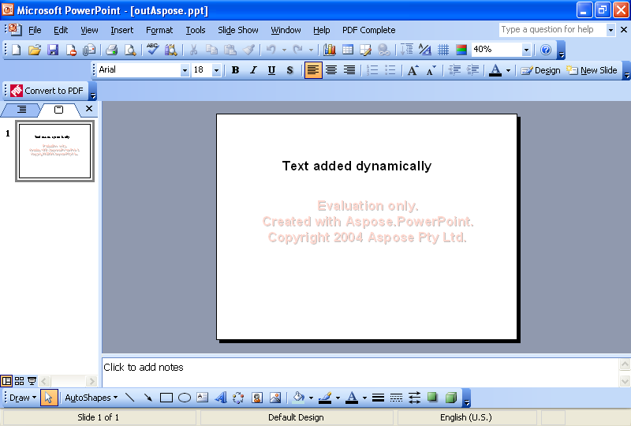

{}
یک وظیفهٔ رایج که توسعه‌دهندگان برای انجام آن تلاش می‌کنند، افزودن متن به اسلایدها به‌صورت پویا است. این مقاله مثال‌های کد برای افزودن متن به‌صورت پویا با استفاده از [VSTO](/slides/fa/net/adding-text-dynamically-using-vsto-and-aspose-slides-for-net/) و [Aspose.Slides for .NET](/slides/fa/net/adding-text-dynamically-using-vsto-and-aspose-slides-for-net/) را نشان می‌دهد.
{}
## **Adding Text Dynamically**
هر دو روش این مراحل را دنبال می‌کنند:

1. یک ارائه ایجاد کنید.
1. یک اسلاید خالی اضافه کنید.
1. یک جعبه متن اضافه کنید.
1. متنی تنظیم کنید.
1. ارائه را بنویسید.
## **VSTO Code Example**
قطعات کد زیر منجر به ایجاد یک ارائه با یک اسلاید ساده و یک رشته متن در آن می‌شود.

**The presentation as created in VSTO**


```c#
//توجه: PowerPoint یک فضای نام است که در بالا به این شکل تعریف شده است
//using PowerPoint = Microsoft.Office.Interop.PowerPoint;

//ایجاد یک ارائه
PowerPoint.Presentation pres = Globals.ThisAddIn.Application
	.Presentations.Add(Microsoft.Office.Core.MsoTriState.msoFalse);

//دریافت الگوی اسلاید خالی
PowerPoint.CustomLayout layout = pres.SlideMaster.
	CustomLayouts[7];

//افزودن یک اسلاید خالی
PowerPoint.Slide sld = pres.Slides.AddSlide(1, layout);

//افزودن متن
PowerPoint.Shape shp = sld.Shapes.AddTextbox(Microsoft.Office.Core.MsoTextOrientation.msoTextOrientationHorizontal, 150, 100, 400, 100);

//تنظیم متن
PowerPoint.TextRange txtRange = shp.TextFrame.TextRange;
txtRange.Text = "Text added dynamically";
txtRange.Font.Name = "Arial";
txtRange.Font.Bold = Microsoft.Office.Core.MsoTriState.msoTrue;
txtRange.Font.Size = 32;

//نوشتن خروجی به دیسک
pres.SaveAs("c:\\outVSTO.ppt",
	PowerPoint.PpSaveAsFileType.ppSaveAsPresentation,
	Microsoft.Office.Core.MsoTriState.msoFalse);
```

## **Aspose.Slides for .NET Example**
قطعات کد زیر با استفاده از Aspose.Slides یک ارائه با یک اسلاید ساده و یک رشته متن در آن ایجاد می‌کند.

**The presentation as created using Aspose.Slides for .NET**



```c#
//یک ارائه ایجاد کنید
Presentation pres = new Presentation();

//اسلاید خالی به‌صورت پیش‌فرض اضافه می‌شود، هنگام ایجاد
//ارائه از سازنده پیش‌فرض
//بنابراین، نیازی به افزودن اسلاید خالی دیگری نیست
ISlide sld = pres.Slides[1];

//یک جعبه متن اضافه کنید
//برای اضافه کردن آن، ابتدا یک مستطیل اضافه می‌کنیم
IShape shp = sld.Shapes.AddAutoShape(ShapeType.Rectangle, 1200, 800, 3200, 370);

//خط آن را مخفی کنید
shp.LineFormat.Style = LineStyle.NotDefined;

//سپس یک فریم متن داخل آن اضافه کنید
ITextFrame tf = ((IAutoShape)shp).TextFrame;

//متنی تنظیم کنید
tf.Text = "Text added dynamically";
IPortion port = tf.Paragraphs[0].Portions[0];

port.PortionFormat.FontBold = NullableBool.True;
port.PortionFormat.FontHeight = 32;

//خروجی را روی دیسک بنویسید
pres.Save("c:\\outAspose.ppt", SaveFormat.Ppt);
```