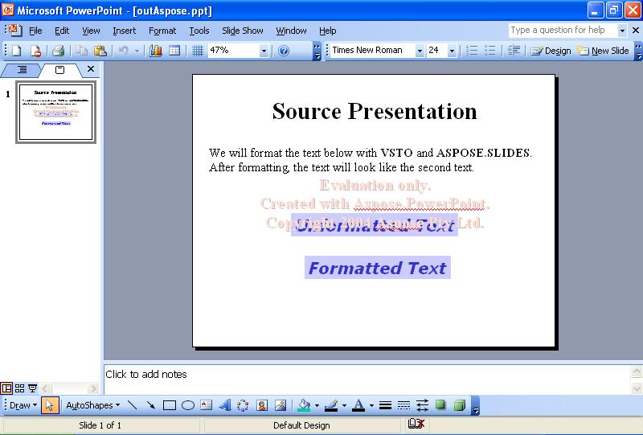

{} 

گاهی اوقات، نیاز دارید متن اسلایدها را به‌صورت برنامه‌نویسی فرمت کنید. این مقاله نشان می‌دهد چگونه یک ارائه نمونه را که متنی در اسلاید اول دارد، با استفاده از [VSTO](/slides/fa/net/format-text-using-vsto-and-aspose-slides-and-net/) و [Aspose.Slides for .NET](/slides/fa/net/format-text-using-vsto-and-aspose-slides-and-net/) بخوانید. کد متن در جعبه متن سوم اسلاید را طوری فرمت می‌کند که مشابه متن در جعبه متن آخر باشد.

{} 
## **فرمت‌کردن متن**
هر دو روش VSTO و Aspose.Slides مراحل زیر را انجام می‌دهند:

1. پیشنویس منبع را باز کنید.
1. به اسلاید اول دسترسی پیدا کنید.
1. به جعبه متن سوم دسترسی پیدا کنید.
1. فرمت متن در جعبه متن سوم را تغییر دهید.
1. ارائه را بر روی دیسک ذخیره کنید.

تصاویر زیر اسلاید نمونه را قبل و بعد از اجرای کد VSTO و Aspose.Slides for .NET نشان می‌دهند.

**ارائه ورودی** 


### **مثال کد VSTO**
کد زیر نشان می‌دهد چگونه متن یک اسلاید را با استفاده از VSTO بازفرمت کنید.

**متنی که با VSTO بازفرمت شده است** 


```c#
//توجه: PowerPoint یک فضای نام است که در بالا به این شکل تعریف شده است
//using PowerPoint = Microsoft.Office.Interop.PowerPoint;
PowerPoint.Presentation pres = null;

//Open the presentation
pres = Globals.ThisAddIn.Application.Presentations.Open("c:\\source.ppt",
	Microsoft.Office.Core.MsoTriState.msoFalse,
	Microsoft.Office.Core.MsoTriState.msoFalse,
	Microsoft.Office.Core.MsoTriState.msoTrue);

//Access the first slide
PowerPoint.Slide slide = pres.Slides[1];

//Access the third shape
PowerPoint.Shape shp = slide.Shapes[3];

//Change its text's font to Verdana and height to 32
PowerPoint.TextRange txtRange = shp.TextFrame.TextRange;
txtRange.Font.Name = "Verdana";
txtRange.Font.Size = 32;

//Bolden it
txtRange.Font.Bold = Microsoft.Office.Core.MsoTriState.msoCTrue;

//Italicize it
txtRange.Font.Italic = Microsoft.Office.Core.MsoTriState.msoCTrue;

//Change text color
txtRange.Font.Color.RGB = 0x00CC3333;

//Change shape background color
shp.Fill.ForeColor.RGB = 0x00FFCCCC;

//Reposition it horizontally
shp.Left -= 70;

//Write the output to disk
pres.SaveAs("c:\\outVSTO.ppt",
	PowerPoint.PpSaveAsFileType.ppSaveAsPresentation,
	Microsoft.Office.Core.MsoTriState.msoFalse);
```


### **مثال Aspose.Slides for .NET**
برای فرمت‌کردن متن با Aspose.Slides، قبل از فرمت‌کردن متن، قلم را اضافه کنید.

**ارائه خروجی ایجاد شده با Aspose.Slides** 




```c#
 //باز کردن ارائه
Presentation pres = new Presentation("c:\\source.ppt");

//Access the first slide
//دسترسی به اسلاید اول
ISlide slide = pres.Slides[0];

//Access the third shape
//دسترسی به شکل سوم
IShape shp = slide.Shapes[2];

//Change its text's font to Verdana and height to 32
//فونت متن را به Verdana و ارتفاع را به 32 تغییر دهید
ITextFrame tf = ((IAutoShape)shp).TextFrame;
IParagraph para = tf.Paragraphs[0];
IPortion port = para.Portions[0];
port.PortionFormat.LatinFont = new FontData("Verdana");

port.PortionFormat.FontHeight = 32;

//Bolden it
//متن را ضخیم کنید
port.PortionFormat.FontBold = NullableBool.True;

//Italicize it
//متن را ایتالیک کنید
port.PortionFormat.FontItalic = NullableBool.True;

//Change text color
//تغییر رنگ متن
//Set font color
//تنظیم رنگ قلم
port.PortionFormat.FillFormat.FillType = FillType.Solid;
port.PortionFormat.FillFormat.SolidFillColor.Color = Color.FromArgb(0x33, 0x33, 0xCC);

//Change shape background color
//تغییر رنگ پس‌زمینه شکل
shp.FillFormat.FillType = FillType.Solid;
shp.FillFormat.SolidFillColor.Color = Color.FromArgb(0xCC, 0xCC, 0xFF);

//Write the output to disk
//نوشتن خروجی به دیسک
pres.Save("c:\\outAspose.ppt", SaveFormat.Ppt);
```