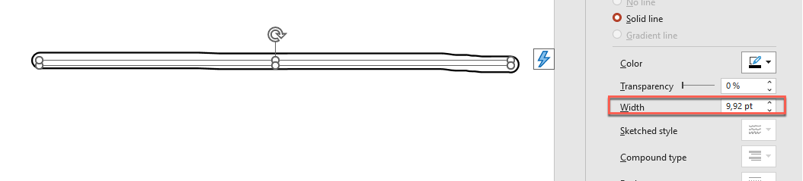

## **مقدمه**

PowerPoint عملکرد جوهر را فراهم می‌کند تا بتوانید شکل‌های غیر استاندارد را رسم کنید؛ این قابلیت می‌تواند برای برجسته‌سازی اشیای دیگر، نشان دادن ارتباطات و فرآیندها، و جلب توجه به موارد خاص در یک اسلاید استفاده شود.  

Aspose.Slides رابط [Aspose.Slides.Ink](https://reference.aspose.com/slides/fa/net/aspose.slides.ink/) را ارائه می‌دهد که شامل انواع مورد نیاز برای ایجاد و مدیریت اشیای جوهر است.  

## **تفاوت‌ها بین اشیای معمولی و اشیای جوهر**

اشیاء در یک اسلاید PowerPoint معمولاً توسط اشیای شکل (shape) نمایش داده می‌شوند. یک شیء شکل، در ساده‌ترین شکل خود، یک محفظه است که ناحیه شیء (قاب آن) را همراه با ویژگی‌هایش تعریف می‌کند. ویژگی‌ها شامل اندازه ناحیه محفظه، شکل محفظه، پس‌زمینه محفظه و غیره می‌شوند. برای اطلاعات بیشتر، به [Shape Layout Format](https://docs.aspose.com/slides/fa/net/shape-manipulations/#access-layout-formats-for-shape) مراجعه کنید.  

اما هنگامی که PowerPoint با یک شیء جوهر سروکار دارد، تمام ویژگی‌های قاب شیء (محفظه) را به جز اندازه‌اش نادیده می‌گیرد. اندازه ناحیه محفظه توسط مقادیر استاندارد `width` و `height` تعیین می‌شود:


## **ردیاب‌های Inkshape**

ردیاب یک عنصر پایه یا استانداردی است که برای ضبط مسیر قلم هنگام نوشتن جوهر دیجیتال توسط کاربر استفاده می‌شود. ردیاب‌ها ضبط‌هایی هستند که توالی نقاط متصل را توصیف می‌کنند.  

ساده‌ترین شکل رمزگذاری، مختصات X و Y هر نقطه نمونه را مشخص می‌کند. زمانی که تمام نقاط متصل رندر شوند، تصویری مشابه زیر تولید می‌شود:


## **ویژگی‌های قلم‌مو برای رسم**

می‌توانید از یک قلم‌مو برای رسم خطوطی که نقاط عناصر ردیاب را به هم وصل می‌کنند استفاده کنید. قلم‌مو دارای رنگ و اندازهٔ خود است که با ویژگی‌های `Brush.Color` و `Brush.Size` متناظر هستند.  

### **تنظیم رنگ قلم‌مو جوهر**

این کد C# نشان می‌دهد که چگونه رنگ یک قلم‌مو را تنظیم کنید:

```c#
using (Presentation pres = new Presentation("pres.pptx"))
{
    IInk ink = (IInk)pres.Slides[0].Shapes[0];
    IInkTrace[] traces = ink.Traces;
    IInkBrush brush = traces[0].Brush;
    Color brushColor = brush.Color;
    brush.Color = Color.Red;
}
```

### **تنظیم اندازه قلم‌مو جوهر**

این کد C# نشان می‌دهد که چگونه اندازه یک قلم‌مو را تنظیم کنید:

```c#
using (Presentation pres = new Presentation("pres.pptx"))
{
    IInk ink = (IInk)pres.Slides[0].Shapes[0];
    IInkTrace[] traces = ink.Traces;
    IInkBrush brush = traces[0].Brush;
    SizeF brushSize = brush.Size;
    brush.Size = new SizeF(5f, 10f);
}
```

به طور کلی، عرض و ارتفاع یک قلم‌مو مطابقت ندارند، بنابراین PowerPoint اندازه قلم‌مو را نشان نمی‌دهد (بخش داده‌ها خاکستری می‌شود). اما وقتی عرض و ارتفاع قلم‌مو برابر باشد، PowerPoint اندازه آن را به این شکل نمایش می‌دهد:



برای وضوح بیشتر، ارتفاع شیء جوهر را افزایش می‌دهیم و ابعاد مهم را بررسی می‌کنیم:


محفظه (قاب) اندازه قلم‌موها را در نظر نمی‌گیرد—همیشه فرض می‌کند که ضخامت خط صفر است (به تصویر آخر نگاه کنید).  

بنابراین، برای تعیین ناحیهٔ قابل مشاهده کل شیء جوهر، باید اندازه قلم‌موهای اشیای ردیاب را در نظر بگیریم. در اینجا، شیء هدف (شیء ردیاب متن دست‌نویس) به اندازه محفظه (قاب) مقیاس‌گذاری شده است. وقتی اندازه محفظه (قاب) تغییر می‌کند، اندازه قلم‌مو ثابت می‌ماند و بالعکس.


PowerPoint همان رفتار را هنگام کار با متن‌ها نشان می‌دهد:


**مطالعهٔ بیشتر**

* برای مطالعهٔ کلی دربارهٔ اشکال، به بخش [PowerPoint Shapes](https://docs.aspose.com/slides/fa/net/powerpoint-shapes/) مراجعه کنید.  
* برای اطلاعات بیشتر دربارهٔ مقادیر مؤثر، به [Shape Effective Properties](https://docs.aspose.com/slides/fa/net/shape-effective-properties/#get-effective-font-height-value) نگاه کنید.