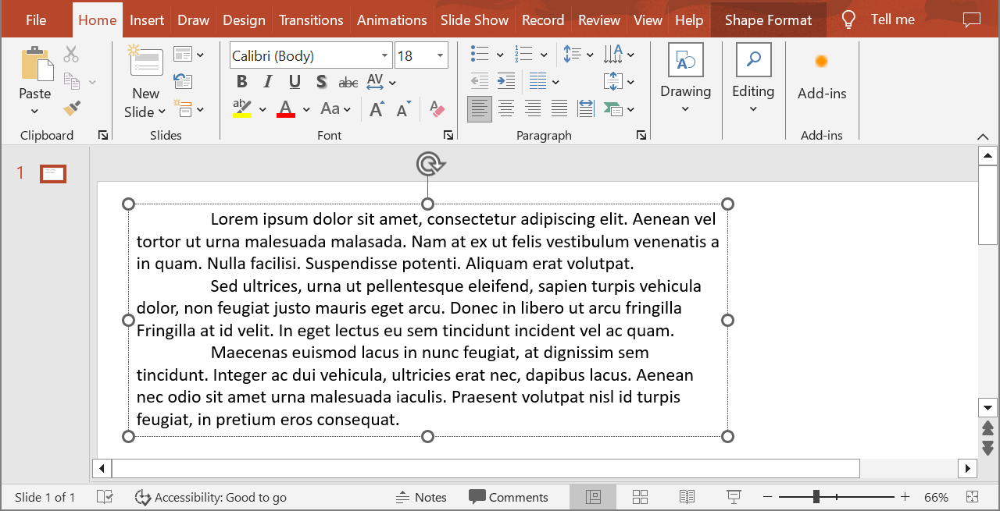

## **معرفی**

Aspose.Slides تمام رابط‌ها و کلاس‌هایی را که برای کار با متون، پاراگراف‌ها و بخش‌های PowerPoint در C# نیاز دارید، فراهم می‌کند.

* Aspose.Slides رابط [ITextFrame](https://reference.aspose.com/slides/fa/net/aspose.slides/itextframe/) را فراهم می‌کند تا بتوانید اشیائی که نمایانگر یک پاراگراف هستند اضافه کنید. یک شیء `ITextFame` می‌تواند یک یا چند پاراگراف داشته باشد (هر پاراگراف از طریق یک بازگشت carriage ایجاد می‌شود).
* Aspose.Slides رابط [IParagraph](https://reference.aspose.com/slides/fa/net/aspose.slides/iparagraph/) را فراهم می‌کند تا بتوانید اشیائی که نمایانگر بخش‌ها هستند اضافه کنید. یک شیء `IParagraph` می‌تواند یک یا چند بخش داشته باشد (مجموعه‌ای از اشیاء iPortions).
* Aspose.Slides رابط [IPortion](https://reference.aspose.com/slides/fa/net/aspose.slides/iportion/) را فراهم می‌کند تا بتوانید اشیائی که نمایانگر متون و ویژگی‌های قالب‌بندی آن‌ها هستند اضافه کنید.

یک شیء `IParagraph` قادر است متونی با ویژگی‌های قالب‌بندی مختلف را از طریق اشیاء `IPortion` زیرین خود مدیریت کند.

## **اضافه‌کردن چندین پاراگراف شامل چندین بخش**

این مراحل نشان می‌دهند چگونه یک فریم متن شامل ۳ پاراگراف و هر پاراگراف شامل ۳ بخش اضافه کنید:

1. یک نمونه از کلاس [Presentation](https://reference.aspose.com/slides/fa/net/aspose.slides/presentation) ایجاد کنید.
2. از طریق ایندکس، به مرجع اسلاید مربوطه دسترسی پیدا کنید.
3. یک [IAutoShape](https://reference.aspose.com/slides/fa/net/aspose.slides/iautoshape/) مستطیل به اسلاید اضافه کنید.
4. ITextFrame مرتبط با [IAutoShape](https://reference.aspose.com/slides/fa/net/aspose.slides/iautoshape/) را دریافت کنید.
5. دو شیء [IParagraph](https://reference.aspose.com/slides/fa/net/aspose.slides/iparagraph/) ایجاد کنید و آنها را به مجموعه `IParagraphs` مربوط به [ITextFrame](https://reference.aspose.com/slides/fa/net/aspose.slides/iautoshape/) اضافه کنید.
6. برای هر `IParagraph` جدید، سه شیء [IPortion](https://reference.aspose.com/slides/fa/net/aspose.slides/iportion/) ایجاد کنید (برای پاراگراف پیش‌فرض دو شیء Portion) و هر شیء `IPortion` را به مجموعه IPortion مربوط به هر `IParagraph` اضافه کنید.
7. متنی برای هر بخش تنظیم کنید.
8. ویژگی‌های قالب‌بندی موردنظر خود را با استفاده از خصوصیات قالب‌بندی موجود در شیء `IPortion` بر هر بخش اعمال کنید.
9. پرزنتیشن تغییر یافته را ذخیره کنید.

```c#
// یک شی از کلاس Presentation که نمایانگر یک فایل PPTX است را ایجاد می‌کند
using (Presentation pres = new Presentation())
{
    // به اولین اسلاید دسترسی می‌یابد
    ISlide slide = pres.Slides[0];

    // یک IAutoShape مستطیل اضافه می‌کند
    IAutoShape ashp = slide.Shapes.AddAutoShape(ShapeType.Rectangle, 50, 150, 300, 150);

    // به TextFrame شکل خودکار دسترسی می‌یابد
    ITextFrame tf = ashp.TextFrame;

    // پاراگراف‌ها و بخش‌ها را با قالب‌بندی‌های متنی مختلف ایجاد می‌کند
    IParagraph para0 = tf.Paragraphs[0];
    IPortion port01 = new Portion();
    IPortion port02 = new Portion();
    para0.Portions.Add(port01);
    para0.Portions.Add(port02);

    IParagraph para1 = new Paragraph();
    tf.Paragraphs.Add(para1);
    IPortion port10 = new Portion();
    IPortion port11 = new Portion();
    IPortion port12 = new Portion();
    para1.Portions.Add(port10);
    para1.Portions.Add(port11);
    para1.Portions.Add(port12);

    IParagraph para2 = new Paragraph();
    tf.Paragraphs.Add(para2);
    IPortion port20 = new Portion();
    IPortion port21 = new Portion();
    IPortion port22 = new Portion();
    para2.Portions.Add(port20);
    para2.Portions.Add(port21);
    para2.Portions.Add(port22);

    for (int i = 0; i < 3; i++)
        for (int j = 0; j < 3; j++)
        {
            tf.Paragraphs[i].Portions[j].Text = "Portion0" + j.ToString();
            if (j == 0)
            {
                tf.Paragraphs[i].Portions[j].PortionFormat.FillFormat.FillType = FillType.Solid;
                tf.Paragraphs[i].Portions[j].PortionFormat.FillFormat.SolidFillColor.Color = Color.Red;
                tf.Paragraphs[i].Portions[j].PortionFormat.FontBold = NullableBool.True;
                tf.Paragraphs[i].Portions[j].PortionFormat.FontHeight = 15;
            }
            else if (j == 1)
            {
                tf.Paragraphs[i].Portions[j].PortionFormat.FillFormat.FillType = FillType.Solid;
                tf.Paragraphs[i].Portions[j].PortionFormat.FillFormat.SolidFillColor.Color = Color.Blue;
                tf.Paragraphs[i].Portions[j].PortionFormat.FontItalic = NullableBool.True;
                tf.Paragraphs[i].Portions[j].PortionFormat.FontHeight = 18;
            }
        }
    // پرزنتیشن تغییر یافته را ذخیره می‌کند
    pres.Save("multiParaPort_out.pptx", SaveFormat.Pptx);
}
```

## **مدیریت گلوله‌های پاراگراف**

فهرست‌های گلوله‌ای به شما کمک می‌کنند تا اطلاعات را به‌سرعت و به‌صورت مؤثر سازماندهی و ارائه کنید. پاراگراف‌های دارای گلوله همیشه خواندن و درک آسان‌تری دارند.

1. یک نمونه از کلاس [Presentation](https://reference.aspose.com/slides/fa/net/aspose.slides/presentation) ایجاد کنید.
2. از طریق ایندکس، به مرجع اسلاید مربوطه دسترسی پیدا کنید.
3. یک autoshape به اسلاید انتخابی اضافه کنید.
4. به [TextFrame](https://reference.aspose.com/slides/fa/net/aspose.slides/itextframe/) autoshape دسترسی پیدا کنید. 
5. پاراگراف پیش‌فرض در `TextFrame` را حذف کنید.
6. اولین پاراگراف را با استفاده از کلاس [Paragraph](https://reference.aspose.com/slides/fa/net/aspose.slides/paragraph/) ایجاد کنید.
8. نوع گلوله (`Type`) پاراگراف را به `Symbol` تنظیم کنید و کاراکتر گلوله را تعیین کنید.
9. متن پاراگراف (`Text`) را تنظیم کنید.
10. تورفتگی پاراگراف (`Indent`) برای گلوله را تنظیم کنید.
11. رنگی برای گلوله تعیین کنید.
12. ارتفاع گلوله را تنظیم کنید.
13. پاراگراف جدید را به مجموعه پاراگراف‌های `TextFrame` اضافه کنید.
14. پاراگراف دوم را اضافه کنید و فرآیند مراحل 7 تا 13 را تکرار کنید.
15. پرزنتیشن را ذخیره کنید.

```c#
// یک شی از کلاس Presentation که نمایانگر یک فایل PPTX است را ایجاد می‌کند
using (Presentation pres = new Presentation())
{

    // به اولین اسلاید دسترسی می‌یابد
    ISlide slide = pres.Slides[0];


    // یک Autoshape اضافه می‌کند و به آن دسترسی می‌یابد
    IAutoShape aShp = slide.Shapes.AddAutoShape(ShapeType.Rectangle, 200, 200, 400, 200);

    // به فریم متن autoshape دسترسی می‌یابد
    ITextFrame txtFrm = aShp.TextFrame;

    // پاراگراف پیش‌فرض را حذف می‌کند
    txtFrm.Paragraphs.RemoveAt(0);

    // یک پاراگراف ایجاد می‌کند
    Paragraph para = new Paragraph();

    // سبک و نماد گلوله پاراگراف را تنظیم می‌کند
    para.ParagraphFormat.Bullet.Type = BulletType.Symbol;
    para.ParagraphFormat.Bullet.Char = Convert.ToChar(8226);

    // متن پاراگراف را تنظیم می‌کند
    para.Text = "Welcome to Aspose.Slides";

    // تورفتگی گلوله را تنظیم می‌کند
    para.ParagraphFormat.Indent = 25;

    // رنگ گلوله را تنظیم می‌کند
    para.ParagraphFormat.Bullet.Color.ColorType = ColorType.RGB;
    para.ParagraphFormat.Bullet.Color.Color = Color.Black;
    para.ParagraphFormat.Bullet.IsBulletHardColor = NullableBool.True; // مقدار IsBulletHardColor را به true تنظیم می‌کند تا از رنگ دلخواه برای گلوله استفاده شود

    // ارتفاع گلوله را تنظیم می‌کند
    para.ParagraphFormat.Bullet.Height = 100;

    // پاراگراف را به فریم متن اضافه می‌کند
    txtFrm.Paragraphs.Add(para);

    // پاراگراف دوم را ایجاد می‌کند
    Paragraph para2 = new Paragraph();

    // نوع و سبک گلوله پاراگراف را تنظیم می‌کند
    para2.ParagraphFormat.Bullet.Type = BulletType.Numbered;
    para2.ParagraphFormat.Bullet.NumberedBulletStyle = NumberedBulletStyle.BulletCircleNumWDBlackPlain;

    // متن پاراگراف را اضافه می‌کند
    para2.Text = "This is numbered bullet";

    // تورفتگی گلوله را تنظیم می‌کند
    para2.ParagraphFormat.Indent = 25;

    para2.ParagraphFormat.Bullet.Color.ColorType = ColorType.RGB;
    para2.ParagraphFormat.Bullet.Color.Color = Color.Black;
    para2.ParagraphFormat.Bullet.IsBulletHardColor = NullableBool.True; // مقدار IsBulletHardColor را به true تنظیم می‌کند تا از رنگ دلخواه برای گلوله استفاده شود

    // ارتفاع گلوله را تنظیم می‌کند
    para2.ParagraphFormat.Bullet.Height = 100;

    // پاراگراف را به فریم متن اضافه می‌کند
    txtFrm.Paragraphs.Add(para2);


    // پرزنتیشن تغییر یافته را ذخیره می‌کند
    pres.Save("Bullet_out.pptx", SaveFormat.Pptx);

}
```

## **مدیریت گلوله‌های تصویری**

فهرست‌های گلوله‌ای به شما کمک می‌کنند تا اطلاعات را به‌سرعت و به‌صورت مؤثر سازماندهی و ارائه کنید. پاراگراف‌های تصویری خواندن آسان و درک ساده‌ای دارند.

1. یک نمونه از کلاس [Presentation](https://reference.aspose.com/slides/fa/net/aspose.slides/presentation) ایجاد کنید.
2. از طریق ایندکس، به مرجع اسلاید مربوطه دسترسی پیدا کنید.
3. یک autoshape به اسلاید اضافه کنید.
4. به [TextFrame](https://reference.aspose.com/slides/fa/net/aspose.slides/textframe/) autoshape دسترسی پیدا کنید.
5. پاراگراف پیش‌فرض در `TextFrame` را حذف کنید.
6. اولین پاراگراف را با استفاده از کلاس [Paragraph](https://reference.aspose.com/slides/fa/net/aspose.slides/paragraph/) ایجاد کنید.
7. تصویر را در [IPPImage](https://reference.aspose.com/slides/fa/net/aspose.slides/ippimage/) بارگیری کنید.
8. نوع گلوله را به [Picture](https://reference.aspose.com/slides/fa/net/aspose.slides/ippimage/) تنظیم کنید و تصویر را تعیین کنید.
9. متن پاراگراف (`Text`) را تنظیم کنید.
10. تورفتگی پاراگراف (`Indent`) برای گلوله را تنظیم کنید.
11. رنگی برای گلوله تعیین کنید.
12. ارتفاع گلوله را تنظیم کنید.
13. پاراگراف جدید را به مجموعه پاراگراف‌های `TextFrame` اضافه کنید.
14. پاراگراف دوم را اضافه کنید و فرآیند بر اساس مراحل قبلی را تکرار کنید.
15. پرزنتیشن تغییر یافته را ذخیره کنید.

```c#
// یک شی از کلاس Presentation که نمایانگر یک فایل PPTX است را ایجاد می‌کند
Presentation presentation = new Presentation();

// به اولین اسلاید دسترسی می‌یابد
ISlide slide = presentation.Slides[0];

// تصویر برای گلوله‌ها را ایجاد می‌کند
IImage image = Images.FromFile("bullets.png");
IPPImage ippxImage = presentation.Images.AddImage(image);
image.Dispose();

// یک Autoshape اضافه می‌کند و به آن دسترسی می‌یابد
IAutoShape autoShape = slide.Shapes.AddAutoShape(ShapeType.Rectangle, 200, 200, 400, 200);

// به فریم متن autoshape دسترسی می‌یابد
ITextFrame textFrame = autoShape.TextFrame;

// پاراگراف پیش‌فرض را حذف می‌کند
textFrame.Paragraphs.RemoveAt(0);

// یک پاراگراف جدید ایجاد می‌کند
Paragraph paragraph = new Paragraph();
paragraph.Text = "Welcome to Aspose.Slides";

// سبک گلوله پاراگراف و تصویر را تنظیم می‌کند
paragraph.ParagraphFormat.Bullet.Type = BulletType.Picture;
paragraph.ParagraphFormat.Bullet.Picture.Image = ippxImage;

// ارتفاع گلوله را تنظیم می‌کند
paragraph.ParagraphFormat.Bullet.Height = 100;

// پاراگراف را به فریم متن اضافه می‌کند
textFrame.Paragraphs.Add(paragraph);

// پرزنتیشن را به عنوان فایل PPTX می‌نویسد
presentation.Save("ParagraphPictureBulletsPPTX_out.pptx", SaveFormat.Pptx);

// پرزنتیشن را به عنوان فایل PPT می‌نویسد
presentation.Save("ParagraphPictureBulletsPPT_out.ppt", SaveFormat.Ppt);
```

## **مدیریت گلوله‌های چندسطحی**

فهرست‌های گلوله‌ای به شما کمک می‌کنند تا اطلاعات را به‌سرعت و به‌صورت مؤثر سازماندهی و ارائه کنید. گلوله‌های چندسطحی خواندن آسان و درک ساده‌ای دارند.

1. یک نمونه از کلاس [Presentation](https://reference.aspose.com/slides/fa/net/aspose.slides/presentation) ایجاد کنید.
2. از طریق ایندکس، به مرجع اسلاید مربوطه دسترسی پیدا کنید.
3. یک autoshape در اسلاید جدید اضافه کنید.
4. به [TextFrame](https://reference.aspose.com/slides/fa/net/aspose.slides/textframe/) autoshape دسترسی پیدا کنید.
5. پاراگراف پیش‌فرض در `TextFrame` را حذف کنید.
6. پاراگراف اول را با استفاده از کلاس [Paragraph](https://reference.aspose.com/slides/fa/net/aspose.slides/paragraph/) ایجاد کنید و عمق را به ۰ تنظیم کنید.
7. پاراگراف دوم را با کلاس `Paragraph` ایجاد کنید و عمق را به ۱ تنظیم کنید.
8. پاراگراف سوم را با کلاس `Paragraph` ایجاد کنید و عمق را به ۲ تنظیم کنید.
9. پاراگراف چهارم را با کلاس `Paragraph` ایجاد کنید و عمق را به ۳ تنظیم کنید.
10. پاراگراف‌های جدید را به مجموعه پاراگراف‌های `TextFrame` اضافه کنید.
11. پرزنتیشن تغییر یافته را ذخیره کنید.

```c#
// یک شی از کلاس Presentation که نمایانگر یک فایل PPTX است را ایجاد می‌کند
using (Presentation pres = new Presentation())
{

    // به اولین اسلاید دسترسی می‌یابد
    ISlide slide = pres.Slides[0];
    
    // یک Autoshape اضافه می‌کند و به آن دسترسی می‌یابد
    IAutoShape aShp = slide.Shapes.AddAutoShape(ShapeType.Rectangle, 200, 200, 400, 200);

    // به فریم متن Autoshape ایجاد شده دسترسی می‌یابد
    ITextFrame text = aShp.AddTextFrame("");
    
    // پاراگراف پیش‌فرض را پاک می‌کند
    text.Paragraphs.Clear();

    // پاراگراف اول را اضافه می‌کند
    IParagraph para1 = new Paragraph();
    para1.Text = "Content";
    para1.ParagraphFormat.Bullet.Type = BulletType.Symbol;
    para1.ParagraphFormat.Bullet.Char = Convert.ToChar(8226);
    para1.ParagraphFormat.DefaultPortionFormat.FillFormat.FillType = FillType.Solid;
    para1.ParagraphFormat.DefaultPortionFormat.FillFormat.SolidFillColor.Color = Color.Black;
    // سطح گلوله را تنظیم می‌کند
    para1.ParagraphFormat.Depth = 0;

    // پاراگراف دوم را اضافه می‌کند
    IParagraph para2 = new Paragraph();
    para2.Text = "Second Level";
    para2.ParagraphFormat.Bullet.Type = BulletType.Symbol;
    para2.ParagraphFormat.Bullet.Char = '-';
    para2.ParagraphFormat.DefaultPortionFormat.FillFormat.FillType = FillType.Solid;
    para2.ParagraphFormat.DefaultPortionFormat.FillFormat.SolidFillColor.Color = Color.Black;
    // سطح گلوله را تنظیم می‌کند
    para2.ParagraphFormat.Depth = 1;

    // پاراگراف سوم را اضافه می‌کند
    IParagraph para3 = new Paragraph();
    para3.Text = "Third Level";
    para3.ParagraphFormat.Bullet.Type = BulletType.Symbol;
    para3.ParagraphFormat.Bullet.Char = Convert.ToChar(8226);
    para3.ParagraphFormat.DefaultPortionFormat.FillFormat.FillType = FillType.Solid;
    para3.ParagraphFormat.DefaultPortionFormat.FillFormat.SolidFillColor.Color = Color.Black;
    // سطح گلوله را تنظیم می‌کند
    para3.ParagraphFormat.Depth = 2;

    // پاراگراف چهارم را اضافه می‌کند
    IParagraph para4 = new Paragraph();
    para4.Text = "Fourth Level";
    para4.ParagraphFormat.Bullet.Type = BulletType.Symbol;
    para4.ParagraphFormat.Bullet.Char = '-';
    para4.ParagraphFormat.DefaultPortionFormat.FillFormat.FillType = FillType.Solid;
    para4.ParagraphFormat.DefaultPortionFormat.FillFormat.SolidFillColor.Color = Color.Black;
    // سطح گلوله را تنظیم می‌کند
    para4.ParagraphFormat.Depth = 3;

    // پاراگراف‌ها را به مجموعه اضافه می‌کند
    text.Paragraphs.Add(para1);
    text.Paragraphs.Add(para2);
    text.Paragraphs.Add(para3);
    text.Paragraphs.Add(para4);

    // پرزنتیشن را به عنوان فایل PPTX می‌نویسد
    pres.Save("MultilevelBullet.pptx", Aspose.Slides.Export.SaveFormat.Pptx);
}
```

## **مدیریت پاراگراف با فهرست شماره‌گذاری سفارشی**

رابط [IBulletFormat](https://reference.aspose.com/slides/fa/net/aspose.slides/ibulletformat/) ویژگی [NumberedBulletStartWith](https://reference.aspose.com/slides/fa/net/aspose.slides/ibulletformat/numberedbulletstartwith) و سایر ویژگی‌ها را فراهم می‌کند که به شما امکان مدیریت پاراگراف‌ها با شماره‌گذاری یا قالب‌بندی سفارشی را می‌دهد.

1. یک نمونه از کلاس [Presentation](https://reference.aspose.com/slides/fa/net/aspose.slides/presentation) ایجاد کنید.
2. به اسلاید حاوی پاراگراف دسترسی پیدا کنید.
3. یک autoshape به اسلاید اضافه کنید.
4. به [TextFrame](https://reference.aspose.com/slides/fa/net/aspose.slides/textframe/) autoshape دسترسی پیدا کنید.
5. پاراگراف پیش‌فرض در `TextFrame` را حذف کنید.
6. پاراگراف اول را با استفاده از کلاس [Paragraph](https://reference.aspose.com/slides/fa/net/aspose.slides/paragraph/) ایجاد کنید و [NumberedBulletStartWith](https://reference.aspose.com/slides/fa/net/aspose.slides/ibulletformat/numberedbulletstartwith) را به ۲ تنظیم کنید.
7. پاراگراف دوم را با کلاس `Paragraph` ایجاد کنید و `NumberedBulletStartWith` را به ۳ تنظیم کنید.
8. پاراگراف سوم را با کلاس `Paragraph` ایجاد کنید و `NumberedBulletStartWith` را به ۷ تنظیم کنید.
9. پاراگراف‌های جدید را به مجموعه پاراگراف‌های `TextFrame` اضافه کنید.
10. پرزنتیشن تغییر یافته را ذخیره کنید.

```c#
using (var presentation = new Presentation())
{
	var shape = presentation.Slides[0].Shapes.AddAutoShape(ShapeType.Rectangle, 200, 200, 400, 200);

	// به فریم متن autoshape ایجاد شده دسترسی می‌یابد
	ITextFrame textFrame = shape.TextFrame;

	// پاراگراف پیش‌فرض موجود را حذف می‌کند
	textFrame.Paragraphs.RemoveAt(0);

	// فهرست اول
	var paragraph1 = new Paragraph { Text = "bullet 2" };
	paragraph1.ParagraphFormat.Depth = 4; 
	paragraph1.ParagraphFormat.Bullet.NumberedBulletStartWith = 2;
	paragraph1.ParagraphFormat.Bullet.Type = BulletType.Numbered;
	textFrame.Paragraphs.Add(paragraph1);

	var paragraph2 = new Paragraph { Text = "bullet 3" };
	paragraph2.ParagraphFormat.Depth = 4;
	paragraph2.ParagraphFormat.Bullet.NumberedBulletStartWith = 3; 
	paragraph2.ParagraphFormat.Bullet.Type = BulletType.Numbered;  
	textFrame.Paragraphs.Add(paragraph2);

	
	var paragraph5 = new Paragraph { Text = "bullet 7" };
	paragraph5.ParagraphFormat.Depth = 4;
	paragraph5.ParagraphFormat.Bullet.NumberedBulletStartWith = 7;
	paragraph5.ParagraphFormat.Bullet.Type = BulletType.Numbered;
	textFrame.Paragraphs.Add(paragraph5);

	presentation.Save("SetCustomBulletsNumber-slides.pptx", SaveFormat.Pptx);
}
```

## **تنظیم تورفتگی خط اول برای یک پاراگراف**

از ویژگی [IParagraphFormat.Indent](https://reference.aspose.com/slides/fa/net/aspose.slides/iparagraphformat/indent/) برای کنترل تورفتگی خط اول یک پاراگراف استفاده کنید. این ویژگی فقط خط اول را نسبت به حاشیه چپ پاراگراف جابه‌جا می‌کند. مقدار مثبت خط اول را به راست منتقل می‌کند، در حالی که خطوط باقی‌مانده به بدنه پاراگراف هم‌راستا می‌مانند.

زمانی که نیاز به جابه‌جا کردن کل پاراگراف دارید، از [IParagraphFormat.MarginLeft](https://reference.aspose.com/slides/fa/net/aspose.slides/iparagraphformat/marginleft/) استفاده کنید. وقتی فقط خط اول را می‌خواهید جابه‌جا کنید، از [IParagraphFormat.Indent](https://reference.aspose.com/slides/fa/net/aspose.slides/iparagraphformat/indent/) استفاده کنید.

مثال زیر چندین پاراگراف ایجاد می‌کند و مقادیر مختلف `Indent` را اعمال می‌نماید تا نشان دهد تورفتگی خط اول چگونه بر چیدمان پاراگراف تأثیر می‌گذارد.

1. یک نمونه از کلاس [Presentation](https://reference.aspose.com/slides/fa/net/aspose.slides/presentation/) ایجاد کنید.
2. به اسلاید هدف دسترسی پیدا کنید.
3. یک [AutoShape](https://reference.aspose.com/slides/fa/net/aspose.slides/autoshape/) مستطیلی به اسلاید اضافه کنید.
4. یک [TextFrame](https://reference.aspose.com/slides/fa/net/aspose.slides/textframe/) خالی به شکل اضافه کنید و پاراگراف پیش‌فرض را حذف کنید.
5. چندین پاراگراف ایجاد کنید و مقادیر متفاوت [Indent](https://reference.aspose.com/slides/fa/net/aspose.slides/iparagraphformat/indent/) را برای آنها تنظیم کنید.
6. پاراگراف‌ها را به فریم متن اضافه کنید.
7. پرزنتیشن تغییر یافته را ذخیره کنید.

```cs
using (Presentation presentation = new Presentation())
{
    ISlide slide = presentation.Slides[0];

    IAutoShape rectangleShape = slide.Shapes.AddAutoShape(ShapeType.Rectangle, 50, 50, 420, 220);
    rectangleShape.FillFormat.FillType = FillType.NoFill;
    rectangleShape.LineFormat.FillFormat.FillType = FillType.Solid;
    rectangleShape.LineFormat.FillFormat.SolidFillColor.Color = Color.Gray;

    ITextFrame textFrame = rectangleShape.AddTextFrame(string.Empty);
    textFrame.TextFrameFormat.AutofitType = TextAutofitType.Shape;
    textFrame.Paragraphs.RemoveAt(0);

    Paragraph firstParagraph = new Paragraph();
    firstParagraph.ParagraphFormat.DefaultPortionFormat.FillFormat.FillType = FillType.Solid;
    firstParagraph.ParagraphFormat.DefaultPortionFormat.FillFormat.SolidFillColor.Color = Color.Black;
    firstParagraph.Text = "No first-line indent. Wrapped lines start at the same position as the first line.";
    firstParagraph.ParagraphFormat.MarginLeft = 20f;
    firstParagraph.ParagraphFormat.Indent = 0f;

    Paragraph secondParagraph = new Paragraph();
    secondParagraph.ParagraphFormat.DefaultPortionFormat.FillFormat.FillType = FillType.Solid;
    secondParagraph.ParagraphFormat.DefaultPortionFormat.FillFormat.SolidFillColor.Color = Color.Black;
    secondParagraph.Text = "First-line indent of 20 points. The first line moves to the right, while wrapped lines remain aligned to the paragraph body.";
    secondParagraph.ParagraphFormat.MarginLeft = 20f;
    secondParagraph.ParagraphFormat.Indent = 20f;

    Paragraph thirdParagraph = new Paragraph();
    thirdParagraph.ParagraphFormat.DefaultPortionFormat.FillFormat.FillType = FillType.Solid;
    thirdParagraph.ParagraphFormat.DefaultPortionFormat.FillFormat.SolidFillColor.Color = Color.Black;
    thirdParagraph.Text = "First-line indent of 40 points. This paragraph shows a larger first-line offset to make the effect easier to see.";
    thirdParagraph.ParagraphFormat.MarginLeft = 20f;
    thirdParagraph.ParagraphFormat.Indent = 40f;

    textFrame.Paragraphs.Add(firstParagraph);
    textFrame.Paragraphs.Add(secondParagraph);
    textFrame.Paragraphs.Add(thirdParagraph);

    presentation.Save("paragraph_indent.pptx", SaveFormat.Pptx);
}
```

نتیجه:


## **تنظیم تورفتگی معلق برای یک پاراگراف**

تورفتگی معلق یک چیدمان پاراگراف است که در آن خط اول به سمت چپ خطوط باقی‌مانده شروع می‌شود. در Aspose.Slides، این اثر را با ویژگی [IParagraphFormat.Indent](https://reference.aspose.com/slides/fa/net/aspose.slides/iparagraphformat/indent/) ایجاد می‌کنید. `Indent` را به مقدار منفی تنظیم کنید تا خط اول نسبت به بدنه پاراگراف به چپ جابه‌جا شود.

در عمل، [IParagraphFormat.MarginLeft](https://reference.aspose.com/slides/fa/net/aspose.slides/iparagraphformat/marginleft/) موقعیت چپ بدنه پاراگراف را تعریف می‌کند و [IParagraphFormat.Indent](https://reference.aspose.com/slides/fa/net/aspose.slides/iparagraphformat/indent/) موقعیت خط اول را نسبت به آن حاشیه تعیین می‌کند. برای ایجاد تورفتگی معلق، مقدار مثبت `MarginLeft` و مقدار منفی `Indent` تنظیم کنید.

این قالب‌بندی برای کتابشناسی‌ها، مراجع، ورودی‌های واژه‌نامه و سایر پاراگراف‌هایی که خطوط پیچیده باید زیر بدنه پاراگراف تراز شوند نه زیر اولین کاراکتر خط اول، مفید است.

1. یک نمونه از کلاس [Presentation](https://reference.aspose.com/slides/fa/net/aspose.slides/presentation/) ایجاد کنید.
2. به اسلاید هدف دسترسی پیدا کنید.
3. یک [AutoShape](https://reference.aspose.com/slides/fa/net/aspose.slides/autoshape/) مستطیلی به اسلاید اضافه کنید.
4. یک [TextFrame](https://reference.aspose.com/slides/fa/net/aspose.slides/textframe/) خالی به شکل اضافه کنید و پاراگراف پیش‌فرض را حذف کنید.
5. پاراگراف‌ها را ایجاد کنید و برای هر پاراگراف مقدار مثبت [MarginLeft](https://reference.aspose.com/slides/fa/net/aspose.slides/iparagraphformat/marginleft/) تنظیم کنید.
6. مقدار منفی [Indent](https://reference.aspose.com/slides/fa/net/aspose.slides/iparagraphformat/indent/) تنظیم کنید تا اثر تورفتگی معلق ایجاد شود.
7. پاراگراف‌ها را به فریم متن اضافه کنید.
8. پرزنتیشن تغییر یافته را ذخیره کنید.

```cs
using (Presentation presentation = new Presentation())
{
    ISlide slide = presentation.Slides[0];

    IAutoShape rectangleShape = slide.Shapes.AddAutoShape(ShapeType.Rectangle, 50, 50, 420, 220);
    rectangleShape.FillFormat.FillType = FillType.NoFill;
    rectangleShape.LineFormat.FillFormat.FillType = FillType.Solid;
    rectangleShape.LineFormat.FillFormat.SolidFillColor.Color = Color.Gray;

    ITextFrame textFrame = rectangleShape.AddTextFrame(string.Empty);
    textFrame.TextFrameFormat.AutofitType = TextAutofitType.Shape;
    textFrame.Paragraphs.RemoveAt(0);

    Paragraph firstParagraph = new Paragraph();
    firstParagraph.ParagraphFormat.DefaultPortionFormat.FillFormat.FillType = FillType.Solid;
    firstParagraph.ParagraphFormat.DefaultPortionFormat.FillFormat.SolidFillColor.Color = Color.Black;
    firstParagraph.Text = "A hanging indent is created by combining a positive left margin with a negative indent. The first line starts to the left, while wrapped lines align with the paragraph body.";
    firstParagraph.ParagraphFormat.MarginLeft = 40f;
    firstParagraph.ParagraphFormat.Indent = -20f;

    Paragraph secondParagraph = new Paragraph();
    secondParagraph.ParagraphFormat.DefaultPortionFormat.FillFormat.FillType = FillType.Solid;
    secondParagraph.ParagraphFormat.DefaultPortionFormat.FillFormat.SolidFillColor.Color = Color.Black;
    secondParagraph.Text = "This second example uses a deeper hanging indent so the difference between the first line and the wrapped lines is easier to compare.";
    secondParagraph.ParagraphFormat.MarginLeft = 60f;
    secondParagraph.ParagraphFormat.Indent = -30f;

    textFrame.Paragraphs.Add(firstParagraph);
    textFrame.Paragraphs.Add(secondParagraph);

    presentation.Save("hanging_indent.pptx", SaveFormat.Pptx);
}
```

نتیجه:


## **مدیریت ویژگی‌های End برای پاراگراف**

1. یک نمونه از کلاس [Presentation](https://reference.aspose.com/slides/fa/net/aspose.slides/presentation) ایجاد کنید.
2. مرجع اسلاید حاوی پاراگراف را از طریق موقعیت آن دریافت کنید.
3. یک autoshape مستطیل به اسلاید اضافه کنید.
4. یک [TextFrame](https://reference.aspose.com/slides/fa/net/aspose.slides/textframe/) با دو پاراگراف به مستطیل اضافه کنید.
5. `FontHeight` و نوع فونت را برای پاراگراف‌ها تنظیم کنید.
6. ویژگی‌های End را برای پاراگراف‌ها تنظیم کنید.
7. پرزنتیشن را به صورت فایل PPTX بنویسید.

```c#
using (Presentation pres = new Presentation("Test.pptx"))
{
	IAutoShape shape = pres.Slides[0].Shapes.AddAutoShape(ShapeType.Rectangle, 10, 10, 200, 250);

	Paragraph para1 = new Paragraph();
	para1.Portions.Add(new Portion("Sample text"));

	Paragraph para2 = new Paragraph();
	para2.Portions.Add(new Portion("Sample text 2"));
	PortionFormat endParagraphPortionFormat = new PortionFormat();
	endParagraphPortionFormat.FontHeight = 48;
	endParagraphPortionFormat.LatinFont = new FontData("Times New Roman");
	para2.EndParagraphPortionFormat = endParagraphPortionFormat;

	shape.TextFrame.Paragraphs.Add(para1);
	shape.TextFrame.Paragraphs.Add(para2);

	pres.Save("pres.pptx", SaveFormat.Pptx);
}
```

## **وارد کردن متن HTML به پاراگراف‌ها**

Aspose.Slides پشتیبانی پیشرفته‌ای برای وارد کردن متن HTML به پاراگراف‌ها فراهم می‌کند.

1. یک نمونه از کلاس [Presentation](https://reference.aspose.com/slides/fa/net/aspose.slides/presentation) ایجاد کنید.
2. از طریق ایندکس، به مرجع اسلاید مربوطه دسترسی پیدا کنید.
3. یک autoshape به اسلاید اضافه کنید.
4. `autoshape` را به [ITextFrame](https://reference.aspose.com/slides/fa/net/aspose.slides/itextframe/) دسترسی پیدا کنید.
5. پاراگراف پیش‌فرض در `ITextFrame` را حذف کنید.
6. فایل HTML منبع را در یک TextReader بخوانید.
7. پاراگراف اول را با استفاده از کلاس [Paragraph](https://reference.aspose.com/slides/fa/net/aspose.slides/paragraph/) ایجاد کنید.
8. محتوای فایل HTML را از TextReader خوانده شده به [ParagraphCollection](https://reference.aspose.com/slides/fa/net/aspose.slides/paragraphcollection/) فریم متن اضافه کنید.
9. پرزنتیشن تغییر یافته را ذخیره کنید.

```c#
// یک نمونه خالی از پرزنتیشن ایجاد می‌کند
using (Presentation pres = new Presentation())
{
    // به اسلاید پیش‌فرض اول پرزنتیشن دسترسی می‌یابد
    ISlide slide = pres.Slides[0];

    // یک AutoShape اضافه می‌کند تا محتویات HTML را در خود نگه دارد
    IAutoShape ashape = slide.Shapes.AddAutoShape(ShapeType.Rectangle, 10, 10, pres.SlideSize.Size.Width - 20, pres.SlideSize.Size.Height - 10);

    ashape.FillFormat.FillType = FillType.NoFill;

    // یک فریم متن به شکل اضافه می‌کند
    ashape.AddTextFrame("");

    // تمام پاراگراف‌های فریم متن اضافه‌شده را پاک می‌کند
    ashape.TextFrame.Paragraphs.Clear();

    // فایل HTML را با استفاده از StreamReader بارگذاری می‌کند
    TextReader tr = new StreamReader("file.html");

    // متن خوانده شده از StreamReader HTML را به فریم متن اضافه می‌کند
    ashape.TextFrame.Paragraphs.AddFromHtml(tr.ReadToEnd());

    // پرزنتیشن را ذخیره می‌کند
    pres.Save("output_out.pptx", Aspose.Slides.Export.SaveFormat.Pptx);
}
```

## **صادر کردن متن پاراگراف به HTML**

Aspose.Slides پشتیبانی پیشرفته‌ای برای صادر کردن متون (موجود در پاراگراف‌ها) به HTML فراهم می‌کند.

1. یک نمونه از کلاس [Presentation](https://reference.aspose.com/slides/fa/net/aspose.slides/presentation) ایجاد کنید و پرزنتیشن موردنظر را بارگذاری کنید.
2. از طریق ایندکس، به مرجع اسلاید مربوطه دسترسی پیدا کنید.
3. به شکل حاوی متنی که به HTML صادر خواهد شد دسترسی پیدا کنید.
4. به [TextFrame](https://reference.aspose.com/slides/fa/net/aspose.slides/textframe/) شکل دسترسی پیدا کنید.
5. یک نمونه از `StreamWriter` ایجاد کنید و فایل HTML جدید را اضافه کنید.
6. یک ایندکس شروع به StreamWriter بدهید و پاراگراف‌های موردنظر را صادر کنید.

```c#
// فایل پرزنتیشن را بارگذاری می‌کند
using (Presentation pres = new Presentation("ExportingHTMLText.pptx"))
{

    // به اسلاید پیش‌فرض اول پرزنتیشن دسترسی می‌یابد
    ISlide slide = pres.Slides[0];

    // به ایندکس مورد نیاز دسترسی می‌یابد
    int index = 0;

    // به شکل اضافه‌شده دسترسی می‌یابد
    IAutoShape ashape = (IAutoShape)slide.Shapes[index];

    StreamWriter sw = new StreamWriter("output_out.html", false, Encoding.UTF8);

    // داده‌های پاراگراف‌ها را به HTML می‌نویسد با مشخص کردن ایندکس شروع پاراگراف و تعداد پاراگراف‌های قابل کپی
    sw.Write(ashape.TextFrame.Paragraphs.ExportToHtml(0, ashape.TextFrame.Paragraphs.Count, null));

    sw.Close();
}
```

## **ذخیره یک پاراگراف به عنوان تصویر**

در این بخش، دو مثال را بررسی می‌کنیم که نشان می‌دهند چگونه یک پاراگراف متنی، نمایندگی شده توسط رابط [IParagraph](https://reference.aspose.com/slides/fa/net/aspose.slides/iparagraph/)، به عنوان تصویر ذخیره می‌شود. هر دو مثال شامل دریافت تصویر یک شکل حاوی پاراگراف با استفاده از متدهای `GetImage` از رابط [IShape](https://reference.aspose.com/slides/fa/net/aspose.slides/ishape/)، محاسبه محدوده پاراگراف داخل شکل، و صادر کردن آن به عنوان یک تصویر bitmap است. این روش‌ها به شما امکان می‌دهند بخش‌های خاصی از متن را از ارائه‌های PowerPoint استخراج کنید و به‌صورت تصاویر جداگانه ذخیره کنید، که می‌تواند در سناریوهای مختلف مفید باشد.

فرض کنید فایلی به نام sample.pptx داریم که یک اسلاید دارد و اولین شکل آن یک جعبه متن است که سه پاراگراف دارد.



**مثال 1**

در این مثال، پاراگراف دوم را به‌عنوان تصویر استخراج می‌کنیم. برای این کار، تصویر شکل را از اسلاید اول ارائه استخراج می‌کنیم و سپس محدوده پاراگراف دوم را در فریم متن شکل محاسبه می‌کنیم. سپس پاراگراف روی یک تصویر bitmap جدید رسم می‌شود و به‌صورت PNG ذخیره می‌گردد. این روش به‌ویژه وقتی مفید است که بخواهید پاراگراف خاصی را به‌صورت تصویر جداگانه ذخیره کنید و ابعاد و قالب‌بندی دقیق متن حفظ شود.

```csharp
using var presentation = new Presentation("sample.pptx");
var firstShape = presentation.Slides[0].Shapes[0] as IAutoShape;

// Save the shape in memory as a bitmap.
using var shapeImage = firstShape.GetImage();
using var shapeImageStream = new MemoryStream();
shapeImage.Save(shapeImageStream, ImageFormat.Png);

// Create a shape bitmap from memory.
shapeImageStream.Seek(0, SeekOrigin.Begin);
using var shapeBitmap = Image.FromStream(shapeImageStream);

// Calculate the boundaries of the second paragraph.
var secondParagraph = firstShape.TextFrame.Paragraphs[1];
var paragraphRectangle = secondParagraph.GetRect();

// Calculate the size for the output image (minimum size - 1x1 pixel).
var imageWidth = Math.Max(1, (int)Math.Ceiling(paragraphRectangle.Width));
var imageHeight = Math.Max(1, (int)Math.Ceiling(paragraphRectangle.Height));

// Prepare a bitmap for the paragraph.
using var paragraphBitmap = new Bitmap(imageWidth, imageHeight);

// Redraw the paragraph from the shape bitmap to the paragraph bitmap.
using var imageGraphics = Graphics.FromImage(paragraphBitmap);
var drawingRectangle = new RectangleF(0, 0, paragraphRectangle.Width, paragraphRectangle.Height);
imageGraphics.DrawImage(shapeBitmap, drawingRectangle, paragraphRectangle, GraphicsUnit.Pixel);

paragraphBitmap.Save("paragraph.png", System.Drawing.Imaging.ImageFormat.Png);
```

نتیجه:


**مثال 2**

در این مثال، روش قبلی را با افزودن عوامل مقیاس به تصویر پاراگراف گسترش می‌دهیم. شکل از ارائه استخراج می‌شود و با عامل مقیاس `2` به‌عنوان تصویر ذخیره می‌شود. این امکان خروجی با وضوح بالاتر را هنگام صادر کردن پاراگراف فراهم می‌کند. سپس محدوده پاراگراف با در نظر گرفتن مقیاس محاسبه می‌شود. مقیاس‌گذاری می‌تواند زمانی مفید باشد که تصویر دقیق‌تری نیاز باشد، برای مثال برای استفاده در مواد چاپی با کیفیت بالا.

```csharp
var imageScaleX = 2f;
var imageScaleY = imageScaleX;

using var presentation = new Presentation("sample.pptx");
var firstShape = presentation.Slides[0].Shapes[0] as IAutoShape;

// Save the shape in memory as a bitmap with scaling.
using var shapeImage = firstShape.GetImage(ShapeThumbnailBounds.Shape, imageScaleX, imageScaleY);
using var shapeImageStream = new MemoryStream();
shapeImage.Save(shapeImageStream, ImageFormat.Png);

// Create a shape bitmap from memory.
shapeImageStream.Seek(0, SeekOrigin.Begin);
using var shapeBitmap = Image.FromStream(shapeImageStream);

// Calculate the boundaries of the second paragraph.
var secondParagraph = firstShape.TextFrame.Paragraphs[1];
var paragraphRectangle = secondParagraph.GetRect();
paragraphRectangle.X *= imageScaleX;
paragraphRectangle.Y *= imageScaleY;
paragraphRectangle.Width *= imageScaleX;
paragraphRectangle.Height *= imageScaleY;

// Calculate the size for the output image (minimum size - 1x1 pixel).
var imageWidth = Math.Max(1, (int)Math.Ceiling(paragraphRectangle.Width));
var imageHeight = Math.Max(1, (int)Math.Ceiling(paragraphRectangle.Height));

// Prepare a bitmap for the paragraph.
using var paragraphBitmap = new Bitmap(imageWidth, imageHeight);

// Redraw the paragraph from the shape bitmap to the paragraph bitmap.
using var imageGraphics = Graphics.FromImage(paragraphBitmap);
var drawingRectangle = new RectangleF(0, 0, paragraphRectangle.Width, paragraphRectangle.Height);
imageGraphics.DrawImage(shapeBitmap, drawingRectangle, paragraphRectangle, GraphicsUnit.Pixel);

paragraphBitmap.Save("paragraph.png", System.Drawing.Imaging.ImageFormat.Png);
```

## **سؤالات متداول**

**آیا می‌توانم بسته‌بندی خطوط داخل یک فریم متن را به‌طور کامل غیرفعال کنم؟**

بله. از تنظیمات بسته‌بندی فریم متن ([WrapText](https://reference.aspose.com/slides/fa/net/aspose.slides/textframeformat/wraptext/)) استفاده کنید تا بسته‌بندی را خاموش کنید تا خطوط در حاشیه فریم شکسته نشوند.

**چگونه می‌توانم محدوده دقیق روی اسلاید یک پاراگراف خاص را بدست آورم؟**

می‌توانید مستطیل محدوده (و حتی یک Portion واحد) پاراگراف را دریافت کنید تا موقعیت و اندازه دقیق آن را روی اسلاید بدانید.

**کنترل ترازبندی پاراگراف (چپ/راست/وسط/توزیع) در کجا انجام می‌شود؟**

[Alignment](https://reference.aspose.com/slides/fa/net/aspose.slides/paragraphformat/alignment/) تنظیمی در سطح پاراگراف در [ParagraphFormat](https://reference.aspose.com/slides/fa/net/aspose.slides/paragraphformat/) است؛ این تنظیم برای کل پاراگراف اعمال می‌شود بدون در نظر گرفتن قالب‌بندی بخش‌های جداگانه.

**آیا می‌توانم زبان بررسی املا را فقط برای بخشی از پاراگراف (مثلاً یک کلمه) تنظیم کنم؟**

بله. زبان در سطح Portion تنظیم می‌شود ([PortionFormat.LanguageId](https://reference.aspose.com/slides/fa/net/aspose.slides/baseportionformat/languageid/))، بنابراین می‌توان چندین زبان را در یک پاراگراف ترکیب کرد.