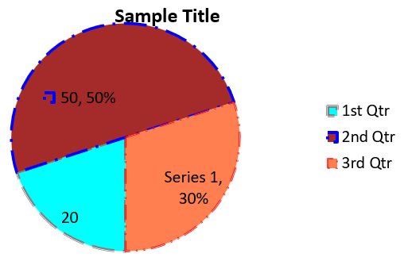
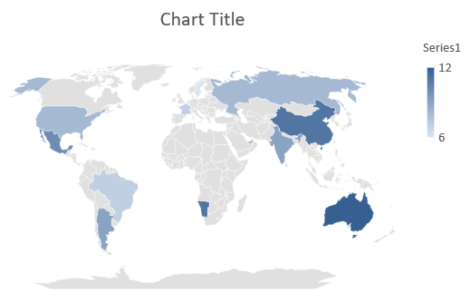

## **بررسی کلی**

این مقاله یک راهنمای جامع در مورد نحوه ایجاد و سفارشی‌سازی نمودارها با استفاده از Aspose.Slides برای .NET ارائه می‌دهد. شما یاد خواهید گرفت چگونه به‌صورت برنامه‌ای یک نمودار را به اسلاید اضافه کنید، آن را با داده‌ها پر کنید و گزینه‌های قالب‌بندی مختلفی را برای تطبیق با نیازهای طراحی خاص خود اعمال کنید. در طول مقاله، مثال‌های کد دقیق هر گام را نشان می‌دهد؛ از مقداردهی اولیه ارائه و شیء نمودار تا پیکربندی س series، محور‌ها و لگندها. با پیروی از این راهنما، درک محکمی از نحوه ادغام تولید دینامیک نمودار در برنامه‌های .NET خود پیدا می‌کنید و فرآیند ایجاد ارائه‌های مبتنی بر داده را ساده می‌کنید.

## **ایجاد یک نمودار**

نمودارها به افراد کمک می‌کنند تا به‌سرعت داده‌ها را به‌صورت بصری مشاهده کنند و بینش‌هایی به‌دست آورند که ممکن است از یک جدول یا صفحه‌گسترده به‌وضوح دیده نشود.

**چرا نمودارها را ایجاد کنیم؟**

با استفاده از نمودارها می‌توانید:

* مقادیر زیاد داده را در یک اسلاید جمع‌آوری، فشرده یا خلاصه کنید؛
* الگوها و روندهای داده را آشکار کنید؛
* جهت و شتاب داده را در طول زمان یا نسبت به یک واحد اندازه‌گیری خاص تعیین کنید؛
* نقاط دور افتاده، ناهنجاری‌ها، انحرافات، خطاها و داده‌های نامعقول را شناسایی کنید؛
* داده‌های پیچیده را منتقل یا ارائه کنید.

در PowerPoint می‌توانید نمودارها را از طریق ویژگی *Insert* ایجاد کنید که الگوهای متنوعی برای طراحی انواع نمودارها فراهم می‌کند. با Aspose.Slides می‌توانید هم نمودارهای معمولی (بر پایه انواع رایج نمودار) و هم نمودارهای سفارشی ایجاد کنید.

{} 
از enumeration [ChartType](https://reference.aspose.com/slides/net/aspose.slides.charts/charttype/) در فضای‌نامی [Aspose.Slides.Charts](https://reference.aspose.com/slides/net/aspose.slides.charts/) استفاده کنید. مقادیر این enumeration به انواع مختلف نمودارها مربوط می‌شوند.
{} 

### **ایجاد نمودارهای ستونی خوشه‌ای**

این بخش توضیح می‌دهد چطور نمودارهای ستونی خوشه‌ای را با Aspose.Slides برای .NET ایجاد کنید. شما یاد می‌گیرید چگونه یک ارائه مقداردهی اولیه کنید، یک نمودار اضافه کنید و عناصر آن مانند عنوان، داده، س series، دسته‌ها و سبک‌ها را سفارشی کنید. مراحل زیر را دنبال کنید تا ببینید یک نمودار ستونی خوشه‌ای استاندارد چگونه تولید می‌شود:

1. نمونه‌ای از کلاس [Presentation](https://reference.aspose.com/slides/net/aspose.slides/presentation) ایجاد کنید.  
1. با استفاده از اندیس، مرجع به یک اسلاید بگیرید.  
1. یک نمودار با برخی داده‌ها اضافه کنید و نوع `ChartType.ClusteredColumn` را مشخص کنید.  
1. یک عنوان به نمودار اضافه کنید.  
1. به کاربرگ داده‌های نمودار دسترسی پیدا کنید.  
1. تمام س series و دسته‌های پیش‌فرض را پاک کنید.  
1. س series و دسته‌های جدید اضافه کنید.  
1. داده‌های جدید برای س series نمودار اضافه کنید.  
1. یک رنگ پرکردن به س series اعمال کنید.  
1. برچسب‌ها را به س series اضافه کنید.  
1. ارائه اصلاح‌شده را به‌صورت فایل PPTX ذخیره کنید.

این کد C# نشان می‌دهد چگونه یک نمودار ستونی خوشه‌ای ایجاد می‌شود:

```c#
using System.Drawing;
using Aspose.Slides;
using Aspose.Slides.Charts;
using Aspose.Slides.Export;

// یک نمونه از کلاس Presentation ایجاد کنید.
using (Presentation presentation = new Presentation())
{
    // دسترسی به اولین اسلاید.
    ISlide slide = presentation.Slides[0];

    // یک نمودار ستونی خوشه‌ای با داده‌های پیش‌فرض آن اضافه کنید.
    IChart chart = slide.Shapes.AddChart(ChartType.ClusteredColumn, 20, 20, 500, 300);

    // عنوان نمودار را تنظیم کنید.
    chart.ChartTitle.AddTextFrameForOverriding("Sample Title");
    chart.ChartTitle.TextFrameForOverriding.TextFrameFormat.CenterText = NullableBool.True;
    chart.ChartTitle.Height = 20;
    chart.HasTitle = true;

    // اندیس شیت داده‌های نمودار را تنظیم کنید.
    int worksheetIndex = 0;

    // کتاب کار داده‌های نمودار را دریافت کنید.
    IChartDataWorkbook workbook = chart.ChartData.ChartDataWorkbook;

    // س series و دسته‌های پیش‌فرض تولید شده را حذف کنید.
    chart.ChartData.Series.Clear();
    chart.ChartData.Categories.Clear();

    // س series جدید اضافه کنید.
    chart.ChartData.Series.Add(workbook.GetCell(worksheetIndex, 0, 1, "Series 1"), chart.Type);
    chart.ChartData.Series.Add(workbook.GetCell(worksheetIndex, 0, 2, "Series 2"), chart.Type);

    // دسته‌های جدید اضافه کنید.
    chart.ChartData.Categories.Add(workbook.GetCell(worksheetIndex, 1, 0, "Category 1"));
    chart.ChartData.Categories.Add(workbook.GetCell(worksheetIndex, 2, 0, "Category 2"));
    chart.ChartData.Categories.Add(workbook.GetCell(worksheetIndex, 3, 0, "Category 3"));

    // س series اول نمودار را دریافت کنید.
    IChartSeries series = chart.ChartData.Series[0];

    // داده‌های س series را پر کنید.
    series.DataPoints.AddDataPointForBarSeries(workbook.GetCell(worksheetIndex, 1, 1, 20));
    series.DataPoints.AddDataPointForBarSeries(workbook.GetCell(worksheetIndex, 2, 1, 50));
    series.DataPoints.AddDataPointForBarSeries(workbook.GetCell(worksheetIndex, 3, 1, 30));

    // رنگ پر کردن س series را تنظیم کنید.
    series.Format.Fill.FillType = FillType.Solid;
    series.Format.Fill.SolidFillColor.Color = Color.Red;

    // س series دوم نمودار را دریافت کنید.
    series = chart.ChartData.Series[1];

    // داده‌های س series را پر کنید.
    series.DataPoints.AddDataPointForBarSeries(workbook.GetCell(worksheetIndex, 1, 2, 30));
    series.DataPoints.AddDataPointForBarSeries(workbook.GetCell(worksheetIndex, 2, 2, 10));
    series.DataPoints.AddDataPointForBarSeries(workbook.GetCell(worksheetIndex, 3, 2, 60));

    // رنگ پر کردن س series را تنظیم کنید.
    series.Format.Fill.FillType = FillType.Solid;
    series.Format.Fill.SolidFillColor.Color = Color.Green;

    // برچسب اول را طوری تنظیم کنید که نام دسته را نشان دهد.
    IDataLabel label = series.DataPoints[0].Label;
    label.DataLabelFormat.ShowCategoryName = true;

    label = series.DataPoints[1].Label;
    label.DataLabelFormat.ShowSeriesName = true;

    // س series را طوری تنظیم کنید که مقدار را برای برچسب سوم نشان دهد.
    label = series.DataPoints[2].Label;
    label.DataLabelFormat.ShowValue = true;
    label.DataLabelFormat.ShowSeriesName = true;
    label.DataLabelFormat.Separator = "/";

    // ارائه را به‌عنوان فایل PPTX بر روی دیسک ذخیره کنید.
    presentation.Save("AsposeChart_out.pptx", SaveFormat.Pptx);
}
```

نتیجه:


### **ایجاد نمودارهای پراکندگی**

نمودارهای پراکندگی (که به عنوان scatter plots یا نمودارهای x‑y نیز شناخته می‌شوند) برای بررسی الگوها یا نشان دادن همبستگی بین دو متغیر استفاده می‌شوند.

از نمودار پراکندگی در موارد زیر استفاده کنید:

* داده‌های عددی جفت‌گذاری‌شده دارید.  
* دو متغیر دارید که با هم جفت می‌شوند.  
* می‌خواهید تعیین کنید آیا دو متغیر با هم رابطه دارند یا خیر.  
* یک متغیر مستقل دارید که برای یک متغیر وابسته چند مقدار دارد.

این کد C# نشان می‌دهد چگونه یک نمودار پراکندگی با مجموعه‌ای متفاوت از نشانگرها ایجاد کنید:

```c#
using Aspose.Slides;
using Aspose.Slides.Charts;
using Aspose.Slides.Export;

// یک نمونه از کلاس Presentation ایجاد کنید.
using (Presentation presentation = new Presentation())
{
    // دسترسی به اولین اسلاید.
    ISlide slide = presentation.Slides[0];

    // نمودار پراکندگی پیش‌فرض را ایجاد کنید.
    IChart chart = slide.Shapes.AddChart(ChartType.ScatterWithSmoothLines, 20, 20, 500, 300);

    // اندیس شیت داده‌های نمودار را تعیین کنید.
    int worksheetIndex = 0;

    // دفتر کار داده‌های نمودار را دریافت کنید.
    IChartDataWorkbook workbook = chart.ChartData.ChartDataWorkbook;

    // س series پیش‌فرض را حذف کنید.
    chart.ChartData.Series.Clear();

    // س series جدید اضافه کنید.
    chart.ChartData.Series.Add(workbook.GetCell(worksheetIndex, 1, 1, "Series 1"), chart.Type);
    chart.ChartData.Series.Add(workbook.GetCell(worksheetIndex, 1, 3, "Series 2"), chart.Type);

    // س series اول نمودار را دریافت کنید.
    IChartSeries series = chart.ChartData.Series[0];

    // یک نقطه جدید (1:3) به س series اضافه کنید.
    series.DataPoints.AddDataPointForScatterSeries(workbook.GetCell(worksheetIndex, 2, 1, 1), workbook.GetCell(worksheetIndex, 2, 2, 3));

    // یک نقطه جدید (2:10) اضافه کنید.
    series.DataPoints.AddDataPointForScatterSeries(workbook.GetCell(worksheetIndex, 3, 1, 2), workbook.GetCell(worksheetIndex, 3, 2, 10));

    // نوع س series را تغییر دهید.
    series.Type = ChartType.ScatterWithStraightLinesAndMarkers;

    // نشانگر س series نمودار را تغییر دهید.
    series.Marker.Size = 10;
    series.Marker.Symbol = MarkerStyleType.Star;

    // س series دوم نمودار را دریافت کنید.
    series = chart.ChartData.Series[1];

    // یک نقطه جدید (5:2) به س series نمودار اضافه کنید.
    series.DataPoints.AddDataPointForScatterSeries(workbook.GetCell(worksheetIndex, 2, 3, 5), workbook.GetCell(worksheetIndex, 2, 4, 2));

    // یک نقطه جدید (3:1) اضافه کنید.
    series.DataPoints.AddDataPointForScatterSeries(workbook.GetCell(worksheetIndex, 3, 3, 3), workbook.GetCell(worksheetIndex, 3, 4, 1));

    // یک نقطه جدید (2:2) اضافه کنید.
    series.DataPoints.AddDataPointForScatterSeries(workbook.GetCell(worksheetIndex, 4, 3, 2), workbook.GetCell(worksheetIndex, 4, 4, 2));

    // یک نقطه جدید (5:1) اضافه کنید.
    series.DataPoints.AddDataPointForScatterSeries(workbook.GetCell(worksheetIndex, 5, 3, 5), workbook.GetCell(worksheetIndex, 5, 4, 1));

    // نشانگر س series نمودار را تغییر دهید.
    series.Marker.Size = 10;
    series.Marker.Symbol = MarkerStyleType.Circle;

    // ارائه را به‌عنوان فایل PPTX بر روی دیسک ذخیره کنید.
    presentation.Save("AsposeChart_out.pptx", SaveFormat.Pptx);
}
```

نتیجه:


### **ایجاد نمودارهای دایره‌ای**

نمودارهای دایره‌ای برای نشان دادن رابطهٔ بخش‑به‑کل در داده‌ها مناسب هستند، به‌ویژه وقتی داده‌ها شامل برچسب‌های دسته‌ای با مقادیر عددی باشند. اما اگر داده‌های شما شامل بخش‌ها یا برچسب‌های بسیار زیاد باشد، ممکن است بهتر باشد به‌جای آن از نمودار میله‌ای استفاده کنید.

1. نمونه‌ای از کلاس [Presentation](https://reference.aspose.com/slides/net/aspose.slides/presentation) ایجاد کنید.  
1. با استفاده از اندیس، مرجع به یک اسلاید بگیرید.  
1. یک نمودار با داده‌های پیش‌فرض اضافه کنید و نوع `ChartType.Pie` را مشخص کنید.  
1. به کتاب کار داده‌های نمودار ([IChartDataWorkbook](https://reference.aspose.com/slides/net/aspose.slides.charts/ichartdataworkbook/)) دسترسی پیدا کنید.  
1. س series و دسته‌های پیش‌فرض را پاک کنید.  
1. س series و دسته‌های جدید اضافه کنید.  
1. داده‌های جدید برای س series نمودار اضافه کنید.  
1. نقاط جدید برای نمودار اضافه کنید و رنگ‌های سفارشی به بخش‌های نمودار دایره‌ای اعمال کنید.  
1. برچسب‌ها را برای س series تنظیم کنید.  
1. خطوط راهنما برای برچسب‌های س series فعال کنید.  
1. زاویهٔ چرخش برای نمودار دایره‌ای تنظیم کنید.  
1. ارائه اصلاح‌شده را به‌صورت فایل PPTX ذخیره کنید.

این کد C# نشان می‌دهد چگونه یک نمودار دایره‌ای ایجاد کنید:

```c#
using System.Drawing;
using Aspose.Slides;
using Aspose.Slides.Charts;
using Aspose.Slides.Export;

// یک نمونه از کلاس Presentation ایجاد کنید.
using (Presentation presentation = new Presentation())
{
    // دسترسی به اولین اسلاید.
    ISlide slide = presentation.Slides[0];

    // یک نمودار با داده‌های پیش‌فرض آن اضافه کنید.
    IChart chart = slide.Shapes.AddChart(ChartType.Pie, 20, 20, 500, 300);

    // عنوان نمودار را تنظیم کنید.
    chart.ChartTitle.AddTextFrameForOverriding("Sample Title");
    chart.ChartTitle.TextFrameForOverriding.TextFrameFormat.CenterText = NullableBool.True;
    chart.ChartTitle.Height = 20;
    chart.HasTitle = true;

    // س series اول را طوری تنظیم کنید که مقادیر را نشان دهد.
    chart.ChartData.Series[0].Labels.DefaultDataLabelFormat.ShowValue = true;

    // اندیس شیت داده‌های نمودار را تنظیم کنید.
    int worksheetIndex = 0;

    // دفتر کار داده‌های نمودار را دریافت کنید.
    IChartDataWorkbook workbook = chart.ChartData.ChartDataWorkbook;

    // س series و دسته‌های پیش‌فرض تولید شده را حذف کنید.
    chart.ChartData.Series.Clear();
    chart.ChartData.Categories.Clear();

    // دسته‌های جدید اضافه کنید.
    chart.ChartData.Categories.Add(workbook.GetCell(0, 1, 0, "1st Qtr"));
    chart.ChartData.Categories.Add(workbook.GetCell(0, 2, 0, "2nd Qtr"));
    chart.ChartData.Categories.Add(workbook.GetCell(0, 3, 0, "3rd Qtr"));

    // س series جدید اضافه کنید.
    IChartSeries series = chart.ChartData.Series.Add(workbook.GetCell(0, 0, 1, "Series 1"), chart.Type);

    // داده‌های س series را پر کنید.
    series.DataPoints.AddDataPointForPieSeries(workbook.GetCell(worksheetIndex, 1, 1, 20));
    series.DataPoints.AddDataPointForPieSeries(workbook.GetCell(worksheetIndex, 2, 1, 50));
    series.DataPoints.AddDataPointForPieSeries(workbook.GetCell(worksheetIndex, 3, 1, 30));

    // رنگ بخش را تنظیم کنید.
    chart.ChartData.SeriesGroups[0].IsColorVaried = true;

    IChartDataPoint point = series.DataPoints[0];
    point.Format.Fill.FillType = FillType.Solid;
    point.Format.Fill.SolidFillColor.Color = Color.Cyan;

    // حاشیه بخش را تنظیم کنید.
    point.Format.Line.FillFormat.FillType = FillType.Solid;
    point.Format.Line.FillFormat.SolidFillColor.Color = Color.Gray;
    point.Format.Line.Width = 3.0;
    point.Format.Line.Style = LineStyle.ThinThick;
    point.Format.Line.DashStyle = LineDashStyle.LargeDash;

    IChartDataPoint point1 = series.DataPoints[1];
    point1.Format.Fill.FillType = FillType.Solid;
    point1.Format.Fill.SolidFillColor.Color = Color.Brown;

    // حاشیه بخش را تنظیم کنید.
    point1.Format.Line.FillFormat.FillType = FillType.Solid;
    point1.Format.Line.FillFormat.SolidFillColor.Color = Color.Blue;
    point1.Format.Line.Width = 3.0;
    point1.Format.Line.Style = LineStyle.Single;
    point1.Format.Line.DashStyle = LineDashStyle.LargeDashDot;

    IChartDataPoint point2 = series.DataPoints[2];
    point2.Format.Fill.FillType = FillType.Solid;
    point2.Format.Fill.SolidFillColor.Color = Color.Coral;

    // حاشیه بخش را تنظیم کنید.
    point2.Format.Line.FillFormat.FillType = FillType.Solid;
    point2.Format.Line.FillFormat.SolidFillColor.Color = Color.Red;
    point2.Format.Line.Width = 2.0;
    point2.Format.Line.Style = LineStyle.ThinThin;
    point2.Format.Line.DashStyle = LineDashStyle.LargeDashDotDot;

    // برچسب‌های سفارشی برای هر دسته در س series جدید ایجاد کنید.
    IDataLabel label1 = series.DataPoints[0].Label;

    label1.DataLabelFormat.ShowValue = true;

    IDataLabel label2 = series.DataPoints[1].Label;
    label2.DataLabelFormat.ShowValue = true;
    label2.DataLabelFormat.ShowLegendKey = true;
    label2.DataLabelFormat.ShowPercentage = true;

    IDataLabel label3 = series.DataPoints[2].Label;
    label3.DataLabelFormat.ShowSeriesName = true;
    label3.DataLabelFormat.ShowPercentage = true;

    // س series را طوری تنظیم کنید که خطوط راهنما را برای نمودار نشان دهد.
    series.Labels.DefaultDataLabelFormat.ShowLeaderLines = true;

    // زاویهٔ چرخش بخش‌های نمودار دایره‌ای را تنظیم کنید.
    chart.ChartData.SeriesGroups[0].FirstSliceAngle = 180;

    // ارائه را به‌عنوان فایل PPTX بر روی دیسک ذخیره کنید.
    presentation.Save("PieChart_out.pptx", SaveFormat.Pptx);
}
```

نتیجه:



### **ایجاد نمودارهای خطی**

نمودارهای خطی (که به عنوان line graphs هم شناخته می‌شوند) برای نمایش تغییرات مقدار در طول زمان مناسب‌اند. با استفاده از نمودار خطی می‌توانید مقدار زیادی داده را به‌طور همزمان مقایسه کنید، تغییرات و روندها را در طول زمان ردیاب کنید، ناهنجاری‌ها را در س seriesها برجسته کنید و ...

1. نمونه‌ای از کلاس [Presentation](https://reference.aspose.com/slides/net/aspose.slides/presentation) ایجاد کنید.  
1. با استفاده از اندیس، مرجع به یک اسلاید بگیرید.  
1. یک نمودار با داده‌های پیش‌فرض اضافه کنید و نوع `ChartType.Line` را مشخص کنید.  
1. به کتاب کار داده‌های نمودار ([IChartDataWorkbook](https://reference.aspose.com/slides/net/aspose.slides.charts/ichartdataworkbook/)) دسترسی پیدا کنید.  
1. س series و دسته‌های پیش‌فرض را پاک کنید.  
1. س series و دسته‌های جدید اضافه کنید.  
1. داده‌های جدید برای س series نمودار اضافه کنید.  
1. ارائه اصلاح‌شده را به‌صورت فایل PPTX ذخیره کنید.

این کد C# نشان می‌دهد چگونه یک نمودار خطی ایجاد کنید:

```c#
using Aspose.Slides;
using Aspose.Slides.Charts;
using Aspose.Slides.Export;

using (Presentation presentation = new Presentation())
{
    IChart lineChart = presentation.Slides[0].Shapes.AddChart(ChartType.Line, 20, 20, 500, 300);

    presentation.Save("lineChart.pptx", SaveFormat.Pptx);
}
```

به‌طور پیش‌فرض، نقاط یک نمودار خطی با خطوط مستقیماً پیوسته می‌شوند. اگر می‌خواهید به‌جای آن نقطه‌ها با خط‌های خط‌شکسته (dash) وصل شوند، می‌توانید نوع dash دلخواه را به شکل زیر مشخص کنید:

```c#
using Aspose.Slides;
using Aspose.Slides.Charts;

using (Presentation presentation = new Presentation())
{
    IChart lineChart = presentation.Slides[0].Shapes.AddChart(ChartType.Line, 20, 20, 500, 300);

    foreach (IChartSeries series in lineChart.ChartData.Series)
    {
        series.Format.Line.DashStyle = LineDashStyle.Dash;
    }
}
```

نتیجه:


### **ایجاد نمودارهای درخت‌نقشه (Tree Map)**

نمودارهای درخت‌نقشه برای داده‌های فروش مناسب‌اند هنگامی که می‌خواهید اندازه نسبی دسته‌های داده را نشان دهید و به‌سرعت توجه را به آیتم‌های بزرگ‌Contribution در هر دسته جلب کنید.

1. نمونه‌ای از کلاس [Presentation](https://reference.aspose.com/slides/net/aspose.slides/presentation) ایجاد کنید.  
1. با استفاده از اندیس، مرجع به یک اسلاید بگیرید.  
1. یک نمودار با داده‌های پیش‌فرض اضافه کنید و نوع `ChartType.Treemap` را مشخص کنید.  
1. به کتاب کار داده‌های نمودار ([IChartDataWorkbook](https://reference.aspose.com/slides/net/aspose.slides.charts/ichartdataworkbook/)) دسترسی پیدا کنید.  
1. س series و دسته‌های پیش‌فرض را پاک کنید.  
1. س series و دسته‌های جدید اضافه کنید.  
1. داده‌های جدید برای س series نمودار اضافه کنید.  
1. ارائه اصلاح‌شده را به‌صورت فایل PPTX ذخیره کنید.

این کد C# نشان می‌دهد چگونه یک نمودار درخت‌نقشه ایجاد کنید:

```c#
using Aspose.Slides;
using Aspose.Slides.Charts;
using Aspose.Slides.Export;

using (Presentation presentation = new Presentation())
{
    IChart chart = presentation.Slides[0].Shapes.AddChart(ChartType.Treemap, 20, 20, 500, 300);
    chart.ChartData.Categories.Clear();
    chart.ChartData.Series.Clear();

    IChartDataWorkbook workbook = chart.ChartData.ChartDataWorkbook;
    workbook.Clear(0);

    // شاخه 1
    IChartCategory leaf = chart.ChartData.Categories.Add(workbook.GetCell(0, "C1", "Leaf1"));
    leaf.GroupingLevels.SetGroupingItem(1, "Stem1");
    leaf.GroupingLevels.SetGroupingItem(2, "Branch1");

    chart.ChartData.Categories.Add(workbook.GetCell(0, "C2", "Leaf2"));

    leaf = chart.ChartData.Categories.Add(workbook.GetCell(0, "C3", "Leaf3"));
    leaf.GroupingLevels.SetGroupingItem(1, "Stem2");

    chart.ChartData.Categories.Add(workbook.GetCell(0, "C4", "Leaf4"));

    // شاخه 2
    leaf = chart.ChartData.Categories.Add(workbook.GetCell(0, "C5", "Leaf5"));
    leaf.GroupingLevels.SetGroupingItem(1, "Stem3");
    leaf.GroupingLevels.SetGroupingItem(2, "Branch2");

    chart.ChartData.Categories.Add(workbook.GetCell(0, "C6", "Leaf6"));

    leaf = chart.ChartData.Categories.Add(workbook.GetCell(0, "C7", "Leaf7"));
    leaf.GroupingLevels.SetGroupingItem(1, "Stem4");

    chart.ChartData.Categories.Add(workbook.GetCell(0, "C8", "Leaf8"));

    IChartSeries series = chart.ChartData.Series.Add(ChartType.Treemap);
    series.Labels.DefaultDataLabelFormat.ShowCategoryName = true;
    series.DataPoints.AddDataPointForTreemapSeries(workbook.GetCell(0, "D1", 4));
    series.DataPoints.AddDataPointForTreemapSeries(workbook.GetCell(0, "D2", 5));
    series.DataPoints.AddDataPointForTreemapSeries(workbook.GetCell(0, "D3", 3));
    series.DataPoints.AddDataPointForTreemapSeries(workbook.GetCell(0, "D4", 6));
    series.DataPoints.AddDataPointForTreemapSeries(workbook.GetCell(0, "D5", 9));
    series.DataPoints.AddDataPointForTreemapSeries(workbook.GetCell(0, "D6", 9));
    series.DataPoints.AddDataPointForTreemapSeries(workbook.GetCell(0, "D7", 4));
    series.DataPoints.AddDataPointForTreemapSeries(workbook.GetCell(0, "D8", 3));

    series.ParentLabelLayout = ParentLabelLayoutType.Overlapping;

    presentation.Save("Treemap.pptx", SaveFormat.Pptx);
}
```

نتیجه:


### **ایجاد نمودارهای سهام (Stock)**

نمودارهای سهام برای نمایش داده‌های مالی مانند قیمت‌های باز، بالا، پایین و بسته استفاده می‌شوند و به تحلیل روندهای بازار و نوسانات کمک می‌کنند. این نمودارها بینش‌های اساسی دربارهٔ عملکرد سهام فراهم می‌آورند و به سرمایه‌گذاران و تحلیل‌گران در اتخاذ تصمیم‌های آگاهانه کمک می‌کنند.

1. نمونه‌ای از کلاس [Presentation](https://reference.aspose.com/slides/net/aspose.slides/presentation) ایجاد کنید.  
1. با استفاده از اندیس، مرجع به یک اسلاید بگیرید.  
1. یک نمودار با داده‌های پیش‌فرض اضافه کنید و نوع `ChartType.OpenHighLowClose` را مشخص کنید.  
1. به کتاب کار داده‌های نمودار ([IChartDataWorkbook](https://reference.aspose.com/slides/net/aspose.slides.charts/ichartdataworkbook/)) دسترسی پیدا کنید.  
1. س series و دسته‌های پیش‌فرض را پاک کنید.  
1. س series و دسته‌های جدید اضافه کنید.  
1. داده‌های جدید برای س series نمودار اضافه کنید.  
1. قالب HiLowLines را مشخص کنید.  
1. ارائه اصلاح‌شده را به‌صورت فایل PPTX ذخیره کنید.

این کد C# نشان می‌دهد چگونه یک نمودار سهام ایجاد کنید:

```c#
using Aspose.Slides;
using Aspose.Slides.Charts;
using Aspose.Slides.Export;

using (Presentation presentation = new Presentation())
{
    IChart chart = presentation.Slides[0].Shapes.AddChart(ChartType.OpenHighLowClose, 20, 20, 500, 300, false);

    IChartDataWorkbook workbook = chart.ChartData.ChartDataWorkbook;

    chart.ChartData.Categories.Add(workbook.GetCell(0, 1, 0, "A"));
    chart.ChartData.Categories.Add(workbook.GetCell(0, 2, 0, "B"));
    chart.ChartData.Categories.Add(workbook.GetCell(0, 3, 0, "C"));

    chart.ChartData.Series.Add(workbook.GetCell(0, 0, 1, "Open"), chart.Type);
    chart.ChartData.Series.Add(workbook.GetCell(0, 0, 2, "High"), chart.Type);
    chart.ChartData.Series.Add(workbook.GetCell(0, 0, 3, "Low"), chart.Type);
    chart.ChartData.Series.Add(workbook.GetCell(0, 0, 4, "Close"), chart.Type);

    IChartSeries series = chart.ChartData.Series[0];
    series.DataPoints.AddDataPointForStockSeries(workbook.GetCell(0, 1, 1, 72));
    series.DataPoints.AddDataPointForStockSeries(workbook.GetCell(0, 2, 1, 25));
    series.DataPoints.AddDataPointForStockSeries(workbook.GetCell(0, 3, 1, 38));

    series = chart.ChartData.Series[1];
    series.DataPoints.AddDataPointForStockSeries(workbook.GetCell(0, 1, 2, 172));
    series.DataPoints.AddDataPointForStockSeries(workbook.GetCell(0, 2, 2, 57));
    series.DataPoints.AddDataPointForStockSeries(workbook.GetCell(0, 3, 2, 57));

    series = chart.ChartData.Series[2];
    series.DataPoints.AddDataPointForStockSeries(workbook.GetCell(0, 1, 3, 12));
    series.DataPoints.AddDataPointForStockSeries(workbook.GetCell(0, 2, 3, 12));
    series.DataPoints.AddDataPointForStockSeries(workbook.GetCell(0, 3, 3, 13));

    series = chart.ChartData.Series[3];
    series.DataPoints.AddDataPointForStockSeries(workbook.GetCell(0, 1, 4, 25));
    series.DataPoints.AddDataPointForStockSeries(workbook.GetCell(0, 2, 4, 38));
    series.DataPoints.AddDataPointForStockSeries(workbook.GetCell(0, 3, 4, 50));

    chart.ChartData.SeriesGroups[0].UpDownBars.HasUpDownBars = true;
    chart.ChartData.SeriesGroups[0].HiLowLinesFormat.Line.FillFormat.FillType = FillType.Solid;

    foreach (IChartSeries ser in chart.ChartData.Series)
    {
        ser.Format.Line.FillFormat.FillType = FillType.NoFill;
    }

    chart.Axes.VerticalAxis.MinorGridLinesFormat.Line.FillFormat.FillType = FillType.NoFill;

    presentation.Save("Stock-chart.pptx", SaveFormat.Pptx);
}
```

نتیجه:


### **ایجاد نمودارهای جعبه‌ای و ویسکری (Box and Whisker)**

نمودارهای جعبه‌ای و ویسکری برای نمایش توزیع داده‌ها با خلاصه‌سازی معیارهای آماری کلیدی مانند میانه، چارک‌ها و نقاط دور افتاده استفاده می‌شوند. آنها در تجزیه و تحلیل اکتشافی داده‌ها و مطالعات آماری برای درک سریع تغییرپذیری داده‌ها و شناسایی ناهنجاری‌ها مفیدند.

1. نمونه‌ای از کلاس [Presentation](https://reference.aspose.com/slides/net/aspose.slides/presentation) ایجاد کنید.  
1. با استفاده از اندیس، مرجع به یک اسلاید بگیرید.  
1. یک نمودار با داده‌های پیش‌فرض اضافه کنید و نوع `ChartType.BoxAndWhisker` را مشخص کنید.  
1. به کتاب کار داده‌های نمودار ([IChartDataWorkbook](https://reference.aspose.com/slides/net/aspose.slides.charts/ichartdataworkbook/)) دسترسی پیدا کنید.  
1. س series و دسته‌های پیش‌فرض را پاک کنید.  
1. س series و دسته‌های جدید اضافه کنید.  
1. داده‌های جدید برای س series نمودار اضافه کنید.  
1. ارائه اصلاح‌شده را به‌صورت فایل PPTX ذخیره کنید.

این کد C# نشان می‌دهد چگونه یک نمودار جعبه‌ای و ویسکری ایجاد کنید:

```c#
using Aspose.Slides;
using Aspose.Slides.Charts;
using Aspose.Slides.Export;

using (Presentation presentation = new Presentation())
{
    IChart chart = presentation.Slides[0].Shapes.AddChart(ChartType.BoxAndWhisker, 20, 20, 500, 300);
    chart.ChartData.Categories.Clear();
    chart.ChartData.Series.Clear();

    IChartDataWorkbook workbook = chart.ChartData.ChartDataWorkbook;
    workbook.Clear(0);

    chart.ChartData.Categories.Add(workbook.GetCell(0, "A1", "Category 1"));
    chart.ChartData.Categories.Add(workbook.GetCell(0, "A2", "Category 2"));
    chart.ChartData.Categories.Add(workbook.GetCell(0, "A3", "Category 3"));
    chart.ChartData.Categories.Add(workbook.GetCell(0, "A4", "Category 4"));
    chart.ChartData.Categories.Add(workbook.GetCell(0, "A5", "Category 5"));
    chart.ChartData.Categories.Add(workbook.GetCell(0, "A6", "Category 6"));

    IChartSeries series = chart.ChartData.Series.Add(ChartType.BoxAndWhisker);

    series.QuartileMethod = QuartileMethodType.Exclusive;
    series.ShowMeanLine = true;
    series.ShowMeanMarkers = true;
    series.ShowInnerPoints = true;
    series.ShowOutlierPoints = true;

    series.DataPoints.AddDataPointForBoxAndWhiskerSeries(workbook.GetCell(0, "B1", 15));
    series.DataPoints.AddDataPointForBoxAndWhiskerSeries(workbook.GetCell(0, "B2", 41));
    series.DataPoints.AddDataPointForBoxAndWhiskerSeries(workbook.GetCell(0, "B3", 16));
    series.DataPoints.AddDataPointForBoxAndWhiskerSeries(workbook.GetCell(0, "B4", 10));
    series.DataPoints.AddDataPointForBoxAndWhiskerSeries(workbook.GetCell(0, "B5", 23));
    series.DataPoints.AddDataPointForBoxAndWhiskerSeries(workbook.GetCell(0, "B6", 16));

    presentation.Save("BoxAndWhisker.pptx", SaveFormat.Pptx);
}
```

### **ایجاد نمودارهای قیفی (Funnel)**

نمودارهای قیفی برای تجسم فرایندهایی که شامل مراحل متوالی هستند، به‌کار می‌روند؛ جایی که حجم داده با پیشرفت از یک مرحله به مرحله بعدی کاهش می‌یابد. آنها برای تجزیه و تحلیل نرخ تبدیل، شناسایی گلوگاه‌ها و ردیابی کارایی فرآیندهای فروش یا بازاریابی مفیدند.

1. نمونه‌ای از کلاس [Presentation](https://reference.aspose.com/slides/net/aspose.slides/presentation) ایجاد کنید.  
1. با استفاده از اندیس، مرجع به یک اسلاید بگیرید.  
1. یک نمودار با داده‌های پیش‌فرض اضافه کنید و نوع `ChartType.Funnel` را مشخص کنید.  
1. ارائه اصلاح‌شده را به‌صورت فایل PPTX ذخیره کنید.

این کد C# نشان می‌دهد چگونه یک نمودار قیفی ایجاد کنید:

```c#
using Aspose.Slides;
using Aspose.Slides.Charts;
using Aspose.Slides.Export;

using (Presentation presentation = new Presentation("test.pptx"))
{
    IChart chart = presentation.Slides[0].Shapes.AddChart(ChartType.Funnel, 50, 50, 500, 400);
    chart.ChartData.Categories.Clear();
    chart.ChartData.Series.Clear();

    IChartDataWorkbook workbook = chart.ChartData.ChartDataWorkbook;
    workbook.Clear(0);

    chart.ChartData.Categories.Add(workbook.GetCell(0, "A1", "Category 1"));
    chart.ChartData.Categories.Add(workbook.GetCell(0, "A2", "Category 2"));
    chart.ChartData.Categories.Add(workbook.GetCell(0, "A3", "Category 3"));
    chart.ChartData.Categories.Add(workbook.GetCell(0, "A4", "Category 4"));
    chart.ChartData.Categories.Add(workbook.GetCell(0, "A5", "Category 5"));
    chart.ChartData.Categories.Add(workbook.GetCell(0, "A6", "Category 6"));

    IChartSeries series = chart.ChartData.Series.Add(ChartType.Funnel);

    series.DataPoints.AddDataPointForFunnelSeries(workbook.GetCell(0, "B1", 50));
    series.DataPoints.AddDataPointForFunnelSeries(workbook.GetCell(0, "B2", 100));
    series.DataPoints.AddDataPointForFunnelSeries(workbook.GetCell(0, "B3", 200));
    series.DataPoints.AddDataPointForFunnelSeries(workbook.GetCell(0, "B4", 300));
    series.DataPoints.AddDataPointForFunnelSeries(workbook.GetCell(0, "B5", 400));
    series.DataPoints.AddDataPointForFunnelSeries(workbook.GetCell(0, "B6", 500));

    presentation.Save("Funnel.pptx", SaveFormat.Pptx);
}
```

نتیجه:


### **ایجاد نمودارهای خورشیدی (Sunburst)**

نمودارهای خورشیدی برای تجسم داده‌های سلسله‌مراتبی استفاده می‌شوند و سطوح را به‌صورت حلقه‌های متحدمرکز نمایش می‌دهند. آنها روابط بخش‑به‑کل را نشان می‌دهند و برای نمایش دسته‌ها و زیردسته‌های تو در تو به‌صورت فشرده و واضح ایده‌آل‌اند.

1. نمونه‌ای از کلاس [Presentation](https://reference.aspose.com/slides/net/aspose.slides/presentation) ایجاد کنید.  
1. با استفاده از اندیس، مرجع به یک اسلاید بگیرید.  
1. یک نمودار با داده‌های پیش‌فرض اضافه کنید و نوع `ChartType.Sunburst` را مشخص کنید.  
1. ارائه اصلاح‌شده را به‌صورت فایل PPTX ذخیره کنید.

این کد C# نشان می‌دهد چگونه یک نمودار خورشیدی ایجاد کنید:

```c#
using Aspose.Slides;
using Aspose.Slides.Charts;
using Aspose.Slides.Export;

using (Presentation presentation = new Presentation())
{
    IChart chart = presentation.Slides[0].Shapes.AddChart(ChartType.Sunburst, 20, 20, 500, 300);
    chart.ChartData.Categories.Clear();
    chart.ChartData.Series.Clear();

    IChartDataWorkbook workbook = chart.ChartData.ChartDataWorkbook;
    workbook.Clear(0);

    // شاخه 1
    IChartCategory leaf = chart.ChartData.Categories.Add(workbook.GetCell(0, "C1", "Leaf1"));
    leaf.GroupingLevels.SetGroupingItem(1, "Stem1");
    leaf.GroupingLevels.SetGroupingItem(2, "Branch1");

    chart.ChartData.Categories.Add(workbook.GetCell(0, "C2", "Leaf2"));

    leaf = chart.ChartData.Categories.Add(workbook.GetCell(0, "C3", "Leaf3"));
    leaf.GroupingLevels.SetGroupingItem(1, "Stem2");

    chart.ChartData.Categories.Add(workbook.GetCell(0, "C4", "Leaf4"));

    // شاخه 2
    leaf = chart.ChartData.Categories.Add(workbook.GetCell(0, "C5", "Leaf5"));
    leaf.GroupingLevels.SetGroupingItem(1, "Stem3");
    leaf.GroupingLevels.SetGroupingItem(2, "Branch2");

    chart.ChartData.Categories.Add(workbook.GetCell(0, "C6", "Leaf6"));

    leaf = chart.ChartData.Categories.Add(workbook.GetCell(0, "C7", "Leaf7"));
    leaf.GroupingLevels.SetGroupingItem(1, "Stem4");

    chart.ChartData.Categories.Add(workbook.GetCell(0, "C8", "Leaf8"));

    IChartSeries series = chart.ChartData.Series.Add(ChartType.Sunburst);
    series.Labels.DefaultDataLabelFormat.ShowCategoryName = true;
    series.DataPoints.AddDataPointForSunburstSeries(workbook.GetCell(0, "D1", 4));
    series.DataPoints.AddDataPointForSunburstSeries(workbook.GetCell(0, "D2", 5));
    series.DataPoints.AddDataPointForSunburstSeries(workbook.GetCell(0, "D3", 3));
    series.DataPoints.AddDataPointForSunburstSeries(workbook.GetCell(0, "D4", 6));
    series.DataPoints.AddDataPointForSunburstSeries(workbook.GetCell(0, "D5", 9));
    series.DataPoints.AddDataPointForSunburstSeries(workbook.GetCell(0, "D6", 9));
    series.DataPoints.AddDataPointForSunburstSeries(workbook.GetCell(0, "D7", 4));
    series.DataPoints.AddDataPointForSunburstSeries(workbook.GetCell(0, "D8", 3));

    presentation.Save("Sunburst.pptx", SaveFormat.Pptx);
}
```

نتیجه:


### **ایجاد نمودارهای هیستوگرام**

نمودارهای هیستوگرام برای نمایش توزیع داده‌های عددی با گروه‌بندی مقادیر در بازه‌ها یا سطل‌ها استفاده می‌شوند. این نمودارها برای شناسایی الگوهای داده مانند فراوانی، کجی و پراکندگی و همچنین برای کشف نقاط دور افتاده در یک مجموعه داده مفیدند.

1. نمونه‌ای از کلاس [Presentation](https://reference.aspose.com/slides/net/aspose.slides/presentation) ایجاد کنید.  
1. با استفاده از اندیس، مرجع به یک اسلاید بگیرید.  
1. یک نمودار با برخی داده‌ها اضافه کنید و نوع `ChartType.Histogram` را مشخص کنید.  
1. به کتاب کار داده‌های نمودار ([IChartDataWorkbook](https://reference.aspose.com/slides/net/aspose.slides.charts/ichartdataworkbook/)) دسترسی پیدا کنید.  
1. س series و دسته‌های پیش‌فرض را پاک کنید.  
1. س series و دسته‌های جدید اضافه کنید.  
1. ارائه اصلاح‌شده را به‌صورت فایل PPTX ذخیره کنید.

این کد C# نشان می‌دهد چگونه یک نمودار هیستوگرام ایجاد کنید:

```c#
using Aspose.Slides;
using Aspose.Slides.Charts;
using Aspose.Slides.Export;

using (Presentation presentation = new Presentation())
{
    IChart chart = presentation.Slides[0].Shapes.AddChart(ChartType.Histogram, 20, 20, 500, 300);
    chart.ChartData.Categories.Clear();
    chart.ChartData.Series.Clear();

    IChartDataWorkbook workbook = chart.ChartData.ChartDataWorkbook;
    workbook.Clear(0);

    IChartSeries series = chart.ChartData.Series.Add(ChartType.Histogram);
    series.DataPoints.AddDataPointForHistogramSeries(workbook.GetCell(0, "A1", 15));
    series.DataPoints.AddDataPointForHistogramSeries(workbook.GetCell(0, "A2", -41));
    series.DataPoints.AddDataPointForHistogramSeries(workbook.GetCell(0, "A3", 16));
    series.DataPoints.AddDataPointForHistogramSeries(workbook.GetCell(0, "A4", 10));
    series.DataPoints.AddDataPointForHistogramSeries(workbook.GetCell(0, "A5", -23));
    series.DataPoints.AddDataPointForHistogramSeries(workbook.GetCell(0, "A6", 16));

    chart.Axes.HorizontalAxis.AggregationType = AxisAggregationType.Automatic;

    presentation.Save("Histogram.pptx", SaveFormat.Pptx);
}
```

نتیجه:


### **ایجاد نمودارهای رادار**

نمودارهای رادار برای نمایش داده‌های چندمتغیره در قالب دوبُعدی استفاده می‌شوند و امکان مقایسهٔ همزمان چندین متغیر را فراهم می‌کنند. این نمودارها برای شناسایی الگوها، نقاط قوت و ضعف در میان معیارهای عملکرد یا ویژگی‌های مختلف مفیدند.

1. نمونه‌ای از کلاس [Presentation](https://reference.aspose.com/slides/net/aspose.slides/presentation) ایجاد کنید.  
1. با استفاده از اندیس، مرجع به یک اسلاید بگیرید.  
1. یک نمودار با برخی داده‌ها اضافه کنید و نوع `ChartType.Radar` را مشخص کنید.  
1. ارائه اصلاح‌شده را به‌صورت فایل PPTX ذخیره کنید.

این کد C# نشان می‌دهد چگونه یک نمودار رادار ایجاد کنید:

```c#
using Aspose.Slides;
using Aspose.Slides.Charts;
using Aspose.Slides.Export;

using (Presentation presentation = new Presentation())
{
    presentation.Slides[0].Shapes.AddChart(ChartType.Radar, 20, 20, 500, 300);
    presentation.Save("Radar-chart.pptx", SaveFormat.Pptx);
}
```

نتیجه:


### **ایجاد نمودارهای چنددسته‌ای**

نمودارهای چنددسته‌ای برای نمایش داده‌هایی که شامل بیش از یک گروه‌بندی دسته‌ای هستند استفاده می‌شوند و به شما امکان می‌دهند مقادیر را در چند بُعد به‌صورت همزمان مقایسه کنید. این نمودارها زمانی که نیاز به تجزیه و تحلیل روندها و روابط در مجموعه‌داده‌های پیچیده و چند لایه داشته باشید، بسیار مفیدند.

1. نمونه‌ای از کلاس [Presentation](https://reference.aspose.com/slides/net/aspose.slides/presentation) ایجاد کنید.  
1. با استفاده از اندیس، مرجع به یک اسلاید بگیرید.  
1. یک نمودار با داده‌های پیش‌فرض اضافه کنید و نوع `ChartType.ClusteredColumn` را مشخص کنید.  
1. به کتاب کار داده‌های نمودار ([IChartDataWorkbook](https://reference.aspose.com/slides/net/aspose.slides.charts/ichartdataworkbook/)) دسترسی پیدا کنید.  
1. س series و دسته‌های پیش‌فرض را پاک کنید.  
1. س series و دسته‌های جدید اضافه کنید.  
1. داده‌های جدید برای س series نمودار اضافه کنید.  
1. ارائه اصلاح‌شده را به‌صورت فایل PPTX ذخیره کنید.

این کد C# نشان می‌دهد چگونه یک نمودار چنددسته‌ای ایجاد کنید:

```c#
using Aspose.Slides;
using Aspose.Slides.Charts;
using Aspose.Slides.Export;

using (Presentation presentation = new Presentation())
{
    ISlide slide = presentation.Slides[0];

    IChart chart = presentation.Slides[0].Shapes.AddChart(ChartType.ClusteredColumn, 20, 20, 500, 300);
    chart.ChartData.Series.Clear();
    chart.ChartData.Categories.Clear();

    IChartDataWorkbook workbook = chart.ChartData.ChartDataWorkbook;
    workbook.Clear(0);

    int worksheetIndex = 0;

    IChartCategory category = chart.ChartData.Categories.Add(workbook.GetCell(0, "c2", "A"));
    category.GroupingLevels.SetGroupingItem(1, "Group1");
    category = chart.ChartData.Categories.Add(workbook.GetCell(0, "c3", "B"));

    category = chart.ChartData.Categories.Add(workbook.GetCell(0, "c4", "C"));
    category.GroupingLevels.SetGroupingItem(1, "Group2");
    category = chart.ChartData.Categories.Add(workbook.GetCell(0, "c5", "D"));

    category = chart.ChartData.Categories.Add(workbook.GetCell(0, "c6", "E"));
    category.GroupingLevels.SetGroupingItem(1, "Group3");
    category = chart.ChartData.Categories.Add(workbook.GetCell(0, "c7", "F"));

    category = chart.ChartData.Categories.Add(workbook.GetCell(0, "c8", "G"));
    category.GroupingLevels.SetGroupingItem(1, "Group4");
    category = chart.ChartData.Categories.Add(workbook.GetCell(0, "c9", "H"));

    // افزودن یک سری.
    IChartSeries series = chart.ChartData.Series.Add(workbook.GetCell(0, "D1", "Series 1"), ChartType.ClusteredColumn);

    series.DataPoints.AddDataPointForBarSeries(workbook.GetCell(worksheetIndex, "D2", 10));
    series.DataPoints.AddDataPointForBarSeries(workbook.GetCell(worksheetIndex, "D3", 20));
    series.DataPoints.AddDataPointForBarSeries(workbook.GetCell(worksheetIndex, "D4", 30));
    series.DataPoints.AddDataPointForBarSeries(workbook.GetCell(worksheetIndex, "D5", 40));
    series.DataPoints.AddDataPointForBarSeries(workbook.GetCell(worksheetIndex, "D6", 50));
    series.DataPoints.AddDataPointForBarSeries(workbook.GetCell(worksheetIndex, "D7", 60));
    series.DataPoints.AddDataPointForBarSeries(workbook.GetCell(worksheetIndex, "D8", 70));
    series.DataPoints.AddDataPointForBarSeries(workbook.GetCell(worksheetIndex, "D9", 80));

    // ذخیرهٔ ارائه به همراه نمودار.
    presentation.Save("AsposeChart_out.pptx", SaveFormat.Pptx);
}
```

نتیجه:


### **ایجاد نمودارهای نقشه‌ای**

نمودارهای نقشه‌ای برای تجسم داده‌های جغرافیایی با نقشه‌برداری اطلاعات به مکان‌های خاص مانند کشورها، ایالت‌ها یا شهرها استفاده می‌شوند. این نمودارها برای تحلیل روندهای منطقه‌ای، داده‌های جمعیتی و توزیع‌های مکانی به‌صورت واضح و جذاب بصری مفیدند.

این کد C# نشان می‌دهد چگونه یک نمودار نقشه‌ای ایجاد کنید:

```c#
using Aspose.Slides;
using Aspose.Slides.Charts;
using Aspose.Slides.Export;

using (Presentation presentation = new Presentation())
{
    IChart chart = presentation.Slides[0].Shapes.AddChart(ChartType.Map, 20, 20, 500, 300);
    presentation.Save("mapChart.pptx", SaveFormat.Pptx);
}
```

نتیجه:



{} 
تصویر بالا نشان می‌دهد ارائه ذخیره‌شده در PowerPoint باز می‌شود. Aspose.Slides نمودار نقشه‌ای و داده‌های آن را به‌درستی می‌نویسد، اما خود نمودارهای نقشه‌ای را رسم نمی‌کند: هنگامی که اسلاید حاوی یک نمودار نقشه‌ای به تصویر رندر می‌شود یا به PDF یا SVG تبدیل می‌شود، ناحیهٔ نمودار خالی می‌ماند. سایر شکل‌های موجود در همان اسلاید تحت تأثیر قرار نمی‌گیرند.
{} 

### **ایجاد نمودارهای ترکیبی**

نمودار ترکیبی (یا combo chart) دو یا چند نوع نمودار را در یک گراف ترکیب می‌کند. این نمودار به شما اجازه می‌دهد تا تفاوت‌ها یا شباهت‌های بین دو یا چند مجموعهٔ داده را برجسته، مقایسه یا بررسی کنید و روابط بین آن‌ها را شناسایی کنید.


کد C# زیر نشان می‌دهد چگونه نمودار ترکیبی نشان‌داده‌شده در بالا را در یک ارائه PowerPoint ایجاد کنید:

```c#
using System.Drawing;
using Aspose.Slides;
using Aspose.Slides.Charts;
using Aspose.Slides.Export;

private static void CreateComboChart()
{
    using (Presentation presentation = new Presentation())
    {
        IChart chart = CreateChartWithFirstSeries(presentation.Slides[0]);

        AddSecondSeriesToChart(chart);
        AddThirdSeriesToChart(chart);

        SetPrimaryAxesFormat(chart);
        SetSecondaryAxesFormat(chart);

        presentation.Save("combo-chart.pptx", SaveFormat.Pptx);
    }
}

private static IChart CreateChartWithFirstSeries(ISlide slide)
{
    IChart chart = slide.Shapes.AddChart(ChartType.ClusteredColumn, 50, 50, 600, 400);

    // تنظیم عنوان نمودار
    chart.HasTitle = true;
    chart.ChartTitle.AddTextFrameForOverriding("Chart Title");
    chart.ChartTitle.Overlay = false;
    IPortionFormat portionFormat = 
       chart.ChartTitle.TextFrameForOverriding.Paragraphs[0].ParagraphFormat.DefaultPortionFormat;
    portionFormat.FontBold = NullableBool.False;
    portionFormat.FontHeight = 18f;

    // تنظیم لگند نمودار
    chart.Legend.Position = LegendPositionType.Bottom;
    chart.Legend.TextFormat.PortionFormat.FontHeight = 12f;

    // حذف س series و دسته‌های پیش‌فرض تولید شده
    chart.ChartData.Series.Clear();
    chart.ChartData.Categories.Clear();

    int worksheetIndex = 0;
    IChartDataWorkbook workbook = chart.ChartData.ChartDataWorkbook;

    // افزودن دسته‌های جدید
    chart.ChartData.Categories.Add(workbook.GetCell(worksheetIndex, 1, 0, "Category 1"));
    chart.ChartData.Categories.Add(workbook.GetCell(worksheetIndex, 2, 0, "Category 2"));
    chart.ChartData.Categories.Add(workbook.GetCell(worksheetIndex, 3, 0, "Category 3"));
    chart.ChartData.Categories.Add(workbook.GetCell(worksheetIndex, 4, 0, "Category 4"));

    // افزودن اولین سری
    IChartSeries series = chart.ChartData.Series.Add(
        workbook.GetCell(worksheetIndex, 0, 1, "Series 1"), chart.Type);

    series.ParentSeriesGroup.Overlap = -25;
    series.ParentSeriesGroup.GapWidth = 220;

    series.DataPoints.AddDataPointForBarSeries(workbook.GetCell(worksheetIndex, 1, 1, 4.3));
    series.DataPoints.AddDataPointForBarSeries(workbook.GetCell(worksheetIndex, 2, 1, 2.5));
    series.DataPoints.AddDataPointForBarSeries(workbook.GetCell(worksheetIndex, 3, 1, 3.5));
    series.DataPoints.AddDataPointForBarSeries(workbook.GetCell(worksheetIndex, 4, 1, 4.5));

    return chart;
}

private static void AddSecondSeriesToChart(IChart chart)
{
    IChartDataWorkbook workbook = chart.ChartData.ChartDataWorkbook;
    const int worksheetIndex = 0;

    IChartSeries series = chart.ChartData.Series.Add(
        workbook.GetCell(worksheetIndex, 0, 2, "Series 2"), ChartType.ClusteredColumn);

    series.ParentSeriesGroup.Overlap = -25;
    series.ParentSeriesGroup.GapWidth = 220;

    series.DataPoints.AddDataPointForBarSeries(workbook.GetCell(worksheetIndex, 1, 2, 2.4));
    series.DataPoints.AddDataPointForBarSeries(workbook.GetCell(worksheetIndex, 2, 2, 4.4));
    series.DataPoints.AddDataPointForBarSeries(workbook.GetCell(worksheetIndex, 3, 2, 1.8));
    series.DataPoints.AddDataPointForBarSeries(workbook.GetCell(worksheetIndex, 4, 2, 2.8));
}

private static void AddThirdSeriesToChart(IChart chart)
{
    IChartDataWorkbook workbook = chart.ChartData.ChartDataWorkbook;
    const int worksheetIndex = 0;

    IChartSeries series = chart.ChartData.Series.Add(
        workbook.GetCell(worksheetIndex, 0, 3, "Series 3"), ChartType.Line);

    series.DataPoints.AddDataPointForLineSeries(workbook.GetCell(worksheetIndex, 1, 3, 2.0));
    series.DataPoints.AddDataPointForLineSeries(workbook.GetCell(worksheetIndex, 2, 3, 2.0));
    series.DataPoints.AddDataPointForLineSeries(workbook.GetCell(worksheetIndex, 3, 3, 3.0));
    series.DataPoints.AddDataPointForLineSeries(workbook.GetCell(worksheetIndex, 4, 3, 5.0));

    series.PlotOnSecondAxis = true;
}

private static void SetPrimaryAxesFormat(IChart chart)
{
    // تنظیم محور افقی
    IAxis horizontalAxis = chart.Axes.HorizontalAxis;
    horizontalAxis.TextFormat.PortionFormat.FontHeight = 12f;
    horizontalAxis.Format.Line.FillFormat.FillType = FillType.NoFill;

    SetAxisTitle(horizontalAxis, "X Axis");

    // تنظیم محور عمودی
    IAxis verticalAxis = chart.Axes.VerticalAxis;
    verticalAxis.TextFormat.PortionFormat.FontHeight = 12f;
    verticalAxis.Format.Line.FillFormat.FillType = FillType.NoFill;

    SetAxisTitle(verticalAxis, "Y Axis 1");

    // تنظیم رنگ خطوط شبکهٔ عمودی اصلی
    ILineFillFormat majorGridLinesFormat = verticalAxis.MajorGridLinesFormat.Line.FillFormat;
    majorGridLinesFormat.FillType = FillType.Solid;
    majorGridLinesFormat.SolidFillColor.Color = Color.FromArgb(217, 217, 217);
}

private static void SetSecondaryAxesFormat(IChart chart)
{
    // تنظیم محور افقی ثانویه
    IAxis secondaryHorizontalAxis = chart.Axes.SecondaryHorizontalAxis;
    secondaryHorizontalAxis.Position = AxisPositionType.Bottom;
    secondaryHorizontalAxis.CrossType = CrossesType.Maximum;
    secondaryHorizontalAxis.IsVisible = false;
    secondaryHorizontalAxis.MajorGridLinesFormat.Line.FillFormat.FillType = FillType.NoFill;
    secondaryHorizontalAxis.MinorGridLinesFormat.Line.FillFormat.FillType = FillType.NoFill;

    // تنظیم محور عمودی ثانویه
    IAxis secondaryVerticalAxis = chart.Axes.SecondaryVerticalAxis;
    secondaryVerticalAxis.Position = AxisPositionType.Right;
    secondaryVerticalAxis.TextFormat.PortionFormat.FontHeight = 12f;
    secondaryVerticalAxis.Format.Line.FillFormat.FillType = FillType.NoFill;
    secondaryVerticalAxis.MajorGridLinesFormat.Line.FillFormat.FillType = FillType.NoFill;
    secondaryVerticalAxis.MinorGridLinesFormat.Line.FillFormat.FillType = FillType.NoFill;

    SetAxisTitle(secondaryVerticalAxis, "Y Axis 2");
}

private static void SetAxisTitle(IAxis axis, string axisTitle)
{
    axis.HasTitle = true;
    axis.Title.Overlay = false;
    IPortionFormat titlePortionFormat =
        axis.Title.AddTextFrameForOverriding(axisTitle).Paragraphs[0].ParagraphFormat.DefaultPortionFormat;
    titlePortionFormat.FontBold = NullableBool.False;
    titlePortionFormat.FontHeight = 12f;
}
```

## **به‌روزرسانی نمودارها**

Aspose.Slides برای .NET به شما امکان می‌دهد نمودارهای PowerPoint را با اصلاح داده‌های نمودار، قالب‌بندی و سبک‌گذاری به‌روزرسانی کنید. این قابلیت فرآیند نگه‌داشتن ارائه‌ها با محتوای دینامیک را ساده می‌کند و اطمینان می‌دهد که نمودارها به‌درستی داده‌های جاری و استانداردهای بصری را منعکس می‌نمایند.

1. نمونه‌ای از کلاس [Presentation](https://reference.aspose.com/slides/net/aspose.slides/presentation) که شامل نمودار است، ایجاد کنید.  
1. با استفاده از اندیس، مرجع به یک اسلاید بگیرید.  
1. تمام شکل‌ها را پیمایش کنید تا نمودار را پیدا کنید.  
1. به کاربرگ داده‌های نمودار دسترسی پیدا کنید.  
1. س series داده‌های نمودار را با تغییر مقادیر س series اصلاح کنید.  
1. یک س series جدید اضافه کنید و داده‌های آن را پر کنید.  
1. ارائه اصلاح‌شده را به‌صورت فایل PPTX ذخیره کنید.

این کد C# نشان می‌دهد چگونه یک نمودار را به‌روز کنید:

```c#
using Aspose.Slides;
using Aspose.Slides.Charts;
using Aspose.Slides.Export;

const string chartName = "My chart";

// یک نمونه از کلاس Presentation که نمایانگر یک فایل PPTX است ایجاد کنید.
using (Presentation presentation = new Presentation("ExistingChart.pptx"))
{
    // دسترسی به اولین اسلاید.
    ISlide slide = presentation.Slides[0];

    foreach (IShape shape in slide.Shapes)
    {
        if (shape is IChart chart && chart.Name == chartName)
        {
            // اندیس شیت داده‌های نمودار را تنظیم کنید.
            int worksheetIndex = 0;

            // کتاب کار داده‌های نمودار را دریافت کنید.
            IChartDataWorkbook workbook = chart.ChartData.ChartDataWorkbook;

            // نام‌های دسته‌های نمودار را تغییر دهید.
            workbook.GetCell(worksheetIndex, 1, 0, "Modified Category 1");
            workbook.GetCell(worksheetIndex, 2, 0, "Modified Category 2");

            // س series اول نمودار را دریافت کنید.
            IChartSeries series = chart.ChartData.Series[0];

            // داده‌های س series را به‌روز کنید.
            workbook.GetCell(worksheetIndex, 0, 1, "New_Series 1"); // در حال تغییر نام س series.
            series.DataPoints[0].Value.Data = 90;
            series.DataPoints[1].Value.Data = 123;
            series.DataPoints[2].Value.Data = 44;

            // س series دوم نمودار را دریافت کنید.
            series = chart.ChartData.Series[1];

            // داده‌های س series را به‌روز کنید.
            workbook.GetCell(worksheetIndex, 0, 2, "New_Series 2"); // در حال تغییر نام س series.
            series.DataPoints[0].Value.Data = 23;
            series.DataPoints[1].Value.Data = 67;
            series.DataPoints[2].Value.Data = 99;

            // یک س series جدید اضافه کنید.
            series = chart.ChartData.Series.Add(workbook.GetCell(worksheetIndex, 0, 3, "Series 3"), chart.Type);

            // داده‌های س series را پر کنید.
            series.DataPoints.AddDataPointForBarSeries(workbook.GetCell(worksheetIndex, 1, 3, 20));
            series.DataPoints.AddDataPointForBarSeries(workbook.GetCell(worksheetIndex, 2, 3, 50));
            series.DataPoints.AddDataPointForBarSeries(workbook.GetCell(worksheetIndex, 3, 3, 30));

            chart.Type = ChartType.ClusteredCylinder;
        }
    }

    // ارائه را به‌همراه نمودار ذخیره کنید.
    presentation.Save("AsposeChartModified_out.pptx", SaveFormat.Pptx);
}
```

## **تنظیم بازهٔ داده برای یک نمودار**

برای بررسی بازه‌ای که هم‌اکنون توسط یک نمودار موجود استفاده شده است، به [Retrieve a Chart's Data Range](/slides/fa/net/chart-workbook/#retrieve-a-charts-data-range) مراجعه کنید.

Aspose.Slides برای .NET انعطاف‌پذیری تعریف یک بازهٔ داده خاص از یک کاربرگ به‌عنوان منبع دادهٔ نمودار را فراهم می‌کند. این به این معنی است که می‌توانید بخشی از کاربرگ خود را به‌طور مستقیم به نمودار نگاشت کنید و کنترل کنید که کدام سلول‌ها به س series و دسته‌های نمودار کمک می‌کنند. در نتیجه می‌توانید نمودارهای خود را به‌راحتی با آخرین تغییرات داده در کاربرگ به‌روز و همگام‌سازی کنید تا ارائه‌های PowerPoint شما اطلاعات جاری و دقیقی را نشان دهند.

1. نمونه‌ای از کلاس [Presentation](https://reference.aspose.com/slides/net/aspose.slides/presentation) که شامل نمودار است، ایجاد کنید.  
1. با استفاده از اندیس، مرجع به یک اسلاید بگیرید.  
1. تمام شکل‌ها را پیمایش کنید تا نمودار را پیدا کنید.  
1. به داده‌های نمودار دسترسی پیدا کنید و بازه را تنظیم کنید.  
1. ارائه اصلاح‌شده را به‌صورت فایل PPTX ذخیره کنید.

این کد C# نشان می‌دهد چگونه بازهٔ دادهٔ یک نمودار را تنظیم کنید:

```c#
using Aspose.Slides;
using Aspose.Slides.Charts;
using Aspose.Slides.Export;

const string chartName = "My chart";

// یک نمونه از کلاس Presentation که نمایانگر یک فایل PPTX است ایجاد کنید.
using (Presentation presentation = new Presentation("ExistingChart.pptx"))
{
    // دسترسی به اولین اسلاید.
    ISlide slide = presentation.Slides[0];

    foreach (IShape shape in slide.Shapes)
    {
        if (shape is IChart chart && chart.Name == chartName)
        {
            chart.ChartData.SetRange("Sheet1!A1:B4");
        }
    }

    presentation.Save("SetDataRange_out.pptx", SaveFormat.Pptx);
}
```

## **استفاده از نشانگرهای پیش‌فرض در نمودارها**

زمانی که از نشانگرهای پیش‌فرض در نمودارها استفاده می‌کنید، هر س series نمودار به‌صورت خودکار یک نماد نشانگر پیش‌فرض متفاوت دریافت می‌کند.

این کد C# نشان می‌دهد چگونه به‌صورت خودکار یک نشانگر س series نمودار تنظیم کنید:

```c#
using Aspose.Slides;
using Aspose.Slides.Charts;
using Aspose.Slides.Export;

using (Presentation presentation = new Presentation())
{
    ISlide slide = presentation.Slides[0];
    IChart chart = slide.Shapes.AddChart(ChartType.LineWithMarkers, 10, 10, 400, 400);

    chart.ChartData.Series.Clear();
    chart.ChartData.Categories.Clear();

    IChartDataWorkbook workbook = chart.ChartData.ChartDataWorkbook;

    IChartSeries series = chart.ChartData.Series.Add(workbook.GetCell(0, 0, 1, "Series 1"), chart.Type);

    chart.ChartData.Categories.Add(workbook.GetCell(0, 1, 0, "C1"));
    series.DataPoints.AddDataPointForLineSeries(workbook.GetCell(0, 1, 1, 24));

    chart.ChartData.Categories.Add(workbook.GetCell(0, 2, 0, "C2"));
    series.DataPoints.AddDataPointForLineSeries(workbook.GetCell(0, 2, 1, 23));

    chart.ChartData.Categories.Add(workbook.GetCell(0, 3, 0, "C3"));
    series.DataPoints.AddDataPointForLineSeries(workbook.GetCell(0, 3, 1, -10));

    chart.ChartData.Categories.Add(workbook.GetCell(0, 4, 0, "C4"));
    series.DataPoints.AddDataPointForLineSeries(workbook.GetCell(0, 4, 1, null));

    IChartSeries series2 = chart.ChartData.Series.Add(workbook.GetCell(0, 0, 2, "Series 2"), chart.Type);

    // داده‌های سری را پر کنید.
    series2.DataPoints.AddDataPointForLineSeries(workbook.GetCell(0, 1, 2, 30));
    series2.DataPoints.AddDataPointForLineSeries(workbook.GetCell(0, 2, 2, 10));
    series2.DataPoints.AddDataPointForLineSeries(workbook.GetCell(0, 3, 2, 60));
    series2.DataPoints.AddDataPointForLineSeries(workbook.GetCell(0, 4, 2, 40));

    chart.HasLegend = true;
    chart.Legend.Overlay = false;

    presentation.Save("DefaultMarkersInChart.pptx", SaveFormat.Pptx);
}
```

## **FAQ**

**کدام انواع نمودارها توسط Aspose.Slides برای .NET پشتیبانی می‌شوند؟**

Aspose.Slides برای .NET انواع متنوعی از نمودارها شامل نوار، خط، دایره‌ای، مساحتی، پراکندگی، هیستوگرام، رادار و بسیاری موارد دیگر را پشتیبانی می‌کند. این انعطاف‌پذیری به شما اجازه می‌دهد تا مناسب‌ترین نوع نمودار را برای نیازهای بصری‌سازی داده‌تان انتخاب کنید.

**چگونه یک نمودار جدید به اسلاید اضافه کنم؟**

برای اضافه کردن نمودار ابتدا یک نمونه از کلاس [Presentation](https://reference.aspose.com/slides/net/aspose.slides/presentation) ایجاد کنید، اسلاید موردنظر را با اندیس‌اش دریافت کنید و سپس متد افزودن نمودار را فراخوانی کنید؛ در این فراخوانی نوع نمودار و داده‌های اولیه را مشخص می‌کنید. این فرآیند نمودار را مستقیماً در ارائه شما ادغام می‌کند.

**چگونه می‌توانم داده‌های نمایش‑داده‌شده در یک نمودار را به‌روز کنم؟**

می‌توانید داده‌های یک نمودار را با دسترسی به کتاب کار داده‌های آن ([IChartDataWorkbook](https://reference.aspose.com/slides/net/aspose.slides.charts/ichartdataworkbook/))، پاک‌کردن س series و دسته‌های پیش‌فرض و سپس افزودن داده‌های سفارشی خود به‌روز کنید. این امکان به‌صورت برنامه‌ای نمودار را طوری تازه می‌کند که آخرین داده‌ها را منعکس نماید.

**آیا امکان سفارشی‌سازی ظاهر نمودار وجود دارد؟**

بله، Aspose.Slides برای .NET گزینه‌های گسترده‌ای برای سفارشی‌سازی فراهم می‌کند. شما می‌توانید رنگ‌ها، قلم‌ها، برچسب‌ها، لگندها و سایر عناصر قالب‌بندی را برای تطبیق ظاهر نمودار با نیازهای طراحی خاص خود تغییر دهید.