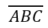

## **بررسی کلی**

PowerPoint معادلات را به صورت Office Math Markup Language (OMML) ذخیره می‌کند. با Aspose.Slides برای .NET می‌توانید همان نوع محتوای ریاضی را به‌صورت برنامه‌نویسی ایجاد کنید: کسرها، رادیکال‌ها، توابع، حدها، عملگرهای N-ary، ماتریس‌ها، آرایه‌ها و بلوک‌های ریاضی قالب‌بندی‌شده.

در PowerPoint، کاربران معمولاً معادلات را از **Insert > Equation** اضافه می‌کنند:


نتیجه متن ریاضی قابل ویرایش بر روی اسلاید است:


Aspose.Slides این متن ریاضی را از طریق سه شیء اصلی می‌سازد:

- یک شکل ریاضی، که با [AddMathShape](https://reference.aspose.com/slides/fa/net/aspose.slides/ishapecollection/addmathshape/) ساخته می‌شود، شکل حاوی معادله است.
- [MathPortion](https://reference.aspose.com/slides/fa/net/aspose.slides.mathtext/mathportion/) محتوای ریاضی را داخل فریم متن شکل ذخیره می‌کند.
- [MathParagraph](https://reference.aspose.com/slides/fa/net/aspose.slides.mathtext/mathparagraph/) حاوی یک یا چند شیء [MathBlock](https://reference.aspose.com/slides/fa/net/aspose.slides.mathtext/mathblock/) است.

اکثر مثال‌های زیر از [MathematicalText](https://reference.aspose.com/slides/fa/net/aspose.slides.mathtext/mathematicaltext/) و روش‌های زنجیره‌ای [IMathElement](https://reference.aspose.com/slides/fa/net/aspose.slides.mathtext/imathelement/) برای کوتاه و خوانا نگه داشتن کد استفاده می‌کنند.

برای سناریوهای صادرات MathML، به [صادرات معادلات ریاضی از ارائه‌ها در .NET](/slides/fa/net/exporting-math-equations/) مراجعه کنید.

## **ایجاد یک معادله**

این مثال یک شکل ریاضی ایجاد می‌کند و قضیه فیثاغورث را اضافه می‌کند:


```csharp
using var presentation = new Presentation();
var slide = presentation.Slides[0];

var mathShape = slide.Shapes.AddMathShape(20, 20, 700, 120);
var mathParagraph = ((MathPortion)mathShape.TextFrame.Paragraphs[0].Portions[0]).MathParagraph;

var equation = new MathematicalText("c")
    .SetSuperscript("2")
    .Join("=")
    .Join(new MathematicalText("a").SetSuperscript("2"))
    .Join("+")
    .Join(new MathematicalText("b").SetSuperscript("2"));

mathParagraph.Add(equation);

presentation.Save("pythagorean-theorem.pptx", SaveFormat.Pptx);
```

{}
`AddMathShape` شکلی ایجاد می‌کند که از قبل شامل یک پاراگراف ریاضی است. اولین `MathPortion` را دسترسی بگیرید، `MathParagraph` آن را دریافت کنید و بلوک‌های ریاضی یا عناصر ریاضی را به آن اضافه کنید.
{}

## **افزودن کسرها**

از `Divide` برای ایجاد یک کسر استفاده کنید. می‌توانید سبک کسر را با [MathFractionTypes](https://reference.aspose.com/slides/fa/net/aspose.slides.mathtext/mathfractiontypes/) انتخاب کنید.


```csharp
using var presentation = new Presentation();
var slide = presentation.Slides[0];

var mathShape = slide.Shapes.AddMathShape(20, 20, 700, 100);
var mathParagraph = ((MathPortion)mathShape.TextFrame.Paragraphs[0].Portions[0]).MathParagraph;

var fraction = new MathematicalText("1")
    .Divide("x", MathFractionTypes.Skewed);

mathParagraph.Add(new MathBlock(fraction));

presentation.Save("fraction.pptx", SaveFormat.Pptx);
```

برای یک کسر چیده‌شده، از `MathFractionTypes.Bar` استفاده کنید:

```csharp
var stackedFraction = new MathematicalText("x + 1").Divide("y - 1", MathFractionTypes.Bar);
```

## **افزودن رادیکال‌ها**

از `Radical` برای ایجاد رادیکال درجه دوم، سوم یا دیگر ریشه‌ها استفاده کنید. عنصر جاری به عنوان پایه و آرگومان به عنوان درجه قرار می‌گیرد.


```csharp
using var presentation = new Presentation();
var slide = presentation.Slides[0];

var mathShape = slide.Shapes.AddMathShape(20, 20, 700, 100);
var mathParagraph = ((MathPortion)mathShape.TextFrame.Paragraphs[0].Portions[0]).MathParagraph;

var radical = new MathematicalText("x")
    .Radical("n");

mathParagraph.Add(new MathBlock(radical));

presentation.Save("radical.pptx", SaveFormat.Pptx);
```

## **افزودن توابع و حدها**

از `AsArgumentOfFunction` یا `Function` برای توابعی مانند `sin(x)`، `log(x)` یا نام‌های توابع سفارشی استفاده کنید. برای حدها، `lim` را در یک [MathLimit](https://reference.aspose.com/slides/fa/net/aspose.slides.mathtext/mathlimit/) بگذارید یا از `SetLowerLimit` استفاده کنید.


```csharp
using var presentation = new Presentation();
var slide = presentation.Slides[0];

var mathShape = slide.Shapes.AddMathShape(20, 20, 700, 100);
var mathParagraph = ((MathPortion)mathShape.TextFrame.Paragraphs[0].Portions[0]).MathParagraph;

var limit = new MathematicalText("lim")
    .SetLowerLimit("x→∞")
    .Function("x");

mathParagraph.Add(new MathBlock(limit));

presentation.Save("functions-and-limits.pptx", SaveFormat.Pptx);
```

برای نام تابع سفارشی، نام تابع را به عنوان عنصر جاری تعیین کنید:

```csharp
var customFunction = new MathematicalText("f").Function("x + 1");
```

## **افزودن عملگرهای N-ary و انتگرال‌ها**

از `Nary` برای جمع‌ها، اتحادها، تقاطع‌ها و سایر عملگرهای بزرگ استفاده کنید. از `Integral` برای انتگرال‌ها استفاده کنید. هر دو روش به شما امکان تنظیم حدهای پایین و بالا را می‌دهند.


```csharp
using var presentation = new Presentation();
var slide = presentation.Slides[0];

var mathShape = slide.Shapes.AddMathShape(20, 20, 700, 120);
var mathParagraph = ((MathPortion)mathShape.TextFrame.Paragraphs[0].Portions[0]).MathParagraph;

var summationBase = new MathematicalText("x")
    .SetSuperscript("k")
    .Join(new MathematicalText("a").SetSuperscript("n-k"));

var summation = summationBase.Nary(MathNaryOperatorTypes.Summation, "k=0", "n");

mathParagraph.Add(new MathBlock(summation));

presentation.Save("nary-operators.pptx", SaveFormat.Pptx);
```

عملگرهای N-ary برای عملگرهای بزرگ با حدهای اختیاری هستند. عملگرهای ساده مانند `+`، `-` و `=` معمولاً به‌صورت `MathematicalText` افزوده شده و به عبارت پیوست می‌شوند.

برای یک انتگرال، از `Integral` استفاده کنید:

```csharp
var integralBase = new MathematicalText("x").Join(new MathematicalText("dx").ToBox());
var integral = integralBase.Integral(MathIntegralTypes.Simple, "0", "1");
```

## **افزودن ماتریس‌ها**

از [MathMatrix](https://reference.aspose.com/slides/fa/net/aspose.slides.mathtext/mathmatrix/) برای ردیف‌ها و ستون‌ها استفاده کنید. به‌طور پیش‌فرض ماتریس‌ها براکت ندارند، بنابراین برای نیاز به پرانتز، براکت یا کروشه ماتریس را درون آن‌ها بکشید.


```csharp
using var presentation = new Presentation();
var slide = presentation.Slides[0];

var mathShape = slide.Shapes.AddMathShape(20, 20, 700, 120);
var mathParagraph = ((MathPortion)mathShape.TextFrame.Paragraphs[0].Portions[0]).MathParagraph;

var matrix = new MathMatrix(2, 3);
matrix[0, 0] = new MathematicalText("1");
matrix[0, 1] = new MathematicalText("x");
matrix[1, 0] = new MathematicalText("x");
matrix[1, 1] = new MathematicalText("2");
matrix[1, 2] = new MathematicalText("y");

mathParagraph.Add(new MathBlock(matrix));

presentation.Save("matrix.pptx", SaveFormat.Pptx);
```

## **افزودن آرایه‌های معادله**

از `ToMathArray` زمانی که به معادلات هم‌ردیف یا یک پشته عمودی از عبارات نیاز دارید استفاده کنید.


```csharp
using var presentation = new Presentation();
var slide = presentation.Slides[0];

var mathShape = slide.Shapes.AddMathShape(20, 20, 700, 140);
var mathParagraph = ((MathPortion)mathShape.TextFrame.Paragraphs[0].Portions[0]).MathParagraph;

var equationArray = new MathematicalText("x")
    .Join("y")
    .ToMathArray();

mathParagraph.Add(new MathBlock(equationArray));

presentation.Save("equation-array.pptx", SaveFormat.Pptx);
```

## **افزودن توابع مثلثاتی**

از `AsArgumentOfFunction` زمانی که آرگومان عنصر جاری است و نام تابع شناخته‌شده است استفاده کنید.


```csharp
using var presentation = new Presentation();
var slide = presentation.Slides[0];

var mathShape = slide.Shapes.AddMathShape(20, 20, 700, 100);
var mathParagraph = ((MathPortion)mathShape.TextFrame.Paragraphs[0].Portions[0]).MathParagraph;

var cosine = new MathematicalText("2x")
    .AsArgumentOfFunction(MathFunctionsOfOneArgument.Cos);

mathParagraph.Add(new MathBlock(cosine));

presentation.Save("trigonometric-function.pptx", SaveFormat.Pptx);
```

## **افزودن زیرنویس و بالانویس**

از کمک‌کننده‌های زیرنویس و بالانویس برای شاخص‌ها و توان‌ها استفاده کنید. هنگامی که شاخص‌ها باید در سمت چپ پایه ظاهر شوند، از `SetSubSuperscriptOnTheLeft` استفاده کنید.


```csharp
using var presentation = new Presentation();
var slide = presentation.Slides[0];

var mathShape = slide.Shapes.AddMathShape(20, 20, 700, 100);
var mathParagraph = ((MathPortion)mathShape.TextFrame.Paragraphs[0].Portions[0]).MathParagraph;

var scripts = new MathematicalText("Y")
    .SetSubSuperscriptOnTheLeft("1", "n");

mathParagraph.Add(new MathBlock(scripts));

presentation.Save("subscript-superscript.pptx", SaveFormat.Pptx);
```

## **افزودن تقسیم‌کننده‌ها**

از `Enclose` برای قرار دادن یک عبارت داخل تقسیم‌کننده‌ها استفاده کنید. می‌توانید کاراکتر جداکننده را برای عبارات تقسیم‌کننده‌ای که شامل چند عنصر هستند نیز تنظیم کنید.


```csharp
using var presentation = new Presentation();
var slide = presentation.Slides[0];

var mathShape = slide.Shapes.AddMathShape(20, 20, 700, 100);
var mathParagraph = ((MathPortion)mathShape.TextFrame.Paragraphs[0].Portions[0]).MathParagraph;

var delimiter = new MathematicalText("x")
    .Join("y")
    .Join("z")
    .Enclose('<', '>');
delimiter.SeparatorCharacter = '|';

mathParagraph.Add(new MathBlock(delimiter));

presentation.Save("delimiters.pptx", SaveFormat.Pptx);
```

## **افزودن جعبه مرزی**

از `ToBorderBox` زمانی که خود معادله باید در قالب یک جعبه قرار گیرد استفاده کنید.


```csharp
using var presentation = new Presentation();
var slide = presentation.Slides[0];

var mathShape = slide.Shapes.AddMathShape(20, 20, 700, 100);
var mathParagraph = ((MathPortion)mathShape.TextFrame.Paragraphs[0].Portions[0]).MathParagraph;

var boxedEquation = new MathematicalText("a")
    .SetSuperscript("2")
    .Join("=")
    .Join(new MathematicalText("b").SetSuperscript("2"))
    .Join("+")
    .Join(new MathematicalText("c").SetSuperscript("2"))
    .ToBorderBox();

mathParagraph.Add(new MathBlock(boxedEquation));

presentation.Save("border-box.pptx", SaveFormat.Pptx);
```

## **گروه‌بندی عبارات**

از `Group` برای قرار دادن یک کاراکتر گروه‌بندی بالای یا زیر یک عبارت استفاده کنید. برای برچسب‌گذاری عبارات گروه‌بندی‌شده می‌توانید یک حد اضافه کنید.


```csharp
using var presentation = new Presentation();
var slide = presentation.Slides[0];

var mathShape = slide.Shapes.AddMathShape(20, 20, 700, 120);
var mathParagraph = ((MathPortion)mathShape.TextFrame.Paragraphs[0].Portions[0]).MathParagraph;

var grouped = new MathematicalText("x + y")
    .Group('\u23DF', MathTopBotPositions.Bottom, MathTopBotPositions.Top)
    .SetLowerLimit("any text");

mathParagraph.Add(new MathBlock(grouped));

presentation.Save("grouped-terms.pptx", SaveFormat.Pptx);
```

## **قالب‌بندی عناصر ریاضی**

از کمک‌کننده‌های قالب‌بندی فقط در جایی استفاده کنید که فرمول را واضح‌تر می‌کند. برای مثال، `Overbar` یک خط بالا روی عنصر ریاضی می‌گذارد.



```csharp
using var presentation = new Presentation();
var slide = presentation.Slides[0];

var mathShape = slide.Shapes.AddMathShape(20, 20, 700, 100);
var mathParagraph = ((MathPortion)mathShape.TextFrame.Paragraphs[0].Portions[0]).MathParagraph;

var overbar = new MathematicalText("ABC").Overbar();

mathParagraph.Add(new MathBlock(overbar));

presentation.Save("overbar.pptx", SaveFormat.Pptx);
```

## **راهنمای سریع**

| وظیفه | API اصلی |
| --- | --- |
| ایجاد متن ریاضی | [MathematicalText](https://reference.aspose.com/slides/fa/net/aspose.slides.mathtext/mathematicaltext/) |
| ترکیب عناصر | [IMathElement.Join](https://reference.aspose.com/slides/fa/net/aspose.slides.mathtext/imathelement/join/) |
| ایجاد کسرها | [IMathElement.Divide](https://reference.aspose.com/slides/fa/net/aspose.slides.mathtext/imathelement/divide/) |
| افزودن بالانویس یا زیرنویس | [SetSuperscript](https://reference.aspose.com/slides/fa/net/aspose.slides.mathtext/imathelement/setsuperscript/), [SetSubscript](https://reference.aspose.com/slides/fa/net/aspose.slides.mathtext/imathelement/setsubscript/) |
| افزودن توابع | [Function](https://reference.aspose.com/slides/fa/net/aspose.slides.mathtext/imathelement/function/), [AsArgumentOfFunction](https://reference.aspose.com/slides/fa/net/aspose.slides.mathtext/imathelement/asargumentoffunction/) |
| افزودن رادیکال‌ها | [IMathElement.Radical](https://reference.aspose.com/slides/fa/net/aspose.slides.mathtext/imathelement/radical/) |
| افزودن حدها | [SetLowerLimit](https://reference.aspose.com/slides/fa/net/aspose.slides.mathtext/imathelement/setlowerlimit/), [SetUpperLimit](https://reference.aspose.com/slides/fa/net/aspose.slides.mathtext/imathelement/setupperlimit/) |
| افزودن اسکریپت‌های سمت چپ | [SetSubSuperscriptOnTheLeft](https://reference.aspose.com/slides/fa/net/aspose.slides.mathtext/imathelement/setsubsuperscriptontheleft/) |
| افزودن جمع‌ها و انتگرال‌ها | [Nary](https://reference.aspose.com/slides/fa/net/aspose.slides.mathtext/imathelement/nary/), [Integral](https://reference.aspose.com/slides/fa/net/aspose.slides.mathtext/imathelement/integral/) |
| افزودن ماتریس‌ها | [MathMatrix](https://reference.aspose.com/slides/fa/net/aspose.slides.mathtext/mathmatrix/) |
| افزودن آرایه‌های معادله | [ToMathArray](https://reference.aspose.com/slides/fa/net/aspose.slides.mathtext/imathelement/tomatharray/) |
| افزودن تقسیم‌کننده‌ها | [Enclose](https://reference.aspose.com/slides/fa/net/aspose.slides.mathtext/imathelement/enclose/) |
| افزودن خط فوق و حاشیه | [Overbar](https://reference.aspose.com/slides/fa/net/aspose.slides.mathtext/imathelement/overbar/), [ToBorderBox](https://reference.aspose.com/slides/fa/net/aspose.slides.mathtext/imathelement/toborderbox/) |
| گروه‌بندی عبارات | [Group](https://reference.aspose.com/slides/fa/net/aspose.slides.mathtext/imathelement/group/) |

## **پرسش‌های متداول**

**آیا می‌توانم یک معادله موجود در PowerPoint را ویرایش کنم؟**

بله. ارائه را باز کنید، شکلی که شامل `MathPortion` است پیدا کنید، `MathParagraph` آن را دریافت کنید و بلوک‌های ریاضی در آن پاراگراف را به‌روز کنید.

**آیا معادلات به‌صورت ریاضی قابل ویرایش PowerPoint ذخیره می‌شوند؟**

بله. هنگام ذخیره به PPTX، Aspose.Slides معادله را به‌صورت محتوای ریاضی Office قابل ویرایش می‌نویسد.

**آیا می‌توانم معادلات را به LaTeX صادر کنم؟**

Aspose.Slides معادلات ریاضی را به MathML صادر می‌کند. اگر به LaTeX نیاز دارید، ابتدا به MathML صادر کنید و سپس با ابزاری که دیالکت LaTeX هدف شما را پشتیبانی می‌کند، MathML را تبدیل کنید.