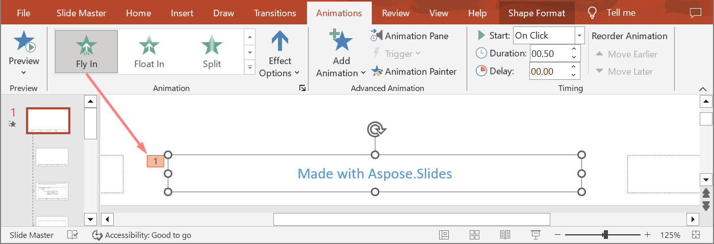
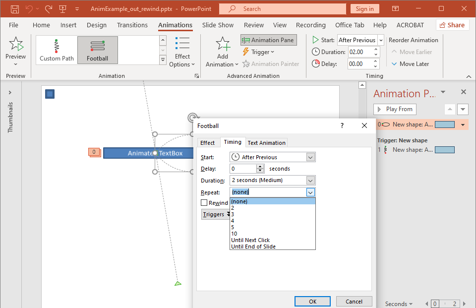

## **مقدمه**

انیمیشن‌ها اثرات بصری هستند که می‌توانند به متن‌ها، تصاویر، اشکال یا [نمودارها](/slides/fa/net/animated-charts/) اعمال شوند. آنها جان می‌دهند به ارائه‌ها یا اجزای آن. 

## **چرا از انیمیشن‌ها در ارائه‌ها استفاده کنیم؟**

* کنترل جریان اطلاعات
* برجسته کردن نکات مهم
* افزایش علاقه یا مشارکت مخاطبان
* آسان‌تر کردن خواندن یا درک یا پردازش محتوا
* جذب توجه خوانندگان یا تماشاچیان به بخش‌های مهم در یک ارائه

PowerPoint گزینه‌ها و ابزارهای متعددی برای انیمیشن‌ها و اثرهای انیمیشن در دسته‌های **ورود**، **خروج**، **تاکید** و **مسیرهای حرکتی** فراهم می‌کند. 

## **انیمیشن‌ها در Aspose.Slides**

* Aspose.Slides کلاس‌ها و نوع‌هایی که برای کار با انیمیشن‌ها نیاز دارید را تحت فضا نامی [Aspose.Slides.Animation](https://reference.aspose.com/slides/fa/net/aspose.slides.animation/) فراهم می‌کند،
* Aspose.Slides بیش از **150 اثر انیمیشن** را تحت شمارش‌گر [EffectType](https://reference.aspose.com/slides/fa/net/aspose.slides.animation/effecttype) فراهم می‌کند. این اثرها عملاً همان (یا معادل) اثرهای استفاده‌شده در PowerPoint هستند.

## **اعمال انیمیشن به TextBox**

Aspose.Slides برای .NET به شما امکان می‌دهد تا انیمیشن را بر روی متن در یک شکل اعمال کنید. 

1. یک نمونه از کلاس [Presentation](http://www.aspose.com/api/net/slides/fa/aspose.slides/) ایجاد کنید.
2. مرجع یک اسلاید را از طریق ایندکس آن دریافت کنید.
3. یک `rectangle` [IAutoShape](https://reference.aspose.com/slides/fa/net/aspose.slides/iautoshape) اضافه کنید. 
4. متن را به [IAutoShape.TextFrame](https://reference.aspose.com/slides/fa/net/aspose.slides/iautoshape/properties/textframe) اضافه کنید.
5. دنباله اصلی اثرها را دریافت کنید.
6. یک اثر انیمیشن به [IAutoShape](https://reference.aspose.com/slides/fa/net/aspose.slides/iautoshape) اضافه کنید.
7. ویژگی [TextAnimation.BuildType](https://reference.aspose.com/slides/fa/net/aspose.slides.animation/textanimation/properties/buildtype) را به مقداری از [BuildType Enumeration](https://reference.aspose.com/slides/fa/net/aspose.slides.animation/buildtype) تنظیم کنید.
8. ارائه را به عنوان فایل PPTX روی دیسک بنویسید.

این کد C# نشان می‌دهد چگونه اثر `Fade` را به AutoShape اعمال کنید و انیمیشن متن را به مقدار *By 1st Level Paragraphs* تنظیم کنید:

```c#
// یک نمونه از کلاس ارائه ایجاد می‌کند که فایل ارائه را نشان می‌دهد.
using (Presentation pres = new Presentation())
{
    ISlide sld = pres.Slides[0];
    
    // یک AutoShape جدید با متن اضافه می‌کند
    IAutoShape autoShape = sld.Shapes.AddAutoShape(ShapeType.Rectangle, 20, 20, 150, 100);

    ITextFrame textFrame = autoShape.TextFrame;
    textFrame.Text = "First paragraph \nSecond paragraph \n Third paragraph";

    // دنباله اصلی اسلاید را دریافت می‌کند.
    ISequence sequence = sld.Timeline.MainSequence;

    // یک اثر انیمیشن محو (Fade) را به شکل اضافه می‌کند
    IEffect effect = sequence.AddEffect(autoShape, EffectType.Fade, EffectSubtype.None, EffectTriggerType.OnClick);

    // متن شکل را بر اساس پاراگراف‌های سطح اول انیمیشن می‌کند
    effect.TextAnimation.BuildType = BuildType.ByLevelParagraphs1;

    // فایل PPTX را بر روی دیسک ذخیره می‌کند
    pres.Save(path + "AnimTextBox_out.pptx", SaveFormat.Pptx);
}
```

{} 

علاوه بر اعمال انیمیشن به متن، می‌توانید انیمیشن‌ها را به یک [Paragraph](https://reference.aspose.com/slides/fa/net/aspose.slides/iparagraph) نیز اعمال کنید. به [**متن متحرک**](/slides/fa/net/animated-text/) نگاه کنید.

{} 

## **اعمال انیمیشن به PictureFrame**

1. یک نمونه از کلاس [Presentation](http://www.aspose.com/api/net/slides/fa/aspose.slides/) ایجاد کنید.
2. مرجع یک اسلاید را از طریق ایندکس آن دریافت کنید.
3. یک [PictureFrame](https://reference.aspose.com/slides/fa/net/aspose.slides/ipictureframe) را در اسلاید اضافه یا دریافت کنید. 
5. دنباله اصلی اثرها را دریافت کنید.
6. یک اثر انیمیشن به [PictureFrame](https://reference.aspose.com/slides/fa/net/aspose.slides/ipictureframe) اضافه کنید.
8. ارائه را به عنوان فایل PPTX روی دیسک بنویسید.

این کد C# نشان می‌دهد چگونه اثر `Fly` را به یک picture frame اعمال کنید:

```c#
// یک نمونه از کلاس ارائه ایجاد می‌کند که فایل ارائه را نشان می‌دهد.
using (Presentation pres = new Presentation())
{
    // تصویر را برای افزودن به مجموعه تصویر ارائه بارگذاری می‌کند
    IImage image = Images.FromFile("aspose-logo.jpg");
    IPPImage ppImage = pres.Images.AddImage(image);
    image.Dispose();

    // یک فریم تصویر را به اسلاید اضافه می‌کند
    IPictureFrame picFrame = pres.Slides[0].Shapes.AddPictureFrame(ShapeType.Rectangle, 50, 50, 100, 100, ppImage);

    // دنباله اصلی اسلاید را دریافت می‌کند.
    ISequence sequence = pres.Slides[0].Timeline.MainSequence;

    // یک اثر انیمیشن پرواز از سمت چپ را به فریم تصویر اضافه می‌کند
    IEffect effect = sequence.AddEffect(picFrame, EffectType.Fly, EffectSubtype.Left, EffectTriggerType.OnClick);

    // فایل PPTX را بر روی دیسک ذخیره می‌کند
    pres.Save("AnimImage_out.pptx", SaveFormat.Pptx);
}
```

## **اعمال انیمیشن به Shape**

1. یک نمونه از کلاس [Presentation](http://www.aspose.com/api/net/slides/fa/aspose.slides/) ایجاد کنید.
2. مرجع یک اسلاید را از طریق ایندکس آن دریافت کنید.
3. یک `rectangle` [IAutoShape](https://reference.aspose.com/slides/fa/net/aspose.slides/iautoshape) اضافه کنید. 
4. یک `Bevel` [IAutoShape](https://reference.aspose.com/slides/fa/net/aspose.slides/iautoshape) اضافه کنید (وقتی این شیء کلیک شود، انیمیشن اجرا می‌شود).
5. یک دنباله اثر بر روی شکل Bevel ایجاد کنید.
6. یک `UserPath` سفارشی ایجاد کنید.
7. دستورات برای حرکت به `UserPath` اضافه کنید.
8. ارائه را به عنوان فایل PPTX روی دیسک بنویسید.

این کد C# نشان می‌دهد چگونه اثر `PathFootball` (path football) را به یک شکل اعمال کنید:

```c#
// یک نمونه از کلاس Presentation ایجاد می‌کند که فایل ارائه را نشان می‌دهد.
using (Presentation pres = new Presentation())
{
    ISlide sld = pres.Slides[0];

    // افکت PathFootball را برای شکل موجود از ابتدا ایجاد می‌کند.
    IAutoShape ashp = sld.Shapes.AddAutoShape(ShapeType.Rectangle, 150, 150, 250, 25);

    ashp.AddTextFrame("Animated TextBox");

    // افکت انیمیشن PathFootBall را اضافه می‌کند.
    pres.Slides[0].Timeline.MainSequence.AddEffect(ashp, EffectType.PathFootball,
                           EffectSubtype.None, EffectTriggerType.AfterPrevious);

    // یک نوع «دکمه» ایجاد می‌کند.
    IShape shapeTrigger = pres.Slides[0].Shapes.AddAutoShape(ShapeType.Bevel, 10, 10, 20, 20);

    // یک دنباله از اثرها برای دکمه ایجاد می‌کند.
    ISequence seqInter = pres.Slides[0].Timeline.InteractiveSequences.Add(shapeTrigger);

    // یک مسیر کاربری سفارشی ایجاد می‌کند. شی ما تنها پس از کلیک روی دکمه جابه‌جا خواهد شد.
    IEffect fxUserPath = seqInter.AddEffect(ashp, EffectType.PathUser, EffectSubtype.None, EffectTriggerType.OnClick);

    // دستورات جابه‌جایی را اضافه می‌کند چون مسیر ایجاد شده خالی است.
    IMotionEffect motionBhv = ((IMotionEffect)fxUserPath.Behaviors[0]);

    PointF[] pts = new PointF[1];
    pts[0] = new PointF(0.076f, 0.59f);
    motionBhv.Path.Add(MotionCommandPathType.LineTo, pts, MotionPathPointsType.Auto, true);
    pts[0] = new PointF(-0.076f, -0.59f);
    motionBhv.Path.Add(MotionCommandPathType.LineTo, pts, MotionPathPointsType.Auto, false);
    motionBhv.Path.Add(MotionCommandPathType.End, null, MotionPathPointsType.Auto, false);

    // فایل PPTX را بر روی دیسک می‌نویسد
    pres.Save("AnimExample_out.pptx", SaveFormat.Pptx);
}
```

## **دریافت اثرهای انیمیشن اعمال‌شده به Shape**

مثال‌های زیر نشان می‌دهند چگونه از متد `GetEffectsByShape` در رابط [ISequence](https://reference.aspose.com/slides/fa/net/aspose.slides.animation/isequence/) برای دریافت تمام اثرهای انیمیشن اعمال‌شده به یک شکل استفاده کنید.

**مثال ۱: دریافت اثرهای انیمیشن اعمال‌شده به یک شکل در اسلاید عادی**

قبلاً یاد گرفته‌اید چگونه اثرهای انیمیشن را به اشکال در ارائه‌های PowerPoint اضافه کنید. کد نمونه زیر نشان می‌دهد چگونه اثرهای اعمال‌شده به اولین شکل در اولین اسلاید عادی در ارائه `AnimExample_out.pptx` را دریافت کنید.

```c#
using (Presentation presentation = new Presentation("AnimExample_out.pptx"))
{
    ISlide firstSlide = presentation.Slides[0];

    // دنباله اصلی انیمیشن اسلاید را دریافت می‌کند.
    ISequence sequence = firstSlide.Timeline.MainSequence;

    // اولین شکل در اولین اسلاید را دریافت می‌کند.
    IShape shape = firstSlide.Shapes[0];

    // اثرهای انیمیشن اعمال‌شده به شکل را دریافت می‌کند.
    IEffect[] shapeEffects = sequence.GetEffectsByShape(shape);

    if (shapeEffects.Length > 0)
        Console.WriteLine($"The shape {shape.Name} has {shapeEffects.Length} animation effects.");
}
```

**مثال ۲: دریافت تمام اثرهای انیمیشن، شامل آنهایی که از جای‌نگهدارها به ارث رسیده‌اند**

اگر یک شکل در اسلاید عادی دارای جای‌نگهدارهایی باشد که در اسلاید چیدمان و/یا اسلاید اصلی قرار دارند و اثرهای انیمیشن به این جای‌نگهدارها اضافه شده باشد، تمام اثرهای شکل در طول نمایش اسلاید اجرا خواهند شد، از جمله آنهایی که از جای‌نگهدارها به ارث رسیده‌اند.

بیایید بگوییم یک فایل ارائه PowerPoint `sample.pptx` داریم که یک اسلاید دارد که فقط یک شکل فوتر با متن "Made with Aspose.Slides" دارد و اثر **Random Bars** بر روی شکل اعمال شده است.

همچنین فرض کنیم اثر **Split** بر روی جای‌نگهدار فوتر در اسلاید **چیدمان** اعمال شده است.

و در نهایت، اثر **Fly In** بر روی جای‌نگهدار فوتر در اسلاید **مستر** اعمال شده است.




کد نمونه زیر نشان می‌دهد چگونه از متد `GetBasePlaceholder` در رابط [IShape](https://reference.aspose.com/slides/fa/net/aspose.slides/ishape/) برای دسترسی به جای‌نگهدارهای شکل و دریافت اثرهای انیمیشن اعمال‌شده به شکل فوتر، شامل آنهایی که از جای‌نگهدارهای موجود در اسلایدهای چیدمان و مستر به ارث رفته‌اند، استفاده کنید.

```cs
using (Presentation presentation = new Presentation("sample.pptx"))
{
    ISlide slide = presentation.Slides[0];

    // دریافت اثرهای انیمیشن شکل در اسلاید عادی.
    IShape shape = slide.Shapes[0];
    IEffect[] shapeEffects = slide.Timeline.MainSequence.GetEffectsByShape(shape);

    // دریافت اثرهای انیمیشن جای‌نگهدار در اسلاید چیدمان.
    IShape layoutShape = shape.GetBasePlaceholder();
    IEffect[] layoutShapeEffects = slide.LayoutSlide.Timeline.MainSequence.GetEffectsByShape(layoutShape);

    // دریافت اثرهای انیمیشن جای‌نگهدار در اسلاید مستر.
    IShape masterShape = layoutShape.GetBasePlaceholder();
    IEffect[] masterShapeEffects = slide.LayoutSlide.MasterSlide.Timeline.MainSequence.GetEffectsByShape(masterShape);

    Console.WriteLine("Main sequence of shape effects:");
    PrintEffects(masterShapeEffects);
    PrintEffects(layoutShapeEffects);
    PrintEffects(shapeEffects);
}
```
```cs
static void PrintEffects(IEnumerable<IEffect> effects)
{
    foreach (IEffect effect in effects)
    {
        Console.WriteLine($"{effect.Type} {effect.Subtype}");
    }
}
```

خروجی:
```text
Main sequence of shape effects:
Fly Bottom
Split VerticalIn
RandomBars Horizontal
```

## **تغییر ویژگی‌های زمان‌بندی اثر انیمیشن**

Aspose.Slides برای .NET به شما امکان می‌دهد ویژگی‌های Timing یک اثر انیمیشن را تغییر دهید.

این پنل زمان‌بندی انیمیشن و منوی گسترش یافته در Microsoft PowerPoint است:



این تطابق‌ها بین زمان‌بندی PowerPoint و ویژگی‌های [Effect.Timing](https://reference.aspose.com/slides/fa/net/aspose.slides.animation/effect/properties/timing) هستند:
- فهرست کشویی **Start** در زمان‌بندی PowerPoint با ویژگی [Effect.Timing.TriggerType](https://reference.aspose.com/slides/fa/net/aspose.slides.animation/itiming/properties/triggertype) مطابقت دارد. 
- **Duration** در زمان‌بندی PowerPoint با ویژگی [Effect.Timing.Duration](https://reference.aspose.com/slides/fa/net/aspose.slides.animation/itiming/properties/duration) مطابقت دارد. مدت زمان یک انیمیشن (برحسب ثانیه) کل زمان لازم برای تکمیل یک چرخه است. 
- **Delay** در زمان‌بندی PowerPoint با ویژگی [Effect.Timing.TriggerDelayTime](https://reference.aspose.com/slides/fa/net/aspose.slides.animation/itiming/properties/triggerdelaytime) مطابقت دارد. 
- فهرست کشویی **Repeat** در زمان‌بندی PowerPoint با این ویژگی‌ها مطابقت دارد: 
  * ویژگی [Effect.Timing.RepeatCount](https://reference.aspose.com/slides/fa/net/aspose.slides.animation/itiming/repeatcount) که *تعداد* دفعات تکرار اثر را توصیف می‌کند؛
  * پرچم [Effect.Timing.RepeatUntilEndSlide](https://reference.aspose.com/slides/fa/net/aspose.slides.animation/itiming/repeatuntilendslide) که مشخص می‌کند آیا اثر تا انتهای اسلاید تکرار شود؛
  * پرچم [Effect.Timing.RepeatUntilNextClick](https://reference.aspose.com/slides/fa/net/aspose.slides.animation/itiming/repeatuntilnextclick) که مشخص می‌کند آیا اثر تا کلیک بعدی تکرار شود.
- چک‌باکس **Rewind when done playing** در زمان‌بندی PowerPoint با ویژگی [Effect.Timing.Rewind](https://reference.aspose.com/slides/fa/net/aspose.slides.animation/itiming/rewind/) مطابقت دارد. 

این‌گونه می‌توانید ویژگی‌های زمان‌بندی Effect را تغییر دهید:

1. یک اثر انیمیشن را [Apply](#apply-animation-to-shape) کنید یا دریافت کنید.
2. مقادیر جدید را برای ویژگی‌های [Effect.Timing](https://reference.aspose.com/slides/fa/net/aspose.slides.animation/effect/properties/timing) که نیاز دارید تنظیم کنید. 
3. فایل PPTX اصلاح‌شده را ذخیره کنید.

این کد C# عملیات را نشان می‌دهد:

```c#
// یک نمونه از کلاس ارائه ایجاد می‌کند که فایل ارائه را نشان می‌دهد.
using (Presentation pres = new Presentation("AnimExample_out.pptx"))
{
    // دنباله اصلی اسلاید را دریافت می‌کند.
    ISequence sequence = pres.Slides[0].Timeline.MainSequence;

    // اولین اثر دنباله اصلی را دریافت می‌کند.
    IEffect effect = sequence[0];

    // نوع TriggerType اثر را به شروع با کلیک تغییر می‌دهد
    effect.Timing.TriggerType = EffectTriggerType.OnClick;

    // مدت زمان اثر را تغییر می‌دهد
    effect.Timing.Duration = 3f;

    // زمان تاخیر TriggerDelayTime اثر را تغییر می‌دهد
    effect.Timing.TriggerDelayTime = 0.5f;

    // اگر مقدار Repeat اثر "none" باشد
    if (effect.Timing.RepeatCount == 1f)
    {
        // مقدار Repeat اثر را به "Until Next Click" تغییر می‌دهد
        effect.Timing.RepeatUntilNextClick = true;
    }
    else
    {
        // مقدار Repeat اثر را به "Until End of Slide" تغییر می‌دهد
        effect.Timing.RepeatUntilEndSlide = true;
    }

    // ویژگی Rewind اثر را روشن می‌کند
        effect.Timing.Rewind = true;
    
    // فایل PPTX را بر روی دیسک ذخیره می‌کند
    pres.Save("AnimExample_changed.pptx", SaveFormat.Pptx);
}
```

## **صدا در اثر انیمیشن**

Aspose.Slides این ویژگی‌ها را برای کار با صداها در اثرهای انیمیشن فراهم می‌کند: 
- [IEffect.Sound](https://reference.aspose.com/slides/fa/net/aspose.slides.animation/effect/sound/) 
- [IEffect.StopPreviousSound](https://reference.aspose.com/slides/fa/net/aspose.slides.animation/effect/stopprevioussound/) 

### **اضافه‌کردن صدا به اثر انیمیشن**

این کد C# نشان می‌دهد چگونه صدا به یک اثر انیمیشن اضافه کنید و هنگام شروع اثر بعدی آن را متوقف کنید:

```c#
using (Presentation pres = new Presentation("AnimExample_out.pptx"))
{
	// صوت را به مجموعه صوتی ارائه اضافه می‌کند
	IAudio effectSound = pres.Audios.AddAudio(File.ReadAllBytes("sampleaudio.wav"));

	ISlide firstSlide = pres.Slides[0];

	// دنباله اصلی اسلاید را دریافت می‌کند.
	ISequence sequence = firstSlide.Timeline.MainSequence;

	// اولین اثر دنباله اصلی را دریافت می‌کند
	IEffect firstEffect = sequence[0];

	// اثر را برای "بدون صدا" بررسی می‌کند
	if (!firstEffect.StopPreviousSound && firstEffect.Sound == null)
	{
		// صدای اثر اول را اضافه می‌کند
		firstEffect.Sound = effectSound;
	}

	// اولین دنباله تعاملی اسلاید را دریافت می‌کند.
	ISequence interactiveSequence = firstSlide.Timeline.InteractiveSequences[0];

	// پرچم "Stop previous sound" اثر را تنظیم می‌کند
	interactiveSequence[0].StopPreviousSound = true;

	// فایل PPTX را بر روی دیسک می‌نویسد
	pres.Save("AnimExample_Sound_out.pptx", SaveFormat.Pptx);
}
```

### **استخراج صدا از اثر انیمیشن**

1. یک نمونه از کلاس [Presentation](https://reference.aspose.com/slides/fa/net/aspose.slides/presentation/) ایجاد کنید.
2. مرجع یک اسلاید را از طریق ایندکس آن دریافت کنید. 
3. دنباله اصلی اثرها را دریافت کنید. 
4. صداهای [Sound](https://reference.aspose.com/slides/fa/net/aspose.slides.animation/effect/sound/) جاسازی‌شده در هر اثر انیمیشن را استخراج کنید. 

این کد C# نشان می‌دهد چگونه صداهای جاسازی‌شده در یک اثر انیمیشن را استخراج کنید:

```c#
// یک نمونه از کلاس Presentation ایجاد می‌کند که فایل ارائه را نشان می‌دهد.
using (Presentation presentation = new Presentation("EffectSound.pptx"))
{
    ISlide slide = presentation.Slides[0];

    // دنباله اصلی اسلاید را دریافت می‌کند.
    ISequence sequence = slide.Timeline.MainSequence;

    foreach (IEffect effect in sequence)
    {
        if (effect.Sound == null)
            continue;

        // صدای اثر را به صورت آرایه بایت استخراج می‌کند
        byte[] audio = effect.Sound.BinaryData;
    }
}
```

## **پس از انیمیشن**

Aspose.Slides برای .NET به شما امکان می‌دهد ویژگی After animation یک اثر انیمیشن را تغییر دهید.

این پنل اثر پس از انیمیشن و منوی گسترش یافته در Microsoft PowerPoint است:


فهرست کشویی **After animation** در PowerPoint با این ویژگی‌ها مطابقت دارد: 

- ویژگی [IEffect.AfterAnimationType](https://reference.aspose.com/slides/fa/net/aspose.slides.animation/ieffect/afteranimationtype/) که نوع After animation را توصیف می‌کند :
  * گزینه **More Colors** در PowerPoint با نوع [AfterAnimationType.Color](https://reference.aspose.com/slides/fa/net/aspose.slides.animation/afteranimationtype/) مطابقت دارد؛
  * گزینه **Don't Dim** در PowerPoint با نوع [AfterAnimationType.DoNotDim](https://reference.aspose.com/slides/fa/net/aspose.slides.animation/afteranimationtype/) مطابقت دارد (نوع پیش‌فرض پس از انیمیشن)؛
  * گزینه **Hide After Animation** در PowerPoint با نوع [AfterAnimationType.HideAfterAnimation](https://reference.aspose.com/slides/fa/net/aspose.slides.animation/afteranimationtype/) مطابقت دارد؛
  * گزینه **Hide on Next Mouse Click** در PowerPoint با نوع [AfterAnimationType.HideOnNextMouseClick](https://reference.aspose.com/slides/fa/net/aspose.slides.animation/afteranimationtype/) مطابقت دارد؛
- ویژگی [IEffect.AfterAnimationColor](https://reference.aspose.com/slides/fa/net/aspose.slides.animation/ieffect/afteranimationcolor/) که قالب رنگ پس از انیمیشن را تعریف می‌کند. این ویژگی همراه با نوع [AfterAnimationType.Color](https://reference.aspose.com/slides/fa/net/aspose.slides.animation/afteranimationtype/) کار می‌کند. اگر نوع را به مقدار دیگری تغییر دهید، رنگ پس از انیمیشن پاک خواهد شد.

این کد C# نشان می‌دهد چگونه یک اثر پس از انیمیشن را تغییر دهید:

```c#
// یک نمونه از کلاس Presentation ایجاد می‌کند که فایل ارائه را نشان می‌دهد
using (Presentation pres = new Presentation("AnimImage_out.pptx"))
{
    ISlide firstSlide = pres.Slides[0];

    // اولین اثر دنباله اصلی را دریافت می‌کند
    IEffect firstEffect = firstSlide.Timeline.MainSequence[0];

    // نوع after animation را به Color تغییر می‌دهد
    firstEffect.AfterAnimationType = AfterAnimationType.Color;

    // رنگ پس از انیمیشن (dim) را تنظیم می‌کند
    firstEffect.AfterAnimationColor.Color = Color.AliceBlue;

    // فایل PPTX را بر روی دیسک می‌نویسد
    pres.Save("AnimImage_AfterAnimation.pptx", SaveFormat.Pptx);
}
```

## **متن متحرک**

Aspose.Slides این ویژگی‌ها را برای کار با بلوک *Animate text* یک اثر انیمیشن فراهم می‌کند:

- [IEffect.AnimateTextType](https://reference.aspose.com/slides/fa/net/aspose.slides.animation/ieffect/animatetexttype/) که نوع متن متحرک اثر را توصیف می‌کند. متن شکل می‌تواند به صورت زیر متحرک شود:
  - همه به‌صورت همزمان ([AnimateTextType.AllAtOnce](https://reference.aspose.com/slides/fa/net/aspose.slides.animation/animatetexttype/) نوع)
  - به‌واحد کلمه ([AnimateTextType.ByWord](https://reference.aspose.com/slides/fa/net/aspose.slides.animation/animatetexttype/) نوع)
  - به‌واحد حرف ([AnimateTextType.ByLetter](https://reference.aspose.com/slides/fa/net/aspose.slides.animation/animatetexttype/) نوع)
- [IEffect.DelayBetweenTextParts](https://reference.aspose.com/slides/fa/net/aspose.slides.animation/ieffect/delaybetweentextparts/) تاخیر بین بخش‌های متن متحرک (کلمات یا حروف) را تنظیم می‌کند. مقدار مثبت درصد مدت اثر را مشخص می‌کند. مقدار منفی تاخیر را بر حسب ثانیه مشخص می‌کند.

این‌گونه می‌توانید ویژگی‌های Animate text اثر را تغییر دهید:

1. یک اثر انیمیشن را [Apply](#apply-animation-to-shape) کنید یا دریافت کنید.
2. ویژگی [IEffect.TextAnimation.BuildType](https://reference.aspose.com/slides/fa/net/aspose.slides.animation/itextanimation/buildtype/) را به مقدار [BuildType.AsOneObject](https://reference.aspose.com/slides/fa/net/aspose.slides.animation/buildtype/) تنظیم کنید تا حالت انیمیشن *By Paragraphs* غیرفعال شود.
3. مقادیر جدید را برای ویژگی‌های [IEffect.AnimateTextType](https://reference.aspose.com/slides/fa/net/aspose.slides.animation/ieffect/animatetexttype/) و [IEffect.DelayBetweenTextParts](https://reference.aspose.com/slides/fa/net/aspose.slides.animation/ieffect/delaybetweentextparts/) تنظیم کنید.
4. فایل PPTX اصلاح‌شده را ذخیره کنید.

این کد C# عملیات را نشان می‌دهد:

```c#
// یک نمونه از کلاس Presentation ایجاد می‌کند که فایل ارائه را نشان می‌دهد.
using (Presentation pres = new Presentation("AnimTextBox_out.pptx"))
{
    ISlide firstSlide = pres.Slides[0];

    // اولین اثر دنباله اصلی را دریافت می‌کند
    IEffect firstEffect = firstSlide.Timeline.MainSequence[0];

    // نوع انیمیشن متن اثر را به "As One Object" تغییر می‌دهد
    firstEffect.TextAnimation.BuildType = BuildType.AsOneObject;

    // نوع Animate text اثر را به "By word" تغییر می‌دهد
    firstEffect.AnimateTextType = AnimateTextType.ByWord;

    // تاخیر بین کلمات را به 20٪ از مدت اثر تنظیم می‌کند
    firstEffect.DelayBetweenTextParts = 20f;

    // فایل PPTX را بر روی دیسک ذخیره می‌کند
    pres.Save("AnimTextBox_AnimateText.pptx", SaveFormat.Pptx);
}
```

## **سؤالات متداول**

**چگونه می‌توانم اطمینان حاصل کنم که انیمیشن‌ها هنگام انتشار ارائه در وب حفظ می‌شوند؟**

[Export to HTML5](/slides/fa/net/export-to-html5/) و فعال‌سازی [options](https://reference.aspose.com/slides/fa/net/aspose.slides.export/html5options/) مسئول [shape](https://reference.aspose.com/slides/fa/net/aspose.slides.export/html5options/animateshapes/) و [transition](https://reference.aspose.com/slides/fa/net/aspose.slides.export/html5options/animatetransitions/) انیمیشن‌ها. HTML ساده انیمیشن‌های اسلاید را اجرا نمی‌کند، در حالی که HTML5 این کار را می‌کند.

**تغییر ترتیب z-order (ترتیب لایه) اشکال چه تأثیری بر انیمیشن دارد؟**

انیمیشن و ترتیب کشیدن مستقل هستند: یک اثر زمان‌بندی و نوع ظاهر شدن/ناپدید شدن را کنترل می‌کند، در حالی که [z-order](https://reference.aspose.com/slides/fa/net/aspose.slides/shape/zorderposition/) تعیین می‌کند چه چیزی چه چیزی را می‌پوشاند. نتیجه قابل مشاهده ترکیب این دو است. (این رفتار عمومی PowerPoint است؛ مدل اثرها و اشکال Aspose.Slides همان منطق را دنبال می‌کند.)

**آیا محدودیتی در تبدیل انیمیشن‌ها به ویدیو برای برخی اثرها وجود دارد؟**

به طور کلی، [animations are supported](/slides/fa/net/convert-powerpoint-to-video/)، اما موارد نادر یا اثرهای خاص ممکن است به شکل متفاوتی رندر شوند. توصیه می‌شود با اثرهای مورد استفاده و نسخه کتابخانه آزمایش کنید.