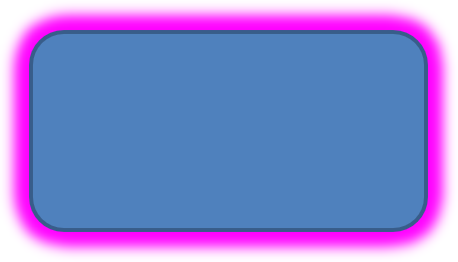

## **مقدمه**

در حالی که افکت‌ها در PowerPoint می‌توانند برای برجسته کردن یک شکل استفاده شوند، آنها متفاوت از [پر](/slides/fa/net/shape-formatting/#gradient-fill) یا خط‌کشی‌ها هستند. با استفاده از افکت‌های PowerPoint می‌توانید بازتاب‌های قانع‌کننده‌ای بر روی یک شکل ایجاد کنید، تابش یک شکل را گسترش دهید و غیره.


PowerPoint شش افکت ارائه می‌دهد که می‌توانند بر روی شکل‌ها اعمال شوند. می‌توانید یک یا چند افکت را بر روی یک شکل اعمال کنید.

برخی ترکیب‌های افکت بهتر از سایرین به‌نظر می‌رسند. به همین دلیل، PowerPoint گزینه‌هایی تحت **پیش تنظیم** دارد. گزینه‌های پیش تنظیم در واقع ترکیب شناخته‌شده‌ای از دو یا چند افکت با ظاهر خوب هستند. به این ترتیب، با انتخاب یک پیش تنظیم، نیازی به اتلاف زمان برای آزمون یا ترکیب افکت‌های مختلف به‌دنبال یافتن ترکیب مناسب نخواهید داشت.

Aspose.Slides ویژگی‌ها و متدهایی را تحت کلاس [EffectFormat](https://reference.aspose.com/slides/fa/net/aspose.slides/effectformat/) فراهم می‌کند که به شما امکان می‌دهد همان افکت‌ها را بر روی شکل‌ها در ارائه‌های PowerPoint اعمال کنید.

## **اعمال افکت سایه**

برای اعمال افکت سایه بر روی یک شکل در Aspose.Slides برای .NET، می‌توانید به‌راحتی پارامترهایی مانند رنگ، شعاع محو شدن و جهت را تنظیم کنید. این کار ظاهر پویا و حرفه‌ای‌تری به شکل‌ها می‌بخشد و عمق و تمرکز افزوده می‌کند. با استفاده از قطعات کد ساده، می‌توانید این افکت‌ها را بر روی چندین شکل اعمال کنید و جذابیت بصری کلی ارائه‌های خود را ارتقا دهید.

این کد C# نشان می‌دهد چگونه [اثر سایه خارجی](https://reference.aspose.com/slides/fa/net/aspose.slides/effectformat/outershadoweffect/) را بر روی یک مستطیل اعمال کنید:

```c#
using var presentation = new Presentation();
var slide = presentation.Slides[0];

var shape = slide.Shapes.AddAutoShape(ShapeType.RoundCornerRectangle, 20, 20, 200, 100);

shape.EffectFormat.EnableOuterShadowEffect();
shape.EffectFormat.OuterShadowEffect.ShadowColor.Color = Color.DarkGray;
shape.EffectFormat.OuterShadowEffect.Distance = 10;
shape.EffectFormat.OuterShadowEffect.Direction = 45;

presentation.Save("shadow_effect.pptx", SaveFormat.Pptx);
```


## **اعمال افکت بازتاب**

برای اعمال افکت بازتاب در Aspose.Slides برای .NET، می‌توانید بازتابی شبیه آینه به شکل‌ها اضافه کنید و پارامترهایی مانند فاصله، شفافیت و اندازه را تنظیم کنید. این افکت ظاهر زیبایی ارائه‌های شما را ارتقا می‌دهد و به شکل‌ها ظاهری صیقلی و پیشرفته می‌بخشد. پیاده‌سازی آن با کد ساده آسان است و امکان اعمال سریع بر روی عناصر متعدد برای یک طراحی منسجم را فراهم می‌کند.

این کد C# نشان می‌دهد چگونه [اثر بازتاب](https://reference.aspose.com/slides/fa/net/aspose.slides/effectformat/reflectioneffect/) را بر روی یک شکل اعمال کنید:

```c#
using var presentation = new Presentation();
var slide = presentation.Slides[0];

var shape = slide.Shapes.AddAutoShape(ShapeType.RoundCornerRectangle, 20, 20, 200, 100);

shape.EffectFormat.EnableReflectionEffect();
shape.EffectFormat.ReflectionEffect.RectangleAlign = RectangleAlignment.Bottom;
shape.EffectFormat.ReflectionEffect.Direction = 90;
shape.EffectFormat.ReflectionEffect.Distance = 40;
shape.EffectFormat.ReflectionEffect.BlurRadius = 2;

presentation.Save("reflection_effect.pptx", SaveFormat.Pptx);
```


## **اعمال افکت درخشش**

برای اعمال افکت درخشش بر روی یک شکل در Aspose.Slides برای .NET، می‌توانید هاله‌ای نرم و درخشان اطراف شکل‌ها اضافه کنید و خصوصیت‌هایی مانند رنگ و اندازه را تنظیم کنید. این افکت به برجسته شدن شکل‌ها کمک می‌کند و یک عنصر بصری جذاب و چشم‌نواز به ارائه شما اضافه می‌سازد. پیاده‌سازی آن با کد کمینه آسان است و ظاهر کلی اسلایدهای شما را بهبود می‌بخشد.

این کد C# نشان می‌دهد چگونه [اثر درخشش](https://reference.aspose.com/slides/fa/net/aspose.slides/effectformat/gloweffect/) را بر روی یک شکل اعمال کنید:

```c#
using var presentation = new Presentation();
var slide = presentation.Slides[0];

var shape = slide.Shapes.AddAutoShape(ShapeType.RoundCornerRectangle, 20, 20, 200, 100);

shape.EffectFormat.EnableGlowEffect();
shape.EffectFormat.GlowEffect.Color.Color = Color.Magenta;
shape.EffectFormat.GlowEffect.Radius = 15;

presentation.Save("glow_effect.pptx", SaveFormat.Pptx);
```



## **اعمال افکت لبه‌های نرم**

برای اعمال افکت لبه‌های نرم در Aspose.Slides برای .NET، می‌توانید یک انتقال صاف و محو در اطراف لبه‌های یک شکل ایجاد کنید. این افکت ظاهری ظریف‌تر و برازنده‌تر اضافه می‌کند که برای طرح‌هایی که به ظاهر ملایم و نرم نیاز دارند، ایده‌آل است. می‌توانید به‌راحتی پارامترهایی مانند شعاع را تنظیم کنید تا اثر دلخواه را بر روی شکل‌های مختلف در ارائه خود به‌دست آورید.

این کد C# نشان می‌دهد چگونه [لبه‌های نرم](https://reference.aspose.com/slides/fa/net/aspose.slides/effectformat/softedgeeffect/) را بر روی یک شکل اعمال کنید:

```c#
using var presentation = new Presentation();
var slide = presentation.Slides[0];

var shape = slide.Shapes.AddAutoShape(ShapeType.RoundCornerRectangle, 20, 20, 200, 150);

shape.EffectFormat.EnableSoftEdgeEffect();
shape.EffectFormat.SoftEdgeEffect.Radius = 8;

presentation.Save("soft_edges_effect.pptx", SaveFormat.Pptx);
```


## **پرسش‌های متداول**

**آیا می‌توانم چندین افکت را بر روی یک شکل اعمال کنم؟**

بله، می‌توانید افکت‌های مختلفی مانند سایه، بازتاب و درخشش را بر روی یک شکل ترکیب کنید تا ظاهر پویا‌تری ایجاد کنید.

**به چه شکل‌هایی می‌توانم افکت اعمال کنم؟**

می‌توانید افکت‌ها را به انواع شکل‌ها اعمال کنید، از جمله اشکال خودکار، نمودارها، جدول‌ها، تصاویر، اشیاء SmartArt، اشیاء OLE و غیره.

**آیا می‌توانم افکت‌ها را بر روی اشکال گروه‌بندی‌شده اعمال کنم؟**

بله، می‌توانید افکت‌ها را بر روی اشکال گروه‌بندی‌شده اعمال کنید. افکت بر کل گروه اعمال خواهد شد.