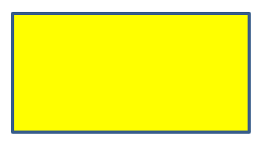

## **مقدمه**

در PowerPoint می‌توانید اشکال را به اسلایدها اضافه کنید. از آنجا که اشکال از خطوط تشکیل شده‌اند، می‌توانید آن‌ها را با تغییر یا اعمال افکت‌ها بر روی خطوط مرزی قالب‌بندی کنید. علاوه بر این، می‌توانید اشکال را با تعیین تنظیماتی که نحوه پر شدن داخلی آن‌ها را کنترل می‌کند، قالب‌بندی کنید.


Aspose.Slides for .NET رابط‌ها و خصوصیتی را فراهم می‌کند که به شما امکان می‌دهد اشکال را با استفاده از همان گزینه‌های موجود در PowerPoint قالب‌بندی کنید.

## **قالب‌بندی خطوط**

با استفاده از Aspose.Slides می‌توانید یک سبک خط سفارشی برای یک شکل مشخص کنید. مراحل زیر فرآیند را توضیح می‌دهند:

1. یک نمونه از کلاس [Presentation](https://reference.aspose.com/slides/fa/net/aspose.slides/presentation/) ایجاد کنید.
1. یک مرجع به اسلاید را بر اساس ایندکس آن دریافت کنید.
1. یک [IAutoShape](https://reference.aspose.com/slides/fa/net/aspose.slides/iautoshape/) به اسلاید اضافه کنید.
1. قالب [line style](https://reference.aspose.com/slides/fa/net/aspose.slides/linestyle/) شکل را تنظیم کنید.
1. عرض خط را تنظیم کنید.
1. قالب [dash style](https://reference.aspose.com/slides/fa/net/aspose.slides/linedashstyle/) خط را تنظیم کنید.
1. رنگ خط برای شکل را تنظیم کنید.
1. ارائهٔ اصلاح‌شده را به صورت فایل PPTX ذخیره کنید.

کد C# زیر نشان می‌دهد چگونه یک `AutoShape` مستطیل را قالب‌بندی کنید:

```c#
using System.Drawing;
using Aspose.Slides;
using Aspose.Slides.Export;

// یک شی از کلاس Presentation ایجاد کنید که نمایانگر یک فایل ارائه است.
using (Presentation presentation = new Presentation())
{
    // اسلاید اول را دریافت کنید.
    ISlide slide = presentation.Slides[0];

    // یک شکل خودکار از نوع Rectangle اضافه کنید.
    IAutoShape shape = slide.Shapes.AddAutoShape(ShapeType.Rectangle, 50, 50, 150, 75);

    // رنگ پر کردن برای شکل مستطیل تنظیم کنید.
    shape.FillFormat.FillType = FillType.NoFill;

    // قالب‌بندی خطوط مستطیل را اعمال کنید.
    shape.LineFormat.Style = LineStyle.ThickThin;
    shape.LineFormat.Width = 7;
    shape.LineFormat.DashStyle = LineDashStyle.Dash;

    // رنگ خط مستطیل را تنظیم کنید.
    shape.LineFormat.FillFormat.FillType = FillType.Solid;
    shape.LineFormat.FillFormat.SolidFillColor.Color = Color.Blue;

    // فایل PPTX را روی دیسک ذخیره کنید.
    presentation.Save("formatted_lines.pptx", SaveFormat.Pptx);
}
```

نتیجه:


## **اعمال افکت‌های طرح‌وار به خطوط شکل**

یک افکت طرح‌وار باعث می‌شود خط یک شکل شبیه به دست‌نویس شود. برای دسترسی به تنظیمات خط از [IShape.LineFormat](https://reference.aspose.com/slides/fa/net/aspose.slides/ishape/lineformat/) استفاده کنید، برای دسترسی به تنظیمات طرح‌وار از [ILineFormat.SketchFormat](https://reference.aspose.com/slides/fa/net/aspose.slides/ilineformat/sketchformat/) و برای انتخاب مقدار از شمارش‌گر [LineSketchType](https://reference.aspose.com/slides/fa/net/aspose.slides/linesketchtype/) از [ISketchFormat.SketchType](https://reference.aspose.com/slides/fa/net/aspose.slides/isketchformat/sketchtype/) استفاده کنید.

کد C# زیر نشان می‌دهد چگونه افکت [LineSketchType.Curved](https://reference.aspose.com/slides/fa/net/aspose.slides/linesketchtype/) را اعمال کرده، مقدار اختصاص داده‌شده را بخوانید و با [LineSketchType.None](https://reference.aspose.com/slides/fa/net/aspose.slides/linesketchtype/) افکت را حذف کنید:

```csharp
using Aspose.Slides;

using var presentation = new Presentation();

var slide = presentation.Slides[0];
var shape = slide.Shapes.AddAutoShape(ShapeType.Rectangle, 50, 50, 200, 100);

// Access the shape's line format and its sketch format.
var sketchFormat = shape.LineFormat.SketchFormat;

// Apply a sketch effect.
sketchFormat.SketchType = LineSketchType.Curved;

// Read the sketch effect assigned directly to the shape.
var explicitSketchType = sketchFormat.SketchType;
Console.WriteLine($"Explicit sketch type: {explicitSketchType}");

// Remove the sketch effect.
sketchFormat.SketchType = LineSketchType.None;
```

مقداری که `ISketchFormat.SketchType` برمی‌گرداند، تنظیمی است که مستقیماً به شکل اختصاص داده شده است. اگر قالب‌بندی خط می‌تواند از تم، اسلاید اصلی یا اسلاید چیدمان ارث‌بری شود، از [ILineFormat.GetEffective](https://reference.aspose.com/slides/fa/net/aspose.slides/ilineformat/geteffective/) استفاده کنید، به [ILineFormatEffectiveData.SketchFormat](https://reference.aspose.com/slides/fa/net/aspose.slides/ilineformateffectivedata/sketchformat/) دسترسی پیدا کنید و [ISketchFormatEffectiveData.SketchType](https://reference.aspose.com/slides/fa/net/aspose.slides/isketchformateffectivedata/sketchtype/) را بخوانید. مقدار موثر نشان‌دهنده قالب‌بندی‌ای است که پس از حل ارث‌بری واقعاً اعمال می‌شود:

```csharp
using Aspose.Slides;

using var presentation = new Presentation("presentation.pptx");

var shape = presentation.Slides[0].Shapes[0];
var lineFormat = shape.LineFormat;

var explicitSketchType = lineFormat.SketchFormat.SketchType;
var effectiveLineFormat = lineFormat.GetEffective();
var effectiveSketchType = effectiveLineFormat.SketchFormat.SketchType;

Console.WriteLine($"Explicit sketch type: {explicitSketchType}");
Console.WriteLine($"Effective sketch type: {effectiveSketchType}");
```

## **قالب‌بندی سبک‌های پیوست**

در اینجا سه گزینهٔ نوع پیوست وجود دارد:

* Round
* Miter
* Bevel

به‌طور پیش‌فرض، وقتی PowerPoint دو خط را در یک زاویه (مانند گوشهٔ یک شکل) ترکیب می‌کند، از تنظیم **Round** استفاده می‌کند. با این حال، اگر شکل با زوایای تیز رسم می‌کنید، ممکن است گزینهٔ **Miter** را ترجیح دهید.


کد C# زیر نشان می‌دهد چگونه سه مستطیل (همان‌طور که در تصویر بالا مشاهده می‌شود) با استفاده از تنظیمات نوع پیوست Miter، Bevel و Round ایجاد شدند:

```c#
using System.Drawing;
using Aspose.Slides;
using Aspose.Slides.Export;

// یک شی از کلاس Presentation ایجاد کنید که نمایانگر یک فایل ارائه است.
using (Presentation presentation = new Presentation())
{
    // اسلاید اول را دریافت کنید.
    ISlide slide = presentation.Slides[0];

    // سه شکل خودکار از نوع Rectangle اضافه کنید.
    IAutoShape shape1 = slide.Shapes.AddAutoShape(ShapeType.Rectangle, 20, 20, 150, 75);
    IAutoShape shape2 = slide.Shapes.AddAutoShape(ShapeType.Rectangle, 210, 20, 150, 75);
    IAutoShape shape3 = slide.Shapes.AddAutoShape(ShapeType.Rectangle, 20, 135, 150, 75);

    // رنگ پر کردن برای هر شکل مستطیل تنظیم کنید.
    shape1.FillFormat.FillType = FillType.Solid;
    shape1.FillFormat.SolidFillColor.Color = Color.Black;
    shape2.FillFormat.FillType = FillType.Solid;
    shape2.FillFormat.SolidFillColor.Color = Color.Black;
    shape3.FillFormat.FillType = FillType.Solid;
    shape3.FillFormat.SolidFillColor.Color = Color.Black;

    // عرض خط را تنظیم کنید.
    shape1.LineFormat.Width = 15;
    shape2.LineFormat.Width = 15;
    shape3.LineFormat.Width = 15;

    // رنگ خط هر مستطیل را تنظیم کنید.
    shape1.LineFormat.FillFormat.FillType = FillType.Solid;
    shape1.LineFormat.FillFormat.SolidFillColor.Color = Color.Blue;
    shape2.LineFormat.FillFormat.FillType = FillType.Solid;
    shape2.LineFormat.FillFormat.SolidFillColor.Color = Color.Blue;
    shape3.LineFormat.FillFormat.FillType = FillType.Solid;
    shape3.LineFormat.FillFormat.SolidFillColor.Color = Color.Blue;

    // سبک اتصال را تنظیم کنید.
    shape1.LineFormat.JoinStyle = LineJoinStyle.Miter;
    shape2.LineFormat.JoinStyle = LineJoinStyle.Bevel;
    shape3.LineFormat.JoinStyle = LineJoinStyle.Round;

    // متن را به هر مستطیل اضافه کنید.
    shape1.TextFrame.Text = "Miter Join Style";
    shape2.TextFrame.Text = "Bevel Join Style";
    shape3.TextFrame.Text = "Round Join Style";

    // فایل PPTX را روی دیسک ذخیره کنید.
    presentation.Save("join_styles.pptx", SaveFormat.Pptx);
}
```

## **پر کردن گرادیان**

در PowerPoint، پر کردن گرادیان گزینهٔ قالب‌بندی است که به شما اجازه می‌دهد ترکیبی پیوسته از رنگ‌ها را روی یک شکل اعمال کنید. برای مثال می‌توانید دو یا چند رنگ را به‌طوری اعمال کنید که یکی به تدریج به دیگری محو شود.

چگونه یک پر کردن گرادیان را به یک شکل با Aspose.Slides اعمال کنیم:

1. یک نمونه از کلاس [Presentation](https://reference.aspose.com/slides/fa/net/aspose.slides/presentation/) ایجاد کنید.
1. یک مرجع به اسلاید را بر اساس ایندکس آن دریافت کنید.
1. یک [IAutoShape](https://reference.aspose.com/slides/fa/net/aspose.slides/iautoshape/) به اسلاید اضافه کنید.
1. [FillType](https://reference.aspose.com/slides/fa/net/aspose.slides/filltype/) شکل را روی `Gradient` تنظیم کنید.
1. دو رنگ دلخواه خود را با موقعیت‌های تعریف‌شده با استفاده از متدهای `Add` مجموعه‌متوقفین گرادیان که توسط رابط [IGradientFormat](https://reference.aspose.com/slides/fa/net/aspose.slides/igradientformat/) در دسترس است، اضافه کنید.
1. ارائهٔ اصلاح‌شده را به صورت فایل PPTX ذخیره کنید.

کد C# زیر نشان می‌دهد چگونه یک اثر پر کردن گرادیان را بر روی یک بیضی اعمال کنیم:

```c#
using Aspose.Slides;
using Aspose.Slides.Export;

// یک شی از کلاس Presentation ایجاد کنید که نمایانگر یک فایل ارائه است.
using (Presentation presentation = new Presentation())
{
    // اسلاید اول را دریافت کنید.
    ISlide slide = presentation.Slides[0];

    // یک شکل خودکار از نوع Ellipse اضافه کنید.
    IAutoShape shape = slide.Shapes.AddAutoShape(ShapeType.Ellipse, 50, 50, 150, 75);

    // قالب‌بندی گرادیان را به بیضی اعمال کنید.
    shape.FillFormat.FillType = FillType.Gradient;
    shape.FillFormat.GradientFormat.GradientShape = GradientShape.Linear;

    // جهت گرادیان را تنظیم کنید.
    shape.FillFormat.GradientFormat.GradientDirection = GradientDirection.FromCorner2;

    // دو نقطه توقف اضافه کنید.
    shape.FillFormat.GradientFormat.GradientStops.Add(1.0f, PresetColor.Purple);
    shape.FillFormat.GradientFormat.GradientStops.Add(0.0f, PresetColor.Red);

    // فایل PPTX را روی دیسک ذخیره کنید.
    presentation.Save("gradient_fill.pptx", SaveFormat.Pptx);
}
```

نتیجه:


## **پر کردن الگو**

در PowerPoint، پر کردن الگو گزینهٔ قالب‌بندی است که به شما اجازه می‌دهد یک طرح دو رنگی—مانند نقطه‌ها، خط‌خط‌ها، قوس‌خط‌ها یا شطرنجی‌ها—را روی یک شکل اعمال کنید. می‌توانید رنگ‌های پیش‌زمینه و پس‌زمینهٔ الگو را به‌صورت دلخواه انتخاب کنید.

Aspose.Slides بیش از 45 سبک الگوی پیش‌تعریف‌شده را فراهم می‌کند که می‌توانید روی اشکال برای ارتقای جذابیت بصری ارائه‌های خود اعمال کنید. حتی پس از انتخاب یک الگوی پیش‌تعریف‌شده، می‌توانید رنگ‌های دقیق مورد استفاده را مشخص کنید.

چگونه یک پر کردن الگو را به یک شکل با Aspose.Slides اعمال کنیم:

1. یک نمونه از کلاس [Presentation](https://reference.aspose.com/slides/fa/net/aspose.slides/presentation/) ایجاد کنید.
1. یک مرجع به اسلاید را بر اساس ایندکس آن دریافت کنید.
1. یک [IAutoShape](https://reference.aspose.com/slides/fa/net/aspose.slides/iautoshape/) به اسلاید اضافه کنید.
1. [FillType](https://reference.aspose.com/slides/fa/net/aspose.slides/filltype/) شکل را روی `Pattern` تنظیم کنید.
1. یک سبک الگو از گزینه‌های پیش‌تعریف‌شده انتخاب کنید.
1. رنگ پس‌زمینهٔ الگو را با استفاده از [Background Color](https://reference.aspose.com/slides/fa/net/aspose.slides/ipatternformat/backcolor/) تنظیم کنید.
1. رنگ پیش‌زمینهٔ الگو را با استفاده از [Foreground Color](https://reference.aspose.com/slides/fa/net/aspose.slides/ipatternformat/forecolor/) تنظیم کنید.
1. ارائهٔ اصلاح‌شده را به صورت فایل PPTX ذخیره کنید.

کد C# زیر نشان می‌دهد چگونه یک پر کردن الگو را روی یک مستطیل اعمال کنیم:

```c#
using System.Drawing;
using Aspose.Slides;
using Aspose.Slides.Export;

// یک شی از کلاس Presentation ایجاد کنید که نمایانگر یک فایل ارائه است.
using (Presentation presentation = new Presentation())
{
    // اسلاید اول را دریافت کنید.
    ISlide slide = presentation.Slides[0];

    // یک شکل خودکار از نوع Rectangle اضافه کنید.
    IAutoShape shape = slide.Shapes.AddAutoShape(ShapeType.Rectangle, 50, 50, 150, 75);

    // نوع پر کردن را به Pattern تنظیم کنید.
    shape.FillFormat.FillType = FillType.Pattern;

    // سبک الگو را تنظیم کنید.
    shape.FillFormat.PatternFormat.PatternStyle = PatternStyle.Trellis;

    // رنگ پس‌زمینه و پیش‌زمینهٔ الگو را تنظیم کنید.
    shape.FillFormat.PatternFormat.BackColor.Color = Color.LightGray;
    shape.FillFormat.PatternFormat.ForeColor.Color = Color.Yellow;

    // فایل PPTX را روی دیسک ذخیره کنید.
    presentation.Save("pattern_fill.pptx", SaveFormat.Pptx);
}
```

نتیجه:


## **پر کردن تصویر**

در PowerPoint، پر کردن تصویر گزینهٔ قالب‌بندی است که به شما اجازه می‌دهد یک تصویر را داخل یک شکل قرار دهید—به‌طوری که تصویر به عنوان پس‌زمینهٔ شکل عمل کند.

چگونه از Aspose.Slides برای اعمال پر کردن تصویر به یک شکل استفاده کنیم:

1. یک نمونه از کلاس [Presentation](https://reference.aspose.com/slides/fa/net/aspose.slides/presentation/) ایجاد کنید.
1. یک مرجع به اسلاید را بر اساس ایندکس آن دریافت کنید.
1. یک [IAutoShape](https://reference.aspose.com/slides/fa/net/aspose.slides/iautoshape/) به اسلاید اضافه کنید.
1. [FillType](https://reference.aspose.com/slides/fa/net/aspose.slides/filltype/) شکل را روی `Picture` تنظیم کنید.
1. حالت پر کردن تصویر را روی `Tile` (یا حالت دلخواه دیگر) تنظیم کنید.
1. یک شیء [IPPImage](https://reference.aspose.com/slides/fa/net/aspose.slides/ippimage/) از تصویری که می‌خواهید استفاده کنید، ایجاد کنید.
1. این تصویر را به ویژگی `Picture.Image` از `PictureFillFormat` شکل اختصاص دهید.
1. ارائهٔ اصلاح‌شده را به صورت فایل PPTX ذخیره کنید.

فرض کنید فایلی به نام "lotus.png" داریم که تصویر زیر را دارد:


کد C# زیر نشان می‌دهد چگونه یک شکل را با تصویر پر کنیم:

```c#
using Aspose.Slides;
using Aspose.Slides.Export;

// یک شی از کلاس Presentation ایجاد کنید که نمایانگر یک فایل ارائه است.
using (Presentation presentation = new Presentation())
{
    // اسلاید اول را دریافت کنید.
    ISlide slide = presentation.Slides[0];

    // یک شکل خودکار از نوع Rectangle اضافه کنید.
    IAutoShape shape = slide.Shapes.AddAutoShape(ShapeType.Rectangle, 50, 50, 255, 130);

    // نوع پر کردن را به Picture تنظیم کنید.
    shape.FillFormat.FillType = FillType.Picture;

    // حالت پر کردن تصویر را تنظیم کنید.
    shape.FillFormat.PictureFillFormat.PictureFillMode = PictureFillMode.Tile;

    // یک تصویر بارگذاری کنید و به منابع ارائه اضافه کنید.
    IImage image = Images.FromFile("lotus.png");
    IPPImage presentationImage = presentation.Images.AddImage(image);
    image.Dispose();

    // تصویر را تنظیم کنید.
    shape.FillFormat.PictureFillFormat.Picture.Image = presentationImage;

    // فایل PPTX را روی دیسک ذخیره کنید.
    presentation.Save("picture_fill.pptx", SaveFormat.Pptx);
}
```

نتیجه:


### **کاشی تصویر به عنوان بافت**

اگر می‌خواهید یک تصویر کاشی‌شده را به‌عنوان بافت تنظیم کنید و رفتار کاشی‌گذاری را سفارشی کنید، می‌توانید از ویژگی‌های زیر رابط [IPictureFillFormat](https://reference.aspose.com/slides/fa/net/aspose.slides/ipicturefillformat/) و کلاس [PictureFillFormat](https://reference.aspose.com/slides/fa/net/aspose.slides/picturefillformat/) استفاده کنید:

- [PictureFillMode](https://reference.aspose.com/slides/fa/net/aspose.slides/ipicturefillformat/picturefillmode/): حالت پر کردن تصویر را تنظیم می‌کند—یا `Tile` یا `Stretch`.
- [TileAlignment](https://reference.aspose.com/slides/fa/net/aspose.slides/ipicturefillformat/tilealignment/): تراز کاشی‌ها داخل شکل را مشخص می‌کند.
- [TileFlip](https://reference.aspose.com/slides/fa/net/aspose.slides/ipicturefillformat/tileflip/): تعیین می‌کند آیا کاشی به‌صورت افقی، عمودی یا هر دو معکوس شود.
- [TileOffsetX](https://reference.aspose.com/slides/fa/net/aspose.slides/ipicturefillformat/tileoffsetx/): افست افقی کاشی (به پوینت) را از مبدأ شکل تنظیم می‌کند.
- [TileOffsetY](https://reference.aspose.com/slides/fa/net/aspose.slides/ipicturefillformat/tileoffsety/): افست عمودی کاشی (به پوینت) را از مبدأ شکل تنظیم می‌کند.
- [TileScaleX](https://reference.aspose.com/slides/fa/net/aspose.slides/ipicturefillformat/tilescalex/): مقیاس افقی کاشی را به‌صورت درصد تعریف می‌کند.
- [TileScaleY](https://reference.aspose.com/slides/fa/net/aspose.slides/ipicturefillformat/tilescaley/): مقیاس عمودی کاشی را به‌صورت درصد تعریف می‌کند.

نمونه کد زیر نشان می‌دهد چگونه یک شکل مستطیل با پر کردن تصویر کاشی‌شده اضافه کرده و گزینه‌های کاشی را پیکربندی کنید:

```c#
using Aspose.Slides;
using Aspose.Slides.Export;

// یک شی از کلاس Presentation ایجاد کنید که نمایانگر یک فایل ارائه است.
using (Presentation presentation = new Presentation())
{
    // اسلاید اول را دریافت کنید.
    ISlide firstSlide = presentation.Slides[0];

    // یک شکل خودکار مستطیلی اضافه کنید.
    IAutoShape shape = firstSlide.Shapes.AddAutoShape(ShapeType.Rectangle, 50, 50, 190, 95);

    // نوع پر کردن شکل را به Picture تنظیم کنید.
    shape.FillFormat.FillType = FillType.Picture;

    // تصویر را بارگذاری کنید و به منابع ارائه اضافه کنید.
    IPPImage presentationImage;
    using (IImage sourceImage = Images.FromFile("lotus.png"))
        presentationImage = presentation.Images.AddImage(sourceImage);

    // تصویر را به شکل اختصاص دهید.
    IPictureFillFormat pictureFillFormat = shape.FillFormat.PictureFillFormat;
    pictureFillFormat.Picture.Image = presentationImage;

    // حالت پر کردن تصویر و ویژگی‌های کاشی‌گذاری را پیکربندی کنید.
    pictureFillFormat.PictureFillMode = PictureFillMode.Tile;
    pictureFillFormat.TileOffsetX = -32;
    pictureFillFormat.TileOffsetY = -32;
    pictureFillFormat.TileScaleX = 50;
    pictureFillFormat.TileScaleY = 50;
    pictureFillFormat.TileAlignment = RectangleAlignment.BottomRight;
    pictureFillFormat.TileFlip = TileFlip.FlipBoth;

    // فایل PPTX را روی دیسک ذخیره کنید.
    presentation.Save("tile.pptx", SaveFormat.Pptx);
}
```

نتیجه:


## **پر کردن رنگ ثابت**

در PowerPoint، پر کردن رنگ ثابت گزینهٔ قالب‌بندی است که یک شکل را با یک رنگ یکنواخت پر می‌کند. این رنگ زمینه ساده بدون هیچ‌گونه گرادیان، بافت یا الگو اعمال می‌شود.

برای اعمال پر کردن رنگ ثابت به یک شکل با Aspose.Slides، مراحل زیر را دنبال کنید:

1. یک نمونه از کلاس [Presentation](https://reference.aspose.com/slides/fa/net/aspose.slides/presentation/) ایجاد کنید.
1. یک مرجع به اسلاید را بر اساس ایندکس آن دریافت کنید.
1. یک [IAutoShape](https://reference.aspose.com/slides/fa/net/aspose.slides/iautoshape/) به اسلاید اضافه کنید.
1. [FillType](https://reference.aspose.com/slides/fa/net/aspose.slides/filltype/) شکل را روی `Solid` تنظیم کنید.
1. رنگ پر کردن دلخواه خود را به شکل اختصاص دهید.
1. ارائهٔ اصلاح‌شده را به صورت فایل PPTX ذخیره کنید.

کد C# زیر نشان می‌دهد چگونه یک پر کردن رنگ ثابت را بر روی یک مستطیل در یک اسلاید PowerPoint اعمال کنیم:

```c#
using System.Drawing;
using Aspose.Slides;
using Aspose.Slides.Export;

// یک شی از کلاس Presentation ایجاد کنید که نمایانگر یک فایل ارائه است.
using (Presentation presentation = new Presentation())
{
    // اسلاید اول را دریافت کنید.
    ISlide slide = presentation.Slides[0];

    // یک شکل خودکار از نوع Rectangle اضافه کنید.
    IAutoShape shape = slide.Shapes.AddAutoShape(ShapeType.Rectangle, 50, 50, 150, 75);

    // نوع پر کردن را به Solid تنظیم کنید.
    shape.FillFormat.FillType = FillType.Solid;

    // رنگ پر کردن را تنظیم کنید.
    shape.FillFormat.SolidFillColor.Color = Color.Yellow;

    // فایل PPTX را روی دیسک ذخیره کنید.
    presentation.Save("solid_color_fill.pptx", SaveFormat.Pptx);
}
```

نتیجه:



## **تنظیم شفافیت**

در PowerPoint، هنگامی که یک پر کردن رنگ ثابت، گرادیان، تصویر یا بافت را به اشکال اعمال می‌کنید، می‌توانید سطح شفافیت را نیز تنظیم کنید تا میزان مات بودن پر کردن را کنترل کنید. مقدار شفافیت بالاتر باعث می‌شود شکل بیشتر شفاف باشد و پس‌زمینه یا اشیای زیرین را تا حدی قابل مشاهده کند.

Aspose.Slides به شما امکان می‌دهد سطح شفافیت را با تنظیم مقدار آلفا در رنگ مورد استفاده برای پر کردن تنظیم کنید. این‌گونه می‌توانید این کار را انجام دهید:

1. یک نمونه از کلاس [Presentation](https://reference.aspose.com/slides/fa/net/aspose.slides/presentation/) ایجاد کنید.
1. یک مرجع به اسلاید را بر اساس ایندکس آن دریافت کنید.
1. یک [IAutoShape](https://reference.aspose.com/slides/fa/net/aspose.slides/iautoshape/) به اسلاید اضافه کنید.
1. [FillType](https://reference.aspose.com/slides/fa/net/aspose.slides/filltype/) را روی `Solid` تنظیم کنید.
1. از `Color.FromArgb(alpha, baseColor)` برای تعریف رنگی با شفافیت (جزء `alpha` شفافیت را کنترل می‌کند) استفاده کنید.
1. ارائه را ذخیره کنید.

کد C# زیر نشان می‌دهد چگونه یک رنگ پر کردن شفاف را به یک مستطیل اعمال کنیم:

```c#
using System.Drawing;
using Aspose.Slides;
using Aspose.Slides.Export;

const int alpha = 128;

// یک شی از کلاس Presentation ایجاد کنید که نمایانگر یک فایل ارائه است.
using (Presentation presentation = new Presentation())
{
    // اسلاید اول را دریافت کنید.
    ISlide slide = presentation.Slides[0];

    // یک شکل خودکار مستطیل جامد اضافه کنید.
    IAutoShape solidShape = slide.Shapes.AddAutoShape(ShapeType.Rectangle, 50, 50, 150, 75);

    // یک شکل خودکار مستطیل شفاف روی شکل جامد اضافه کنید.
    IAutoShape transparentShape = slide.Shapes.AddAutoShape(ShapeType.Rectangle, 80, 80, 150, 75);
    transparentShape.FillFormat.FillType = FillType.Solid;
    transparentShape.FillFormat.SolidFillColor.Color = Color.FromArgb(alpha, Color.Yellow);

    // فایل PPTX را روی دیسک ذخیره کنید.
    presentation.Save("shape_transparency.pptx", SaveFormat.Pptx);
}
```

نتیجه:


## **چرخاندن اشکال**

Aspose.Slides به شما امکان می‌دهد اشکال را در ارائه‌های PowerPoint چرخانده کنید. این می‌تواند هنگام موقعیت‌یابی عناصر بصری با نیازهای خاص هم‌راستایی یا طراحی مفید باشد.

برای چرخاندن یک شکل روی اسلاید، مراحل زیر را دنبال کنید:

1. یک نمونه از کلاس [Presentation](https://reference.aspose.com/slides/fa/net/aspose.slides/presentation/) ایجاد کنید.
1. یک مرجع به اسلاید را بر اساس ایندکس آن دریافت کنید.
1. یک [IAutoShape](https://reference.aspose.com/slides/fa/net/aspose.slides/iautoshape/) به اسلاید اضافه کنید.
1. ویژگی `Rotation` شکل را روی زاویهٔ مورد نظر تنظیم کنید.
1. ارائه را ذخیره کنید.

کد C# زیر نشان می‌دهد چگونه یک شکل را به‌صورت 5 درجه بچرخانید:

```c#
using Aspose.Slides;
using Aspose.Slides.Export;

// یک شی از کلاس Presentation ایجاد کنید که نمایانگر یک فایل ارائه است.
using (Presentation presentation = new Presentation())
{
    // اسلاید اول را دریافت کنید.
    ISlide slide = presentation.Slides[0];

    // یک شکل خودکار از نوع Rectangle اضافه کنید.
    IAutoShape shape = slide.Shapes.AddAutoShape(ShapeType.Rectangle, 50, 50, 150, 75);

    // شکل را به میزان 5 درجه بچرخانید.
    shape.Rotation = 5;

    // فایل PPTX را روی دیسک ذخیره کنید.
    presentation.Save("shape_rotation.pptx", SaveFormat.Pptx);
}
```

نتیجه:


## **اضافه کردن افکت‌های برش 3بعدی**

Aspose.Slides به شما امکان می‌دهد افکت‌های برش 3بعدی را به اشکال اعمال کنید با پیکربندی ویژگی‌های [ThreeDFormat](https://reference.aspose.com/slides/fa/net/aspose.slides/threedformat/) آن‌ها.

برای اضافه کردن افکت‌های برش 3بعدی به یک شکل، مراحل زیر را دنبال کنید:

1. یک نمونه از کلاس [Presentation](https://reference.aspose.com/slides/fa/net/aspose.slides/presentation/) ایجاد کنید.
1. یک مرجع به اسلاید را بر اساس ایندکس آن دریافت کنید.
1. یک [IAutoShape](https://reference.aspose.com/slides/fa/net/aspose.slides/iautoshape/) به اسلاید اضافه کنید.
1. [ThreeDFormat](https://reference.aspose.com/slides/fa/net/aspose.slides/threedformat/) شکل را برای تعریف تنظیمات برش پیکربندی کنید.
1. ارائه را ذخیره کنید.

کد C# زیر نشان می‌دهد چگونه افکت‌های برش 3بعدی را به یک شکل اعمال کنیم:

```c#
using System.Drawing;
using Aspose.Slides;
using Aspose.Slides.Export;

// یک نمونه از کلاس Presentation ایجاد کنید.
using (Presentation presentation = new Presentation())
{
    ISlide slide = presentation.Slides[0];

    // یک شکل به اسلاید اضافه کنید.
    IAutoShape shape = slide.Shapes.AddAutoShape(ShapeType.Ellipse, 50, 50, 100, 100);
    shape.FillFormat.FillType = FillType.Solid;
    shape.FillFormat.SolidFillColor.Color = Color.Green;
    shape.LineFormat.FillFormat.FillType = FillType.Solid;
    shape.LineFormat.FillFormat.SolidFillColor.Color = Color.Orange;
    shape.LineFormat.Width = 2.0;

    // ویژگی‌های ThreeDFormat شکل را تنظیم کنید.
    shape.ThreeDFormat.Depth = 4;
    shape.ThreeDFormat.BevelTop.BevelType = BevelPresetType.Circle;
    shape.ThreeDFormat.BevelTop.Height = 6;
    shape.ThreeDFormat.BevelTop.Width = 6;
    shape.ThreeDFormat.Camera.CameraType = CameraPresetType.OrthographicFront;
    shape.ThreeDFormat.LightRig.LightType = LightRigPresetType.ThreePt;
    shape.ThreeDFormat.LightRig.Direction = LightingDirection.Top;

    // ارائه را به صورت فایل PPTX ذخیره کنید.
    presentation.Save("3D_bevel_effect.pptx", SaveFormat.Pptx);
}
```

نتیجه:


## **اضافه کردن افکت‌های چرخش 3بعدی**

Aspose.Slides به شما امکان می‌دهد افکت‌های چرخش 3بعدی را به اشکال اعمال کنید با پیکربندی ویژگی‌های [ThreeDFormat](https://reference.aspose.com/slides/fa/net/aspose.slides/threedformat/) آن‌ها.

برای اعمال چرخش 3بعدی به یک شکل:

1. یک نمونه از کلاس [Presentation](https://reference.aspose.com/slides/fa/net/aspose.slides/presentation/) ایجاد کنید.
1. یک مرجع به اسلاید را بر اساس ایندکس آن دریافت کنید.
1. یک [IAutoShape](https://reference.aspose.com/slides/fa/net/aspose.slides/iautoshape/) به اسلاید اضافه کنید.
1. [CameraType](https://reference.aspose.com/slides/fa/net/aspose.slides/icamera/cameratype/) و [LightType](https://reference.aspose.com/slides/fa/net/aspose.slides/ilightrig/lighttype/) شکل را تنظیم کنید تا چرخش 3بعدی تعریف شود.
1. ارائه را ذخیره کنید.

کد C# زیر نشان می‌دهد چگونه افکت‌های چرخش 3بعدی را به یک شکل اعمال کنیم:

```c#
using Aspose.Slides;
using Aspose.Slides.Export;

// یک نمونه از کلاس Presentation ایجاد کنید.
using (Presentation presentation = new Presentation())
{
    ISlide slide = presentation.Slides[0];

    IAutoShape autoShape = slide.Shapes.AddAutoShape(ShapeType.Rectangle, 50, 50, 150, 75);
    autoShape.TextFrame.Text = "Hello, Aspose!";

    autoShape.ThreeDFormat.Camera.SetRotation(40, 35, 20);
    autoShape.ThreeDFormat.Camera.CameraType = CameraPresetType.IsometricLeftUp;
    autoShape.ThreeDFormat.LightRig.LightType = LightRigPresetType.Balanced;

    // ارائه را به صورت فایل PPTX ذخیره کنید.
    presentation.Save("3D_rotation_effect.pptx", SaveFormat.Pptx);
}
```

نتیجه:


## **کنترل رندر سیاه‑سفید برای اشکال**

ویژگی [IShape.BlackWhiteMode](https://reference.aspose.com/slides/fa/net/aspose.slides/ishape/blackwhitemode/) مشخص می‌کند که یک شکل به‌صورت جداگانه چگونه در حالت نمایش یا پردازش سیاه‑سفید رندر شود. این ویژگی به‌تنهایی حالت سیاه‑سفید را فعال نمی‌کند و رنگ‌بندی، خط یا قالب‌بندی دیگر شکل را در حالت رنگ عادی تغییر نمی‌دهد.

از مقداری از شمارش‌گر [BlackWhiteMode](https://reference.aspose.com/slides/fa/net/aspose.slides/blackwhitemode/) برای انتخاب رفتار دلخواه استفاده کنید. به‌عنوان مثال، `Automatic` اجازه می‌دهد برنامه رندر انتخاب تبدیل را انجام دهد، `Gray` و `LightGray` از رنگ خاکستری استفاده می‌کنند، `BlackWhite` فقط سیاه و سفید را به‌کار می‌برد، `Black` و `White` یک رنگ ثابت را اعمال می‌کنند، `Color` رنگ عادی را حفظ می‌کند و `Hidden` شکل را در حالت سیاه‑سفید حذف می‌کند. `NotDefined` به این معنی است که هیچ حالت سطح‑شکلی‌ای تعیین نشده است.

کد C# زیر یک شکل رنگی ایجاد می‌کند و آن را طوری تنظیم می‌کند که در حالت نمایش سیاه‑سفید به‌صورت خاکستری ظاهر شود:

```csharp
using System.Drawing;
using Aspose.Slides;
using Aspose.Slides.Export;

using var presentation = new Presentation();
var slide = presentation.Slides[0];

var shape = slide.Shapes.AddAutoShape(ShapeType.Rectangle, 50, 50, 200, 100);
shape.FillFormat.FillType = FillType.Solid;
shape.FillFormat.SolidFillColor.Color = Color.Orange;

// Keep the orange fill in color mode, but render the shape with gray coloring in black-and-white mode.
shape.BlackWhiteMode = BlackWhiteMode.Gray;

presentation.Save("shape_black_white_mode.pptx", SaveFormat.Pptx);
```

## **بازنشانی قالب‌بندی**

کد C# زیر نشان می‌دهد چگونه قالب‌بندی یک اسلاید را بازنشانی کنید و موقعیت، اندازه و قالب‌بندی تمام اشکال با جای‌نگه‌دارها را در [LayoutSlide](https://reference.aspose.com/slides/fa/net/aspose.slides/layoutslide/) به تنظیمات پیش‌فرض برگردانید:

```c#
using Aspose.Slides;
using Aspose.Slides.Export;

using (Presentation presentation = new Presentation("sample.pptx"))
{
    foreach (ISlide slide in presentation.Slides)
    {
        // بازنشانی هر شکل در اسلایدی که یک مکان‌نگه‌دار در طرح‌بندی دارد.
        slide.Reset();
    }

    presentation.Save("reset_formatting.pptx", SaveFormat.Pptx);
}
```

## **س Questions & Answers**

**آیا قالب‌بندی شکل‌ها بر اندازهٔ نهایی فایل ارائه تأثیر می‌گذارد؟**

به‌صورت حداقل. تصاویر و رسانه‌های جاسازی‌شده بیشترین فضای فایل را اشغال می‌کنند، در حالی که پارامترهای شکل مانند رنگ‌ها، افکت‌ها و گرادیان‌ها به‌عنوان فراداده ذخیره می‌شوند و تقریباً هیچ حجم اضافی اضافه نمی‌کنند.

**چگونه می‌توانم شکل‌هایی را در یک اسلاید که قالب‌بندی یکسانی دارند شناسایی کنم تا بتوانم آن‌ها را گروه‌بندی کنم؟**

ویژگی‌های کلیدی قالب‌بندی هر شکل—پر کردن، خط و تنظیمات افکت—را مقایسه کنید. اگر تمام مقدارهای متناظر مطابقت داشته باشند، سبک‌های آن‌ها را به‌عنوان یکسان در نظر بگیرید و به‌صورت منطقی آن‌ها را گروه‌بندی کنید؛ این کار مدیریت سبک‌ها را در مراحل بعدی ساده می‌سازی.

**آیا می‌توانم مجموعه‌ای از سبک‌های سفارشی شکل را در فایلی جداگانه ذخیره کنم تا در ارائه‌های دیگر دوباره استفاده کنم؟**

بله. شکل‌های نمونه با سبک‌های موردنظر را در یک اسلاید قالب یا فایل قالب .POTX ذخیره کنید. هنگام ایجاد یک ارائهٔ جدید، قالب را باز کنید، شکل‌های سبک‌دار موردنیاز را کلون کنید و قالب‌بندی آن‌ها را هرجا که لازم باشد دوباره اعمال کنید.