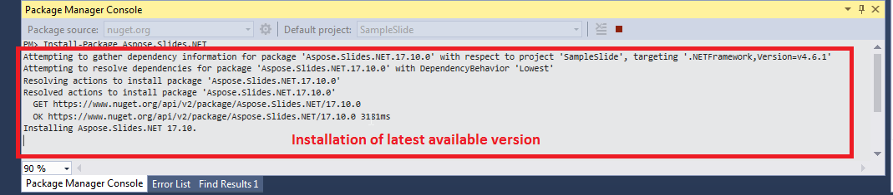

## **بررسی کلی**

این مقاله توضیح می‌دهد که چگونه Aspose.Slides برای .NET را بر روی ویندوز و macOS نصب کنید. تمرکز بر نصب مبتنی بر NuGet است و نشان می‌دهد چگونه کتابخانه را به یک پروژه Visual Studio اضافه کنید، چه از طریق NuGet Package Manager و چه از طریق Package Manager Console در ویندوز. همچنین نحوه به‌روزرسانی بسته و نصب نسخه‌های پیش‌انتشار را در صورت نیاز توصیف می‌کند.

## **Windows**
NuGet ساده‌ترین مسیر برای دانلود و نصب APIهای Aspose برای .NET بر روی رایانه‌های شخصی را فراهم می‌کند. 

### **روش 1: نصب یا به‌روزرسانی Aspose.Slides از NuGet Package Manager**

1. Microsoft Visual Studio را باز کنید.  
2. یک برنامهٔ کنسول ساده ایجاد کنید یا پروژهٔ موجودی را باز کنید.  
3. از **Tools** > **NuGet package manager** عبور کنید.  
4. در **Browse**، *Aspose Slides* را در فیلد متن جستجو کنید.  
{}
5. **Aspose.Slides.NET** را کلیک کنید و سپس **Install** را بزنید.  
   * اگر می‌خواهید Aspose.Slides را به‌روزرسانی کنید—به‌شرط آن‌که پیش‌تر نصب کرده باشید—به‌جای آن **Update** را کلیک کنید.  

API انتخاب‌شده دانلود و در پروژهٔ شما ارجاع داده می‌شود.

### **روش 2: نصب یا به‌روزرسانی Aspose.Slides از طریق Package Manager Console**

این نحوهٔ ارجاع به [Aspose.Slides API](https://www.nuget.org/packages/Aspose.Slides.NET/) از طریق Package Manager Console است:

1. Microsoft Visual Studio را باز کنید.  
2. یک برنامهٔ کنسول ساده ایجاد کنید یا پروژهٔ موجودی را باز کنید.  
3. از **Tools** > **Library Package Manager** > **Package Manager Console** عبور کنید.  

4. این فرمان را اجرا کنید: `Install-Package Aspose.Slides.NET`  

آخرین نسخه کامل در برنامهٔ شما نصب می‌شود.  

* به‌طور جایگزین می‌توانید پسوند `-prerelease` را به فرمان اضافه کنید تا آخرین نسخه (به‌همراه اصلاحات اضطراری) نیز نصب شود.

نکتهٔ **Installing Aspose.Slides.NET** در پایین پنجره ظاهر می‌شود.  

زمانی که دانلود به‌پایان رسید، پیغام‌های تأیید مشاهده خواهید کرد.  

اگر با [EULA Aspose](https://about.aspose.com/legal/eula) آشنا نیستید، ممکن است مایل باشید متن مجوز را که در URL ارجاع شده است، خوانده‑اید.  

در برنامهٔ شما باید ببینید که Aspose.Slides با موفقیت اضافه و ارجاع داده شده است.  

در Package Manager Console می‌توانید فرمان `Update-Package Aspose.Slides.NET` را اجرا کنید تا به‌روزرسانی‌های موجود برای بستهٔ Aspose.Slides را بررسی کنید. به‌روزرسانی‌ها (در صورت وجود) به‌صورت خودکار نصب می‌شوند. همچنین می‌توانید از پسوند `-prerelease` برای به‌روزرسانی آخرین نسخه استفاده کنید.

#### **مواردی که در محیط سرور مشترک باید در نظر بگیرید**
به‌شدت توصیه می‌کنیم تمام کامپوننت‌های Aspose .NET را با تنظیمات دسترسی **Full Trust** اجرا کنید، زیرا گاهی اجزای Aspose نیاز به دسترسی به تنظیمات رجیستری و فایل‌هایی دارند که در مکان‌های خارج از دایرکتوری مجازی قرار دارند—مثلاً وقتی که اجزا باید فونت‌ها را بخوانند.  

علاوه بر این، کامپوننت‌های Aspose.NET بر پایهٔ کلاس‌های هسته‌ای .NET ساخته شده‌اند و برخی از این کلاس‌ها نیز در برخی موارد به دسترسی Full Trust برای انجام عملیات نیاز دارند.  

ارائه‌دهندگان خدمات اینترنتی (ISP) که برنامه‌های متعددی از شرکت‌های مختلف را میزبانی می‌کنند، معمولاً سطح امنیتی **Medium Trust** را اعمال می‌کنند. در .NET 2.0 این سطح امنیتی می‌تواند محدودیت‌هایی ایجاد کند که بر عملیات Aspose.Slides تأثیر می‌گذارد:

- **RegistryPermission** در دسترس نیست. به این معنی که نمی‌توانید به رجیستری دسترسی پیدا کنید؛ این دسترسی برای فهرست کردن فونت‌های نصب‌شده هنگام رندر کردن اسناد ضروری است.  
- **FileIOPermission** محدود شده است. یعنی فقط می‌توانید به فایل‌های موجود در سلسله‌مراتب دایرکتوری مجازی برنامهٔ خود دسترسی داشته باشید. این همچنین ممکن است مانع خواندن فونت‌ها در زمان عملیات خروجی شود.  

به دلایل فوق، به‌شدت توصیه می‌کنیم Aspose.Slides را با دسترسی **Full Trust** اجرا کنید. اگر از **Medium trust** استفاده کنید، ممکن است ناسازگاری‌هایی رخ دهد—به‌عنوان مثال برخی ویژگی‌های کتابخانه (مانند رندر) ممکن است هنگام انجام برخی کارها کار نکند.  

## **macOS**

NuGet ساده‌ترین مسیر برای دانلود و نصب Aspose.Slides برای .NET بر روی مک‌ها را فراهم می‌کند.  

**نصب پیش‌نیاز**

فضای نام `System.Drawing` در macOS به‌صورت متفاوتی عمل می‌کند، بنابراین باید mono-libgdiplus را نصب کنید.  

> در .NET 5 و نسخه‌های قبلی، بستهٔ NuGet [System.Drawing.Common](https://www.nuget.org/packages/System.Drawing.Common/) بر روی ویندوز، لینوکس و macOS کار می‌کند. با این حال، تفاوت‌های پلتفرمی وجود دارد. در لینوکس و macOS، عملکرد GDI+ توسط کتابخانهٔ [libgdiplus](https://www.mono-project.com/docs/gui/libgdiplus/) پیاده‌سازی می‌شود. این کتابخانه به‌طور پیش‌فرض در اکثر توزیعات لینوکس نصب نیست و تمام عملکردهای GDI+ در ویندوز و macOS را پشتیبانی نمی‌کند. همچنین برخی پلتفرم‌ها libgdiplus را اصلاً ندارند. برای استفاده از انواع موجود در بستهٔ System.Drawing.Common در لینوکس و macOS، باید libgdiplus را جداگانه نصب کنید. برای اطلاعات بیشتر، به [Install .NET on Linux](https://docs.microsoft.com/en-us/dotnet/core/install/linux) یا [Install .NET on macOS](https://docs.microsoft.com/en-us/dotnet/core/install/macos#libgdiplus) مراجعه کنید.  

برای نصب mono-libgdiplus به‌صورت جداگانه بر روی مک خود، مقالهٔ [این](https://docs.microsoft.com/en-us/dotnet/core/install/macos#libgdiplus) از مستندات .NET را ببینید.  

### **نصب Aspose.Slides**

1. Visual Studio را باز کنید.  
2. یک برنامهٔ کنسول ساده ایجاد کنید یا پروژهٔ موجودی را باز کنید.  
3. از **Project** > **Manage NuGet Packages...** عبور کنید.  
   
4. *Aspose.Slides* را در فیلد متن تایپ کنید.  
5. **Aspose.Slides for .NET** را کلیک کنید و سپس **Add Package** را بزنید.  
6. یک قطعه کد ساده اضافه کنید.  
   * می‌توانید کد را از [این صفحه](/slides/fa/net/create-presentation/) کپی کنید.  
7. برنامه را اجرا کنید.  
8. پوشهٔ *folder/bin/Debug/presentation_file_name* پروژهٔ خود را باز کنید.  

## **FAQ**

**آیا نسخهٔ رایگان یا محدودیت آزمایشی وجود دارد؟**

بله، به‌صورت پیش‌فرض Aspose.Slides در حالت ارزیابی اجرا می‌شود که واترمارک اضافه کرده و ممکن است محدودیت‌های دیگری داشته باشد. برای حذف این محدودیت‌ها، باید یک [مجوز](/slides/fa/net/licensing/) معتبر اعمال کنید.