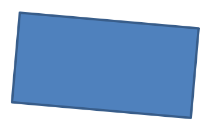

## **مقدمه**

در پاورپوینت می‌توانید اشکال را به اسلایدها اضافه کنید. از آنجا که اشکال از خطوط تشکیل شده‌اند، می‌توانید آنها را با تغییر یا اعمال اثرات روی خطوط قاب‌ آن‌ها قالب‌بندی کنید. همچنین می‌توانید با مشخص کردن تنظیماتی که پر کردن داخلی را کنترل می‌کند، اشکال را قالب‌بندی کنید.


Aspose.Slides for Node.js via Java کلاس‌ها و متدهایی ارائه می‌دهد که به شما اجازه می‌دهد اشکال را با همان گزینه‌های موجود در پاورپوینت قالب‌بندی کنید.

## **قالب‌بندی خطوط**

با استفاده از Aspose.Slides می‌توانید سبک خط سفارشی برای یک شکل تعیین کنید. مراحل زیر روند را توضیح می‌دهند:

1. یک نمونه از کلاس [Presentation](https://reference.aspose.com/slides/fa/nodejs-java/aspose.slides/presentation/) ایجاد کنید.
1. مرجع یک اسلاید را بر حسب ایندکس آن دریافت کنید.
1. یک [AutoShape](https://reference.aspose.com/slides/fa/nodejs-java/aspose.slides/autoshape/) به اسلاید اضافه کنید.
1. [line style](https://reference.aspose.com/slides/fa/nodejs-java/aspose.slides/linestyle/) شکل را تنظیم کنید.
1. عرض خط را تنظیم کنید.
1. [dash style](https://reference.aspose.com/slides/fa/nodejs-java/aspose.slides/linedashstyle/) خط را تنظیم کنید.
1. رنگ خط برای شکل را تنظیم کنید.
1. ارائهٔ تغییر یافته را به‌عنوان فایل PPTX ذخیره کنید.

کد زیر نشان می‌دهد چگونه یک `AutoShape` مستطیل را قالب‌بندی کنید:

```js
// یک شی از کلاس Presentation که نمایانگر یک فایل ارائه است را نمونه‌سازی کنید.
let presentation = new aspose.slides.Presentation();
try {
    // دریافت اولین اسلاید.
    let slide = presentation.getSlides().get_Item(0);

    // یک شکل خودکار از نوع Rectangle اضافه کنید.
    let shape = slide.getShapes().addAutoShape(aspose.slides.ShapeType.Rectangle, 50, 150, 150, 75);

    // رنگ پرکردن برای شکل مستطیل تنظیم کنید.
    shape.getFillFormat().setFillType(java.newByte(aspose.slides.FillType.NoFill));

    // قالب‌بندی را بر خطوط مستطیل اعمال کنید.
    shape.getLineFormat().setStyle(java.newByte(aspose.slides.LineStyle.ThickThin));
    shape.getLineFormat().setWidth(7);
    shape.getLineFormat().setDashStyle(java.newByte(aspose.slides.LineDashStyle.Dash));

    // رنگ خط مستطیل را تنظیم کنید.
    shape.getLineFormat().getFillFormat().setFillType(java.newByte(aspose.slides.FillType.Solid));
    shape.getLineFormat().getFillFormat().getSolidFillColor().setColor(java.getStaticFieldValue("java.awt.Color", "BLUE"));

    // فایل PPTX را روی دیسک ذخیره کنید.
    presentation.save("formatted_lines.pptx", aspose.slides.SaveFormat.Pptx);
} finally {
    presentation.dispose();
}
```

نتیجه:


## **اعمال اثر اسکچ به خطوط شکل**

یک اثر اسکچ، خط شکل را شبیه به دست‌نویس می‌کند. از [Shape.getLineFormat](https://reference.aspose.com/slides/fa/nodejs-java/aspose.slides/shape/) برای دسترسی به تنظیمات خط، [LineFormat.getSketchFormat](https://reference.aspose.com/slides/fa/nodejs-java/aspose.slides/lineformat/) برای دسترسی به تنظیمات اسکچ و [SketchFormat.setSketchType](https://reference.aspose.com/slides/fa/nodejs-java/aspose.slides/sketchformat/) برای انتخاب مقداری از شمارش [LineSketchType](https://reference.aspose.com/slides/fa/nodejs-java/aspose.slides/linesketchtype/) استفاده کنید.

کد JavaScript زیر نشان می‌دهد چگونه اثر [LineSketchType.Curved](https://reference.aspose.com/slides/fa/nodejs-java/aspose.slides/linesketchtype/) را اعمال، مقدار اختصاص داده‌شده را بخوانید و اثر را با [LineSketchType.None](https://reference.aspose.com/slides/fa/nodejs-java/aspose.slides/linesketchtype/) حذف کنید:

```js
let presentation = new aspose.slides.Presentation();
try {
    let slide = presentation.getSlides().get_Item(0);
    let shape = slide.getShapes().addAutoShape(aspose.slides.ShapeType.Rectangle, 50, 50, 200, 100);

    // دسترسی به قالب‌بندی خط شکل و قالب‌بندی اسکچ آن.
    let sketchFormat = shape.getLineFormat().getSketchFormat();

    // اعمال یک اثر اسکچ.
    sketchFormat.setSketchType(aspose.slides.LineSketchType.Curved);

    // خواندن اثر اسکچ اختصاص داده شده مستقیم به شکل.
    let explicitSketchType = sketchFormat.getSketchType();
    console.log("Explicit sketch type: " + explicitSketchType);

    // حذف اثر اسکچ.
    sketchFormat.setSketchType(aspose.slides.LineSketchType.None);
} finally {
    presentation.dispose();
}
```

مقداری که توسط [SketchFormat.getSketchType](https://reference.aspose.com/slides/fa/nodejs-java/aspose.slides/sketchformat/) برگردانده می‌شود، تنظیمی است که مستقیماً به شکل اختصاص یافته است. اگر قالب‌بندی خط می‌تواند از تم، اسلاید مادر یا اسلاید چیدمان به ارث برسد، از [LineFormat.getEffective](https://reference.aspose.com/slides/fa/nodejs-java/aspose.slides/lineformat/) استفاده کنید، `getSketchFormat` را روی شیء بازگشتی فراخوانی کنید و سپس متد `getSketchType` آن را صدا بزنید. مقدار مؤثر، قالب‌بندی‌ای را نشان می‌دهد که پس از حل ارث‌بری واقعی اعمال شده است:

```js
let presentation = new aspose.slides.Presentation("presentation.pptx");
try {
    let shape = presentation.getSlides().get_Item(0).getShapes().get_Item(0);
    let lineFormat = shape.getLineFormat();

    let explicitSketchType = lineFormat.getSketchFormat().getSketchType();
    let effectiveLineFormat = lineFormat.getEffective();
    let effectiveSketchType = effectiveLineFormat.getSketchFormat().getSketchType();

    console.log("Explicit sketch type: " + explicitSketchType);
    console.log("Effective sketch type: " + effectiveSketchType);
} finally {
    presentation.dispose();
}
```

## **قالب‌بندی سبک‌های Join**

سه گزینهٔ نوع Join وجود دارد:

* Round
* Miter
* Bevel

به طور پیش‌فرض وقتی پاورپوینت دو خط را در زاویه‌ای (مانند گوشهٔ یک شکل) به هم متصل می‌کند، از تنظیم **Round** استفاده می‌کند. اما اگر شکلی با زوایای تیز رسم می‌کنید، ممکن است گزینهٔ **Miter** را ترجیح دهید.


کد JavaScript زیر نشان می‌دهد چگونه سه مستطیل (مانند تصویر بالا) با تنظیمات Join نوع‌های Miter، Bevel و Round ساخته شدند:

```js
    // یک شی از کلاس Presentation که نمایانگر یک فایل ارائه است را نمونه‌سازی کنید.
    let presentation = new aspose.slides.Presentation();
    try {
        // دریافت اولین اسلاید.
        let slide = presentation.getSlides().get_Item(0);

        // افزودن سه شکل خودکار از نوع Rectangle.
        let shape1 = slide.getShapes().addAutoShape(aspose.slides.ShapeType.Rectangle, 20, 20, 150, 75);
        let shape2 = slide.getShapes().addAutoShape(aspose.slides.ShapeType.Rectangle, 210, 20, 150, 75);
        let shape3 = slide.getShapes().addAutoShape(aspose.slides.ShapeType.Rectangle, 20, 135, 150, 75);

        // تنظیم رنگ پرکردن برای هر شکل مستطیل.
        shape1.getFillFormat().setFillType(java.newByte(aspose.slides.FillType.Solid));
        shape1.getFillFormat().getSolidFillColor().setColor(java.getStaticFieldValue("java.awt.Color", "BLACK"));
        shape2.getFillFormat().setFillType(java.newByte(aspose.slides.FillType.Solid));
        shape2.getFillFormat().getSolidFillColor().setColor(java.getStaticFieldValue("java.awt.Color", "BLACK"));
        shape3.getFillFormat().setFillType(java.newByte(aspose.slides.FillType.Solid));
        shape3.getFillFormat().getSolidFillColor().setColor(java.getStaticFieldValue("java.awt.Color", "BLACK"));

        // تنظیم عرض خط.
        shape1.getLineFormat().setWidth(15);
        shape2.getLineFormat().setWidth(15);
        shape3.getLineFormat().setWidth(15);

        // تنظیم رنگ خط برای هر مستطیل.
        shape1.getLineFormat().getFillFormat().setFillType(java.newByte(aspose.slides.FillType.Solid));
        shape1.getLineFormat().getFillFormat().getSolidFillColor().setColor(java.getStaticFieldValue("java.awt.Color", "BLUE"));
        shape2.getLineFormat().getFillFormat().setFillType(java.newByte(aspose.slides.FillType.Solid));
        shape2.getLineFormat().getFillFormat().getSolidFillColor().setColor(java.getStaticFieldValue("java.awt.Color", "BLUE"));
        shape3.getLineFormat().getFillFormat().setFillType(java.newByte(aspose.slides.FillType.Solid));
        shape3.getLineFormat().getFillFormat().getSolidFillColor().setColor(java.getStaticFieldValue("java.awt.Color", "BLUE"));

        // تنظیم سبک اتصال.
        shape1.getLineFormat().setJoinStyle(java.newByte(aspose.slides.LineJoinStyle.Miter));
        shape2.getLineFormat().setJoinStyle(java.newByte(aspose.slides.LineJoinStyle.Bevel));
        shape3.getLineFormat().setJoinStyle(java.newByte(aspose.slides.LineJoinStyle.Round));

        // افزودن متن به هر مستطیل.
        shape1.getTextFrame().setText("Miter Join Style");
        shape2.getTextFrame().setText("Bevel Join Style");
        shape3.getTextFrame().setText("Round Join Style");

        // ذخیره فایل PPTX روی دیسک.
        presentation.save("join_styles.pptx", aspose.slides.SaveFormat.Pptx);
    } finally {
        presentation.dispose();
    }
```

## **پرکردن گرادیان**

در پاورپوینت، پرکردن گرادیان گزینهٔ قالب‌بندی است که به شما اجازه می‌دهد ترکیبی پیوسته از رنگ‌ها را بر روی یک شکل اعمال کنید. به‌عنوان مثال می‌توانید دو یا چند رنگ را طوری اعمال کنید که یکی به‑تدریج به دیگری محو شود.

نحوهٔ اعمال پرکردن گرادیان به یک شکل با Aspose.Slides:

1. یک نمونه از کلاس [Presentation](https://reference.aspose.com/slides/fa/nodejs-java/aspose.slides/presentation/) ایجاد کنید.
1. مرجع یک اسلاید را بر حسب ایندکس آن دریافت کنید.
1. یک [AutoShape](https://reference.aspose.com/slides/fa/nodejs-java/aspose.slides/autoshape/) به اسلاید اضافه کنید.
1. [FillType](https://reference.aspose.com/slides/fa/nodejs-java/aspose.slides/filltype/) شکل را به `Gradient` تنظیم کنید.
1. دو رنگ مورد نظر خود را با موقعیت‌های تعریف‌شده با استفاده از متدهای `add` مجموعهٔ توقف گرادیان که توسط کلاس [GradientFormat](https://reference.aspose.com/slides/fa/nodejs-java/aspose.slides/gradientformat/) نمایش داده می‌شود، اضافه کنید.
1. ارائهٔ تغییر یافته را به‌عنوان فایل PPTX ذخیره کنید.

کد JavaScript زیر نشان می‌دهد چگونه یک افکت پرکردن گرادیان بر یک بیضی اعمال می‌شود:

```js
// یک شی از کلاس Presentation که نمایانگر یک فایل ارائه است را نمونه‌سازی کنید.
let presentation = new aspose.slides.Presentation();
try {
    // دریافت اولین اسلاید.
    let slide = presentation.getSlides().get_Item(0);

    // یک شکل خودکار از نوع Ellipse اضافه کنید.
    let shape = slide.getShapes().addAutoShape(aspose.slides.ShapeType.Ellipse, 50, 50, 150, 75);

    // قالب‌بندی گرادیان را بر روی بیضی اعمال کنید.
    shape.getFillFormat().setFillType(java.newByte(aspose.slides.FillType.Gradient));
    shape.getFillFormat().getGradientFormat().setGradientShape(java.newByte(aspose.slides.GradientShape.Linear));

    // جهت گرادیان را تنظیم کنید.
    shape.getFillFormat().getGradientFormat().setGradientDirection(aspose.slides.GradientDirection.FromCorner2);

    // دو نقطه توقف گرادیان اضافه کنید.
    shape.getFillFormat().getGradientFormat().getGradientStops().addPresetColor(1.0, aspose.slides.PresetColor.Purple);
    shape.getFillFormat().getGradientFormat().getGradientStops().addPresetColor(0, aspose.slides.PresetColor.Red);

    // فایل PPTX را روی دیسک ذخیره کنید.
    presentation.save("gradient_fill.pptx", aspose.slides.SaveFormat.Pptx);
} finally {
    presentation.dispose();
}
```

نتیجه:


## **پرکردن الگو**

در پاورپوینت، پرکردن الگو گزینهٔ قالب‌بندی است که به شما اجازه می‌دهد طرحی دو‌رنگ—مانند نقطه‌ها، خط‌ها، خط‌کشی‌های متقاطع یا شطرنجی—را بر روی یک شکل اعمال کنید. می‌توانید رنگ‌های سفارشی برای پیش‌زمینه و پس‌زمینهٔ الگو انتخاب کنید.

Aspose.Slides بیش از ۴۵ سبک الگوی پیش‌فرض ارائه می‌دهد که می‌توانید آن‌ها را بر روی اشکال بکار ببرید و ظاهر ارائه‌های خود را ارتقا دهید. حتی پس از انتخاب یک الگوی پیش‌فرض، می‌توانید رنگ‌های دقیق مورد نظر خود را مشخص کنید.

نحوهٔ اعمال پرکردن الگو به یک شکل با Aspose.Slides:

1. یک نمونه از کلاس [Presentation](https://reference.aspose.com/slides/fa/nodejs-java/aspose.slides/presentation/) ایجاد کنید.
1. مرجع یک اسلاید را بر حسب ایندکس آن دریافت کنید.
1. یک [AutoShape](https://reference.aspose.com/slides/fa/nodejs-java/aspose.slides/autoshape/) به اسلاید اضافه کنید.
1. [FillType](https://reference.aspose.com/slides/fa/nodejs-java/aspose.slides/filltype/) شکل را به `Pattern` تنظیم کنید.
1. یک سبک الگو از گزینه‌های پیش‌فرض انتخاب کنید.
1. [Background Color](https://reference.aspose.com/slides/fa/nodejs-java/aspose.slides/patternformat/#getBackColor--) الگو را تنظیم کنید.
1. [Foreground Color](https://reference.aspose.com/slides/fa/nodejs-java/aspose.slides/patternformat/#getForeColor--) الگو را تنظیم کنید.
1. ارائهٔ تغییر یافته را به‌عنوان فایل PPTX ذخیره کنید.

کد JavaScript زیر نشان می‌دهد چگونه یک پرکردن الگو بر یک مستطیل اعمال می‌شود:

```js
// یک شی از کلاس Presentation که نمایانگر یک فایل ارائه است را نمونه‌سازی کنید.
let presentation = new aspose.slides.Presentation();
try {
    // دریافت اولین اسلاید.
    let slide = presentation.getSlides().get_Item(0);

    // یک شکل خودکار از نوع Rectangle اضافه کنید.
    let shape = slide.getShapes().addAutoShape(aspose.slides.ShapeType.Rectangle, 50, 50, 150, 75);

    // نوع پرکردن را به Pattern تنظیم کنید.
    shape.getFillFormat().setFillType(java.newByte(aspose.slides.FillType.Pattern));

    // سبک الگو را تنظیم کنید.
    shape.getFillFormat().getPatternFormat().setPatternStyle(java.newByte(aspose.slides.PatternStyle.Trellis));

    // رنگ پس‌زمینه و پیش‌زمینهٔ الگو را تنظیم کنید.
    shape.getFillFormat().getPatternFormat().getBackColor().setColor(java.getStaticFieldValue("java.awt.Color", "LIGHT_GRAY"));
    shape.getFillFormat().getPatternFormat().getForeColor().setColor(java.getStaticFieldValue("java.awt.Color", "YELLOW"));

    // فایل PPTX را روی دیسک ذخیره کنید.
    presentation.save("pattern_fill.pptx", aspose.slides.SaveFormat.Pptx);
} finally {
    presentation.dispose();
}
```

نتیجه:


## **پرکردن تصویر**

در پاورپوینت، پرکردن تصویر گزینهٔ قالب‌بندی است که به شما اجازه می‌دهد تصویری را داخل یک شکل قرار دهید—در واقع می‌توانید تصویر را به‌عنوان پس‌زمینهٔ شکل استفاده کنید.

نحوهٔ استفاده از Aspose.Slides برای اعمال پرکردن تصویر به یک شکل:

1. یک نمونه از کلاس [Presentation](https://reference.aspose.com/slides/fa/nodejs-java/aspose.slides/presentation/) ایجاد کنید.
1. مرجع یک اسلاید را بر حسب ایندکس آن دریافت کنید.
1. یک [AutoShape](https://reference.aspose.com/slides/fa/nodejs-java/aspose.slides/autoshape/) به اسلاید اضافه کنید.
1. [FillType](https://reference.aspose.com/slides/fa/nodejs-java/aspose.slides/filltype/) شکل را به `Picture` تنظیم کنید.
1. حالت پرکردن تصویر را به `Tile` (یا حالت دلخواه دیگر) تنظیم کنید.
1. یک شیء [PPImage](https://reference.aspose.com/slides/fa/nodejs-java/aspose.slides/ppimage/) از تصویری که می‌خواهید استفاده کنید، ایجاد کنید.
1. تصویر را به متد `ISlidesPicture.setImage` پاس کنید.
1. ارائهٔ تغییر یافته را به‌عنوان فایل PPTX ذخیره کنید.

بیایید فرض کنیم فایلی به نام "lotus.png" داریم که تصویر زیر را دارد:


کد JavaScript زیر نشان می‌دهد چگونه یک شکل را با تصویر پر می‌کنیم:

```js
// یک شی از کلاس Presentation که نمایانگر یک فایل ارائه است را نمونه‌سازی کنید.
let presentation = new aspose.slides.Presentation();
try {
    // دریافت اولین اسلاید.
    let slide = presentation.getSlides().get_Item(0);

    // یک شکل خودکار از نوع Rectangle اضافه کنید.
    let shape = slide.getShapes().addAutoShape(aspose.slides.ShapeType.Rectangle, 50, 50, 255, 130);
    
    // نوع پرکردن را به Picture تنظیم کنید.
    shape.getFillFormat().setFillType(java.newByte(aspose.slides.FillType.Picture));

    // حالت پرکردن تصویر را تنظیم کنید.
    shape.getFillFormat().getPictureFillFormat().setPictureFillMode(aspose.slides.PictureFillMode.Tile);

    // یک تصویر بارگذاری کنید و به منابع ارائه اضافه کنید.
    let image = aspose.slides.Images.fromFile("lotus.png");
    let picture = presentation.getImages().addImage(image);
    image.dispose();

    // تصویر را تنظیم کنید.
    shape.getFillFormat().getPictureFillFormat().getPicture().setImage(picture);

    // فایل PPTX را روی دیسک ذخیره کنید.
    presentation.save("picture_fill.pptx", aspose.slides.SaveFormat.Pptx);
} finally {
    presentation.dispose();
}
```

نتیجه:


### **Tile Picture As Texture**

اگر می‌خواهید یک تصویر کاشی‌شده را به‌عنوان بافت تنظیم کنید و رفتار کاشی‌گذاری را سفارشی کنید، می‌توانید از متدهای زیر کلاس [PictureFillFormat](https://reference.aspose.com/slides/fa/nodejs-java/aspose.slides/picturefillformat/) استفاده کنید:

- [setPictureFillMode](https://reference.aspose.com/slides/fa/nodejs-java/aspose.slides/picturefillformat/#setPictureFillMode): حالت پرکردن تصویر را تنظیم می‌کند—یا `Tile` یا `Stretch`.
- [setTileAlignment](https://reference.aspose.com/slides/fa/nodejs-java/aspose.slides/picturefillformat/#setTileAlignment): ترازبندی کاشی‌ها را داخل شکل مشخص می‌کند.
- [setTileFlip](https://reference.aspose.com/slides/fa/nodejs-java/aspose.slides/picturefillformat/#setTileFlip): تعیین می‌کند آیا کاشی به‌صورت افقی، عمودی یا هر دو وارونه شود.
- [setTileOffsetX](https://reference.aspose.com/slides/fa/nodejs-java/aspose.slides/picturefillformat/#setTileOffsetX): افست افقی کاشی (بر حسب پوینت) را از نقطهٔ شروع شکل تعیین می‌کند.
- [setTileOffsetY](https://reference.aspose.com/slides/fa/nodejs-java/aspose.slides/picturefillformat/#setTileOffsetY): افست عمودی کاشی (بر حسب پوینت) را از نقطهٔ شروع شکل تعیین می‌کند.
- [setTileScaleX](https://reference.aspose.com/slides/fa/nodejs-java/aspose.slides/picturefillformat/#setTileScaleX): مقیاس افقی کاشی را به درصد تعریف می‌کند.
- [setTileScaleY](https://reference.aspose.com/slides/fa/nodejs-java/aspose.slides/picturefillformat/#setTileScaleY): مقیاس عمودی کاشی را به درصد تعریف می‌کند.

نمونه کد زیر نشان می‌دهد چگونه یک شکل مستطیلی با پرکردن تصویر کاشی‌شده اضافه کنید و گزینه‌های کاشی را پیکربندی کنید:

```js
// یک شی از کلاس Presentation که نمایانگر یک فایل ارائه است را نمونه‌سازی کنید.
let presentation = new aspose.slides.Presentation();
try {
    // دریافت اولین اسلاید.
    let firstSlide = presentation.getSlides().get_Item(0);

    // یک شکل خودکار مستطیل اضافه کنید.
    let shape = firstSlide.getShapes().addAutoShape(aspose.slides.ShapeType.Rectangle, 50, 50, 190, 95);

    // نوع پرکردن شکل را به Picture تنظیم کنید.
    shape.getFillFormat().setFillType(java.newByte(aspose.slides.FillType.Picture));

    // تصویر را بارگذاری کنید و به منابع ارائه اضافه کنید.
    let sourceImage = aspose.slides.Images.fromFile("lotus.png");
    let presentationImage = presentation.getImages().addImage(sourceImage);
    sourceImage.dispose();

    // تصویر را به شکل اختصاص دهید.
    let pictureFillFormat = shape.getFillFormat().getPictureFillFormat();
    pictureFillFormat.getPicture().setImage(presentationImage);

    // حالت پرکردن تصویر و ویژگی‌های کاشی‌گذاری را پیکربندی کنید.
    pictureFillFormat.setPictureFillMode(aspose.slides.PictureFillMode.Tile);
    pictureFillFormat.setTileOffsetX(-32);
    pictureFillFormat.setTileOffsetY(-32);
    pictureFillFormat.setTileScaleX(50);
    pictureFillFormat.setTileScaleY(50);
    pictureFillFormat.setTileAlignment(java.newByte(aspose.slides.RectangleAlignment.BottomRight));
    pictureFillFormat.setTileFlip(aspose.slides.TileFlip.FlipBoth);

    // فایل PPTX را روی دیسک ذخیره کنید.
    presentation.save("tile.pptx", aspose.slides.SaveFormat.Pptx);
} finally {
    presentation.dispose();
}
```

نتیجه:


## **پرکردن رنگ ثابت**

در پاورپوینت، پرکردن رنگ ثابت گزینهٔ قالب‌بندی است که یک شکل را با یک رنگ یکنواخت پر می‌کند. این رنگ پس‌زمینه ساده بدون هیچ گرادیان، بافت یا الگوئی اعمال می‌شود.

برای اعمال پرکردن رنگ ثابت به یک شکل با Aspose.Slides، این مراحل را دنبال کنید:

1. یک نمونه از کلاس [Presentation](https://reference.aspose.com/slides/fa/nodejs-java/aspose.slides/presentation/) ایجاد کنید.
1. مرجع یک اسلاید را بر حسب ایندکس آن دریافت کنید.
1. یک [AutoShape](https://reference.aspose.com/slides/fa/nodejs-java/aspose.slides/autoshape/) به اسلاید اضافه کنید.
1. [FillType](https://reference.aspose.com/slides/fa/nodejs-java/aspose.slides/filltype/) شکل را به `Solid` تنظیم کنید.
1. رنگ پرکردن دلخواه خود را به شکل اختصاص دهید.
1. ارائهٔ تغییر یافته را به‌عنوان فایل PPTX ذخیره کنید.

کد JavaScript زیر نشان می‌دهد چگونه یک پرکردن رنگ ثابت روی یک مستطیل در اسلاید پاورپوینت اعمال می‌شود:

```js
// یک شی از کلاس Presentation که نمایانگر یک فایل ارائه است را نمونه‌سازی کنید.
let presentation = new aspose.slides.Presentation();
try {
    // دریافت اولین اسلاید.
    let slide = presentation.getSlides().get_Item(0);

    // یک شکل خودکار از نوع Rectangle اضافه کنید.
    let shape = slide.getShapes().addAutoShape(aspose.slides.ShapeType.Rectangle, 50, 50, 150, 75);

    // نوع پرکردن را به Solid تنظیم کنید.
    shape.getFillFormat().setFillType(java.newByte(aspose.slides.FillType.Solid));

    // رنگ پرکردن را تنظیم کنید.
    shape.getFillFormat().getSolidFillColor().setColor(java.getStaticFieldValue("java.awt.Color", "YELLOW"));

    // فایل PPTX را روی دیسک ذخیره کنید.
    presentation.save("solid_color_fill.pptx", aspose.slides.SaveFormat.Pptx);
} finally {
    presentation.dispose();
}
```

نتیجه:


## **تنظیم شفافیت**

در پاورپوینت، هنگام اعمال پرکردن رنگ ثابت، گرادیان، تصویر یا بافت به اشکال، می‌توانید سطح شفافیت را تنظیم کنید تا میزان تاری پرکردن کنترل شود. مقدار شفافیت بالاتر، شکل را شفاف‌تر می‌کند و پس‌زمینه یا اشیای زیرین را تا حدی قابل مشاهده می‌سازد.

Aspose.Slides به شما اجازه می‌دهد با تنظیم مقدار آلفا در رنگ مورد استفاده برای پرکردن، سطح شفافیت را تعیین کنید. روش زیر را دنبال کنید:

1. یک نمونه از کلاس [Presentation](https://reference.aspose.com/slides/fa/nodejs-java/aspose.slides/presentation/) ایجاد کنید.
1. مرجع یک اسلاید را بر حسب ایندکس آن دریافت کنید.
1. یک [AutoShape](https://reference.aspose.com/slides/fa/nodejs-java/aspose.slides/autoshape/) به اسلاید اضافه کنید.
1. [FillType](https://reference.aspose.com/slides/fa/nodejs-java/aspose.slides/filltype/) را به `Solid` تنظیم کنید.
1. از `Color` برای تعریف رنگی با شفافیت (مولفهٔ `alpha` شفافیت را کنترل می‌کند) استفاده کنید.
1. ارائه را ذخیره کنید.

کد JavaScript زیر نشان می‌دهد چگونه یک رنگ پرکردن شفاف بر یک مستطیل اعمال می‌شود:

```js
// یک شی از کلاس Presentation که نمایانگر یک فایل ارائه است را نمونه‌سازی کنید.
let presentation = new aspose.slides.Presentation();
try {
    // دریافت اولین اسلاید.
    let slide = presentation.getSlides().get_Item(0);

    // یک شکل خودکار مستطیل صلب اضافه کنید.
    let solidShape = slide.getShapes().addAutoShape(aspose.slides.ShapeType.Rectangle, 50, 50, 150, 75);

    // یک شکل خودکار مستطیل شفاف بر روی شکل صلب اضافه کنید.
    let transparentShape = slide.getShapes().addAutoShape(aspose.slides.ShapeType.Rectangle, 80, 80, 150, 75);
    transparentShape.getFillFormat().setFillType(java.newByte(aspose.slides.FillType.Solid));
    transparentShape.getFillFormat().getSolidFillColor().setColor(java.newInstanceSync("java.awt.Color", 255, 255, 0, 204));

    // فایل PPTX را روی دیسک ذخیره کنید.
    presentation.save("shape_transparency.pptx", aspose.slides.SaveFormat.Pptx);
} finally {
    presentation.dispose();
}
```

نتیجه:


## **چرخش اشکال**

Aspose.Slides به شما امکان می‌دهد اشکال را در ارائه‌های پاورپوینت بچرخانید. این می‌تواند هنگام موقعیت‌یابی عناصر بصری با نیازهای خاص چینش یا طراحی مفید باشد.

برای چرخاندن یک شکل در یک اسلاید، این مراحل را انجام دهید:

1. یک نمونه از کلاس [Presentation](https://reference.aspose.com/slides/fa/nodejs-java/aspose.slides/presentation/) ایجاد کنید.
1. مرجع یک اسلاید را بر حسب ایندکس آن دریافت کنید.
1. یک [AutoShape](https://reference.aspose.com/slides/fa/nodejs-java/aspose.slides/autoshape/) به اسلاید اضافه کنید.
1. ویژگی چرخش شکل را به زاویهٔ دلخواه تنظیم کنید.
1. ارائه را ذخیره کنید.

کد JavaScript زیر نشان می‌دهد چگونه یک شکل را به‌صورت 5 درجه چرخانید:

```js
// یک شی از کلاس Presentation که نمایانگر یک فایل ارائه است را نمونه‌سازی کنید.
let presentation = new aspose.slides.Presentation();
try {
    // دریافت اولین اسلاید.
    let slide = presentation.getSlides().get_Item(0);

    // یک شکل خودکار از نوع Rectangle اضافه کنید.
    let shape = slide.getShapes().addAutoShape(aspose.slides.ShapeType.Rectangle, 50, 50, 150, 75);

    // شکل را به اندازه 5 درجه بچرخانید.
    shape.setRotation(5);

    // فایل PPTX را روی دیسک ذخیره کنید.
    presentation.save("shape_rotation.pptx", aspose.slides.SaveFormat.Pptx);
} finally {
    presentation.dispose();
}
```

نتیجه:



## **افزودن اثرات برش ۳بعدی**

Aspose.Slides به شما امکان می‌دهد اثرات برش ۳بعدی را با پیکربندی ویژگی‌های [ThreeDFormat](https://reference.aspose.com/slides/fa/nodejs-java/aspose.slides/threedformat/) به اشکال اعمال کنید.

برای افزودن اثرات برش ۳بعدی به یک شکل، این مراحل را دنبال کنید:

1. نمونهٔ کلاس [Presentation](https://reference.aspose.com/slides/fa/nodejs-java/aspose.slides/presentation/) را ایجاد کنید.
1. مرجع یک اسلاید را بر حسب ایندکس آن دریافت کنید.
1. یک [AutoShape](https://reference.aspose.com/slides/fa/nodejs-java/aspose.slides/autoshape/) به اسلاید اضافه کنید.
1. [ThreeDFormat](https://reference.aspose.com/slides/fa/nodejs-java/aspose.slides/threedformat/) شکل را تنظیم کنید تا تنظیمات برش را تعریف کنید.
1. ارائه را ذخیره کنید.

کد JavaScript زیر نشان می‌دهد چگونه اثرات برش ۳بعدی را به یک شکل اعمال کنید:

```js
// یک نمونه از کلاس Presentation ایجاد کنید.
let presentation = new aspose.slides.Presentation();
try {
    let slide = presentation.getSlides().get_Item(0);

    // یک شکل به اسلاید اضافه کنید.
    let shape = slide.getShapes().addAutoShape(aspose.slides.ShapeType.Ellipse, 50, 50, 100, 100);
    shape.getFillFormat().setFillType(java.newByte(aspose.slides.FillType.Solid));
    shape.getFillFormat().getSolidFillColor().setColor(java.getStaticFieldValue("java.awt.Color", "GREEN"));
    shape.getLineFormat().getFillFormat().setFillType(java.newByte(aspose.slides.FillType.Solid));
    shape.getLineFormat().getFillFormat().getSolidFillColor().setColor(java.getStaticFieldValue("java.awt.Color", "ORANGE"));
    shape.getLineFormat().setWidth(2.0);

    // ویژگی‌های ThreeDFormat شکل را تنظیم کنید.
    shape.getThreeDFormat().setDepth(4);
    shape.getThreeDFormat().getBevelTop().setBevelType(aspose.slides.BevelPresetType.Circle);
    shape.getThreeDFormat().getBevelTop().setHeight(6);
    shape.getThreeDFormat().getBevelTop().setWidth(6);
    shape.getThreeDFormat().getCamera().setCameraType(aspose.slides.CameraPresetType.OrthographicFront);
    shape.getThreeDFormat().getLightRig().setLightType(aspose.slides.LightRigPresetType.ThreePt);
    shape.getThreeDFormat().getLightRig().setDirection(aspose.slides.LightingDirection.Top);

    // ارائه را به‌عنوان فایل PPTX ذخیره کنید.
    presentation.save("3D_bevel_effect.pptx", aspose.slides.SaveFormat.Pptx);
} finally {
    presentation.dispose();
}
```

نتیجه:


## **افزودن اثرات چرخش ۳بعدی**

Aspose.Slides به شما اجازه می‌دهد اثرات چرخش ۳بعدی را با پیکربندی ویژگی‌های [ThreeDFormat](https://reference.aspose.com/slides/fa/nodejs-java/aspose.slides/threedformat/) به اشکال اعمال کنید.

برای اعمال چرخش ۳بعدی به یک شکل:

1. یک نمونه از کلاس [Presentation](https://reference.aspose.com/slides/fa/nodejs-java/aspose.slides/presentation/) ایجاد کنید.
1. مرجع یک اسلاید را بر حسب ایندکس آن دریافت کنید.
1. یک [AutoShape](https://reference.aspose.com/slides/fa/nodejs-java/aspose.slides/autoshape/) به اسلاید اضافه کنید.
1. از [setCameraType](https://reference.aspose.com/slides/fa/nodejs-java/aspose.slides/camera/#setCameraType) و [setLightType](https://reference.aspose.com/slides/fa/nodejs-java/aspose.slides/lightrig/#setLightType) برای تعریف چرخش ۳بعدی استفاده کنید.
1. ارائه را ذخیره کنید.

کد JavaScript زیر نشان می‌دهد چگونه اثرات چرخش ۳بعدی به یک شکل اعمال می‌شود:

```js
// یک نمونه از کلاس Presentation ایجاد کنید.
let presentation = new aspose.slides.Presentation();
try {
    let slide = presentation.getSlides().get_Item(0);

    let autoShape = slide.getShapes().addAutoShape(aspose.slides.ShapeType.Rectangle, 50, 50, 150, 75);
    autoShape.getTextFrame().setText("Hello, Aspose!");

    autoShape.getThreeDFormat().setDepth(6);
    autoShape.getThreeDFormat().getCamera().setRotation(40, 35, 20);
    autoShape.getThreeDFormat().getCamera().setCameraType(aspose.slides.CameraPresetType.IsometricLeftUp);
    autoShape.getThreeDFormat().getLightRig().setLightType(aspose.slides.LightRigPresetType.Balanced);

    // ارائه را به‌عنوان فایل PPTX ذخیره کنید.
    presentation.save("3D_rotation_effect.pptx", aspose.slides.SaveFormat.Pptx);
} finally {
    presentation.dispose();
}
```

نتیجه:


## **بازنشانی قالب‌بندی**

کد Java زیر نشان می‌دهد چگونه قالب‌بندی یک اسلاید را بازنشانی کنید و موقعیت، اندازه و قالب‌بندی تمام اشکالی که دارای جای‌گیرنده هستند در [LayoutSlide](https://reference.aspose.com/slides/fa/nodejs-java/aspose.slides/layoutslide/) به تنظیمات پیش‌فرض برگردانید:

```js
let presentation = new aspose.slides.Presentation("sample.pptx");
try {
    for (let i = 0; i < presentation.getSlides().size(); i++) {
        let slide = presentation.getSlides().get_Item(i);
        // بازنشانی هر شکل در اسلاید که یک جای‌گیرنده در چیدمان دارد.
        slide.reset();
    }
    presentation.save("reset_formatting.pptx", aspose.slides.SaveFormat.Pptx);
} finally {
    presentation.dispose();
}
```

## **سؤال‌پرسش‌ها**

**آیا قالب‌بندی شکل‌ها اندازهٔ نهایی فایل ارائه را تحت تأثیر قرار می‌دهد؟**

تنها به‌صورت جزئی. تصاویر و رسانه‌های جاسازی‌شده بیشتر فضای فایل را اشغال می‌کنند، در حالی که پارامترهای شکل مانند رنگ‌ها، اثرات و گرادیان‌ها به‌عنوان متادیتا ذخیره می‌شوند و تقریباً حجم اضافه‌ای ندارند.

**چگونه می‌توانم اشکالی را که در یک اسلاید قالب‌بندی یکسان دارند شناسایی کنم تا بتوانم آنها را گروه‌بندی کنم؟**

ویژگی‌های کلیدی قالب‌بندی هر شکل—پرکردن، خط و تنظیمات اثر—را مقایسه کنید. اگر تمام مقادیر منطبق باشند، سبک آنها را یکسان در نظر بگیرید و به‌صورت منطقی این اشکال را گروه‌بندی کنید؛ این کار مدیریت سبک‌ها را در مراحل بعدی ساده می‌کند.

**آیا می‌توانم مجموعه‌ای از سبک‌های سفارشی شکل را در یک فایل جداگانه ذخیره کنم تا در ارائه‌های دیگر استفاده شود؟**

بله. اشکال نمونه با سبک‌های دلخواه را در یک دک ارائهٔ الگو یا فایل قالب .POTX ذخیره کنید. هنگام ایجاد ارائهٔ جدید، قالب را باز کنید، اشکال سبک‌دار مورد نیاز را کلون کنید و قالب‌بندی آن‌ها را در هر جایی که لازم است دوباره اعمال کنید.