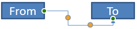

## **مقدمه**

یک اتصال‌کنندهٔ PowerPoint خطی ویژه است که دو شکل را به یکدیگر متصل یا پیوند می‌دهد و حتی وقتی اشکال جابجا یا موقعیتشان در اسلاید تغییر می‌کند، به آن‌ها متصل می‌ماند.

اتصال‌کننده‌ها معمولاً به *نقاط اتصال* (نقاط سبز) متصل می‌شوند که به‌صورت پیش‌فرض برای تمام اشکال وجود دارند. نقاط اتصال زمانی ظاهر می‌شوند که مکان‌نمای ماوس به آن‌ها نزدیک شود.

*نقاط تنظیم* (نقاط نارنجی) که فقط برای برخی از اتصال‌کننده‌ها وجود دارند، برای تغییر موقعیت و شکل اتصال‌کننده‌ها استفاده می‌شوند.

## **انواع اتصال‌کننده‌ها**

در PowerPoint می‌توانید از اتصال‌کننده‌های مستقیم، زانو‑دار (زاویه‌دار) و منحنی استفاده کنید.

Aspose.Slides این اتصال‌کننده‌ها را فراهم می‌کند:

| Connector                      | Image                                                        | Number of adjustment points |
| ------------------------------ | ------------------------------------------------------------ | --------------------------- |
| `ShapeType.Line`               |       | 0                           |
| `ShapeType.StraightConnector1` |  | 0                           |
| `ShapeType.BentConnector2`     |   | 0                           |
| `ShapeType.BentConnector3`     |     | 1                           |
| `ShapeType.BentConnector4`     |     | 2                           |
| `ShapeType.BentConnector5`     |     | 3                           |
| `ShapeType.CurvedConnector2`   |  | 0                           |
| `ShapeType.CurvedConnector3`   |  | 1                           |
| `ShapeType.CurvedConnector4`   |  | 2                           |
| `ShapeType.CurvedConnector5`   |  | 3                           |

## **اتصال اشکال با استفاده از اتصال‌کننده‌ها**

1. یک نمونه از کلاس [Presentation](https://apireference.aspose.com/slides/fa/nodejs-java/aspose.slides/Presentation) ایجاد کنید.  
2. یک اشاره‌گر به اسلاید را از طریق شاخص آن دریافت کنید.  
3. دو [AutoShape](https://reference.aspose.com/slides/fa/nodejs-java/aspose.slides/AutoShape) را با استفاده از متد `addAutoShape` که توسط شیء `Shapes` در اختیار است، به اسلاید اضافه کنید.  
4. یک اتصال‌کننده را با استفاده از متد `addConnector` که توسط شیء `Shapes` در اختیار است، با تعریف نوع اتصال‌کننده اضافه کنید.  
5. اشکال را با استفاده از اتصال‌کننده به هم متصل کنید.  
6. برای اعمال کوتاه‌ترین مسیر اتصال، متد `reroute` را فراخوانی کنید.  
7. ارائه را ذخیره کنید.  

این کد JavaScript نشان می‌دهد چگونه یک اتصال‌کننده (یک اتصال‌کنندهٔ زانو‑دار) بین دو شکل (یک بیضی و یک مستطیل) اضافه شود:

```javascript
// یک شیء از کلاس ارائه ایجاد می‌کند که فایل PPTX را نمایان می‌سازد
var pres = new aspose.slides.Presentation();
try {
    // دسترس به مجموعه شکل‌ها برای یک اسلاید خاص
    var shapes = pres.getSlides().get_Item(0).getShapes();
    // یک شکل خودکار بیضی اضافه می‌کند
    var ellipse = shapes.addAutoShape(aspose.slides.ShapeType.Ellipse, 0, 100, 100, 100);
    // یک شکل خودکار مستطیل اضافه می‌کند
    var rectangle = shapes.addAutoShape(aspose.slides.ShapeType.Rectangle, 100, 300, 100, 100);
    // یک شکل اتصال‌کننده به مجموعه شکل‌های اسلاید اضافه می‌کند
    var connector = shapes.addConnector(aspose.slides.ShapeType.BentConnector2, 0, 0, 10, 10);
    // اشکال را با استفاده از اتصال‌کننده به هم متصل می‌کند
    connector.setStartShapeConnectedTo(ellipse);
    connector.setEndShapeConnectedTo(rectangle);
    // متد reroute را فراخوانی می‌کند که مسیر کوتاه‌ترین خودکار بین اشکال را تنظیم می‌کند
    connector.reroute();
    // ارائه را ذخیره می‌کند
    pres.save("output.pptx", aspose.slides.SaveFormat.Pptx);
} finally {
    if (pres != null) {
        pres.dispose();
    }
}
```

{} 

متد `Connector.reroute` یک اتصال‌کننده را مجدداً مسیر می‌دهد و آن را مجبور می‌کند تا کوتاه‌ترین مسیر ممکن بین اشکال را بگیرد. برای رسیدن به این هدف، ممکن است نقاط `setStartShapeConnectionSiteIndex` و `setEndShapeConnectionSiteIndex` تغییر کنند. 

{} 

## **مشخص کردن نقطهٔ اتصال**

اگر می‌خواهید یک اتصال‌کننده دو شکل را با استفاده از نقاط خاصی روی اشکال به‌هم پیوند دهد، باید نقاط اتصال دلخواه خود را به‌این شکل مشخص کنید:

1. یک نمونه از کلاس [Presentation](https://reference.aspose.com/slides/fa/nodejs-java/aspose.slides/Presentation) ایجاد کنید.  
2. یک اشاره‌گر به اسلاید را از طریق شاخص آن دریافت کنید.  
3. دو [AutoShape](https://reference.aspose.com/slides/fa/nodejs-java/aspose.slides/AutoShape) را با استفاده از متد `addAutoShape` که توسط شیء `Shapes` در اختیار است، به اسلاید اضافه کنید.  
4. یک اتصال‌کننده را با استفاده از متد `addConnector` که توسط شیء `Shapes` در اختیار است، با تعریف نوع اتصال‌کننده اضافه کنید.  
5. اشکال را با استفاده از اتصال‌کننده به‌هم متصل کنید.  
6. نقاط اتصال دلخواه خود را روی اشکال تنظیم کنید.  
7. ارائه را ذخیره کنید.  

این کد JavaScript عملی را نشان می‌دهد که در آن نقطهٔ اتصال دلخواه مشخص می‌شود:

```javascript
// یک شیء از کلاس ارائه را که یک فایل PPTX را نمایان می‌کند، ایجاد می‌کند
var pres = new aspose.slides.Presentation();
try {
    // دسترس به مجموعه شکل‌ها برای یک اسلاید خاص
    var shapes = pres.getSlides().get_Item(0).getShapes();
    // افزودن یک شکل خودکار بیضی
    var ellipse = shapes.addAutoShape(aspose.slides.ShapeType.Ellipse, 0, 100, 100, 100);
    // افزودن یک شکل خودکار مستطیل
    var rectangle = shapes.addAutoShape(aspose.slides.ShapeType.Rectangle, 100, 300, 100, 100);
    // افزودن یک شکل اتصال‌کننده به مجموعه شکل‌های اسلاید
    var connector = shapes.addConnector(aspose.slides.ShapeType.BentConnector2, 0, 0, 10, 10);
    // اتصال اشکال با استفاده از اتصال‌کننده
    connector.setStartShapeConnectedTo(ellipse);
    connector.setEndShapeConnectedTo(rectangle);
    // تنظیم شاخص نقطهٔ اتصال دلخواه روی شکل بیضی
    var wantedIndex = 6;
    // بررسی اینکه آیا شاخص دلخواه کمتر از بیشینهٔ تعداد سایت‌های اتصال است
    if (ellipse.getConnectionSiteCount() > wantedIndex) {
        // تنظیم نقطهٔ اتصال دلخواه روی شکل خودکار بیضی
        connector.setStartShapeConnectionSiteIndex(wantedIndex);
    }
    // ذخیرهٔ ارائه
    pres.save("output.pptx", aspose.slides.SaveFormat.Pptx);
} finally {
    if (pres != null) {
        pres.dispose();
    }
}
```

## **تنظیم نقطهٔ اتصال‌کننده**

می‌توانید یک اتصال‌کنندهٔ موجود را از طریق نقاط تنظیم آن تنظیم کنید. فقط اتصال‌کننده‌هایی که نقاط تنظیم دارند می‌توانند به این روش تغییر یابند. جدول زیر را در **[انواع اتصال‌کننده‌ها](/slides/fa/nodejs-java/connector/#types-of-connectors)** ببینید.

### **مورد ساده**

در نظر بگیرید که یک اتصال‌کننده بین دو شکل (A و B) از طریق شکل سوم (C) عبور می‌کند:


```javascript
var pres = new aspose.slides.Presentation();
try {
    var sld = pres.getSlides().get_Item(0);
    var shape = sld.getShapes().addAutoShape(aspose.slides.ShapeType.Rectangle, 300, 150, 150, 75);
    var shapeFrom = sld.getShapes().addAutoShape(aspose.slides.ShapeType.Rectangle, 500, 400, 100, 50);
    var shapeTo = sld.getShapes().addAutoShape(aspose.slides.ShapeType.Rectangle, 100, 100, 70, 30);
    var connector = sld.getShapes().addConnector(aspose.slides.ShapeType.BentConnector5, 20, 20, 400, 300);
    connector.getLineFormat().setEndArrowheadStyle(aspose.slides.LineArrowheadStyle.Triangle);
    connector.getLineFormat().getFillFormat().setFillType(java.newByte(aspose.slides.FillType.Solid));
    connector.getLineFormat().getFillFormat().getSolidFillColor().setColor(java.getStaticFieldValue("java.awt.Color", "BLACK"));
    connector.setStartShapeConnectedTo(shapeFrom);
    connector.setEndShapeConnectedTo(shapeTo);
    connector.setStartShapeConnectionSiteIndex(2);
} finally {
    if (pres != null) {
        pres.dispose();
    }
}
```

برای دور زدن یا عبور از شکل سوم می‌توانیم اتصال‌کننده را با جابه‌جایی خط عمودی آن به سمت چپ به این شکل تنظیم کنیم:


```javascript
var adj2 = connector.getAdjustments().get_Item(1);
adj2.setRawValue(adj2.getRawValue() + 10000);
```

### **موارد پیچیده** 

برای انجام تنظیمات پیچیده‌تر، موارد زیر را در نظر بگیرید:

* نقطهٔ تنظیم‌پذیر یک اتصال‌کننده به فرمولی که موقعیت آن را محاسبه و تعیین می‌کند، به‌طور قوی وابسته است. بنابراین تغییر مکان نقطه می‌تواند شکل اتصال‌کننده را تغییر دهد.  
* نقاط تنظیم یک اتصال‌کننده در یک آرایه به‌صورت ترتیب سخت‌گیرانه‌ای تعریف می‌شوند. این نقاط از نقطهٔ شروع اتصال‌کننده تا نقطهٔ پایان شماره‌گذاری می‌شوند.  
* مقادیر نقاط تنظیم درصد عرض/ارتفاع شکل اتصال‌کننده را نشان می‌دهند.  
  * شکل توسط نقاط شروع و پایان اتصال‌کننده ضربدر 1000 محدود می‌شود.  
  * اولین نقطه، دومین نقطه و سومین نقطه به‌ترتیب درصد از عرض، درصد از ارتفاع و دوباره درصد از عرض را تعریف می‌کنند.  
* برای محاسبهٔ مختصات نقاط تنظیم یک اتصال‌کننده، باید چرخش و انعکاس آن را در نظر بگیرید. **Note** این که زاویهٔ چرخش برای تمام اتصال‌کننده‌های نشان‌داده‌شده در **[انواع اتصال‌کننده‌ها](/slides/fa/nodejs-java/connector/#types-of-connectors)** برابر با 0 است.

#### **مورد 1**

در نظر بگیرید که دو شیء قاب متن با یک اتصال‌کننده به‌هم پیوند خورده‌اند:


```javascript
// یک شیء از کلاس ارائه ایجاد می‌کند که یک فایل PPTX را نمایان می‌سازد
var pres = new aspose.slides.Presentation();
try {
    // اولین اسلاید در ارائه را دریافت می‌کند
    var sld = pres.getSlides().get_Item(0);
    // اشکالی را اضافه می‌کند که از طریق یک اتصال‌کننده به‌هم وصل می‌شوند
    var shapeFrom = sld.getShapes().addAutoShape(aspose.slides.ShapeType.Rectangle, 100, 100, 60, 25);
    shapeFrom.getTextFrame().setText("From");
    var shapeTo = sld.getShapes().addAutoShape(aspose.slides.ShapeType.Rectangle, 500, 100, 60, 25);
    shapeTo.getTextFrame().setText("To");
    // یک اتصال‌کننده اضافه می‌کند
    var connector = sld.getShapes().addConnector(aspose.slides.ShapeType.BentConnector4, 20, 20, 400, 300);
    // جهت اتصال‌کننده را مشخص می‌کند
    connector.getLineFormat().setEndArrowheadStyle(aspose.slides.LineArrowheadStyle.Triangle);
    // رنگ اتصال‌کننده را مشخص می‌کند
    connector.getLineFormat().getFillFormat().setFillType(java.newByte(aspose.slides.FillType.Solid));
    connector.getLineFormat().getFillFormat().getSolidFillColor().setColor(java.getStaticFieldValue("java.awt.Color", "RED"));
    // ضخامت خط اتصال‌کننده را مشخص می‌کند
    connector.getLineFormat().setWidth(3);
    // اشکال را با استفاده از اتصال‌کننده به‌هم پیوند می‌دهد
    connector.setStartShapeConnectedTo(shapeFrom);
    connector.setStartShapeConnectionSiteIndex(3);
    connector.setEndShapeConnectedTo(shapeTo);
    connector.setEndShapeConnectionSiteIndex(2);
    // نقاط تنظیم اتصال‌کننده را دریافت می‌کند
    var adjValue_0 = connector.getAdjustments().get_Item(0);
    var adjValue_1 = connector.getAdjustments().get_Item(1);
} finally {
    if (pres != null) {
        pres.dispose();
    }
}
```

**تنظیم**

می‌توانیم مقادیر نقاط تنظیم اتصال‌کننده را با افزایش 20٪ عرض و 200٪ ارتفاع مربوطه تغییر دهیم:

```javascript
// Changes the values of the adjustment points
adjValue_0.setRawValue(adjValue_0.getRawValue() + 20000);
adjValue_1.setRawValue(adjValue_1.getRawValue() + 200000);
```

نتیجه:


برای تعریف مدلی که بتواند مختصات و شکل بخش‌های مختلف اتصال‌کننده را تعیین کند، یک شکل ایجاد می‌کنیم که با مؤلفهٔ افقی اتصال‌کننده در نقطهٔ `connector.getAdjustments().get_Item(0)` مطابقت داشته باشد:

```javascript
// رسم مؤلفه عمودی اتصال‌کننده
var x = connector.getX() + ((connector.getWidth() * adjValue_0.getRawValue()) / 100000);
var y = connector.getY();
var height = (connector.getHeight() * adjValue_1.getRawValue()) / 100000;
sld.getShapes().addAutoShape(aspose.slides.ShapeType.Rectangle, x, y, 0, height);
```

نتیجه:


#### **مورد 2**

در **مورد 1** یک عملیات ساده تنظیم اتصال‌کننده با استفاده از اصول پایه نشان دادیم. در شرایط عادی باید چرخش اتصال‌کننده و نمایش آن (که توسط `connector.getRotation()`, `connector.getFrame().getFlipH()`, و `connector.getFrame().getFlipV()` تنظیم می‌شوند) را در نظر بگیرید. اکنون این فرآیند را نشان می‌دهیم.

ابتدا یک شیء قاب متن جدید (**To 1**) به اسلاید اضافه می‌کنیم (برای اتصال) و یک اتصال‌کننده (سبز) جدید می‌سازیم که آن را به اشیائی که قبلاً ایجاد کرده‌ایم وصل می‌کند.

```javascript
// یک شیء بایندینگ جدید ایجاد می‌کند
var shapeTo_1 = sld.getShapes().addAutoShape(aspose.slides.ShapeType.Rectangle, 100, 400, 60, 25);
shapeTo_1.getTextFrame().setText("To 1");
// یک اتصال‌کننده جدید ایجاد می‌کند
connector = sld.getShapes().addConnector(aspose.slides.ShapeType.BentConnector4, 20, 20, 400, 300);
connector.getLineFormat().setEndArrowheadStyle(aspose.slides.LineArrowheadStyle.Triangle);
connector.getLineFormat().getFillFormat().setFillType(java.newByte(aspose.slides.FillType.Solid));
connector.getLineFormat().getFillFormat().getSolidFillColor().setColor(java.getStaticFieldValue("java.awt.Color", "CYAN"));
connector.getLineFormat().setWidth(3);
// اشیاء را با استفاده از اتصال‌کنندهٔ تازه ایجاد شده به‌هم وصل می‌کند
connector.setStartShapeConnectedTo(shapeFrom);
connector.setStartShapeConnectionSiteIndex(2);
connector.setEndShapeConnectedTo(shapeTo_1);
connector.setEndShapeConnectionSiteIndex(3);
// نقاط تنظیم اتصال‌کننده را دریافت می‌کند
adjValue_0 = connector.getAdjustments().get_Item(0);
adjValue_1 = connector.getAdjustments().get_Item(1);
// مقادیر نقاط تنظیم را تغییر می‌دهد
adjValue_0.setRawValue(adjValue_0.getRawValue() + 20000);
adjValue_1.setRawValue(adjValue_1.getRawValue() + 200000);
```

نتیجه:


سپس یک شکل ایجاد می‌کنیم که با مؤلفهٔ افقی اتصال‌کننده‌ای که از نقطهٔ تنظیم جدید `connector.getAdjustments().get_Item(0)` عبور می‌کند، مطابقت داشته باشد. مقادیر `connector.getRotation()`, `connector.getFrame().getFlipH()`, و `connector.getFrame().getFlipV()` را به‌کار می‌بریم و فرمول تبدیل مختصات برای چرخش حول یک نقطهٔ داده‌شدهٔ x0 را اعمال می‌کنیم:

X = (x — x0) * cos(alpha) — (y — y0) * sin(alpha) + x0;

Y = (x — x0) * sin(alpha) + (y — y0) * cos(alpha) + y0;

در مورد ما زاویهٔ چرخش شیء 90 درجه است و اتصال‌کننده به‌صورت عمودی نمایش داده می‌شود، بنابراین کد مربوطه به‌این شکل است:

```javascript
// ذخیره مختصات اتصال‌کننده
x = connector.getX();
y = connector.getY();
// اصلاح مختصات اتصال‌کننده در صورتی که ظاهر شود
if (connector.getFrame().getFlipH() == aspose.slides.NullableBool.True) {
    x += connector.getWidth();
}
if (connector.getFrame().getFlipV() == aspose.slides.NullableBool.True) {
    y += connector.getHeight();
}
// استفاده از مقدار نقطه تنظیم به‌عنوان مختصات
x += (connector.getWidth() * adjValue_0.getRawValue()) / 100000;
// تبدیل مختصات چون Sin(90) = 1 و Cos(90) = 0
var xx = (connector.getFrame().getCenterX() - y) + connector.getFrame().getCenterY();
var yy = (x - connector.getFrame().getCenterX()) + connector.getFrame().getCenterY();
// تعیین عرض مؤلفه افقی با استفاده از مقدار نقطه تنظیم دوم
var width = (connector.getHeight() * adjValue_1.getRawValue()) / 100000;
var shape = sld.getShapes().addAutoShape(aspose.slides.ShapeType.Rectangle, xx, yy, width, 0);
shape.getLineFormat().getFillFormat().setFillType(java.newByte(aspose.slides.FillType.Solid));
shape.getLineFormat().getFillFormat().getSolidFillColor().setColor(java.getStaticFieldValue("java.awt.Color", "RED"));
```

نتیجه:


ما محاسبات مربوط به تنظیمات ساده و نقاط تنظیم پیچیده (نقاط تنظیم با زوایای چرخش) را نشان دادیم. با استفاده از این دانش می‌توانید مدل خود را توسعه دهید (یا کدی بنویسید) تا یک شیء `GraphicsPath` دریافت کنید یا حتی مقادیر نقاط تنظیم اتصال‌کننده را بر اساس مختصات خاص اسلاید تنظیم کنید.

## **محاسبهٔ زاویهٔ خطوط اتصال‌کننده**

1. یک نمونه از کلاس ایجاد کنید.  
2. یک اشاره‌گر به اسلاید را از طریق شاخص آن دریافت کنید.  
3. به شکل خطی اتصال‌کننده دسترسی پیدا کنید.  
4. با استفاده از عرض، ارتفاع، ارتفاع قاب شکل و عرض قاب شکل، زاویه را محاسبه کنید.  

این کد JavaScript عملی را نشان می‌دهد که در آن زاویهٔ یک شکل خطی اتصال‌کننده محاسبه می‌شود:

```javascript
var pres = new aspose.slides.Presentation("ConnectorLineAngle.pptx");
try {
    var slide = pres.getSlides().get_Item(0);
    for (var i = 0; i < slide.getShapes().size(); i++) {
        var dir = 0.0;
        var shape = slide.getShapes().get_Item(i);
        if (java.instanceOf(shape, "com.aspose.slides.AutoShape")) {
            var ashp = shape;
            if (ashp.getShapeType() == aspose.slides.ShapeType.Line) {
                dir = getDirection(ashp.getWidth(), ashp.getHeight(), ashp.getFrame().getFlipH() > 0, ashp.getFrame().getFlipV() > 0);
            }
        } else if (java.instanceOf(shape, "com.aspose.slides.Connector")) {
            var ashp = shape;
            dir = getDirection(ashp.getWidth(), ashp.getHeight(), ashp.getFrame().getFlipH() > 0, ashp.getFrame().getFlipV() > 0);
        }
        console.log(dir);
    }
} finally {
    if (pres != null) {
        pres.dispose();
    }
}
```

```javascript
function getDirection(w, h, flipH, flipV) {
    let endLineX = w * (flipH ? -1 : 1);
    let endLineY = h * (flipV ? -1 : 1);
    
    let endYAxisX = 0;
    let endYAxisY = h;

    let angle = Math.atan2(endYAxisY, endYAxisX) - Math.atan2(endLineY, endLineX);

    if (angle < 0) {
        angle += 2 * Math.PI;
    }

    return angle * 180.0 / Math.PI;
}
```

## **سؤالات متداول**

**چگونه می‌توانم تشخیص دهم که یک اتصال‌کننده می‌تواند به شکل خاصی «چسبیده» شود؟**

بررسی کنید که شکل سایت‌های اتصال ([connection sites](https://reference.aspose.com/slides/fa/nodejs-java/aspose.slides/shape/getconnectionsitecount/)) را نمایان می‌کند یا نه. اگر هیچ‌یک وجود نداشته باشند یا شمارش صفر باشد، چسباندن در دسترس نیست؛ در این حالت از نقاط انتهایی آزاد استفاده کنید و آن‌ها را به‌صورت دستی موقعیت دهید. قبل از اتصال بررسی شمارش سایت‌ها منطقی است.

**اگر یکی از اشکال متصل را حذف کنم چه اتفاقی می‌افتد؟**

سرهای آن جدا می‌شوند؛ اتصال‌کننده به‌عنوان یک خط معمولی با نقطهٔ شروع/پایان آزاد بر روی اسلاید باقی می‌ماند. می‌توانید آن را حذف کنید یا اتصالات را مجدداً تعیین کنید و در صورت نیاز [reroute](https://reference.aspose.com/slides/fa/nodejs-java/aspose.slides/connector/reroute/) کنید.

**آیا پیوندهای اتصال‌کننده هنگام کپی اسلاید به ارائهٔ دیگری حفظ می‌شوند؟**

به‌طور کلی بله، به شرطی که اشکال هدف نیز کپی شوند. اگر اسلاید بدون اشکال متصل به‌فایل دیگر وارد شود، انتهاها آزاد می‌شوند و باید دوباره متصل شوند.