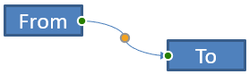

## **بررسی کلی**

یک کانکتور خطی است که می‌تواند هنگام جابه‌جایی هر یک از دو شکل به دو شکل متصل بماند. انتهای آن به نقاط اتصال (connection sites) متصل می‌شود که در پاورپوینت با نقاط سبز نمایش داده می‌شوند. برخی از کانکتورهای خمیده و منحنی نیز نقاط تنظیم (adjustment points) دارند که با نقاط نارنجی نشان داده شده و موقعیت بخش‌های مختلف کانکتور را کنترل می‌کنند.

Aspose.Slides کانکتورها را از طریق کلاس [Connector](https://reference.aspose.com/slides/fa/nodejs-java/aspose.slides/connector/) نمایش می‌دهد. می‌توانید آنها را ایجاد کنید، انتهاهایشان را به اشکال متصل کنید، نقاط اتصال را انتخاب کنید، مسیرشان را دوباره رسم کنید و هندسهٔ کانکتورهایی که نقاط تنظیم دارند را تغییر دهید.

## **انواع کانکتور**

کلاس [ShapeType](https://reference.aspose.com/slides/fa/nodejs-java/aspose.slides/shapetype/) شامل پیش‌تنظیم‌های کانکتور مستقیم، خمیده و منحنی است. جدول زیر هندسه‌های موجود برای کانکتور و تعداد نقاط تنظیم تعریف‌شده برای هر پیش‌تنظیم را نشان می‌دهد.

| کانکتور | تصویر | تعداد نقاط تنظیم |
|---|---|---|
| `ShapeType.Line` |  | 0 |
| `ShapeType.StraightConnector1` |  | 0 |
| `ShapeType.BentConnector2` |  | 0 |
| `ShapeType.BentConnector3` |  | 1 |
| `ShapeType.BentConnector4` |  | 2 |
| `ShapeType.BentConnector5` |  | 3 |
| `ShapeType.CurvedConnector2` |  | 0 |
| `ShapeType.CurvedConnector3` |  | 1 |
| `ShapeType.CurvedConnector4` |  | 2 |
| `ShapeType.CurvedConnector5` |  | 3 |

تعداد و معنای نقاط تنظیم جزئی از پیش‌تنظیم انتخاب‌شدهٔ کانکتور است. فرض نکنید که دو نوع مختلف کانکتور همان چیدمان مجموعه را ارائه می‌دهند.

## **اتصال دو شکل**

از متد [ShapeCollection.addConnector](https://reference.aspose.com/slides/fa/nodejs-java/aspose.slides/shapecollection/addconnector/) برای افزودن یک کانکتور استفاده کنید و با متدهای [Connector.setStartShapeConnectedTo](https://reference.aspose.com/slides/fa/nodejs-java/aspose.slides/connector/setstartshapeconnectedto/) و [Connector.setEndShapeConnectedTo](https://reference.aspose.com/slides/fa/nodejs-java/aspose.slides/connector/setendshapeconnectedto/) انتهاهای آن را متصل کنید. پس از اتصال هر دو انتها، متد [Connector.reroute](https://reference.aspose.com/slides/fa/nodejs-java/aspose.slides/connector/reroute/) مسیری کوتاه بین دو شکل انتخاب می‌کند.

مثال زیر یک بیضی و یک مستطیل را با یک کانکتور خمیده متصل می‌کند:

```javascript
const aspose = { slides: require("aspose.slides.via.java") };

const presentation = new aspose.slides.Presentation();
try {
    const slide = presentation.getSlides().get_Item(0);

    const ellipse = slide.getShapes().addAutoShape(aspose.slides.ShapeType.Ellipse, 40, 80, 120, 80);
    const rectangle = slide.getShapes().addAutoShape(aspose.slides.ShapeType.Rectangle, 320, 240, 140, 80);
    const connector = slide.getShapes().addConnector(aspose.slides.ShapeType.BentConnector2, 0, 0, 10, 10);

    connector.setStartShapeConnectedTo(ellipse);
    connector.setEndShapeConnectedTo(rectangle);
    connector.reroute();

    presentation.save("connected-shapes.pptx", aspose.slides.SaveFormat.Pptx);
} finally {
    presentation.dispose();
}
```

{}

فراخوانی `reroute` می‌تواند مقادیر [setStartShapeConnectionSiteIndex](https://reference.aspose.com/slides/fa/nodejs-java/aspose.slides/connector/setstartshapeconnectionsiteindex/) و [setEndShapeConnectionSiteIndex](https://reference.aspose.com/slides/fa/nodejs-java/aspose.slides/connector/setendshapeconnectionsiteindex/) را تغییر دهد. پس از تغییر مسیر، در صورتی که این نقاط باید ثابت بمانند، سایت‌های خاص را مجدداً تنظیم کنید.

{}

## **انتخاب نقطه اتصال**

هر شکل قابل اتصال، تعداد سایت‌های خود را از طریق متد [Shape.getConnectionSiteCount](https://reference.aspose.com/slides/fa/nodejs-java/aspose.slides/shape/getconnectionsitecount/) گزارش می‌کند. قبل از اختصاص یک ایندکس سایت صفر‑مبنا به انتهای کانکتور، صحت آن را اعتبارسنجی کنید؛ تعداد سایت‌ها بسته به هندسهٔ شکل متفاوت است.

این مثال کانکتور را به یک سایت خاص در بیضی متصل می‌کند وقتی آن سایت وجود داشته باشد:

```javascript
const aspose = { slides: require("aspose.slides.via.java") };

const presentation = new aspose.slides.Presentation();
try {
    const slide = presentation.getSlides().get_Item(0);

    const ellipse = slide.getShapes().addAutoShape(aspose.slides.ShapeType.Ellipse, 40, 80, 120, 80);
    const rectangle = slide.getShapes().addAutoShape(aspose.slides.ShapeType.Rectangle, 320, 240, 140, 80);
    const connector = slide.getShapes().addConnector(aspose.slides.ShapeType.BentConnector3, 0, 0, 10, 10);

    connector.setStartShapeConnectedTo(ellipse);
    connector.setEndShapeConnectedTo(rectangle);

    const preferredSiteIndex = 2;
    if (preferredSiteIndex < ellipse.getConnectionSiteCount()) {
        connector.setStartShapeConnectionSiteIndex(preferredSiteIndex);
    } else {
        console.log(`The ellipse has only ${ellipse.getConnectionSiteCount()} connection sites.`);
    }

    presentation.save("specific-connection-site.pptx", aspose.slides.SaveFormat.Pptx);
} finally {
    presentation.dispose();
}
```

## **تنظیم نقطهٔ کانکتور**

کانکتورهای دارای نقاط تنظیم، این نقاط را از طریق متد [GeometryShape.getAdjustments](https://reference.aspose.com/slides/fa/nodejs-java/aspose.slides/geometryshape/) در دسترس قرار می‌دهند. قبل از تغییر مقدار هر [AdjustValue](https://reference.aspose.com/slides/fa/nodejs-java/aspose.slides/adjustvalue/)، نوع آن را با متد [getType](https://reference.aspose.com/slides/fa/nodejs-java/aspose.slides/adjustvalue/) بررسی کنید و سپس با [setRawValue](https://reference.aspose.com/slides/fa/nodejs-java/aspose.slides/adjustvalue/setrawvalue/) مقدار را تنظیم کنید. قوانین کلی شناسایی تنظیمات پیش‌تنظیم‌شدهٔ شکل در بخش [Shape Manipulation](/slides/fa/nodejs-java/shape-manipulations/) توصیف شده است.

تعداد، ترتیب، معنای و دامنهٔ مقادیر معتبر تنظیمات کانکتور بستگی به پیش‌تنظیم کانکتور دارد. نوع تنظیم فقط‑خواندنی است، در حالی که مقدار تنظیم قابل نوشتن است. متد فقط‑خواندنی [getName](https://reference.aspose.com/slides/fa/nodejs-java/aspose.slides/adjustvalue/getname/) هنگام وجود بیش از یک تنظیم از همان نوع معنایی، اطلاعات شناسایی اضافه می‌دهد.

### **مسیر دور زدن از مانع**

در طرح زیر، یک کانکتور `BentConnector5` بین دو شکل از طریق شکل سوم عبور می‌کند:


این کد کانکتور مسدودشده را می‌سازد:

```javascript
const aspose = { slides: require("aspose.slides.via.java") };
const java = require("java");

const presentation = new aspose.slides.Presentation();
try {
    const slide = presentation.getSlides().get_Item(0);

    slide.getShapes().addAutoShape(aspose.slides.ShapeType.Rectangle, 300, 150, 150, 75);
    const sourceShape = slide.getShapes().addAutoShape(aspose.slides.ShapeType.Rectangle, 500, 400, 100, 50);
    const targetShape = slide.getShapes().addAutoShape(aspose.slides.ShapeType.Rectangle, 100, 100, 70, 30);
    const connector = slide.getShapes().addConnector(aspose.slides.ShapeType.BentConnector5, 20, 20, 400, 300);

    const black = java.getStaticFieldValue("java.awt.Color", "BLACK");
    const solidFillType = java.newByte(aspose.slides.FillType.Solid);
    const triangleArrowheadStyle = java.newByte(aspose.slides.LineArrowheadStyle.Triangle);
    connector.getLineFormat().setEndArrowheadStyle(triangleArrowheadStyle);
    connector.getLineFormat().getFillFormat().setFillType(solidFillType);
    connector.getLineFormat().getFillFormat().getSolidFillColor().setColor(black);
    connector.setStartShapeConnectedTo(sourceShape);
    connector.setEndShapeConnectedTo(targetShape);
    connector.setStartShapeConnectionSiteIndex(2);

    presentation.save("connector-obstruction.pptx", aspose.slides.SaveFormat.Pptx);
} finally {
    presentation.dispose();
}
```

جابجایی خم عمودی مسیر را تغییر می‌دهد تا کانکتور از مانع عبور کند:


به جای فرض اینکه اندیس مجموعهٔ `1` همیشه نمایانگر خم عمودی است، این مثال به دنبال `ConnectorBendPositionY` می‌گردد و فقط وقتی نوع معنایی مورد انتظار وجود دارد، آن را تغییر می‌دهد:

```javascript
const aspose = { slides: require("aspose.slides.via.java") };
const java = require("java");

const presentation = new aspose.slides.Presentation();
try {
    const slide = presentation.getSlides().get_Item(0);

    slide.getShapes().addAutoShape(aspose.slides.ShapeType.Rectangle, 300, 150, 150, 75);
    const sourceShape = slide.getShapes().addAutoShape(aspose.slides.ShapeType.Rectangle, 500, 400, 100, 50);
    const targetShape = slide.getShapes().addAutoShape(aspose.slides.ShapeType.Rectangle, 100, 100, 70, 30);
    const connector = slide.getShapes().addConnector(aspose.slides.ShapeType.BentConnector5, 20, 20, 400, 300);

    const black = java.getStaticFieldValue("java.awt.Color", "BLACK");
    const solidFillType = java.newByte(aspose.slides.FillType.Solid);
    const triangleArrowheadStyle = java.newByte(aspose.slides.LineArrowheadStyle.Triangle);
    connector.getLineFormat().setEndArrowheadStyle(triangleArrowheadStyle);
    connector.getLineFormat().getFillFormat().setFillType(solidFillType);
    connector.getLineFormat().getFillFormat().getSolidFillColor().setColor(black);
    connector.setStartShapeConnectedTo(sourceShape);
    connector.setEndShapeConnectedTo(targetShape);
    connector.setStartShapeConnectionSiteIndex(2);

    let verticalBend = null;
    for (let adjustmentIndex = 0; adjustmentIndex < connector.getAdjustments().size(); adjustmentIndex++) {
        const adjustment = connector.getAdjustments().get_Item(adjustmentIndex);
        console.log(`${adjustment.getName()}: ${adjustment.getType()}, raw value = ${adjustment.getRawValue()}`);
        if (adjustment.getType() === aspose.slides.ShapeAdjustmentType.ConnectorBendPositionY) {
            verticalBend = adjustment;
            break;
        }
    }

    if (verticalBend === null) {
        console.log("The connector does not expose a vertical bend adjustment.");
    } else {
        verticalBend.setRawValue(60000);
        presentation.save("connector-obstruction-fixed.pptx", aspose.slides.SaveFormat.Pptx);
    }
} finally {
    presentation.dispose();
}
```

یک `BentConnector5` دو تنظیم `ConnectorBendPositionX` و یک تنظیم `ConnectorBendPositionY` دارد. اگر نوع مورد نیاز بیش از یک بار ظاهر شد، قبل از انتخاب، `getName` و هندسهٔ شناخته‌شدهٔ پیش‌تنظیم را بررسی کنید. اگر یک تنظیم مقدار `ShapeAdjustmentType.Custom` برگرداند، معنای آن و دامنهٔ مقدار را به عنوان پیش‌تنظیم‑خاص در نظر بگیرید و تا زمان شناخت قرارداد، آن را تغییر ندهید.

## **ارتباط مقادیر تنظیم با هندسه کانکتور**

برای کانکتورهای خمیده، مقادیر تنظیم می‌توانند برای تخمین موقعیت بخش‌های جداگانه استفاده شوند. این محاسبات مخصوص پیش‌تنظیم کانکتور هستند:

- `BentConnector4` به طور معمول یک تنظیم `ConnectorBendPositionX` و یک تنظیم `ConnectorBendPositionY` ارائه می‌دهد.
- برای این موقعیت‌های خم، تقسیم مقدار بازگشتی توسط `getRawValue` بر `100000` کسر عرض یا ارتفاع قاب کانکتور را که در مثال‌های زیر استفاده می‌شود، تولید می‌کند.
- قاب کانکتور می‌تواند چرخانده یا وارونه شود، بنابراین مختصات قاب باید قبل از مقایسه با مختصات اسلاید تبدیل شوند.

مثال‌های زیر ابتدا با استفاده از `getType` تنظیمات را شناسایی می‌کنند. آنها اندیس‌های مجموعه را به عنوان شناسه‌های قابل حمل استفاده نمی‌کنند.

### **کانکتور بدون چرخش**

طرح اولیه شامل دو شکل متنی است که توسط یک `BentConnector4` متصل شده‌اند:


این مثال کانکتور را بررسی می‌کند و تنظیمات خم افقی و عمودی آن را دریافت می‌کند:

```javascript
const aspose = { slides: require("aspose.slides.via.java") };
const java = require("java");

const presentation = new aspose.slides.Presentation();
try {
    const slide = presentation.getSlides().get_Item(0);

    const sourceShape = slide.getShapes().addAutoShape(aspose.slides.ShapeType.Rectangle, 100, 100, 60, 25);
    sourceShape.getTextFrame().setText("From");
    const targetShape = slide.getShapes().addAutoShape(aspose.slides.ShapeType.Rectangle, 500, 100, 60, 25);
    targetShape.getTextFrame().setText("To");
    const connector = slide.getShapes().addConnector(aspose.slides.ShapeType.BentConnector4, 20, 20, 400, 300);

    const red = java.getStaticFieldValue("java.awt.Color", "RED");
    const solidFillType = java.newByte(aspose.slides.FillType.Solid);
    const triangleArrowheadStyle = java.newByte(aspose.slides.LineArrowheadStyle.Triangle);
    connector.getLineFormat().setEndArrowheadStyle(triangleArrowheadStyle);
    connector.getLineFormat().getFillFormat().setFillType(solidFillType);
    connector.getLineFormat().getFillFormat().getSolidFillColor().setColor(red);
    connector.getLineFormat().setWidth(3);
    connector.setStartShapeConnectedTo(sourceShape);
    connector.setStartShapeConnectionSiteIndex(3);
    connector.setEndShapeConnectedTo(targetShape);
    connector.setEndShapeConnectionSiteIndex(2);

    for (let adjustmentIndex = 0; adjustmentIndex < connector.getAdjustments().size(); adjustmentIndex++) {
        const adjustment = connector.getAdjustments().get_Item(adjustmentIndex);
        console.log(`${adjustment.getName()}: ${adjustment.getType()}, raw value = ${adjustment.getRawValue()}`);
    }
} finally {
    presentation.dispose();
}
```

برای تغییر هر دو خم، هر نوع مورد انتظار را پیدا کنید و پس از یافتن هر دو، مقادیر را اصلاح کنید:

```javascript
const aspose = { slides: require("aspose.slides.via.java") };

const presentation = new aspose.slides.Presentation();
try {
    const slide = presentation.getSlides().get_Item(0);

    const sourceShape = slide.getShapes().addAutoShape(aspose.slides.ShapeType.Rectangle, 100, 100, 60, 25);
    const targetShape = slide.getShapes().addAutoShape(aspose.slides.ShapeType.Rectangle, 500, 100, 60, 25);
    const connector = slide.getShapes().addConnector(aspose.slides.ShapeType.BentConnector4, 20, 20, 400, 300);
    connector.setStartShapeConnectedTo(sourceShape);
    connector.setStartShapeConnectionSiteIndex(3);
    connector.setEndShapeConnectedTo(targetShape);
    connector.setEndShapeConnectionSiteIndex(2);

    let horizontalBend = null;
    let verticalBend = null;
    for (let adjustmentIndex = 0; adjustmentIndex < connector.getAdjustments().size(); adjustmentIndex++) {
        const adjustment = connector.getAdjustments().get_Item(adjustmentIndex);
        if (adjustment.getType() === aspose.slides.ShapeAdjustmentType.ConnectorBendPositionX) {
            horizontalBend = adjustment;
        } else if (adjustment.getType() === aspose.slides.ShapeAdjustmentType.ConnectorBendPositionY) {
            verticalBend = adjustment;
        }
    }

    if (horizontalBend === null || verticalBend === null) {
        console.log("The connector does not expose the expected bend adjustments.");
    } else {
        horizontalBend.setRawValue(horizontalBend.getRawValue() + 20000);
        verticalBend.setRawValue(verticalBend.getRawValue() + 200000);
        presentation.save("connector-adjusted.pptx", aspose.slides.SaveFormat.Pptx);
    }
} finally {
    presentation.dispose();
}
```

نتیجه یک کانکتور است که بخش‌های افقی و عمودی آن جابجا شده‌اند:


پس از شناخت انواع معنایی، می‌توان مقادیر را به مختصات قاب کانکتور تبدیل کرد. این مثال یک مستطیل نازک بر روی بخش عمودی که توسط دو تنظیم خم کنترل می‌شود می‌کشد:

```javascript
const aspose = { slides: require("aspose.slides.via.java") };
const java = require("java");

const presentation = new aspose.slides.Presentation();
try {
    const slide = presentation.getSlides().get_Item(0);

    const sourceShape = slide.getShapes().addAutoShape(aspose.slides.ShapeType.Rectangle, 100, 100, 60, 25);
    const targetShape = slide.getShapes().addAutoShape(aspose.slides.ShapeType.Rectangle, 500, 100, 60, 25);
    const connector = slide.getShapes().addConnector(aspose.slides.ShapeType.BentConnector4, 20, 20, 400, 300);
    connector.setStartShapeConnectedTo(sourceShape);
    connector.setStartShapeConnectionSiteIndex(3);
    connector.setEndShapeConnectedTo(targetShape);
    connector.setEndShapeConnectionSiteIndex(2);

    let horizontalBend = null;
    let verticalBend = null;
    for (let adjustmentIndex = 0; adjustmentIndex < connector.getAdjustments().size(); adjustmentIndex++) {
        const adjustment = connector.getAdjustments().get_Item(adjustmentIndex);
        if (adjustment.getType() === aspose.slides.ShapeAdjustmentType.ConnectorBendPositionX) {
            horizontalBend = adjustment;
        } else if (adjustment.getType() === aspose.slides.ShapeAdjustmentType.ConnectorBendPositionY) {
            verticalBend = adjustment;
        }
    }

    if (horizontalBend === null || verticalBend === null) {
        console.log("The connector does not expose the expected bend adjustments.");
    } else {
        const x = connector.getX() + connector.getWidth() * horizontalBend.getRawValue() / 100000;
        const y = connector.getY();
        const height = connector.getHeight() * verticalBend.getRawValue() / 100000;
        const guideX = java.newFloat(x);
        const guideY = java.newFloat(y);
        const guideWidth = java.newFloat(1);
        const guideHeight = java.newFloat(height);
        slide.getShapes().addAutoShape(aspose.slides.ShapeType.Rectangle, guideX, guideY, guideWidth, guideHeight);
        presentation.save("connector-segment-guide.pptx", aspose.slides.SaveFormat.Pptx);
    }
} finally {
    presentation.dispose();
}
```

شکل راهنما بخش محاسبه‌شده را نشان می‌دهد:


### **کانکتور چرخانده یا وارونه**

زمانی که همان هندسهٔ کانکتور به صورت عمودی جهت‌دار باشد، مقادیر [Shape.getFrame](https://reference.aspose.com/slides/fa/nodejs-java/aspose.slides/shape/getframe/)، [ShapeFrame.getFlipH](https://reference.aspose.com/slides/fa/nodejs-java/aspose.slides/shapeframe/getfliph/) و [ShapeFrame.getFlipV](https://reference.aspose.com/slides/fa/nodejs-java/aspose.slides/shapeframe/getflipv/) بر تبدیل مختصات قاب به مختصات اسلاید تأثیر می‌گذارند.

این مثال کانکتور عمودی را می‌سازد و تنظیم می‌کند:

```javascript
const aspose = { slides: require("aspose.slides.via.java") };
const java = require("java");

const presentation = new aspose.slides.Presentation();
try {
    const slide = presentation.getSlides().get_Item(0);

    const sourceShape = slide.getShapes().addAutoShape(aspose.slides.ShapeType.Rectangle, 100, 100, 60, 25);
    sourceShape.getTextFrame().setText("From");
    const targetShape = slide.getShapes().addAutoShape(aspose.slides.ShapeType.Rectangle, 100, 400, 60, 25);
    targetShape.getTextFrame().setText("To 1");
    const connector = slide.getShapes().addConnector(aspose.slides.ShapeType.BentConnector4, 20, 20, 400, 300);

    const connectorColor = java.newInstanceSync("java.awt.Color", 102, 205, 170);
    const solidFillType = java.newByte(aspose.slides.FillType.Solid);
    const triangleArrowheadStyle = java.newByte(aspose.slides.LineArrowheadStyle.Triangle);
    connector.getLineFormat().setEndArrowheadStyle(triangleArrowheadStyle);
    connector.getLineFormat().getFillFormat().setFillType(solidFillType);
    connector.getLineFormat().getFillFormat().getSolidFillColor().setColor(connectorColor);
    connector.getLineFormat().setWidth(3);
    connector.setStartShapeConnectedTo(sourceShape);
    connector.setStartShapeConnectionSiteIndex(2);
    connector.setEndShapeConnectedTo(targetShape);
    connector.setEndShapeConnectionSiteIndex(3);

    for (let adjustmentIndex = 0; adjustmentIndex < connector.getAdjustments().size(); adjustmentIndex++) {
        const adjustment = connector.getAdjustments().get_Item(adjustmentIndex);
        if (adjustment.getType() === aspose.slides.ShapeAdjustmentType.ConnectorBendPositionX) {
            adjustment.setRawValue(adjustment.getRawValue() + 20000);
        } else if (adjustment.getType() === aspose.slides.ShapeAdjustmentType.ConnectorBendPositionY) {
            adjustment.setRawValue(adjustment.getRawValue() + 200000);
        }
    }

    presentation.save("vertical-connector-adjusted.pptx", aspose.slides.SaveFormat.Pptx);
} finally {
    presentation.dispose();
}
```

کانکتور تنظیم‌شده به صورت عمودی بین دو شکل قرار می‌گیرد:


برای زاویهٔ چرخش دلخواه `alpha`، نقطهٔ `(x, y)` قاب کانکتور را به دور مرکز قاب `(x0, y0)` می‌چرخانیم:

`X = (x - x0) * cos(alpha) - (y - y0) * sin(alpha) + x0`

`Y = (x - x0) * sin(alpha) + (y - y0) * cos(alpha) + y0`

کد زیر جهت‌گیری ۹۰ درجه استفاده شده در این مثال را مدیریت می‌کند و یک راهنمای قرمز بر روی بخش متناظر کانکتور می‌کشد:

```javascript
const aspose = { slides: require("aspose.slides.via.java") };
const java = require("java");

const presentation = new aspose.slides.Presentation();
try {
    const slide = presentation.getSlides().get_Item(0);

    const sourceShape = slide.getShapes().addAutoShape(aspose.slides.ShapeType.Rectangle, 100, 100, 60, 25);
    const targetShape = slide.getShapes().addAutoShape(aspose.slides.ShapeType.Rectangle, 100, 400, 60, 25);
    const connector = slide.getShapes().addConnector(aspose.slides.ShapeType.BentConnector4, 20, 20, 400, 300);
    connector.setStartShapeConnectedTo(sourceShape);
    connector.setStartShapeConnectionSiteIndex(2);
    connector.setEndShapeConnectedTo(targetShape);
    connector.setEndShapeConnectionSiteIndex(3);

    let horizontalBend = null;
    let verticalBend = null;
    for (let adjustmentIndex = 0; adjustmentIndex < connector.getAdjustments().size(); adjustmentIndex++) {
        const adjustment = connector.getAdjustments().get_Item(adjustmentIndex);
        if (adjustment.getType() === aspose.slides.ShapeAdjustmentType.ConnectorBendPositionX) {
            horizontalBend = adjustment;
        } else if (adjustment.getType() === aspose.slides.ShapeAdjustmentType.ConnectorBendPositionY) {
            verticalBend = adjustment;
        }
    }

    if (horizontalBend === null || verticalBend === null) {
        console.log("The connector does not expose the expected bend adjustments.");
    } else {
        horizontalBend.setRawValue(horizontalBend.getRawValue() + 20000);
        verticalBend.setRawValue(verticalBend.getRawValue() + 200000);

        let x = connector.getX();
        let y = connector.getY();
        if (connector.getFrame().getFlipH() === aspose.slides.NullableBool.True) {
            x += connector.getWidth();
        }
        if (connector.getFrame().getFlipV() === aspose.slides.NullableBool.True) {
            y += connector.getHeight();
        }

        x += connector.getWidth() * horizontalBend.getRawValue() / 100000;
        const rotatedX = connector.getFrame().getCenterX() - y + connector.getFrame().getCenterY();
        const rotatedY = x - connector.getFrame().getCenterX() + connector.getFrame().getCenterY();
        const segmentWidth = connector.getHeight() * verticalBend.getRawValue() / 100000;
        const guideX = java.newFloat(rotatedX);
        const guideY = java.newFloat(rotatedY);
        const guideWidth = java.newFloat(segmentWidth);
        const guideHeight = java.newFloat(1);
        const guide = slide.getShapes().addAutoShape(aspose.slides.ShapeType.Rectangle, guideX, guideY, guideWidth, guideHeight);
        const red = java.getStaticFieldValue("java.awt.Color", "RED");
        const solidFillType = java.newByte(aspose.slides.FillType.Solid);
        guide.getLineFormat().getFillFormat().setFillType(solidFillType);
        guide.getLineFormat().getFillFormat().getSolidFillColor().setColor(red);

        presentation.save("rotated-connector-segment-guide.pptx", aspose.slides.SaveFormat.Pptx);
    }
} finally {
    presentation.dispose();
}
```

راهنمای قرمز پس از تبدیل مختصات بخش محاسبه‌شده را نشان می‌دهد:


این فرمول‌ها مربوط به پیش‌تنظیم‌های استفاده‌شده در مثال‌ها هستند، نه یک مدل عمومی کانکتور. پیش از اعمال همین محاسبه به پیش‌تنظیم متفاوت، انواع تنظیمات، جهت‌گیری قاب و دامنهٔ مقادیر را اعتبارسنجی کنید.

## **یافتن زاویهٔ جهت کانکتور**

جهت یک کانکتور مستقیم می‌تواند از عرض و ارتفاع آن محاسبه شود، با در نظر گرفتن وارونگی افقی و عمودی. مثال زیر زاویهٔ ساعتگرد نسبت به محور افقی مثبت در مختصات اسلاید را گزارش می‌کند:

```javascript
const aspose = { slides: require("aspose.slides.via.java") };

const presentation = new aspose.slides.Presentation();
try {
    const slide = presentation.getSlides().get_Item(0);
    const connector = slide.getShapes().addConnector(aspose.slides.ShapeType.StraightConnector1, 100, 100, 200, 100);

    const flipH = connector.getFrame().getFlipH() === aspose.slides.NullableBool.True;
    const flipV = connector.getFrame().getFlipV() === aspose.slides.NullableBool.True;
    const deltaX = connector.getWidth() * (flipH ? -1 : 1);
    const deltaY = connector.getHeight() * (flipV ? -1 : 1);
    let angle = Math.atan2(deltaY, deltaX) * 180.0 / Math.PI;

    if (angle < 0) {
        angle += 360;
    }

    console.log(`Connector direction: ${angle.toFixed(2)} degrees`);
} finally {
    presentation.dispose();
}
```

## **پرسش‌های متداول**

**چگونه می‌توانم تشخیص دهم که یک کانکتور می‌تواند به یک شکل متصل شود؟**

مقدار [getConnectionSiteCount](https://reference.aspose.com/slides/fa/nodejs-java/aspose.slides/shape/getconnectionsitecount/) شکل را بررسی کنید. شمار مثبت یعنی شکل نقاط اتصال را ارائه می‌دهد. قبل از اختصاص ایندکس سایت انتخاب‌شده به هر انتهای کانکتور، آن را اعتبارسنجی کنید.

**آیا می‌توانم تنظیم یک کانکتور را بر اساس ایندکس مجموعه شناسایی کنم؟**

ایندکس تنها برای پیش‌تنظیم شناخته‌شدهٔ کانکتور و چیدمان مجموعه معنی دارد. قبل از تغییر مقدار، [AdjustValue.getType](https://reference.aspose.com/slides/fa/nodejs-java/aspose.slides/adjustvalue/) را بررسی کنید و در صورت وجود بیش از یک تنظیم از همان نوع معنایی، از [AdjustValue.getName](https://reference.aspose.com/slides/fa/nodejs-java/aspose.slides/adjustvalue/getname/) به‌عنوان اطلاعات تکمیلی استفاده کنید.

**وقتی یک شکل متصل حذف شود چه اتفاقی می‌افتد؟**

سر مربوط به کانکتور جدا می‌شود. کانکتور در اسلاید باقی می‌ماند و می‌تواند حذف شود، به‌عنوان یک خط آزاد موقعیت‌یابی شود یا به شکل دیگری متصل گردد.

**آیا اتصالات کانکتور هنگام کپی اسلاید حفظ می‌شوند؟**

در حالت کلی، وقتی اشکال متصل همراه با اسلاید کپی می‌شوند، اتصالات حفظ می‌شوند. اگر یک کانکتور بدون یکی از شکل‌های هدفش کپی شود، سر تحت‌تاثیر باید دوباره متصل شود.