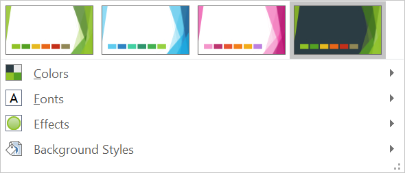

## **مقدمه**

یک تم ارائه، ویژگی‌های عناصر طراحی را تعریف می‌کند. هنگامی که یک تم ارائه را انتخاب می‌کنید، در واقع مجموعه‌ای خاص از عناصر بصری و ویژگی‌های آن‌ها را برمی‌گزینید.

در PowerPoint، یک تم شامل رنگ‌ها، [فونت‌ها](/slides/fa/nodejs-java/powerpoint-fonts/)، [سبک‌های پس‌زمینه](/slides/fa/nodejs-java/presentation-background/)، و افکت‌ها است.



## **تغییر رنگ تم**

یک تم PowerPoint مجموعه‌ای خاص از رنگ‌ها را برای عناصر مختلف در یک اسلاید به‌کار می‌برد. اگر رنگ‌ها را دوست ندارید، می‌توانید با اعمال رنگ‌های جدید برای تم، آن‌ها را تغییر دهید. برای این که بتوانید یک رنگ تم جدید انتخاب کنید، Aspose.Slides مقادیر را تحت شمارش‌گر [SchemeColor](https://reference.aspose.com/slides/fa/nodejs-java/aspose.slides/SchemeColor) فراهم می‌کند.

```javascript
var pres = new aspose.slides.Presentation();
try {
    var shape = pres.getSlides().get_Item(0).getShapes().addAutoShape(aspose.slides.ShapeType.Rectangle, 10, 10, 100, 100);
    shape.getFillFormat().setFillType(java.newByte(aspose.slides.FillType.Solid));
    shape.getFillFormat().getSolidFillColor().setSchemeColor(aspose.slides.SchemeColor.Accent4);
} finally {
    if (pres != null) {
        pres.dispose();
    }
}
```

می‌توانید مقدار مؤثر رنگ حاصل را به این روش تعیین کنید:

```javascript
var fillEffective = shape.getFillFormat().getEffective();
var effectiveColor = fillEffective.getSolidFillColor();
console.log(java.callStaticMethodSync("java.lang.String", "format", "Color [A=%d, R=%d, G=%d, B=%d]", effectiveColor.getAlpha(), effectiveColor.getRed(), effectiveColor.getGreen(), effectiveColor.getBlue()));
```

برای نشان دادن بیشتر عملیات تغییر رنگ، یک عنصر دیگر ایجاد می‌کنیم و رنگ تأکیدی (از عملیات اولیه) را به آن اختصاص می‌دهیم. سپس رنگ را در تم تغییر می‌دهیم:

```javascript
var otherShape = pres.getSlides().get_Item(0).getShapes().addAutoShape(aspose.slides.ShapeType.Rectangle, 10, 120, 100, 100);
otherShape.getFillFormat().setFillType(java.newByte(aspose.slides.FillType.Solid));
otherShape.getFillFormat().getSolidFillColor().setSchemeColor(aspose.slides.SchemeColor.Accent4);
pres.getMasterTheme().getColorScheme().getAccent4().setColor(java.getStaticFieldValue("java.awt.Color", "RED"));
```

رنگ جدید به‌طور خودکار بر هر دو عنصر اعمال می‌شود.

### **تنظیم رنگ تم از پالت اضافی**

زمانی که تبدیل‌های روشنایی را بر رنگ اصلی تم (1) اعمال می‌کنید، رنگ‌های پالت اضافی (2) شکل می‌گیرند. سپس می‌توانید این رنگ‌های تم را تنظیم و دریافت کنید.


**1** - رنگ‌های اصلی تم
**2** - رنگ‌های پالت اضافی.

```javascript
var presentation = new aspose.slides.Presentation();
try {
    var slide = presentation.getSlides().get_Item(0);
    // اکسنت ۴
    var shape1 = slide.getShapes().addAutoShape(aspose.slides.ShapeType.Rectangle, 10, 10, 50, 50);
    shape1.getFillFormat().setFillType(java.newByte(aspose.slides.FillType.Solid));
    shape1.getFillFormat().getSolidFillColor().setSchemeColor(aspose.slides.SchemeColor.Accent4);
    // اکسنت ۴، روشنتر ۸۰٪
    var shape2 = slide.getShapes().addAutoShape(aspose.slides.ShapeType.Rectangle, 10, 70, 50, 50);
    shape2.getFillFormat().setFillType(java.newByte(aspose.slides.FillType.Solid));
    shape2.getFillFormat().getSolidFillColor().setSchemeColor(aspose.slides.SchemeColor.Accent4);
    shape2.getFillFormat().getSolidFillColor().getColorTransform().add(aspose.slides.ColorTransformOperation.MultiplyLuminance, 0.2);
    shape2.getFillFormat().getSolidFillColor().getColorTransform().add(aspose.slides.ColorTransformOperation.AddLuminance, 0.8);
    // اکسنت ۴، روشنتر ۶۰٪
    var shape3 = slide.getShapes().addAutoShape(aspose.slides.ShapeType.Rectangle, 10, 130, 50, 50);
    shape3.getFillFormat().setFillType(java.newByte(aspose.slides.FillType.Solid));
    shape3.getFillFormat().getSolidFillColor().setSchemeColor(aspose.slides.SchemeColor.Accent4);
    shape3.getFillFormat().getSolidFillColor().getColorTransform().add(aspose.slides.ColorTransformOperation.MultiplyLuminance, 0.4);
    shape3.getFillFormat().getSolidFillColor().getColorTransform().add(aspose.slides.ColorTransformOperation.AddLuminance, 0.6);
    // اکسنت ۴، روشنتر ۴۰٪
    var shape4 = slide.getShapes().addAutoShape(aspose.slides.ShapeType.Rectangle, 10, 190, 50, 50);
    shape4.getFillFormat().setFillType(java.newByte(aspose.slides.FillType.Solid));
    shape4.getFillFormat().getSolidFillColor().setSchemeColor(aspose.slides.SchemeColor.Accent4);
    shape4.getFillFormat().getSolidFillColor().getColorTransform().add(aspose.slides.ColorTransformOperation.MultiplyLuminance, 0.6);
    shape4.getFillFormat().getSolidFillColor().getColorTransform().add(aspose.slides.ColorTransformOperation.AddLuminance, 0.4);
    // اکسنت ۴، تیره‌تر ۲۵٪
    var shape5 = slide.getShapes().addAutoShape(aspose.slides.ShapeType.Rectangle, 10, 250, 50, 50);
    shape5.getFillFormat().setFillType(java.newByte(aspose.slides.FillType.Solid));
    shape5.getFillFormat().getSolidFillColor().setSchemeColor(aspose.slides.SchemeColor.Accent4);
    shape5.getFillFormat().getSolidFillColor().getColorTransform().add(aspose.slides.ColorTransformOperation.MultiplyLuminance, 0.75);
    // اکسنت ۴، تیره‌تر ۵۰٪
    var shape6 = slide.getShapes().addAutoShape(aspose.slides.ShapeType.Rectangle, 10, 310, 50, 50);
    shape6.getFillFormat().setFillType(java.newByte(aspose.slides.FillType.Solid));
    shape6.getFillFormat().getSolidFillColor().setSchemeColor(aspose.slides.SchemeColor.Accent4);
    shape6.getFillFormat().getSolidFillColor().getColorTransform().add(aspose.slides.ColorTransformOperation.MultiplyLuminance, 0.5);
    presentation.save(path + "example_accent4.pptx", aspose.slides.SaveFormat.Pptx);
} finally {
    if (presentation != null) {
        presentation.dispose();
    }
}
```

### **نقش‌گذاری `SchemeColor` به رنگ‌های `ColorScheme`**

هنگامی که با [SchemeColor](https://reference.aspose.com/slides/fa/nodejs-java/aspose.slides/schemecolor/) کار می‌کنید، ممکن است متوجه شوید که شامل مقادیر رنگ تم زیر است:

`Background1`, `Background2`, `Text1`, and `Text2`.

با این حال، `Presentation.getMasterTheme().getColorScheme()`، [ColorScheme](https://reference.aspose.com/slides/fa/nodejs-java/aspose.slides/colorscheme/) را برمی‌گرداند که رنگ‌های مربوطه را به شکل زیر ارائه می‌دهد:

`Dark1`, `Dark2`, `Light1`, and `Light2`.

این تفاوت فقط در نام‌گذاری است. این مقادیر به یک‌قسمت‌های رنگ تم یکسان اشاره می‌کنند و نگاشت ثابت است:

* `Text1` = `Dark1`
* `Background1` = `Light1`
* `Text2` = `Dark2`
* `Background2` = `Light2`

هیچ تبدیل پویا بین `Text`/`Background` و `Dark`/`Light` وجود ندارد. آن‌ها صرفاً اسامی جایگزین برای همان رنگ‌های تم هستند.

این تفاوت نام‌گذاری از اصطلاحات Microsoft Office ناشی می‌شود. نسخه‌های قدیمی Office از `Dark 1`، `Light 1`، `Dark 2` و `Light 2` استفاده می‌کردند، در حالی که نسخه‌های جدید رابط کاربری همان قسمت‌ها را به صورت `Text 1`، `Background 1`، `Text 2` و `Background 2` نمایش می‌دهند.

## **تغییر فونت تم**

برای این که بتوانید فونت‌ها را برای تم‌ها و موارد دیگر انتخاب کنید، Aspose.Slides از این شناسه‌های ویژه (مشابه با موارد استفاده شده در PowerPoint) استفاده می‌کند:

* **+mn-lt** - فونت بدنه لاتین (فونت لاتین کوچک)
* **+mj-lt** - فونت سرعنوان لاتین (فونت لاتین بزرگ)
* **+mn-ea** - فونت بدنه آسیای شرقی (فونت آسیای شرقی کوچک)
* **+mj-ea** - فونت بدنه آسیای شرقی (فونت آسیای شرقی بزرگ)

```javascript
var shape = pres.getSlides().get_Item(0).getShapes().addAutoShape(aspose.slides.ShapeType.Rectangle, 10, 10, 100, 100);
var paragraph = new aspose.slides.Paragraph();
var portion = new aspose.slides.Portion("Theme text format");
paragraph.getPortions().add(portion);
shape.getTextFrame().getParagraphs().add(paragraph);
portion.getPortionFormat().setLatinFont(new aspose.slides.FontData("+mn-lt"));
```

این کد JavaScript نشان می‌دهد چگونه فونت لاتین را به یک عنصر تم اختصاص دهید:

```javascript
pres.getMasterTheme().getFontScheme().getMinor().setLatinFont(new aspose.slides.FontData("Arial"));
```

فونت در تمام جعبه‌های متن به‌روزرسانی خواهد شد.

{} 
ممکن است بخواهید به [فونت‌های PowerPoint](/slides/fa/nodejs-java/powerpoint-fonts/) مراجعه کنید.
{}

## **تغییر سبک پس‌زمینه تم**

به‌صورت پیش‌فرض، برنامه PowerPoint ۱۲ پس‌زمینه پیش‌تعریف شده را ارائه می‌دهد اما تنها ۳ مورد از این ۱۲ پس‌زمینه در یک ارائه معمولی ذخیره می‌شوند. 


به‌عنوان مثال، بعد از ذخیره یک ارائه در برنامه PowerPoint، می‌توانید این کد JavaScript را اجرا کنید تا تعداد پس‌زمینه‌های پیش‌تعریف شده در ارائه را بیابید:

```javascript
var pres = new aspose.slides.Presentation("pres.pptx");
try {
    var numberOfBackgroundFills = pres.getMasterTheme().getFormatScheme().getBackgroundFillStyles().size();
    console.log("Number of background fill styles for theme is " + numberOfBackgroundFills);
} finally {
    if (pres != null) {
        pres.dispose();
    }
}
```

{} 
با استفاده از ویژگی [BackgroundFillStyles](https://reference.aspose.com/slides/fa/nodejs-java/aspose.slides/FormatScheme#getBackgroundFillStyles--) از کلاس [FormatScheme](https://reference.aspose.com/slides/fa/nodejs-java/aspose.slides/FormatScheme)، می‌توانید سبک پس‌زمینه را در یک تم PowerPoint اضافه یا دسترسی پیدا کنید.
{} 

این کد JavaScript نشان می‌دهد چگونه پس‌زمینه را برای یک ارائه تنظیم کنید:

```javascript
pres.getMasters().get_Item(0).getBackground().setStyleIndex(2);
```

**راهنمای شاخص**: ۰ برای بدون پر کردن استفاده می‌شود. شاخص از ۱ شروع می‌شود.

{} 
ممکن است بخواهید به [پس‌زمینه PowerPoint](/slides/fa/nodejs-java/presentation-background/) مراجعه کنید.
{}

## **تغییر افکت تم**

یک تم PowerPoint معمولاً ۳ مقدار برای هر آرایه سبک دارد. این آرایه‌ها به سه افکت زیر ترکیب می‌شوند: ملایم، متوسط و شدید. به‌عنوان مثال، این نتیجه است زمانی که افکت‌ها بر یک شکل خاص اعمال می‌شوند:


با استفاده از ۳ ویژگی ([FillStyles](https://reference.aspose.com/slides/fa/nodejs-java/aspose.slides/FormatScheme#getFillStyles--), [LineStyles](https://reference.aspose.com/slides/fa/nodejs-java/aspose.slides/FormatScheme#getLineStyles--), [EffectStyles](https://reference.aspose.com/slides/fa/nodejs-java/aspose.slides/FormatScheme#getEffectStyles--)) از کلاس [FormatScheme](https://reference.aspose.com/slides/fa/nodejs-java/aspose.slides/FormatScheme) می‌توانید عناصر یک تم را تغییر دهید (حتی انعطاف‌پذیرتر از گزینه‌های PowerPoint).

```javascript
var pres = new aspose.slides.Presentation("Subtle_Moderate_Intense.pptx");
try {
    pres.getMasterTheme().getFormatScheme().getLineStyles().get_Item(0).getFillFormat().getSolidFillColor().setColor(java.getStaticFieldValue("java.awt.Color", "RED"));
    pres.getMasterTheme().getFormatScheme().getFillStyles().get_Item(2).setFillType(java.newByte(aspose.slides.FillType.Solid));
    pres.getMasterTheme().getFormatScheme().getFillStyles().get_Item(2).getSolidFillColor().setColor(java.getStaticFieldValue("java.awt.Color", "GREEN"));
    pres.getMasterTheme().getFormatScheme().getEffectStyles().get_Item(2).getEffectFormat().getOuterShadowEffect().setDistance(10.0);
    pres.save("Design_04_Subtle_Moderate_Intense-out.pptx", aspose.slides.SaveFormat.Pptx);
} finally {
    if (pres != null) {
        pres.dispose();
    }
}
```

تغییرات حاصل در رنگ پر، نوع پر، افکت سایه و غیره:


## **سوالات متداول**

**آیا می‌توانم یک تم را فقط بر روی یک اسلاید اعمال کنم بدون تغییر مستر؟**  
بله. Aspose.Slides از بازنویسی تم در سطح اسلاید پشتیبانی می‌کند، بنابراین می‌توانید یک تم محلی را فقط برای آن اسلاید اعمال کنید و همزمان تم مستر را دست نخورده نگه دارید (از طریق [SlideThemeManager](https://reference.aspose.com/slides/fa/nodejs-java/aspose.slides/slidethememanager/)).

**امن‌ترین روش برای انتقال یک تم از یک ارائه به ارائه دیگر چیست؟**  
[Clone slides](/slides/fa/nodejs-java/clone-slides/) را همراه با مستر آن به ارائه هدف منتقل کنید. این کار مستر، لایه‌ها و تم مرتبط را حفظ می‌کند تا ظاهر یکسان بماند.

**چگونه می‌توانم مقادیر «effective» را پس از تمام وراثت و بازنویسی‌ها ببینم؟**  
از نمایش‌های «effective» API ([/slides/fa/nodejs-java/shape-effective-properties/](/slides/fa/nodejs-java/shape-effective-properties/)) برای تم/رنگ/فونت/افکت استفاده کنید. اینها ویژگی‌های نهایی و حل‌شده پس از اعمال مستر به‌همراه هر بازنویسی محلی را بازمی‌گردانند.