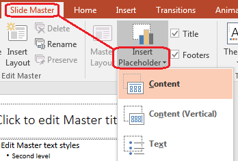

## **بررسی کلی**

یک **اسلاید مستر** تنظیمات طراحی مشترک برای یک گروه از اسلایدها را تعریف می‌کند. می‌تواند شامل اشکال عمومی، لوگوها، پس‌زمینه‌ها، سبک‌های متن، تنظیمات تم و تنظیمات پاورقی باشد. در PowerPoint، ویرایش اسلاید مستر روش معمول برای حفظ یکپارچگی ارائه بدون تکرار قالب‌بندی یکسان در هر اسلاید است.

Aspose.Slides for Node.js via Java مدل مشابهی را پشتیبانی می‌کند. یک ارائه می‌تواند یک یا چند اسلاید مستر داشته باشد و هر اسلاید مستر می‌تواند چندین اسلاید چینش را شامل شود. اسلایدهای عادی معمولاً به‌صورت مستقیم به اسلاید مستر ارجاع نمی‌دهند. در عوض، یک اسلاید عادی از یک اسلاید چینش استفاده می‌کند و آن اسلاید چینش متعلق به یک اسلاید مستر است.

سطح‌گذاری به شکل زیر است:

1. **اسلاید مستر** – تنظیمات طراحی و تم مشترک را تعریف می‌کند.  
1. **اسلاید چینش** – چیدمان خاصی از فضاهای نگهدارنده و قالب‌بندی‌های سطحی را تعریف می‌کند.  
1. **اسلاید عادی** – محتوای واقعی ارائه را دارد و از یک اسلاید چینش استفاده می‌کند.  


در Aspose.Slides، یک اسلاید مستر توسط کلاس [MasterSlide](https://reference.aspose.com/slides/fa/nodejs-java/aspose.slides/masterslide/) نمایش داده می‌شود. تمام اسلایدهای مستر در یک ارائه از طریق مجموعه `Presentation.getMasters()` در دسترس هستند.

{}

هنگامی که یک ویژگی در بیش از یک سطح تعریف شود، سطح خاص‌تر پیروز می‌شود. به عنوان مثال، اگر یک اسلاید مستر و یک اسلاید چینش هر دو پس‌زمینه‌ای تعریف کنند، اسلایدهای مبتنی بر آن چینش از پس‌زمینه چینش استفاده می‌کنند. برای اطلاعات بیشتر درباره اسلایدهای چینش، به [Apply or Change Slide Layouts](/nodejs-java/slide-layout/) مراجعه کنید.

{}

## **دسترسی به اسلایدهای مستر**

در PowerPoint، می‌توانید نمای اسلاید مستر را از **View** > **Slide Master** باز کنید.


در Aspose.Slides، از مجموعه `getMasters()` برای دسترسی به اسلایدهای مستر استفاده کنید:

```javascript
var aspose = aspose || {};
aspose.slides = require("aspose.slides.via.java");

let presentation = new aspose.slides.Presentation("presentation.pptx");
try {
    let firstMasterSlide = presentation.getMasters().get_Item(0);
    let masterSlideCount = presentation.getMasters().size();
    let firstMasterLayoutSlideCount = firstMasterSlide.getLayoutSlides().size();

    console.log("Master slides: " + masterSlideCount);
    console.log("Layouts in the first master: " + firstMasterLayoutSlideCount);
} finally {
    presentation.dispose();
}
```

همچنین می‌توانید اسلاید مستری که یک اسلاید عادی استفاده می‌کند را از طریق چینش آن به‌دست آورید:

```javascript
var aspose = aspose || {};
aspose.slides = require("aspose.slides.via.java");

let presentation = new aspose.slides.Presentation("presentation.pptx");
try {
    let slide = presentation.getSlides().get_Item(0);
    let layoutSlide = slide.getLayoutSlide();
    let masterSlide = layoutSlide.getMasterSlide();
    let masterSlideName = masterSlide.getName();

    console.log(masterSlideName);
} finally {
    presentation.dispose();
}
```

## **محتویات یک اسلاید مستر**

یک اسلاید مستر شیئی شبیه اسلاید است. it از رفتار مشترک اسلاید از [BaseSlide](https://reference.aspose.com/slides/fa/nodejs-java/aspose.slides/baseslide/) ارث می‌برد، بنابراین بسیاری از خواص اسلاید مشابه که توسط اسلایدهای عادی و چینش استفاده می‌شود را در اختیار دارد. اعضای خاص مستر در صفحه API [MasterSlide](https://reference.aspose.com/slides/fa/nodejs-java/aspose.slides/masterslide/) فهرست شده‌اند.

اعضای معمولاً استفاده‌شده اسلاید مستر عبارتند از:

| عضو | هدف |
| --- | --- |
| `getBackground()` | پس‌زمینه اسلاید در سطح مستر را تنظیم می‌کند. |
| `getShapes()` | اشکال قرار گرفته بر روی مستر را ذخیره می‌کند؛ مانند لوگوها، قاب‌های تصویر و متن‌های مشترک. |
| `getLayoutSlides()` | اسلایدهای چینش متعلق به مستر را نگهداری می‌کند. |
| `getThemeManager()` | دسترسی به APIهای تم مستر را فراهم می‌کند. |
| `getHeaderFooterManager()` | سرصفحه‌ها، پاورقی‌ها، تاریخ‌ها و شماره‌ اسلایدها را برای مستر و چینش‌های فرزند کنترل می‌کند. |
| `getDependingSlides()` | اسلایدهای عادی که از طریق چینش‌های خود به این مستر وابسته هستند را برمی‌گرداند. |

## **افزودن تصویر به اسلاید مستر**

زمانی که تصویری به یک اسلاید مستر اضافه می‌کنید، در اسلایدهایی که از چینش‌های آن مستر استفاده می‌کنند ظاهر می‌شود. این برای لوگوها، واترقاب‌ها، نواره‌های تزئینی و سایر عناصر بصری تکراری مفید است.

مثال زیر لوگویی را به اولین اسلاید مستر اضافه می‌کند:

```javascript
var aspose = aspose || {};
aspose.slides = require("aspose.slides.via.java");

let presentation = new aspose.slides.Presentation("presentation.pptx");
try {
    let masterSlide = presentation.getMasters().get_Item(0);
    let logo = aspose.slides.Images.fromFile("logo.png");

    try {
        let logoImage = presentation.getImages().addImage(logo);

        masterSlide.getShapes().addPictureFrame(
            aspose.slides.ShapeType.Rectangle,
            20,
            20,
            80,
            80,
            logoImage);
    } finally {
        logo.dispose();
    }

    presentation.save("presentation-with-logo.pptx", aspose.slides.SaveFormat.Pptx);
} finally {
    presentation.dispose();
}
```

برای اطلاعات بیشتر درباره قاب‌های تصویر، به [Picture Frame](/nodejs-java/picture-frame/) مراجعه کنید.

## **کار با فضاهای نگهدارنده**

فضاهای نگهدارنده معمولاً در اسلایدهای چینش تعریف می‌شوند. اسلاید مستر سبک و تم مشترکی را فراهم می‌کند که آن چینش‌ها به ارث می‌برند، در حالی که هر چینش تصمیم می‌گیرد کدام فضاهای نگهدارنده در دسترس هستند و در کجا قرار می‌گیرند.

در PowerPoint، دستورات فضاهای نگهدارنده در نمای اسلاید مستر موجود است.



برای افزودن فضاهای نگهدارنده جدید با Aspose.Slides، با اسلاید چینشی که به مستر تعلق دارد کار کنید:

```javascript
var aspose = aspose || {};
aspose.slides = require("aspose.slides.via.java");
const java = require("java");

let presentation = new aspose.slides.Presentation("presentation.pptx");
try {
    let masterSlide = presentation.getMasters().get_Item(0);
    let blankLayoutType = java.newByte(aspose.slides.SlideLayoutType.Blank);
    let blankLayoutSlide = masterSlide.getLayoutSlides().getByType(blankLayoutType);

    if (blankLayoutSlide === null) {
        blankLayoutSlide = masterSlide.getLayoutSlides().add(blankLayoutType, "Blank");
    }

    blankLayoutSlide.getPlaceholderManager().addTextPlaceholder(60, 120, 600, 80);

    presentation.getSlides().addEmptySlide(blankLayoutSlide);
    presentation.save("presentation-with-placeholder.pptx", aspose.slides.SaveFormat.Pptx);
} finally {
    presentation.dispose();
}
```

همچنین می‌توانید اشکال فضاهای نگهدارنده‌ای که قبلاً در اسلاید مستر موجود هستند را قالب‌بندی کنید. مثال زیر فضا نگهدارنده عنوان را پیدا کرده و یک پر کردن خطی گرادیان اعمال می‌کند:

```javascript
var aspose = aspose || {};
aspose.slides = require("aspose.slides.via.java");
const java = require("java");

let presentation = new aspose.slides.Presentation("presentation.pptx");
try {
    let masterSlide = presentation.getMasters().get_Item(0);
    let titlePlaceholder = null;
    let masterShapes = masterSlide.getShapes();
    let masterShapeCount = masterShapes.size();

    for (let masterShapeIndex = 0; masterShapeIndex < masterShapeCount; masterShapeIndex++) {
        let shape = masterShapes.get_Item(masterShapeIndex);

        if (java.instanceOf(shape, "com.aspose.slides.AutoShape")) {
            let placeholder = shape.getPlaceholder();

            if (placeholder !== null && placeholder.getType() === aspose.slides.PlaceholderType.Title) {
                titlePlaceholder = shape;
                break;
            }
        }
    }

    if (titlePlaceholder !== null) {
        let gradientFillType = java.newByte(aspose.slides.FillType.Gradient);
        let linearGradientShape = java.newByte(aspose.slides.GradientShape.Linear);
        let redGradientColor = java.newInstanceSync("java.awt.Color", 255, 0, 0);
        let purpleGradientColor = java.newInstanceSync("java.awt.Color", 128, 0, 128);

        titlePlaceholder.getFillFormat().setFillType(gradientFillType);
        titlePlaceholder.getFillFormat().getGradientFormat().setGradientShape(linearGradientShape);
        titlePlaceholder.getFillFormat().getGradientFormat().getGradientStops().add(0.0, redGradientColor);
        titlePlaceholder.getFillFormat().getGradientFormat().getGradientStops().add(1.0, purpleGradientColor);
    }

    presentation.save("presentation-title-style.pptx", aspose.slides.SaveFormat.Pptx);
} finally {
    presentation.dispose();
}
```


برای گزینه‌های بیشتر قالب‌بندی فضاهای نگهدارنده و متن، به [Set Prompt Text in Placeholder](/nodejs-java/manage-placeholder/) و [Text Formatting](/nodejs-java/text-formatting/) مراجعه کنید.

## **تغییر پس‌زمینه اسلاید مستر**

پس‌زمینه مستر توسط چینش‌ها و اسلایدهایی که آن را بازنویسی نمی‌کنند، ارث‌بری می‌شود. مثال زیر رنگ پس‌زمینه‌ی ثابت را برای اولین اسلاید مستر تنظیم می‌کند:

```javascript
var aspose = aspose || {};
aspose.slides = require("aspose.slides.via.java");
const java = require("java");

let presentation = new aspose.slides.Presentation("presentation.pptx");
try {
    let masterSlide = presentation.getMasters().get_Item(0);
    let ownBackgroundType = java.newByte(aspose.slides.BackgroundType.OwnBackground);
    let solidFillType = java.newByte(aspose.slides.FillType.Solid);
    let masterBackgroundColor = java.getStaticFieldValue("java.awt.Color", "GREEN");

    masterSlide.getBackground().setType(ownBackgroundType);
    masterSlide.getBackground().getFillFormat().setFillType(solidFillType);
    masterSlide.getBackground().getFillFormat().getSolidFillColor().setColor(masterBackgroundColor);

    presentation.save("presentation-master-background.pptx", aspose.slides.SaveFormat.Pptx);
} finally {
    presentation.dispose();
}
```

برای موضوعات مرتبط، به [Presentation Background](/nodejs-java/presentation-background/) و [Presentation Theme](/nodejs-java/presentation-theme/) مراجعه کنید.

## **کپی کردن اسلاید مستر به ارائه دیگر**

از `MasterSlideCollection.addClone` برای کپی یک اسلاید مستر به ارائه‌ای دیگر استفاده کنید. مستر کپی‌شده می‌تواند توسط چینش‌ها و اسلایدهای مقصد استفاده شود.

```javascript
var aspose = aspose || {};
aspose.slides = require("aspose.slides.via.java");

let sourcePresentation = new aspose.slides.Presentation("source.pptx");
let destinationPresentation = new aspose.slides.Presentation("destination.pptx");
try {
    let sourceMasterSlide = sourcePresentation.getMasters().get_Item(0);
    let clonedMasterSlide = destinationPresentation.getMasters().addClone(sourceMasterSlide);

    destinationPresentation.save("destination-with-master.pptx", aspose.slides.SaveFormat.Pptx);
} finally {
    sourcePresentation.dispose();
    destinationPresentation.dispose();
}
```

اگر نیاز دارید اسلایدهای عادی را به‌همراه مسترشان کپی کنید، به [Clone Slides](/nodejs-java/clone-slides/) نگاه کنید.

## **افزودن چندین اسلاید مستر**

یک ارائه می‌تواند شامل چندین اسلاید مستر باشد. این برای بخش‌هایی که نیاز به برندینگ، ساختار صفحه یا تنظیمات تم متفاوت دارند مفید است.


مثال زیر مستر پیش‌فرض را کلون می‌کند، به کلون پس‌زمینه‌ای متفاوت می‌دهد، زیر آن یک چینش ایجاد می‌کند و اسلاید جدیدی بر پایه آن چینش اضافه می‌کند:

```javascript
var aspose = aspose || {};
aspose.slides = require("aspose.slides.via.java");
const java = require("java");

let presentation = new aspose.slides.Presentation("presentation.pptx");
try {
    let defaultMasterSlide = presentation.getMasters().get_Item(0);
    let sectionMasterSlide = presentation.getMasters().addClone(defaultMasterSlide);
    let ownBackgroundType = java.newByte(aspose.slides.BackgroundType.OwnBackground);
    let solidFillType = java.newByte(aspose.slides.FillType.Solid);
    let sectionMasterBackgroundColor = java.getStaticFieldValue("java.awt.Color", "LIGHT_GRAY");

    sectionMasterSlide.getBackground().setType(ownBackgroundType);
    sectionMasterSlide.getBackground().getFillFormat().setFillType(solidFillType);
    sectionMasterSlide.getBackground().getFillFormat().getSolidFillColor().setColor(sectionMasterBackgroundColor);

    let blankLayoutType = java.newByte(aspose.slides.SlideLayoutType.Blank);
    let sourceBlankLayout = defaultMasterSlide.getLayoutSlides().getByType(blankLayoutType);
    if (sourceBlankLayout === null) {
        sourceBlankLayout = defaultMasterSlide.getLayoutSlides().get_Item(0);
    }

    let sectionBlankLayout = sectionMasterSlide.getLayoutSlides().addClone(sourceBlankLayout);

    presentation.getSlides().addEmptySlide(sectionBlankLayout);
    presentation.save("presentation-with-multiple-masters.pptx", aspose.slides.SaveFormat.Pptx);
} finally {
    presentation.dispose();
}
```

## **مقایسه اسلایدهای مستر**

اسلایدهای مستر می‌توانند با متد `equals` که از [BaseSlide](https://reference.aspose.com/slides/fa/nodejs-java/aspose.slides/baseslide/) به ارث برده شده، مقایسه شوند. مقایسه ساختار و محتوای ثابت مانند اشکال، متن، قالب‌بندی، انیمیشن‌ها و سایر تنظیمات اسلاید را بررسی می‌کند. شناسه‌های یکتا مانند شناسه اسلاید یا مقادیر پویا مانند تاریخ جاری را مقایسه نمی‌کند.

```javascript
var aspose = aspose || {};
aspose.slides = require("aspose.slides.via.java");

let firstPresentation = new aspose.slides.Presentation("first.pptx");
let secondPresentation = new aspose.slides.Presentation("second.pptx");
try {
    let firstPresentationMasterCount = firstPresentation.getMasters().size();
    let secondPresentationMasterCount = secondPresentation.getMasters().size();

    for (let firstMasterIndex = 0; firstMasterIndex < firstPresentationMasterCount; firstMasterIndex++) {
        for (let secondMasterIndex = 0; secondMasterIndex < secondPresentationMasterCount; secondMasterIndex++) {
            let firstMasterSlide = firstPresentation.getMasters().get_Item(firstMasterIndex);
            let secondMasterSlide = secondPresentation.getMasters().get_Item(secondMasterIndex);
            let areMasterSlidesEqual = firstMasterSlide.equals(secondMasterSlide);

            if (areMasterSlidesEqual) {
                console.log(
                    "first.pptx master #" + firstMasterIndex +
                    " equals second.pptx master #" + secondMasterIndex);
            }
        }
    }
} finally {
    firstPresentation.dispose();
    secondPresentation.dispose();
}
```

برای اطلاعات بیشتر، به [Compare Presentation Slides](/slides/fa/nodejs-java/compare-slides/) مراجعه کنید.

## **تنظیم نمای اسلاید مستر به عنوان نمای پیش‌فرض**

از متد `setLastView` در [ViewProperties](https://reference.aspose.com/slides/fa/nodejs-java/aspose.slides/viewproperties/) برای کنترل نمایی که PowerPoint ابتدا باز می‌کند استفاده کنید. مثال زیر ارائه را در نمای اسلاید مستر باز می‌کند:

```javascript
var aspose = aspose || {};
aspose.slides = require("aspose.slides.via.java");
const java = require("java");

let presentation = new aspose.slides.Presentation("presentation.pptx");
try {
    let slideMasterViewType = java.newByte(aspose.slides.ViewType.SlideMasterView);

    presentation.getViewProperties().setLastView(slideMasterViewType);
    presentation.save("presentation-master-view.pptx", aspose.slides.SaveFormat.Pptx);
} finally {
    presentation.dispose();
}
```

برای تنظیمات بیشتر نمای، به [Save Presentation](/slides/fa/nodejs-java/save-presentation/) نگاه کنید.

## **حذف اسلایدهای مستر استفاده‌نشده**

گاهی ارائه‌ها شامل اسلایدهای مستری می‌شوند که دیگر توسط هیچ اسلاید عادی استفاده نمی‌شوند. حذف مسترهای استفاده‌نشده می‌تواند حجم فایل را کاهش دهد و نگهداری الگو را ساده‌تر کند.

از `removeUnused` برای حذف مسترهای استفاده‌نشده از مجموعه `getMasters()` استفاده کنید:

```javascript
var aspose = aspose || {};
aspose.slides = require("aspose.slides.via.java");

let presentation = new aspose.slides.Presentation("presentation.pptx");
try {
    presentation.getMasters().removeUnused(true);
    presentation.save("presentation-clean.pptx", aspose.slides.SaveFormat.Pptx);
} finally {
    presentation.dispose();
}
```

همچنین می‌توانید از متد کم‌کد `Compress.removeUnusedMasterSlides` استفاده کنید:

```javascript
var aspose = aspose || {};
aspose.slides = require("aspose.slides.via.java");

let presentation = new aspose.slides.Presentation("presentation.pptx");
try {
    aspose.slides.Compress.removeUnusedMasterSlides(presentation);
    presentation.save("presentation-clean.pptx", aspose.slides.SaveFormat.Pptx);
} finally {
    presentation.dispose();
}
```

## **سؤال‌های متداول**

### تفاوت اسلاید مستر و اسلاید چینش چیست؟

یک اسلاید مستر تنظیمات طراحی مشترک مانند تم، پس‌زمینه، اشکال عمومی و سبک‌های متن را تعریف می‌کند. یک اسلاید چینش متعلق به یک اسلاید مستر است و چیدمان خاصی از فضاهای نگهدارنده را تعیین می‌کند. یک اسلاید عادی از یک اسلاید چینش استفاده می‌کند، بنابراین از هر دو چینش و مستر ارث می‌برد.

### آیا یک ارائه می‌تواند چندین اسلاید مستر داشته باشد؟

بله. یک ارائه می‌تواند چندین اسلاید مستر داشته باشد. هنگام نیاز به سیستم‌های بصری یا برندینگ متفاوت در بخش‌های مختلف، از مسترهای متعدد استفاده کنید.

### آیا فضاهای نگهدارنده را باید به اسلاید مستر اضافه کنم یا به اسلاید چینش؟

در اکثر موارد، فضاهای نگهدارنده را به اسلایدهای چینش اضافه کنید. عناصر بصری مشترک و قالب‌بندی‌های عمومی را در اسلاید مستر بگذارید و سپس فضاهای محتوا را در چینش‌هایی که اسلایدهای عادی استفاده می‌کنند، قرار دهید.

### آیا می‌توانم اسلاید مستری را که هنوز استفاده می‌شود حذف کنم؟

نه. اسلاید مستری که اسلایدهای وابسته دارد نمی‌تواند به‌صورت مستقیم حذف شود. ابتدا آن اسلایدها را به چینش‌های زیر مستر دیگری منتقل کنید یا از روش پاکسازی مسترهای استفاده‑نشده استفاده کنید که فقط مسترهای غیر‌قابل استفاده را حذف می‌کند.