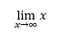

## **بررسی کلی**

PowerPoint معادلات را به صورت زبان علامت‌گذاری ریاضی آفیس (OMML) ذخیره می‌کند. با Aspose.Slides برای PHP از طریق Java، می‌توانید همان نوع محتویات ریاضی را به‌صورت برنامه‌نویسی ایجاد کنید: کسرها، رادیکال‌ها، توابع، حدود، عملگرهای N‑ary، ماتریس‌ها، آرایه‌ها و بلوک‌های ریاضی قالب‌بندی‌شده.

در PowerPoint، کاربران معمولاً معادلات را از **Insert > Equation** اضافه می‌کنند:


نتیجه متن ریاضی قابل ویرایش بر روی اسلاید است:


Aspose.Slides این متن ریاضی را از طریق سه شیء اصلی می‌سازد:

- یک شکل ریاضی که با [addMathShape](https://reference.aspose.com/slides/fa/php-java/aspose.slides/shapecollection/#addMathShape) ایجاد می‌شود، شکلی است که معادله را در خود دارد.
- [MathPortion](https://reference.aspose.com/slides/fa/php-java/aspose.slides/mathportion/) محتویات ریاضی را داخل فریم متن شکل ذخیره می‌کند.
- [MathParagraph](https://reference.aspose.com/slides/fa/php-java/aspose.slides/mathparagraph/) شامل یک یا چند شیء [MathBlock](https://reference.aspose.com/slides/fa/php-java/aspose.slides/mathblock/) است.

اکثر مثال‌های زیر از [MathematicalText](https://reference.aspose.com/slides/fa/php-java/aspose.slides/mathematicaltext/) و متدهای زنجیره‌ای [MathElementBase](https://reference.aspose.com/slides/fa/php-java/aspose.slides/mathelementbase/) برای کوتاه و قابل‌خواندن نگه داشتن کد استفاده می‌کنند.

برای سناریوهای خروجی MathML، به [صادر کردن معادلات ریاضی از ارائه‌ها در PHP از طریق Java](/slides/fa/php-java/exporting-math-equations/) مراجعه کنید.

## **ایجاد معادله**

این مثال یک شکل ریاضی ایجاد می‌کند و قضیه فیثاغورث را اضافه می‌کند:


```php
$presentation = new Presentation();
try {
    $slide = $presentation->getSlides()->get_Item(0);

    $mathShape = $slide->getShapes()->addMathShape(20, 20, 700, 120);
    $mathParagraph = $mathShape->getTextFrame()->getParagraphs()
        - >get_Item(0)->getPortions()->get_Item(0)->getMathParagraph();

    $equation = (new MathematicalText("c"))
        - >setSuperscript("2")
        - >join("=")
        - >join((new MathematicalText("a"))->setSuperscript("2"))
        - >join("+")
        - >join((new MathematicalText("b"))->setSuperscript("2"));

    $mathParagraph->add($equation);

    $presentation->save("pythagorean-theorem.pptx", SaveFormat::Pptx);
} finally {
    if (!java_is_null($presentation)) {
        $presentation->dispose();
    }
}
```

{}
`addMathShape` یک شکل را ایجاد می‌کند که از پیش شامل یک MathParagraph است. به اولین `MathPortion` دسترسی پیدا کنید، `MathParagraph` آن را دریافت کنید، و بلوک‌های ریاضی یا عناصر ریاضی را به آن اضافه کنید.
{}

## **افزودن کسرها**

از [`divide`](https://reference.aspose.com/slides/fa/php-java/aspose.slides/mathelementbase/) برای ایجاد یک کسر استفاده کنید. می‌توانید سبک کسر را با [MathFractionTypes](https://reference.aspose.com/slides/fa/php-java/aspose.slides/mathfractiontypes/) انتخاب کنید.


```php
$presentation = new Presentation();
try {
    $slide = $presentation->getSlides()->get_Item(0);

    $mathShape = $slide->getShapes()->addMathShape(20, 20, 700, 100);
    $mathParagraph = $mathShape->getTextFrame()->getParagraphs()
        - >get_Item(0)->getPortions()->get_Item(0)->getMathParagraph();

    $fraction = (new MathematicalText("1"))
        - >divide("x", MathFractionTypes::Skewed);

    $mathParagraph->add(new MathBlock($fraction));

    $presentation->save("fraction.pptx", SaveFormat::Pptx);
} finally {
    if (!java_is_null($presentation)) {
        $presentation->dispose();
    }
}
```

برای یک کسر روی‌هم‌چیده، از `MathFractionTypes::Bar` استفاده کنید:

```php
$stackedFraction = (new MathematicalText("x + 1"))->divide("y - 1", MathFractionTypes::Bar);
```

## **افزودن رادیکال‌ها**

از [`radical`](https://reference.aspose.com/slides/fa/php-java/aspose.slides/mathelementbase/) برای ایجاد ریشه مربع، ریشه مکعب یا ریشه‌های دیگر استفاده کنید. عنصر جاری به عنوان پایه می‌شود و آرگومان به‌عنوان درجه.


```php
$presentation = new Presentation();
try {
    $slide = $presentation->getSlides()->get_Item(0);

    $mathShape = $slide->getShapes()->addMathShape(20, 20, 700, 100);
    $mathParagraph = $mathShape->getTextFrame()->getParagraphs()
        - >get_Item(0)->getPortions()->get_Item(0)->getMathParagraph();

    $radical = (new MathematicalText("x"))
        - >radical("n");

    $mathParagraph->add(new MathBlock($radical));

    $presentation->save("radical.pptx", SaveFormat::Pptx);
} finally {
    if (!java_is_null($presentation)) {
        $presentation->dispose();
    }
}
```

## **افزودن توابع و حدود**

از [`asArgumentOfFunction`](https://reference.aspose.com/slides/fa/php-java/aspose.slides/mathelementbase/) یا [`function`](https://reference.aspose.com/slides/fa/php-java/aspose.slides/mathelementbase/) برای توابعی مانند `sin(x)`, `log(x)` یا نام‌های تابع سفارشی استفاده کنید. برای حدود، `lim` را در یک [MathLimit](https://reference.aspose.com/slides/fa/php-java/aspose.slides/mathlimit/) قرار دهید یا از [`setLowerLimit`](https://reference.aspose.com/slides/fa/php-java/aspose.slides/mathelementbase/) استفاده کنید.



```php
$presentation = new Presentation();
try {
    $slide = $presentation->getSlides()->get_Item(0);

    $mathShape = $slide->getShapes()->addMathShape(20, 20, 700, 100);
    $mathParagraph = $mathShape->getTextFrame()->getParagraphs()
        - >get_Item(0)->getPortions()->get_Item(0)->getMathParagraph();

    $limit = (new MathematicalText("lim"))
        - >setLowerLimit("x\u{2192}\u{221E}")
        - >function("x");

    $mathParagraph->add(new MathBlock($limit));

    $presentation->save("functions-and-limits.pptx", SaveFormat::Pptx);
} finally {
    if (!java_is_null($presentation)) {
        $presentation->dispose();
    }
}
```

برای یک نام تابع سفارشی، نام تابع را عنصر جاری کنید:

```php
$customFunction = (new MathematicalText("f"))->function("x + 1");
```

## **افزودن عملگرهای N‑ary و انتگرال‌ها**

از [`nary`](https://reference.aspose.com/slides/fa/php-java/aspose.slides/mathelementbase/) برای جمع‌ها، اتحادها، اشتراک‌ها و سایر عملگرهای بزرگ استفاده کنید. از [`integral`](https://reference.aspose.com/slides/fa/php-java/aspose.slides/mathelementbase/) برای انتگرال‌ها استفاده کنید. هر دو متد امکان تنظیم حدود پایینی و بالایی را می‌دهند.


```php
$presentation = new Presentation();
try {
    $slide = $presentation->getSlides()->get_Item(0);

    $mathShape = $slide->getShapes()->addMathShape(20, 20, 700, 120);
    $mathParagraph = $mathShape->getTextFrame()->getParagraphs()
        - >get_Item(0)->getPortions()->get_Item(0)->getMathParagraph();

    $summationBase = (new MathematicalText("x"))
        - >setSuperscript("k")
        - >join((new MathematicalText("a"))->setSuperscript("n-k"));

    $summation = $summationBase->nary(MathNaryOperatorTypes::Summation, "k=0", "n");

    $mathParagraph->add(new MathBlock($summation));

    $presentation->save("nary-operators.pptx", SaveFormat::Pptx);
} finally {
    if (!java_is_null($presentation)) {
        $presentation->dispose();
    }
}
```

عملگرهای N‑ary برای عملگرهای بزرگ با حدود اختیاری هستند. عملگرهای ساده مانند `+`, `-` و `=` معمولاً به‌عنوان `MathematicalText` اضافه می‌شوند و به عبارت ترکیب می‌شوند.

برای یک انتگرال، از `integral` استفاده کنید:

```php
$integralBase = (new MathematicalText("x"))->join((new MathematicalText("dx"))->toBox());
$integral = $integralBase->integral(MathIntegralTypes::Simple, "0", "1");
```

## **افزودن ماتریس‌ها**

از [MathMatrix](https://reference.aspose.com/slides/fa/php-java/aspose.slides/mathmatrix/) برای ردیف‌ها و ستون‌ها استفاده کنید. ماتریس‌ها به‌طور پیش‌فرض براکت ندارند، بنابراین هنگامی که به پرانتز، براکت یا کروشه نیاز دارید، ماتریس را درون آن‌ها بپیچید.


```php
$presentation = new Presentation();
try {
    $slide = $presentation->getSlides()->get_Item(0);

    $mathShape = $slide->getShapes()->addMathShape(20, 20, 700, 120);
    $mathParagraph = $mathShape->getTextFrame()->getParagraphs()
        - >get_Item(0)->getPortions()->get_Item(0)->getMathParagraph();

    $matrix = new MathMatrix(2, 3);
    $matrix->set_Item(0, 0, new MathematicalText("1"));
    $matrix->set_Item(0, 1, new MathematicalText("x"));
    $matrix->set_Item(1, 0, new MathematicalText("x"));
    $matrix->set_Item(1, 1, new MathematicalText("2"));
    $matrix->set_Item(1, 2, new MathematicalText("y"));

    $mathParagraph->add(new MathBlock($matrix));

    $presentation->save("matrix.pptx", SaveFormat::Pptx);
} finally {
    if (!java_is_null($presentation)) {
        $presentation->dispose();
    }
}
```

## **افزودن آرایه‌های معادله**

از [`toMathArray`](https://reference.aspose.com/slides/fa/php-java/aspose.slides/mathelementbase/) وقتی به معادلات هم‌تراز یا یک پشته عمودی از عبارات نیاز دارید استفاده کنید.


```php
$presentation = new Presentation();
try {
    $slide = $presentation->getSlides()->get_Item(0);

    $mathShape = $slide->getShapes()->addMathShape(20, 20, 700, 140);
    $mathParagraph = $mathShape->getTextFrame()->getParagraphs()
        - >get_Item(0)->getPortions()->get_Item(0)->getMathParagraph();

    $equationArray = (new MathematicalText("x"))
        - >join("y")
        - >toMathArray();

    $mathParagraph->add(new MathBlock($equationArray));

    $presentation->save("equation-array.pptx", SaveFormat::Pptx);
} finally {
    if (!java_is_null($presentation)) {
        $presentation->dispose();
    }
}
```

## **افزودن توابع مثلثاتی**

از [`asArgumentOfFunction`](https://reference.aspose.com/slides/fa/php-java/aspose.slides/mathelementbase/) وقتی که آرگومان عنصر جاری است و نام تابع شناخته شده است استفاده کنید.


```php
$presentation = new Presentation();
try {
    $slide = $presentation->getSlides()->get_Item(0);

    $mathShape = $slide->getShapes()->addMathShape(20, 20, 700, 100);
    $mathParagraph = $mathShape->getTextFrame()->getParagraphs()
        - >get_Item(0)->getPortions()->get_Item(0)->getMathParagraph();

    $cosine = (new MathematicalText("2x"))
        - >asArgumentOfFunction(MathFunctionsOfOneArgument::Cos);

    $mathParagraph->add(new MathBlock($cosine));

    $presentation->save("trigonometric-function.pptx", SaveFormat::Pptx);
} finally {
    if (!java_is_null($presentation)) {
        $presentation->dispose();
    }
}
```

## **افزودن زیرنویس و بالانویس**

از کمک‌کنندگان زیرنویس و بالانویس برای شاخص‌ها و توان‌ها استفاده کنید. وقتی شاخص‌ها باید در سمت چپ پایه ظاهر شوند، از [`setSubSuperscriptOnTheLeft`](https://reference.aspose.com/slides/fa/php-java/aspose.slides/mathelementbase/) استفاده کنید.


```php
$presentation = new Presentation();
try {
    $slide = $presentation->getSlides()->get_Item(0);

    $mathShape = $slide->getShapes()->addMathShape(20, 20, 700, 100);
    $mathParagraph = $mathShape->getTextFrame()->getParagraphs()
        - >get_Item(0)->getPortions()->get_Item(0)->getMathParagraph();

    $scripts = (new MathematicalText("Y"))
        - >setSubSuperscriptOnTheLeft("1", "n");

    $mathParagraph->add(new MathBlock($scripts));

    $presentation->save("subscript-superscript.pptx", SaveFormat::Pptx);
} finally {
    if (!java_is_null($presentation)) {
        $presentation->dispose();
    }
}
```

## **افزودن جداکننده‌ها**

از [`enclose`](https://reference.aspose.com/slides/fa/php-java/aspose.slides/mathelementbase/) برای قرار دادن یک عبارت داخل جداکننده‌ها استفاده کنید. می‌توانید کاراکتر جداساز را برای عبارات دارای چند عنصر نیز تنظیم کنید.


```php
$presentation = new Presentation();
try {
    $slide = $presentation->getSlides()->get_Item(0);

    $mathShape = $slide->getShapes()->addMathShape(20, 20, 700, 100);
    $mathParagraph = $mathShape->getTextFrame()->getParagraphs()
        - >get_Item(0)->getPortions()->get_Item(0)->getMathParagraph();

    $delimiter = (new MathematicalText("x"))
        - >join("y")
        - >join("z")
        - >enclose(new Java("java.lang.Character", "<"), new Java("java.lang.Character", ">"));
    $delimiter->setSeparatorCharacter(new Java("java.lang.Character", "|"));

    $mathParagraph->add(new MathBlock($delimiter));

    $presentation->save("delimiters.pptx", SaveFormat::Pptx);
} finally {
    if (!java_is_null($presentation)) {
        $presentation->dispose();
    }
}
```

## **افزودن جعبه حاشیه‌دار**

از [`toBorderBox`](https://reference.aspose.com/slides/fa/php-java/aspose.slides/mathelementbase/) وقتی که خود معادله باید قاب‌بندی شود استفاده کنید.


```php
$presentation = new Presentation();
try {
    $slide = $presentation->getSlides()->get_Item(0);

    $mathShape = $slide->getShapes()->addMathShape(20, 20, 700, 100);
    $mathParagraph = $mathShape->getTextFrame()->getParagraphs()
        - >get_Item(0)->getPortions()->get_Item(0)->getMathParagraph();

    $boxedEquation = (new MathematicalText("a"))
        - >setSuperscript("2")
        - >join("=")
        - >join((new MathematicalText("b"))->setSuperscript("2"))
        - >join("+")
        - >join((new MathematicalText("c"))->setSuperscript("2"))
        - >toBorderBox();

    $mathParagraph->add(new MathBlock($boxedEquation));

    $presentation->save("border-box.pptx", SaveFormat::Pptx);
} finally {
    if (!java_is_null($presentation)) {
        $presentation->dispose();
    }
}
```

## **گروه‌بندی عبارات**

از [`group`](https://reference.aspose.com/slides/fa/php-java/aspose.slides/mathelementbase/) برای قرار دادن یک کاراکتر گروه‌بندی بالا یا پایین یک عبارت استفاده کنید. برای برچسب‌گذاری عبارات گروه‌بندی‌شده می‌توانید یک حد اضافه کنید.


```php
$presentation = new Presentation();
try {
    $slide = $presentation->getSlides()->get_Item(0);

    $mathShape = $slide->getShapes()->addMathShape(20, 20, 700, 120);
    $mathParagraph = $mathShape->getTextFrame()->getParagraphs()
        - >get_Item(0)->getPortions()->get_Item(0)->getMathParagraph();

    $grouped = (new MathematicalText("x + y"))
        - >group(new Java("java.lang.Character", "\u{23DF}"), MathTopBotPositions::Bottom, MathTopBotPositions::Top)
        - >setLowerLimit("any text");

    $mathParagraph->add(new MathBlock($grouped));

    $presentation->save("grouped-terms.pptx", SaveFormat::Pptx);
} finally {
    if (!java_is_null($presentation)) {
        $presentation->dispose();
    }
}
```

## **قالب‌بندی عناصر ریاضی**

از کمک‌کنندگان قالب‌بندی فقط در جایی استفاده کنید که فرمول را واضح‌تر می‌کند. به عنوان مثال، [`overbar`](https://reference.aspose.com/slides/fa/php-java/aspose.slides/mathelementbase/) یک خط بالای عنصر ریاضی می‌گذارد.


```php
$presentation = new Presentation();
try {
    $slide = $presentation->getSlides()->get_Item(0);

    $mathShape = $slide->getShapes()->addMathShape(20, 20, 700, 100);
    $mathParagraph = $mathShape->getTextFrame()->getParagraphs()
        - >get_Item(0)->getPortions()->get_Item(0)->getMathParagraph();

    $overbar = (new MathematicalText("ABC"))->overbar();

    $mathParagraph->add(new MathBlock($overbar));

    $presentation->save("overbar.pptx", SaveFormat::Pptx);
} finally {
    if (!java_is_null($presentation)) {
        $presentation->dispose();
    }
}
```

## **مرجع سریع**

| کار | API اصلی |
| --- | --- |
| ایجاد متن ریاضی | [MathematicalText](https://reference.aspose.com/slides/fa/php-java/aspose.slides/mathematicaltext/) |
| ترکیب عناصر | [join](https://reference.aspose.com/slides/fa/php-java/aspose.slides/mathelementbase/) |
| ایجاد کسرها | [divide](https://reference.aspose.com/slides/fa/php-java/aspose.slides/mathelementbase/) |
| افزودن بالانویس یا زیرنویس | [setSuperscript](https://reference.aspose.com/slides/fa/php-java/aspose.slides/mathelementbase/), [setSubscript](https://reference.aspose.com/slides/fa/php-java/aspose.slides/mathelementbase/) |
| افزودن توابع | [function](https://reference.aspose.com/slides/fa/php-java/aspose.slides/mathelementbase/), [asArgumentOfFunction](https://reference.aspose.com/slides/fa/php-java/aspose.slides/mathelementbase/) |
| افزودن رادیکال‌ها | [radical](https://reference.aspose.com/slides/fa/php-java/aspose.slides/mathelementbase/) |
| افزودن حدود | [setLowerLimit](https://reference.aspose.com/slides/fa/php-java/aspose.slides/mathelementbase/), [setUpperLimit](https://reference.aspose.com/slides/fa/php-java/aspose.slides/mathelementbase/) |
| افزودن اسکریپت‌های سمت چپ | [setSubSuperscriptOnTheLeft](https://reference.aspose.com/slides/fa/php-java/aspose.slides/mathelementbase/) |
| افزودن مجموع‌ها و انتگرال‌ها | [nary](https://reference.aspose.com/slides/fa/php-java/aspose.slides/mathelementbase/), [integral](https://reference.aspose.com/slides/fa/php-java/aspose.slides/mathelementbase/) |
| افزودن ماتریس‌ها | [MathMatrix](https://reference.aspose.com/slides/fa/php-java/aspose.slides/mathmatrix/) |
| افزودن آرایه‌های معادله | [toMathArray](https://reference.aspose.com/slides/fa/php-java/aspose.slides/mathelementbase/) |
| افزودن جداکننده‌ها | [enclose](https://reference.aspose.com/slides/fa/php-java/aspose.slides/mathelementbase/) |
| افزودن خط‌ها و حاشیه‌ها | [overbar](https://reference.aspose.com/slides/fa/php-java/aspose.slides/mathelementbase/), [toBorderBox](https://reference.aspose.com/slides/fa/php-java/aspose.slides/mathelementbase/) |
| گروه‌بندی عبارات | [group](https://reference.aspose.com/slides/fa/php-java/aspose.slides/mathelementbase/) |

## **پرسش‌های متداول**

**آیا می‌توانم یک معادله موجود در PowerPoint را ویرایش کنم؟**

بله. ارائه را باز کنید، شکل حاوی `MathPortion` را پیدا کنید، `MathParagraph` آن را دریافت کنید و بلوک‌های ریاضی در آن پاراگراف را به‌روزرسانی کنید.

**آیا معادلات به‌صورت ریاضی قابل ویرایش PowerPoint ذخیره می‌شوند؟**

بله. هنگام ذخیره به PPTX، Aspose.Slides معادله را به‌عنوان محتویات ریاضی Office قابل ویرایش می‌نویسد.

**آیا می‌توانم معادلات را به LaTeX صادر کنم؟**

Aspose.Slides معادلات ریاضی را به MathML صادر می‌کند. اگر به LaTeX نیاز دارید، ابتدا به MathML صادر کنید و سپس MathML را با ابزاری که از گویش LaTeX هدف پشتیبانی می‌کند، تبدیل نمایید.