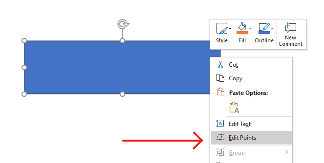

## **نمای کلی**

این مقاله توضیح می‌دهد که چگونه می‌توان اشکال ارائه در Aspose.Slides را با ویرایش هندسهٔ شکل از طریق نقاط و مسیرهای هندسی سفارشی کرد. نشان می‌دهد چگونه با استفاده از `GeometryPath` شکل‌های موجود را تغییر داده، عملیات پایهٔ ویرایش مسیر را انجام داده، نقاط را اضافه یا حذف کرده و هندسه به‌روزشده را به شکل اعمال کنید.

همچنین نحوهٔ ایجاد اشکال سفارشی و ترکیبی، ساخت اشکال با گوشه‌های منحنی، تعیین اینکه آیا هندسهٔ یک شکل بسته است یا خیر، و تبدیل بین `GeometryPath` و `java.awt.Shape` برای سناریوهای سفارشی‌سازی هندسهٔ اضافی را نشان می‌دهد.

## **تغییر یک شکل با استفاده از نقاط ویرایشی**
یک مربع را در نظر بگیرید. در PowerPoint، با استفاده از **نقاط ویرایشی** می‌توانید  

* گوشهٔ مربع را به داخل یا خارج حرکت دهید  
* انحنای یک گوشه یا نقطه را مشخص کنید  
* نقاط جدیدی به مربع اضافه کنید  
* نقاط مربع را دستکاری کنید و غیره.  

به طور اساسی می‌توانید این کارها را بر روی هر شکلی انجام دهید. با استفاده از نقاط ویرایشی می‌توانید یک شکل را تغییر داده یا یک شکل جدید از شکل موجود ایجاد کنید.

## **نکات ویرایش شکل**



قبل از اینکه شروع به ویرایش اشکال PowerPoint از طریق نقاط ویرایشی کنید، ممکن است بخواهید این نکات را دربارهٔ اشکال در نظر بگیرید:

* یک شکل (یا مسیر آن) می‌تواند بسته یا باز باشد.  
* وقتی یک شکل بسته است، نقطهٔ شروع یا پایان ندارد. وقتی یک شکل باز است، نقطهٔ شروع و پایان دارد.  
* تمام اشکال حداقل از ۲ نقطهٔ لنگر تشکیل شده‌اند که با خطوط به یکدیگر متصل می‌شوند.  
* یک خط می‌تواند مستقیم یا منحنی باشد. نقاط لنگر طبیعت خط را تعیین می‌کنند.  
* نقاط لنگر به عنوان نقاط گوشه، نقاط مستقیم یا نقاط صاف وجود دارند:  
  * یک نقطهٔ گوشه نقطه‌ای است که در آن دو خط مستقیم با یک زاویه به هم می‌پیوندند.  
  * یک نقطهٔ صاف نقطه‌ای است که در آن دو کنترل (هندل) در یک خط مستقیم قرار دارند و بخش‌های خط به صورت یک منحنی صاف به هم می‌پیوندند. در این حالت تمام هندل‌ها با فاصلهٔ مساوی از نقطهٔ لنگر جدا شده‌اند.  
  * یک نقطهٔ مستقیم نقطه‌ای است که در آن دو هندل در یک خط مستقیم قرار دارند و بخش‌های خط به صورت یک منحنی صاف به هم می‌پیوندند. در این حالت نیازی نیست هندل‌ها با فاصلهٔ مساوی از نقطهٔ لنگر جدا شوند.  
* با جابه‌جایی یا ویرایش نقاط لنگر (که زاویهٔ خطوط را تغییر می‌دهد) می‌توانید ظاهر یک شکل را تغییر دهید.  

برای ویرایش اشکال PowerPoint از طریق نقاط ویرایشی، **Aspose.Slides** کلاس [**GeometryPath**](https://reference.aspose.com/slides/fa/php-java/aspose.slides/GeometryPath) را فراهم می‌کند.

* یک نمونهٔ [GeometryPath](https://reference.aspose.com/slides/fa/php-java/aspose.slides/GeometryPath) مسیر هندسی شیء [GeometryShape](https://reference.aspose.com/slides/fa/php-java/aspose.slides/geometryshape/) را نمایان می‌سازد.  
* برای دریافت `GeometryPath` از نمونهٔ `GeometryShape` می‌توانید از روش [GeometryShape::getGeometryPaths](https://reference.aspose.com/slides/fa/php-java/aspose.slides/geometryshape/#getGeometryPaths) استفاده کنید.  
* برای تنظیم `GeometryPath` برای یک شکل، می‌توانید از این روش‌ها استفاده کنید: [GeometryShape::setGeometryPath](https://reference.aspose.com/slides/fa/php-java/aspose.slides/geometryshape/#setGeometryPath) برای *شکل‌های ثابت* و [GeometryShape::setGeometryPaths](https://reference.aspose.com/slides/fa/php-java/aspose.slides/geometryshape/#setGeometryPaths) برای *شکل‌های ترکیبی*.  
* برای افزودن بخش‌ها می‌توانید از روش‌های موجود در [GeometryPath](https://reference.aspose.com/slides/fa/php-java/aspose.slides/geometrypath/) استفاده کنید.  
* با استفاده از روش‌های [GeometryPath::setStroke](https://reference.aspose.com/slides/fa/php-java/aspose.slides/geometrypath/setstroke/) و [GeometryPath::setFillMode](https://reference.aspose.com/slides/fa/php-java/aspose.slides/geometrypath/setfillmode/) می‌توانید ظاهر یک مسیر هندسی را تنظیم کنید.  
* با استفاده از روش [GeometryPath::getPathData](https://reference.aspose.com/slides/fa/php-java/aspose.slides/geometrypath/getpathdata/) می‌توانید مسیر هندسی یک `GeometryShape` را به‌صورت آرایه‌ای از بخش‌های مسیر بازیابی کنید.  
* برای دسترسی به گزینه‌های سفارشی‌سازی هندسهٔ شکل بیشتر، می‌توانید [GeometryPath](https://reference.aspose.com/slides/fa/php-java/aspose.slides/geometrypath/) را به [java.awt.Shape](https://docs.oracle.com/javase/7/docs/api/php-java/awt/Shape.html) تبدیل کنید.  
* از روش‌های [geometryPathToGraphicsPath](https://reference.aspose.com/slides/fa/php-java/aspose.slides/shapeutil/geometrypathtographicspath/) و [graphicsPathToGeometryPath](https://reference.aspose.com/slides/fa/php-java/aspose.slides/shapeutil/graphicspathtogeometrypath/) (از کلاس [ShapeUtil](https://reference.aspose.com/slides/fa/php-java/aspose.slides/ShapeUtil)) برای تبدیل دوطرفهٔ [GeometryPath](https://reference.aspose.com/slides/fa/php-java/aspose.slides/geometrypath/) به [java.awt.Shape](https://docs.oracle.com/javase/7/docs/api/php-java/awt/Shape.html) استفاده کنید.

## **عملیات سادهٔ ویرایشی**

این کد PHP نشان می‌دهد چگونه  

**افزودن یک خط** به انتهای یک مسیر  

```php

```  
**افزودن یک خط** به موقعیتی مشخص در مسیر:  

```php

```  
**افزودن یک منحنی Bezier درجهٔ سه** به انتهای مسیر:  

```php

```  
**افزودن یک منحنی Bezier درجهٔ سه** به موقعیتی مشخص در مسیر:  

```php

```  
**افزودن یک منحنی Bezier درجهٔ دو** به انتهای مسیر:  

```php

```  
**افزودن یک منحنی Bezier درجهٔ دو** به موقعیتی مشخص در مسیر:  

```php

```  
**ضمیمه کردن یک قوس مشخص** به مسیر:  

```php

```  
**بستن شکل فعلی** مسیر:  

```php

```  
**تنظیم موقعیت برای نقطهٔ بعدی**:  

```php

```  
**حذف بخش مسیر** در یک شاخص داده‌شده:  

```php

```

## **افزودن نقاط سفارشی به یک شکل**
1. یک نمونه از کلاس [GeometryShape](https://reference.aspose.com/slides/fa/php-java/aspose.slides/GeometryShape) ایجاد کنید و نوع [ShapeType::Rectangle](https://reference.aspose.com/slides/fa/php-java/aspose.slides/ShapeType) را تنظیم نمایید.  
2. یک نمونه از کلاس [GeometryPath](https://reference.aspose.com/slides/fa/php-java/aspose.slides/GeometryPath) را از شکل دریافت کنید.  
3. یک نقطهٔ جدید بین دو نقطهٔ بالایی مسیر اضافه کنید.  
4. یک نقطهٔ جدید بین دو نقطهٔ پایینی مسیر اضافه کنید.  
5. مسیر را به شکل اعمال کنید.  

این کد PHP نشان می‌دهد چگونه نقاط سفارشی به یک شکل اضافه کنید:  

```php
  $pres = new Presentation();
  try {
    $shape = $pres->getSlides()->get_Item(0)->getShapes()->addAutoShape(ShapeType::Rectangle, 100, 100, 200, 100);
    $geometryPath = $shape->getGeometryPaths()[0];
    $geometryPath->lineTo(100, 50, 1);
    $geometryPath->lineTo(100, 50, 4);
    $shape->setGeometryPath($geometryPath);
  } finally {
    if (!java_is_null($pres)) {
      $pres->dispose();
    }
  }
```  


## **حذف نقاط از یک شکل**

1. یک نمونه از کلاس [GeometryShape](https://reference.aspose.com/slides/fa/php-java/aspose.slides/GeometryShape) ایجاد کنید و نوع [ShapeType::Heart](https://reference.aspose.com/slides/fa/php-java/aspose.slides/ShapeType) را تنظیم نمایید.  
2. یک نمونه از کلاس [GeometryPath](https://reference.aspose.com/slides/fa/php-java/aspose.slides/GeometryPath) را از شکل دریافت کنید.  
3. بخش مسیر را حذف کنید.  
4. مسیر را به شکل اعمال کنید.  

این کد PHP نشان می‌دهد چگونه نقاط را از یک شکل حذف کنید:  

```php
  $pres = new Presentation();
  try {
    $shape = $pres->getSlides()->get_Item(0)->getShapes()->addAutoShape(ShapeType::Heart, 100, 100, 300, 300);
    $path = $shape->getGeometryPaths()[0];
    $path->removeAt(2);
    $shape->setGeometryPath($path);
  } finally {
    if (!java_is_null($pres)) {
      $pres->dispose();
    }
  }
```  


## **ایجاد یک شکل سفارشی**

1. نقاط شکل را محاسبه کنید.  
2. یک نمونه از کلاس [GeometryPath](https://reference.aspose.com/slides/fa/php-java/aspose.slides/GeometryPath) ایجاد کنید.  
3. مسیر را با نقاط پر کنید.  
4. یک نمونه از کلاس [GeometryShape](https://reference.aspose.com/slides/fa/php-java/aspose.slides/GeometryShape) ایجاد کنید.  
5. مسیر را به شکل اعمال کنید.  

این مثال Java نشان می‌دهد چگونه یک شکل سفارشی ایجاد کنید:  

```php
  $points = new Java("java.util.ArrayList");
  $R = 100;
  $r = 50;
  $step = 72;
  for($angle = -90; $angle < 270; $angle += $step) {
    $radians = $angle * java("java.lang.Math")->PI / 180.0;
    $x = $R * java("java.lang.Math")->cos($radians);
    $y = $R * java("java.lang.Math")->sin($radians);
    $points->add(new Point2DFloat($x + $R, $y + $R));
    $radians = java("java.lang.Math")->PI * $angle . $step / 2 / 180.0;
    $x = $r * java("java.lang.Math")->cos($radians);
    $y = $r * java("java.lang.Math")->sin($radians);
    $points->add(new Point2DFloat($x + $R, $y + $R));
  }
  $starPath = new GeometryPath();
  $starPath->moveTo($points->get(0));
  for($i = 1; $i < java_values($points->size()) ; $i++) {
    $starPath->lineTo($points->get($i));
  }
  $starPath->closeFigure();
  $pres = new Presentation();
  try {
    $shape = $pres->getSlides()->get_Item(0)->getShapes()->addAutoShape(ShapeType::Rectangle, 100, 100, $R * 2, $R * 2);
    $shape->setGeometryPath($starPath);
  } finally {
    if (!java_is_null($pres)) {
      $pres->dispose();
    }
  }
```  


## **ایجاد یک شکل ترکیبی سفارشی**

1. یک نمونه از کلاس [GeometryShape](https://reference.aspose.com/slides/fa/php-java/aspose.slides/GeometryShape) ایجاد کنید.  
2. یک نمونهٔ اولین [GeometryPath](https://reference.aspose.com/slides/fa/php-java/aspose.slides/GeometryPath) ایجاد کنید.  
3. یک نمونهٔ دومین [GeometryPath](https://reference.aspose.com/slides/fa/php-java/aspose.slides/GeometryPath) ایجاد کنید.  
4. مسیرها را به شکل اعمال کنید.  

این کد PHP نشان می‌دهد چگونه یک شکل ترکیبی سفارشی ایجاد کنید:  

```php
  $pres = new Presentation();
  try {
    $shape = $pres->getSlides()->get_Item(0)->getShapes()->addAutoShape(ShapeType::Rectangle, 100, 100, 200, 100);
    $geometryPath0 = new GeometryPath();
    $geometryPath0->moveTo(0, 0);
    $geometryPath0->lineTo($shape->getWidth(), 0);
    $geometryPath0->lineTo($shape->getWidth(), $shape->getHeight() / 3);
    $geometryPath0->lineTo(0, $shape->getHeight() / 3);
    $geometryPath0->closeFigure();
    $geometryPath1 = new GeometryPath();
    $geometryPath1->moveTo(0, $shape->getHeight() / 3 * 2);
    $geometryPath1->lineTo($shape->getWidth(), $shape->getHeight() / 3 * 2);
    $geometryPath1->lineTo($shape->getWidth(), $shape->getHeight());
    $geometryPath1->lineTo(0, $shape->getHeight());
    $geometryPath1->closeFigure();
    $shape->setGeometryPaths(array($geometryPath0, $geometryPath1 ));
  } finally {
    if (!java_is_null($pres)) {
      $pres->dispose();
    }
  }
```  


## **ایجاد یک شکل سفارشی با گوشه‌های منحنی**

این کد PHP نشان می‌دهد چگونه یک شکل سفارشی با گوشه‌های منحنی (به سمت داخل) ایجاد کنید؛  

```php
  $shapeX = 20.0;
  $shapeY = 20.0;
  $shapeWidth = 300.0;
  $shapeHeight = 200.0;
  $leftTopSize = 50.0;
  $rightTopSize = 20.0;
  $rightBottomSize = 40.0;
  $leftBottomSize = 10.0;
  $pres = new Presentation();
  try {
    $childShape = $pres->getSlides()->get_Item(0)->getShapes()->addAutoShape(ShapeType::Custom, $shapeX, $shapeY, $shapeWidth, $shapeHeight);
    $geometryPath = new GeometryPath();
    $point1 = new Point2DFloat($leftTopSize, 0);
    $point2 = new Point2DFloat($shapeWidth - $rightTopSize, 0);
    $point3 = new Point2DFloat($shapeWidth, $shapeHeight - $rightBottomSize);
    $point4 = new Point2DFloat($leftBottomSize, $shapeHeight);
    $point5 = new Point2DFloat(0, $leftTopSize);
    $geometryPath->moveTo($point1);
    $geometryPath->lineTo($point2);
    $geometryPath->arcTo($rightTopSize, $rightTopSize, 180, -90);
    $geometryPath->lineTo($point3);
    $geometryPath->arcTo($rightBottomSize, $rightBottomSize, -90, -90);
    $geometryPath->lineTo($point4);
    $geometryPath->arcTo($leftBottomSize, $leftBottomSize, 0, -90);
    $geometryPath->lineTo($point5);
    $geometryPath->arcTo($leftTopSize, $leftTopSize, 90, -90);
    $geometryPath->closeFigure();
    $childShape->setGeometryPath($geometryPath);
    $pres->save("output.pptx", SaveFormat::Pptx);
  } finally {
    if (!java_is_null($pres)) {
      $pres->dispose();
    }
  }
```

## **تشخیص اینکه آیا هندسهٔ یک شکل بسته است**

یک شکل بسته به این معنی تعریف می‌شود که تمام طرف‌های آن به هم متصل باشند و یک مرز واحد بدون شکاف ایجاد کنند. چنین شکلی می‌تواند یک فرم هندسی ساده یا یک خطوط سفارشی پیچیده باشد. مثال کد زیر نشان می‌دهد چگونه بررسی کنید آیا هندسهٔ یک شکل بسته است یا خیر:  

```php
function isGeometryClosed($geometryShape)
{
    $isClosed = null;

    foreach ($geometryShape->getGeometryPaths() as $geometryPath) {
        $dataLength = count(java_values($geometryPath->getPathData()));
        if ($dataLength === 0) {
            continue;
        }

        $lastSegment = java_values($geometryPath->getPathData())[$dataLength - 1];
        $isClosed = $lastSegment->getPathCommand() === PathCommandType::Close;

        if ($isClosed === false) {
            return false;
        }
    }

    return $isClosed === true;
}
```

## **تبدیل GeometryPath به java.awt.Shape**

1. یک نمونه از کلاس [GeometryShape](https://reference.aspose.com/slides/fa/php-java/aspose.slides/GeometryShape) ایجاد کنید.  
2. یک نمونه از کلاس [java.awt.Shape](https://docs.oracle.com/javase/7/docs/api/php-java/awt/Shape.html) ایجاد کنید.  
3. نمونهٔ [java.awt.Shape](https://docs.oracle.com/javase/7/docs/api/php-java/awt/Shape.html) را با استفاده از [ShapeUtil](https://reference.aspose.com/slides/fa/php-java/aspose.slides/ShapeUtil) به نمونهٔ [GeometryPath](https://reference.aspose.com/slides/fa/php-java/aspose.slides/GeometryPath) تبدیل کنید.  
4. مسیرها را به شکل اعمال کنید.  

این کد PHP—پیاده‌سازی مراحل فوق—فرآیند تبدیل **GeometryPath** به **GraphicsPath** را نشان می‌دهد:  

```php
  $pres = new Presentation();
  try {
    # ایجاد شکل جدید
    $shape = $pres->getSlides()->get_Item(0)->getShapes()->addAutoShape(ShapeType::Rectangle, 100, 100, 300, 100);
    # دریافت مسیر هندسی شکل
    $originalPath = $shape->getGeometryPaths()[0];
    $originalPath->setFillMode(PathFillModeType::None);
    # ایجاد مسیر گرافیکی جدید با متن
    $graphicsPath;
    $font = new Font("Arial", Font->PLAIN, 40);
    $text = "Text in shape";
    $img = new BufferedImage(100, 100, BufferedImage->TYPE_INT_ARGB);
    $g2 = $img->createGraphics();
    try {
      $glyphVector = $font->createGlyphVector($g2->getFontRenderContext(), $text);
      $graphicsPath = $glyphVector->getOutline(20.0, -$glyphVector->getVisualBounds()->getY() + 10);
    } finally {
      $g2->dispose();
    }
    # تبدیل مسیر گرافیکی به مسیر هندسی
    $textPath = ShapeUtil->graphicsPathToGeometryPath($graphicsPath);
    $textPath->setFillMode(PathFillModeType::Normal);
    # تنظیم ترکیب مسیر هندسی جدید و مسیر هندسی اصلی به شکل
    $shape->setGeometryPaths(array($originalPath, $textPath ));
  } finally {
    if (!java_is_null($pres)) {
      $pres->dispose();
    }
  }
```  


## **سوالات متداول**

**پس از جایگزینی هندسه، پرکردن و خط‌کش چه می‌شود؟**  
استایل همچنان به شکل تعلق دارد؛ فقط کانتور تغییر می‌کند. پرکردن و خط‌کش به‌صورت خودکار بر هندسهٔ جدید اعمال می‌شوند.

**چگونه می‌توانم یک شکل سفارشی را به‌درستی همراه با هندسه‌اش چرخانده کنم؟**  
از متد [setRotation](https://reference.aspose.com/slides/fa/php-java/aspose.slides/shape/setrotation/) شکل استفاده کنید؛ چون هندسه به سیستم مختصات خود شکل وابسته است، همراه با شکل می‌چرخد.

**آیا می‌توانم یک شکل سفارشی را به تصویر تبدیل کنم تا «قفل» شود؟**  
بله. ناحیهٔ [slide](/slides/fa/php-java/convert-powerpoint-to-png/) یا خود [shape](/slides/fa/php-java/create-shape-thumbnails/) مورد نیاز را به فرمت رستر صادر کنید؛ این کار کار با هندسه‌های سنگین را ساده‌تر می‌کند.