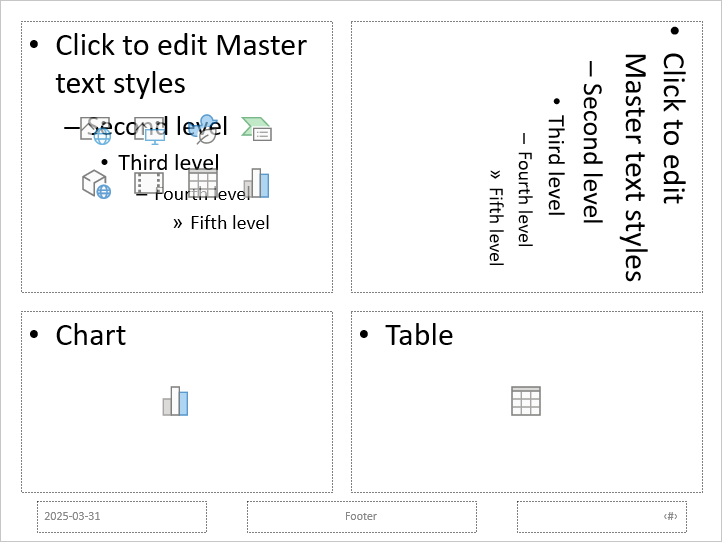

## **مقدمه**

یک طرح اسلاید نحوه‌ی چیدمان جعبه‌های جای‌دار و قالب‌بندی محتوا را در یک اسلاید تعیین می‌کند. این طرح کنترل می‌کند که کدام جای‌دارها در دسترس هستند و در کجا ظاهر می‌شوند. طرح‌های اسلاید به شما کمک می‌کنند تا ارائه‌ها را به‑سرعت و به‑صورت یکنواخت طراحی کنید—چه در حال ایجاد یک چیز ساده باشید و چه پیچیده‌تر. برخی از رایج‌ترین طرح‌های اسلاید در PowerPoint شامل موارد زیر هستند:

**طرح اسلاید عنوان** – شامل دو جای‌دار متنی است: یکی برای عنوان و دیگری برای زیرعنوان.

**طرح اسلاید عنوان و محتوا** – دارای یک جای‌دار عنوان کوچکتر در بالا و یک جای‌دار بزرگتر زیر آن برای محتواهای اصلی (مانند متن، نقطه‌چین‌ها، نمودارها، تصاویر و غیره) است.

**طرح خالی** – هیچ جای‌داری ندارد و به شما امکان می‌دهد اسلاید را از ابتدا طراحی کنید.

طرح‌های اسلاید بخشی از یک **اسلاید اصلی** (slide master) هستند که اسلاید سطح بالایی است و سبک‌های طرح را برای ارائه تعریف می‌کند. می‌توانید طرح‌های اسلاید را از طریق اسلاید اصلی دسترسی و ویرایش کنید—از طریق نوع، نام یا شناسهٔ یکتای آن. همچنین می‌توانید یک طرح اسلاید خاص را مستقیماً داخل ارائه ویرایش کنید.

برای کار با طرح‌های اسلاید در Aspose.Slides برای PHP می‌توانید از موارد زیر استفاده کنید:

- متدهایی مانند [getLayoutSlides](https://reference.aspose.com/slides/fa/php-java/aspose.slides/presentation/#getLayoutSlides) و [getMasters](https://reference.aspose.com/slides/fa/php-java/aspose.slides/presentation/#getMasters) در کلاس [Presentation](https://reference.aspose.com/slides/fa/php-java/aspose.slides/presentation/)
- انواعی مانند [LayoutSlide](https://reference.aspose.com/slides/fa/php-java/aspose.slides/layoutslide/)، [MasterLayoutSlideCollection](https://reference.aspose.com/slides/fa/php-java/aspose.slides/masterlayoutslidecollection/)، [LayoutPlaceholderManager](https://reference.aspose.com/slides/fa/php-java/aspose.slides/layoutplaceholdermanager/)، و [LayoutSlideHeaderFooterManager](https://reference.aspose.com/slides/fa/php-java/aspose.slides/layoutslideheaderfootermanager/)

{}

برای یادگیری بیشتر درباره کار با اسلایدهای اصلی، مقالهٔ [Slide Master](/slides/fa/php-java/slide-master/) را بررسی کنید.

{}

## **افزودن طرح‌های اسلاید به ارائه‌ها**

برای سفارشی‌سازی ظاهر و ساختار اسلایدهای خود ممکن است نیاز داشته باشید طرح اسلایدهای جدیدی به ارائه اضافه کنید. Aspose.Slides برای PHP به شما امکان می‌دهد بررسی کنید آیا یک طرح خاص از پیش وجود دارد یا نه، در صورت نیاز یک طرح جدید اضافه کنید و از آن برای درج اسلایدهایی بر پایه آن طرح استفاده کنید.

1. یک نمونه از کلاس [Presentation](https://reference.aspose.com/slides/fa/php-java/aspose.slides/presentation/) ایجاد کنید.  
1. به [MasterLayoutSlideCollection](https://reference.aspose.com/slides/fa/php-java/aspose.slides/masterlayoutslidecollection/) دسترسی پیدا کنید.  
1. بررسی کنید آیا طرح اسلاید موردنظر قبلاً در مجموعه وجود دارد یا خیر. اگر موجود نیست، طرح اسلاید موردنیاز را اضافه کنید.  
1. یک اسلاید خالی بر پایهٔ طرح اسلاید جدید اضافه کنید.  
1. ارائه را ذخیره کنید.

کد PHP زیر نشان می‌دهد چگونه یک طرح اسلاید به ارائهٔ PowerPoint اضافه می‌شود:

```php
// یک شی از کلاس Presentation که نمایانگر یک فایل PowerPoint است، ایجاد کنید.
$presentation = new Presentation("Sample.pptx");
try {
    // از انواع اسلایدهای طرح عبور کنید تا یک اسلاید طرح را انتخاب کنید.
    $layoutSlides = $presentation->getMasters()->get_Item(0)->getLayoutSlides();
    $layoutSlide = null;
    if (!java_is_null($layoutSlides->getByType(SlideLayoutType::TitleAndObject))) {
        $layoutSlide = $layoutSlides->getByType(SlideLayoutType::TitleAndObject);
    } else {
        $layoutSlide = $layoutSlides->getByType(SlideLayoutType::Title);
    }

    if (java_is_null($layoutSlide)) {
        // حالی که ارائه تمام انواع طرح‌ها را شامل نمی‌شود.
        // فایل ارائه فقط شامل انواع طرح Blank و Custom است.
        // با این حال، اسلایدهای طرح با انواع سفارشی ممکن است نام‌های قابل شناسایی داشته باشند،
        // مانند "Title"، "Title and Content" و غیره، که می‌توانند برای انتخاب اسلاید طرح استفاده شوند.
        // همچنین می‌توانید به مجموعه‌ای از انواع اشکال جای‌دار تکیه کنید.
        // برای مثال، یک اسلاید Title باید فقط نوع جای‌دار Title را داشته باشد و به همین ترتیب.
        foreach($layoutSlides as $titleAndObjectLayoutSlide) {
            if (java_values($titleAndObjectLayoutSlide->getName()) == "Title and Object") {
                $layoutSlide = $titleAndObjectLayoutSlide;
                break;
            }
        }

        if (java_is_null($layoutSlide)) {
            foreach($layoutSlides as $titleLayoutSlide) {
                if (java_values($titleLayoutSlide->getName()) == "Title") {
                    $layoutSlide = $titleLayoutSlide;
                    break;
                }
            }

            if (java_is_null($layoutSlide)) {
                $layoutSlide = $layoutSlides->getByType(SlideLayoutType::Blank);
                if (java_is_null($layoutSlide)) {
                    $layoutSlide = $layoutSlides->add(SlideLayoutType::TitleAndObject, "Title and Object");
                }
            }
        }
    }

    // یک اسلاید خالی با استفاده از اسلاید طرح اضافه‌شده اضافه کنید.
    $presentation->getSlides()->insertEmptySlide(0, $layoutSlide);

    // ارائه را در دیسک ذخیره کنید.
    $presentation->save("output.pptx", SaveFormat::Pptx);
} finally {
    $presentation->dispose();
}
```

## **حذف طرح‌های اسلاید استفاده نشده**

Aspose.Slides متد [removeUnusedLayoutSlides](https://reference.aspose.com/slides/fa/php-java/aspose.slides/compress/#removeUnusedLayoutSlides) را از کلاس [Compress](https://reference.aspose.com/slides/fa/php-java/aspose.slides/compress/) ارائه می‌دهد تا بتوانید طرح‌های اسلاید ناخواسته و استفاده نشده را حذف کنید.

کد PHP زیر نحوهٔ حذف یک طرح اسلاید از ارائهٔ PowerPoint را نشان می‌دهد:

```php
$presentation = new Presentation("Presentation.pptx");
try {
    Compress::removeUnusedLayoutSlides($presentation);
    $presentation->save("Output.pptx", SaveFormat::Pptx);
} finally {
    $presentation->dispose();
}
```

## **افزودن جای‌دارها به طرح‌های اسلاید**

Aspose.Slides متد [LayoutSlide.getPlaceholderManager](https://reference.aspose.com/slides/fa/php-java/aspose.slides/layoutslide/#getPlaceholderManager) را فراهم می‌کند که به شما امکان می‌دهد جای‌دارهای جدیدی به یک طرح اسلاید اضافه کنید.

این مدیر شامل متدهایی برای انواع جای‌دار زیر است:

| جای‌دار PowerPoint | متد [LayoutPlaceholderManager](https://reference.aspose.com/slides/fa/php-java/aspose.slides/layoutplaceholdermanager/) |
| ------------------ | -------------------------------------------------------------------------------------------------------- |
|  | addContentPlaceholder(float x, float y, float width, float height) |
|  | addVerticalContentPlaceholder(float x, float y, float width, float height) |
|  | addTextPlaceholder(float x, float y, float width, float height) |
|  | addVerticalTextPlaceholder(float x, float y, float width, float height) |
|  | addPicturePlaceholder(float x, float y, float width, float height) |
|  | addChartPlaceholder(float x, float y, float width, float height) |
|  | addTablePlaceholder(float x, float y, float width, float height) |
|  | addSmartArtPlaceholder(float x, float y, float width, float height) |
|  | addMediaPlaceholder(float x, float y, float width, float height) |
|  | addOnlineImagePlaceholder(float x, float y, float width, float height) |

کد PHP زیر نحوهٔ افزودن شکل‌های جای‌دار جدید به طرح اسلاید خالی را نشان می‌دهد:

```php
$presentation = new Presentation();
try {
    // دریافت اسلاید طرح Blank.
    $layout = $presentation->getLayoutSlides()->getByType(SlideLayoutType::Blank);

    // دریافت مدیر جای‌دار اسلاید طرح.
    $placeholderManager = $layout->getPlaceholderManager();

    // افزودن جای‌دارهای مختلف به اسلاید طرح Blank.
    $placeholderManager->addContentPlaceholder(20, 20, 310, 270);
    $placeholderManager->addVerticalTextPlaceholder(350, 20, 350, 270);
    $placeholderManager->addChartPlaceholder(20, 310, 310, 180);
    $placeholderManager->addTablePlaceholder(350, 310, 350, 180);

    // افزودن اسلاید جدید با طرح Blank.
    $newSlide = $presentation->getSlides()->addEmptySlide($layout);

    $presentation->save("Placeholders.pptx", SaveFormat::Pptx);
} finally {
    $presentation->dispose();
}
```

نتیجه:



## **تنظیم نمایش پاورقی برای یک طرح اسلاید**

در ارائه‌های PowerPoint، عناصر پاورقی مانند تاریخ، شماره اسلاید و متن سفارشی می‌توانند بسته به طرح اسلاید نشان داده یا مخفی شوند. Aspose.Slides برای PHP به شما امکان کنترل نمایش این جای‌دارهای پاورقی را می‌دهد. این ویژگی زمانی مفید است که بخواهید برخی طرح‌ها اطلاعات پاورقی را نمایش دهند در حالی که دیگران تمیز و ساده باقی بمانند.

1. یک نمونه از کلاس [Presentation](https://reference.aspose.com/slides/fa/php-java/aspose.slides/presentation/) ایجاد کنید.  
1. با استفاده از ایندکس، به یک طرح اسلاید اشاره کنید.  
1. جای‌دار پاورقی اسلاید را به حالت قابل مشاهده تنظیم کنید.  
1. جای‌دار شماره اسلاید را به حالت قابل مشاهده تنظیم کنید.  
1. جای‌دار تاریخ‑زمان را به حالت قابل مشاهده تنظیم کنید.  
1. ارائه را ذخیره کنید.

کد PHP زیر نشان می‌دهد چگونه نمایش پاورقی اسلاید را تنظیم کنید و وظایف مرتبط را انجام دهید:

```php
$presentation = new Presentation("Presentation.ppt");
try {
    $headerFooterManager = $presentation->getLayoutSlides()->get_Item(0)->getHeaderFooterManager();

    if (!$headerFooterManager->isFooterVisible()) {
        $headerFooterManager->setFooterVisibility(true);
    }

    if (!$headerFooterManager->isSlideNumberVisible()) {
        $headerFooterManager->setSlideNumberVisibility(true);
    }

    if (!$headerFooterManager->isDateTimeVisible()) {
        $headerFooterManager->setDateTimeVisibility(true);
    }

    $headerFooterManager->setFooterText("Footer text");
    $headerFooterManager->setDateTimeText("Date and time text");

    $presentation->save("Presentation.ppt", SaveFormat::Ppt);
} finally {
    $presentation->dispose();
}
```

## **تنظیم نمایش پاورقی فرزند برای یک اسلاید**

​در ارائه‌های PowerPoint، عناصر پاورقی مانند تاریخ، شماره اسلاید و متن سفارشی می‌توانند در سطح اسلاید اصلی کنترل شوند تا یکنواختی در تمام طرح‌های اسلاید حفظ شود. Aspose.Slides برای PHP به شما امکان می‌دهد نمایش و محتوای این جای‌دارهای پاورقی را در اسلاید اصلی تنظیم کنید و این تنظیمات را به تمام طرح‌های اسلاید فرزند منتقل کنید. این رویکرد اطلاعات پاورقی یکسانی را در کل ارائه تضمین می‌کند.​

1. یک نمونه از کلاس [Presentation](https://reference.aspose.com/slides/fa/php-java/aspose.slides/presentation/) ایجاد کنید.  
1. با استفاده از ایندکس، به اسلاید اصلی ارجاع پیدا کنید.  
1. تمام جای‌دارهای پاورقی اصلی و فرزند را به حالت قابل مشاهده تنظیم کنید.  
1. تمام جای‌دارهای شماره اسلاید اصلی و فرزند را به حالت قابل مشاهده تنظیم کنید.  
1. تمام جای‌دارهای تاریخ‑زمان اصلی و فرزند را به حالت قابل مشاهده تنظیم کنید.  
1. ارائه را ذخیره کنید.

کد PHP زیر این عملیات را نشان می‌دهد:

```php
$presentation = new Presentation("presentation.ppt");
try {
    $headerFooterManager = $presentation->getMasters()->get_Item(0)->getHeaderFooterManager();

    $headerFooterManager->setFooterAndChildFootersVisibility(true);
    $headerFooterManager->setSlideNumberAndChildSlideNumbersVisibility(true);
    $headerFooterManager->setDateTimeAndChildDateTimesVisibility(true);

    $headerFooterManager->setFooterAndChildFootersText("Footer text");
    $headerFooterManager->setDateTimeAndChildDateTimesText("Date and time text");

    $presentation->save("Output.pptx", SaveFormat::Pptx);
} finally {
    $presentation->dispose();
}
```

## **سوالات متداول**

**تفاوت اسلاید اصلی و اسلاید طرح چیست؟**

اسلاید اصلی تم کلی و قالب‌بندی پیش‌فرض را تعریف می‌کند، در حالی که اسلایدهای طرح چیدمان‌های خاصی از جای‌دارها را برای انواع محتواهای مختلف مشخص می‌کنند.

**آیا می‌توانم یک اسلاید طرح را از یک ارائه به ارائهٔ دیگر کپی کنم؟**

بله، می‌توانید یک اسلاید طرح را از مجموعهٔ اسلایدهای طرح یک ارائه (از طریق متد [getLayoutSlides](https://reference.aspose.com/slides/fa/php-java/aspose.slides/presentation/#getLayoutSlides)) کلون کنید و با استفاده از متد `addClone` آن را به ارائهٔ دیگری اضافه کنید.

**اگر اسلاید طرحی را که هنوز توسط اسلایدی استفاده می‌شود حذف کنم چه می‌شود؟**

اگر سعی کنید اسلاید طرحی را حذف کنید که هنوز حداقل یک اسلاید در ارائه به آن ارجاع داده است، Aspose.Slides یک [PptxEditException](https://reference.aspose.com/slides/fa/php-java/aspose.slides/pptxeditexception/) پرتاب می‌کند. برای جلوگیری از این وضعیت، از متد [removeUnusedLayoutSlides](https://reference.aspose.com/slides/fa/php-java/aspose.slides/compress/#removeUnusedLayoutSlides) استفاده کنید تا تنها طرح‌های اسلایدی که استفاده نمی‌شوند حذف شوند.