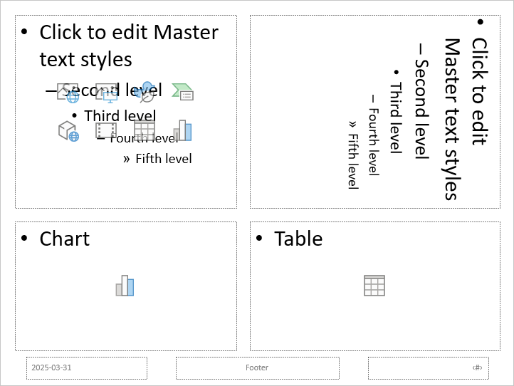

## **نمای کلی**

یک طرح اسلاید موقعیت‌ها و قالب‌بندی‌های نگهدارنده‌ها مانند عناوین، متن، تصاویر، نمودارها و جدول‌ها را تعریف می‌کند. اعمال یک طرح به اسلایدها ساختار ثابتی می‌دهد در حالی که به هر اسلاید اجازه می‌دهد محتوای خاص خود را داشته باشد.

رایج‌ترین طرح‌ها شامل:

- **اسلاید عنوان**: شامل نگهدارنده‌های عنوان و زیرعنوان است.
- **عنوان و محتوا**: شامل یک نگهدارنده عنوان و یک نگهدارنده محتوای عمومی است.
- **خالی**: هیچ نگهدارنده محتوایی ندارد و زمانی مفید است که هر شکل به‌صورت دستی موقعیت‌یابی شود.

## **درک وراثت طرح**

یک ارائه دارای سه سطح مرتبط است:

1. یک [اسلاید اصلی](https://reference.aspose.com/slides/fa/php-java/aspose.slides/masterslide/) تم، قالب‌بندی‌های مشترک، پس‌زمینه‌ها و اشیای مشترک را تعریف می‌کند.
2. یک [اسلاید طرح](https://reference.aspose.com/slides/fa/php-java/aspose.slides/layoutslide/) متعلق به یک اصلی است و چیدمان خاصی از نگهدارنده‌ها را تعریف می‌کند.
3. یک [اسلاید عادی](https://reference.aspose.com/slides/fa/php-java/aspose.slides/slide/) از یک طرح استفاده می‌کند و محتوای واردشده برای آن اسلاید را ذخیره می‌نماید.

یک اسلاید عادی تم و قالب‌بندی را از طرح خود به ارث می‌برد و طرح نیز از اصلی خود به ارث می‌رسد. مقدار تنظیم‌شده مستقیماً روی یک اسلاید عادی، مقدار ارث‌برده‌شده در آن سطح را لغو می‌کند. هنگام ایجاد یک اسلاید عادی، شکل‌های نگهدارنده آن از طرح انتخاب‌شده تولید می‌شوند، در حالی که محتوای واردشده در این نگهدارنده‌ها متعلق به اسلاید عادی است.

پیش از ایجاد اسلایدها، نگهدارنده‌های مورد نیاز را به یک طرح اضافه کنید. افزودن نگهدارنده دیگر به یک طرح بعداً، به‌صورت خودکار شکل نگهدارنده متناظر را به اسلایدهای عادی موجود اضافه نمی‌کند.

این رابطه دو پیامد مهم دارد:

- تغییر قالب‌بندی ارث‌برده یا هندسه نگهدارنده‌های موجود در یک طرح می‌تواند همه اسلایدهای وابسته به آن را به‌روز کند. قبل از ویرایش طرحی که هم‌اکنون استفاده می‌شود، اسلایدهای وابسته به آن را بررسی کرده و ارائه حاصل را مرور کنید.
- یک طرح که هنوز توسط اسلایدی استفاده می‌شود نمی‌تواند حذف شود. ابتدا اسلایدهای وابسته به آن را به طرح دیگری اختصاص دهید، یا فقط طرح‌های استفاده‌نشده را حذف کنید.

برای اطلاعات بیشتر در مورد سطح بالایی این سلسله‌مراتب، به صفحه [اسلاید اصلی](/slides/fa/php-java/slide-master/) مراجعه کنید.

برای مخفی‌سازی لوگوهای ارث‌برده یا اشکال تزئینی اصلی در یک اسلاید یا از طریق یک طرح مشترک، به صفحه [کنترل نمایش گرافیک‌های اصلی](/slides/fa/php-java/slide-master/) مراجعه کنید. این مثال دو اسلاید را که از همان اصلی استفاده می‌کنند مقایسه می‌کند.

## **انتخاب و اعمال یک طرح اسلاید**

زمانی که ارائه از تعاریف استاندارد طرح‌های PowerPoint پیروی می‌کند، از نوع طرح استفاده کنید. نام‌های طرح قابلیت ویرایش توسط کاربر دارند و می‌توانند بومی‌سازی شوند، بنابراین انتخاب بر مبنای نام کمتر قابل اطمینان است مگر اینکه الگوی منبع را کنترل کنید.

مثال زیر به دنبال **عنوان و محتوا** در اولین اصلی می‌گردد. اگر آن طرح موجود نباشد، عمداً به **خالی** باز می‌گردد. بررسی دوم نال لازم است چون یک ارائه می‌تواند فقط طرح‌های سفارشی داشته باشد. سپس طرح انتخاب‌شده به اولین اسلاید عادی از طریق متد [Slide.setLayoutSlide](https://reference.aspose.com/slides/fa/php-java/aspose.slides/slide/#setLayoutSlide) اعمال می‌شود.

```php
use aspose\slides\Presentation;
use aspose\slides\SaveFormat;
use aspose\slides\SlideLayoutType;

$presentation = new Presentation("input.pptx");
try {
    $layoutSlides = $presentation->getMasters()->get_Item(0)->getLayoutSlides();
    $targetLayout = $layoutSlides->getByType(SlideLayoutType::TitleAndObject);

    if (java_is_null($targetLayout)) {
        $targetLayout = $layoutSlides->getByType(SlideLayoutType::Blank);
    }

    if (java_is_null($targetLayout)) {
        throw new \RuntimeException("The first master does not contain a suitable layout slide.");
    }

    $presentation->getSlides()->get_Item(0)->setLayoutSlide($targetLayout);
    $presentation->save("output-with-new-layout.pptx", SaveFormat::Pptx);
} finally {
    $presentation->dispose();
}
```

تغییر طرح یک اسلاید، اشکال عادی اضافه‌شده مستقیم به اسلاید را حذف نمی‌کند. اما موقعیت‌های نگهدارنده، قالب‌بندی‌های ارث‌برده و تطابق بین نگهدارنده‌های موجود و طرح جدید می‌توانند تغییر کنند، بنابراین هنگام جابجایی بین طرح‌های به‌طور قابل‌تفاوت متفاوت، خروجی را بررسی کنید.

## **افزودن یک اسلاید طرح**

انتخاب و ایجاد عملیات‌های جداگانه‌ای هستند. مثال قبلی یک طرح موجود را انتخاب می‌کند؛ طرحی ایجاد نمی‌کند. برای ایجاد یک طرح، متد [MasterLayoutSlideCollection.add](https://reference.aspose.com/slides/fa/php-java/aspose.slides/masterlayoutslidecollection/#add) را بر روی مجموعه طرح‌های اصلی هدف فراخوانی کنید.

مثال زیر همیشه یک طرح جدید **عنوان و محتوا** به نام `Report Title and Content` اضافه می‌کند، سپس یک اسلاید عادی بر پایه آن می‌سازد. نام‌های طرح باید در میان مجموعه یکتا باشند.

```php
use aspose\slides\Presentation;
use aspose\slides\SaveFormat;
use aspose\slides\SlideLayoutType;

$presentation = new Presentation("input.pptx");
try {
    $masterSlide = $presentation->getMasters()->get_Item(0);
    $reportLayout = $masterSlide->getLayoutSlides()->add(SlideLayoutType::TitleAndObject, "Report Title and Content");
    $presentation->getSlides()->addEmptySlide($reportLayout);

    $presentation->save("output-with-report-layout.pptx", SaveFormat::Pptx);
} finally {
    $presentation->dispose();
}
```

فقط زمانی که الگو واقعاً به یک ساختار قابل استفاده مجدد دیگر نیاز داشته باشد، یک طرح اضافه کنید. اگر یک طرح مناسب از قبل وجود داشته باشد، به جای ایجاد یک نسخه‌ی تکراری، آن را انتخاب و دوباره استفاده کنید.

## **افزودن نگهدارنده‌ها به یک اسلاید طرح**

متد [LayoutSlide.getPlaceholderManager](https://reference.aspose.com/slides/fa/php-java/aspose.slides/layoutslide/#getPlaceholderManager) یک [LayoutPlaceholderManager](https://reference.aspose.com/slides/fa/php-java/aspose.slides/layoutplaceholdermanager/) را برای افزودن اشکال نگهدارنده به یک طرح فراهم می‌کند.

| نگهدارنده PowerPoint | `LayoutPlaceholderManager` متد |
| --------------------- | --------------------------------- |
|  | [`addContentPlaceholder(float x, float y, float width, float height)`](https://reference.aspose.com/slides/fa/php-java/aspose.slides/layoutplaceholdermanager/#addContentPlaceholder) |
|  | [`addVerticalContentPlaceholder(float x, float y, float width, float height)`](https://reference.aspose.com/slides/fa/php-java/aspose.slides/layoutplaceholdermanager/#addVerticalContentPlaceholder) |
|  | [`addTextPlaceholder(float x, float y, float width, float height)`](https://reference.aspose.com/slides/fa/php-java/aspose.slides/layoutplaceholdermanager/#addTextPlaceholder) |
|  | [`addVerticalTextPlaceholder(float x, float y, float width, float height)`](https://reference.aspose.com/slides/fa/php-java/aspose.slides/layoutplaceholdermanager/#addVerticalTextPlaceholder) |
|  | [`addPicturePlaceholder(float x, float y, float width, float height)`](https://reference.aspose.com/slides/fa/php-java/aspose.slides/layoutplaceholdermanager/#addPicturePlaceholder) |
|  | [`addChartPlaceholder(float x, float y, float width, float height)`](https://reference.aspose.com/slides/fa/php-java/aspose.slides/layoutplaceholdermanager/#addChartPlaceholder) |
|  | [`addTablePlaceholder(float x, float y, float width, float height)`](https://reference.aspose.com/slides/fa/php-java/aspose.slides/layoutplaceholdermanager/#addTablePlaceholder) |
|  | [`addSmartArtPlaceholder(float x, float y, float width, float height)`](https://reference.aspose.com/slides/fa/php-java/aspose.slides/layoutplaceholdermanager/#addSmartArtPlaceholder) |
|  | [`addMediaPlaceholder(float x, float y, float width, float height)`](https://reference.aspose.com/slides/fa/php-java/aspose.slides/layoutplaceholdermanager/#addMediaPlaceholder) |
|  | [`addOnlineImagePlaceholder(float x, float y, float width, float height)`](https://reference.aspose.com/slides/fa/php-java/aspose.slides/layoutplaceholdermanager/#addOnlineImagePlaceholder) |

مثال زیر بررسی می‌کند که طرح **خالی** موجود است، چهار نگهدارنده را به آن اضافه می‌کند، و سپس یک اسلاید عادی که از طرح اصلاح‌شده استفاده می‌کند، می‌سازد. ترتیب منظور شده است: نگهدارنده‌ها قبل از ایجاد اسلاید عادی اضافه می‌شوند، تا Aspose.Slides بتواند اشکال نگهدارنده متناظر را در آن اسلاید تولید کند.

```php
use aspose\slides\Presentation;
use aspose\slides\SaveFormat;
use aspose\slides\SlideLayoutType;

$presentation = new Presentation();
try {
    $blankLayout = $presentation->getLayoutSlides()->getByType(SlideLayoutType::Blank);

    if (java_is_null($blankLayout)) {
        throw new \RuntimeException("The presentation does not contain a Blank layout slide.");
    }

    $placeholderManager = $blankLayout->getPlaceholderManager();
    $placeholderManager->addContentPlaceholder(20, 20, 310, 270);
    $placeholderManager->addVerticalTextPlaceholder(350, 20, 350, 270);
    $placeholderManager->addChartPlaceholder(20, 310, 310, 180);
    $placeholderManager->addTablePlaceholder(350, 310, 350, 180);

    $presentation->getSlides()->addEmptySlide($blankLayout);
    $presentation->save("output-with-placeholders.pptx", SaveFormat::Pptx);
} finally {
    $presentation->dispose();
}
```

نتیجه:



{}تغییر قالب‌بندی ارث‌برده یا هندسه نگهدارنده‌های طرح موجود می‌تواند بر اسلایدهای وابسته اثر بگذارد. یک نگهدارنده طرح تازه‌اضافه‌شده به اسلایدهای عادی موجود بازپُر نمی‌شود. تغییرات طرح را بر روی یک کپی از ارائه تست کنید و هر اسلاید وابسته را بررسی کنید.{}

## **حذف اسلایدهای طرح استفاده‌نشده**

از متد [Compress.removeUnusedLayoutSlides](https://reference.aspose.com/slides/fa/php-java/aspose.slides/compress/#removeUnusedLayoutSlides) برای حذف طرح‌هایی که هیچ اسلاید عادی به آن‌ها ارجاع نمی‌دهد، استفاده کنید. این متد طرح‌های همچنان استفاده‌شده را دست‌نخورده می‌گذارد.

```php
use aspose\slides\Compress;
use aspose\slides\Presentation;
use aspose\slides\SaveFormat;

$presentation = new Presentation("input.pptx");
try {
    Compress::removeUnusedLayoutSlides($presentation);
    $presentation->save("output-without-unused-layouts.pptx", SaveFormat::Pptx);
} finally {
    $presentation->dispose();
}
```

برای حذف یک طرح خاص، ابتدا از متد [hasDependingSlides](https://reference.aspose.com/slides/fa/php-java/aspose.slides/layoutslide/#hasDependingSlides) یا [getDependingSlides](https://reference.aspose.com/slides/fa/php-java/aspose.slides/layoutslide/#getDependingSlides) آن استفاده کنید. پیش از فراخوانی [LayoutSlide.remove](https://reference.aspose.com/slides/fa/php-java/aspose.slides/layoutslide/#remove) اسلایدهای وابسته را مجدداً اختصاص دهید. تلاش برای حذف یک طرح استفاده‌شده یک [PptxEditException](https://reference.aspose.com/slides/fa/php-java/aspose.slides/pptxeditexception/) پرتاب می‌کند.

## **کنترل نمایش پاورقی در یک اسلاید طرح**

یک طرح پایگاه‌های پاورقی، شماره اسلاید و تاریخ‑زمان مخصوص به خود را دارد. برای کنترل این نگهدارنده‌ها برای یک طرح، از متد [LayoutSlide.getHeaderFooterManager](https://reference.aspose.com/slides/fa/php-java/aspose.slides/layoutslide/#getHeaderFooterManager) استفاده کنید. این موضوع زمانی مفید است که مثلاً طرح‌های محتوا باید پاورقی نمایش دهند ولی طرح‌های عنوان نه.

```php
use aspose\slides\Presentation;
use aspose\slides\SaveFormat;
use aspose\slides\SlideLayoutType;

$presentation = new Presentation("input.pptx");
try {
    $layoutSlide = $presentation->getLayoutSlides()->getByType(SlideLayoutType::TitleAndObject);

    if (java_is_null($layoutSlide)) {
        $layoutSlide = $presentation->getLayoutSlides()->getByType(SlideLayoutType::Blank);
    }

    if (java_is_null($layoutSlide)) {
        throw new \RuntimeException("The presentation does not contain a suitable layout slide.");
    }

    $headerFooterManager = $layoutSlide->getHeaderFooterManager();
    $headerFooterManager->setFooterVisibility(true);
    $headerFooterManager->setSlideNumberVisibility(true);
    $headerFooterManager->setDateTimeVisibility(true);
    $headerFooterManager->setFooterText("Footer text");
    $headerFooterManager->setDateTimeText("Date and time text");

    $presentation->save("output-with-layout-footers.pptx", SaveFormat::Pptx);
} finally {
    $presentation->dispose();
}
```

## **کنترل نمایش پاورقی در یک اصلی و طرح‌های فرزند آن**

برای اعمال تنظیمات یکسان پاورقی در سرتاسر سلسله‌مراتب اصلی، از متد [MasterSlide.getHeaderFooterManager](https://reference.aspose.com/slides/fa/php-java/aspose.slides/masterslide/#getHeaderFooterManager) استفاده کنید. متدهای انتشار [MasterSlideHeaderFooterManager](https://reference.aspose.com/slides/fa/php-java/aspose.slides/masterslideheaderfootermanager/) بر روی اصلی و اسلایدهای طرح وابسته و اسلایدهای عادی آن اعمال می‌شوند؛ آن‌ها تنها یک اسلاید عادی را هدف نمی‌گیرند.

```php
use aspose\slides\Presentation;
use aspose\slides\SaveFormat;

$presentation = new Presentation("input.pptx");
try {
    $headerFooterManager = $presentation->getMasters()->get_Item(0)->getHeaderFooterManager();
    $headerFooterManager->setFooterAndChildFootersVisibility(true);
    $headerFooterManager->setSlideNumberAndChildSlideNumbersVisibility(true);
    $headerFooterManager->setDateTimeAndChildDateTimesVisibility(true);
    $headerFooterManager->setFooterAndChildFootersText("Footer text");
    $headerFooterManager->setDateTimeAndChildDateTimesText("Date and time text");

    $presentation->save("output-with-master-footers.pptx", SaveFormat::Pptx);
} finally {
    $presentation->dispose();
}
```

## **سوالات متداول**

**تفاوت اسلاید اصلی و اسلاید طرح چیست؟**

یک اسلاید اصلی تم و قالب‌بندی‌های مشترک ارائه را تعریف می‌کند. یک اسلاید طرح متعلق به اصلی است و یک چیدمان قابل استفادهٔ مجدد از نگهدارنده‌ها را تعریف می‌کند. اسلایدهای عادی از این طرح‌ها استفاده می‌کنند و محتوای خاص هر اسلاید را ذخیره می‌نمایند.

**آیا می‌توانم یک اسلاید طرح را از یک ارائه به ارائه دیگر کپی کنم؟**

بله. یک کپی به مجموعه مقصد با متد [addClone](https://reference.aspose.com/slides/fa/php-java/aspose.slides/globallayoutslidecollection/#addClone) اضافه کنید. هنگام کپی بین ارائه‌ها، فونت‌ها، تم‌ها، تصاویر و سایر منابع استفاده‌شده توسط طرح منبع را نیز بررسی کنید.

**وقتی یک طرح که هم‌اکنون استفاده می‌شود را اصلاح می‌کنم چه اتفاقی می‌افتد؟**

اسلایدهای وابسته تغییرات طرح را به ارث می‌برند مگر اینکه قالب‌بندی یا اشیای تحت تأثیر را به‌صورت محلی بازنویسی کنند. بنابراین هندسه نگهدارنده‌ها و استایل ارث‌برده می‌تواند در بسیاری از اسلایدها به‌یک‌باره تغییر کند. قبل از ویرایش طرح، با استفاده از [getDependingSlides](https://reference.aspose.com/slides/fa/php-java/aspose.slides/layoutslide/#getDependingSlides) اسلایدهای تحت‌تأثیر را شناسایی کنید.

**اگر یک طرح که هنوز استفاده می‌شود را حذف کنم چه می‌شود؟**

Aspose.Slides یک [PptxEditException](https://reference.aspose.com/slides/fa/php-java/aspose.slides/pptxeditexception/) پرتاب می‌کند. ابتدا اسلایدهای وابسته را مجدداً اختصاص دهید، یا از [removeUnusedLayoutSlides](https://reference.aspose.com/slides/fa/php-java/aspose.slides/compress/#removeUnusedLayoutSlides) برای حذف فقط طرح‌های بدون ارجاع استفاده کنید.