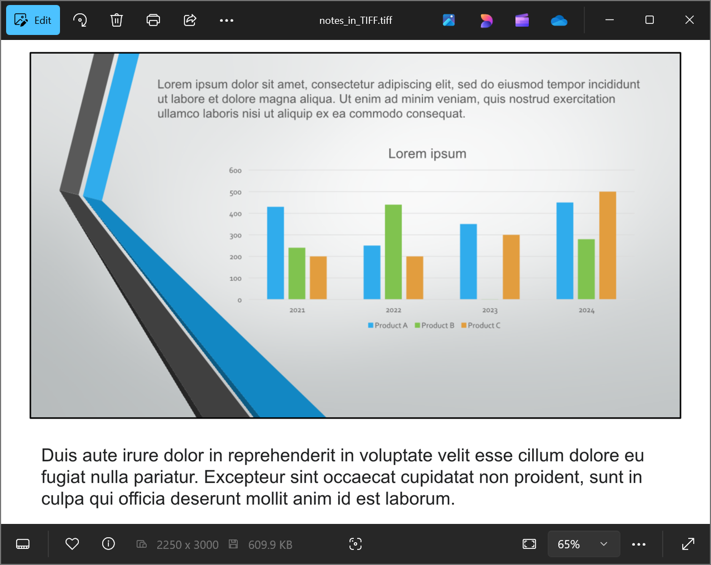

## **مقدمه**

Aspose.Slides for Python via Java یک راه‌حل ساده برای تبدیل ارائه‌های PowerPoint و OpenDocument (PPT، PPTX و ODP) همراه با یادداشت‌ها به فرمت TIFF فراهم می‌کند. این فرمت به‌صورت گسترده برای ذخیره‌سازی تصویر با کیفیت بالا، چاپ و بایگانی اسناد استفاده می‌شود. برای صادر کردن اسلایدها و یادداشت‌های سخنران به یک فایل TIFF چندصفحه‌ای، از متد [save](https://reference.aspose.com/slides/fa/python-java/aspose.slides/presentation/#save) کلاس [Presentation](https://reference.aspose.com/slides/fa/python-java/aspose.slides/presentation/) استفاده کنید.

## **تبدیل یک ارائه به TIFF همراه با یادداشت‌ها**

Saving a PowerPoint or OpenDocument presentation to TIFF with notes using Aspose.Slides for Python via Java involves the following steps:

1. یک شی از کلاس [Presentation](https://reference.aspose.com/slides/fa/python-java/aspose.slides/presentation/) ایجاد کنید: یک فایل PowerPoint یا OpenDocument را بارگذاری کنید.
1. گزینه‌های چیدمان خروجی را پیکربندی کنید: از کلاس [NotesCommentsLayoutingOptions](https://reference.aspose.com/slides/fa/python-java/aspose.slides/notescommentslayoutingoptions/) برای مشخص کردن نحوه نمایش یادداشت‌ها و نظرات استفاده کنید.
1. ارائه را به TIFF ذخیره کنید: گزینه‌های پیکربندی شده را به متد [save](https://reference.aspose.com/slides/fa/python-java/aspose.slides/presentation/#save) بدهید.

فرض کنید فایلی به نام "speaker_notes.pptx" داریم که حاوی اسلاید زیر است:


```python
import jpype
import asposeslides

if not jpype.isJVMStarted():
    jpype.startJVM()

from asposeslides.api import NotesCommentsLayoutingOptions, NotesPositions, Presentation, SaveFormat, TiffOptions

presentation = Presentation("speaker_notes.pptx")
try:
    # نمایش کامل یادداشت‌های سخنران زیر هر اسلاید.
    notes_options = NotesCommentsLayoutingOptions()
    notes_options.setNotesPosition(NotesPositions.BottomFull)

    # پیکربندی وضوح تصویر TIFF و چیدمان یادداشت‌ها.
    tiff_options = TiffOptions()
    tiff_options.setDpiX(300)
    tiff_options.setDpiY(300)
    tiff_options.setSlidesLayoutOptions(notes_options)

    # ذخیره ارائه به TIFF همراه با یادداشت‌های سخنران.
    presentation.save("TIFF_with_notes.tiff", SaveFormat.Tiff, tiff_options)
finally:
    presentation.dispose()
```

نتیجه:



{}
به Aspose [Free PowerPoint to Poster Converter](https://products.aspose.app/slides/fa/conversion/convert-ppt-to-poster-online) مراجعه کنید.
{}

## **سوالات متداول**

**آیا می‌توانم موقعیت ناحیه یادداشت‌ها را در TIFF حاصل کنترل کنم؟**

بله. با استفاده از [setNotesPosition](https://reference.aspose.com/slides/fa/python-java/aspose.slides/notescommentslayoutingoptions/#setNotesPosition) همراه با [NotesPositions.BottomTruncated](https://reference.aspose.com/slides/fa/python-java/aspose.slides/notespositions/#BottomTruncated) می‌توانید یادداشت‌ها را در یک صفحه جای دهید، که ممکن است برش داده شوند، یا با [NotesPositions.BottomFull](https://reference.aspose.com/slides/fa/python-java/aspose.slides/notespositions/#BottomFull) تمام یادداشت‌ها را در صورت نیاز با صفحات اضافه نمایش دهید. برای صادر کردن اسلایدها بدون یادداشت، همان‌طور که در [Convert PowerPoint to TIFF](/slides/fa/python-java/convert-powerpoint-to-tiff/) نشان داده شده است، پیکربندی چیدمان یادداشت‌ها را حذف کنید.

**چگونه می‌توانم حجم فایل TIFF همراه با یادداشت‌ها را بدون از دست رفتن کیفیت تصویر کاهش دهم؟**

از فشرده‌سازی بدون از دست رفتن [LZW compression](https://reference.aspose.com/slides/fa/python-java/aspose.slides/tiffcompressiontypes/#LZW) از طریق [setCompressionType](https://reference.aspose.com/slides/fa/python-java/aspose.slides/tiffoptions/#setCompressionType) استفاده کنید. کاهش وضوح یا عمق رنگ می‌تواند اندازه فایل را بیشتر کاهش دهد، اما ممکن است کیفیت تصویر و خوانایی یادداشت‌ها را تحت تأثیر قرار دهد. برای گزینه‌های بیشتر به [TIFF export settings](/slides/fa/python-java/convert-powerpoint-to-tiff/) مراجعه کنید.

**آیا فونت در یادداشت‌ها بر نتایج تأثیر می‌گذارد اگر فونت‌های اصلی در سیستم موجود نباشند؟**

بله. فقدان فونت‌ها باعث [font substitution](/slides/fa/python-java/font-selection-sequence/) می‌شود که می‌تواند متریک‌های متن و ظاهر را تغییر دهد. برای حفظ ظاهر مورد نظر، [فونت‌های مورد نیاز](/slides/fa/python-java/custom-font/) را تأمین کنید.