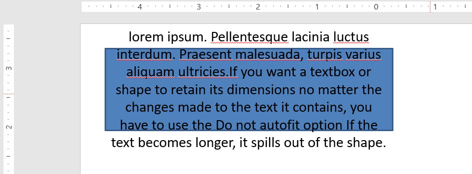

## **معرفی**

به‌طور پیش‌فرض، وقتی یک جعبه متن اضافه می‌کنید، Microsoft PowerPoint از تنظیم **Resize shape to fix text** برای جعبه متن استفاده می‌کند—به‌صورت خودکار اندازه جعبه متن را تغییر می‌دهد تا متن آن همواره در داخل آن جای گیرد. 


* وقتی متن در جعبه متن طولانی‌تر یا بزرگ‌تر می‌شود، PowerPoint به‌صورت خودکار جعبه متن را بزرگ می‌کند—ارتفاع آن را افزایش می‌دهد—تا امکان نگهداری متن بیشتر را فراهم کند. 
* وقتی متن در جعبه متن کوتاه‌تر یا کوچک‌تر می‌شود، PowerPoint به‌صورت خودکار جعبه متن را کوچک می‌کند—ارتفاع آن را کاهش می‌دهد—تا فضاهای اضافه حذف شود. 

در PowerPoint، این‌ها ۴ پارامتر یا گزینه مهم هستند که رفتار autofit را برای یک جعبه متن کنترل می‌کنند: 

* **Do not Autofit**
* **Shrink text on overflow**
* **Resize shape to fit text**
* **Wrap text in shape.**


Aspose.Slides for Python via Java گزینه‌های مشابهی—برخی ویژگی‌ها تحت کلاس [TextFrameFormat](https://reference.aspose.com/slides/fa/python-java/aspose.slides/textframeformat/)—ارائه می‌دهد که به شما امکان کنترل رفتار autofit برای جعبه‌های متن در ارائه‌ها را می‌دهد. 

## **تغییر اندازه شکل برای متن**

اگر می‌خواهید متن در یک جعبه همیشه پس از تغییرات درون جعبه جا بگیرد، باید از گزینه **Resize shape to fix text** استفاده کنید. برای تعیین این تنظیم، از متد [setAutofitType](https://reference.aspose.com/slides/fa/python-java/aspose.slides/textframeformat/#setAutofitType) (از کلاس [TextFrameFormat](https://reference.aspose.com/slides/fa/python-java/aspose.slides/textframeformat/)) همراه با [Shape](https://reference.aspose.com/slides/fa/python-java/aspose.slides/textautofittype/#Shape) استفاده کنید. 


این کد پایتون نشان می‌دهد که چگونه مشخص کنید متن باید همیشه در جعبه خود در یک ارائه PowerPoint جا بگیرد:

```python
import jpype
import asposeslides

if not jpype.isJVMStarted():
    jpype.startJVM()

from asposeslides.api import Presentation, ShapeType, Portion, FillType, TextAutofitType, SaveFormat
from java.awt import Color

presentation = Presentation()
try:
    slide = presentation.getSlides().get_Item(0)
    auto_shape = slide.getShapes().addAutoShape(ShapeType.Rectangle, 30, 30, 350, 100)

    portion = Portion("lorem ipsum...")
    portion.getPortionFormat().getFillFormat().getSolidFillColor().setColor(Color.BLACK)
    portion.getPortionFormat().getFillFormat().setFillType(FillType.Solid)
    auto_shape.getTextFrame().getParagraphs().get_Item(0).getPortions().add(portion)

    text_frame_format = auto_shape.getTextFrame().getTextFrameFormat()
    text_frame_format.setAutofitType(TextAutofitType.Shape)

    presentation.save("Output-presentation.pptx", SaveFormat.Pptx)
finally:
    presentation.dispose()
```

اگر متن طولانی‌تر یا بزرگ‌تر شود، جعبه متن به‌صورت خودکار (ارتفاع آن افزایش می‌یابد) تغییر اندازه می‌دهد تا تمام متن در آن جا بگیرد. اگر متن کوتاه‌تر شود، برعکس آن رخ می‌دهد. 

## **Do Not Autofit**

اگر می‌خواهید یک جعبه متن یا شکل ابعاد خود را صرف‌نظر از تغییرات متن حفظ کند، باید از گزینه **Do not Autofit** استفاده کنید. برای تعیین این تنظیم، از متد [setAutofitType](https://reference.aspose.com/slides/fa/python-java/aspose.slides/textframeformat/#setAutofitType) (از کلاس [TextFrameFormat](https://reference.aspose.com/slides/fa/python-java/aspose.slides/textframeformat/)) همراه با [None](https://reference.aspose.com/slides/fa/python-java/aspose.slides/textautofittype/#None) استفاده کنید. 



این کد پایتون نشان می‌دهد که چگونه مشخص کنید جعبه متن باید همیشه ابعاد خود را در یک ارائه PowerPoint حفظ کند:

```python
import jpype
import asposeslides

if not jpype.isJVMStarted():
    jpype.startJVM()

from asposeslides.api import Presentation, ShapeType, Portion, FillType, TextAutofitType, SaveFormat
from java.awt import Color

presentation = Presentation()
try:
    slide = presentation.getSlides().get_Item(0)
    auto_shape = slide.getShapes().addAutoShape(ShapeType.Rectangle, 30, 30, 350, 100)

    portion = Portion("lorem ipsum...")
    portion.getPortionFormat().getFillFormat().getSolidFillColor().setColor(Color.BLACK)
    portion.getPortionFormat().getFillFormat().setFillType(FillType.Solid)
    auto_shape.getTextFrame().getParagraphs().get_Item(0).getPortions().add(portion)

    text_frame_format = auto_shape.getTextFrame().getTextFrameFormat()
    text_frame_format.setAutofitType(TextAutofitType.None)

    presentation.save("Output-presentation.pptx", SaveFormat.Pptx)
finally:
    presentation.dispose()
```

وقتی متن برای جعبه‌اش بیش از حد طولانی شود، خارج می‌شود. 

## **Shrink Text on Overflow**

اگر متنی برای جعبه‌اش بیش از حد طولانی شود، با استفاده از گزینه **Shrink text on overflow** می‌توانید تعیین کنید که اندازه و فاصلهٔ متن کاهش یابد تا در جعبه جا بگیرد. برای تعیین این تنظیم، از متد [setAutofitType](https://reference.aspose.com/slides/fa/python-java/aspose.slides/textframeformat/#setAutofitType) (از کلاس [TextFrameFormat](https://reference.aspose.com/slides/fa/python-java/aspose.slides/textframeformat/)) همراه با [Normal](https://reference.aspose.com/slides/fa/python-java/aspose.slides/textautofittype/#Normal) استفاده کنید. 


این کد پایتون نشان می‌دهد که چگونه مشخص کنید متن در سرریز باید کوچک شود در یک ارائه PowerPoint:

```python
import jpype
import asposeslides

if not jpype.isJVMStarted():
    jpype.startJVM()

from asposeslides.api import Presentation, ShapeType, Portion, FillType, TextAutofitType, SaveFormat
from java.awt import Color

presentation = Presentation()
try:
    slide = presentation.getSlides().get_Item(0)
    auto_shape = slide.getShapes().addAutoShape(ShapeType.Rectangle, 30, 30, 350, 100)

    portion = Portion("lorem ipsum...")
    portion.getPortionFormat().getFillFormat().getSolidFillColor().setColor(Color.BLACK)
    portion.getPortionFormat().getFillFormat().setFillType(FillType.Solid)
    auto_shape.getTextFrame().getParagraphs().get_Item(0).getPortions().add(portion)

    text_frame_format = auto_shape.getTextFrame().getTextFrameFormat()
    text_frame_format.setAutofitType(TextAutofitType.Normal)

    presentation.save("Output-presentation.pptx", SaveFormat.Pptx)
finally:
    presentation.dispose()
```

{}
وقتی گزینه **Shrink text on overflow** استفاده شود، تنظیم فقط زمانی اعمال می‌شود که متن برای جعبه بیش از حد طولانی شود. 
{}

## **Wrap Text**

اگر می‌خواهید متن در یک شکل هنگام عبور از مرزهای عرضی شکل به‌صورت خودکار درون شکل بسته شود، باید از پارامتر **Wrap text in shape** استفاده کنید. برای تعیین این تنظیم، باید از متد [setWrapText](https://reference.aspose.com/slides/fa/python-java/aspose.slides/textframeformat/#setWrapText) (از کلاس [TextFrameFormat](https://reference.aspose.com/slides/fa/python-java/aspose.slides/textframeformat/)) همراه با [NullableBool.True](https://reference.aspose.com/slides/fa/python-java/aspose.slides/nullablebool/#True) استفاده کنید. 

این کد پایتون نشان می‌دهد که چگونه تنظیم Wrap Text را در یک ارائه PowerPoint به کار ببرید:

```python
import jpype
import asposeslides

if not jpype.isJVMStarted():
    jpype.startJVM()

from asposeslides.api import Presentation, ShapeType, Portion, FillType, NullableBool, SaveFormat
from java.awt import Color

presentation = Presentation()
try:
    slide = presentation.getSlides().get_Item(0)
    auto_shape = slide.getShapes().addAutoShape(ShapeType.Rectangle, 30, 30, 350, 100)

    portion = Portion("lorem ipsum...")
    portion.getPortionFormat().getFillFormat().getSolidFillColor().setColor(Color.BLACK)
    portion.getPortionFormat().getFillFormat().setFillType(FillType.Solid)
    auto_shape.getTextFrame().getParagraphs().get_Item(0).getPortions().add(portion)

    text_frame_format = auto_shape.getTextFrame().getTextFrameFormat()
    text_frame_format.setWrapText(NullableBool.True)

    presentation.save("Output-presentation.pptx", SaveFormat.Pptx)
finally:
    presentation.dispose()
```

{} 
اگر متد [setWrapText](https://reference.aspose.com/slides/fa/python-java/aspose.slides/textframeformat/#setWrapText) را با [NullableBool.False](https://reference.aspose.com/slides/fa/python-java/aspose.slides/nullablebool/#False) برای یک شکل به کار ببرید، وقتی متن داخل شکل طولانی‌تر از عرض شکل شود، متن به‌صورت یک خط ادامه یافته و از مرزهای شکل فراتر می‌رود. 
{}

## **سوالات متداول**

**آیا حاشیه‌های داخلی فریم متن بر AutoFit تأثیر می‌گذارند؟**  
بله. Padding (حاشیه‌های داخلی) ناحیهٔ قابل استفاده برای متن را کاهش می‌دهد، بنابراین AutoFit زودتر فعال می‌شود—فونت را کم می‌کند یا شکل را زودتر تغییر اندازه می‌دهد. پیش از تنظیم AutoFit حاشیه‌ها را بررسی و تنظیم کنید.  

**AutoFit چگونه با شکست خطوط دستی و نرم تعامل دارد؟**  
شکست‌های اجباری در جای خود می‌مانند و AutoFit اندازهٔ فونت و فاصله را دور آنها تنظیم می‌کند. حذف شکست‌های غیرضروری معمولاً نیاز AutoFit به کوچک‌کردن متن را کاهش می‌دهد.  

**آیا تغییر فونت تم یا فعال‌سازی جایگزینی فونت بر نتایج AutoFit تأثیر دارد؟**  
بله. جایگزینی به فونتی با متریک‌های گلیف متفاوت، عرض/ارتفاع متن را تغییر می‌دهد و می‌تواند اندازهٔ نهایی فونت و پیچش خطوط را تحت‌تأثیر قرار دهد. پس از هر تغییر یا جایگزینی فونت، اسلایدها را دوباره بررسی کنید.