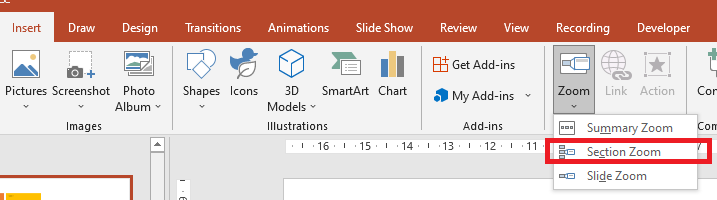

## **معرفی**

Zoomها در PowerPoint به شما امکان می‌دهند بین اسلایدها، بخش‌ها و قسمت‌های خاصی از یک ارائه پرش کنید. هنگام ارائه، این توانایی برای ناوبری سریع در محتوا می‌تواند بسیار مفید باشد.


* برای خلاصه‌کردن یک ارائه کامل در یک اسلاید واحد، از یک [Zoom خلاصه](#summary-zoom) استفاده کنید.
* برای نمایش فقط اسلایدهای انتخاب‌شده، از یک [Zoom اسلاید](#slide-zoom) استفاده کنید.
* برای نمایش فقط یک بخش، از یک [Zoom بخش](#section-zoom) استفاده کنید.

## **Zoom اسلاید**

Zoom اسلاید می‌تواند ارائه شما را پویا تر کند و به شما اجازه می‌دهد به صورت آزادانه بین اسلایدها به هر ترتیبی که می‌خواهید ناوبری کنید بدون اینکه جریان ارائه شما مختل شود. Zoom اسلاید برای ارائه‌های کوتاه بدون بخش‌های متعدد بسیار مناسب است، اما می‌توانید از آن در سناریوهای مختلف ارائه نیز استفاده کنید.

Zoom اسلاید به شما کمک می‌کند تا به بخش‌های مختلف اطلاعات عمیقاً نفوذ کنید در حالی که احساس می‌کنید روی یک بوم واحد هستید.


برای اشیای Zoom اسلاید، Aspose.Slides enumeration [ZoomImageType](https://reference.aspose.com/slides/fa/python-java/aspose.slides/zoomimagetype/)، کلاس [ZoomFrame](https://reference.aspose.com/slides/fa/python-java/aspose.slides/zoomframe/) و برخی متدها در کلاس [ShapeCollection](https://reference.aspose.com/slides/fa/python-java/aspose.slides/shapecollection/) را ارائه می‌دهد.

### **ایجاد فریم‌های Zoom**

شما می‌توانید یک فریم Zoom را بر روی اسلاید به این شکل اضافه کنید:

1. یک نمونه از کلاس [Presentation](https://reference.aspose.com/slides/fa/python-java/aspose.slides/presentation/) ایجاد کنید.
2. اسلایدهای جدیدی که می‌خواهید فریم‌های Zoom به آن‌ها لینک شوند، ایجاد کنید.
3. متن شناسایی‌کننده و پس‌زمینه را به اسلایدهای ایجاد شده اضافه کنید.
4. فریم‌های Zoom (که شامل ارجاع به اسلایدهای ایجاد شده هستند) را به اولین اسلاید اضافه کنید.
5. ارائه اصلاح‌شده را به صورت فایل PPTX ذخیره کنید.

این کد پایتون به شما نشان می‌دهد چگونه یک فریم Zoom را بر روی اسلاید ایجاد کنید:

```python
import jpype
import asposeslides

if not jpype.isJVMStarted():
    jpype.startJVM()

from asposeslides.api import BackgroundType, FillType, Presentation, SaveFormat, ShapeType
from java.awt import Color

presentation = Presentation()
try:
    # اسلایدهای جدید را به ارائه اضافه می‌کند
    second_slide = presentation.getSlides().addEmptySlide(presentation.getSlides().get_Item(0).getLayoutSlide())
    third_slide = presentation.getSlides().addEmptySlide(presentation.getSlides().get_Item(0).getLayoutSlide())

    #  یک پس‌زمینه برای اسلاید دوم ایجاد می‌کند
    second_slide.getBackground().setType(BackgroundType.OwnBackground)
    second_slide.getBackground().getFillFormat().setFillType(FillType.Solid)
    second_slide.getBackground().getFillFormat().getSolidFillColor().setColor(Color.cyan)

    #  یک جعبه متن برای اسلاید دوم ایجاد می‌کند
    auto_shape = second_slide.getShapes().addAutoShape(ShapeType.Rectangle, 100, 200, 500, 200)
    auto_shape.getTextFrame().setText("Second Slide")

    #  یک پس‌زمینه برای اسلاید سوم ایجاد می‌کند
    third_slide.getBackground().setType(BackgroundType.OwnBackground)
    third_slide.getBackground().getFillFormat().setFillType(FillType.Solid)
    third_slide.getBackground().getFillFormat().getSolidFillColor().setColor(Color.darkGray)

    #  یک جعبه متن برای اسلاید سوم ایجاد می‌کند
    auto_shape = third_slide.getShapes().addAutoShape(ShapeType.Rectangle, 100, 200, 500, 200)
    auto_shape.getTextFrame().setText("Third Slide")

    # اشیای ZoomFrame را اضافه می‌کند
    presentation.getSlides().get_Item(0).getShapes().addZoomFrame(20, 20, 250, 200, second_slide)
    presentation.getSlides().get_Item(0).getShapes().addZoomFrame(200, 250, 250, 200, third_slide)

    #  ارائه را ذخیره می‌کند
    presentation.save("presentation.pptx", SaveFormat.Pptx)
finally:
    presentation.dispose()
```
### **ایجاد فریم‌های Zoom با تصاویر سفارشی**
با Aspose.Slides برای Python via Java می‌توانید یک فریم Zoom با تصویر پیش‌نمایش اسلاید متفاوت ایجاد کنید:

1. یک نمونه از کلاس [Presentation](https://reference.aspose.com/slides/fa/python-java/aspose.slides/presentation/) ایجاد کنید.
2. اسلاید جدیدی که می‌خواهید فریم Zoom به آن لینک شود، ایجاد کنید.
3. متن شناسایی‌کننده و پس‌زمینه را به اسلاید اضافه کنید.
4. یک شیء [PPImage](https://reference.aspose.com/slides/fa/python-java/aspose.slides/ppimage/) با افزودن تصویر به مجموعه تصاویر مرتبط با شیء [Presentation](https://reference.aspose.com/slides/fa/python-java/aspose.slides/presentation/) ایجاد کنید که برای پر کردن فریم استفاده خواهد شد.
5. فریم‌های Zoom (که شامل ارجاع به اسلاید ایجاد شده هستند) را به اولین اسلاید اضافه کنید.
6. ارائه اصلاح‌شده را به صورت فایل PPTX ذخیره کنید.

این کد پایتون به شما نشان می‌دهد چگونه یک فریم Zoom با تصویر متفاوت ایجاد کنید:

```python
import jpype
import asposeslides

if not jpype.isJVMStarted():
    jpide.startJVM()

from asposeslides.api import BackgroundType, FillType, Images, Presentation, SaveFormat, ShapeType
from java.awt import Color

presentation = Presentation()
try:
    # اسلاید جدیدی به ارائه اضافه می‌کند
    slide = presentation.getSlides().addEmptySlide(presentation.getSlides().get_Item(0).getLayoutSlide())

    #  یک پس‌زمینه برای اسلاید دوم ایجاد می‌کند
    slide.getBackground().setType(BackgroundType.OwnBackground)
    slide.getBackground().getFillFormat().setFillType(FillType.Solid)
    slide.getBackground().getFillFormat().getSolidFillColor().setColor(Color.cyan)

    #  یک جعبه متن برای اسلاید دوم ایجاد می‌کند
    auto_shape = slide.getShapes().addAutoShape(ShapeType.Rectangle, 100, 200, 500, 200)
    auto_shape.getTextFrame().setText("Second Slide")

    #  یک تصویر جدید برای شیء زوم ایجاد می‌کند
    image = Images.fromFile("image.png")
    try:
        picture = presentation.getImages().addImage(image)
    finally:
        image.dispose()

    # شیء ZoomFrame را اضافه می‌کند
    presentation.getSlides().get_Item(0).getShapes().addZoomFrame(20, 20, 300, 200, slide, picture)

    #  ارائه را ذخیره می‌کند
    presentation.save("presentation.pptx", SaveFormat.Pptx)
finally:
    presentation.dispose()
```
### **قالب‌بندی فریم‌های Zoom**
در بخش‌های قبلی نشان دادیم چگونه فریم‌های Zoom ساده ایجاد کنید. برای ایجاد فریم‌های Zoom پیچیده‌تر، باید قالب‌بندی یک فریم ساده را تغییر دهید. گزینه‌های قالب‌بندی متعددی می‌توانید روی فریم Zoom اعمال کنید.

می‌توانید قالب‌بندی فریم Zoom را بر روی اسلاید به این شکل کنترل کنید:

1. یک نمونه از کلاس [Presentation](https://reference.aspose.com/slides/fa/python-java/aspose.slides/presentation/) ایجاد کنید.
2. اسلایدهای جدیدی که می‌خواهید فریم‌های Zoom به آن‌ها لینک شوند، ایجاد کنید.
3. متن شناسایی‌کننده و پس‌زمینه را به اسلایدهای ایجاد شده اضافه کنید.
4. فریم‌های Zoom (که شامل ارجاع به اسلایدهای ایجاد شده هستند) را به اولین اسلاید اضافه کنید.
5. یک شیء [PPImage](https://reference.aspose.com/slides/fa/python-java/aspose.slides/ppimage/) با افزودن تصویر به مجموعه تصاویر مرتبط با شیء [Presentation](https://reference.aspose.com/slides/fa/python-java/aspose.slides/presentation/) ایجاد کنید که برای پر کردن فریم استفاده خواهد شد.
6. برای شیء فریم Zoom اول یک تصویر سفارشی تنظیم کنید.
7. قالب خط را برای شیء فریم Zoom دوم تغییر دهید.
8. پس‌زمینه تصویر شیء فریم Zoom دوم را حذف کنید.
9. ارائه اصلاح‌شده را به صورت فایل PPTX ذخیره کنید.

این کد پایتون به شما نشان می‌دهد چگونه قالب‌بندی یک فریم Zoom را بر روی اسلاید تغییر دهید:

```python
import jpype
import asposeslides

if not jpype.isJVMStarted():
    jpype.startJVM()

from asposeslides.api import BackgroundType, FillType, Images, LineDashStyle, Presentation, SaveFormat, ShapeType
from java.awt import Color

presentation = Presentation()
try:
    # اسلایدهای جدید را به ارائه اضافه می‌کند
    second_slide = presentation.getSlides().addEmptySlide(presentation.getSlides().get_Item(0).getLayoutSlide())
    third_slide = presentation.getSlides().addEmptySlide(presentation.getSlides().get_Item(0).getLayoutSlide())

    #  یک پس‌زمینه برای اسلاید دوم ایجاد می‌کند
    second_slide.getBackground().setType(BackgroundType.OwnBackground)
    second_slide.getBackground().getFillFormat().setFillType(FillType.Solid)
    second_slide.getBackground().getFillFormat().getSolidFillColor().setColor(Color.cyan)

    #  یک جعبه متن برای اسلاید دوم ایجاد می‌کند
    auto_shape = second_slide.getShapes().addAutoShape(ShapeType.Rectangle, 100, 200, 500, 200)
    auto_shape.getTextFrame().setText("Second Slide")

    #  یک پس‌زمینه برای اسلاید سوم ایجاد می‌کند
    third_slide.getBackground().setType(BackgroundType.OwnBackground)
    third_slide.getBackground().getFillFormat().setFillType(FillType.Solid)
    third_slide.getBackground().getFillFormat().getSolidFillColor().setColor(Color.darkGray)

    #  یک جعبه متن برای اسلاید سوم ایجاد می‌کند
    auto_shape = third_slide.getShapes().addAutoShape(ShapeType.Rectangle, 100, 200, 500, 200)
    auto_shape.getTextFrame().setText("Third Slide")

    # اشیای ZoomFrame را اضافه می‌کند
    first_zoom_frame = presentation.getSlides().get_Item(0).getShapes().addZoomFrame(20, 20, 250, 200, second_slide)
    second_zoom_frame = presentation.getSlides().get_Item(0).getShapes().addZoomFrame(200, 250, 250, 200, third_slide)

    #  یک تصویر جدید برای شیء زوم ایجاد می‌کند
    image = Images.fromFile("image.png")
    try:
        picture = presentation.getImages().addImage(image)
    finally:
        image.dispose()

    #  تصویر سفارشی را برای شیء first_zoom_frame تنظیم می‌کند
    first_zoom_frame.setZoomImage(picture)

    #  قالب فریم زوم را برای شیء second_zoom_frame تنظیم می‌کند
    second_zoom_frame.getLineFormat().setWidth(5)
    second_zoom_frame.getLineFormat().getFillFormat().setFillType(FillType.Solid)
    second_zoom_frame.getLineFormat().getFillFormat().getSolidFillColor().setColor(Color.pink)
    second_zoom_frame.getLineFormat().setDashStyle(LineDashStyle.DashDot)

    #  تنظیم برای عدم نمایش پس‌زمینه برای شیء second_zoom_frame
    second_zoom_frame.setShowBackground(False)

    #  ارائه را ذخیره می‌کند
    presentation.save("presentation.pptx", SaveFormat.Pptx)
finally:
    presentation.dispose()
```

## **Zoom بخش**

Zoom بخش یک لینک به یک بخش در ارائه شماست. می‌توانید از Zoom بخش‌ها برای بازگشت به بخش‌هایی که می‌خواهید به‌طور ویژه برجسته کنید استفاده کنید. یا می‌توانید از آن‌ها برای نشان دادن نحوه ارتباط بخش‌های مختلف ارائه استفاده کنید.



برای اشیای Zoom بخش، Aspose.Slides کلاس [SectionZoomFrame](https://reference.aspose.com/slides/fa/python-java/aspose.slides/sectionzoomframe/) و برخی متدها در کلاس [ShapeCollection](https://reference.aspose.com/slides/fa/python-java/aspose.slides/shapecollection/) را فراهم می‌کند.

### **ایجاد فریم‌های Zoom بخش**

می‌توانید یک فریم Zoom بخش را به اسلاید اضافه کنید:

1. یک نمونه از کلاس [Presentation](https://reference.aspose.com/slides/fa/python-java/aspose.slides/presentation/) ایجاد کنید.
2. اسلاید جدیدی ایجاد کنید.
3. پس‌زمینه متمایزی به اسلاید ایجاد شده اضافه کنید.
4. بخش جدیدی که می‌خواهید فریم Zoom به آن لینک شود، ایجاد کنید.
5. یک فریم Zoom بخش (که شامل ارجاع به بخش ایجاد شده است) را به اولین اسلاید اضافه کنید.
6. ارائه اصلاح‌شده را به صورت فایل PPTX ذخیره کنید.

این کد پایتون به شما نشان می‌دهد چگونه یک فریم Zoom را بر روی اسلاید ایجاد کنید:

```python
import jpype
import asposeslides

if not jpype.isJVMStarted():
    jpype.startJVM()

from asposeslides.api import BackgroundType, FillType, Presentation, SaveFormat
from java.awt import Color

presentation = Presentation()
try:
    # یک اسلاید جدید به ارائه اضافه می‌کند
    slide = presentation.getSlides().addEmptySlide(presentation.getSlides().get_Item(0).getLayoutSlide())
    slide.getBackground().getFillFormat().setFillType(FillType.Solid)
    slide.getBackground().getFillFormat().getSolidFillColor().setColor(Color.yellow)
    slide.getBackground().setType(BackgroundType.OwnBackground)

    #  یک بخش جدید به ارائه اضافه می‌کند
    presentation.getSections().addSection("Section 1", slide)

    #  یک شیء SectionZoomFrame اضافه می‌کند
    section_zoom_frame = presentation.getSlides().get_Item(0).getShapes().addSectionZoomFrame(20, 20, 300, 200, presentation.getSections().get_Item(1))

    #  ارائه را ذخیره می‌کند
    presentation.save("presentation.pptx", SaveFormat.Pptx)
finally:
    presentation.dispose()
```
### **ایجاد فریم‌های Zoom بخش با تصاویر سفارشی**

با Aspose.Slides برای Python via Java می‌توانید یک فریم Zoom بخش با تصویر پیش‌نمایش اسلاید متفاوت ایجاد کنید:

1. یک نمونه از کلاس [Presentation](https://reference.aspose.com/slides/fa/python-java/aspose.slides/presentation/) ایجاد کنید.
2. اسلاید جدیدی ایجاد کنید.
3. پس‌زمینه متمایزی به اسلاید ایجاد شده اضافه کنید.
4. بخش جدیدی که می‌خواهید فریم Zoom به آن لینک شود، ایجاد کنید.
5. یک شیء [PPImage](https://reference.aspose.com/slides/fa/python-java/aspose.slides/ppimage/) با افزودن تصویر به مجموعه تصاویر مرتبط با شیء [Presentation](https://reference.aspose.com/slides/fa/python-java/aspose.slides/presentation/) ایجاد کنید که برای پر کردن فریم استفاده خواهد شد.
6. یک فریم Zoom بخش (که شامل ارجاع به بخش ایجاد شده است) را به اولین اسلاید اضافه کنید.
7. ارائه اصلاح‌شده را به صورت فایل PPTX ذخیره کنید.

این کد پایتون به شما نشان می‌دهد چگونه یک فریم Zoom با تصویر متفاوت ایجاد کنید:

```python
import jpype
import asposeslides

if not jpype.isJVMStarted():
    jpype.startJVM()

from asposeslides.api import BackgroundType, FillType, Images, Presentation, SaveFormat
from java.awt import Color

presentation = Presentation()
try:
    # اسلاید جدید به ارائه اضافه می‌کند
    slide = presentation.getSlides().addEmptySlide(presentation.getSlides().get_Item(0).getLayoutSlide())
    slide.getBackground().getFillFormat().setFillType(FillType.Solid)
    slide.getBackground().getFillFormat().getSolidFillColor().setColor(Color.yellow)
    slide.getBackground().setType(BackgroundType.OwnBackground)

    #  یک بخش جدید به ارائه اضافه می‌کند
    presentation.getSections().addSection("Section 1", slide)

    #  یک تصویر جدید برای شیء زوم ایجاد می‌کند
    image = Images.fromFile("image.png")
    try:
        picture = presentation.getImages().addImage(image)
    finally:
        image.dispose()

    #  یک شیء SectionZoomFrame اضافه می‌کند
    section_zoom_frame = presentation.getSlides().get_Item(0).getShapes().addSectionZoomFrame(20, 20, 300, 200, presentation.getSections().get_Item(1), picture)

    #  ارائه را ذخیره می‌کند
    presentation.save("presentation.pptx", SaveFormat.Pptx)
finally:
    presentation.dispose()
```
### **قالب‌بندی فریم‌های Zoom بخش**

برای ایجاد فریم‌های Zoom بخش پیچیده‌تر، باید قالب‌بندی یک فریم ساده را تغییر دهید. گزینه‌های قالب‌بندی متعددی می‌توانید روی فریم Zoom بخش اعمال کنید.

می‌توانید قالب‌بندی فریم Zoom بخش را بر روی اسلاید به این شکل کنترل کنید:

1. یک نمونه از کلاس [Presentation](https://reference.aspose.com/slides/fa/python-java/aspose.slides/presentation/) ایجاد کنید.
2. اسلاید جدیدی ایجاد کنید.
3. پس‌زمینه متمایزی به اسلاید ایجاد شده اضافه کنید.
4. بخش جدیدی که می‌خواهید فریم Zoom به آن لینک شود، ایجاد کنید.
5. یک فریم Zoom بخش (که شامل ارجاع به بخش ایجاد شده است) را به اولین اسلاید اضافه کنید.
6. اندازه و موقعیت شیء Zoom بخش ایجاد شده را تغییر دهید.
7. یک شیء [PPImage](https://reference.aspose.com/slides/fa/python-java/aspose.slides/ppimage/) با افزودن تصویر به مجموعه تصاویر مرتبط با شیء [Presentation](https://reference.aspose.com/slides/fa/python-java/aspose.slides/presentation/) ایجاد کنید که برای پر کردن فریم استفاده خواهد شد.
8. برای شیء فریم Zoom بخش ایجاد شده یک تصویر سفارشی تنظیم کنید.
9. قابلیت *بازگشت به اسلاید اصلی از بخش لینک‌شده* را تنظیم کنید.
10. پس‌زمینه تصویر شیء فریم Zoom بخش را حذف کنید.
11. قالب خط را برای شیء فریم Zoom بخش تغییر دهید.
12. مدت زمان انتقال را تغییر دهید.
13. ارائه اصلاح‌شده را به صورت فایل PPTX ذخیره کنید.

این کد پایتون به شما نشان می‌دهد چگونه قالب‌بندی فریم Zoom بخش را تغییر دهید:

```python
import jpype
import asposeslides

if not jpype.isJVMStarted():
    jpype.startJVM()

from asposeslides.api import BackgroundType, FillType, Images, LineDashStyle, Presentation, SaveFormat
from java.awt import Color

presentation = Presentation()
try:
    # یک اسلاید جدید به ارائه اضافه می‌کند
    slide = presentation.getSlides().addEmptySlide(presentation.getSlides().get_Item(0).getLayoutSlide())
    slide.getBackground().getFillFormat().setFillType(FillType.Solid)
    slide.getBackground().getFillFormat().getSolidFillColor().setColor(Color.yellow)
    slide.getBackground().setType(BackgroundType.OwnBackground)

    #  یک بخش جدید به ارائه اضافه می‌کند
    presentation.getSections().addSection("Section 1", slide)

    #  یک شیء SectionZoomFrame اضافه می‌کند
    section_zoom_frame = presentation.getSlides().get_Item(0).getShapes().addSectionZoomFrame(20, 20, 300, 200, presentation.getSections().get_Item(1))

    #  قالب‌بندی برای SectionZoomFrame
    section_zoom_frame.setX(100)
    section_zoom_frame.setY(300)
    section_zoom_frame.setWidth(100)
    section_zoom_frame.setHeight(75)

    image = Images.fromFile("image.png")
    try:
        picture = presentation.getImages().addImage(image)
    finally:
        image.dispose()
    section_zoom_frame.setZoomImage(picture)

    section_zoom_frame.setReturnToParent(True)
    section_zoom_frame.setShowBackground(False)

    section_zoom_frame.getLineFormat().getFillFormat().setFillType(FillType.Solid)
    section_zoom_frame.getLineFormat().getFillFormat().getSolidFillColor().setColor(Color.gray)
    section_zoom_frame.getLineFormat().setDashStyle(LineDashStyle.DashDot)
    section_zoom_frame.getLineFormat().setWidth(2.5)

    section_zoom_frame.setTransitionDuration(1.5)

    #  ارائه را ذخیره می‌کند
    presentation.save("presentation.pptx", SaveFormat.Pptx)
finally:
    presentation.dispose()
```

## **Zoom خلاصه**

Zoom خلاصه مانند یک صفحه فرود است که تمام قطعات ارائه شما یک‌بار نمایش داده می‌شود. هنگام ارائه می‌توانید از Zoom برای رفتن از یک مکان به مکان دیگر در هر ترتیب دلخواه استفاده کنید. می‌توانید خلاق باشید، جلو بپرید یا بخش‌های مختلف اسلایدشو را بدون قطع جریان ارائه بازبینی کنید.


برای اشیای Zoom خلاصه، Aspose.Slides کلاس‌های [SummaryZoomFrame](https://reference.aspose.com/slides/fa/python-java/aspose.slides/summaryzoomframe/)، [SummaryZoomSection](https://reference.aspose.com/slides/fa/python-java/aspose.slides/summaryzoomsection/)، و [SummaryZoomSectionCollection](https://reference.aspose.com/slides/fa/python-java/aspose.slides/summaryzoomsectioncollection/) و برخی متدها در کلاس [ShapeCollection](https://reference.aspose.com/slides/fa/python-java/aspose.slides/shapecollection/) را فراهم می‌کند.

### **ایجاد Zoom خلاصه**

می‌توانید یک فریم Zoom خلاصه را به اسلاید اضافه کنید:

1. یک نمونه از کلاس [Presentation](https://reference.aspose.com/slides/fa/python-java/aspose.slides/presentation/) ایجاد کنید.
2. اسلایدهای جدیدی با پس‌زمینه متمایز و بخش‌های جدید برای اسلایدهای ایجاد شده ایجاد کنید.
3. فریم Zoom خلاصه را به اولین اسلاید اضافه کنید.
4. ارائه اصلاح‌شده را به صورت فایل PPTX ذخیره کنید.

این کد پایتون به شما نشان می‌دهد چگونه یک فریم Zoom خلاصه را بر روی اسلاید ایجاد کنید:

```python
import jpype
import asposeslides

if not jpype.isJVMStarted():
    jpype.startJVM()

from asposeslides.api import BackgroundType, FillType, Presentation, SaveFormat
from java.awt import Color

presentation = Presentation()
try:
    # یک اسلاید جدید به ارائه اضافه می‌کند
    slide = presentation.getSlides().addEmptySlide(presentation.getSlides().get_Item(0).getLayoutSlide())
    slide.getBackground().getFillFormat().setFillType(FillType.Solid)
    slide.getBackground().getFillFormat().getSolidFillColor().setColor(Color.gray)
    slide.getBackground().setType(BackgroundType.OwnBackground)

    #  یک بخش جدید به ارائه اضافه می‌کند
    presentation.getSections().addSection("Section 1", slide)

    # یک اسلاید جدید به ارائه اضافه می‌کند
    slide = presentation.getSlides().addEmptySlide(presentation.getSlides().get_Item(0).getLayoutSlide())
    slide.getBackground().getFillFormat().setFillType(FillType.Solid)
    slide.getBackground().getFillFormat().getSolidFillColor().setColor(Color.cyan)
    slide.getBackground().setType(BackgroundType.OwnBackground)

    #  یک بخش جدید به ارائه اضافه می‌کند
    presentation.getSections().addSection("Section 2", slide)

    # یک اسلاید جدید به ارائه اضافه می‌کند
    slide = presentation.getSlides().addEmptySlide(presentation.getSlides().get_Item(0).getLayoutSlide())
    slide.getBackground().getFillFormat().setFillType(FillType.Solid)
    slide.getBackground().getFillFormat().getSolidFillColor().setColor(Color.magenta)
    slide.getBackground().setType(BackgroundType.OwnBackground)

    #  یک بخش جدید به ارائه اضافه می‌کند
    presentation.getSections().addSection("Section 3", slide)

    # یک اسلاید جدید به ارائه اضافه می‌کند
    slide = presentation.getSlides().addEmptySlide(presentation.getSlides().get_Item(0).getLayoutSlide())
    slide.getBackground().getFillFormat().setFillType(FillType.Solid)
    slide.getBackground().getFillFormat().getSolidFillColor().setColor(Color.green)
    slide.getBackground().setType(BackgroundType.OwnBackground)

    #  یک بخش جدید به ارائه اضافه می‌کند
    presentation.getSections().addSection("Section 4", slide)

    #  یک شیء SummaryZoomFrame اضافه می‌کند
    summary_zoom_frame = presentation.getSlides().get_Item(0).getShapes().addSummaryZoomFrame(150, 50, 300, 200)

    #  ارائه را ذخیره می‌کند
    presentation.save("presentation.pptx", SaveFormat.Pptx)
finally:
    presentation.dispose()
```

### **افزودن و حذف یک بخش Zoom خلاصه**

تمام بخش‌ها در یک فریم Zoom خلاصه توسط اشیای [SummaryZoomSection](https://reference.aspose.com/slides/fa/python-java/aspose.slides/summaryzoomsection/) نمایش داده می‌شوند که در شیء [SummaryZoomSectionCollection](https://reference.aspose.com/slides/fa/python-java/aspose.slides/summaryzoomsectioncollection/) ذخیره می‌شوند. می‌توانید یک شیء بخش Zoom خلاصه را از طریق کلاس [SummaryZoomSectionCollection](https://reference.aspose.com/slides/fa/python-java/aspose.slides/summaryzoomsectioncollection/) به این شکل اضافه یا حذف کنید:

1. یک نمونه از کلاس [Presentation](https://reference.aspose.com/slides/fa/python-java/aspose.slides/presentation/) ایجاد کنید.
2. اسلایدهای جدیدی با پس‌زمینه متمایز و بخش‌های جدید برای اسلایدهای ایجاد شده ایجاد کنید.
3. فریم Zoom خلاصه را به اولین اسلاید اضافه کنید.
4. اسلاید و بخش جدیدی به ارائه اضافه کنید.
5. بخش ایجاد شده را به فریم Zoom خلاصه اضافه کنید.
6. بخش اول را از فریم Zoom خلاصه حذف کنید.
7. ارائه اصلاح‌شده را به صورت فایل PPTX ذخیره کنید.

این کد پایتون به شما نشان می‌دهد چگونه بخش‌ها را در یک فریم Zoom خلاصه اضافه و حذف کنید:

```python
import jpype
import asposeslides

if not jpype.isJVMStarted():
    jpype.startJVM()

from asposeslides.api import BackgroundType, FillType, Presentation, SaveFormat
from java.awt import Color

presentation = Presentation()
try:
    # یک اسلاید جدید به ارائه اضافه می‌کند
    slide = presentation.getSlides().addEmptySlide(presentation.getSlides().get_Item(0).getLayoutSlide())
    slide.getBackground().getFillFormat().setFillType(FillType.Solid)
    slide.getBackground().getFillFormat().getSolidFillColor().setColor(Color.gray)
    slide.getBackground().setType(BackgroundType.OwnBackground)

    #  یک بخش جدید به ارائه اضافه می‌کند
    presentation.getSections().addSection("Section 1", slide)

    # یک اسلاید جدید به ارائه اضافه می‌کند
    slide = presentation.getSlides().addEmptySlide(presentation.getSlides().get_Item(0).getLayoutSlide())
    slide.getBackground().getFillFormat().setFillType(FillType.Solid)
    slide.getBackground().getFillFormat().getSolidFillColor().setColor(Color.cyan)
    slide.getBackground().setType(BackgroundType.OwnBackground)

    #  یک بخش جدید به ارائه اضافه می‌کند
    presentation.getSections().addSection("Section 2", slide)

    #  یک شیء SummaryZoomFrame اضافه می‌کند
    summary_zoom_frame = presentation.getSlides().get_Item(0).getShapes().addSummaryZoomFrame(150, 50, 300, 200)

    # یک اسلاید جدید به ارائه اضافه می‌کند
    slide = presentation.getSlides().addEmptySlide(presentation.getSlides().get_Item(0).getLayoutSlide())
    slide.getBackground().getFillFormat().setFillType(FillType.Solid)
    slide.getBackground().getFillFormat().getSolidFillColor().setColor(Color.magenta)
    slide.getBackground().setType(BackgroundType.OwnBackground)

    #  یک بخش جدید به ارائه اضافه می‌کند
    third_section = presentation.getSections().addSection("Section 3", slide)

    #  یک بخش به Summary Zoom اضافه می‌کند
    summary_zoom_frame.getSummaryZoomCollection().addSummaryZoomSection(third_section)

    #  یک بخش را از Summary Zoom حذف می‌کند
    summary_zoom_frame.getSummaryZoomCollection().removeSummaryZoomSection(presentation.getSections().get_Item(1))

    #  ارائه را ذخیره می‌کند
    presentation.save("presentation.pptx", SaveFormat.Pptx)
finally:
    presentation.dispose()
```

### **قالب‌بندی بخش‌های Zoom خلاصه**

برای ایجاد اشیای بخش Zoom خلاصه پیچیده‌تر، باید قالب‌بندی یک فریم ساده را تغییر دهید. گزینه‌های قالب‌بندی متعددی می‌توانید روی یک شیء بخش Zoom خلاصه اعمال کنید.

می‌توانید قالب‌بندی یک شیء بخش Zoom خلاصه را در یک فریم Zoom خلاصه به این شکل کنترل کنید:

1. یک نمونه از کلاس [Presentation](https://reference.aspose.com/slides/fa/python-java/aspose.slides/presentation/) ایجاد کنید.
2. اسلایدهای جدیدی با پس‌زمینه متمایز و بخش‌های جدید برای اسلایدهای ایجاد شده ایجاد کنید.
3. فریم Zoom خلاصه را به اولین اسلاید اضافه کنید.
4. اولین شیء بخش Zoom خلاصه را از [SummaryZoomSectionCollection](https://reference.aspose.com/slides/fa/python-java/aspose.slides/summaryzoomsectioncollection/) دریافت کنید.
5. یک شیء [PPImage](https://reference.aspose.com/slides/fa/python-java/aspose.slides/ppimage/) با افزودن تصویر به مجموعه تصاویر مرتبط با شیء [Presentation](https://reference.aspose.com/slides/fa/python-java/aspose.slides/presentation/) ایجاد کنید که برای پر کردن فریم استفاده خواهد شد.
6. برای شیء بخش Zoom خلاصه یک تصویر سفارشی تنظیم کنید.
7. قابلیت *بازگشت به اسلاید اصلی از بخش لینک‌شده* را تنظیم کنید.
8. قالب خط را برای شیء بخش Zoom خلاصه تغییر دهید.
9. مدت زمان انتقال را تغییر دهید.
10. ارائه اصلاح‌شده را به صورت فایل PPTX ذخیره کنید.

این کد پایتون به شما نشان می‌دهد چگونه قالب‌بندی یک شیء بخش Zoom خلاصه را تغییر دهید:

```python
import jpype
import asposeslides

if not jpype.isJVMStarted():
    jpype.startJVM()

from asposeslides.api import BackgroundType, FillType, Images, LineDashStyle, Presentation, SaveFormat
from java.awt import Color

presentation = Presentation()
try:
    # یک اسلاید جدید به ارائه اضافه می‌کند
    slide = presentation.getSlides().addEmptySlide(presentation.getSlides().get_Item(0).getLayoutSlide())
    slide.getBackground().getFillFormat().setFillType(FillType.Solid)
    slide.getBackground().getFillFormat().getSolidFillColor().setColor(Color.gray)
    slide.getBackground().setType(BackgroundType.OwnBackground)

    #  یک بخش جدید به ارائه اضافه می‌کند
    presentation.getSections().addSection("Section 1", slide)

    # یک اسلاید جدید به ارائه اضافه می‌کند
    slide = presentation.getSlides().addEmptySlide(presentation.getSlides().get_Item(0).getLayoutSlide())
    slide.getBackground().getFillFormat().setFillType(FillType.Solid)
    slide.getBackground().getFillFormat().getSolidFillColor().setColor(Color.cyan)
    slide.getBackground().setType(BackgroundType.OwnBackground)

    #  یک بخش جدید به ارائه اضافه می‌کند
    presentation.getSections().addSection("Section 2", slide)

    #  یک شیء SummaryZoomFrame اضافه می‌کند
    summary_zoom_frame = presentation.getSlides().get_Item(0).getShapes().addSummaryZoomFrame(150, 50, 300, 200)

    #  اولین شیء SummaryZoomSection را دریافت می‌کند
    summary_section = summary_zoom_frame.getSummaryZoomCollection().get_Item(0)

    #  قالب‌بندی برای شیء SummaryZoomSection
    image = Images.fromFile("image.png")
    try:
        picture = presentation.getImages().addImage(image)
    finally:
        image.dispose()
    summary_section.setZoomImage(picture)

    summary_section.setReturnToParent(False)

    summary_section.getLineFormat().getFillFormat().setFillType(FillType.Solid)
    summary_section.getLineFormat().getFillFormat().getSolidFillColor().setColor(Color.black)
    summary_section.getLineFormat().setDashStyle(LineDashStyle.DashDot)
    summary_section.getLineFormat().setWidth(1.5)

    summary_section.setTransitionDuration(1.5)

    #  ارائه را ذخیره می‌کند
    presentation.save("presentation.pptx", SaveFormat.Pptx)
finally:
    presentation.dispose()
```

## **سوالات متداول**

**آیا می‌توانم بازگشت به اسلاید 'والد' پس از نمایش هدف را کنترل کنم؟**

بله. کلاس [ZoomFrame](https://reference.aspose.com/slides/fa/python-java/aspose.slides/zoomframe/) یا [SectionZoomFrame](https://reference.aspose.com/slides/fa/python-java/aspose.slides/sectionzoomframe/) از قابلیت بازگشت به اسلاید اصلی از طریق متد [setReturnToParent](https://reference.aspose.com/slides/fa/python-java/aspose.slides/zoomobject/#setReturnToParent) پشتیبانی می‌کند که در صورت فعال‌سازی، بینندگان را پس از بازدید از محتوا هدف به اسلاید اصلی باز می‌گرداند.

**آیا می‌توانم سرعت یا مدت زمان انتقال Zoom را تنظیم کنم؟**

بله. Zoom از تنظیم مدت زمان انتقال با استفاده از متد [setTransitionDuration](https://reference.aspose.com/slides/fa/python-java/aspose.slides/zoomobject/#setTransitionDuration) پشتیبانی می‌کند تا بتوانید مدت زمان انیمیشن پرش را کنترل کنید.

**آیا محدودیتی برای تعداد اشیای Zoom که یک ارائه می‌تواند داشته باشد وجود دارد؟**

هیچ محدودیت سخت‌افزاری API مستند شده‌ای وجود ندارد. محدودیت‌های عملی به پیچیدگی کلی ارائه و عملکرد نمایشگر بستگی دارد. می‌توانید فریم‌های Zoom زیادی اضافه کنید، اما به حجم فایل و زمان رندرینگ توجه داشته باشید.