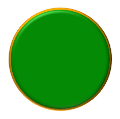

## **مقدمه**

در پاورپوینت می‌توانید اشکال را به اسلایدها اضافه کنید. از آنجا که اشکال از خطوط تشکیل شده‌اند، می‌توانید با تغییر یا اعمال افکت‌ها بر روی مرزهای آن‌ها، فرمت‌بندی کنید. علاوه بر این، می‌توانید با تعیین تنظیماتی که پر کردن داخل آن‌ها را کنترل می‌کند، اشکال را فرمت‌بندی کنید.


Aspose.Slides برای Python از طریق Java کلاس‌ها و روش‌هایی را فراهم می‌کند که به شما امکان می‌دهد اشکال را با همان گزینه‌های موجود در پاورپوینت فرمت‌بندی کنید.

## **قالب‌بندی خطوط**

با استفاده از Aspose.Slides می‌توانید سبک خط سفارشی برای یک شکل تعیین کنید. مراحل زیر نحوه انجام این کار را توضیح می‌دهد:

1. یک نمونه از کلاس [Presentation](https://reference.aspose.com/slides/fa/python-java/aspose.slides/presentation/) ایجاد کنید.
1. یک ارجاع به اسلایدی بر اساس شاخص آن دریافت کنید.
1. یک [AutoShape](https://reference.aspose.com/slides/fa/python-java/aspose.slides/autoshape/) به اسلاید اضافه کنید.
1. [line style](https://reference.aspose.com/slides/fa/python-java/aspose.slides/linestyle/) شکل را تنظیم کنید.
1. عرض خط را تنظیم کنید.
1. [dash style](https://reference.aspose.com/slides/fa/python-java/aspose.slides/linedashstyle/) خط را تنظیم کنید.
1. رنگ خط برای شکل را تنظیم کنید.
1. ارائه‌ی اصلاح‌شده را به عنوان فایل PPTX ذخیره کنید.

کد زیر نشان می‌دهد چگونه یک مستطیل [AutoShape](https://reference.aspose.com/slides/fa/python-java/aspose.slides/autoshape/) را قالب‌بندی کنید:

```python
import jpype
import asposeslides

if not jpype.isJVMStarted():
    jpype.startJVM()

from asposeslides.api import FillType, LineDashStyle, LineStyle, Presentation, SaveFormat, ShapeType
from java.awt import Color

# نمونه‌سازی کلاس Presentation که نمایانگر یک فایل ارائه است.
presentation = Presentation()
try:
    # دریافت اسلاید اول.
    slide = presentation.getSlides().get_Item(0)

    # افزودن یک AutoShape از نوع Rectangle.
    shape = slide.getShapes().addAutoShape(ShapeType.Rectangle, 50, 150, 150, 75)

    # تنظیم رنگ پر کردن برای شکل مستطیل.
    shape.getFillFormat().setFillType(FillType.NoFill)

    # اعمال قالب‌بندی بر خطوط مستطیل.
    shape.getLineFormat().setStyle(LineStyle.ThickThin)
    shape.getLineFormat().setWidth(7)
    shape.getLineFormat().setDashStyle(LineDashStyle.Dash)

    # تنظیم رنگ برای خط مستطیل.
    shape.getLineFormat().getFillFormat().setFillType(FillType.Solid)
    shape.getLineFormat().getFillFormat().getSolidFillColor().setColor(Color.BLUE)

    # ذخیره فایل PPTX بر روی دیسک.
    presentation.save("formatted_lines.pptx", SaveFormat.Pptx)
finally:
    presentation.dispose()
```

نتیجه:


## **اعمال افکت Sketch به خطوط شکل**

یک افکت Sketch خطوط شکل را شبیه به نقاشی دستی می‌کند. از [Shape.getLineFormat](https://reference.aspose.com/slides/fa/python-java/aspose.slides/shape/#getLineFormat) برای دسترسی به تنظیمات خط، [LineFormat.getSketchFormat](https://reference.aspose.com/slides/fa/python-java/aspose.slides/lineformat/#getSketchFormat) برای دسترسی به تنظیمات Sketch و [SketchFormat.setSketchType](https://reference.aspose.com/slides/fa/python-java/aspose.slides/sketchformat/#setSketchType) برای انتخاب یک مقدار از شمارش‌گر [LineSketchType](https://reference.aspose.com/slides/fa/python-java/aspose.slides/linesketchtype/) استفاده کنید.

کد Python زیر نشان می‌دهد چگونه یک افکت [LineSketchType.Curved](https://reference.aspose.com/slides/fa/python-java/aspose.slides/linesketchtype/#Curved) اعمال کنید، مقدار اختصاص داده‌شده را بخوانید و افکت را با [LineSketchType.None_](https://reference.aspose.com/slides/fa/python-java/aspose.slides/linesketchtype/#None) حذف کنید:

```python
import jpype
import asposeslides

if not jpype.isJVMStarted():
    jpype.startJVM()

from asposeslides.api import LineSketchType, Presentation, ShapeType

presentation = Presentation()
try:
    slide = presentation.getSlides().get_Item(0)
    shape = slide.getShapes().addAutoShape(ShapeType.Rectangle, 50, 50, 200, 100)

    # دسترسی به قالب‌بندی خط شکل و قالب‌بندی اسکچ آن.
    sketch_format = shape.getLineFormat().getSketchFormat()

    # اعمال یک اثر اسکچ.
    sketch_format.setSketchType(LineSketchType.Curved)

    # خواندن اثر اسکچ اختصاص داده‌شده مستقیم به شکل.
    explicit_sketch_type = sketch_format.getSketchType()
    print(f"Explicit sketch type: {explicit_sketch_type}")

    # حذف اثر اسکچ.
    sketch_format.setSketchType(LineSketchType.None_)
finally:
    presentation.dispose()
```

مقداری که توسط [SketchFormat.getSketchType](https://reference.aspose.com/slides/fa/python-java/aspose.slides/sketchformat/#getSketchType) بازگردانده می‌شود، تنظیمی است که مستقیماً به شکل اختصاص داده شده است. اگر قالب‌بندی خط می‌تواند از یک تم، اسلاید اصلی یا اسلاید طرحواره به ارث برده شود، از [LineFormat.getEffective](https://reference.aspose.com/slides/fa/python-java/aspose.slides/lineformat/#getEffective) استفاده کنید، به `LineFormatEffectiveData.getSketchFormat` دسترسی پیدا کنید و `SketchFormatEffectiveData.getSketchType` را بخوانید. مقدار مؤثر، قالب‌بندی واقعی را پس از حل ارث‌بری نشان می‌دهد:

```python
import jpype
import asposeslides

if not jpype.isJVMStarted():
    jpype.startJVM()

from asposeslides.api import Presentation

presentation = Presentation("presentation.pptx")
try:
    shape = presentation.getSlides().get_Item(0).getShapes().get_Item(0)
    line_format = shape.getLineFormat()

    explicit_sketch_type = line_format.getSketchFormat().getSketchType()
    effective_line_format = line_format.getEffective()
    effective_sketch_type = effective_line_format.getSketchFormat().getSketchType()

    print(f"Explicit sketch type: {explicit_sketch_type}")
    print(f"Effective sketch type: {effective_sketch_type}")
finally:
    presentation.dispose()
```

## **قالب‌بندی سبک‌های Join**

سه گزینه نوع Join عبارتند از:

* Round
* Miter
* Bevel

به‌طور پیش‌فرض، وقتی پاورپوینت دو خط را در زاویه‌ای (مانند گوشه یک شکل) به هم وصل می‌کند، از تنظیم **Round** استفاده می‌کند. اما اگر شکل را با زاویه‌های تیز می‌کشید، ممکن است گزینه **Miter** را ترجیح دهید.


کد Python زیر نشان می‌دهد چگونه سه مستطیل (همان‌طور که در تصویر بالا نمایش داده شده) با استفاده از تنظیمات Join نوع Miter، Bevel و Round ایجاد شدند:

```python
import jpype
import asposeslides

if not jpype.isJVMStarted():
    jpype.startJVM()

from asposeslides.api import FillType, LineJoinStyle, Presentation, SaveFormat, ShapeType
from java.awt import Color

# نمونه‌سازی کلاس Presentation که نمایانگر یک فایل ارائه است.
presentation = Presentation()
try:
    # دریافت اسلاید اول.
    slide = presentation.getSlides().get_Item(0)

    # افزودن سه AutoShape از نوع Rectangle.
    miter_shape = slide.getShapes().addAutoShape(ShapeType.Rectangle, 20, 20, 150, 75)
    bevel_shape = slide.getShapes().addAutoShape(ShapeType.Rectangle, 210, 20, 150, 75)
    round_shape = slide.getShapes().addAutoShape(ShapeType.Rectangle, 20, 135, 150, 75)

    # تنظیم رنگ پر کردن برای هر شکل مستطیل.
    miter_shape.getFillFormat().setFillType(FillType.Solid)
    miter_shape.getFillFormat().getSolidFillColor().setColor(Color.BLACK)
    bevel_shape.getFillFormat().setFillType(FillType.Solid)
    bevel_shape.getFillFormat().getSolidFillColor().setColor(Color.BLACK)
    round_shape.getFillFormat().setFillType(FillType.Solid)
    round_shape.getFillFormat().getSolidFillColor().setColor(Color.BLACK)

    # تنظیم عرض خط.
    miter_shape.getLineFormat().setWidth(15)
    bevel_shape.getLineFormat().setWidth(15)
    round_shape.getLineFormat().setWidth(15)

    # تنظیم رنگ برای خط هر مستطیل.
    miter_shape.getLineFormat().getFillFormat().setFillType(FillType.Solid)
    miter_shape.getLineFormat().getFillFormat().getSolidFillColor().setColor(Color.BLUE)
    bevel_shape.getLineFormat().getFillFormat().setFillType(FillType.Solid)
    bevel_shape.getLineFormat().getFillFormat().getSolidFillColor().setColor(Color.BLUE)
    round_shape.getLineFormat().getFillFormat().setFillType(FillType.Solid)
    round_shape.getLineFormat().getFillFormat().getSolidFillColor().setColor(Color.BLUE)

    # تنظیم سبک اتصال.
    miter_shape.getLineFormat().setJoinStyle(LineJoinStyle.Miter)
    bevel_shape.getLineFormat().setJoinStyle(LineJoinStyle.Bevel)
    round_shape.getLineFormat().setJoinStyle(LineJoinStyle.Round)

    # افزودن متن به هر مستطیل.
    miter_shape.getTextFrame().setText("Miter Join Style")
    bevel_shape.getTextFrame().setText("Bevel Join Style")
    round_shape.getTextFrame().setText("Round Join Style")

    # ذخیره فایل PPTX بر روی دیسک.
    presentation.save("join_styles.pptx", SaveFormat.Pptx)
finally:
    presentation.dispose()
```

## **پر کردن گرادیان**

در پاورپوینت، پر کردن گرادیان یک گزینه فرمت‌بندی است که به شما امکان می‌دهد ترکیبی پیوسته از رنگ‌ها را بر روی یک شکل اعمال کنید. به‌عنوان مثال، می‌توانید دو یا چند رنگ را به‌طوری که یکی به تدریج به دیگری محو شود، اعمال کنید.

در اینجا نحوه اعمال پر کردن گرادیان به یک شکل با استفاده از Aspose.Slides آورده شده است:

1. یک نمونه از کلاس [Presentation](https://reference.aspose.com/slides/fa/python-java/aspose.slides/presentation/) ایجاد کنید.
1. یک ارجاع به اسلایدی بر اساس شاخص آن دریافت کنید.
1. یک [AutoShape](https://reference.aspose.com/slides/fa/python-java/aspose.slides/autoshape/) به اسلاید اضافه کنید.
1. [FillType](https://reference.aspose.com/slides/fa/python-java/aspose.slides/filltype/) شکل را به `Gradient` تنظیم کنید.
1. دو رنگ مورد علاقه خود را با موقعیت‌های تعریف‌شده با استفاده از متد [addPresetColor](https://reference.aspose.com/slides/fa/python-java/aspose.slides/gradientstopcollection/#addPresetColor) در مجموعه‌گرادیان‌استاپ‌های ارائه‌شده توسط کلاس [GradientFormat](https://reference.aspose.com/slides/fa/python-java/aspose.slides/gradientformat/) اضافه کنید.
1. ارائه‌ی اصلاح‌شده را به عنوان فایل PPTX ذخیره کنید.

کد Python زیر نشان می‌دهد چگونه اثر پر کردن گرادیان را به یک بیضی اعمال کنید:

```python
import jpage
import asposeslides

if not jpype.isJVMStarted():
    jpype.startJVM()

from asposeslides.api import FillType, GradientDirection, GradientShape, Presentation, PresetColor, SaveFormat, ShapeType
from java.awt import Color

# نمونه‌سازی کلاس Presentation که نمایانگر یک فایل ارائه است.
presentation = Presentation()
try:
    # دریافت اسلاید اول.
    slide = presentation.getSlides().get_Item(0)

    # افزودن یک AutoShape از نوع Ellipse.
    shape = slide.getShapes().addAutoShape(ShapeType.Ellipse, 50, 50, 150, 75)

    # اعمال قالب‌بندی گرادیان به بیضی.
    shape.getFillFormat().setFillType(FillType.Gradient)
    shape.getFillFormat().getGradientFormat().setGradientShape(GradientShape.Linear)

    # تنظیم جهت گرادیان.
    shape.getFillFormat().getGradientFormat().setGradientDirection(GradientDirection.FromCorner2)

    # افزودن دو نقطه توقف گرادیان.
    shape.getFillFormat().getGradientFormat().getGradientStops().addPresetColor(1.0, PresetColor.Purple)
    shape.getFillFormat().getGradientFormat().getGradientStops().addPresetColor(0.0, PresetColor.Red)

    # ذخیره فایل PPTX بر روی دیسک.
    presentation.save("gradient_fill.pptx", SaveFormat.Pptx)
finally:
    presentation.dispose()
```

نتیجه:


## **پر کردن الگو**

در پاورپوینت، پر کردن الگو یک گزینه فرمت‌بندی است که به شما امکان می‌دهد یک طرح دو‌رنگ—مانند نقطه‌ها، نوارها، خط‌کش‌ها یا شطرنجی‌ها—را بر روی یک شکل اعمال کنید. می‌توانید رنگ‌های سفارشی برای پیش‌زمینه و پس‌زمینه الگو انتخاب کنید.

Aspose.Slides بیش از 45 سبک الگوی پیش‌فرض دارد که می‌توانید بر روی اشکال اعمال کنید تا جذابیت بصری ارائه‌های خود را افزایش دهید. حتی پس از انتخاب یک الگو پیش‌تعریف‌شده، می‌توانید رنگ‌های دقیق مورد استفاده را تعیین کنید.

در اینجا نحوه اعمال پر کردن الگو به یک شکل با استفاده از Aspose.Slides آورده شده است:

1. یک نمونه از کلاس [Presentation](https://reference.aspose.com/slides/fa/python-java/aspose.slides/presentation/) ایجاد کنید.
1. یک ارجاع به اسلایدی بر اساس شاخص آن دریافت کنید.
1. یک [AutoShape](https://reference.aspose.com/slides/fa/python-java/aspose.slides/autoshape/) به اسلاید اضافه کنید.
1. [FillType](https://reference.aspose.com/slides/fa/python-java/aspose.slides/filltype/) شکل را به `Pattern` تنظیم کنید.
1. یک سبک الگو از گزینه‌های پیش‌تعریف‌شده انتخاب کنید.
1. [Background Color](https://reference.aspose.com/slides/fa/python-java/aspose.slides/patternformat/#getBackColor) الگو را تنظیم کنید.
1. [Foreground Color](https://reference.aspose.com/slides/fa/python-java/aspose.slides/patternformat/#getForeColor) الگو را تنظیم کنید.
1. ارائه‌ی اصلاح‌شده را به عنوان فایل PPTX ذخیره کنید.

کد Python زیر نشان می‌دهد چگونه پر کردن الگو را به یک مستطیل اعمال کنید:

```python
import jpype
import asposeslides

if not jpype.isJVMStarted():
    jpype.startJVM()

from asposeslides.api import FillType, PatternStyle, Presentation, SaveFormat, ShapeType
from java.awt import Color

# نمونه‌سازی کلاس Presentation که نمایانگر یک فایل ارائه است.
presentation = Presentation()
try:
    # دریافت اسلاید اول.
    slide = presentation.getSlides().get_Item(0)

    # افزودن یک AutoShape از نوع Rectangle.
    shape = slide.getShapes().addAutoShape(ShapeType.Rectangle, 50, 50, 150, 75)

    # تنظیم نوع پر کردن به Pattern.
    shape.getFillFormat().setFillType(FillType.Pattern)

    # تنظیم سبک الگو.
    shape.getFillFormat().getPatternFormat().setPatternStyle(PatternStyle.Trellis)

    # تنظیم رنگ پس‌زمینه و پیش‌زمینه الگو.
    shape.getFillFormat().getPatternFormat().getBackColor().setColor(Color.LIGHT_GRAY)
    shape.getFillFormat().getPatternFormat().getForeColor().setColor(Color.YELLOW)

    # ذخیره فایل PPTX بر روی دیسک.
    presentation.save("pattern_fill.pptx", SaveFormat.Pptx)
finally:
    presentation.dispose()
```

نتیجه:


## **پر کردن تصویر**

در پاورپوینت، پر کردن تصویر یک گزینه فرمت‌بندی است که به شما اجازه می‌دهد تصویری را داخل یک شکل قرار دهید—به‌صورت مؤثر تصویر به‌عنوان پس‌زمینه شکل استفاده می‌شود.

در اینجا نحوه استفاده از Aspose.Slides برای اعمال پر کردن تصویر به یک شکل آورده شده است:

1. یک نمونه از کلاس [Presentation](https://reference.aspose.com/slides/fa/python-java/aspose.slides/presentation/) ایجاد کنید.
1. یک ارجاع به اسلایدی بر اساس شاخص آن دریافت کنید.
1. یک [AutoShape](https://reference.aspose.com/slides/fa/python-java/aspose.slides/autoshape/) به اسلاید اضافه کنید.
1. [FillType](https://reference.aspose.com/slides/fa/python-java/aspose.slides/filltype/) شکل را به `Picture` تنظیم کنید.
1. حالت پر کردن تصویر را به `Tile` (یا حالت دلخواه دیگر) تنظیم کنید.
1. یک شیء [PPImage](https://reference.aspose.com/slides/fa/python-java/aspose.slides/ppimage/) از تصویری که می‌خواهید استفاده کنید ایجاد کنید.
1. تصویر را به متد `SlidesPicture.setImage` پاس دهید.
1. ارائه‌ی اصلاح‌شده را به عنوان فایل PPTX ذخیره کنید.

بیایید فرض کنیم فایلی به نام "lotus.png" داریم با تصویر زیر:


کد Python زیر نشان می‌دهد چگونه یک شکل را با تصویر پر کنید:

```python
import jpype
import asposeslides

if not jpype.isJVMStarted():
    jpype.startJVM()

from asposeslides.api import FillType, Images, PictureFillMode, Presentation, SaveFormat, ShapeType

# نمونه‌سازی کلاس Presentation که نمایانگر یک فایل ارائه است.
presentation = Presentation()
try:
    # دریافت اسلاید اول.
    slide = presentation.getSlides().get_Item(0)

    # افزودن یک AutoShape از نوع Rectangle.
    shape = slide.getShapes().addAutoShape(ShapeType.Rectangle, 50, 50, 255, 130)
    
    # تنظیم نوع پر کردن به Picture.
    shape.getFillFormat().setFillType(FillType.Picture)

    # تنظیم حالت پر کردن تصویر.
    shape.getFillFormat().getPictureFillFormat().setPictureFillMode(PictureFillMode.Tile)

    # بارگذاری یک تصویر و افزودن آن به منابع ارائه.
    image = Images.fromFile("lotus.png")
    picture = presentation.getImages().addImage(image)
    image.dispose()

    # تنظیم تصویر.
    shape.getFillFormat().getPictureFillFormat().getPicture().setImage(picture)

    # ذخیره فایل PPTX بر روی دیسک.
    presentation.save("picture_fill.pptx", SaveFormat.Pptx)
finally:
    presentation.dispose()
```

نتیجه:


### **تایل تصویر به‌عنوان بافت**

اگر می‌خواهید تصویری را به‌صورت تایل شده به عنوان بافت تنظیم کنید و رفتار تایلینگ را سفارشی کنید، می‌توانید از روش‌های زیر کلاس [PictureFillFormat](https://reference.aspose.com/slides/fa/python-java/aspose.slides/picturefillformat/) استفاده کنید:

- [setPictureFillMode](https://reference.aspose.com/slides/fa/python-java/aspose.slides/picturefillformat/#setPictureFillMode): حالت پر کردن تصویر را تنظیم می‌کند—یا `Tile` یا `Stretch`.
- [setTileAlignment](https://reference.aspose.com/slides/fa/python-java/aspose.slides/picturefillformat/#setTileAlignment): ترازبندی تایل‌ها درون شکل را مشخص می‌کند.
- [setTileFlip](https://reference.aspose.com/slides/fa/python-java/aspose.slides/picturefillformat/#setTileFlip): تعیین می‌کند آیا تایل به‌صورت افقی، عمودی یا هر دو وارونه شود.
- [setTileOffsetX](https://reference.aspose.com/slides/fa/python-java/aspose.slides/picturefillformat/#setTileOffsetX): جابجایی افقی تایل (به نقطه) را از مبدأ شکل تعیین می‌کند.
- [setTileOffsetY](https://reference.aspose.com/slides/fa/python-java/aspose.slides/picturefillformat/#setTileOffsetY): جابجایی عمودی تایل (به نقطه) را از مبدأ شکل تعیین می‌کند.
- [setTileScaleX](https://reference.aspose.com/slides/fa/python-java/aspose.slides/picturefillformat/#setTileScaleX): مقیاس افقی تایل به‌صورت درصد تعریف می‌شود.
- [setTileScaleY](https://reference.aspose.com/slides/fa/python-java/aspose.slides/picturefillformat/#setTileScaleY): مقیاس عمودی تایل به‌صورت درصد تعریف می‌شود.

نمونه کد زیر نشان می‌دهد چگونه یک شکل مستطیل با پر کردن تصویر تایل‌شده اضافه کنید و گزینه‌های تایل را پیکربندی کنید:

```python
import jpype
import asposeslides

if not jpype.isJVMStarted():
    jpype.startJVM()

from asposeslides.api import FillType, Images, PictureFillMode, Presentation, RectangleAlignment, SaveFormat, ShapeType, TileFlip

# نمونه‌سازی کلاس Presentation که نمایانگر یک فایل ارائه است.
presentation = Presentation()
try:
    # دریافت اسلاید اول.
    first_slide = presentation.getSlides().get_Item(0)

    # افزودن یک AutoShape مستطیل.
    shape = first_slide.getShapes().addAutoShape(ShapeType.Rectangle, 50, 50, 190, 95)

    # تنظیم نوع پر کردن شکل به Picture.
    shape.getFillFormat().setFillType(FillType.Picture)

    # بارگذاری تصویر و افزودن آن به منابع ارائه.
    source_image = Images.fromFile("lotus.png")
    presentation_image = presentation.getImages().addImage(source_image)
    source_image.dispose()

    # اختصاص تصویر به شکل.
    picture_fill_format = shape.getFillFormat().getPictureFillFormat()
    picture_fill_format.getPicture().setImage(presentation_image)

    # پیکربندی حالت پر کردن تصویر و ویژگی‌های کاشی‌بندی.
    picture_fill_format.setPictureFillMode(PictureFillMode.Tile)
    picture_fill_format.setTileOffsetX(-32)
    picture_fill_format.setTileOffsetY(-32)
    picture_fill_format.setTileScaleX(50)
    picture_fill_format.setTileScaleY(50)
    picture_fill_format.setTileAlignment(RectangleAlignment.BottomRight)
    picture_fill_format.setTileFlip(TileFlip.FlipBoth)

    # ذخیره فایل PPTX بر روی دیسک.
    presentation.save("tile.pptx", SaveFormat.Pptx)
finally:
    presentation.dispose()
```

نتیجه:


## **پر کردن رنگ ثابت**

در پاورپوینت، پر کردن رنگ ثابت یک گزینه فرمت‌بندی است که یک شکل را با یک رنگ یکنواخت پر می‌کند. این رنگ پس‌زمینه ساده بدون هیچ‌گونه گرادیان، بافت یا الگو اعمال می‌شود.

برای اعمال پر کردن رنگ ثابت به یک شکل با استفاده از Aspose.Slides، این مراحل را دنبال کنید:

1. یک نمونه از کلاس [Presentation](https://reference.aspose.com/slides/fa/python-java/aspose.slides/presentation/) ایجاد کنید.
1. یک ارجاع به اسلایدی بر اساس شاخص آن دریافت کنید.
1. یک [AutoShape](https://reference.aspose.com/slides/fa/python-java/aspose.slides/autoshape/) به اسلاید اضافه کنید.
1. [FillType](https://reference.aspose.com/slides/fa/python-java/aspose.slides/filltype/) شکل را به `Solid` تنظیم کنید.
1. رنگ پر کردن دلخواه خود را به شکل اختصاص دهید.
1. ارائه‌ی اصلاح‌شده را به عنوان فایل PPTX ذخیره کنید.

کد Python زیر نشان می‌دهد چگونه پر کردن رنگ ثابت را به یک مستطیل در اسلاید پاورپوینت اعمال کنید:

```python
import jpype
import asposeslides

if not jpage.isJVMStarted():
    jpype.startJVM()

from asposeslides.api import FillType, Presentation, SaveFormat, ShapeType
from java.awt import Color

# ایجاد یک نمونه از کلاس Presentation که نمایانگر یک فایل ارائه است.
presentation = Presentation()
try:
    # دریافت اسلاید اول.
    slide = presentation.getSlides().get_Item(0)

    # افزودن یک AutoShape از نوع Rectangle.
    shape = slide.getShapes().addAutoShape(ShapeType.Rectangle, 50, 50, 150, 75)

    # تنظیم نوع پر کردن به Solid.
    shape.getFillFormat().setFillType(FillType.Solid)

    # تنظیم رنگ پر کردن.
    shape.getFillFormat().getSolidFillColor().setColor(Color.YELLOW)

    # ذخیره فایل PPTX بر روی دیسک.
    presentation.save("solid_color_fill.pptx", SaveFormat.Pptx)
finally:
    presentation.dispose()
```

نتیجه:


## **تنظیم شفافیت**

در پاورپوینت، هنگامی که یک رنگ ثابت، گرادیان، تصویر یا بافت را به اشکال اعمال می‌کنید، می‌توانید سطح شفافیتی را تنظیم کنید تا میزان مات بودن پر کردن را کنترل کنید. مقدار شفافیت بالاتر، شکل را شفاف‌تر می‌کند و اجازه می‌دهد پس‌زمینه یا اشیاء زیرین به‌صورت جزئی قابل مشاهده باشند.

Aspose.Slides به‌ شما امکان می‌دهد سطح شفافیت را با تنظیم مقدار آلفا در رنگ مورد استفاده برای پر کردن تنظیم کنید. در اینجا نحوه انجام آن آمده است:

1. یک نمونه از کلاس [Presentation](https://reference.aspose.com/slides/fa/python-java/aspose.slides/presentation/) ایجاد کنید.
1. یک ارجاع به اسلایدی بر اساس شاخص آن دریافت کنید.
1. یک [AutoShape](https://reference.aspose.com/slides/fa/python-java/aspose.slides/autoshape/) به اسلاید اضافه کنید.
1. [FillType](https://reference.aspose.com/slides/fa/python-java/aspose.slides/filltype/) را به `Solid` تنظیم کنید.
1. از [Color](https://docs.oracle.com/en/java/javase/17/docs/api/java.desktop/java/awt/Color.html) برای تعریف یک رنگ با شفافیت استفاده کنید ( المان `alpha` شفافیت را کنترل می‌کند).
1. ارائه را ذخیره کنید.

کد Python زیر نشان می‌دهد چگونه یک رنگ پر کردن شفاف به یک مستطیل اعمال کنید:

```python
import jpype
import asposeslides

if not jpype.isJVMStarted():
    jpype.startJVM()

from asposeslides.api import FillType, Presentation, SaveFormat, ShapeType
from java.awt import Color

# ایجاد یک نمونه از کلاس Presentation که نمایانگر یک فایل ارائه است.
presentation = Presentation()
try:
    # دریافت اسلاید اول.
    slide = presentation.getSlides().get_Item(0)

    # افزودن یک شکل خودکار مستطیل صلب.
    solid_shape = slide.getShapes().addAutoShape(ShapeType.Rectangle, 50, 50, 150, 75)

    # افزودن یک شکل خودکار مستطیل شفاف بر روی شکل صلب.
    transparent_shape = slide.getShapes().addAutoShape(ShapeType.Rectangle, 80, 80, 150, 75)
    transparent_shape.getFillFormat().setFillType(FillType.Solid)
    transparent_color = Color(255, 255, 0, 204)
    transparent_shape.getFillFormat().getSolidFillColor().setColor(transparent_color)

    # ذخیره فایل PPTX بر روی دیسک.
    presentation.save("shape_transparency.pptx", SaveFormat.Pptx)
finally:
    presentation.dispose()
```

نتیجه:


## **چرخاندن اشکال**

Aspose.Slides به شما امکان می‌دهد اشکال را در ارائه‌های پاورپوینت بچرخانید. این می‌تواند هنگام موقعیت‌یابی عناصر بصری با نیازهای خاص تراز یا طراحی مفید باشد.

برای چرخاندن یک شکل در اسلاید، این مراحل را دنبال کنید:

1. یک نمونه از کلاس [Presentation](https://reference.aspose.com/slides/fa/python-java/aspose.slides/presentation/) ایجاد کنید.
1. یک ارجاع به اسلایدی بر اساس شاخص آن دریافت کنید.
1. یک [AutoShape](https://reference.aspose.com/slides/fa/python-java/aspose.slides/autoshape/) به اسلاید اضافه کنید.
1. ویژگی چرخش شکل را به زاویه مورد نظر تنظیم کنید.
1. ارائه را ذخیره کنید.

کد Python زیر نشان می‌دهد چگونه یک شکل را به‌صورت 5 درجه بچرخانید:

```python
import jpide
import asposeslides

if not jpide.isJVMStarted():
    jpide.startJVM()

from asposeslides.api import Presentation, SaveFormat, ShapeType

# ایجاد یک نمونه از کلاس Presentation که نمایانگر یک فایل ارائه است.
presentation = Presentation()
try:
    # دریافت اسلاید اول.
    slide = presentation.getSlides().get_Item(0)

    # افزودن یک AutoShape از نوع Rectangle.
    shape = slide.getShapes().addAutoShape(ShapeType.Rectangle, 50, 50, 150, 75)

    # چرخاندن شکل به میزان 5 درجه.
    shape.setRotation(5)

    # ذخیره فایل PPTX بر روی دیسک.
    presentation.save("shape_rotation.pptx", SaveFormat.Pptx)
finally:
    presentation.dispose()
```

نتیجه:


## **افزودن افکت‌های برجستگی 3D**

Aspose.Slides به شما امکان می‌دهد افکت‌های برجستگی 3D را بر روی اشکال با تنظیم ویژگی‌های [ThreeDFormat](https://reference.aspose.com/slides/fa/python-java/aspose.slides/threedformat/) اعمال کنید.

برای افزودن افکت‌های برجستگی 3D به یک شکل، این مراحل را دنبال کنید:

1. یک نمونه از کلاس [Presentation](https://reference.aspose.com/slides/fa/python-java/aspose.slides/presentation/) ایجاد کنید.
1. یک ارجاع به اسلایدی بر اساس شاخص آن دریافت کنید.
1. یک [AutoShape](https://reference.aspose.com/slides/fa/python-java/aspose.slides/autoshape/) به اسلاید اضافه کنید.
1. ویژگی [ThreeDFormat](https://reference.aspose.com/slides/fa/python-java/aspose.slides/threedformat/) شکل را پیکربندی کنید تا تنظیمات برجستگی را تعریف کنید.
1. ارائه را ذخیره کنید.

کد Python زیر نشان می‌دهد چگونه افکت‌های برجستگی 3D را به یک شکل اعمال کنید:

```python
import jpype
import asposeslides

if not jpype.isJVMStarted():
    jpype.startJVM()

from asposeslides.api import BevelPresetType, CameraPresetType, FillType, LightRigPresetType, LightingDirection, Presentation, SaveFormat, ShapeType
from java.awt import Color

# ایجاد یک نمونه از کلاس Presentation.
presentation = Presentation()
try:
    slide = presentation.getSlides().get_Item(0)

    # افزودن یک شکل به اسلاید.
    shape = slide.getShapes().addAutoShape(ShapeType.Ellipse, 50, 50, 100, 100)
    shape.getFillFormat().setFillType(FillType.Solid)
    shape.getFillFormat().getSolidFillColor().setColor(Color.GREEN)
    shape.getLineFormat().getFillFormat().setFillType(FillType.Solid)
    shape.getLineFormat().getFillFormat().getSolidFillColor().setColor(Color.ORANGE)
    shape.getLineFormat().setWidth(2.0)

    # تنظیم ویژگی‌های ThreeDFormat شکل.
    shape.getThreeDFormat().setDepth(4)
    shape.getThreeDFormat().getBevelTop().setBevelType(BevelPresetType.Circle)
    shape.getThreeDFormat().getBevelTop().setHeight(6)
    shape.getThreeDFormat().getBevelTop().setWidth(6)
    shape.getThreeDFormat().getCamera().setCameraType(CameraPresetType.OrthographicFront)
    shape.getThreeDFormat().getLightRig().setLightType(LightRigPresetType.ThreePt)
    shape.getThreeDFormat().getLightRig().setDirection(LightingDirection.Top)

    # ذخیره ارائه به‌عنوان فایل PPTX.
    presentation.save("3D_bevel_effect.pptx", SaveFormat.Pptx)
finally:
    presentation.dispose()
```

نتیجه:



## **افزودن افکت‌های چرخش 3D**

Aspose.Slides به شما امکان می‌دهد افکت‌های چرخش 3D را بر روی اشکال با تنظیم ویژگی‌های [ThreeDFormat](https://reference.aspose.com/slides/fa/python-java/aspose.slides/threedformat/) اعمال کنید.

برای اعمال چرخش 3D به یک شکل:

1. یک نمونه از کلاس [Presentation](https://reference.aspose.com/slides/fa/python-java/aspose.slides/presentation/) ایجاد کنید.
1. یک ارجاع به اسلایدی بر اساس شاخص آن دریافت کنید.
1. یک [AutoShape](https://reference.aspose.com/slides/fa/python-java/aspose.slides/autoshape/) به اسلاید اضافه کنید.
1. از متدهای [setCameraType](https://reference.aspose.com/slides/fa/python-java/aspose.slides/camera/#setCameraType) و [setLightType](https://reference.aspose.com/slides/fa/python-java/aspose.slides/lightrig/#setLightType) برای تعریف چرخش 3D استفاده کنید.
1. ارائه را ذخیره کنید.

کد Python زیر نشان می‌دهد چگونه افکت‌های چرخش 3D را به یک شکل اعمال کنید:

```python
import jpype
import asposeslides

if not jpype.isJVMStarted():
    jpype.startJVM()

from asposeslides.api import CameraPresetType, LightRigPresetType, Presentation, SaveFormat, ShapeType

# ایجاد یک نمونه از کلاس Presentation.
presentation = Presentation()
try:
    slide = presentation.getSlides().get_Item(0)

    auto_shape = slide.getShapes().addAutoShape(ShapeType.Rectangle, 50, 50, 150, 75)
    auto_shape.getTextFrame().setText("Hello, Aspose!")

    auto_shape.getThreeDFormat().setDepth(6)
    auto_shape.getThreeDFormat().getCamera().setRotation(40, 35, 20)
    auto_shape.getThreeDFormat().getCamera().setCameraType(CameraPresetType.IsometricLeftUp)
    auto_shape.getThreeDFormat().getLightRig().setLightType(LightRigPresetType.Balanced)

    # ذخیره ارائه به‌عنوان فایل PPTX.
    presentation.save("3D_rotation_effect.pptx", SaveFormat.Pptx)
finally:
    presentation.dispose()
```

نتیجه:


## **کنترل رندر سیاه‑سفید برای اشکال**

متد [Shape.setBlackWhiteMode](https://reference.aspose.com/slides/fa/python-java/aspose.slides/shape/#setBlackWhiteMode) مشخص می‌کند که یک شکل به‌طور منفرد چگونه در حالت سیاه‑سفید رندر می‌شود زمانی که یک ارائه در این حالت مشاهده یا پردازش می‌شود. این متد به‌تنهایی حالت نمایش سیاه‑سفید را فعال نمی‌کند و فرمت‌بندی پر کردن، خط یا سایر ویژگی‌های شکل را در حالت رنگ معمولی تغییر نمی‌دهد.

از مقداری از کلاس [BlackWhiteMode](https://reference.aspose.com/slides/fa/python-java/aspose.slides/blackwhitemode/) برای انتخاب رفتار موردنظر استفاده کنید. برای مثال، `Automatic` اجازه می‌دهد برنامه رندر تبدیل را انتخاب کند، `Gray` و `LightGray` از رنگ خاکستری استفاده می‌کنند، `BlackWhite` فقط سیاه و سفید استفاده می‌کند، `Black` و `White` یک رنگ ثابت اعمال می‌کنند، `Color` رنگ طبیعی را حفظ می‌کند و `Hidden` شکل را در حالت سیاه‑سفید حذف می‌کند. `NotDefined` به این معنی است که هیچ حالت سطح‌شفاف برای شکل تعیین نشده است.

کد Python زیر یک شکل رنگی ایجاد می‌کند و آن را طوری تنظیم می‌کند که در حالت نمایش سیاه‑سفید به‌صورت خاکستری نشان داده شود:

```python
import jpype
import asposeslides

if not jpype.isJVMStarted():
    jpype.startJVM()

from asposeslides.api import BlackWhiteMode, FillType, Presentation, SaveFormat, ShapeType
from java.awt import Color

presentation = Presentation()
try:
    slide = presentation.getSlides().get_Item(0)

    shape = slide.getShapes().addAutoShape(ShapeType.Rectangle, 50, 50, 200, 100)
    shape.getFillFormat().setFillType(FillType.Solid)
    shape.getFillFormat().getSolidFillColor().setColor(Color.ORANGE)

    # در حالت رنگ، پر کردن نارنجی را حفظ کنید، اما در حالت سیاه‑سفید شکل را با رنگ خاکستری رندر کنید.
    shape.setBlackWhiteMode(BlackWhiteMode.Gray)

    presentation.save("shape_black_white_mode.pptx", SaveFormat.Pptx)
finally:
    presentation.dispose()
```

در حالت رنگ معمولی، مستطیل پر شدن نارنجی خود را حفظ می‌کند. در یک جریان کاری نمایش سیاه‑سفید، به‌دلیل تنظیم حالت به `Gray`، از رنگ خاکستری استفاده می‌کند. این به شما اجازه می‌دهد اسلاید رنگی کامل را حفظ کنید و ظاهر متمایزی برای چاپ، پیش‌نمایش یا سایر جریان‌های کاری که تنظیمات نمایش سیاه‑سفید ارائه را رعایت می‌کنند، تعریف کنید.

## **بازنشانی فرمت‌بندی**

کد Python زیر نشان می‌دهد چگونه فرمت‌بندی یک اسلاید را بازنشانی کنید و موقعیت، اندازه و فرمت تمام اشکال با نگه‌دارنده‌ها را در [LayoutSlide](https://reference.aspose.com/slides/fa/python-java/aspose.slides/layoutslide/) به تنظیمات پیش‌فرض برگردانید:

```python
import jpype
import asposeslides

if not jpype.isJVMStarted():
    jpype.startJVM()

from asposeslides.api import Presentation, SaveFormat

presentation = Presentation("sample.pptx")
try:
    for slide in presentation.getSlides():
        # بازنشانی هر شکلی در اسلاید که نگه‌دارنده‌ای در طرح‌بندی دارد.
        slide.reset()

    presentation.save("reset_formatting.pptx", SaveFormat.Pptx)
finally:
    presentation.dispose()
```

## **سؤالات متداول**

**آیا فرمت‌بندی شکل بر اندازه نهایی فایل ارائه تأثیر می‌گذارد؟**

به‌صورت کمینه. تصاویر و رسانه‌های جاسازی‌شده اکثر فضا را اشغال می‌کنند، در حالی که پارامترهای شکل مانند رنگ‌ها، افکت‌ها و گرادیان‌ها به‌عنوان فراداده ذخیره می‌شوند و به‌صورت قابل توجهی اندازه اضافه نمی‌کنند.

**چگونه می‌توانم شکل‌هایی را در یک اسلاید شناسایی کنم که قالب‌بندی یکسانی دارند تا بتوانم آن‌ها را گروه‌بندی کنم؟**

هر ویژگی کلیدی فرمت‌بندی شکل‌ها—پر کردن، خط و تنظیمات افکت—را مقایسه کنید. اگر تمام مقادیر متناظر مطابقت داشته باشند، سبک آن‌ها را یکسان در نظر بگیرید و منطقی آن‌ها را گروه‌بندی کنید؛ این کار مدیریت سبک‌ها را در مراحل بعدی ساده می‌کند.

**آیا می‌توانم مجموعه‌ای از سبک‌های سفارشی شکل را در یک فایل جداگانه ذخیره کنم تا در ارائه‌های دیگر استفاده کنم؟**

بله. اشکال نمونه با سبک‌های دلخواه را در یک اسلاید قالب یا فایل قالب .POTX ذخیره کنید. هنگام ایجاد ارائه جدید، قالب را باز کنید، اشکال سبک‌دار موردنیاز را کلون کنید و فرمت‌بندی آن‌ها را در مکان‌های موردنظر مجدداً اعمال کنید.