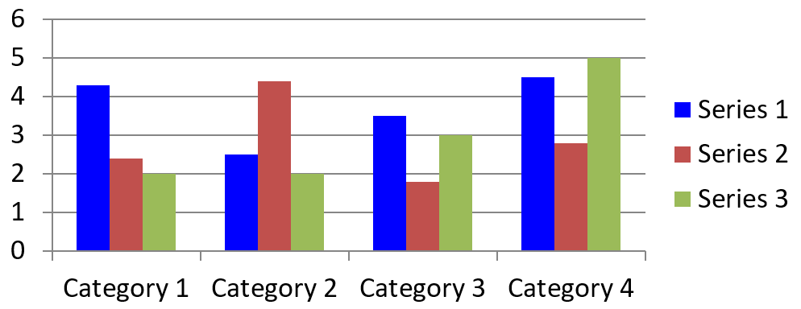

## **نمای کلی**

این مقاله نقش [ChartSeries](https://reference.aspose.com/slides/fa/python-net/aspose.slides.charts/chartseries/) را در Aspose.Slides برای Python توضیح می‌دهد و بر چگونگی ساختاردهی و نمایش داده‌ها در ارائه‌ها تمرکز دارد. این اشیاء عناصر بنیادینی را فراهم می‌کنند که مجموعه‌های جداگانه‌ای از نقاط داده، دسته‌ها و پارامترهای ظاهر را در یک نمودار تعریف می‌کند. با کار با [ChartSeries](https://reference.aspose.com/slides/fa/python-net/aspose.slides.charts/chartseries/)، توسعه‌دهندگان می‌توانند به‌راحتی منابع داده زیرین را یکپارچه کرده و کنترل کامل بر نحوه نمایش اطلاعات داشته باشند و در نتیجه ارائه‌های پویا و داده‑محور تولید کنند که بینش‌ها و تجزیه و تحلیل‌ها را به‌صورت واضح منتقل می‌نمایند.

یک سری، ردیف یا ستونی از اعداد است که در یک نمودار رسم می‌شود.


## **تنظیم همپوشانی سری‌ها**

ویژگی [ChartSeries.overlap](https://reference.aspose.com/slides/fa/python-net/aspose.slides.charts/chartseries/overlap/) کنترل می‌کند که نوارها و ستون‌ها در یک نمودار دو‑بعدی چگونه همپوشانی داشته باشند و بازه‌ای بین -100 تا 100 را تعیین می‌کند. از آنجا که این ویژگی به گروه سری‌ها وابسته است نه به هر سری نمودار به‌صورت جداگانه، در سطح سری فقط خواندنی است. برای پیکربندی مقادیر همپوشانی، از ویژگی `parent_series_group.overlap` که خواندن/نوشتن است استفاده کنید؛ این ویژگی همپوشانی مشخص‌شده را برای تمام سری‌های آن گروه اعمال می‌کند.

در زیر یک مثال پایتون نشان می‌دهد که چگونه یک ارائه ایجاد، یک نمودار ستونی خوشه‌ای اضافه، اولین سری نمودار را دسترسی، تنظیم همپوشانی را پیکربندی و سپس فایل نتیجه را به صورت PPTX ذخیره کنید:

```py
import aspose.slides as slides
import aspose.slides.charts as charts

series_overlap = 30

with slides.Presentation() as presentation:
    slide = presentation.slides[0]

    # افزودن یک نمودار ستونی خوشه‌ای با داده‌های پیش‌فرض.
    chart = slide.shapes.add_chart(charts.ChartType.CLUSTERED_COLUMN, 20, 20, 500, 200)

    series = chart.chart_data.series[0]
    if series.overlap == 0:
        # تنظیم همپوشانی سری.
        series.parent_series_group.overlap = series_overlap

    # ذخیره‌سازی فایل ارائه بر روی دیسک.
    presentation.save("series_overlap.pptx", slides.export.SaveFormat.PPTX)
```

نتیجه:


## **تغییر رنگ پر شدن سری**

Aspose.Slides امکان سفارشی‌سازی رنگ‌های پر شدن سری‌های نمودار را به‌صورت ساده فراهم می‌کند تا بتوانید نقاط داده مشخصی را برجسته کنید و نمودارهای بصری جذابی بسازید. این کار از طریق شیء [Format](https://reference.aspose.com/slides/fa/python-net/aspose.slides.charts/format/) انجام می‌شود که انواع پر شدن، پیکربندی‌های رنگ و سایر گزینه‌های پیشرفته استایل را پشتیبانی می‌کند. پس از افزودن یک نمودار به اسلاید و دسترسی به سری موردنظر، به‌سادگی سری را دریافت و رنگ پر شدن مناسب را اعمال کنید. علاوه بر پر کردن‌های یک‑دانه، می‌توانید از پر کردن‌های گرادیان یا الگو برای انعطاف طراحی بیشتر استفاده کنید. پس از تنظیم رنگ‌ها مطابق نیازهای خود، ارائه را ذخیره کنید تا ظاهر به‌روزشده نهایی شود.

کد پایتون زیر نشان می‌دهد چگونه رنگ اولین سری را تغییر دهید:

```py
import aspose.slides as slides
import aspose.slides.charts as charts
import aspose.pydrawing as draw

series_color = draw.Color.blue

with slides.Presentation() as presentation:
    slide = presentation.slides[0]

    # افزودن یک نمودار ستونی خوشه‌ای با داده‌های پیش‌فرض.
    chart = slide.shapes.add_chart(charts.ChartType.CLUSTERED_COLUMN, 20, 20, 500, 200)

    # تنظیم رنگ اولین سری.
    series = chart.chart_data.series[0]
    series.format.fill.fill_type = slides.FillType.SOLID
    series.format.fill.solid_fill_color.color = series_color

    # ذخیره‌سازی فایل ارائه بر روی دیسک.
    presentation.save("series_color.pptx", slides.export.SaveFormat.PPTX)
```

نتیجه:



## **تغییر نام یک سری**

Aspose.Slides روشی ساده برای تغییر نام سری‌های نمودار ارائه می‌دهد تا برچسب‌گذاری داده‌ها به‌صورت واضح و معنادار انجام شود. با دسترسی به سلول مربوطه در داده‌های نمودار، توسعه‌دهندگان می‌توانند نحوه ارائه داده‌ها را سفارشی کنند. این تغییر به‌ویژه زمانی مفید است که نام‌های سری‌ها بر اساس زمینه داده نیاز به به‌روزرسانی یا شفاف‌سازی داشته باشند. پس از تغییر نام سری، می‌توانید ارائه را ذخیره کنید تا تغییرات حفظ شوند.

در زیر یک قطعه کد پایتون این فرآیند را نشان می‌دهد.

```py
import aspose.slides as slides
import aspose.slides.charts as charts

series_name = "New name"

with slides.Presentation() as presentation:
    slide = presentation.slides[0]

    # افزودن یک نمودار ستونی خوشه‌ای با داده‌های پیش‌فرض.
    chart = slide.shapes.add_chart(charts.ChartType.CLUSTERED_COLUMN, 20, 20, 500, 200)
    
    # تنظیم نام اولین سری.
    series_cell = chart.chart_data.chart_data_workbook.get_cell(0, 0, 1)
    series_cell.value = series_name
    
    # ذخیره‌سازی فایل ارائه بر روی دیسک.
    presentation.save("series_name.pptx", slides.export.SaveFormat.PPTX)
```

کد پایتون زیر روشی جایگزین برای تغییر نام سری نشان می‌دهد:

```py
import aspose.slides as slides
import aspose.slides.charts as charts

series_name = "New name"

with slides.Presentation() as presentation:
    slide = presentation.slides[0]

    # افزودن یک نمودار ستونی خوشه‌ای با داده‌های پیش‌فرض.
    chart = slide.shapes.add_chart(charts.ChartType.CLUSTERED_COLUMN, 20, 20, 500, 200)
    series = chart.chart_data.series[0]
    
    # تنظیم نام اولین سری.
    series.name.as_cells[0].value = series_name

    # ذخیره‌سازی فایل ارائه بر روی دیسک.
    presentation.save("series_name.pptx", slides.export.SaveFormat.PPTX) 
```

نتیجه:


## **دریافت رنگ پر شدن خودکار سری**

Aspose.Slides برای Python به شما اجازه می‌دهد رنگ پر شدن خودکار برای سری‌های نمودار در داخل ناحیه ترسیم را به‌دست آورید. پس از ایجاد یک نمونه از کلاس [Presentation](https://reference.aspose.com/slides/fa/python-net/aspose.slides/presentation/) می‌توانید مرجع اسلاید موردنظر را بر اساس اندیس دریافت کنید، سپس یک نمودار با نوع دلخواه (مانند `ChartType.CLUSTERED_COLUMN`) اضافه کنید. با دسترسی به سری‌های موجود در نمودار، می‌توانید رنگ پر شدن خودکار را دریافت کنید.

کد پایتون زیر این فرآیند را به‌تفصیل نشان می‌دهد.

```py
import aspose.slides as slides
import aspose.slides.charts as charts

with slides.Presentation() as presentation:
    slide = presentation.slides[0]

    # افزودن یک نمودار ستونی خوشه‌ای با داده‌های پیش‌فرض.
    chart = slide.shapes.add_chart(charts.ChartType.CLUSTERED_COLUMN, 20, 20, 500, 200)

    for i in range(len(chart.chart_data.series)):
        # دریافت رنگ پر شدن سری.
        color = chart.chart_data.series[i].get_automatic_series_color()
        print(f"Series {i} color: {color.name}")
```

خروجی نمونه:

```text
Series 0 color: ff4f81bd
Series 1 color: ffc0504d
Series 2 color: ff9bbb59
```

## **تنظیم رنگ‌های معکوس پر برای یک سری**

زمانی که سری داده شما شامل مقادیر مثبت و منفی باشد، رنگ‌آمیزی همه ستون‌ها یا نوارها به‌یکسان می‌تواند نمودار را خواندنی نکند. Aspose.Slides برای Python به شما امکان می‌دهد یک رنگ پر معکوس—یک پر شدن جداگانه که به‌صورت خودکار به نقاط داده‌ای که زیر صفر هستند اعمال می‌شود—اختصاص دهید تا مقادیر منفی به‌سرعت قابل تشخیص باشند. در این بخش یاد می‌گیرید چگونه این گزینه را فعال کنید، رنگ مناسب را انتخاب کنید و ارائه به‌روزرسانی‌شده را ذخیره نمایید.

کد مثال زیر عملیات را نشان می‌دهد:

```py
import aspose.slides as slides
import aspose.slides.charts as charts
import aspose.pydrawing as draw

invert_color = draw.Color.red

with slides.Presentation() as presentation:
    slide = presentation.slides[0]

    chart = slide.shapes.add_chart(charts.ChartType.CLUSTERED_COLUMN, 20, 20, 500, 200)
    workBook = chart.chart_data.chart_data_workbook

    chart.chart_data.series.clear()
    chart.chart_data.categories.clear()

    # افزودن دسته‌های جدید.
    chart.chart_data.categories.add(workBook.get_cell(0, 1, 0, "Category 1"))
    chart.chart_data.categories.add(workBook.get_cell(0, 2, 0, "Category 2"))
    chart.chart_data.categories.add(workBook.get_cell(0, 3, 0, "Category 3"))

    # افزودن یک سری جدید.
    series = chart.chart_data.series.add(workBook.get_cell(0, 0, 1, "Series 1"), chart.type)

    # پر کردن داده‌های سری.
    series.data_points.add_data_point_for_bar_series(workBook.get_cell(0, 1, 1, -20))
    series.data_points.add_data_point_for_bar_series(workBook.get_cell(0, 2, 1, 50))
    series.data_points.add_data_point_for_bar_series(workBook.get_cell(0, 3, 1, -30))

    # تنظیمات رنگ برای سری.
    series_color = series.get_automatic_series_color()
    series.invert_if_negative = True
    series.format.fill.fill_type = slides.FillType.SOLID
    series.format.fill.solid_fill_color.color = series_color
    series.inverted_solid_fill_color.color = invert_color
    presentation.save("inverted_solid_fill_color.pptx", slides.export.SaveFormat.PPTX)
```

نتیجه:


می‌توانید رنگ پر شدن را برای یک نقطه دادهٔ خاص به‌جای تمام سری معکوس کنید. به‌سادگی به `ChartDataPoint` موردنظر دسترسی پیدا کنید و ویژگی `invert_if_negative` آن را روی `True` تنظیم کنید.

کد مثال زیر نحوه انجام این کار را نشان می‌دهد:

```py
import aspose.slides as slides
import aspose.slides.charts as charts
import aspose.pydrawing as draw

with slides.Presentation() as presentation:
    slide = presentation.slides[0]

	chart = slide.shapes.add_chart(charts.ChartType.CLUSTERED_COLUMN, 20, 20, 500, 200, True)
	chart.chart_data.series.clear()

	series = series.add(chart.chart_data.chart_data_workbook.get_cell(0, "B1"), chart.type)

	series.data_points.add_data_point_for_bar_series(chart.chart_data.chart_data_workbook.get_cell(0, "B2", -5))
	series.data_points.add_data_point_for_bar_series(chart.chart_data.chart_data_workbook.get_cell(0, "B3", 3))
	series.data_points.add_data_point_for_bar_series(chart.chart_data.chart_data_workbook.get_cell(0, "B4", -3))
	series.data_points.add_data_point_for_bar_series(chart.chart_data.chart_data_workbook.get_cell(0, "B5", 1))

	series.invert_if_negative = False
	series.data_points[2].invert_if_negative = True

	presentation.save("data_point_invert_color_if_negative.pptx", slides.export.SaveFormat.PPTX)
```

## **پاک‌سازی داده برای نقاط داده خاص**

گاهی یک نمودار شامل مقادیر آزمایشی، نقاط فرّی یا ورودی‌های منسوخ می‌شود که نیاز به حذف آن‌ها بدون بازسازی کل سری دارید. Aspose.Slides برای Python به شما اجازه می‌دهد هر نقطه داده را بر اساس اندیس هدف‌گیری، محتویات آن را پاک کنید و بلافاصله نمودار را به‌روزرسانی کنید تا نقاط باقی‌مانده منتقل شوند و محورها به‌صورت خودکار مقیاس‌بندی شوند.

کد مثال زیر این عملیات را نشان می‌دهد:

```py
import aspose.slides as slides
import aspose.slides.charts as charts

with slides.Presentation("test_chart.pptx") as presentation:
    slide = presentation.slides[0]
    chart = slide.shapes[0]
    series = chart.chart_data.series[0]

    for data_point in series.data_points:
        data_point.x_value.as_cell.value = None
        data_point.y_value.as_cell.value = None

    series.data_points.clear()

    presentation.save("clear_data_points.pptx", slides.export.SaveFormat.PPTX)
```

## **تنظیم عرض فاصله سری**

عرض فاصله کنترل می‌کند که چه مقدار فضای خالی بین ستون‌ها یا نوارهای مجاور وجود داشته باشد—فاصله‌های بزرگتر به دسته‌های جداگانه تأکید می‌کنند، در حالی که فاصله‌های باریک‌تر ظاهری متراکم‌تر ایجاد می‌کنند. از طریق Aspose.Slides for Python می‌توانید این پارامتر را برای یک سری کامل تنظیم کنید و دقیقاً تعادل بصری موردنیاز نمایش خود را بدون تغییر داده‌های پایه به‌دست آورید.

کد مثال زیر نشان می‌دهد چگونه عرض فاصله را برای یک سری تنظیم کنید:

```py
import aspose.slides as slides
import aspose.slides.charts as charts

gap_width = 30

# ایجاد یک ارائه خالی.
with slides.Presentation() as presentation:

    # دسترسی به اولین اسلاید.
    slide = presentation.slides[0]

    # افزودن یک نمودار با داده‌های پیش‌فرض.
    chart = slide.shapes.add_chart(charts.ChartType.STACKED_COLUMN, 20, 20, 500, 200)

    # ذخیره‌سازی ارائه بر روی دیسک.
    presentation.save("default_gap_width.pptx", slides.export.SaveFormat.PPTX)

    # تنظیم مقدار gap_width.
    series = chart.chart_data.series[0]
    series.parent_series_group.gap_width = gap_width

    # ذخیره‌سازی ارائه بر روی دیسک.
    presentation.save("gap_width_30.pptx", slides.export.SaveFormat.PPTX)
```

نتیجه:


## **پرسش‌های متداول**

**آیا محدودیتی برای تعداد سری‌هایی که یک نمودار می‌تواند داشته باشد وجود دارد؟**

Aspose.Slides محدودیت ثابت برای تعداد سری‌های اضافه‌شده اعمال نمی‌کند. سقف عملی توسط قابلیت خواندن نمودار و حافظه موجود برای برنامه شما تعیین می‌شود.

**اگر ستون‌های داخل یک خوشه بیش از حد به‌هم نزدیک یا بیش از حد دور باشند چه کار کنیم؟**

تنظیم مقدار [gap_width](https://reference.aspose.com/slides/fa/python-net/aspose.slides.charts/chartseries/gap_width/) برای آن سری (یا گروه سری والد) را انجام دهید. افزایش مقدار، فضای بین ستون‌ها را گسترده می‌کند، در حالی که کاهش آن، آن‌ها را به‌یکدیگر نزدیک‌تر می‌کند.