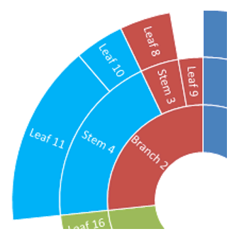

## **مقدمه**

در میان انواع دیگر نمودارهای PowerPoint، دو نوع سلسله‌مراتبی وجود دارد — **Treemap** و **Sunburst** (که به عنوان نمودار Sunburst، دیاگرام Sunburst، نمودار شعاعی، گراف شعاعی یا نمودار دایره‌ای چندسطحی نیز شناخته می‌شود). این نمودارها داده‌های سلسله‌مراتبی را به‌صورت درخت نمایش می‌دهند — از برگ‌ها تا بالای یک شاخه. برگ‌ها توسط نقاط داده سری تعریف می‌شوند و هر سطح گروه‌بندی تو در تو بعدی توسط دسته‌بندی مربوطه تعریف می‌شود. Aspose.Slides for Python via .NET به شما امکان قالب‌بندی نقاط داده نمودارهای Sunburst و Treemap را در Python می‌دهد.

در اینجا یک نمودار Sunburst وجود دارد که داده‌های ستون Series1 گره‌های برگ را تعریف می‌کند، در حالی که ستون‌های دیگر نقاط داده سلسله‌مراتبی را تعریف می‌کنند:


بیایید با افزودن یک نمودار Sunburst جدید به ارائه شروع کنیم:

```py
with slides.Presentation() as presentation:
    slide = presentation.slides[0]
    chart = slide.shapes.add_chart(charts.ChartType.SUNBURST, 30, 30, 450, 400)
```

{}
- [**ایجاد نمودارهای Sunburst**](/slides/fa/python-net/create-chart/#create-sunburst-charts)
{}

اگر نیاز به قالب‌بندی نقاط داده نمودار دارید، از APIهای زیر استفاده کنید:

آنها دسترسی به قالب‌بندی نقاط داده در نمودارهای Treemap و Sunburst را فراهم می‌کنند. [ChartDataPointLevelsManager](https://reference.aspose.com/slides/fa/python-net/aspose.slides.charts/chartdatapointlevelsmanager/) برای دسترسی به دسته‌بندهای چندسطحی استفاده می‌شود؛ این یک مخزن از اشیاء [ChartDataPointLevel](https://reference.aspose.com/slides/fa/python-net/aspose.slides.charts/chartdatapointlevel/) است. به‌طور اساسی این یک wrapper حول [ChartCategoryLevelsManager](https://reference.aspose.com/slides/fa/python-net/aspose.slides.charts/chartcategorylevelsmanager/) با ویژگی‌های اضافه مخصوص به نقاط داده است. نوع [ChartDataPointLevel](https://reference.aspose.com/slides/fa/python-net/aspose.slides.charts/chartdatapointlevel/) دو ویژگی—[format](https://reference.aspose.com/slides/fa/python-net/aspose.slides.charts/chartdatapointlevel/format/) و [label](https://reference.aspose.com/slides/fa/python-net/aspose.slides.charts/chartdatapointlevel/label/)—را افشا می‌کند که دسترسی به تنظیمات مربوطه را فراهم می‌آورد.

## **نمایش مقادیر نقاط داده**

این بخش نشان می‌دهد چگونه مقدار هر نقطه داده را در نمودارهای Treemap و Sunburst نمایش دهیم. شما خواهید دید چگونه برچسب‌های مقدار را برای نقاط انتخاب‌شده فعال کنید.

نمایش مقدار نقطه داده «Leaf 4»:

```py
data_points = chart.chart_data.series[0].data_points
data_points[3].data_point_levels[0].label.data_label_format.show_value = True
```


## **تنظیم برچسب‌ها و رنگ‌ها برای نقاط داده**

این بخش نشان می‌دهد چگونه برچسب‌ها و رنگ‌های سفارشی را برای نقاط داده منفرد در نمودارهای Treemap و Sunburst تنظیم کنیم. شما یاد خواهید گرفت چگونه به یک نقطه داده خاص دسترسی پیدا کنید، برچسبی اختصاص دهید و پر شدگی صلبی اعمال کنید تا گره‌های مهم را برجسته سازید.

برچسب داده «Branch 1» را طوری تنظیم کنید که نام سری («Series1») را به جای نام دسته نمایش دهد، سپس رنگ متن را به زرد تغییر دهید:

```py
branch1_label = data_points[0].data_point_levels[2].label
branch1_label.data_label_format.show_category_name = False
branch1_label.data_label_format.show_series_name = True

branch1_label.data_label_format.text_format.portion_format.fill_format.fill_type = slides.FillType.SOLID
branch1_label.data_label_format.text_format.portion_format.fill_format.solid_fill_color.color = draw.Color.yellow
```


## **تنظیم رنگ شاخه‌ها برای نقاط داده**

از رنگ‌های شاخه برای کنترل چگونگی گروه‌بندی بصری نودهای والد و فرزند در نمودارهای Treemap و Sunburst استفاده کنید. این بخش نشان می‌دهد چگونه یک رنگ شاخه سفارشی برای یک نقطه داده خاص تنظیم کنید تا زیردرخت‌های مهم را برجسته کنید و قابلیت خوانایی نمودار را بهبود بخشید.

رنگ شاخه «Stem 4» را تغییر دهید:

```py
import aspose.slides as slides
import aspose.slides.charts as charts
import aspose.pydrawing as draw

with slides.Presentation() as presentation:
    slide = presentation.slides[0]

    chart = slide.shapes.add_chart(charts.ChartType.SUNBURST, 30, 30, 450, 400)
    data_points = chart.chart_data.series[0].data_points

    stem4_branch = data_points[9].data_point_levels[1]
    
    stem4_branch.format.fill.fill_type = slides.FillType.SOLID
    stem4_branch.format.fill.solid_fill_color.color = draw.Color.red
      
    presentation.save("branch_color.pptx", slides.export.SaveFormat.PPTX)
```



## **پرسش‌های متداول**

**آیا می‌توانم ترتیب (مرتب‌سازی) بخش‌ها در Sunburst/Treemap را تغییر دهم؟**

خیر. PowerPoint به‌صورت خودکار بخش‌ها را مرتب می‌کند (معمولاً بر اساس مقادیر نزولی، به‌صورت ساعت‌گرد). Aspose.Slides این رفتار را بازتاب می‌دهد: نمی‌توانید ترتیب را به‌طور مستقیم تغییر دهید؛ برای این کار باید داده‌ها را پیش‌پردازش کنید.

**قالب ارائه چگونه بر رنگ‌های بخش‌ها و برچسب‌ها تأثیر می‌گذارد؟**

رنگ‌های نمودار از [قالب/پالت](/slides/fa/python-net/presentation-theme/) ارائه به ارث می‌برند مگر اینکه به‌صورت صریح پرشدگی‌ها/قلم‌ها را تنظیم کنید. برای نتایج سازگار، پرشدگی‌های صلب و فرمت‌بندی متن را در سطوح مورد نیاز ثابت کنید.

**آیا خروجی به PDF/PNG رنگ‌های شاخه سفارشی و تنظیمات برچسب را حفظ می‌کند؟**

بله. هنگام خروجی گرفتن از ارائه، تنظیمات نمودار (پرشدگی‌ها، برچسب‌ها) در قالب‌های خروجی حفظ می‌شوند زیرا Aspose.Slides با قالب‌بندی اعمال‌شده روی نمودار رندر می‌کند.

**آیا می‌توانم مختصات واقعی یک برچسب/عنصر را برای قرارگیری سفارشی پوشش روی نمودار محاسبه کنم؟**

بله. پس از اعتبارسنجی چیدمان نمودار، مقادیر `actual_x`/`actual_y` برای عناصر در دسترس هستند (به عنوان مثال، یک [DataLabel](https://reference.aspose.com/slides/fa/python-net/aspose.slides.charts/datalabel/)) که به موقعیت‌یابی دقیق پوشش‌ها کمک می‌کند.