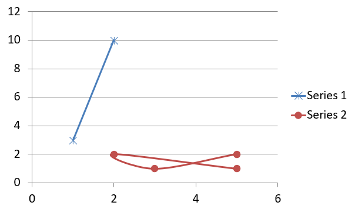

## **مروری**

این مقاله راهنمای جامعی درباره نحوهٔ ایجاد و سفارشی‌سازی نمودارها با استفاده از Aspose.Slides برای Python از طریق .NET ارائه می‌دهد. شما می‌آموزید که چگونه به‌صورت برنامه‌نویسی یک نمودار را به اسلاید اضافه کنید، آن را با داده‌ها پر کنید و گزینه‌های قالب‌بندی مختلف را برای مطابقت با نیازهای طراحی خاص خود اعمال کنید. در سراسر مقاله، مثال‌های کد دقیق هر گام را نشان می‌دهند؛ از مقداردهی اولیهٔ ارائه و شیء نمودار تا پیکربندی سری‌ها، محور‌ها و افسانه‌ها. با پیروی از این راهنما، درک محکمی از چگونگی ادغام تولید دینامیک نمودار در برنامه‌های خود به دست می‌آورید و فرآیند ساخت ارائه‌های مبتنی بر داده را ساده می‌کنید.

## **ایجاد نمودار**

نمودارها به افراد کمک می‌کنند تا داده‌ها را سریعاً بصری‌سازی کنند و بینش‌هایی به دست آورند که ممکن است از یک جدول یا صفحه‌گسترده بلافاصله واضح نباشد.

**چرا ایجاد نمودار؟**

با استفاده از نمودارها می‌توانید:

* حجم زیادی از داده‌ها را در یک اسلاید جمع‌بندی، فشرده یا خلاصه کنید;
* الگوها و روندهای داده را آشکار کنید;
* جهت و گام‌به‌گام بودن داده را در طول زمان یا نسبت به یک واحد اندازه‌گیری خاص استنتاج کنید;
* نقاط پرت، انحرافات، خطاها و داده‌های نامعقول را شناسایی کنید;
* داده‌های پیچیده را ارتباط‌پذیر یا قابل ارائه کنید.

در PowerPoint می‌توانید نمودارها را از طریق عملکرد *Insert* ایجاد کنید که قالب‌هایی برای طراحی انواع مختلف نمودارها فراهم می‌آورد. با Aspose.Slides می‌توانید هم نمودارهای معمولی (بر پایهٔ انواع محبوب نمودار) و هم نمودارهای سفارشی ایجاد کنید.

{} 
از شمارش‌گر [ChartType](https://reference.aspose.com/slides/fa/python-net/aspose.slides.charts/charttype/) در فضای‌نامی [Aspose.Slides.Charts](https://reference.aspose.com/slides/fa/python-net/aspose.slides.charts/) استفاده کنید. مقادیر این شمارش‌گر به انواع مختلف نمودارها مربوط می‌شوند.
{} 

### **ایجاد نمودارهای ستونی خوشه‌ای**

این بخش توضیح می‌دهد چگونه نمودارهای ستونی خوشه‌ای را با Aspose.Slides برای Python از طریق .NET ایجاد کنید. شما نحوهٔ مقداردهی اولیهٔ ارائه، افزودن یک نمودار و سفارشی‌سازی عناصر آن مانند عنوان، داده‌ها، سری‌ها، دسته‌ها و استایل را یاد خواهید گرفت. مراحل زیر را دنبال کنید تا ببینید یک نمودار ستونی خوشه‌ای استاندارد چگونه تولید می‌شود:

1. یک نمونه از کلاس [Presentation](https://reference.aspose.com/slides/fa/python-net/aspose.slides/presentation/) ایجاد کنید.
1. با استفاده از ایندکس، به یک اسلاید ارجاع بگیرید.
1. یک نمودار با برخی داده‌ها اضافه کنید و نوع `ChartType.CLUSTERED_COLUMN` را مشخص کنید.
1. عنوانی به نمودار اضافه کنید.
1. به ورکشیت دادهٔ نمودار دسترسی پیدا کنید.
1. تمام سری‌ها و دسته‌های پیش‌فرض را پاک کنید.
1. سری‌ها و دسته‌های جدید اضافه کنید.
1. داده‌های جدیدی برای سری‌های نمودار اضافه کنید.
1. رنگ پر کردن را به سری‌های نمودار اعمال کنید.
1. برچسب‌ها را به سری‌های نمودار اضافه کنید.
1. ارائهٔ اصلاح‌شده را به عنوان فایل PPTX ذخیره کنید.

این کد Python نشان می‌دهد چگونه یک نمودار ستونی خوشه‌ای ایجاد شود:

```py
import aspose.slides.charts as charts
import aspose.slides as slides
import aspose.pydrawing as draw

# یک نمونه از کلاس Presentation که یک فایل PPTX را نشان می‌دهد ایجاد کنید.
with slides.Presentation() as presentation:

    # به اولین اسلاید دسترسی پیدا کنید.
    slide = presentation.slides[0]

    # یک نمودار ستونی خوشه‌ای با داده‌های پیش‌فرض آن اضافه کنید.
    chart = slide.shapes.add_chart(charts.ChartType.CLUSTERED_COLUMN, 20, 20, 500, 300)

    # عنوان نمودار را تنظیم کنید.
    chart.chart_title.add_text_frame_for_overriding("Sample Title")
    chart.chart_title.text_frame_for_overriding.text_frame_format.center_text = slides.NullableBool.TRUE
    chart.chart_title.height = 20
    chart.has_title = True

    # سری اول را طوری تنظیم کنید که مقادیر را نشان دهد.
    chart.chart_data.series[0].labels.default_data_label_format.show_value = True

    # اندیس شیت داده نمودار را تنظیم کنید.
    worksheet_index = 0

    # کتاب کار داده نمودار را دریافت کنید.
    workbook = chart.chart_data.chart_data_workbook

    # سری‌ها و دسته‌های پیش‌فرض تولید شده را حذف کنید.
    chart.chart_data.series.clear()
    chart.chart_data.categories.clear()

    # سری‌های جدید اضافه کنید.
    chart.chart_data.series.add(workbook.get_cell(worksheet_index, 0, 1, "Series 1"), chart.type)
    chart.chart_data.series.add(workbook.get_cell(worksheet_index, 0, 2, "Series 2"), chart.type)

    # دسته‌های جدید اضافه کنید.
    chart.chart_data.categories.add(workbook.get_cell(worksheet_index, 1, 0, "Category 1"))
    chart.chart_data.categories.add(workbook.get_cell(worksheet_index, 2, 0, "Category 2"))
    chart.chart_data.categories.add(workbook.get_cell(worksheet_index, 3, 0, "Category 3"))

    # سری اول نمودار را دریافت کنید.
    series = chart.chart_data.series[0]

    # داده‌های سری را پر کنید.
    series.data_points.add_data_point_for_bar_series(workbook.get_cell(worksheet_index, 1, 1, 20))
    series.data_points.add_data_point_for_bar_series(workbook.get_cell(worksheet_index, 2, 1, 50))
    series.data_points.add_data_point_for_bar_series(workbook.get_cell(worksheet_index, 3, 1, 30))

    # رنگ پر کردن را برای سری تنظیم کنید.
    series.format.fill.fill_type = slides.FillType.SOLID
    series.format.fill.solid_fill_color.color = draw.Color.red

    # سری دوم نمودار را دریافت کنید.
    series = chart.chart_data.series[1]

    # داده‌های سری را پر کنید.
    series.data_points.add_data_point_for_bar_series(workbook.get_cell(worksheet_index, 1, 2, 30))
    series.data_points.add_data_point_for_bar_series(workbook.get_cell(worksheet_index, 2, 2, 10))
    series.data_points.add_data_point_for_bar_series(workbook.get_cell(worksheet_index, 3, 2, 60))

    # رنگ پر کردن را برای سری تنظیم کنید.
    series.format.fill.fill_type = slides.FillType.SOLID
    series.format.fill.solid_fill_color.color = draw.Color.green

    # برچسب اول را طوری تنظیم کنید که نام دسته را نشان دهد.
    label = series.data_points[0].label
    label.data_label_format.show_category_name = True

    label = series.data_points[1].label
    label.data_label_format.show_series_name = True

    # سری را طوری تنظیم کنید که مقدار را برای برچسب سوم نشان دهد.
    label = series.data_points[2].label
    label.data_label_format.show_value = True
    label.data_label_format.show_series_name = True
    label.data_label_format.separator = "/"
                
    # ارائه را به‌صورت فایل PPTX بر روی دیسک ذخیره کنید.
    presentation.save("ClusteredColumnChart.pptx", slides.export.SaveFormat.PPTX)
```

نتیجه:


### **ایجاد نمودارهای پراکنده**

نمودارهای پراکنده (که به‌عنوان scatter plot یا نمودار x‑y نیز شناخته می‌شوند) برای بررسی الگوها یا نشان دادن همبستگی بین دو متغیر استفاده می‌شوند.

از نمودار پراکنده زمانی استفاده کنید که:

* داده‌های عددی جفت‌دار دارید.
* دو متغیر دارید که به‌خوبی با هم جفت می‌شوند.
* می‌خواهید تعیین کنید آیا دو متغیر مرتبط هستند یا خیر.
* یک متغیر مستقل دارید که برای یک متغیر وابسته مقادیر متعددی دارد.

این کد Python نشان می‌دهد چگونه یک نمودار پراکنده با سری‌های مختلف نشانگرها ایجاد شود:

```py
import aspose.slides.charts as charts
import aspose.slides as slides
import aspose.pydrawing as draw

# یک نمونه از کلاس Presentation ایجاد کنید.
with slides.Presentation() as presentation:

    # به اولین اسلاید دسترسی پیدا کنید.
    slide = presentation.slides[0]

    # نمودار پراکنده پیش‌فرض را ایجاد کنید.
    chart = slide.shapes.add_chart(charts.ChartType.SCATTER_WITH_SMOOTH_LINES, 20, 20, 500, 300)

    # اندیس شیت داده نمودار را تنظیم کنید.
    worksheet_index = 0

    # کتاب‌کار داده نمودار را دریافت کنید.
    workbook = chart.chart_data.chart_data_workbook

    # سری پیش‌فرض را حذف کنید.
    chart.chart_data.series.clear()

    # سری‌های جدید اضافه کنید.
    chart.chart_data.series.add(workbook.get_cell(worksheet_index, 1, 1, "Series 1"), chart.type)
    chart.chart_data.series.add(workbook.get_cell(worksheet_index, 1, 3, "Series 2"), chart.type)

    # سری اول نمودار را دریافت کنید.
    series = chart.chart_data.series[0]

    # یک نقطه جدید (1:3) به سری اضافه کنید.
    series.data_points.add_data_point_for_scatter_series(workbook.get_cell(worksheet_index, 2, 1, 1), workbook.get_cell(worksheet_index, 2, 2, 3))

    # یک نقطه جدید (2:10) اضافه کنید.
    series.data_points.add_data_point_for_scatter_series(workbook.get_cell(worksheet_index, 3, 1, 2), workbook.get_cell(worksheet_index, 3, 2, 10))

    # نوع سری را تغییر دهید.
    series.type = charts.ChartType.SCATTER_WITH_STRAIGHT_LINES_AND_MARKERS

    # علامت‌گر سری نمودار را تغییر دهید.
    series.marker.size = 10
    series.marker.symbol = charts.MarkerStyleType.STAR

    # سری دوم نمودار را دریافت کنید.
    series = chart.chart_data.series[1]

    # یک نقطه جدید (5:2) به سری نمودار اضافه کنید.
    series.data_points.add_data_point_for_scatter_series(workbook.get_cell(worksheet_index, 2, 3, 5), workbook.get_cell(worksheet_index, 2, 4, 2))

    # یک نقطه جدید (3:1) اضافه کنید.
    series.data_points.add_data_point_for_scatter_series(workbook.get_cell(worksheet_index, 3, 3, 3), workbook.get_cell(worksheet_index, 3, 4, 1))

    # یک نقطه جدید (2:2) اضافه کنید.
    series.data_points.add_data_point_for_scatter_series(workbook.get_cell(worksheet_index, 4, 3, 2), workbook.get_cell(worksheet_index, 4, 4, 2))

    # یک نقطه جدید (5:1) اضافه کنید.
    series.data_points.add_data_point_for_scatter_series(workbook.get_cell(worksheet_index, 5, 3, 5), workbook.get_cell(worksheet_index, 5, 4, 1))

    # علامت‌گر سری نمودار را تغییر دهید.
    series.marker.size = 10
    series.marker.symbol = charts.MarkerStyleType.CIRCLE

    presentation.save("ScatterChart.pptx", slides.export.SaveFormat.PPTX)
```

نتیجه:



### **ایجاد نمودارهای دایره‌ای**

نمودارهای دایره‌ای برای نمایش رابطهٔ جزء به کل در داده‌ها مناسب هستند، به‌ویژه وقتی داده‌ها شامل برچسب‌های دسته‌ای با مقادیر عددی باشند. اگر داده‌های شما شامل تعداد زیادی بخش یا برچسب باشد، بهتر است به‌جای آن از نمودار ستون استفاده کنید.

1. یک نمونه از کلاس [Presentation](https://reference.aspose.com/slides/fa/python-net/aspose.slides/presentation/) ایجاد کنید.
1. با استفاده از ایندکس، به یک اسلاید ارجاع بگیرید.
1. یک نمودار با داده‌های پیش‌فرض اضافه کنید و نوع `ChartType.PIE` را مشخص کنید.
1. به کتاب‌کار دادهٔ نمودار ([ChartDataWorkbook](https://reference.aspose.com/slides/fa/python-net/aspose.slides.charts/chartdataworkbook/)) دسترسی پیدا کنید.
1. سری‌ها و دسته‌های پیش‌فرض را پاک کنید.
1. سری‌ها و دسته‌های جدید اضافه کنید.
1. داده‌های جدیدی برای سری‌های نمودار اضافه کنید.
1. نقاط جدیدی به نمودار اضافه کنید و رنگ‌های سفارشی به بخش‌های نمودار دایره‌ای اعمال کنید.
1. برچسب‌ها را برای سری‌ها تنظیم کنید.
1. خطوط رهبر (leader lines) را برای برچسب‌های سری فعال کنید.
1. زاویهٔ چرخش نمودار دایره‌ای را تنظیم کنید.
1. ارائهٔ اصلاح‌شده را به‌عنوان فایل PPTX ذخیره کنید.

این کد Python نشان می‌دهد چگونه یک نمودار دایره‌ای ایجاد شود:

```py
import aspose.slides.charts as charts
import aspose.slides as slides
import aspose.pydrawing as draw

# یک نمونه از کلاس Presentation که یک فایل PPTX را نشان می‌دهد ایجاد کنید.
with slides.Presentation() as presentation:

    # به اولین اسلاید دسترسی پیدا کنید.
    slide = presentation.slides[0]

    # یک نمودار با داده‌های پیش‌فرض آن اضافه کنید.
    chart = slide.shapes.add_chart(charts.ChartType.PIE, 20, 20, 500, 300)

    # عنوان نمودار را تنظیم کنید.
    chart.chart_title.add_text_frame_for_overriding("Sample Title")
    chart.chart_title.text_frame_for_overriding.text_frame_format.center_text = slides.NullableBool.TRUE
    chart.chart_title.height = 20
    chart.has_title = True

    # سری اول را طوری تنظیم کنید که مقادیر را نشان دهد.
    chart.chart_data.series[0].labels.default_data_label_format.show_value = True

    # اندیس شیت داده نمودار را تنظیم کنید.
    worksheet_index = 0

    # کتاب‌کار داده نمودار را دریافت کنید.
    workbook = chart.chart_data.chart_data_workbook

    # سری و دسته‌های پیش‌فرض تولید شده را حذف کنید.
    chart.chart_data.series.clear()
    chart.chart_data.categories.clear()

    # دسته‌های جدید اضافه کنید.
    chart.chart_data.categories.add(workbook.get_cell(0, 1, 0, "First Qtr"))
    chart.chart_data.categories.add(workbook.get_cell(0, 2, 0, "2nd Qtr"))
    chart.chart_data.categories.add(workbook.get_cell(0, 3, 0, "3rd Qtr"))

    # سری‌های جدید اضافه کنید.
    series = chart.chart_data.series.add(workbook.get_cell(0, 0, 1, "Series 1"), chart.type)

    # داده‌های سری را پر کنید.
    series.data_points.add_data_point_for_pie_series(workbook.get_cell(worksheet_index, 1, 1, 20))
    series.data_points.add_data_point_for_pie_series(workbook.get_cell(worksheet_index, 2, 1, 50))
    series.data_points.add_data_point_for_pie_series(workbook.get_cell(worksheet_index, 3, 1, 30))

    # رنگ بخش (sector) را تنظیم کنید.
    chart.chart_data.series_groups[0].is_color_varied = True

    point = series.data_points[0]
    point.format.fill.fill_type = slides.FillType.SOLID
    point.format.fill.solid_fill_color.color = draw.Color.cyan

    # حد (border) بخش را تنظیم کنید.
    point.format.line.fill_format.fill_type = slides.FillType.SOLID
    point.format.line.fill_format.solid_fill_color.color = draw.Color.gray
    point.format.line.width = 3.0
    point.format.line.style = slides.LineStyle.THIN_THICK
    point.format.line.dash_style = slides.LineDashStyle.DASH_DOT

    point1 = series.data_points[1]
    point1.format.fill.fill_type = slides.FillType.SOLID
    point1.format.fill.solid_fill_color.color = draw.Color.brown

    # حد (border) بخش را تنظیم کنید.
    point1.format.line.fill_format.fill_type = slides.FillType.SOLID
    point1.format.line.fill_format.solid_fill_color.color = draw.Color.blue
    point1.format.line.width = 3.0
    point1.format.line.style = slides.LineStyle.SINGLE
    point1.format.line.dash_style = slides.LineDashStyle.LARGE_DASH_DOT

    point2 = series.data_points[2]
    point2.format.fill.fill_type = slides.FillType.SOLID
    point2.format.fill.solid_fill_color.color = draw.Color.coral

    # حد (border) بخش را تنظیم کنید.
    point2.format.line.fill_format.fill_type = slides.FillType.SOLID
    point2.format.line.fill_format.solid_fill_color.color = draw.Color.red
    point2.format.line.width = 2.0
    point2.format.line.style = slides.LineStyle.THIN_THIN
    point2.format.line.dash_style = slides.LineDashStyle.LARGE_DASH_DOT_DOT

    # برچسب‌های سفارشی برای هر دسته در سری جدید ایجاد کنید.
    label1 = series.data_points[0].label

    label1.data_label_format.show_value = True

    label2 = series.data_points[1].label
    label2.data_label_format.show_value = True
    label2.data_label_format.show_legend_key = True
    label2.data_label_format.show_percentage = True

    label3 = series.data_points[2].label
    label3.data_label_format.show_series_name = True
    label3.data_label_format.show_percentage = True

    # سری را طوری تنظیم کنید که خطوط راهنما (leader lines) را برای نمودار نشان دهد.
    series.labels.default_data_label_format.show_leader_lines = True

    # زاویه چرخش بخش‌های نمودار دایره‌ای را تنظیم کنید.
    chart.chart_data.series_groups[0].first_slice_angle = 180

    # ارائه را به‌صورت فایل PPTX بر روی دیسک ذخیره کنید.
    presentation.save("PieChart.pptx", slides.export.SaveFormat.PPTX)
```

نتیجه:


### **ایجاد نمودارهای خطی**

نمودارهای خطی (معروف به line graphs) برای نمایش تغییرات مقدار در طول زمان مناسب هستند. با استفاده از یک نمودار خطی می‌توانید مقدار زیادی داده را همزمان مقایسه کنید، تغییرات و روندها را در طول زمان ردیابی کنید، ناهنجاری‌ها در سری‌های داده را برجسته کنید و ...

1. یک نمونه از کلاس [Presentation](https://reference.aspose.com/slides/fa/python-net/aspose.slides/presentation/) ایجاد کنید.
1. با استفاده از ایندکس، به یک اسلاید ارجاع بگیرید.
1. یک نمودار با داده‌های پیش‌فرض اضافه کنید و نوع `ChartType.LINE` را مشخص کنید.
1. به کتاب‌کار دادهٔ نمودار ([ChartDataWorkbook](https://reference.aspose.com/slides/fa/python-net/aspose.slides.charts/chartdataworkbook/)) دسترسی پیدا کنید.
1. سری‌ها و دسته‌های پیش‌فرض را پاک کنید.
1. سری‌ها و دسته‌های جدید اضافه کنید.
1. داده‌های جدیدی برای سری‌های نمودار اضافه کنید.
1. ارائهٔ اصلاح‌شده را به‌عنوان فایل PPTX ذخیره کنید.

این کد Python نشان می‌دهد چگونه یک نمودار خطی ایجاد شود:

```python
import aspose.slides as slides

with slides.Presentation() as presentation:
    line_chart = presentation.slides[0].shapes.add_chart(slides.charts.ChartType.LINE, 20, 20, 500, 300)
    
    presentation.save("LineChart.pptx", slides.export.SaveFormat.PPTX)
```

به‌طور پیش‌فرض، نقاط در یک نمودار خطی با خطوط مستقیم پیوسته به یکدیگر وصل می‌شوند. اگر می‌خواهید نقطه‌ها به‌جای خطوط پیوسته با خط‌دار (dash) وصل شوند، می‌توانید نوع dash موردنظر خود را به‌صورت زیر تعیین کنید:

```python
line_chart = pres.slides[0].shapes.add_chart(slides.charts.ChartType.LINE, 10, 50, 600, 350)

for series in line_chart.chart_data.series:
    series.format.line.dash_style = slides.charts.LineDashStyle.DASH
```

نتیجه:


### **ایجاد نمودارهای درخت‌نقشه (Tree Map)**

نمودارهای درخت‌نقشه برای داده‌های فروش مناسب هستند وقتی می‌خواهید اندازه نسبی دسته‌های داده را نشان دهید و به‌سرعت توجه را به مواردی که سهم بزرگی در هر دسته دارند جلب کنید.

1. یک نمونه از کلاس [Presentation](https://reference.aspose.com/slides/fa/python-net/aspose.slides/presentation/) ایجاد کنید.
1. با استفاده از ایندکس، به یک اسلاید ارجاع بگیرید.
1. یک نمودار با داده‌های پیش‌فرض اضافه کنید و نوع `ChartType.TREEMAP` را مشخص کنید.
1. به کتاب‌کار دادهٔ نمودار ([ChartDataWorkbook](https://reference.aspose.com/slides/fa/python-net/aspose.slides.charts/chartdataworkbook/)) دسترسی پیدا کنید.
1. سری‌ها و دسته‌های پیش‌فرض را پاک کنید.
1. سری‌ها و دسته‌های جدید اضافه کنید.
1. داده‌های جدیدی برای سری‌های نمودار اضافه کنید.
1. ارائهٔ اصلاح‌شده را به‌عنوان فایل PPTX ذخیره کنید.

این کد Python نشان می‌دهد چگونه یک نمودار درخت‌نقشه ایجاد شود:

```py
import aspose.slides.charts as charts
import aspose.slides as slides
import aspose.pydrawing as draw

with slides.Presentation() as presentation:
    chart = presentation.slides[0].shapes.add_chart(charts.ChartType.TREEMAP, 20, 20, 500, 300)
    chart.chart_data.categories.clear()
    chart.chart_data.series.clear()

    workbook = chart.chart_data.chart_data_workbook
    workbook.clear(0)

    # شاخه 1
    leaf = chart.chart_data.categories.add(workbook.get_cell(0, "C1", "Leaf1"))
    leaf.grouping_levels.set_grouping_item(1, "Stem1")
    leaf.grouping_levels.set_grouping_item(2, "Branch1")

    chart.chart_data.categories.add(workbook.get_cell(0, "C2", "Leaf2"))

    leaf = chart.chart_data.categories.add(workbook.get_cell(0, "C3", "Leaf3"))
    leaf.grouping_levels.set_grouping_item(1, "Stem2")

    chart.chart_data.categories.add(workbook.get_cell(0, "C4", "Leaf4"))

    # شاخه 2
    leaf = chart.chart_data.categories.add(workbook.get_cell(0, "C5", "Leaf5"))
    leaf.grouping_levels.set_grouping_item(1, "Stem3")
    leaf.grouping_levels.set_grouping_item(2, "Branch2")

    chart.chart_data.categories.add(workbook.get_cell(0, "C6", "Leaf6"))

    leaf = chart.chart_data.categories.add(workbook.get_cell(0, "C7", "Leaf7"))
    leaf.grouping_levels.set_grouping_item(1, "Stem4")

    chart.chart_data.categories.add(workbook.get_cell(0, "C8", "Leaf8"))

    series = chart.chart_data.series.add(charts.ChartType.TREEMAP)
    series.labels.default_data_label_format.show_category_name = True
    series.data_points.add_data_point_for_treemap_series(workbook.get_cell(0, "D1", 4))
    series.data_points.add_data_point_for_treemap_series(workbook.get_cell(0, "D2", 5))
    series.data_points.add_data_point_for_treemap_series(workbook.get_cell(0, "D3", 3))
    series.data_points.add_data_point_for_treemap_series(workbook.get_cell(0, "D4", 6))
    series.data_points.add_data_point_for_treemap_series(workbook.get_cell(0, "D5", 9))
    series.data_points.add_data_point_for_treemap_series(workbook.get_cell(0, "D6", 9))
    series.data_points.add_data_point_for_treemap_series(workbook.get_cell(0, "D7", 4))
    series.data_points.add_data_point_for_treemap_series(workbook.get_cell(0, "D8", 3))

    series.parent_label_layout = charts.ParentLabelLayoutType.OVERLAPPING

    presentation.save("TreeMap.pptx", slides.export.SaveFormat.PPTX)
```

نتیجه:


### **ایجاد نمودارهای سهام (Stock)**

نمودارهای سهام برای نمایش داده‌های مالی مانند قیمت‌های باز، بالا، پایین و بسته استفاده می‌شوند و به تحلیل روندهای بازار و نوسان‌ها کمک می‌کنند. این نمودارها بینش‌های اساسی دربارهٔ عملکرد سهام ارائه می‌دهند و به سرمایه‌گذاران و تحلیل‌گران در اتخاذ تصمیم‌های آگاهانه یاری می‌رسانند.

1. یک نمونه از کلاس [Presentation](https://reference.aspose.com/slides/fa/python-net/aspose.slides/presentation/) ایجاد کنید.
1. با استفاده از ایندکس، به یک اسلاید ارجاع بگیرید.
1. یک نمودار با داده‌های پیش‌فرض اضافه کنید و نوع `ChartType.OPEN_HIGH_LOW_CLOSE` را مشخص کنید.
1. به کتاب‌کار دادهٔ نمودار ([ChartDataWorkbook](https://reference.aspose.com/slides/fa/python-net/aspose.slides.charts/chartdataworkbook/)) دسترسی پیدا کنید.
1. سری‌ها و دسته‌های پیش‌فرض را پاک کنید.
1. سری‌ها و دسته‌های جدید اضافه کنید.
1. داده‌های جدیدی برای سری‌های نمودار اضافه کنید.
1. فرمت HiLowLines را مشخص کنید.
1. ارائهٔ اصلاح‌شده را به‌عنوان فایل PPTX ذخیره کنید.

این کد Python نشان می‌دهد چگونه یک نمودار سهام ایجاد شود:

```py
import aspose.slides.charts as charts
import aspose.slides as slides
import aspose.pydrawing as draw

with slides.Presentation() as presentation:
    chart = presentation.slides[0].shapes.add_chart(charts.ChartType.OPEN_HIGH_LOW_CLOSE, 20, 20, 500, 300, False)

    chart.chart_data.series.clear()
    chart.chart_data.categories.clear()

    workbook = chart.chart_data.chart_data_workbook

    chart.chart_data.categories.add(workbook.get_cell(0, 1, 0, "A"))
    chart.chart_data.categories.add(workbook.get_cell(0, 2, 0, "B"))
    chart.chart_data.categories.add(workbook.get_cell(0, 3, 0, "C"))

    chart.chart_data.series.add(workbook.get_cell(0, 0, 1, "Open"), chart.type)
    chart.chart_data.series.add(workbook.get_cell(0, 0, 2, "High"), chart.type)
    chart.chart_data.series.add(workbook.get_cell(0, 0, 3, "Low"), chart.type)
    chart.chart_data.series.add(workbook.get_cell(0, 0, 4, "Close"), chart.type)

    series = chart.chart_data.series[0]

    series.data_points.add_data_point_for_stock_series(workbook.get_cell(0, 1, 1, 72))
    series.data_points.add_data_point_for_stock_series(workbook.get_cell(0, 2, 1, 25))
    series.data_points.add_data_point_for_stock_series(workbook.get_cell(0, 3, 1, 38))

    series = chart.chart_data.series[1]
    series.data_points.add_data_point_for_stock_series(workbook.get_cell(0, 1, 2, 172))
    series.data_points.add_data_point_for_stock_series(workbook.get_cell(0, 2, 2, 57))
    series.data_points.add_data_point_for_stock_series(workbook.get_cell(0, 3, 2, 57))

    series = chart.chart_data.series[2]
    series.data_points.add_data_point_for_stock_series(workbook.get_cell(0, 1, 3, 12))
    series.data_points.add_data_point_for_stock_series(workbook.get_cell(0, 2, 3, 12))
    series.data_points.add_data_point_for_stock_series(workbook.get_cell(0, 3, 3, 13))

    series = chart.chart_data.series[3]
    series.data_points.add_data_point_for_stock_series(workbook.get_cell(0, 1, 4, 25))
    series.data_points.add_data_point_for_stock_series(workbook.get_cell(0, 2, 4, 38))
    series.data_points.add_data_point_for_stock_series(workbook.get_cell(0, 3, 4, 50))

    chart.chart_data.series_groups[0].up_down_bars.has_up_down_bars = True
    chart.chart_data.series_groups[0].hi_low_lines_format.line.fill_format.fill_type = slides.FillType.SOLID

    for ser in chart.chart_data.series:
        ser.format.line.fill_format.fill_type = slides.FillType.NO_FILL

    presentation.save("StockChart.pptx", slides.export.SaveFormat.PPTX)
```

نتیجه:


### **ایجاد نمودارهای جعبه‌ای و ویسکر (Box and Whisker)**

نمودارهای جعبه‌ای و ویسکر توزیع داده‌ها را با خلاصه‌سازی معیارهای آماری کلیدی مانند میانه، چارک‌ها و احتمالات نقاط پرت نشان می‌دهند. این نمودارها در تحلیل اکتشافی داده و مطالعات آماری برای درک سریع تغییرپذیری داده‌ها و شناسایی ناهنجاری‌ها مفید هستند.

1. یک نمونه از کلاس [Presentation](https://reference.aspose.com/slides/fa/python-net/aspose.slides/presentation/) ایجاد کنید.
1. با استفاده از ایندکس، به یک اسلاید ارجاع بگیرید.
1. یک نمودار با داده‌های پیش‌فرض اضافه کنید و نوع `ChartType.BOX_AND_WHISKER` را مشخص کنید.
1. به کتاب‌کار دادهٔ نمودار ([ChartDataWorkbook](https://reference.aspose.com/slides/fa/python-net/aspose.slides.charts/chartdataworkbook/)) دسترسی پیدا کنید.
1. سری‌ها و دسته‌های پیش‌فرض را پاک کنید.
1. سری‌ها و دسته‌های جدید اضافه کنید.
1. داده‌های جدیدی برای سری‌های نمودار اضافه کنید.
1. ارائهٔ اصلاح‌شده را به‌عنوان فایل PPTX ذخیره کنید.

این کد Python نشان می‌دهد چگونه یک نمودار جعبه‌ای و ویسکر ایجاد شود:

```py
import aspose.slides.charts as charts
import aspose.slides as slides
import aspose.pydrawing as draw

with slides.Presentation() as presentation:
    chart = presentation.slides[0].shapes.add_chart(charts.ChartType.BOX_AND_WHISKER, 20, 20, 500, 300)
    chart.chart_data.categories.clear()
    chart.chart_data.series.clear()

    workbook = chart.chart_data.chart_data_workbook
    workbook.clear(0)

    chart.chart_data.categories.add(workbook.get_cell(0, "A1", "Category 1"))
    chart.chart_data.categories.add(workbook.get_cell(0, "A2", "Category 1"))
    chart.chart_data.categories.add(workbook.get_cell(0, "A3", "Category 1"))
    chart.chart_data.categories.add(workbook.get_cell(0, "A4", "Category 1"))
    chart.chart_data.categories.add(workbook.get_cell(0, "A5", "Category 1"))
    chart.chart_data.categories.add(workbook.get_cell(0, "A6", "Category 1"))

    series = chart.chart_data.series.add(charts.ChartType.BOX_AND_WHISKER)

    series.quartile_method = charts.QuartileMethodType.EXCLUSIVE
    series.show_mean_line = True
    series.show_mean_markers = True
    series.show_inner_points = True
    series.show_outlier_points = True

    series.data_points.add_data_point_for_box_and_whisker_series(workbook.get_cell(0, "B1", 15))
    series.data_points.add_data_point_for_box_and_whisker_series(workbook.get_cell(0, "B2", 41))
    series.data_points.add_data_point_for_box_and_whisker_series(workbook.get_cell(0, "B3", 16))
    series.data_points.add_data_point_for_box_and_whisker_series(workbook.get_cell(0, "B4", 10))
    series.data_points.add_data_point_for_box_and_whisker_series(workbook.get_cell(0, "B5", 23))
    series.data_points.add_data_point_for_box_and_whisker_series(workbook.get_cell(0, "B6", 16))

    presentation.save("BoxAndWhiskerChart.pptx", slides.export.SaveFormat.PPTX)
```

### **ایجاد نمودارهای قیفی (Funnel)**

نمودارهای قیفی برای بصری‌سازی فرآیندهایی که شامل مراحل متوالی هستند و حجم داده‌ها در هر مرحله کاهش می‌یابد، استفاده می‌شوند. این نمودارها به ویژه برای تحلیل نرخ تبدیل، شناسایی گلوگاه‌ها و ردیابی کارایی فرآیندهای فروش یا بازاریابی مفیدند.

1. یک نمونه از کلاس [Presentation](https://reference.aspose.com/slides/fa/python-net/aspose.slides/presentation/) ایجاد کنید.
1. با استفاده از ایندکس، به یک اسلاید ارجاع بگیرید.
1. یک نمودار با داده‌های پیش‌فرض اضافه کنید و نوع `ChartType.FUNNEL` را مشخص کنید.
1. ارائهٔ اصلاح‌شده را به‌عنوان فایل PPTX ذخیره کنید.

این کد Python نشان می‌دهد چگونه یک نمودار قیفی ایجاد شود:

```py
import aspose.slides.charts as charts
import aspose.slides as slides
import aspose.pydrawing as draw

with slides.Presentation() as presentation:
    chart = presentation.slides[0].shapes.add_chart(charts.ChartType.FUNNEL, 50, 50, 500, 400)
    chart.chart_data.categories.clear()
    chart.chart_data.series.clear()

    workbook = chart.chart_data.chart_data_workbook
    workbook.clear(0)

    chart.chart_data.categories.add(workbook.get_cell(0, "A1", "Category 1"))
    chart.chart_data.categories.add(workbook.get_cell(0, "A2", "Category 2"))
    chart.chart_data.categories.add(workbook.get_cell(0, "A3", "Category 3"))
    chart.chart_data.categories.add(workbook.get_cell(0, "A4", "Category 4"))
    chart.chart_data.categories.add(workbook.get_cell(0, "A5", "Category 5"))
    chart.chart_data.categories.add(workbook.get_cell(0, "A6", "Category 6"))

    series = chart.chart_data.series.add(charts.ChartType.FUNNEL)

    series.data_points.add_data_point_for_funnel_series(workbook.get_cell(0, "B1", 50))
    series.data_points.add_data_point_for_funnel_series(workbook.get_cell(0, "B2", 100))
    series.data_points.add_data_point_for_funnel_series(workbook.get_cell(0, "B3", 200))
    series.data_points.add_data_point_for_funnel_series(workbook.get_cell(0, "B4", 300))
    series.data_points.add_data_point_for_funnel_series(workbook.get_cell(0, "B5", 400))
    series.data_points.add_data_point_for_funnel_series(workbook.get_cell(0, "B6", 500))

    presentation.save("FunnelChart.pptx", slides.export.SaveFormat.PPTX)
```

نتیجه:


### **ایجاد نمودارهای خورشیدگرد (Sunburst)**

نمودارهای خورشیدگرد برای بصری‌سازی داده‌های سلسله‌مراتبی استفاده می‌شوند و سطوح را به‌صورت حلقه‌های متحدالمرکز نمایش می‌دهند. این نمودارها رابطهٔ جزء به کل را نشان می‌دهند و برای نمایش دسته‌ها و زیرمجموعه‌های تو در تو در قالبی واضح و فشرده مناسب‌اند.

1. یک نمونه از کلاس [Presentation](https://reference.aspose.com/slides/fa/python-net/aspose.slides/presentation/) ایجاد کنید.
1. با استفاده از ایندکس، به یک اسلاید ارجاع بگیرید.
1. یک نمودار با داده‌های پیش‌فرض اضافه کنید و نوع `ChartType.SUNBURST` را مشخص کنید.
1. ارائهٔ اصلاح‌شده را به‌عنوان فایل PPTX ذخیره کنید.

این کد Python نشان می‌دهد چگونه یک نمودار خورشیدگرد ایجاد شود:

```py
import aspose.slides.charts as charts
import aspose.slides as slides
import aspose.pydrawing as draw

with slides.Presentation() as presentation:
    chart = presentation.slides[0].shapes.add_chart(charts.ChartType.SUNBURST, 20, 20, 500, 300)
    chart.chart_data.categories.clear()
    chart.chart_data.series.clear()

    workbook = chart.chart_data.chart_data_workbook
    workbook.clear(0)

    # شاخه 1
    leaf = chart.chart_data.categories.add(workbook.get_cell(0, "C1", "Leaf1"))
    leaf.grouping_levels.set_grouping_item(1, "Stem1")
    leaf.grouping_levels.set_grouping_item(2, "Branch1")

    chart.chart_data.categories.add(workbook.get_cell(0, "C2", "Leaf2"))

    leaf = chart.chart_data.categories.add(workbook.get_cell(0, "C3", "Leaf3"))
    leaf.grouping_levels.set_grouping_item(1, "Stem2")

    chart.chart_data.categories.add(workbook.get_cell(0, "C4", "Leaf4"))

    # شاخه 2
    leaf = chart.chart_data.categories.add(workbook.get_cell(0, "C5", "Leaf5"))
    leaf.grouping_levels.set_grouping_item(1, "Stem3")
    leaf.grouping_levels.set_grouping_item(2, "Branch2")

    chart.chart_data.categories.add(workbook.get_cell(0, "C6", "Leaf6"))

    leaf = chart.chart_data.categories.add(workbook.get_cell(0, "C7", "Leaf7"))
    leaf.grouping_levels.set_grouping_item(1, "Stem4")

    chart.chart_data.categories.add(workbook.get_cell(0, "C8", "Leaf8"))

    series = chart.chart_data.series.add(charts.ChartType.SUNBURST)
    series.labels.default_data_label_format.show_category_name = True
    series.data_points.add_data_point_for_sunburst_series(workbook.get_cell(0, "D1", 4))
    series.data_points.add_data_point_for_sunburst_series(workbook.get_cell(0, "D2", 5))
    series.data_points.add_data_point_for_sunburst_series(workbook.get_cell(0, "D3", 3))
    series.data_points.add_data_point_for_sunburst_series(workbook.get_cell(0, "D4", 6))
    series.data_points.add_data_point_for_sunburst_series(workbook.get_cell(0, "D5", 9))
    series.data_points.add_data_point_for_sunburst_series(workbook.get_cell(0, "D6", 9))
    series.data_points.add_data_point_for_sunburst_series(workbook.get_cell(0, "D7", 4))
    series.data_points.add_data_point_for_sunburst_series(workbook.get_cell(0, "D8", 3))

    presentation.save("SunburstChart.pptx", slides.export.SaveFormat.PPTX)
```

نتیجه:


### **ایجاد نمودارهای هیستوگرام (Histogram)**

نمودارهای هیستوگرام توزیع داده‌های عددی را با گروه‌بندی مقادیر در بازه‌ها یا جعبه‌ها نشان می‌دهند. این نمودارها برای شناسایی الگوهای داده‌ای همچون فراوانی، غیرمتقارن بودن و پراکندگی و برای کشف نقاط پرت در یک مجموعه داده مفیدند.

1. یک نمونه از کلاس [Presentation](https://reference.aspose.com/slides/fa/python-net/aspose.slides/presentation/) ایجاد کنید.
1. با استفاده از ایندکس، به یک اسلاید ارجاع بگیرید.
1. یک نمودار با داده‌های برخی اضافه کنید و نوع `ChartType.HISTOGRAM` را مشخص کنید.
1. به کتاب‌کار دادهٔ نمودار ([ChartDataWorkbook](https://reference.aspose.com/slides/fa/python-net/aspose.slides.charts/chartdataworkbook/)) دسترسی پیدا کنید.
1. سری‌ها و دسته‌های پیش‌فرض را پاک کنید.
1. سری‌ها و دسته‌های جدید اضافه کنید.
1. ارائهٔ اصلاح‌شده را به‌عنوان فایل PPTX ذخیره کنید.

این کد Python نشان می‌دهد چگونه یک نمودار هیستوگرام ایجاد شود:

```py
import aspose.slides.charts as charts
import aspose.slides as slides
import aspose.pydrawing as draw

with slides.Presentation() as presentation:
    chart = presentation.slides[0].shapes.add_chart(charts.ChartType.HISTOGRAM, 20, 20, 500, 300)
    chart.chart_data.categories.clear()
    chart.chart_data.series.clear()

    workbook = chart.chart_data.chart_data_workbook
    workbook.clear(0)

    series = chart.chart_data.series.add(charts.ChartType.HISTOGRAM)
    series.data_points.add_data_point_for_histogram_series(workbook.get_cell(0, "A1", 15))
    series.data_points.add_data_point_for_histogram_series(workbook.get_cell(0, "A2", -41))
    series.data_points.add_data_point_for_histogram_series(workbook.get_cell(0, "A3", 16))
    series.data_points.add_data_point_for_histogram_series(workbook.get_cell(0, "A4", 10))
    series.data_points.add_data_point_for_histogram_series(workbook.get_cell(0, "A5", -23))
    series.data_points.add_data_point_for_histogram_series(workbook.get_cell(0, "A6", 16))

    chart.axes.horizontal_axis.aggregation_type = charts.AxisAggregationType.AUTOMATIC

    presentation.save("HistogramChart.pptx", slides.export.SaveFormat.PPTX)
```

نتیجه:


### **ایجاد نمودارهای رادار (Radar)**

نمودارهای رادار داده‌های چندمتغیره را در قالب دو‑بعدی نمایش می‌دهند و امکان مقایسهٔ همزمان چند متغیر را فراهم می‌کنند. این نمودارها برای شناسایی الگوها، نقاط قوت و ضعف در میان چند معیار عملکرد یا ویژگی بسیار مناسب‌اند.

1. یک نمونه از کلاس [Presentation](https://reference.aspose.com/slides/fa/python-net/aspose.slides/presentation/) ایجاد کنید.
1. با استفاده از ایندکس، به یک اسلاید ارجاع بگیرید.
1. یک نمودار با داده‌های برخی اضافه کنید و نوع `ChartType.RADAR` را مشخص کنید.
1. ارائهٔ اصلاح‌شده را به‌عنوان فایل PPTX ذخیره کنید.

این کد Python نشان می‌دهد چگونه یک نمودار رادار ایجاد شود:

```python
import aspose.slides as slides

with slides.Presentation() as presentation:
    presentation.slides[0].shapes.add_chart(slides.charts.ChartType.RADAR, 20, 20, 500, 300)
    presentation.save("RadarСhart.pptx", slides.export.SaveFormat.PPTX)
```

نتیجه:


### **ایجاد نمودارهای چنددسته‌ای (Multi Category)**

نمودارهای چنددسته‌ای برای نمایش داده‌هایی که شامل بیش از یک گروه‌بندی دسته‌ای هستند، استفاده می‌شوند و به شما اجازه می‌دهند مقادیر را در چند بُعد به‌طور همزمان مقایسه کنید. این نمودارها در تحلیل روندها و روابط در مجموعه‌ داده‌های چندلایه پیچیده مفیدند.

1. یک نمونه از کلاس [Presentation](https://reference.aspose.com/slides/fa/python-net/aspose.slides/presentation/) ایجاد کنید.
1. با استفاده از ایندکس، به یک اسلاید ارجاع بگیرید.
1. یک نمودار با داده‌های پیش‌فرض اضافه کنید و نوع `ChartType.CLUSTERED_COLUMN` را مشخص کنید.
1. به کتاب‌کار دادهٔ نمودار ([ChartDataWorkbook](https://reference.aspose.com/slides/fa/python-net/aspose.slides.charts/chartdataworkbook/)) دسترسی پیدا کنید.
1. سری‌ها و دسته‌های پیش‌فرض را پاک کنید.
1. سری‌ها و دسته‌های جدید اضافه کنید.
1. داده‌های جدیدی برای سری‌های نمودار اضافه کنید.
1. ارائهٔ اصلاح‌شده را به‌عنوان فایل PPTX ذخیره کنید.

این کد Python نشان می‌دهد چگونه یک نمودار چنددسته‌ای ایجاد شود:

```py
import aspose.slides.charts as charts
import aspose.slides as slides
import aspose.pydrawing as draw

with slides.Presentation() as presentation:
    slide = presentation.slides[0]

    chart = presentation.slides[0].shapes.add_chart(charts.ChartType.CLUSTERED_COLUMN, 20, 20, 500, 300)
    chart.chart_data.series.clear()
    chart.chart_data.categories.clear()

    workbook = chart.chart_data.chart_data_workbook
    workbook.clear(0)

    worksheet_index = 0

    category = chart.chart_data.categories.add(workbook.get_cell(0, "c2", "A"))
    category.grouping_levels.set_grouping_item(1, "Group1")
    category = chart.chart_data.categories.add(workbook.get_cell(0, "c3", "B"))

    category = chart.chart_data.categories.add(workbook.get_cell(0, "c4", "C"))
    category.grouping_levels.set_grouping_item(1, "Group2")
    category = chart.chart_data.categories.add(workbook.get_cell(0, "c5", "D"))

    category = chart.chart_data.categories.add(workbook.get_cell(0, "c6", "E"))
    category.grouping_levels.set_grouping_item(1, "Group3")
    category = chart.chart_data.categories.add(workbook.get_cell(0, "c7", "F"))

    category = chart.chart_data.categories.add(workbook.get_cell(0, "c8", "G"))
    category.grouping_levels.set_grouping_item(1, "Group4")
    category = chart.chart_data.categories.add(workbook.get_cell(0, "c9", "H"))

    # یک سری اضافه کنید.
    series = chart.chart_data.series.add(workbook.get_cell(0, "D1", "Series 1"), charts.ChartType.CLUSTERED_COLUMN)

    series.data_points.add_data_point_for_bar_series(workbook.get_cell(worksheet_index, "D2", 10))
    series.data_points.add_data_point_for_bar_series(workbook.get_cell(worksheet_index, "D3", 20))
    series.data_points.add_data_point_for_bar_series(workbook.get_cell(worksheet_index, "D4", 30))
    series.data_points.add_data_point_for_bar_series(workbook.get_cell(worksheet_index, "D5", 40))
    series.data_points.add_data_point_for_bar_series(workbook.get_cell(worksheet_index, "D6", 50))
    series.data_points.add_data_point_for_bar_series(workbook.get_cell(worksheet_index, "D7", 60))
    series.data_points.add_data_point_for_bar_series(workbook.get_cell(worksheet_index, "D8", 70))
    series.data_points.add_data_point_for_bar_series(workbook.get_cell(worksheet_index, "D9", 80))

    # ارائه را به همراه نمودار ذخیره کنید.
    presentation.save("MultiCategoryChart.pptx", slides.export.SaveFormat.PPTX)
```

نتیجه:


### **ایجاد نمودارهای نقشه (Map)**

نمودارهای نقشه برای بصری‌سازی داده‌های جغرافیایی با انتساب اطلاعات به مکان‌های خاص مانند کشورها، ایالت‌ها یا شهرها استفاده می‌شوند. این نمودارها برای تحلیل روندهای منطقه‌ای، داده‌های جمعیتی و توزیع‌های فضایی به‌صورت واضح و جذاب تصویری مفیدند.

این کد Python نشان می‌دهد چگونه یک نمودار نقشه ایجاد شود:

```python
import aspose.slides as slides

with slides.Presentation() as presentation:
    chart = presentation.slides[0].shapes.add_chart(slides.charts.ChartType.MAP, 20, 20, 500, 300)
    presentation.save("mapChart.pptx", slides.export.SaveFormat.PPTX)
```

نتیجه:


### **ایجاد نمودارهای ترکیبی (Combination)**

یک نمودار ترکیبی (یا combo chart) دو یا چند نوع نمودار را در یک گراف ترکیب می‌کند. این نمودار به شما امکان می‌دهد تا تفاوت‌ها یا روابط بین دو یا چند مجموعه داده را برجسته، مقایسه یا بررسی کنید.


کد Python زیر نشان می‌دهد چگونه نمودار ترکیبی نشان‌داده شده در بالا را در یک ارائه PowerPoint ایجاد کنید:

```python
def create_combo_chart():
    with slides.Presentation() as presentation:
        chart = create_chart_with_first_series(presentation.slides[0])

        add_second_series_to_chart(chart)
        add_third_series_to_chart(chart)

        set_primary_axes_format(chart)
        set_secondary_axes_format(chart)

        presentation.save("combo-chart.pptx", slides.export.SaveFormat.PPTX)


def create_chart_with_first_series(slide):
    chart = slide.shapes.add_chart(charts.ChartType.CLUSTERED_COLUMN, 50, 50, 600, 400)

    # عنوان نمودار را تنظیم کنید.
    chart.has_title = True
    chart.chart_title.add_text_frame_for_overriding("Chart Title")
    chart.chart_title.overlay = False
    title_paragraph = chart.chart_title.text_frame_for_overriding.paragraphs[0]
    title_format = title_paragraph.paragraph_format.default_portion_format

    title_format.font_bold = slides.NullableBool.FALSE
    title_format.font_height = 18

    # افسانه نمودار را تنظیم کنید.
    chart.legend.position = charts.LegendPositionType.BOTTOM
    chart.legend.text_format.portion_format.font_height = 12

    # سری‌ها و دسته‌های پیش‌فرض تولید شده را حذف کنید.
    chart.chart_data.series.clear()
    chart.chart_data.categories.clear()

    worksheet_index = 0
    workbook = chart.chart_data.chart_data_workbook

    # دسته‌های جدید اضافه کنید.
    chart.chart_data.categories.add(workbook.get_cell(worksheet_index, 1, 0, "Category 1"))
    chart.chart_data.categories.add(workbook.get_cell(worksheet_index, 2, 0, "Category 2"))
    chart.chart_data.categories.add(workbook.get_cell(worksheet_index, 3, 0, "Category 3"))
    chart.chart_data.categories.add(workbook.get_cell(worksheet_index, 4, 0, "Category 4"))

    # سری اول را اضافه کنید.
    series_name_cell = workbook.get_cell(worksheet_index, 0, 1, "Series 1")
    series = chart.chart_data.series.add(series_name_cell, chart.type)

    series.parent_series_group.overlap = -25
    series.parent_series_group.gap_width = 220

    series.data_points.add_data_point_for_bar_series(workbook.get_cell(worksheet_index, 1, 1, 4.3))
    series.data_points.add_data_point_for_bar_series(workbook.get_cell(worksheet_index, 2, 1, 2.5))
    series.data_points.add_data_point_for_bar_series(workbook.get_cell(worksheet_index, 3, 1, 3.5))
    series.data_points.add_data_point_for_bar_series(workbook.get_cell(worksheet_index, 4, 1, 4.5))

    return chart


def add_second_series_to_chart(chart):
    workbook = chart.chart_data.chart_data_workbook
    worksheet_index = 0

    series_name_cell = workbook.get_cell(worksheet_index, 0, 2, "Series 2")
    series = chart.chart_data.series.add(series_name_cell, charts.ChartType.CLUSTERED_COLUMN)

    series.parent_series_group.overlap = -25
    series.parent_series_group.gap_width = 220

    series.data_points.add_data_point_for_bar_series(workbook.get_cell(worksheet_index, 1, 2, 2.4))
    series.data_points.add_data_point_for_bar_series(workbook.get_cell(worksheet_index, 2, 2, 4.4))
    series.data_points.add_data_point_for_bar_series(workbook.get_cell(worksheet_index, 3, 2, 1.8))
    series.data_points.add_data_point_for_bar_series(workbook.get_cell(worksheet_index, 4, 2, 2.8))


def add_third_series_to_chart(chart):
    workbook = chart.chart_data.chart_data_workbook
    worksheet_index = 0

    series_name_cell = workbook.get_cell(worksheet_index, 0, 3, "Series 3")
    series = chart.chart_data.series.add(series_name_cell, charts.ChartType.LINE)

    series.data_points.add_data_point_for_line_series(workbook.get_cell(worksheet_index, 1, 3, 2.0))
    series.data_points.add_data_point_for_line_series(workbook.get_cell(worksheet_index, 2, 3, 2.0))
    series.data_points.add_data_point_for_line_series(workbook.get_cell(worksheet_index, 3, 3, 3.0))
    series.data_points.add_data_point_for_line_series(workbook.get_cell(worksheet_index, 4, 3, 5.0))

    series.plot_on_second_axis = True


def set_primary_axes_format(chart):
    # محور افقی را تنظیم کنید.
    horizontal_axis = chart.axes.horizontal_axis
    horizontal_axis.text_format.portion_format.font_height = 12.0
    horizontal_axis.format.line.fill_format.fill_type = slides.FillType.NO_FILL

    set_axis_title(horizontal_axis, "X Axis")

    # محور عمودی را تنظیم کنید.
    vertical_axis = chart.axes.vertical_axis
    vertical_axis.text_format.portion_format.font_height = 12.0
    vertical_axis.format.line.fill_format.fill_type = slides.FillType.NO_FILL

    set_axis_title(vertical_axis, "Y Axis 1")

    # رنگ خطوط شبکه اصلی عمودی را تنظیم کنید.
    major_grid_lines_format = vertical_axis.major_grid_lines_format.line.fill_format
    major_grid_lines_format.fill_type = slides.FillType.SOLID
    major_grid_lines_format.solid_fill_color.color = draw.Color.from_argb(217, 217, 217)


def set_secondary_axes_format(chart):
    # محور افقی ثانویه را تنظیم کنید.
    secondary_horizontal_axis = chart.axes.secondary_horizontal_axis
    secondary_horizontal_axis.position = charts.AxisPositionType.BOTTOM
    secondary_horizontal_axis.cross_type = charts.CrossesType.MAXIMUM
    secondary_horizontal_axis.is_visible = False
    secondary_horizontal_axis.major_grid_lines_format.line.fill_format.fill_type = slides.FillType.NO_FILL
    secondary_horizontal_axis.minor_grid_lines_format.line.fill_format.fill_type = slides.FillType.NO_FILL

    # محور عمودی ثانویه را تنظیم کنید.
    secondary_vertical_axis = chart.axes.secondary_vertical_axis
    secondary_vertical_axis.position = charts.AxisPositionType.RIGHT
    secondary_vertical_axis.text_format.portion_format.font_height = 12.0
    secondary_vertical_axis.format.line.fill_format.fill_type = slides.FillType.NO_FILL
    secondary_vertical_axis.major_grid_lines_format.line.fill_format.fill_type = slides.FillType.NO_FILL
    secondary_vertical_axis.minor_grid_lines_format.line.fill_format.fill_type = slides.FillType.NO_FILL

    set_axis_title(secondary_vertical_axis, "Y Axis 2")


def set_axis_title(axis, axis_title):
    axis.has_title = True
    axis.title.overlay = False
    title_portion_format = axis.title.add_text_frame_for_overriding(axis_title).paragraphs[0].paragraph_format.default_portion_format
    title_portion_format.font_bold = slides.NullableBool.FALSE
    title_portion_format.font_height = 12.0
```

## **به‌روزرسانی نمودارها**

Aspose.Slides برای Python از طریق .NET به شما امکان می‌دهد نمودارهای PowerPoint را با اصلاح داده‌های نمودار، قالب‌بندی و استایل به‌روزرسانی کنید. این قابلیت فرآیند نگهداری ارائه‌ها با محتوای دینامیک را ساده می‌سازد و تضمین می‌کند که نمودارها به‌درستی داده‌ها و استانداردهای بصری جاری را منعکس کنند.

1. نمونه‌ای از کلاس [Presentation](https://reference.aspose.com/slides/fa/python-net/aspose.slides/presentation/) که شامل نمودار است ایجاد کنید.
1. با استفاده از ایندکس، به یک اسلاید ارجاع بگیرید.
1. تمام اشکال را مرور کنید تا نمودار را بیابید.
1. به ورکشیت دادهٔ نمودار دسترسی پیدا کنید.
1. سری‌های دادهٔ نمودار را با تغییر مقادیر سری‌ها اصلاح کنید.
1. یک سری جدید اضافه کنید و داده‌های آن را پر کنید.
1. ارائهٔ اصلاح‌شده را به‌عنوان فایل PPTX ذخیره کنید.

این کد Python نشان می‌دهد چگونه یک نمودار به‌روزرسانی شود:

```py
import aspose.slides.charts as charts
import aspose.slides as slides
import aspose.pydrawing as draw

chart_name = "My chart"

# یک نمونه از کلاس Presentation که یک فایل PPTX را نشان می‌دهد ایجاد کنید.
with slides.Presentation("ExistingChart.pptx") as presentation:

    # به اولین اسلاید دسترسی پیدا کنید.
    slide = presentation.slides[0]

    for shape in slide.shapes:
        if isinstance(shape, charts.Chart) and shape.name == chart_name:
            chart = shape

            # اندیس شیت داده نمودار را تنظیم کنید.
            worksheet_index = 0

            # کتاب‌کار داده نمودار را دریافت کنید.
            workbook = chart.chart_data.chart_data_workbook

            # نام‌های دسته‌های نمودار را تغییر دهید.
            workbook.get_cell(worksheet_index, 1, 0, "Modified Category 1")
            workbook.get_cell(worksheet_index, 2, 0, "Modified Category 2")

            # سری اول نمودار را دریافت کنید.
            series = chart.chart_data.series[0]

            # داده‌های سری را به‌روزرسانی کنید.
            workbook.get_cell(worksheet_index, 0, 1, "New_Series1")  # تغییر نام سری.
            series.data_points[0].value.data = 90
            series.data_points[1].value.data = 123
            series.data_points[2].value.data = 44

            # سری دوم نمودار را دریافت کنید.
            series = chart.chart_data.series[1]

            # داده‌های سری را به‌روزرسانی کنید.
            workbook.get_cell(worksheet_index, 0, 2, "New_Series2")  # تغییر نام سری.
            series.data_points[0].value.data = 23
            series.data_points[1].value.data = 67
            series.data_points[2].value.data = 99

            # یک سری جدید اضافه کنید.
            series = chart.chart_data.series.add(workbook.get_cell(worksheet_index, 0, 3, "Series 3"), chart.type)

            # داده‌های سری را پر کنید.
            series.data_points.add_data_point_for_bar_series(workbook.get_cell(worksheet_index, 1, 3, 20))
            series.data_points.add_data_point_for_bar_series(workbook.get_cell(worksheet_index, 2, 3, 50))
            series.data_points.add_data_point_for_bar_series(workbook.get_cell(worksheet_index, 3, 3, 30))

            chart.type = charts.ChartType.CLUSTERED_CYLINDER

            # ارائه را همراه با نمودار ذخیره کنید.
            presentation.save("ModifiedChart.pptx", slides.export.SaveFormat.PPTX)
```

## **تنظیم بازهٔ داده برای نمودارها**

Aspose.Slides برای Python از طریق .NET انعطاف‌پذیری تعریف یک بازهٔ دادهٔ خاص از یک ورکشیت به‌عنوان منبع دادهٔ نمودار را فراهم می‌کند. این به این معنی است که می‌توانید بخشی از ورکشیت خود را مستقیماً به نمودار نگاشت کنید و کنترل کنید که کدام سلول‌ها به سری‌ها و دسته‌های نمودار کمک می‌کنند. در نتیجه می‌توانید نمودارهای خود را به‌راحتی با آخرین تغییرات داده در ورکشیت به‌روزرسانی و همگام‌سازی کنید تا ارائه‌های PowerPoint شما اطلاعات دقیق و به‌روز را منعکس کنند.

1. نمونه‌ای از کلاس [Presentation](https://reference.aspose.com/slides/fa/python-net/aspose.slides/presentation/) که شامل نمودار است ایجاد کنید.
1. با استفاده از ایندکس، به یک اسلاید ارجاع بگیرید.
1. تمام اشکال را مرور کنید تا نمودار را بیابید.
1. به دادهٔ نمودار دسترسی پیدا کنید و بازه را تنظیم کنید.
1. ارائهٔ اصلاح‌شده را به‌عنوان فایل PPTX ذخیره کنید.

این کد Python نشان می‌دهد چگونه بازهٔ داده برای یک نمودار تنظیم شود:

```py
import aspose.slides.charts as charts
import aspose.slides as slides
import aspose.pydrawing as draw

chart_name = "My chart"

# یک نمونه از کلاس Presentation که یک فایل PPTX را نشان می‌دهد ایجاد کنید.
with slides.Presentation("ExistingChart.pptx") as presentation:

    # به اولین اسلاید دسترسی پیدا کنید.
    slide = presentation.slides[0]

    for shape in slide.shapes:
        if isinstance(shape, charts.Chart) and shape.name == chart_name:
            chart = shape
            chart.chart_data.set_range("Sheet1!A1:B4")

    presentation.save("DataRange.pptx", slides.export.SaveFormat.PPTX)
```

## **استفاده از نشانگرهای پیش‌فرض در نمودارها**

هنگامی که از نشانگرهای پیش‌فرض در نمودارها استفاده می‌کنید، هر سری نمودار به‌طور خودکار یک نماد نشانگر پیش‌فرض متفاوت دریافت می‌کند.

این کد Python نشان می‌دهد چگونه به‌صورت خودکار نشانگر سری نمودار را تنظیم کنید:

```py
import aspose.slides.charts as charts
import aspose.slides as slides
import aspose.pydrawing as draw

with slides.Presentation() as presentation:
    slide = presentation.slides[0]
    chart = slide.shapes.add_chart(charts.ChartType.LINE_WITH_MARKERS, 10, 10, 400, 400)

    chart.chart_data.series.clear()
    chart.chart_data.categories.clear()

    workbook = chart.chart_data.chart_data_workbook

    series = chart.chart_data.series.add(workbook.get_cell(0, 0, 1, "Series 1"), chart.type)

    chart.chart_data.categories.add(workbook.get_cell(0, 1, 0, "C1"))
    series.data_points.add_data_point_for_line_series(workbook.get_cell(0, 1, 1, 24))

    chart.chart_data.categories.add(workbook.get_cell(0, 2, 0, "C2"))
    series.data_points.add_data_point_for_line_series(workbook.get_cell(0, 2, 1, 23))

    chart.chart_data.categories.add(workbook.get_cell(0, 3, 0, "C3"))
    series.data_points.add_data_point_for_line_series(workbook.get_cell(0, 3, 1, -10))

    chart.chart_data.categories.add(workbook.get_cell(0, 4, 0, "C4"))
    series.data_points.add_data_point_for_line_series(workbook.get_cell(0, 4, 1, None))

    series2 = chart.chart_data.series.add(workbook.get_cell(0, 0, 2, "Series 2"), chart.type)

    # داده‌های سری را پر کنید.
    series2.data_points.add_data_point_for_line_series(workbook.get_cell(0, 1, 2, 30))
    series2.data_points.add_data_point_for_line_series(workbook.get_cell(0, 2, 2, 10))
    series2.data_points.add_data_point_for_line_series(workbook.get_cell(0, 3, 2, 60))
    series2.data_points.add_data_point_for_line_series(workbook.get_cell(0, 4, 2, 40))

    chart.has_legend = True
    chart.legend.overlay = False

    presentation.save("DefaultMarkersInChart.pptx", slides.export.SaveFormat.PPTX)
```

## **سوالات متداول**

**کدام انواع نمودارها توسط Aspose.Slides برای Python از طریق .NET پشتیبانی می‌شوند؟**

Aspose.Slides برای Python از طریق .NET طیف گسترده‌ای از انواع نمودارها از جمله نوار، خط، دایره‌ای، مساحت، پراکنده، هیستوگرام، رادار و بسیاری دیگر را پشتیبانی می‌کند. این انعطاف‌پذیری به شما اجازه می‌دهد مناسب‌ترین نوع نمودار را برای نیازهای بصری‌سازی داده خود انتخاب کنید.

**چگونه یک نمودار جدید به اسلاید اضافه کنم؟**

برای افزودن نمودار، ابتدا یک نمونه از کلاس [Presentation](https://reference.aspose.com/slides/fa/python-net/aspose.slides/presentation/) ایجاد کنید، اسلاید دلخواه را با ایندکس آن دریافت کنید و سپس متد افزودن نمودار را صدا بزنید، نوع نمودار و داده‌های اولیه را مشخص نمایید. این فرآیند نمودار را مستقیماً در ارائه شما ادغام می‌کند.

**چگونه می‌توانم داده‌های نمایش‌داده‌شده در یک نمودار را به‌روزرسانی کنم؟**

می‌توانید با دسترسی به کتاب‌کار دادهٔ نمودار ([ChartDataWorkbook](https://reference.aspose.com/slides/fa/python-net/aspose.slides.charts/chartdataworkbook/))، سری‌ها و دسته‌های پیش‌فرض را پاک کرده و داده‌های سفارشی خود را اضافه کنید، دادهٔ نمودار را برنامه‌نویسی به‌روزرسانی کنید تا آخرین داده‌ها منعکس شوند.

**آیا امکان سفارشی‌سازی ظاهر نمودار وجود دارد؟**

بله، Aspose.Slides برای Python از طریق .NET گزینه‌های سفارشی‌سازی گسترده‌ای ارائه می‌دهد. می‌توانید رنگ‌ها، قلم‌ها، برچسب‌ها، افسانه‌ها و سایر عناصر قالب‌بندی را تغییر دهید تا ظاهر نمودار را مطابق با نیازهای طراحی خاص خود تنظیم کنید.