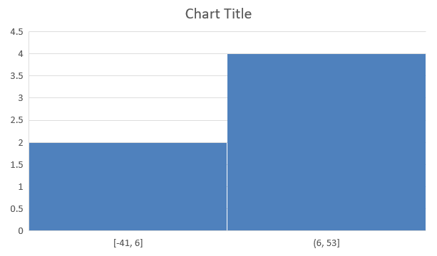

## **نمای کلی**

این مقاله توضیح می‌دهد که چگونه می‌توانید نمودارها را با استفاده از Aspose.Slides برای Python از طریق .NET ایجاد و سفارشی کنید. شما یاد خواهید گرفت چگونه یک نمودار را به اسلاید اضافه کنید، آن را با داده‌ها پر کنید و قالب‌بندی کنید تا با نیازهای طراحی شما مطابقت داشته باشد. نمونه‌های کد شامل ایجاد ارائه‌ها و نمودارها، پیکربندی سری‌ها، محورهای نمودار و افسانه‌ها، و یکپارچه‌سازی تولید نمودار در برنامه‌های شما می‌شود.

## **ایجاد نمودار**

نمودارها به افراد کمک می‌کنند تا داده‌ها را به‌سرعت بصری سازی کنند و بینش‌هایی به‌دست آورند که ممکن است از یک جدول یا صفحه‌گسترده به‌سرعت واضح نباشند.

**چرا نمودارها را ایجاد کنیم؟**

* داده‌های بزرگ را در یک اسلاید از ارائه تجمیع، فشرده یا خلاصه کنید؛  
* الگوها و روندهای موجود در داده‌ها را نشان دهید؛  
* جهت و شتاب داده‌ها را در طول زمان یا نسبت به یک واحد اندازه‌گیری خاص استنتاج کنید؛  
* نقطه‌های دورافتاده، انحرافات، خطاها و داده‌های نامعقول را شناسایی کنید؛  
* داده‌های پیچیده را ارتباط یا ارائه دهید.

در PowerPoint می‌توانید نمودارها را از طریق عملکرد *Insert* ایجاد کنید که قالب‌هایی برای طراحی انواع مختلف نمودارها فراهم می‌کند. با استفاده از Aspose.Slides می‌توانید هر دو نوع نمودار معمولی (مبتنی بر انواع محبوب نمودار) و نمودارهای سفارشی را ایجاد کنید.

{}
از شمارش‌گر [ChartType](https://reference.aspose.com/slides/python-net/aspose.slides.charts/charttype/) تحت فضای نام [Aspose.Slides.Charts](https://reference.aspose.com/slides/python-net/aspose.slides.charts/) استفاده کنید. مقادیر این شمارش‌گر به انواع مختلف نمودارها مربوط می‌شوند.
{}

### **ایجاد نمودارهای ستونی خوشه‌ای**

این بخش توضیح می‌دهد که چگونه می‌توانید نمودارهای ستونی خوشه‌ای را با استفاده از Aspose.Slides برای Python از طریق .NET ایجاد کنید. شما یاد خواهید گرفت که یک ارائه را مقداردهی اولیه کنید، نمودار اضافه کنید و عناصر آن مانند عنوان، داده‌ها، سری‌ها، دسته‌ها و سبک‌ها را سفارشی کنید. مراحل زیر را دنبال کنید تا ببینید یک نمودار ستونی خوشه‌ای استاندارد چگونه تولید می‌شود:

1. یک نمونه از کلاس [Presentation](https://reference.aspose.com/slides/python-net/aspose.slides/presentation/) ایجاد کنید.  
2. با استفاده از ایندکس، یک ارجاع به اسلاید دریافت کنید.  
3. نموداری با برخی داده‌ها اضافه کنید و نوع `ChartType.CLUSTERED_COLUMN` را مشخص کنید.  
4. عنوانی به نمودار اضافه کنید.  
5. به کاربرگ داده‌های نمودار دسترسی پیدا کنید.  
6. تمام سری‌ها و دسته‌های پیش‌فرض را پاک کنید.  
7. سری‌ها و دسته‌های جدید اضافه کنید.  
8. داده‌های جدیدی برای سری‌های نمودار اضافه کنید.  
9. رنگ پر کردن به سری‌های نمودار اعمال کنید.  
10. برچسب‌ها را به سری‌های نمودار اضافه کنید.  
11. ارائهٔ اصلاح‌شده را به‌صورت فایل PPTX ذخیره کنید.

این کد Python نحوه ایجاد یک نمودار ستونی خوشه‌ای را نشان می‌دهد:

```py
import aspose.slides.charts as charts
import aspose.slides as slides
import aspose.pydrawing as draw

# نمونه‌سازی کلاس Presentation که یک فایل PPTX را نمایش می‌دهد.
with slides.Presentation() as presentation:

    # دسترسی به اولین اسلاید.
    slide = presentation.slides[0]

    # افزودن نمودار ستونی خوشه‌ای همراه با داده‌های پیش‌فرض آن.
    chart = slide.shapes.add_chart(charts.ChartType.CLUSTERED_COLUMN, 20, 20, 500, 300)

    # تنظیم عنوان نمودار.
    chart.chart_title.add_text_frame_for_overriding("Sample Title")
    chart.chart_title.text_frame_for_overriding.text_frame_format.center_text = slides.NullableBool.TRUE
    chart.chart_title.height = 20
    chart.has_title = True

    # تنظیم ایندکس برگه داده‌های نمودار.
    worksheet_index = 0

    # دریافت کتاب‌کار داده‌های نمودار.
    workbook = chart.chart_data.chart_data_workbook

    # حذف سری‌ها و دسته‌های پیش‌فرض تولید شده.
    chart.chart_data.series.clear()
    chart.chart_data.categories.clear()

    # افزودن سری‌های جدید.
    chart.chart_data.series.add(workbook.get_cell(worksheet_index, 0, 1, "Series 1"), chart.type)
    chart.chart_data.series.add(workbook.get_cell(worksheet_index, 0, 2, "Series 2"), chart.type)

    # افزودن دسته‌های جدید.
    chart.chart_data.categories.add(workbook.get_cell(worksheet_index, 1, 0, "Category 1"))
    chart.chart_data.categories.add(workbook.get_cell(worksheet_index, 2, 0, "Category 2"))
    chart.chart_data.categories.add(workbook.get_cell(worksheet_index, 3, 0, "Category 3"))

    # دریافت اولین سری نمودار.
    series = chart.chart_data.series[0]

    # پر کردن داده‌های سری.
    series.data_points.add_data_point_for_bar_series(workbook.get_cell(worksheet_index, 1, 1, 20))
    series.data_points.add_data_point_for_bar_series(workbook.get_cell(worksheet_index, 2, 1, 50))
    series.data_points.add_data_point_for_bar_series(workbook.get_cell(worksheet_index, 3, 1, 30))

    # تنظیم رنگ پر کردن برای سری.
    series.format.fill.fill_type = slides.FillType.SOLID
    series.format.fill.solid_fill_color.color = draw.Color.red

    # دریافت دومین سری نمودار.
    series = chart.chart_data.series[1]

    # پر کردن داده‌های سری.
    series.data_points.add_data_point_for_bar_series(workbook.get_cell(worksheet_index, 1, 2, 30))
    series.data_points.add_data_point_for_bar_series(workbook.get_cell(worksheet_index, 2, 2, 10))
    series.data_points.add_data_point_for_bar_series(workbook.get_cell(worksheet_index, 3, 2, 60))

    # تنظیم رنگ پر کردن برای سری.
    series.format.fill.fill_type = slides.FillType.SOLID
    series.format.fill.solid_fill_color.color = draw.Color.green

    # تنظیم اولین برچسب برای نمایش نام دسته.
    label = series.data_points[0].label
    label.data_label_format.show_category_name = True

    label = series.data_points[1].label
    label.data_label_format.show_series_name = True

    # تنظیم سری برای نمایش مقدار در برچسب سوم.
    label = series.data_points[2].label
    label.data_label_format.show_value = True
    label.data_label_format.show_series_name = True
    label.data_label_format.separator = "/"
                
    # ذخیره ارائه روی دیسک به‌صورت فایل PPTX.
    presentation.save("ClusteredColumnChart.pptx", slides.export.SaveFormat.PPTX)
```

نتیجه:


### **ایجاد نمودارهای پراکنده**

نمودارهای پراکنده (که به عنوان نمودارهای نقطه‌ای یا گراف‌های x‑y نیز شناخته می‌شوند) معمولاً برای بررسی الگوها یا نشان دادن همبستگی بین دو متغیر استفاده می‌شوند.

از یک نمودار پراکنده زمانی استفاده کنید که:

* داده‌های عددی جفت‌ شده دارید.  
* دو متغیر دارید که به‌خوبی با هم جفت می‌شوند.  
* می‌خواهید تعیین کنید آیا این دو متغیر مرتبط هستند یا نه.  
* یک متغیر مستقل دارید که برای یک متغیر وابسته مقادیر متعددی دارد.

این کد Python نحوه ایجاد یک نمودار پراکنده با نشانگرهای مختلف برای هر سری را نشان می‌دهد:

```py
import aspose.slides.charts as charts
import aspose.slides as slides
import aspose.pydrawing as draw

# نمونه‌سازی کلاس Presentation.
with slides.Presentation() as presentation:

    # دسترسی به اولین اسلاید.
    slide = presentation.slides[0]

    # ایجاد نمودار پراکنده پیش‌فرض.
    chart = slide.shapes.add_chart(charts.ChartType.SCATTER_WITH_SMOOTH_LINES, 20, 20, 500, 300)

    # تنظیم ایندکس برگه داده‌های نمودار.
    worksheet_index = 0

    # دریافت کتاب‌کار داده‌های نمودار.
    workbook = chart.chart_data.chart_data_workbook

    # حذف سری‌های پیش‌فرض.
    chart.chart_data.series.clear()

    # افزودن سری‌های جدید.
    chart.chart_data.series.add(workbook.get_cell(worksheet_index, 1, 1, "Series 1"), chart.type)
    chart.chart_data.series.add(workbook.get_cell(worksheet_index, 1, 3, "Series 2"), chart.type)

    # دریافت اولین سری نمودار.
    series = chart.chart_data.series[0]

    # افزودن نقطه جدید (1:3) به سری.
    series.data_points.add_data_point_for_scatter_series(workbook.get_cell(worksheet_index, 2, 1, 1), workbook.get_cell(worksheet_index, 2, 2, 3))

    # افزودن نقطه جدید (2:10).
    series.data_points.add_data_point_for_scatter_series(workbook.get_cell(worksheet_index, 3, 1, 2), workbook.get_cell(worksheet_index, 3, 2, 10))

    # تغییر نوع سری.
    series.type = charts.ChartType.SCATTER_WITH_STRAIGHT_LINES_AND_MARKERS

    # تغییر نشانگر سری نمودار.
    series.marker.size = 10
    series.marker.symbol = charts.MarkerStyleType.STAR

    # دریافت دومین سری نمودار.
    series = chart.chart_data.series[1]

    # افزودن نقطه جدید (5:2) به سری نمودار.
    series.data_points.add_data_point_for_scatter_series(workbook.get_cell(worksheet_index, 2, 3, 5), workbook.get_cell(worksheet_index, 2, 4, 2))

    # افزودن نقطه جدید (3:1).
    series.data_points.add_data_point_for_scatter_series(workbook.get_cell(worksheet_index, 3, 3, 3), workbook.get_cell(worksheet_index, 3, 4, 1))

    # افزودن نقطه جدید (2:2).
    series.data_points.add_data_point_for_scatter_series(workbook.get_cell(worksheet_index, 4, 3, 2), workbook.get_cell(worksheet_index, 4, 4, 2))

    # افزودن نقطه جدید (5:1).
    series.data_points.add_data_point_for_scatter_series(workbook.get_cell(worksheet_index, 5, 3, 5), workbook.get_cell(worksheet_index, 5, 4, 1))

    # تغییر نشانگر سری نمودار.
    series.marker.size = 10
    series.marker.symbol = charts.MarkerStyleType.CIRCLE

    presentation.save("ScatterChart.pptx", slides.export.SaveFormat.PPTX)
```

نتیجه:


### **ایجاد نمودارهای دایره‌ای**

نمودارهای دایره‌ای برای نمایش ارتباط بخش به کل در داده‌ها، به‌ویژه زمانی که داده‌ها شامل برچسب‌های دسته‌ای با مقدارهای عددی هستند، بهترین گزینه هستند. البته اگر داده‌های شما شامل بخش‌ها یا برچسب‌های زیادی باشد، ممکن است بهتر باشد از نمودار میله‌ای استفاده کنید.

1. یک نمونه از کلاس [Presentation](https://reference.aspose.com/slides/python-net/aspose.slides/presentation/) ایجاد کنید.  
2. با استفاده از ایندکس، یک ارجاع به اسلاید دریافت کنید.  
3. نموداری با داده‌های پیش‌فرض اضافه کنید و نوع `ChartType.PIE` را مشخص کنید.  
4. به دفتر کار داده‌های نمودار ([ChartDataWorkbook](https://reference.aspose.com/slides/python-net/aspose.slides.charts/chartdataworkbook/)) دسترسی پیدا کنید.  
5. سری‌ها و دسته‌های پیش‌فرض را پاک کنید.  
6. سری‌ها و دسته‌های جدید اضافه کنید.  
7. داده‌های جدید برای سری‌های نمودار اضافه کنید.  
8. نقاط جدیدی برای نمودار اضافه کنید و رنگ‌های دلخواه را به بخش‌های نمودار دایره‌ای اعمال کنید.  
9. برچسب‌ها را برای سری‌ها تنظیم کنید.  
10. خطوط راهنما را برای برچسب‌های سری‌ها فعال کنید.  
11. زاویه چرخش نمودار دایره‌ای را تنظیم کنید.  
12. ارائهٔ اصلاح‌شده را به‌صورت فایل PPTX ذخیره کنید.

این کد Python نحوه ایجاد یک نمودار دایره‌ای را نشان می‌دهد:

```py
import aspose.slides.charts as charts
import aspose.slides as slides
import aspose.pydrawing as draw

# نمونه‌سازی کلاس Presentation که یک فایل PPTX را نمایندگی می‌کند.
with slides.Presentation() as presentation:

    # دسترسی به اولین اسلاید.
    slide = presentation.slides[0]

    # افزودن نمودار با داده‌های پیش‌فرض آن.
    chart = slide.shapes.add_chart(charts.ChartType.PIE, 20, 20, 500, 300)

    # تنظیم عنوان نمودار.
    chart.chart_title.add_text_frame_for_overriding("Sample Title")
    chart.chart_title.text_frame_for_overriding.text_frame_format.center_text = slides.NullableBool.TRUE
    chart.chart_title.height = 20
    chart.has_title = True

    # تنظیم ایندکس برگه داده‌های نمودار.
    worksheet_index = 0

    # دریافت کتاب‌کار داده‌های نمودار.
    workbook = chart.chart_data.chart_data_workbook

    # حذف سری‌ها و دسته‌های پیش‌فرض تولید شده.
    chart.chart_data.series.clear()
    chart.chart_data.categories.clear()

    # افزودن دسته‌های جدید.
    chart.chart_data.categories.add(workbook.get_cell(0, 1, 0, "First Qtr"))
    chart.chart_data.categories.add(workbook.get_cell(0, 2, 0, "2nd Qtr"))
    chart.chart_data.categories.add(workbook.get_cell(0, 3, 0, "3rd Qtr"))

    # افزودن سری‌های جدید.
    series = chart.chart_data.series.add(workbook.get_cell(0, 0, 1, "Series 1"), chart.type)

    # پر کردن داده‌های سری.
    series.data_points.add_data_point_for_pie_series(workbook.get_cell(worksheet_index, 1, 1, 20))
    series.data_points.add_data_point_for_pie_series(workbook.get_cell(worksheet_index, 2, 1, 50))
    series.data_points.add_data_point_for_pie_series(workbook.get_cell(worksheet_index, 3, 1, 30))

    # تنظیم رنگ بخش.
    chart.chart_data.series_groups[0].is_color_varied = True

    point = series.data_points[0]
    point.format.fill.fill_type = slides.FillType.SOLID
    point.format.fill.solid_fill_color.color = draw.Color.cyan

    # تنظیم حاشیه بخش.
    point.format.line.fill_format.fill_type = slides.FillType.SOLID
    point.format.line.fill_format.solid_fill_color.color = draw.Color.gray
    point.format.line.width = 3.0
    point.format.line.style = slides.LineStyle.THIN_THICK
    point.format.line.dash_style = slides.LineDashStyle.DASH_DOT

    point1 = series.data_points[1]
    point1.format.fill.fill_type = slides.FillType.SOLID
    point1.format.fill.solid_fill_color.color = draw.Color.brown

    # تنظیم حاشیه بخش.
    point1.format.line.fill_format.fill_type = slides.FillType.SOLID
    point1.format.line.fill_format.solid_fill_color.color = draw.Color.blue
    point1.format.line.width = 3.0
    point1.format.line.style = slides.LineStyle.SINGLE
    point1.format.line.dash_style = slides.LineDashStyle.LARGE_DASH_DOT

    point2 = series.data_points[2]
    point2.format.fill.fill_type = slides.FillType.SOLID
    point2.format.fill.solid_fill_color.color = draw.Color.coral

    # تنظیم حاشیه بخش.
    point2.format.line.fill_format.fill_type = slides.FillType.SOLID
    point2.format.line.fill_format.solid_fill_color.color = draw.Color.red
    point2.format.line.width = 2.0
    point2.format.line.style = slides.LineStyle.THIN_THIN
    point2.format.line.dash_style = slides.LineDashStyle.LARGE_DASH_DOT_DOT

    # ایجاد برچسب‌های سفارشی برای هر دسته در سری جدید.
    label1 = series.data_points[0].label

    label1.data_label_format.show_value = True

    label2 = series.data_points[1].label
    label2.data_label_format.show_value = True
    label2.data_label_format.show_legend_key = True
    label2.data_label_format.show_percentage = True

    label3 = series.data_points[2].label
    label3.data_label_format.show_series_name = True
    label3.data_label_format.show_percentage = True

    # تنظیم سری برای نمایش خطوط راهنما در نمودار.
    series.labels.default_data_label_format.show_leader_lines = True

    # تنظیم زاویه چرخش برای بخش‌های نمودار دایره‌ای.
    chart.chart_data.series_groups[0].first_slice_angle = 180

    # ذخیره ارائه روی دیسک به‌صورت فایل PPTX.
    presentation.save("PieChart.pptx", slides.export.SaveFormat.PPTX)
```

نتیجه:


### **ایجاد نمودارهای خطی**

نمودارهای خطی (که به عنوان نمودارهای خطی نیز شناخته می‌شوند) برای نشان دادن تغییرات مقدار در طول زمان مناسب‌ترین گزینه هستند. با استفاده از یک نمودار خطی می‌توانید مقدار زیادی داده را به‌طور همزمان مقایسه کنید، تغییرات و روندها را در طول زمان پیگیری کنید، ناهنجاری‌ها را در سری‌های داده برجسته کنید و موارد دیگر.

1. یک نمونه از کلاس [Presentation](https://reference.aspose.com/slides/python-net/aspose.slides/presentation/) ایجاد کنید.  
2. با استفاده از ایندکس، یک ارجاع به اسلاید دریافت کنید.  
3. نموداری با داده‌های پیش‌فرض اضافه کنید و نوع `ChartType.LINE` را مشخص کنید.  
4. ارائهٔ اصلاح‌شده را به‌صورت فایل PPTX ذخیره کنید.

این کد Python نحوه ایجاد یک نمودار خطی را نشان می‌دهد:

```python
import aspose.slides as slides

with slides.Presentation() as presentation:
    line_chart = presentation.slides[0].shapes.add_chart(slides.charts.ChartType.LINE, 20, 20, 500, 300)
    
    presentation.save("LineChart.pptx", slides.export.SaveFormat.PPTX)
```

به صورت پیش‌فرض، نقاط در یک نمودار خطی با خطوط مستقیم و پیوسته به هم متصل می‌شوند. اگر می‌خواهید نقاط به‌جای خطوط پیوسته با خط تیره به‌هم متصل شوند، می‌توانید نوع خط تیره مورد نظر خود را به‌صورت زیر مشخص کنید:

```python
import aspose.slides as slides

with slides.Presentation() as presentation:
    line_chart = presentation.slides[0].shapes.add_chart(slides.charts.ChartType.LINE, 10, 50, 600, 350)

    for series in line_chart.chart_data.series:
        series.format.line.dash_style = slides.LineDashStyle.DASH

    presentation.save("LineChart.pptx", slides.export.SaveFormat.PPTX)
```

نتیجه:


### **ایجاد نمودارهای درخت‌نقشه**

نمودارهای درخت‌نقشه برای داده‌های فروش وقتی مناسب هستند که بخواهید اندازه نسبی دسته‌های داده را نشان دهید و به‌سرعت توجه را به اقلامی که سهم بزرگ‌تری در هر دسته دارند جلب کنید.

1. یک نمونه از کلاس [Presentation](https://reference.aspose.com/slides/python-net/aspose.slides/presentation/) ایجاد کنید.  
2. با استفاده از ایندکس، یک ارجاع به اسلاید دریافت کنید.  
3. نموداری با داده‌های پیش‌فرض اضافه کنید و نوع `ChartType.TREEMAP` را مشخص کنید.  
4. به دفتر کار داده‌های نمودار ([ChartDataWorkbook](https://reference.aspose.com/slides/python-net/aspose.slides.charts/chartdataworkbook/)) دسترسی پیدا کنید.  
5. سری‌ها و دسته‌های پیش‌فرض را پاک کنید.  
6. سری‌ها و دسته‌های جدید اضافه کنید.  
7. داده‌های جدید برای سری‌های نمودار اضافه کنید.  
8. ارائهٔ اصلاح‌شده را به‌صورت فایل PPTX ذخیره کنید.

این کد Python نحوه ایجاد یک نمودار درخت‌نقشه را نشان می‌دهد:

```py
import aspose.slides.charts as charts
import aspose.slides as slides
import aspose.pydrawing as draw

with slides.Presentation() as presentation:
    chart = presentation.slides[0].shapes.add_chart(charts.ChartType.TREEMAP, 20, 20, 500, 300)
    chart.chart_data.categories.clear()
    chart.chart_data.series.clear()

    workbook = chart.chart_data.chart_data_workbook
    workbook.clear(0)

    # شاخه 1
    leaf = chart.chart_data.categories.add(workbook.get_cell(0, "C1", "Leaf1"))
    leaf.grouping_levels.set_grouping_item(1, "Stem1")
    leaf.grouping_levels.set_grouping_item(2, "Branch1")

    chart.chart_data.categories.add(workbook.get_cell(0, "C2", "Leaf2"))

    leaf = chart.chart_data.categories.add(workbook.get_cell(0, "C3", "Leaf3"))
    leaf.grouping_levels.set_grouping_item(1, "Stem2")

    chart.chart_data.categories.add(workbook.get_cell(0, "C4", "Leaf4"))

    # شاخه 2
    leaf = chart.chart_data.categories.add(workbook.get_cell(0, "C5", "Leaf5"))
    leaf.grouping_levels.set_grouping_item(1, "Stem3")
    leaf.grouping_levels.set_grouping_item(2, "Branch2")

    chart.chart_data.categories.add(workbook.get_cell(0, "C6", "Leaf6"))

    leaf = chart.chart_data.categories.add(workbook.get_cell(0, "C7", "Leaf7"))
    leaf.grouping_levels.set_grouping_item(1, "Stem4")

    chart.chart_data.categories.add(workbook.get_cell(0, "C8", "Leaf8"))

    series = chart.chart_data.series.add(charts.ChartType.TREEMAP)
    series.labels.default_data_label_format.show_category_name = True
    series.data_points.add_data_point_for_treemap_series(workbook.get_cell(0, "D1", 4))
    series.data_points.add_data_point_for_treemap_series(workbook.get_cell(0, "D2", 5))
    series.data_points.add_data_point_for_treemap_series(workbook.get_cell(0, "D3", 3))
    series.data_points.add_data_point_for_treemap_series(workbook.get_cell(0, "D4", 6))
    series.data_points.add_data_point_for_treemap_series(workbook.get_cell(0, "D5", 9))
    series.data_points.add_data_point_for_treemap_series(workbook.get_cell(0, "D6", 9))
    series.data_points.add_data_point_for_treemap_series(workbook.get_cell(0, "D7", 4))
    series.data_points.add_data_point_for_treemap_series(workbook.get_cell(0, "D8", 3))

    series.parent_label_layout = charts.ParentLabelLayoutType.OVERLAPPING

    presentation.save("TreeMap.pptx", slides.export.SaveFormat.PPTX)
```

نتیجه:


### **ایجاد نمودارهای سهام**

نمودارهای سهام برای نمایش داده‌های مالی مانند قیمت‌های باز، بالا، پایین و بسته استفاده می‌شوند و به تحلیل روندهای بازار و نوسان آن کمک می‌کنند. این نمودارها بینش‌های اساسی در مورد عملکرد سهام ارائه می‌دهند و به سرمایه‌گذاران و تحلیل‌گران کمک می‌کنند تصمیمات آگاهانه‌تری بگیرند.

1. یک نمونه از کلاس [Presentation](https://reference.aspose.com/slides/python-net/aspose.slides/presentation/) ایجاد کنید.  
2. با استفاده از ایندکس، یک ارجاع به اسلاید دریافت کنید.  
3. نموداری با داده‌های پیش‌فرض اضافه کنید و نوع `ChartType.OPEN_HIGH_LOW_CLOSE` را مشخص کنید.  
4. به دفتر کار داده‌های نمودار ([ChartDataWorkbook](https://reference.aspose.com/slides/python-net/aspose.slides.charts/chartdataworkbook/)) دسترسی پیدا کنید.  
5. سری‌ها و دسته‌های پیش‌فرض را پاک کنید.  
6. سری‌ها و دسته‌های جدید اضافه کنید.  
7. داده‌های جدید برای سری‌های نمودار اضافه کنید.  
8. قالب خطوط بالا‑پایین را مشخص کنید.  
9. ارائهٔ اصلاح‌شده را به‌صورت فایل PPTX ذخیره کنید.

این کد Python نحوه ایجاد یک نمودار سهام را نشان می‌دهد:

```py
import aspose.slides.charts as charts
import aspose.slides as slides
import aspose.pydrawing as draw

with slides.Presentation() as presentation:
    chart = presentation.slides[0].shapes.add_chart(charts.ChartType.OPEN_HIGH_LOW_CLOSE, 20, 20, 500, 300, False)

    chart.chart_data.series.clear()
    chart.chart_data.categories.clear()

    workbook = chart.chart_data.chart_data_workbook

    chart.chart_data.categories.add(workbook.get_cell(0, 1, 0, "A"))
    chart.chart_data.categories.add(workbook.get_cell(0, 2, 0, "B"))
    chart.chart_data.categories.add(workbook.get_cell(0, 3, 0, "C"))

    chart.chart_data.series.add(workbook.get_cell(0, 0, 1, "Open"), chart.type)
    chart.chart_data.series.add(workbook.get_cell(0, 0, 2, "High"), chart.type)
    chart.chart_data.series.add(workbook.get_cell(0, 0, 3, "Low"), chart.type)
    chart.chart_data.series.add(workbook.get_cell(0, 0, 4, "Close"), chart.type)

    series = chart.chart_data.series[0]

    series.data_points.add_data_point_for_stock_series(workbook.get_cell(0, 1, 1, 72))
    series.data_points.add_data_point_for_stock_series(workbook.get_cell(0, 2, 1, 25))
    series.data_points.add_data_point_for_stock_series(workbook.get_cell(0, 3, 1, 38))

    series = chart.chart_data.series[1]
    series.data_points.add_data_point_for_stock_series(workbook.get_cell(0, 1, 2, 172))
    series.data_points.add_data_point_for_stock_series(workbook.get_cell(0, 2, 2, 57))
    series.data_points.add_data_point_for_stock_series(workbook.get_cell(0, 3, 2, 57))

    series = chart.chart_data.series[2]
    series.data_points.add_data_point_for_stock_series(workbook.get_cell(0, 1, 3, 12))
    series.data_points.add_data_point_for_stock_series(workbook.get_cell(0, 2, 3, 12))
    series.data_points.add_data_point_for_stock_series(workbook.get_cell(0, 3, 3, 13))

    series = chart.chart_data.series[3]
    series.data_points.add_data_point_for_stock_series(workbook.get_cell(0, 1, 4, 25))
    series.data_points.add_data_point_for_stock_series(workbook.get_cell(0, 2, 4, 38))
    series.data_points.add_data_point_for_stock_series(workbook.get_cell(0, 3, 4, 50))

    chart.chart_data.series_groups[0].up_down_bars.has_up_down_bars = True
    chart.chart_data.series_groups[0].hi_low_lines_format.line.fill_format.fill_type = slides.FillType.SOLID

    for ser in chart.chart_data.series:
        ser.format.line.fill_format.fill_type = slides.FillType.NO_FILL

    presentation.save("StockChart.pptx", slides.export.SaveFormat.PPTX)
```

نتیجه:


### **ایجاد نمودارهای جعبه‌ای و ویسکر**

نمودارهای جعبه‌ای و ویسکر برای نمایش توزیع داده‌ها با خلاصه‌ای از معیارهای آماری کلیدی مانند میانه، چارک‌ها و نقاط دورافتاده استفاده می‌شوند. این نمودارها به‌ویژه در تحلیل اکتشافی داده‌ها و مطالعات آماری برای درک سریع تنوع داده‌ها و شناسایی ناهنجاری‌ها مفید هستند.

1. یک نمونه از کلاس [Presentation](https://reference.aspose.com/slides/python-net/aspose.slides/presentation/) ایجاد کنید.  
2. با استفاده از ایندکس، یک ارجاع به اسلاید دریافت کنید.  
3. نموداری با داده‌های پیش‌فرض اضافه کنید و نوع `ChartType.BOX_AND_WHISKER` را مشخص کنید.  
4. به دفتر کار داده‌های نمودار ([ChartDataWorkbook](https://reference.aspose.com/slides/python-net/aspose.slides.charts/chartdataworkbook/)) دسترسی پیدا کنید.  
5. سری‌ها و دسته‌های پیش‌فرض را پاک کنید.  
6. سری‌ها و دسته‌های جدید اضافه کنید.  
7. داده‌های جدید برای سری‌های نمودار اضافه کنید.  
8. ارائهٔ اصلاح‌شده را به‌صورت فایل PPTX ذخیره کنید.

این کد Python نحوه ایجاد یک نمودار جعبه‌ای و ویسکر را نشان می‌دهد:

```py
import aspose.slides.charts as charts
import aspose.slides as slides
import aspose.pydrawing as draw

with slides.Presentation() as presentation:
    chart = presentation.slides[0].shapes.add_chart(charts.ChartType.BOX_AND_WHISKER, 20, 20, 500, 300)
    chart.chart_data.categories.clear()
    chart.chart_data.series.clear()

    workbook = chart.chart_data.chart_data_workbook
    workbook.clear(0)

    chart.chart_data.categories.add(workbook.get_cell(0, "A1", "Category 1"))
    chart.chart_data.categories.add(workbook.get_cell(0, "A2", "Category 1"))
    chart.chart_data.categories.add(workbook.get_cell(0, "A3", "Category 1"))
    chart.chart_data.categories.add(workbook.get_cell(0, "A4", "Category 1"))
    chart.chart_data.categories.add(workbook.get_cell(0, "A5", "Category 1"))
    chart.chart_data.categories.add(workbook.get_cell(0, "A6", "Category 1"))

    series = chart.chart_data.series.add(charts.ChartType.BOX_AND_WHISKER)

    series.quartile_method = charts.QuartileMethodType.EXCLUSIVE
    series.show_mean_line = True
    series.show_mean_markers = True
    series.show_inner_points = True
    series.show_outlier_points = True

    series.data_points.add_data_point_for_box_and_whisker_series(workbook.get_cell(0, "B1", 15))
    series.data_points.add_data_point_for_box_and_whisker_series(workbook.get_cell(0, "B2", 41))
    series.data_points.add_data_point_for_box_and_whisker_series(workbook.get_cell(0, "B3", 16))
    series.data_points.add_data_point_for_box_and_whisker_series(workbook.get_cell(0, "B4", 10))
    series.data_points.add_data_point_for_box_and_whisker_series(workbook.get_cell(0, "B5", 23))
    series.data_points.add_data_point_for_box_and_whisker_series(workbook.get_cell(0, "B6", 16))

    presentation.save("BoxAndWhiskerChart.pptx", slides.export.SaveFormat.PPTX)
```

### **ایجاد نمودارهای قیفی**

نمودارهای قیفی برای تجسم فرآیندهایی که شامل مراحل متوالی هستند استفاده می‌شوند، به‌طوری که حجم داده‌ها با پیشرفت از یک گام به گام دیگر کاهش می‌یابد. این نمودارها برای تحلیل نرخ تبدیل، شناسایی گلوگاه‌ها و پیگیری کارایی فرآیندهای فروش یا بازاریابی مفید هستند.

1. یک نمونه از کلاس [Presentation](https://reference.aspose.com/slides/python-net/aspose.slides/presentation/) ایجاد کنید.  
2. با استفاده از ایندکس، یک ارجاع به اسلاید دریافت کنید.  
3. نموداری با داده‌های پیش‌فرض اضافه کنید و نوع `ChartType.FUNNEL` را مشخص کنید.  
4. ارائهٔ اصلاح‌شده را به‌صورت فایل PPTX ذخیره کنید.

این کد Python نحوه ایجاد یک نمودار قیفی را نشان می‌دهد:

```py
import aspose.slides.charts as charts
import aspose.slides as slides
import aspose.pydrawing as draw

with slides.Presentation() as presentation:
    chart = presentation.slides[0].shapes.add_chart(charts.ChartType.FUNNEL, 50, 50, 500, 400)
    chart.chart_data.categories.clear()
    chart.chart_data.series.clear()

    workbook = chart.chart_data.chart_data_workbook
    workbook.clear(0)

    chart.chart_data.categories.add(workbook.get_cell(0, "A1", "Category 1"))
    chart.chart_data.categories.add(workbook.get_cell(0, "A2", "Category 2"))
    chart.chart_data.categories.add(workbook.get_cell(0, "A3", "Category 3"))
    chart.chart_data.categories.add(workbook.get_cell(0, "A4", "Category 4"))
    chart.chart_data.categories.add(workbook.get_cell(0, "A5", "Category 5"))
    chart.chart_data.categories.add(workbook.get_cell(0, "A6", "Category 6"))

    series = chart.chart_data.series.add(charts.ChartType.FUNNEL)

    series.data_points.add_data_point_for_funnel_series(workbook.get_cell(0, "B1", 50))
    series.data_points.add_data_point_for_funnel_series(workbook.get_cell(0, "B2", 100))
    series.data_points.add_data_point_for_funnel_series(workbook.get_cell(0, "B3", 200))
    series.data_points.add_data_point_for_funnel_series(workbook.get_cell(0, "B4", 300))
    series.data_points.add_data_point_for_funnel_series(workbook.get_cell(0, "B5", 400))
    series.data_points.add_data_point_for_funnel_series(workbook.get_cell(0, "B6", 500))

    presentation.save("FunnelChart.pptx", slides.export.SaveFormat.PPTX)
```

نتیجه:


### **ایجاد نمودارهای خورشیدگرد**

نمودارهای خورشیدگرد برای تجسم داده‌های سلسله‌مراتبی استفاده می‌شوند و سطوح را به‌صورت حلقه‌های متحد‌المرکز نمایش می‌دهند. این نمودارها روابط بخش به کل را نشان می‌دهند و برای نمایش دسته‌ها و زیردسته‌های تو در تو به‌صورت واضح و فشرده ایده‌آل هستند.

1. یک نمونه از کلاس [Presentation](https://reference.aspose.com/slides/python-net/aspose.slides/presentation/) ایجاد کنید.  
2. با استفاده از ایندکس، یک ارجاع به اسلاید دریافت کنید.  
3. نموداری با داده‌های پیش‌فرض اضافه کنید و نوع `ChartType.SUNBURST` را مشخص کنید.  
4. ارائهٔ اصلاح‌شده را به‌صورت فایل PPTX ذخیره کنید.

این کد Python نحوه ایجاد یک نمودار خورشیدگرد را نشان می‌دهد:

```py
import aspose.slides.charts as charts
import aspose.slides as slides
import aspose.pydrawing as draw

with slides.Presentation() as presentation:
    chart = presentation.slides[0].shapes.add_chart(charts.ChartType.SUNBURST, 20, 20, 500, 300)
    chart.chart_data.categories.clear()
    chart.chart_data.series.clear()

    workbook = chart.chart_data.chart_data_workbook
    workbook.clear(0)

    # شاخه 1
    leaf = chart.chart_data.categories.add(workbook.get_cell(0, "C1", "Leaf1"))
    leaf.grouping_levels.set_grouping_item(1, "Stem1")
    leaf.grouping_levels.set_grouping_item(2, "Branch1")

    chart.chart_data.categories.add(workbook.get_cell(0, "C2", "Leaf2"))

    leaf = chart.chart_data.categories.add(workbook.get_cell(0, "C3", "Leaf3"))
    leaf.grouping_levels.set_grouping_item(1, "Stem2")

    chart.chart_data.categories.add(workbook.get_cell(0, "C4", "Leaf4"))

    # شاخه 2
    leaf = chart.chart_data.categories.add(workbook.get_cell(0, "C5", "Leaf5"))
    leaf.grouping_levels.set_grouping_item(1, "Stem3")
    leaf.grouping_levels.set_grouping_item(2, "Branch2")

    chart.chart_data.categories.add(workbook.get_cell(0, "C6", "Leaf6"))

    leaf = chart.chart_data.categories.add(workbook.get_cell(0, "C7", "Leaf7"))
    leaf.grouping_levels.set_grouping_item(1, "Stem4")

    chart.chart_data.categories.add(workbook.get_cell(0, "C8", "Leaf8"))

    series = chart.chart_data.series.add(charts.ChartType.SUNBURST)
    series.labels.default_data_label_format.show_category_name = True
    series.data_points.add_data_point_for_sunburst_series(workbook.get_cell(0, "D1", 4))
    series.data_points.add_data_point_for_sunburst_series(workbook.get_cell(0, "D2", 5))
    series.data_points.add_data_point_for_sunburst_series(workbook.get_cell(0, "D3", 3))
    series.data_points.add_data_point_for_sunburst_series(workbook.get_cell(0, "D4", 6))
    series.data_points.add_data_point_for_sunburst_series(workbook.get_cell(0, "D5", 9))
    series.data_points.add_data_point_for_sunburst_series(workbook.get_cell(0, "D6", 9))
    series.data_points.add_data_point_for_sunburst_series(workbook.get_cell(0, "D7", 4))
    series.data_points.add_data_point_for_sunburst_series(workbook.get_cell(0, "D8", 3))

    presentation.save("SunburstChart.pptx", slides.export.SaveFormat.PPTX)
```

نتیجه:


### **ایجاد نمودارهای هیستوگرام**

نمودارهای هیستوگرام برای نمایش توزیع داده‌های عددی با گروه‌بندی مقادیر در بازه‌ها یا بین‌ها استفاده می‌شوند. این نمودارها برای شناسایی الگوهای داده مانند فراوانی، کج‌بودگی و پراکندگی و برای تشخیص نقاط دورافتاده در یک مجموعه داده بسیار مفید هستند.

1. یک نمونه از کلاس [Presentation](https://reference.aspose.com/slides/python-net/aspose.slides/presentation/) ایجاد کنید.  
2. با استفاده از ایندکس، یک ارجاع به اسلاید دریافت کنید.  
3. نموداری با برخی داده‌ها اضافه کنید و نوع `ChartType.HISTOGRAM` را مشخص کنید.  
4. به دفتر کار داده‌های نمودار ([ChartDataWorkbook](https://reference.aspose.com/slides/python-net/aspose.slides.charts/chartdataworkbook/)) دسترسی پیدا کنید.  
5. سری‌ها و دسته‌های پیش‌فرض را پاک کنید.  
6. یک سری جدید اضافه کنید و آن را با نقاط داده پر کنید. هیستوگرام دسته‌ای ندارد؛ بن‌ها از مقادیر محاسبه می‌شوند.  
7. ارائهٔ اصلاح‌شده را به‌صورت فایل PPTX ذخیره کنید.

این کد Python نحوه ایجاد یک نمودار هیستوگرام را نشان می‌دهد:

```py
import aspose.slides.charts as charts
import aspose.slides as slides
import aspose.pydrawing as draw

with slides.Presentation() as presentation:
    chart = presentation.slides[0].shapes.add_chart(charts.ChartType.HISTOGRAM, 20, 20, 500, 300)
    chart.chart_data.categories.clear()
    chart.chart_data.series.clear()

    workbook = chart.chart_data.chart_data_workbook
    workbook.clear(0)

    series = chart.chart_data.series.add(charts.ChartType.HISTOGRAM)
    series.data_points.add_data_point_for_histogram_series(workbook.get_cell(0, "A1", 15))
    series.data_points.add_data_point_for_histogram_series(workbook.get_cell(0, "A2", -41))
    series.data_points.add_data_point_for_histogram_series(workbook.get_cell(0, "A3", 16))
    series.data_points.add_data_point_for_histogram_series(workbook.get_cell(0, "A4", 10))
    series.data_points.add_data_point_for_histogram_series(workbook.get_cell(0, "A5", -23))
    series.data_points.add_data_point_for_histogram_series(workbook.get_cell(0, "A6", 16))

    chart.axes.horizontal_axis.aggregation_type = charts.AxisAggregationType.AUTOMATIC

    presentation.save("HistogramChart.pptx", slides.export.SaveFormat.PPTX)
```

نتیجه:



### **ایجاد نمودارهای رادار**

نمودارهای رادار برای نمایش داده‌های چندمتغیره در قالب دو‑بعدی استفاده می‌شوند و امکان مقایسه آسان چندین متغیر به‌صورت همزمان را فراهم می‌کنند. این نمودارها برای شناسایی الگوها، نقاط قوت و ضعف در چندین معیار عملکرد یا ویژگی مفید هستند.

1. یک نمونه از کلاس [Presentation](https://reference.aspose.com/slides/python-net/aspose.slides/presentation/) ایجاد کنید.  
2. با استفاده از ایندکس، یک ارجاع به اسلاید دریافت کنید.  
3. نموداری با برخی داده‌ها اضافه کنید و نوع `ChartType.RADAR` را مشخص کنید.  
4. ارائهٔ اصلاح‌شده را به‌صورت فایل PPTX ذخیره کنید.

این کد Python نحوه ایجاد یک نمودار رادار را نشان می‌دهد:

```python
import aspose.slides as slides

with slides.Presentation() as presentation:
    presentation.slides[0].shapes.add_chart(slides.charts.ChartType.RADAR, 20, 20, 500, 300)
    presentation.save("RadarChart.pptx", slides.export.SaveFormat.PPTX)
```

نتیجه:


### **ایجاد نمودارهای چنددسته‌ای**

نمودارهای چنددسته‌ای برای نمایش داده‌هایی که شامل بیش از یک گروه‌بندی دسته‌ای هستند استفاده می‌شوند و به شما امکان مقایسه مقادیر در چندین بُعد به‌صورت همزمان را می‌دهند. این نمودارها وقتی که نیاز به تحلیل روندها و روابط در مجموعه‌داده‌های پیچیده و چند لایه دارید، بسیار مفید هستند.

1. یک نمونه از کلاس [Presentation](https://reference.aspose.com/slides/python-net/aspose.slides/presentation/) ایجاد کنید.  
2. با استفاده از ایندکس، یک ارجاع به اسلاید دریافت کنید.  
3. نموداری با داده‌های پیش‌فرض اضافه کنید و نوع `ChartType.CLUSTERED_COLUMN` را مشخص کنید.  
4. به دفتر کار داده‌های نمودار ([ChartDataWorkbook](https://reference.aspose.com/slides/python-net/aspose.slides.charts/chartdataworkbook/)) دسترسی پیدا کنید.  
5. سری‌ها و دسته‌های پیش‌فرض را پاک کنید.  
6. سری‌ها و دسته‌های جدید اضافه کنید.  
7. داده‌های جدید برای سری‌های نمودار اضافه کنید.  
8. ارائهٔ اصلاح‌شده را به‌صورت فایل PPTX ذخیره کنید.

این کد Python نحوه ایجاد یک نمودار چنددسته‌ای را نشان می‌دهد:

```py
import aspose.slides.charts as charts
import aspose.slides as slides
import aspose.pydrawing as draw

with slides.Presentation() as presentation:
    slide = presentation.slides[0]

    chart = presentation.slides[0].shapes.add_chart(charts.ChartType.CLUSTERED_COLUMN, 20, 20, 500, 300)
    chart.chart_data.series.clear()
    chart.chart_data.categories.clear()

    workbook = chart.chart_data.chart_data_workbook
    workbook.clear(0)

    worksheet_index = 0

    category = chart.chart_data.categories.add(workbook.get_cell(0, "c2", "A"))
    category.grouping_levels.set_grouping_item(1, "Group1")
    category = chart.chart_data.categories.add(workbook.get_cell(0, "c3", "B"))

    category = chart.chart_data.categories.add(workbook.get_cell(0, "c4", "C"))
    category.grouping_levels.set_grouping_item(1, "Group2")
    category = chart.chart_data.categories.add(workbook.get_cell(0, "c5", "D"))

    category = chart.chart_data.categories.add(workbook.get_cell(0, "c6", "E"))
    category.grouping_levels.set_grouping_item(1, "Group3")
    category = chart.chart_data.categories.add(workbook.get_cell(0, "c7", "F"))

    category = chart.chart_data.categories.add(workbook.get_cell(0, "c8", "G"))
    category.grouping_levels.set_grouping_item(1, "Group4")
    category = chart.chart_data.categories.add(workbook.get_cell(0, "c9", "H"))

    # افزودن یک سری.
    series = chart.chart_data.series.add(workbook.get_cell(0, "D1", "Series 1"), charts.ChartType.CLUSTERED_COLUMN)

    series.data_points.add_data_point_for_bar_series(workbook.get_cell(worksheet_index, "D2", 10))
    series.data_points.add_data_point_for_bar_series(workbook.get_cell(worksheet_index, "D3", 20))
    series.data_points.add_data_point_for_bar_series(workbook.get_cell(worksheet_index, "D4", 30))
    series.data_points.add_data_point_for_bar_series(workbook.get_cell(worksheet_index, "D5", 40))
    series.data_points.add_data_point_for_bar_series(workbook.get_cell(worksheet_index, "D6", 50))
    series.data_points.add_data_point_for_bar_series(workbook.get_cell(worksheet_index, "D7", 60))
    series.data_points.add_data_point_for_bar_series(workbook.get_cell(worksheet_index, "D8", 70))
    series.data_points.add_data_point_for_bar_series(workbook.get_cell(worksheet_index, "D9", 80))

    # ذخیرهٔ ارائه همراه با نمودار.
    presentation.save("MultiCategoryChart.pptx", slides.export.SaveFormat.PPTX)
```

نتیجه:


### **ایجاد نمودارهای نقشه**

نمودارهای نقشه برای تجسم داده‌های جغرافیایی با نگاشت اطلاعات به موقعیت‌های خاص مانند کشورها، ایالت‌ها یا شهرها استفاده می‌شوند. این نمودارها برای تحلیل روندهای منطقه‌ای، داده‌های جمعیتی و توزیع‌های فضایی به‌صورت واضح و بصری جذاب مفید هستند.

این کد Python نحوه ایجاد یک نمودار نقشه را نشان می‌دهد:

```python
import aspose.slides as slides

with slides.Presentation() as presentation:
    chart = presentation.slides[0].shapes.add_chart(slides.charts.ChartType.MAP, 20, 20, 500, 300)
    presentation.save("mapChart.pptx", slides.export.SaveFormat.PPTX)
```

نتیجه:


### **ایجاد نمودارهای ترکیبی**

نمودار ترکیبی (یا combo chart) دو یا چند نوع نمودار را در یک گراف ترکیب می‌کند. این نمودار به شما امکان می‌دهد تا تفاوت‌ها یا روابط بین دو یا چند مجموعه داده را برجسته، مقایسه یا بررسی کنید و روابط بین آن‌ها را شناسایی نمایید.


کد Python زیر نشان می‌دهد که چگونه نمودار ترکیبی نشان داده‌شده در بالا را در یک ارائه PowerPoint ایجاد کنید:

```python
import aspose.slides.charts as charts
import aspose.pydrawing as draw
import aspose.slides as slides

def create_combo_chart():
    with slides.Presentation() as presentation:
        chart = create_chart_with_first_series(presentation.slides[0])

        add_second_series_to_chart(chart)
        add_third_series_to_chart(chart)

        set_primary_axes_format(chart)
        set_secondary_axes_format(chart)

        presentation.save("combo-chart.pptx", slides.export.SaveFormat.PPTX)


def create_chart_with_first_series(slide):
    chart = slide.shapes.add_chart(charts.ChartType.CLUSTERED_COLUMN, 50, 50, 600, 400)

    # تنظیم عنوان نمودار.
    chart.has_title = True
    chart.chart_title.add_text_frame_for_overriding("Chart Title")
    chart.chart_title.overlay = False
    title_paragraph = chart.chart_title.text_frame_for_overriding.paragraphs[0]
    title_format = title_paragraph.paragraph_format.default_portion_format

    title_format.font_bold = slides.NullableBool.FALSE
    title_format.font_height = 18

    # تنظیم افسانه نمودار.
    chart.legend.position = charts.LegendPositionType.BOTTOM
    chart.legend.text_format.portion_format.font_height = 12

    # حذف سری‌ها و دسته‌های پیش‌فرض تولید شده.
    chart.chart_data.series.clear()
    chart.chart_data.categories.clear()

    worksheet_index = 0
    workbook = chart.chart_data.chart_data_workbook

    # افزودن دسته‌های جدید.
    chart.chart_data.categories.add(workbook.get_cell(worksheet_index, 1, 0, "Category 1"))
    chart.chart_data.categories.add(workbook.get_cell(worksheet_index, 2, 0, "Category 2"))
    chart.chart_data.categories.add(workbook.get_cell(worksheet_index, 3, 0, "Category 3"))
    chart.chart_data.categories.add(workbook.get_cell(worksheet_index, 4, 0, "Category 4"))

    # افزودن اولین سری.
    series_name_cell = workbook.get_cell(worksheet_index, 0, 1, "Series 1")
    series = chart.chart_data.series.add(series_name_cell, chart.type)

    series.parent_series_group.overlap = -25
    series.parent_series_group.gap_width = 220

    series.data_points.add_data_point_for_bar_series(workbook.get_cell(worksheet_index, 1, 1, 4.3))
    series.data_points.add_data_point_for_bar_series(workbook.get_cell(worksheet_index, 2, 1, 2.5))
    series.data_points.add_data_point_for_bar_series(workbook.get_cell(worksheet_index, 3, 1, 3.5))
    series.data_points.add_data_point_for_bar_series(workbook.get_cell(worksheet_index, 4, 1, 4.5))

    return chart


def add_second_series_to_chart(chart):
    workbook = chart.chart_data.chart_data_workbook
    worksheet_index = 0

    series_name_cell = workbook.get_cell(worksheet_index, 0, 2, "Series 2")
    series = chart.chart_data.series.add(series_name_cell, charts.ChartType.CLUSTERED_COLUMN)

    series.parent_series_group.overlap = -25
    series.parent_series_group.gap_width = 220

    series.data_points.add_data_point_for_bar_series(workbook.get_cell(worksheet_index, 1, 2, 2.4))
    series.data_points.add_data_point_for_bar_series(workbook.get_cell(worksheet_index, 2, 2, 4.4))
    series.data_points.add_data_point_for_bar_series(workbook.get_cell(worksheet_index, 3, 2, 1.8))
    series.data_points.add_data_point_for_bar_series(workbook.get_cell(worksheet_index, 4, 2, 2.8))


def add_third_series_to_chart(chart):
    workbook = chart.chart_data.chart_data_workbook
    worksheet_index = 0

    series_name_cell = workbook.get_cell(worksheet_index, 0, 3, "Series 3")
    series = chart.chart_data.series.add(series_name_cell, charts.ChartType.LINE)

    series.data_points.add_data_point_for_line_series(workbook.get_cell(worksheet_index, 1, 3, 2.0))
    series.data_points.add_data_point_for_line_series(workbook.get_cell(worksheet_index, 2, 3, 2.0))
    series.data_points.add_data_point_for_line_series(workbook.get_cell(worksheet_index, 3, 3, 3.0))
    series.data_points.add_data_point_for_line_series(workbook.get_cell(worksheet_index, 4, 3, 5.0))

    series.plot_on_second_axis = True


def set_primary_axes_format(chart):
    # تنظیم محور افقی.
    horizontal_axis = chart.axes.horizontal_axis
    horizontal_axis.text_format.portion_format.font_height = 12.0
    horizontal_axis.format.line.fill_format.fill_type = slides.FillType.NO_FILL

    set_axis_title(horizontal_axis, "X Axis")

    # تنظیم محور عمودی.
    vertical_axis = chart.axes.vertical_axis
    vertical_axis.text_format.portion_format.font_height = 12.0
    vertical_axis.format.line.fill_format.fill_type = slides.FillType.NO_FILL

    set_axis_title(vertical_axis, "Y Axis 1")

    # تنظیم رنگ خطوط شبکه اصلی عمودی.
    major_grid_lines_format = vertical_axis.major_grid_lines_format.line.fill_format
    major_grid_lines_format.fill_type = slides.FillType.SOLID
    major_grid_lines_format.solid_fill_color.color = draw.Color.from_argb(217, 217, 217)


def set_secondary_axes_format(chart):
    # تنظیم محور افقی ثانویه.
    secondary_horizontal_axis = chart.axes.secondary_horizontal_axis
    secondary_horizontal_axis.position = charts.AxisPositionType.BOTTOM
    secondary_horizontal_axis.cross_type = charts.CrossesType.MAXIMUM
    secondary_horizontal_axis.is_visible = False
    secondary_horizontal_axis.major_grid_lines_format.line.fill_format.fill_type = slides.FillType.NO_FILL
    secondary_horizontal_axis.minor_grid_lines_format.line.fill_format.fill_type = slides.FillType.NO_FILL

    # تنظیم محور عمودی ثانویه.
    secondary_vertical_axis = chart.axes.secondary_vertical_axis
    secondary_vertical_axis.position = charts.AxisPositionType.RIGHT
    secondary_vertical_axis.text_format.portion_format.font_height = 12.0
    secondary_vertical_axis.format.line.fill_format.fill_type = slides.FillType.NO_FILL
    secondary_vertical_axis.major_grid_lines_format.line.fill_format.fill_type = slides.FillType.NO_FILL
    secondary_vertical_axis.minor_grid_lines_format.line.fill_format.fill_type = slides.FillType.NO_FILL

    set_axis_title(secondary_vertical_axis, "Y Axis 2")


def set_axis_title(axis, axis_title):
    axis.has_title = True
    axis.title.overlay = False
    title_portion_format = axis.title.add_text_frame_for_overriding(axis_title).paragraphs[0].paragraph_format.default_portion_format
    title_portion_format.font_bold = slides.NullableBool.FALSE
    title_portion_format.font_height = 12.0
```

## **به‌روزرسانی نمودارها**

Aspose.Slides برای Python از طریق .NET به شما اجازه می‌دهد داده‌های نمودار، فرم‌گیری و سبک‌ها را به‌روز کنید تا ارائه‌های PowerPoint شما به‌روز بمانند.

1. یک نمونه از کلاس [Presentation](https://reference.aspose.com/slides/python-net/aspose.slides/presentation/) ایجاد کنید تا ارائه حاوی نمودار را باز کنید.  
2. با استفاده از ایندکس، یک ارجاع به اسلاید دریافت کنید.  
3. تمام اشکال را پیمایش کنید تا نمودار را پیدا کنید.  
4. به کاربرگ داده‌های نمودار دسترسی پیدا کنید.  
5. سری‌های داده نمودار را با تغییر مقادیر سری‌ها اصلاح کنید.  
6. یک سری جدید اضافه کنید و داده‌های آن را پر کنید.  
7. ارائهٔ اصلاح‌شده را به‌صورت فایل PPTX ذخیره کنید.

این کد Python نشان می‌دهد که چگونه یک نمودار را به‌روزرسانی کنید:

```py
import aspose.slides.charts as charts
import aspose.slides as slides
import aspose.pydrawing as draw

chart_name = "My chart"

# نمونه‌سازی کلاس Presentation که یک فایل PPTX را نمایندگی می‌کند.
with slides.Presentation("ExistingChart.pptx") as presentation:

    # دسترسی به اولین اسلاید.
    slide = presentation.slides[0]

    for shape in slide.shapes:
        if isinstance(shape, charts.Chart) and shape.name == chart_name:
            chart = shape

            # تنظیم ایندکس برگه داده‌های نمودار.
            worksheet_index = 0

            # دریافت کتاب‌کار داده‌های نمودار.
            workbook = chart.chart_data.chart_data_workbook

            # تغییر نام‌های دسته‌های نمودار.
            workbook.get_cell(worksheet_index, 1, 0, "Modified Category 1")
            workbook.get_cell(worksheet_index, 2, 0, "Modified Category 2")

            # دریافت اولین سری نمودار.
            series = chart.chart_data.series[0]

            # به‌روزرسانی داده‌های سری.
            workbook.get_cell(worksheet_index, 0, 1, "New_Series1")  # تغییر نام سری.
            series.data_points[0].value.data = 90
            series.data_points[1].value.data = 123
            series.data_points[2].value.data = 44

            # دریافت دومین سری نمودار.
            series = chart.chart_data.series[1]

            # به‌روزرسانی داده‌های سری.
            workbook.get_cell(worksheet_index, 0, 2, "New_Series2")  # تغییر نام سری.
            series.data_points[0].value.data = 23
            series.data_points[1].value.data = 67
            series.data_points[2].value.data = 99

            # افزودن یک سری جدید.
            series = chart.chart_data.series.add(workbook.get_cell(worksheet_index, 0, 3, "Series 3"), chart.type)

            # پر کردن داده‌های سری.
            series.data_points.add_data_point_for_bar_series(workbook.get_cell(worksheet_index, 1, 3, 20))
            series.data_points.add_data_point_for_bar_series(workbook.get_cell(worksheet_index, 2, 3, 50))
            series.data_points.add_data_point_for_bar_series(workbook.get_cell(worksheet_index, 3, 3, 30))

            chart.type = charts.ChartType.CLUSTERED_CYLINDER

            # ذخیرهٔ ارائه همراه با نمودار.
            presentation.save("ModifiedChart.pptx", slides.export.SaveFormat.PPTX)
```

## **تنظیم محدوده داده برای یک نمودار**

برای بررسی محدوده‌ای که در یک نمودار موجود استفاده شده است، به [دریافت محدوده داده یک نمودار](/slides/fa/python-net/chart-workbook/#retrieve-a-charts-data-range) مراجعه کنید.

Aspose.Slides برای Python از طریق .NET به شما اجازه می‌دهد یک محدوده کاربرگ خاص را به‌عنوان منبع داده برای یک نمودار استفاده کنید. این کار کنترل می‌کند که کدام سلول‌ها سری‌ها و دسته‌های نمودار را تامین می‌کنند و به‌روزرسانی نمودار را بر اساس تغییرات کاربرگ ممکن می‌سازد.

1. یک نمونه از کلاس [Presentation](https://reference.aspose.com/slides/python-net/aspose.slides/presentation/) ایجاد کنید تا ارائه حاوی نمودار را باز کنید.  
2. با استفاده از ایندکس، یک ارجاع به اسلاید دریافت کنید.  
3. تمام اشکال را پیمایش کنید تا نمودار را پیدا کنید.  
4. داده‌های نمودار را دسترسی پیدا کنید و محدوده را تنظیم کنید.  
5. ارائهٔ اصلاح‌شده را به‌صورت فایل PPTX ذخیره کنید.

این کد Python نشان می‌دهد که چگونه محدوده داده برای یک نمودار تنظیم شود:

```py
import aspose.slides.charts as charts
import aspose.slides as slides
import aspose.pydrawing as draw

chart_name = "My chart"

# نمونه‌سازی کلاس Presentation که یک فایل PPTX را نمایندگی می‌کند.
with slides.Presentation("ExistingChart.pptx") as presentation:

    # دسترسی به اولین اسلاید.
    slide = presentation.slides[0]

    for shape in slide.shapes:
        if isinstance(shape, charts.Chart) and shape.name == chart_name:
            chart = shape
            chart.chart_data.set_range("Sheet1!A1:B4")

    presentation.save("DataRange.pptx", slides.export.SaveFormat.PPTX)
```

## **استفاده از نشانگرهای پیش‌فرض در نمودارها**

هنگامی که از نشانگرهای پیش‌فرض در نمودارها استفاده می‌کنید، هر سری نمودار به‌صورت خودکار یک نماد نشانگر متفاوت دریافت می‌کند.

این کد Python نشان می‌دهد که چگونه یک نشانگر سری نمودار به‌صورت خودکار تنظیم شود:

```py
import aspose.slides.charts as charts
import aspose.slides as slides
import aspose.pydrawing as draw

with slides.Presentation() as presentation:
    slide = presentation.slides[0]
    chart = slide.shapes.add_chart(charts.ChartType.LINE_WITH_MARKERS, 10, 10, 400, 400)

    chart.chart_data.series.clear()
    chart.chart_data.categories.clear()

    workbook = chart.chart_data.chart_data_workbook

    series = chart.chart_data.series.add(workbook.get_cell(0, 0, 1, "Series 1"), chart.type)

    chart.chart_data.categories.add(workbook.get_cell(0, 1, 0, "C1"))
    series.data_points.add_data_point_for_line_series(workbook.get_cell(0, 1, 1, 24))

    chart.chart_data.categories.add(workbook.get_cell(0, 2, 0, "C2"))
    series.data_points.add_data_point_for_line_series(workbook.get_cell(0, 2, 1, 23))

    chart.chart_data.categories.add(workbook.get_cell(0, 3, 0, "C3"))
    series.data_points.add_data_point_for_line_series(workbook.get_cell(0, 3, 1, -10))

    chart.chart_data.categories.add(workbook.get_cell(0, 4, 0, "C4"))
    series.data_points.add_data_point_for_line_series(workbook.get_cell(0, 4, 1, None))

    series2 = chart.chart_data.series.add(workbook.get_cell(0, 0, 2, "Series 2"), chart.type)

    # پر کردن داده‌های سری.
    series2.data_points.add_data_point_for_line_series(workbook.get_cell(0, 1, 2, 30))
    series2.data_points.add_data_point_for_line_series(workbook.get_cell(0, 2, 2, 10))
    series2.data_points.add_data_point_for_line_series(workbook.get_cell(0, 3, 2, 60))
    series2.data_points.add_data_point_for_line_series(workbook.get_cell(0, 4, 2, 40))

    chart.has_legend = True
    chart.legend.overlay = False

    presentation.save("DefaultMarkersInChart.pptx", slides.export.SaveFormat.PPTX)
```

## **پرسش‌های متداول**

**کدام انواع نمودارها توسط Aspose.Slides برای Python از طریق .NET پشتیبانی می‌شوند؟**

Aspose.Slides برای Python از طریق .NET انواع گسترده‌ای از نمودارها را پشتیبانی می‌کند، از جمله نمودارهای میله‌ای، خطی، دایره‌ای، مساحتی، نقطه‌ای، هیستوگرام، رادار و بسیاری دیگر. این انعطاف‌پذیری به شما اجازه می‌دهد تا مناسب‌ترین نوع نمودار را برای نیازهای تجسم داده خود انتخاب کنید.

**چگونه یک نمودار جدید به اسلاید اضافه کنم؟**

برای اضافه کردن یک نمودار، ابتدا یک نمونه از کلاس [Presentation](https://reference.aspose.com/slides/python-net/aspose.slides/presentation/) ایجاد می‌کنید، اسلاید مورد نظر را با استفاده از ایندکس دریافت می‌کنید و سپس متد افزودن نمودار را صدا می‌زنید، نوع نمودار و داده‌های اولیه را مشخص می‌کنید. این روند نمودار را به‌صورت مستقیم در ارائه شما ادغام می‌کند.

**چگونه می‌توانم داده‌های نمایش‌داده‌شده در یک نمودار را به‌روز کنم؟**

می‌توانید داده‌های یک نمودار را با دسترسی به دفتر کار داده‌های آن ([ChartDataWorkbook](https://reference.aspose.com/slides/python-net/aspose.slides.charts/chartdataworkbook/))، پاک کردن سری‌ها و دسته‌های پیش‌فرض و سپس افزودن داده‌های سفارشی خود به‌روزرسانی کنید. این امکان به‌صورت برنامه‌نویسی نمودار را برای بازتاب آخرین داده‌ها تازه می‌کند.

**آیا می‌توان ظاهر نمودار را سفارشی کرد؟**

بله، Aspose.Slides برای Python از طریق .NET گزینه‌های سفارشی‌سازی گسترده‌ای ارائه می‌دهد. می‌توانید رنگ‌ها، قلم‌ها، برچسب‌ها، افسانه‌ها و سایر عناصر قالب‌بندی را تغییر دهید تا ظاهر نمودار را مطابق با نیازهای طراحی خاص خود تنظیم کنید.