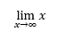

## **مرور کلی**

PowerPoint معادلات را به صورت Office Math Markup Language (OMML) ذخیره می‌کند. با Aspose.Slides برای Python از طریق .NET، می‌توانید همان نوع محتوای ریاضی را به‌صورت برنامه‌نویسی ایجاد کنید: کسرها، رادیکال‌ها، توابع، حدها، عملگرهای N‑ary، ماتریکس‌ها، آرایه‌ها و بلوک‌های ریاضی قالب‌بندی‌شده.

در PowerPoint، کاربران معمولاً معادلات را از **Insert > Equation** اضافه می‌کنند:


نتیجهٔ متن ریاضی قابل ویرایش روی اسلاید است:


Aspose.Slides این متن ریاضی را از طریق سه شیء اصلی می‌سازد:

- یک شکل ریاضی که با [add_math_shape](https://reference.aspose.com/slides/fa/python-net/aspose.slides/shapecollection/add_math_shape/) ایجاد می‌شود، شکل حاوی معادله است.
- [MathPortion](https://reference.aspose.com/slides/fa/python-net/aspose.slides.mathtext/mathportion/) محتوای ریاضی را داخل قاب متن شکل ذخیره می‌کند.
- [MathParagraph](https://reference.aspose.com/slides/fa/python-net/aspose.slides.mathtext/mathparagraph/) یک یا چند شیء [MathBlock](https://reference.aspose.com/slides/fa/python-net/aspose.slides.mathtext/mathblock/) را شامل می‌شود.

اکثر مثال‌های زیر از [MathematicalText](https://reference.aspose.com/slides/fa/python-net/aspose.slides.mathtext/mathematicaltext/) و متدهای fluent از [IMathElement](https://reference.aspose.com/slides/fa/python-net/aspose.slides.mathtext/imathelement/) برای کوتاه و قابل‌خواندن‌بودن کد استفاده می‌کنند.

برای سناریوهای صادرات MathML، به [Export Math Equations from Presentations in Python via .NET](/slides/fa/python-net/exporting-math-equations/) مراجعه کنید.

## **ایجاد معادله**

این مثال یک شکل ریاضی ایجاد می‌کند و قضیهٔ فیثاغورث را اضافه می‌نماید:


```py
import aspose.slides as slides
import aspose.slides.mathtext as math

with slides.Presentation() as presentation:
    slide = presentation.slides[0]

    math_shape = slide.shapes.add_math_shape(20, 20, 700, 120)
    math_paragraph = math_shape.text_frame.paragraphs[0].portions[0].math_paragraph

    equation = (
        math.MathematicalText("c")
        .set_superscript("2")
        .join("=")
        .join(math.MathematicalText("a").set_superscript("2"))
        .join("+")
        .join(math.MathematicalText("b").set_superscript("2"))
    )

    math_paragraph.add(equation)

    presentation.save("pythagorean-theorem.pptx", slides.export.SaveFormat.PPTX)
```

{}

`add_math_shape` شکلی را ایجاد می‌کند که از پیش شامل یک MathParagraph است. به اولین `MathPortion` دسترسی پیدا کنید، `MathParagraph` آن را بگیرید و بلوک‌ها یا عناصر ریاضی را به آن اضافه کنید.

{}

## **افزودن کسرها**

از [`divide`](https://reference.aspose.com/slides/fa/python-net/aspose.slides.mathtext/imathelement/divide/) برای ایجاد یک کسر استفاده کنید. می‌توانید سبک کسر را با [MathFractionTypes](https://reference.aspose.com/slides/fa/python-net/aspose.slides.mathtext/mathfractiontypes/) انتخاب کنید.


```py
import aspose.slides as slides
import aspose.slides.mathtext as math

with slides.Presentation() as presentation:
    slide = presentation.slides[0]

    math_shape = slide.shapes.add_math_shape(20, 20, 700, 100)
    math_paragraph = math_shape.text_frame.paragraphs[0].portions[0].math_paragraph

    fraction = math.MathematicalText("1").divide("x", math.MathFractionTypes.SKEWED)

    math_paragraph.add(math.MathBlock(fraction))

    presentation.save("fraction.pptx", slides.export.SaveFormat.PPTX)
```

برای یک کسر عمودی، از `MathFractionTypes.BAR` استفاده کنید:

```py
stacked_fraction = math.MathematicalText("x + 1").divide("y - 1", math.MathFractionTypes.BAR)
```

## **افزودن رادیکال‌ها**

از [`radical`](https://reference.aspose.com/slides/fa/python-net/aspose.slides.mathtext/imathelement/radical/) برای ایجاد رادیکال درجهٔ دوم، سوم یا سایر رادیکال‌ها استفاده کنید. عنصر جاری پایه می‌شود و آرگومان درجه رادیکال است.


```py
import aspose.slides as slides
import aspose.slides.mathtext as math

with slides.Presentation() as presentation:
    slide = presentation.slides[0]

    math_shape = slide.shapes.add_math_shape(20, 20, 700, 100)
    math_paragraph = math_shape.text_frame.paragraphs[0].portions[0].math_paragraph

    radical = math.MathematicalText("x").radical("n")

    math_paragraph.add(math.MathBlock(radical))

    presentation.save("radical.pptx", slides.export.SaveFormat.PPTX)
```

## **افزودن توابع و حدها**

از [`as_argument_of_function`](https://reference.aspose.com/slides/fa/python-net/aspose.slides.mathtext/imathelement/as_argument_of_function/) یا [`function`](https://reference.aspose.com/slides/fa/python-net/aspose.slides.mathtext/imathelement/function/) برای توابعی مانند `sin(x)`, `log(x)` یا نام توابع سفارشی استفاده کنید. برای حدها، `lim` را در یک [MathLimit](https://reference.aspose.com/slides/fa/python-net/aspose.slides.mathtext/mathlimit/) قرار دهید یا از [`set_lower_limit`](https://reference.aspose.com/slides/fa/python-net/aspose.slides.mathtext/imathelement/set_lower_limit/) استفاده کنید.



```py
import aspose.slides as slides
import aspose.slides.mathtext as math

with slides.Presentation() as presentation:
    slide = presentation.slides[0]

    math_shape = slide.shapes.add_math_shape(20, 20, 700, 100)
    math_paragraph = math_shape.text_frame.paragraphs[0].portions[0].math_paragraph

    limit = (
        math.MathematicalText("lim")
        .set_lower_limit("x\u2192\u221E")
        .function("x")
    )

    math_paragraph.add(math.MathBlock(limit))

    presentation.save("functions-and-limits.pptx", slides.export.SaveFormat.PPTX)
```

برای نام تابع سفارشی، نام تابع را به عنوان عنصر جاری تنظیم کنید:

```py
custom_function = math.MathematicalText("f").function("x + 1")
```

## **افزودن عملگرهای N‑ary و انتگرال‌ها**

از [`nary`](https://reference.aspose.com/slides/fa/python-net/aspose.slides.mathtext/imathelement/nary/) برای جمع‌ها، اتحادها، اشتراک‌ها و سایر عملگرهای بزرگ استفاده کنید. برای انتگرال‌ها از [`integral`](https://reference.aspose.com/slides/fa/python-net/aspose.slides.mathtext/imathelement/integral/) استفاده کنید. هر دو متد امکان تنظیم حدهای پایین و بالا را فراهم می‌کنند.


```py
import aspose.slides as slides
import aspose.slides.mathtext as math

with slides.Presentation() as presentation:
    slide = presentation.slides[0]

    math_shape = slide.shapes.add_math_shape(20, 20, 700, 120)
    math_paragraph = math_shape.text_frame.paragraphs[0].portions[0].math_paragraph

    summation_base = (
        math.MathematicalText("x")
        .set_superscript("k")
        .join(math.MathematicalText("a").set_superscript("n-k"))
    )

    summation = summation_base.nary(math.MathNaryOperatorTypes.SUMMATION, "k=0", "n")

    math_paragraph.add(math.MathBlock(summation))

    presentation.save("nary-operators.pptx", slides.export.SaveFormat.PPTX)
```

عملگرهای N‑ary برای عملگرهای بزرگ با حدهای اختیاری هستند. عملگرهای ساده مانند `+`, `-`, `=` معمولاً به‌عنوان `MathematicalText` اضافه می‌شوند و به عبارت پیوست می‌گردند.

برای یک انتگرال، از `integral` استفاده کنید:

```py
integral_base = math.MathematicalText("x").join(math.MathematicalText("dx").to_box())
integral = integral_base.integral(math.MathIntegralTypes.SIMPLE, "0", "1")
```

## **افزودن ماتریکس‌ها**

از [MathMatrix](https://reference.aspose.com/slides/fa/python-net/aspose.slides.mathtext/mathmatrix/) برای ردیف‌ها و ستون‌ها استفاده کنید. ماتریکس‌ها به‌طور پیش‌فرض پرانتز ندارند، بنابراین هنگام نیاز به پرانتز، کروشه یا آکولاد، ماتریکس را درون آن‌ها بپیچید.


```py
import aspose.slides as slides
import aspose.slides.mathtext as math

with slides.Presentation() as presentation:
    slide = presentation.slides[0]

    math_shape = slide.shapes.add_math_shape(20, 20, 700, 120)
    math_paragraph = math_shape.text_frame.paragraphs[0].portions[0].math_paragraph

    matrix = math.MathMatrix(2, 3)
    matrix[0, 0] = math.MathematicalText("1")
    matrix[0, 1] = math.MathematicalText("x")
    matrix[1, 0] = math.MathematicalText("x")
    matrix[1, 1] = math.MathematicalText("2")
    matrix[1, 2] = math.MathematicalText("y")

    math_paragraph.add(math.MathBlock(matrix))

    presentation.save("matrix.pptx", slides.export.SaveFormat.PPTX)
```

## **افزودن آرایه‌های معادله**

از [`to_math_array`](https://reference.aspose.com/slides/fa/python-net/aspose.slides.mathtext/imathelement/to_math_array/) زمانی که به معادلات هم‌تراز یا یک پشتهٔ عمودی از عبارات نیاز دارید، استفاده کنید.


```py
import aspose.slides as slides
import aspose.slides.mathtext as math

with slides.Presentation() as presentation:
    slide = presentation.slides[0]

    math_shape = slide.shapes.add_math_shape(20, 20, 700, 140)
    math_paragraph = math_shape.text_frame.paragraphs[0].portions[0].math_paragraph

    equation_array = (
        math.MathematicalText("x")
        .join("y")
        .to_math_array()
    )

    math_paragraph.add(math.MathBlock(equation_array))

    presentation.save("equation-array.pptx", slides.export.SaveFormat.PPTX)
```

## **افزودن توابع مثلثاتی**

از [`as_argument_of_function`](https://reference.aspose.com/slides/fa/python-net/aspose.slides.mathtext/imathelement/as_argument_of_function/) وقتی آرگومان عنصر جاری است و نام تابع شناخته‌شده است، استفاده کنید.


```py
import aspose.slides as slides
import aspose.slides.mathtext as math

with slides.Presentation() as presentation:
    slide = presentation.slides[0]

    math_shape = slide.shapes.add_math_shape(20, 20, 700, 100)
    math_paragraph = math_shape.text_frame.paragraphs[0].portions[0].math_paragraph

    cosine = math.MathematicalText("2x").as_argument_of_function(
        math.MathFunctionsOfOneArgument.COS
    )

    math_paragraph.add(math.MathBlock(cosine))

    presentation.save("trigonometric-function.pptx", slides.export.SaveFormat.PPTX)
```

## **افزودن زیرنویس و بالانویس**

از کمکی‌های زیرنویس و بالانویس برای شاخص‌ها و توان‌ها استفاده کنید. وقتی شاخص‌ها باید در سمت چپ پایه ظاهر شوند، از [`set_sub_superscript_on_the_left`](https://reference.aspose.com/slides/fa/python-net/aspose.slides.mathtext/imathelement/set_sub_superscript_on_the_left/) استفاده کنید.


```py
import aspose.slides as slides
import aspose.slides.mathtext as math

with slides.Presentation() as presentation:
    slide = presentation.slides[0]

    math_shape = slide.shapes.add_math_shape(20, 20, 700, 100)
    math_paragraph = math_shape.text_frame.paragraphs[0].portions[0].math_paragraph

    scripts = math.MathematicalText("Y").set_sub_superscript_on_the_left("1", "n")

    math_paragraph.add(math.MathBlock(scripts))

    presentation.save("subscript-superscript.pptx", slides.export.SaveFormat.PPTX)
```

## **افزودن جداسازها**

از [`enclose`](https://reference.aspose.com/slides/fa/python-net/aspose.slides.mathtext/imathelement/enclose/) برای قرار دادن یک عبارت درون جداسازها استفاده کنید. می‌توانید یک کاراکتر جداکننده برای عبارات جداساز که شامل چند عنصر هستند، تنظیم کنید.


```py
import aspose.slides as slides
import aspose.slides.mathtext as math

with slides.Presentation() as presentation:
    slide = presentation.slides[0]

    math_shape = slide.shapes.add_math_shape(20, 20, 700, 100)
    math_paragraph = math_shape.text_frame.paragraphs[0].portions[0].math_paragraph

    delimiter = (
        math.MathematicalText("x")
        .join("y")
        .join("z")
        .enclose("<", ">")
    )
    delimiter.separator_character = "|"

    math_paragraph.add(math.MathBlock(delimiter))

    presentation.save("delimiters.pptx", slides.export.SaveFormat.PPTX)
```

## **افزودن جعبهٔ حاشیه‌دار**

از [`to_border_box`](https://reference.aspose.com/slides/fa/python-net/aspose.slides.mathtext/imathelement/to_border_box/) وقتی معادله باید در یک قاب قرار گیرد، استفاده کنید.


```py
import aspose.slides as slides
import aspose.slides.mathtext as math

with slides.Presentation() as presentation:
    slide = presentation.slides[0]

    math_shape = slide.shapes.add_math_shape(20, 20, 700, 100)
    math_paragraph = math_shape.text_frame.paragraphs[0].portions[0].math_paragraph

    boxed_equation = (
        math.MathematicalText("a")
        .set_superscript("2")
        .join("=")
        .join(math.MathematicalText("b").set_superscript("2"))
        .join("+")
        .join(math.MathematicalText("c").set_superscript("2"))
        .to_border_box()
    )

    math_paragraph.add(math.MathBlock(boxed_equation))

    presentation.save("border-box.pptx", slides.export.SaveFormat.PPTX)
```

## **گروه‌بندی عبارات**

از [`group`](https://reference.aspose.com/slides/fa/python-net/aspose.slides.mathtext/imathelement/group/) برای قرار دادن یک کاراکتر گروه‌بندی فوق یا زیر یک عبارت استفاده کنید. برای برچسب‌گذاری عبارات گروه‌بندی‌شده می‌توانید یک حد اضافه کنید.


```py
import aspose.slides as slides
import aspose.slides.mathtext as math

with slides.Presentation() as presentation:
    slide = presentation.slides[0]

    math_shape = slide.shapes.add_math_shape(20, 20, 700, 120)
    math_paragraph = math_shape.text_frame.paragraphs[0].portions[0].math_paragraph

    grouped = (
        math.MathematicalText("x + y")
        .group(chr(0x23DF), math.MathTopBotPositions.BOTTOM, math.MathTopBotPositions.TOP)
        .set_lower_limit("any text")
    )

    math_paragraph.add(math.MathBlock(grouped))

    presentation.save("grouped-terms.pptx", slides.export.SaveFormat.PPTX)
```

## **فرمت‌دهی به عناصر ریاضی**

از کمکی‌های فرمت‌دهی فقط در جایی استفاده کنید که فرمول را واضح‌تر می‌کند. به عنوان مثال، [`overbar`](https://reference.aspose.com/slides/fa/python-net/aspose.slides.mathtext/imathelement/overbar/) یک خط بالای عنصر ریاضی می‌گذارد.


```py
import aspose.slides as slides
import aspose.slides.mathtext as math

with slides.Presentation() as presentation:
    slide = presentation.slides[0]

    math_shape = slide.shapes.add_math_shape(20, 20, 700, 100)
    math_paragraph = math_shape.text_frame.paragraphs[0].portions[0].math_paragraph

    overbar = math.MathematicalText("ABC").overbar()

    math_paragraph.add(math.MathBlock(overbar))

    presentation.save("overbar.pptx", slides.export.SaveFormat.PPTX)
```

## **مرجع سریع**

| کار | API اصلی |
| --- | --- |
| ایجاد متن ریاضی | [MathematicalText](https://reference.aspose.com/slides/fa/python-net/aspose.slides.mathtext/mathematicaltext/) |
| ترکیب عناصر | [IMathElement.join](https://reference.aspose.com/slides/fa/python-net/aspose.slides.mathtext/imathelement/join/) |
| ایجاد کسرها | [IMathElement.divide](https://reference.aspose.com/slides/fa/python-net/aspose.slides.mathtext/imathelement/divide/) |
| افزودن بالانویس یا زیرنویس | [set_superscript](https://reference.aspose.com/slides/fa/python-net/aspose.slides.mathtext/imathelement/set_superscript/), [set_subscript](https://reference.aspose.com/slides/fa/python-net/aspose.slides.mathtext/imathelement/set_subscript/) |
| افزودن توابع | [function](https://reference.aspose.com/slides/fa/python-net/aspose.slides.mathtext/imathelement/function/), [as_argument_of_function](https://reference.aspose.com/slides/fa/python-net/aspose.slides.mathtext/imathelement/as_argument_of_function/) |
| افزودن رادیکال‌ها | [radical](https://reference.aspose.com/slides/fa/python-net/aspose.slides.mathtext/imathelement/radical/) |
| افزودن حدها | [set_lower_limit](https://reference.aspose.com/slides/fa/python-net/aspose.slides.mathtext/imathelement/set_lower_limit/), [set_upper_limit](https://reference.aspose.com/slides/fa/python-net/aspose.slides.mathtext/imathelement/set_upper_limit/) |
| افزودن اسکریپت‌های سمت چپ | [set_sub_superscript_on_the_left](https://reference.aspose.com/slides/fa/python-net/aspose.slides.mathtext/imathelement/set_sub_superscript_on_the_left/) |
| افزودن جمع‌ها و انتگرال‌ها | [nary](https://reference.aspose.com/slides/fa/python-net/aspose.slides.mathtext/imathelement/nary/), [integral](https://reference.aspose.com/slides/fa/python-net/aspose.slides.mathtext/imathelement/integral/) |
| افزودن ماتریکس‌ها | [MathMatrix](https://reference.aspose.com/slides/fa/python-net/aspose.slides.mathtext/mathmatrix/) |
| افزودن آرایه‌های معادله | [to_math_array](https://reference.aspose.com/slides/fa/python-net/aspose.slides.mathtext/imathelement/to_math_array/) |
| افزودن جداسازها | [enclose](https://reference.aspose.com/slides/fa/python-net/aspose.slides.mathtext/imathelement/enclose/) |
| افزودن نوارها و حاشیه‌ها | [overbar](https://reference.aspose.com/slides/fa/python-net/aspose.slides.mathtext/imathelement/overbar/), [to_border_box](https://reference.aspose.com/slides/fa/python-net/aspose.slides.mathtext/imathelement/to_border_box/) |
| گروه‌بندی عبارات | [group](https://reference.aspose.com/slides/fa/python-net/aspose.slides.mathtext/imathelement/group/) |

## **سؤالات متداول**

**آیا می‌توان معادلهٔ موجود در PowerPoint را ویرایش کرد؟**

بله. ارائه را باز کنید، شکل حاوی `MathPortion` را پیدا کنید، `MathParagraph` آن را بگیرید و بلوک‌های ریاضی در آن پاراگراف را به‌روز کنید.

**آیا معادلات به‌صورت ریاضی قابل ویرایش PowerPoint ذخیره می‌شوند؟**

بله. هنگام ذخیره به PPTX، Aspose.Slides معادله را به‌عنوان محتوای Office Math قابل ویرایش می‌نویسد.

**آیا می‌توان معادلات را به LaTeX صادر کرد؟**

بله. `MathParagraph` معادله را از `MathPortion` دریافت کنید و [MathParagraph.to_latex](https://reference.aspose.com/slides/fa/python-net/aspose.slides.mathtext/mathparagraph/to_latex/) را صدا بزنید تا مستقیماً صادر شود. برای یک مثال کامل، به [Export Math Equations from Presentations in Python via .NET](/slides/fa/python-net/exporting-math-equations/#export-math-equations-to-latex) مراجعه کنید.