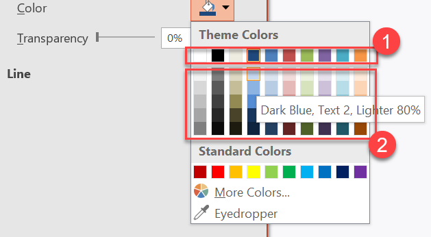

## **مقدمه**

یک تم ارائه مجموعه‌ای هماهنگ از رنگ‌ها، قلم‌ها، سبک‌های پس‌زمینه، پرکننده‌ها، خطوط و افکت‌ها را تعریف می‌کند. اشیای «آگاه از تم» به این تعاریف مشترک ارجاع می‌دهند به‌جای این‌که هر ویژگی بصری را به‌صورت مقدار ثابت ذخیره کنند، بنابراین تغییر تم می‌تواند همزمان چندین شیء را به‌روزرسانی کند.

در Aspose.Slides، تم سطح ارائه از طریق ویژگی [Presentation.master_theme](https://reference.aspose.com/slides/fa/python-net/aspose.slides/presentation/master_theme/) در دسترس است. یک ارائه می‌تواند بازنویسی‌های تم را در سطوح پایین‌تر نیز داشته باشد. یک استاد (master) می‌تواند تم ارائه را از طریق [MasterThemeManager.override_theme](https://reference.aspose.com/slides/fa/python-net/aspose.slides.theme/masterthememanager/override_theme/) بازنویسی کند، یک طرح‌بندی (layout) می‌تواند تم به ارث‌برده خود را از طریق [BaseOverrideThemeManager.override_theme](https://reference.aspose.com/slides/fa/python-net/aspose.slides.theme/baseoverridethememanager/override_theme/) بازنویسی کند، و یک اسلاید منفرد نیز می‌تواند همین کار را انجام دهد. در عمل، تم مؤثر برای یک اسلاید از طریق این زنجیره ارث‌بری حل می‌شود: تم ارائه، بازنویسی استاد، بازنویسی طرح‌بندی، و بازنویسی اسلاید.


بخش‌های زیر رایج‌ترین گردش‌کارهای تم را نشان می‌دهند: بررسی یک تم، تغییر رنگ‌ها و قلم‌ها، کپی یا اعمال یک تم، به‌روزرسانی سبک‌های پس‌زمینه و افکت، و خواندن مقادیر مؤثر پس از حل ارث‌بری و بازنویسی‌ها.

## **بررسی یک تم**

شیء [MasterTheme](https://reference.aspose.com/slides/fa/python-net/aspose.slides.theme/mastertheme/) ویژگی‌های [color_scheme](https://reference.aspose.com/slides/fa/python-net/aspose.slides.theme/mastertheme/color_scheme/)، [font_scheme](https://reference.aspose.com/slides/fa/python-net/aspose.slides.theme/mastertheme/font_scheme/) و [format_scheme](https://reference.aspose.com/slides/fa/python-net/aspose.slides.theme/mastertheme/format_scheme/) تم را در اختیار می‌گیرد. بررسی این مجموعه‌ها پیش از تغییر آن‌ها به‌ویژه وقتی ارائه از منبع خارجی می‌آید مفید است، زیرا تعداد و محتوای ورودی‌های سبک می‌تواند متغیر باشد.

مثال زیر خصوصیات اصلی تم را می‌خواند و تعداد سبک‌های پس‌زمینه، پرکننده، خط و افکت ذخیره‌شده در تم را گزارش می‌دهد:

```python
import aspose.slides as slides

with slides.Presentation("input.pptx") as presentation:
    theme = presentation.master_theme
    print(f"Theme name: {theme.name}")
    print(f"Accent 1: {theme.color_scheme.accent1.color}")
    print(f"Major Latin font: {theme.font_scheme.major.latin_font.font_name}")
    print(f"Minor Latin font: {theme.font_scheme.minor.latin_font.font_name}")
    print(f"Background fill styles: {len(theme.format_scheme.background_fill_styles)}")
    print(f"Fill styles: {len(theme.format_scheme.fill_styles)}")
    print(f"Line styles: {len(theme.format_scheme.line_styles)}")
    print(f"Effect styles: {len(theme.format_scheme.effect_styles)}")
```

اگر فایلی چندین استاد داشته باشد، فرض نکنید که هر اسلاید همان تم مؤثر را دارد. استاد مرتبط با اسلاید را بررسی کنید و از گردش‌کار تم مؤثر که در ادامه مقاله نشان داده شده استفاده کنید زمانی که بازنویسی‌های طرح‌بندی یا اسلاید ممکن است وجود داشته باشد.

## **تغییر رنگ‌های تم**

پرکننده‌ها، خط‌ها و متن‌های «آگاه از تم» می‌توانند به یک رنگ منطقی از شمارش [SchemeColor](https://reference.aspose.com/slides/fa/python-net/aspose.slides/schemecolor/) ارجاع دهند. وقتی ورودی متناظر در [ColorScheme](https://reference.aspose.com/slides/fa/python-net/aspose.slides.theme/colorscheme/) تم را تغییر می‌دهید، تمام اشیایی که هنوز به آن رنگ تم ارجاع می‌دهند، نسبت به مقدار جدید محاسبه می‌شوند. اشیایی که از رنگ RGB مستقیم استفاده می‌کنند، توسط به‌روزرسانی رنگ تم تغییر نمی‌کنند.

مثال انتهای‑به‑انتهای زیر یک شکل ایجاد می‌کند که از `ACCENT4` استفاده می‌کند، رنگ `accent4` تم را به قرمز تغییر می‌دهد، ارائه را ذخیره می‌کند، دوباره باز می‌کند و رنگ پرکننده مؤثر را چاپ می‌کند:

```python
import aspose.pydrawing as draw
import aspose.slides as slides

with slides.Presentation() as presentation:
    slide = presentation.slides[0]
    shape = slide.shapes.add_auto_shape(slides.ShapeType.RECTANGLE, 10, 10, 100, 100)
    shape.fill_format.fill_type = slides.FillType.SOLID
    shape.fill_format.solid_fill_color.scheme_color = slides.SchemeColor.ACCENT4
    presentation.master_theme.color_scheme.accent4.color = draw.Color.red
    presentation.save("theme-color.pptx", slides.export.SaveFormat.PPTX)

with slides.Presentation("theme-color.pptx") as saved_presentation:
    saved_slide = saved_presentation.slides[0]
    saved_shape = saved_slide.shapes[0]
    effective_fill = saved_shape.fill_format.get_effective()
    print(f"Effective fill color: {effective_fill.solid_fill_color}")
```

از آنجا که مستطیل به `ACCENT4` متصل باقی می‌ماند، پس از تغییر تم رنگ قابل مشاهده‌اش قرمز می‌شود. اگر رنگ طرح را مستقیماً روی شکل جایگزین کنید، تغییرات آینده `accent4` دیگر بر آن پرکننده تأثیر نخواهد داشت.

### **استفاده از رنگ‌های پالت افزوده**

PowerPoint با اعمال تبدیل‌های رنگی، انواع روشن‌تر و تیره‌تر را از یک رنگ تم استخراج می‌کند. Aspose.Slides این تبدیل‌ها را از طریق شمارش [ColorTransformOperation](https://reference.aspose.com/slides/fa/python-net/aspose.slides/colortransformoperation/) در دسترس قرار می‌دهد.



**1** - رنگ‌های اصلی تم.  
**2** - انواع روشن‌تر و تیره‌تر تولید شده از رنگ‌های اصلی تم.

مثال زیر شش مستطیل بر پایه `ACCENT4` ایجاد می‌کند، به پنج‌تای آن‌ها تبدیل‌های روشنایی اعمال می‌کند و نتیجه را ذخیره می‌کند:

```python
import aspose.slides as slides

with slides.Presentation() as presentation:
    slide = presentation.slides[0]
    shape1 = slide.shapes.add_auto_shape(slides.ShapeType.RECTANGLE, 10, 10, 50, 50)
    shape1.fill_format.fill_type = slides.FillType.SOLID
    shape1.fill_format.solid_fill_color.scheme_color = slides.SchemeColor.ACCENT4
    shape2 = slide.shapes.add_auto_shape(slides.ShapeType.RECTANGLE, 10, 70, 50, 50)
    shape2.fill_format.fill_type = slides.FillType.SOLID
    shape2.fill_format.solid_fill_color.scheme_color = slides.SchemeColor.ACCENT4
    shape2.fill_format.solid_fill_color.color_transform.add(slides.ColorTransformOperation.MULTIPLY_LUMINANCE, 0.2)
    shape2.fill_format.solid_fill_color.color_transform.add(slides.ColorTransformOperation.ADD_LUMINANCE, 0.8)
    shape3 = slide.shapes.add_auto_shape(slides.ShapeType.RECTANGLE, 10, 130, 50, 50)
    shape3.fill_format.fill_type = slides.FillType.SOLID
    shape3.fill_format.solid_fill_color.scheme_color = slides.SchemeColor.ACCENT4
    shape3.fill_format.solid_fill_color.color_transform.add(slides.ColorTransformOperation.MULTIPLY_LUMINANCE, 0.4)
    shape3.fill_format.solid_fill_color.color_transform.add(slides.ColorTransformOperation.ADD_LUMINANCE, 0.6)
    shape4 = slide.shapes.add_auto_shape(slides.ShapeType.RECTANGLE, 10, 190, 50, 50)
    shape4.fill_format.fill_type = slides.FillType.SOLID
    shape4.fill_format.solid_fill_color.scheme_color = slides.SchemeColor.ACCENT4
    shape4.fill_format.solid_fill_color.color_transform.add(slides.ColorTransformOperation.MULTIPLY_LUMINANCE, 0.6)
    shape4.fill_format.solid_fill_color.color_transform.add(slides.ColorTransformOperation.ADD_LUMINANCE, 0.4)
    shape5 = slide.shapes.add_auto_shape(slides.ShapeType.RECTANGLE, 10, 250, 50, 50)
    shape5.fill_format.fill_type = slides.FillType.SOLID
    shape5.fill_format.solid_fill_color.scheme_color = slides.SchemeColor.ACCENT4
    shape5.fill_format.solid_fill_color.color_transform.add(slides.ColorTransformOperation.MULTIPLY_LUMINANCE, 0.75)
    shape6 = slide.shapes.add_auto_shape(slides.ShapeType.RECTANGLE, 10, 310, 50, 50)
    shape6.fill_format.fill_type = slides.FillType.SOLID
    shape6.fill_format.solid_fill_color.scheme_color = slides.SchemeColor.ACCENT4
    shape6.fill_format.solid_fill_color.color_transform.add(slides.ColorTransformOperation.MULTIPLY_LUMINANCE, 0.5)
    presentation.save("theme-color-palette.pptx", slides.export.SaveFormat.PPTX)
```

این انواع همچنان بر پایه رنگ تم باقی می‌مانند. اگر بعداً `accent4` تغییر کند، رنگ‌های تبدیل‌شده از مقدار جدید `accent4` بازمحاسبه می‌شوند.

### **نقشه‌برداری مقادیر `SchemeColor` به شکاف‌های `ColorScheme`**

شمارش [SchemeColor](https://reference.aspose.com/slides/fa/python-net/aspose.slides/schemecolor/) از `TEXT1`، `BACKGROUND1`، `TEXT2` و `BACKGROUND2` استفاده می‌کند، در حالی که [ColorScheme](https://reference.aspose.com/slides/fa/python-net/aspose.slides.theme/colorscheme/) همان شکاف‌های تم را به‌صورت `dark1`، `light1`، `dark2` و `light2` نشان می‌دهد. نگاشت ثابت است:

* `TEXT1` = `dark1`
* `BACKGROUND1` = `light1`
* `TEXT2` = `dark2`
* `BACKGROUND2` = `light2`

این‌ها نام‌های جایگزین برای همان شکاف‌های تم هستند؛ مقادیری که به‌صورت پویا از یک شکل به شکل دیگر تبدیل می‌شوند، نیستند.

## **تغییر قلم‌های تم**

یک طرح قلم تم شامل یک مجموعه قلم بزرگ برای عناوین و یک مجموعه قلم کوچک برای متن بدنه است. ویژگی‌های [FontScheme.major](https://reference.aspose.com/slides/fa/python-net/aspose.slides.theme/fontscheme/major/) و [FontScheme.minor](https://reference.aspose.com/slides/fa/python-net/aspose.slides.theme/fontscheme/minor/) این مجموعه‌ها را در اختیار می‌گذارند.

شناسه‌های قلم تم سازگار با PowerPoint می‌توانند در قالب‌بندی متن استفاده شوند:

* `+mn‑lt` - قلم بدنه لاتین (Minor Latin Font)
* `+mj‑lt` - قلم عنوان لاتین (Major Latin Font)
* `+mn‑ea` - قلم بدنه شرق آسیا (Minor East Asian Font)
* `+mj‑ea` - قلم عنوان شرق آسیا (Major East Asian Font)

مثال زیر یک عنوان ایجاد می‌کند که از قلم لاتین بزرگ تم استفاده می‌کند و یک خط بدنه که از قلم لاتین کوچک تم استفاده می‌کند. سپس قلم‌های تم را تغییر می‌دهد و نتیجه را ذخیره می‌کند:

```python
import aspose.slides as slides

with slides.Presentation() as presentation:
    slide = presentation.slides[0]
    heading = slide.shapes.add_auto_shape(slides.ShapeType.RECTANGLE, 40, 40, 500, 60)
    heading.text_frame.text = "Theme heading"
    heading.text_frame.paragraphs[0].portions[0].portion_format.latin_font = slides.FontData("+mj-lt")
    body = slide.shapes.add_auto_shape(slides.ShapeType.RECTANGLE, 40, 120, 500, 60)
    body.text_frame.text = "Theme body text"
    body.text_frame.paragraphs[0].portions[0].portion_format.latin_font = slides.FontData("+mn-lt")
    presentation.master_theme.font_scheme.major.latin_font = slides.FontData("Aptos Display")
    presentation.master_theme.font_scheme.minor.latin_font = slides.FontData("Arial")
    presentation.save("theme-fonts.pptx", slides.export.SaveFormat.PPTX)
```

عنوان از قلم بزرگ پیروی می‌کند و متن بدنه از قلم کوچک. متنی که نام قلم صریحی به‌جای شناسه تم داشته باشد، هنگام تغییر طرح قلم تم به‌طور خودکار تغییر نمی‌کند.

مجموعه‌های قلم بزرگ و کوچک می‌توانند شامل نگاشت‌های قلم برای سیستم‌های نوشتاری خاصی مانند سیریلیک، عربی، ژاپنی، گرجی و ثان باشند. برای بررسی، افزودن، جایگزین یا حذف این نگاشت‌ها، به [Script‑Specific Theme Fonts](/slides/fa/python-net/script-specific-font-mappings/) مراجعه کنید.

{}
برای اطلاعات بیشتر درباره قلم‌های ارائه، به [PowerPoint Fonts](/slides/fa/python-net/powerpoint-fonts/) نگاه کنید.
{}

## **کپی یا اعمال یک تم**

گردش‌کارهای زیر به مشکلات مختلف مرتبط با تم پاسخ می‌دهند.

### **اعمال تم خارجی به اسلایدهای وابسته به یک استاد**

از [IMasterSlide.apply_external_theme_to_depending_slides](https://reference.aspose.com/slides/fa/python-net/aspose.slides/imasterslide/apply_external_theme_to_depending_slides/) زمانی استفاده کنید که فایل تم PowerPoint (`.thmx`) داشته باشید و بخواهید تمام اسلایدهایی که به یک استاد خاص وابسته‌اند را بازطراحی کنید. استاد موردنظر را از مجموعه [Presentation.masters](https://reference.aspose.com/slides/fa/python-net/aspose.slides/presentation/masters/) که پیاده‌ساز [MasterSlideCollection](https://reference.aspose.com/slides/fa/python-net/aspose.slides/masterslidecollection/) است، انتخاب کنید و مسیر فایل تم را به متد پاس دهید.

این متد عملیات زیر را انجام می‌دهد:

1. یک اسلاید استاد جدید بر پایه استاد انتخاب‌شده ایجاد می‌کند.  
1. تم خارجی را بر روی استاد جدید اعمال می‌کند.  
1. استاد جدید را به تمام اسلایدهایی که پیش‌تر به استاد انتخاب‌شده وابسته بودند اختصاص می‌دهد.  
1. شیء جدید [IMasterSlide](https://reference.aspose.com/slides/fa/python-net/aspose.slides/imasterslide/) را برمی‌گرداند.

مثال زیر تم خارجی را بر اسلایدهایی که به اولین استاد وابسته‌اند اعمال می‌کند و ارائه را ذخیره می‌نماید:

```python
import aspose.slides as slides

with slides.Presentation("presentation.pptx") as presentation:
    selected_master = presentation.masters[0]
    themed_master = selected_master.apply_external_theme_to_depending_slides("corporate-theme.thmx")

    print(f"Created master: {themed_master.name}")
    presentation.save("presentation-with-external-theme.pptx", slides.export.SaveFormat.PPTX)
```

یک تم نامعتبر، خراب یا غیرپشتیبانی‌شده می‌تواند استثنای [PptxException](https://reference.aspose.com/slides/fa/python-net/aspose.slides/pptxexception/) یا یکی از زیرکلاس‌های مرتبط با قالب را ایجاد کند. مسیرهای ورودی کاربر را اعتبارسنجی کنید، خطاهای دسترسی به سیستم فایل را مدیریت کنید و پس از اعمال موفق تم، ارائه را ذخیره نمایید.

فقط اسلایدهایی که به استاد انتخاب‌شده وابسته بودند بازتخصیص می‌یابند. اسلایدهای مرتبط با دیگر اساتید، اساتید و تم‌های فعلی خود را حفظ می‌کنند. رنگ‌ها، قلم‌ها، پرکننده‌ها، خطوط، پس‌زمینه و افکت‌های «آگاه از تم» بر مبنای تم خارجی محاسبه می‌شوند. رنگ‌ها، قلم‌ها، پرکننده‌ها و قالب‌بندی‌های صریحی که به‌صورت مستقیم اختصاص داده شده‌اند ممکن است بدون تغییر باقی بمانند. بازنویسی‌های سطح طرح‌بندی و اسلاید هم می‌توانند بر مقادیر ارث‌برده از استاد جدید اولویت داشته باشند.

تم می‌تواند قلم‌هایی را ارجاع دهد که در محیط اجرای فعلی موجود نیستند. برای رندر و خروجی سازگار، قلم‌های موردنیاز را نصب کنید، از [منابع قلم سفارشی](/slides/fa/python-net/custom-font/) استفاده کنید یا [جایگزینی قلم](/slides/fa/python-net/font-substitution/) را پیکربندی نمایید.

این یک گردش‌کار مستقیم در سطح استاد است: متد مسیر فایل `.thmx` را می‌گیرد و نیازی به ایجاد بازنویسی‌های سطح اسلاید یا طرح‌بندی به‌صورت دستی نیست.

### **اعمال تم‌های خارجی متفاوت در ارائه چند‑استادی**

زمانی که استاد مربوطه پیش‌ازپیش شناخته نشده باشد، آن را از یک اسلاید نماینده از طریق [Slide.layout_slide](https://reference.aspose.com/slides/fa/python-net/aspose.slides/slide/layout_slide/) و [LayoutSlide.master_slide](https://reference.aspose.com/slides/fa/python-net/aspose.slides/layoutslide/master_slide/) به‌دست آورید. مراجع استاد اصلی را پیش از اعمال هر تمی ذخیره کنید زیرا هر فراخوانی یک استاد دیگر در ارائه می‌سازد.

مثال زیر اسلایدهای دو بخش را برای یافتن اساتیدشان استفاده می‌کند و تم خارجی متفاوتی را برای هر گروه اعمال می‌کند:

```python
import aspose.slides as slides

with slides.Presentation("multi-master-presentation.pptx") as presentation:
    if len(presentation.slides) < 5:
        print("The presentation does not contain the expected representative slides.")
    else:
        first_group_master = presentation.slides[0].layout_slide.master_slide
        second_group_master = presentation.slides[4].layout_slide.master_slide

        if first_group_master.slide_id == second_group_master.slide_id:
            print("The representative slides use the same master.")
        else:
            first_themed_master = first_group_master.apply_external_theme_to_depending_slides("blue-theme.thmx")
            second_themed_master = second_group_master.apply_external_theme_to_depending_slides("green-theme.thmx")

            print(f"First themed master: {first_themed_master.name}")
            print(f"Second themed master: {second_themed_master.name}")
            presentation.save("multi-master-with-external-themes.pptx", slides.export.SaveFormat.PPTX)
```

فراخوانی اول فقط اسلایدهایی که به `first_group_master` وابسته‌اند را تحت تأثیر قرار می‌دهد و فراخوانی دوم فقط اسلایدهایی که به `second_group_master` وابسته‌اند را تحت تأثیر می‌گذارد. اسلایدهای متعلق به سایر اساتید بازطراحی نمی‌شوند.

### **حفظ تم منبع هنگام جابجایی اسلایدها**

اگر می‌خواهید اسلایدی را به ارائه‌ای دیگر منتقل کنید و طراحی اصلی آن را حفظ کنید، استاد منبع را با استفاده از [MasterSlideCollection.add_clone](https://reference.aspose.com/slides/fa/python-net/aspose.slides/masterslidecollection/add_clone/) به ارائه مقصد اضافه کنید، سپس اسلاید را با [SlideCollection.add_clone](https://reference.aspose.com/slides/fa/python-net/aspose.slides/slidecollection/add_clone/) و استاد کلون‌شده کپی کنید. این کار استاد، طرح‌بندی‌هایش و تم مرتبط را با هم منتقل می‌کند.

```python
import aspose.slides as slides

with slides.Presentation("source-theme.pptx") as source:
    with slides.Presentation("target.pptx") as target:
        source_slide = source.slides[0]
        source_master = source_slide.layout_slide.master_slide
        cloned_master = target.masters.add_clone(source_master)
        target.slides.add_clone(source_slide, cloned_master, True)
        target.save("theme-preserved.pptx", slides.export.SaveFormat.PPTX)
```

این گردش‌کار ترجیحی است وقتی اسلاید منبع باید ظاهر یکسانی در مقصد داشته باشد. فقط کپی محتوا روی استادی نامرتبط می‌تواند رنگ‌ها، قلم‌ها، پس‌زمینه و افکت‌های مبتنی بر تم را تغییر دهد.

### **اعمال مقادیر تم به اسلاید موجود**

اگر اسلاید هدف باید روی استاد و طرح‌بندی فعلی خود بماند، یک بازنویسی سطح اسلاید را از تم منبع مقداردهی اولیه کنید. روش‌های [OverrideTheme.init_color_scheme_from](https://reference.aspose.com/slides/fa/python-net/aspose.slides.theme/overridetheme/init_color_scheme_from/)، [OverrideTheme.init_font_scheme_from](https://reference.aspose.com/slides/fa/python-net/aspose.slides.theme/overridetheme/init_font_scheme_from/) و [OverrideTheme.init_format_scheme_from](https://reference.aspose.com/slides/fa/python-net/aspose.slides.theme/overridetheme/init_format_scheme_from/) سه مؤلفه اصلی تم را به بازنویسی کپی می‌کنند.

```python
import aspose.slides as slides

with slides.Presentation("source-theme.pptx") as source:
    with slides.Presentation("target.pptx") as target:
        target_slide = target.slides[0]
        override_theme = target_slide.theme_manager.override_theme
        override_theme.init_color_scheme_from(source.master_theme.color_scheme)
        override_theme.init_font_scheme_from(source.master_theme.font_scheme)
        override_theme.init_format_scheme_from(source.master_theme.format_scheme)
        target.save("theme-applied-to-slide.pptx", slides.export.SaveFormat.PPTX)
```

این کار تم مورد استفاده در آن اسلاید را بدون تغییر تم ارث‌برده توسط اسلایدهای دیگر تغییر می‌دهد. برای حذف بازنویسی محلی و بازگشت به مقادیر ارث‌برده، متد [OverrideTheme.clear](https://reference.aspose.com/slides/fa/python-net/aspose.slides.theme/overridetheme/clear/) را فراخوانی کنید.

### **اعمال بازنویسی تم به یک طرح‌بندی**

یک بازنویسی سطح طرح‌بندی برای اسلایدهایی که از آن طرح‌بندی استفاده می‌کنند اعمال می‌شود مگر اینکه اسلاید خاصی بازنویسی خود را داشته باشد. همان روش‌های مقداردهی اولیه می‌توانند از طریق [LayoutSlideThemeManager](https://reference.aspose.com/slides/fa/python-net/aspose.slides.theme/layoutslidethememanager/) طرح‌بندی استفاده شوند:

```python
import aspose.slides as slides

with slides.Presentation("source-theme.pptx") as source:
    with slides.Presentation("target.pptx") as target:
        target_slide = target.slides[0]
        override_theme = target_slide.layout_slide.theme_manager.override_theme
        override_theme.init_color_scheme_from(source.master_theme.color_scheme)
        override_theme.init_font_scheme_from(source.master_theme.font_scheme)
        override_theme.init_format_scheme_from(source.master_theme.format_scheme)
        target.save("theme-applied-to-layout.pptx", slides.export.SaveFormat.PPTX)
```

هنگامی که بسیاری از طرح‌بندی‌ها و اسلایدها باید طراحی پایه یکسانی داشته باشند، از تم سطح استاد یا ارائه استفاده کنید؛ برای یک خانواده از طرح‌بندی‌ها که نیاز به سبک متفاوتی دارند، از بازنویسی طرح‌بندی استفاده کنید؛ و برای استثناهای واقعی تنها از بازنویسی اسلاید استفاده کنید. استفاده بیش از حد از بازنویسی‌های سطح اسلاید، تغییرات تم سراسری بعدی را پیش‌بینی‌پذیرتر می‌کند.

## **به‌روزرسانی سبک‌های پس‌زمینه تم**

پرکننده‌های پس‌زمینه تم در [FormatScheme.background_fill_styles](https://reference.aspose.com/slides/fa/python-net/aspose.slides.theme/formatscheme/background_fill_styles/) ذخیره می‌شوند. PowerPoint می‌تواند گزینه‌های پس‌زمینه بیشتری در رابط کاربری خود نشان دهد نسبت به تعداد تعریف‌های پرکننده‌ای که فیزیکی در این مجموعه ذخیره شده‌اند زیرا رابط می‌تواند پرکننده‌های تم را با رنگ‌های تم و سایر مراجع سبک ترکیب کند.


قبل از استفاده از یک سبک پس‌زمینه، مجموعه ذخیره‌شده و [Background.style_index](https://reference.aspose.com/slides/fa/python-net/aspose.slides/background/style_index/) فعلی را بررسی کنید. `style_index` مقدار `0` را برای عدم وجود پرکننده تم استفاده می‌کند؛ مقادیر مثبت ارجاع‌های سبک پس‌زمینه تم هستند. این با ایندکس‌گذاری مستقیم یک مجموعه پایتون متفاوت است، جایی که `[0]` اولین جسم ذخیره‌شده را نشان می‌دهد. فرض نکنید که هر ارائه همان تعداد سبک پرکننده پس‌زمینه را دارد.

مثال زیر تعداد پرکننده‌های پس‌زمینه موجود را گزارش می‌دهد، یک مرجع پس‌زمینه تم به اولین استاد اختصاص می‌دهد و ارائه را ذخیره می‌کند:

```python
import aspose.slides as slides

with slides.Presentation("input.pptx") as presentation:
    background_styles = presentation.master_theme.format_scheme.background_fill_styles
    print(f"Background fill styles: {len(background_styles)}")
    if len(background_styles) == 0:
        raise RuntimeError("The presentation theme does not contain background fill styles.")
    master_slide = presentation.masters[0]
    master_slide.background.type = slides.BackgroundType.THEMED
    master_slide.background.style_index = 1
    presentation.save("theme-background.pptx", slides.export.SaveFormat.PPTX)
```

نتیجهٔ قابل مشاهده به ورودی تم مرجع شده توسط استاد و هر بازنویسی پس‌زمینه در سطح طرح‌بندی یا اسلاید بستگی دارد. اگر اسلاید پس‌زمینهٔ خود را داشته باشد، تغییر فقط پس‌زمینهٔ استاد ممکن است بر آن اسلاید تأثیر نگذارد. برای دانستن پس‌زمینهٔ نهایی پس از اعمال ارث‌بری، از [Background.get_effective](https://reference.aspose.com/slides/fa/python-net/aspose.slides/background/get_effective/) استفاده کنید.

{}
`style_index` را به‌عنوان ایندکس صفر‑پایهٔ یک مجموعه در نظر نگیرید. همچنین از کدنویسی سخت‌کد یک عدد سبک از یک فایل و فرض یک ظاهر مشابه در فایل دیگر خودداری کنید؛ تعاریف سبک تم مخصوص همان ارائه هستند.
{}

{}
برای قالب‌بندی مستقیم پس‌زمینه و ارث‌بری پس‌زمینه، به [Presentation Background](/slides/fa/python-net/presentation-background/) مراجعه کنید.
{}

## **به‌روزرسانی افکت‌های تم**

یک طرح‌بندی فرمت تم شامل مجموعه‌های جداگانهٔ [FormatScheme.fill_styles](https://reference.aspose.com/slides/fa/python-net/aspose.slides.theme/formatscheme/fill_styles/)، [FormatScheme.line_styles](https://reference.aspose.com/slides/fa/python-net/aspose.slides.theme/formatscheme/line_styles/) و [FormatScheme.effect_styles](https://reference.aspose.com/slides/fa/python-net/aspose.slides.theme/formatscheme/effect_styles/) است. تم‌های اداری معمولاً سه ورودی سبک اصلی دارند که از نظر بصری به ترتیب «ملایم»، «متوسط» و «قوی» ظاهر می‌شوند، اما کد باید هر مجموعه را بررسی کند و نه اینکه تعداد ثابت فرض کند.


هنگامی که این مجموعه‌ها را در پایتون دسترسی می‌گیرید، ایندکس مجموعه صفر‑پایه است: `[0]` اولین سبک ذخیره‌شده و `[2]` سومین است. ایندکس‌های مرجع سبک یک شکل مفهوم جداگانه‌ای است که از طریق [IShapeStyle](https://reference.aspose.com/slides/fa/python-net/aspose.slides/ishapestyle/) در دسترس است. تغییر یک سبک تم بر اشکالی که آن سبک تم را ارجاع می‌دهند اثر می‌گذارد؛ اشکالی که به‌صورت مستقیم قالب‌بندی شده‌اند ممکن است بدون تغییر بمانند.

مثال زیر وجود ورودی‌های سبک موردنیاز را بررسی می‌کند، اولین سبک خطی را تغییر می‌دهد، سومین سبک پرکننده را تغییر می‌دهد، یک سایهٔ خارجی را در سومین سبک افکت فعال می‌کند و نتیجه را ذخیره می‌نماید:

```python
import aspose.pydrawing as draw
import aspose.slides as slides

with slides.Presentation("Subtle_Moderate_Intense.pptx") as presentation:
    format_scheme = presentation.master_theme.format_scheme
    if len(format_scheme.line_styles) < 1 or len(format_scheme.fill_styles) < 3 or len(format_scheme.effect_styles) < 3:
        raise RuntimeError("The theme does not contain the style entries required by this example.")
    format_scheme.line_styles[0].fill_format.fill_type = slides.FillType.SOLID
    format_scheme.line_styles[0].fill_format.solid_fill_color.color = draw.Color.red
    format_scheme.fill_styles[2].fill_type = slides.FillType.SOLID
    format_scheme.fill_styles[2].solid_fill_color.color = draw.Color.forest_green
    format_scheme.effect_styles[2].effect_format.enable_outer_shadow_effect()
    format_scheme.effect_styles[2].effect_format.outer_shadow_effect.distance = 10
    presentation.save("theme-effects.pptx", slides.export.SaveFormat.PPTX)
```

برای اشکالی که این شکاف‌ها را ارجاع می‌دهند، اولین سبک خط تم قرمز می‌شود، سومین سبک پرکننده تم به‌صورت سبز جنگلی جامد می‌شود و سومین سبک افکت یک سایهٔ خارجی با فاصلهٔ ۱۰ امتیاز اضافه می‌کند. نتیجهٔ بصری دقیق همچنان به این‌که هر شکل چه شکافی را ارجاع می‌دهد و آیا قالب‌بندی مستقیم آن را بازنویسی می‌کند، وابسته است.


## **تشخیص اینکه آیا یک پرکنندهٔ ثابت مؤثر از رنگ تم استفاده می‌کند**

یک پرکننده می‌تواند به‌صورت مستقیم روی شیء ذخیره شود یا از یک پاراگراف، طرح‌بندی، استاد، سبک تم یا سطح قالب‌بندی دیگری ارث‌برده شود. برای حل این سلسله مراتب به یک شیٔ [IFillFormatEffectiveData](https://reference.aspose.com/slides/fa/python-net/aspose.slides/ifillformateffectivedata/) غیرقابل تغییر، متد [FillFormat.get_effective](https://reference.aspose.com/slides/fa/python-net/aspose.slides/fillformat/get_effective/) را فراخوانی کنید. ابتدا [IFillFormatEffectiveData.fill_type](https://reference.aspose.com/slides/fa/python-net/aspose.slides/ifillformateffectivedata/fill_type/) را بررسی کنید. فقط وقتی مقدار آن `FillType.SOLID` باشد، باید ویژگی‌های پرکنندهٔ ثابت را بخوانید.

برای یک پرکنندهٔ ثابت، [IFillFormatEffectiveData.solid_fill_color](https://reference.aspose.com/slides/fa/python-net/aspose.slides/ifillformateffectivedata/solid_fill_color/) مقدار نهایی RGB پس از ارث‌بری، جستجوی تم و اعمال تبدیل‌های رنگی را بر می‌گرداند. [IFillFormatEffectiveData.solid_fill_scheme_color](https://reference.aspose.com/slides/fa/python-net/aspose.slides/ifillformateffectivedata/solid_fill_scheme_color/) اسلات منطقی [SchemeColor](https://reference.aspose.com/slides/fa/python-net/aspose.slides/schemecolor/) مربوطه، مانند `TEXT1` یا `ACCENT6` را بر می‌گرداند. مقدار `SchemeColor.NOT_DEFINED` به این معنی است که پرکنندهٔ ثابت مؤثر بر پایهٔ رنگ اسکیم نیست. در گردش‌کاری که پرکننده‌ها یا تم هستند یا رنگ‌های مستقیم RGB، این مقدار یک پرکنندهٔ RGB مستقیم را شناسایی می‌کند.

از مقدار محلی [IColorFormat.scheme_color](https://reference.aspose.com/slides/fa/python-net/aspose.slides/icolorformat/scheme_color/) به‌تنهایی برای رده‌بندی پرکننده استفاده نکنید. برای مثال، یک بخش متن می‌تواند اسکیم رنگ محلی تعریف نشده داشته باشد، در حالی که پرکنندهٔ مؤثر آن یک رنگ تم ارث‌برده است و به `TEXT1` یا `ACCENT6` حل می‌شود. برعکس، `solid_fill_scheme_color` به شما می‌گوید کدام اسلات منطقی تم رنگ نهایی را تولید کرده، اما نمی‌گوید این اسلات از شیء، پاراگراف، طرح‌بندی، استاد یا سطح دیگری از سلسله مراتب آمده است.

مثال زیر یک ارائه را بارگیری می‌کند، پرکننده‌های اشکال و بخش‌های متنی را بررسی می‌کند، هر مقدار نهایی RGB و اسکیم رنگ مرتبط را چاپ می‌کند و پرکننده‌های ثابت که تغییر رنگ تم را دنبال نمی‌کنند، علامت‌گذاری می‌کند:

```python
import aspose.slides as slides


def audit_fill(object_name, local_fill):
    effective_fill = local_fill.get_effective()

    if effective_fill.fill_type != slides.FillType.SOLID:
        print(f"{object_name}: fill type = {effective_fill.fill_type}; not a solid fill.")
        return

    rgb = effective_fill.solid_fill_color
    effective_scheme_color = effective_fill.solid_fill_scheme_color
    local_scheme_color = local_fill.solid_fill_color.scheme_color

    print(f"{object_name}: RGB = #{rgb.r:02X}{rgb.g:02X}{rgb.b:02X}")
    print(f"{object_name}: local scheme = {local_scheme_color}, effective scheme = {effective_scheme_color}")

    if effective_scheme_color == slides.SchemeColor.NOT_DEFINED:
        print(f"{object_name}: direct RGB or another non-scheme fill; audit as theme-independent.")
    else:
        print(f"{object_name}: theme-dependent through {effective_scheme_color}.")


with slides.Presentation("input.pptx") as presentation:
    for slide_index, slide in enumerate(presentation.slides):
        for shape_index, shape in enumerate(slide.shapes):
            shape_name = f"Slide {slide_index + 1}, shape {shape_index + 1}"
            audit_fill(shape_name, shape.fill_format)

            if isinstance(shape, slides.AutoShape):
                for paragraph_index, paragraph in enumerate(shape.text_frame.paragraphs):
                    for portion_index, portion in enumerate(paragraph.portions):
                        portion_name = f"{shape_name}, paragraph {paragraph_index + 1}, portion {portion_index + 1}"
                        audit_fill(portion_name, portion.portion_format.fill_format)
```

شاخهٔ `NOT_DEFINED` فهرستی از پرکننده‌های ثابت که به‌روزرسانی‌های اسلات رنگ تم را واکنش نمی‌دهند، فراهم می‌آورد. هنگام نیاز به پیروی یک ارائه از پالت جدید برند، این اشیا را مرور کنید. مقدار RGB گزارش‌شده هنوز ظاهر فعلی را نشان می‌دهد، در حالی که مقدار اسکیم بیان می‌کند آیا آن ظاهر مرتبط با تم است.

اشیای مؤثر‑قالب یک تصویر ثابت هستند. پس از تغییر تم ارائه، یک بازنویسی تم یا هر قالب‌بندی ارث‌برده، دوباره `get_effective` را فراخوانی کنید و شیٔ جدید `IFillFormatEffectiveData` را بخوانید قبل از مقایسه یا گزارش رنگ‌ها.

## **خواندن مقادیر مؤثر تم**

اشیای خام تم آنچه در سطح خاصی تعریف شده را نشان می‌دهند. مقادیر مؤثر آنچه یک اسلاید یا شکل پس از حل ارث‌بری و بازنویسی‌های محلی استفاده می‌کند، نشان می‌دهد. برای یک اسلاید، متد [BaseOverrideThemeManager.create_theme_effective](https://reference.aspose.com/slides/fa/python-net/aspose.slides.theme/baseoverridethememanager/create_theme_effective/) را صدا بزنید. برای پس‌زمینه، از [Background.get_effective](https://reference.aspose.com/slides/fa/python-net/aspose.slides/background/get_effective/) استفاده کنید و برای پرکننده، از [FillFormat.get_effective](https://reference.aspose.com/slides/fa/python-net/aspose.slides/fillformat/get_effective/) بهره ببرید.

مثال زیر تم مؤثر، پس‌زمینه و اولین پرکنندهٔ شکل را از یک اسلاید می‌خواند:

```python
import aspose.slides as slides

with slides.Presentation("input.pptx") as presentation:
    slide = presentation.slides[0]
    effective_theme = slide.theme_manager.create_theme_effective()
    effective_background = slide.background.get_effective()
    print(f"Effective major Latin font: {effective_theme.font_scheme.major.latin_font.font_name}")
    print(f"Effective minor Latin font: {effective_theme.font_scheme.minor.latin_font.font_name}")
    print(f"Effective background fill type: {effective_background.fill_format.fill_type}")
    if len(slide.shapes) > 0:
        effective_fill = slide.shapes[0].fill_format.get_effective()
        print(f"First shape effective fill type: {effective_fill.fill_type}")
        if effective_fill.fill_type == slides.FillType.SOLID:
            print(f"First shape effective fill color: {effective_fill.solid_fill_color}")
```

از داده‌های مؤثر برای عیب‌یابی رندر، اعتبارسنجی و مقایسه استفاده کنید. اگر فقط [Presentation.master_theme](https://reference.aspose.com/slides/fa/python-net/aspose.slides/presentation/master_theme/) را بررسی کنید، ممکن است بازنویسی‌های استاد، طرح‌بندی، اسلاید یا شکل که ظاهر نهایی را تغییر می‌دهند، از دست بدهید.

## **پرسش‌های متداول**

**آیا اعمال یک تم خارجی بر تمام اسلایدهای ارائه تأثیر می‌گذارد؟**

خیر. متد [IMasterSlide.apply_external_theme_to_depending_slides](https://reference.aspose.com/slides/fa/python-net/aspose.slides/imasterslide/apply_external_theme_to_depending_slides/) فقط اسلایدهایی را که به استاد انتخاب‌شده وابسته‌اند، بازتخصیص می‌دهد. اسلایدهایی که از اساتید دیگر استفاده می‌کنند تم‌های فعلی خود را حفظ می‌کنند.

**آیا می‌توانم تم را فقط به یک اسلاید اعمال کنم بدون تغییر استاد؟**

بله. از [SlideThemeManager](https://reference.aspose.com/slides/fa/python-net/aspose.slides.theme/slidethememanager/) اسلاید استفاده کنید و بازنویسی تم آن را مقداردهی اولیه کنید. تغییر محلی به آن اسلاید می‌ماند؛ سایر اسلایدها همچنان تم‌های موجود خود را ارث می‌برند.

**ایمن‌ترین روش برای انتقال تم از یک ارائه به ارائهٔ دیگر چیست؟**

هنگامی که اسلایدی را منتقل می‌کنید و می‌خواهید ظاهر منبع را حفظ کنید، استاد منبع را به مقصد کلون کنید و اسلاید را با استفاده از [MasterSlideCollection.add_clone](https://reference.aspose.com/slides/fa/python-net/aspose.slides/masterslidecollection/add_clone/) و [SlideCollection.add_clone](https://reference.aspose.com/slides/fa/python-net/aspose.slides/slidecollection/add_clone/) آن استاد کلون‌شده کپی کنید. این کار استاد، طرح‌بندی‌ها و تم را همراه هم نگه می‌دارد.

**چگونه می‌توانم مقادیر مؤثر پس از ارث‌بری و بازنویسی‌ها را ببینم؟**

از [BaseOverrideThemeManager.create_theme_effective](https://reference.aspose.com/slides/fa/python-net/aspose.slides.theme/baseoverridethememanager/create_theme_effective/) برای یک اسلاید یا تم طرح‌بندی و روش‌های داده‑مؤثر مربوطه برای اشیای فرمت مانند [Background.get_effective](https://reference.aspose.com/slides/fa/python-net/aspose.slides/background/get_effective/) و [FillFormat.get_effective](https://reference.aspose.com/slides/fa/python-net/aspose.slides/fillformat/get_effective/) استفاده کنید. این APIها مقادیر حل‌شده پس از اعمال ارث‌بری و بازنویسی‌ها را برمی‌گردانند.