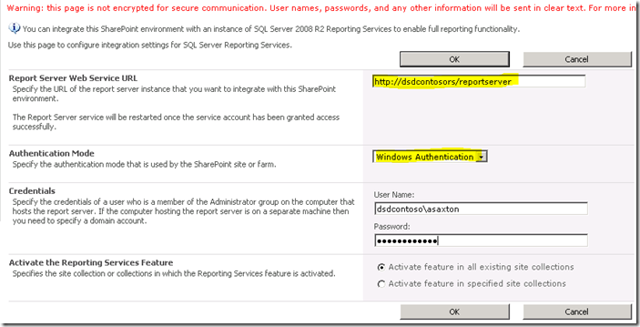
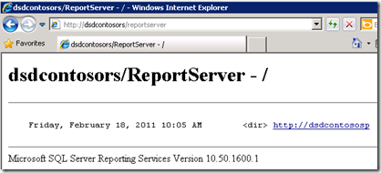

{} 

اکنون که SharePoint روی سرور RS نصب و پیکربندی شده و RS از طریق Reporting Services Configuration Manager تنظیم شده است، می‌توانیم به پیکربندی در Central Admin بپردازیم. RS 2008 R2 این فرآیند را به‌طرز چشمگیری ساده کرده است. پیش از این برای فعال‌سازی آن باید یک فرآیند سه‌مرحله‌ای را انجام می‌دادید. اکنون تنها یک مرحله کافی است. 

ما می‌خواهیم به وب‌سایت Central Administrator رفته و سپس به General Application Settings برویم. در انتهای صفحه گزینه Reporting Services را خواهیم دید. 

{} 

**Figure 17**: پیکربندی SharePoint 

{} 

روی « **Reporting Services Integration** » کلیک کنید. 

{} 
## **URL سرویس وب**
آدرس Report Server را که در Reporting Services Configuration Manager یافتیم، وارد می‌کنیم. 
## **حالت احراز هویت**
یک حالت احراز هویت نیز انتخاب می‌کنیم. لینک زیر به‌صورت جزئیاتی درباره این حالت‌ها توضیح می‌دهد. 
[نمای کلی امنیت برای Reporting Services در حالت یکپارچه‌سازی با SharePoint](https://docs.microsoft.com/en-us/previous-versions/sql/sql-server-2008-r2/bb283324(v=sql.105)) 

به‌طور خلاصه، اگر سایت شما از **Claims Authentication** استفاده می‌کند، همیشه از Trusted Authentication استفاده خواهید کرد بدون توجه به انتخاب شما در اینجا. اگر می‌خواهید اعتبارهای ویندوز را انتقال دهید، باید Windows Authentication را انتخاب کنید. برای Trusted Authentication، توکن SPUser را منتقل می‌کنیم و به اعتبارهای ویندوز وابسته نیستیم. 

اگر سایت‌های Classic Mode خود را برای NTLM پیکربندی کرده‌اید و RS برای NTLM تنظیم شده باشد، باید از Trusted Authentication استفاده کنید. استفاده از Windows Authentication و انتقال آن به منبع داده، نیاز به Kerberos دارد. 

**Figure 18**: تنظیم اعتبارهای Reporting Services Integration
## **فعال‌سازی ویژگی**
این گزینه امکان فعال‌سازی Reporting Services را برای تمام مجموعه‌های سایت یا فقط برای مجموعه‌های دلخواه شما فراهم می‌کند. به‌عبارت دیگر، تعیین می‌کند کدام سایت‌ها می‌توانند از Reporting Services استفاده کنند. پس از اتمام، شکل زیر را می‌بینید. 

**Figure 19**: یکپارچه‌سازی موفقیت‌آمیز Reporting Services با محیط SharePoint 

با بازگشت به آدرس Report Server که در شکل 14 نشان داده شده، باید چیزی مشابه شکل زیر را مشاهده کنید. 

**Figure 20**: تأیید موفقیت‌آمیز Reporting Services با محیط SharePoint 

{} 

اگر سایت SharePoint شما برای SSL پیکربندی شده باشد، در این فهرست نمایش داده نمی‌شود. این یک مشکل شناخته‌شده است و به معنای وجود خطا نیست. گزارش‌های شما همچنان باید کار کنند. 

{} 

اکنون آماده استفاده از Reporting Services در SharePoint 2010 هستیم. همانند نسخه قبلی، یک ویژگی (که هنگام پیکربندی Reporting Services Integration فعال می‌شود) در «Site Collection Feature» وجود دارد. همچنین نصب ۳ نوع محتوا را به سایت اضافه می‌کند. در شکل 21 می‌توان دو نوع محتوا را در کتابخانه سند اضافه کرد تا گزارش سفارشی ایجاد شود، همان‌طور که در شکل 21 مشاهده می‌شود. 

**Figure 21**: Report Builder 

« **Reporter Builder** » یک ActiveX است که باید روی سرور دانلود شود، همان‌طور که در شکل 22 نشان داده شده است. 

**Figure 22**: دانلود و نصب Report Builder 

پس از اتمام دانلود، **«Report Builder»** را اجرا کنید. حالا آماده طراحی اولین گزارش خود هستید، همان‌طور که در شکل 23 می‌بینید. 

**Figure 23**: ویزارد ایجاد گزارش جدید در Report Builder 

پس از ایجاد گزارش می‌توانید آن را در کتابخانه سندی که برای ذخیره گزارش‌ها در SharePoint 2010 ایجاد شده ذخیره کنید. 

نوع محتوا دیگری باید برای ایجاد اتصال مشترک به عنوان منبع داده استفاده شود و در یک کتابخانه سند در SharePoint ذخیره گردد. می‌توان یک کتابخانه سند ایجاد کرد، این نوع محتوا را به آن اضافه کرد و سپس اتصال‌های موجود برای تغییر منبع داده گزارش‌ها در دسترس خواهند بود. 

**Figure 24**: صادرسازی موفقیت‌آمیز گزارش به Report Server