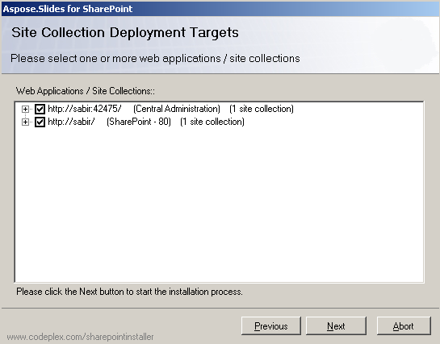

## **محتویات بسته**

Aspose.Slides برای SharePoint از [صفحه دانلود](https://releases.aspose.com/slides/fa/sharepoint/) به‌عنوان یک بایگانی ZIP دریافت می‌شود. این بایگانی شامل یک بسته راه‌حل SharePoint (WSP) و یک برنامه نصب برای هر نسخهٔ پشتیبانی‌شدهٔ SharePoint است:

| نسخه SharePoint | برنامه نصب | بستهٔ راه‌حل |
| :- | :- | :- |
| SharePoint 2007 | Setup2007.exe | Aspose.Slides.SharePoint2007.wsp |
| SharePoint 2010 | Setup2010.exe | Aspose.Slides.SharePoint2010.wsp |
| SharePoint Server 2013 | Setup2013.exe | Aspose.Slides.SharePoint2013.wsp |
| SharePoint Server 2016 | Setup2016.exe | Aspose.Slides.SharePoint2016.wsp |
| SharePoint Server 2019 | Setup2019.exe | Aspose.Slides.SharePoint2019.wsp |

هر برنامه نصب یک فایل پیکربندی در کنار خود دارد (به عنوان مثال *Setup2019.exe.config*) که نام بسته راه‌حلی که نصب می‌کند را تعیین می‌کند. پوشهٔ *License* شامل پیوندی به توافق‌نامهٔ پایان‌کاربر و اطلاعیه‌های مجوزهای شخص ثالث است.

Aspose.Slides برای SharePoint به‌صورت یک راه‌حل SharePoint بسته‌بندی می‌شود که SharePoint آن را در سراسر فارم سرورها مستقر می‌کند. ویژگی آن سپس برای هر مجموعهٔ سایت فعال یا غیرفعال می‌شود.

## **فرآیند نصب**

قبل از نصب، برنامه نصب یک بررسی سیستم انجام می‌دهد. این بررسی تأیید می‌کند که:

- SharePoint بر روی سرور نصب شده باشد.
- کاربر جاری مجوز نصب و استقرار راه‌حل‌های SharePoint را داشته باشد.
- سرویس مدیریت SharePoint راه‌اندازی شده باشد.
- سرویس Timer SharePoint راه‌اندازی شده باشد.
- بستهٔ راه‌حلی که در فایل پیکربندی نام‌گذاری شده موجود باشد.

سرویس‌های Administration و Timer مورد نیاز هستند زیرا برخی از اقدامات نصب به‌صورت کارهای زمان‌بندی‌شده اجرا می‌شوند که راه‌حل را به تمام سرورها در فارم انتشار می‌دهند.

### **اجرای نصب**

برای نصب Aspose.Slides برای SharePoint:

1. بایگانی ZIP را در یک درایو محلی برروی یک سرور در فارم SharePoint باز کنید.
2. برنامهٔ نصب که با نسخهٔ SharePoint شما مطابقت دارد (به جدول بالا نگاه کنید) اجرا کنید و دستورالعمل‌های روی صفحه را دنبال کنید. برنامه نصب:
   1. بررسی سیستم را اجرا می‌کند. اگر هر بررسی‌ای شکست بخورد، نصب ادامه نمی‌یابد.

      **اجرای بررسی سیستم**

      

   2. توافق‌نامهٔ پایان‌کاربر را نمایش می‌دهد. برای ادامه باید آن را بپذیرید.

      **توافق‌نامهٔ مجوز**

      

   3. اهداف استقرار را نمایش می‌دهد. برنامه‌های وب و مجموعه‌های سایت را که می‌خواهید ویژگی برای آنها فعال شود، انتخاب کنید.

      **انتخاب اهداف استقرار**

      

   4. راه‌حل را در فارم مستقر می‌کند.

      **پیشرفت نصب**

      

   5. Aspose.Slides برای SharePoint را بر روی مجموعه‌های سایت انتخابی فعال می‌کند.
   6. برنامه‌های وب و مجموعه‌های سایتی که راه‌حل در آنها مستقر و فعال شده است را فهرست می‌کند.

      **نصب موفقیت‌آمیز**

      

{}
تصاویر صفحه‌نمایش بر روی SharePoint 2007 گرفته شده‌اند. برنامه‌های نصب برای نسخه‌های بعدی نیز از همین صفحه‌ها عبور می‌کنند.
{}

اگر همان نسخهٔ Aspose.Slides برای SharePoint قبلاً نصب شده باشد، برنامه نصب پیشنهاد تعمیر یا حذف آن را می‌دهد. اگر نسخهٔ دیگری نصب شده باشد، پیشنهاد ارتقاء یا حذف آن را می‌دهد.

پس از نصب، یک گزینه **Convert via Aspose.Slides** در منوی پرونده‌های کتابخانه‌های سند مجموعه‌های سایت انتخابی ظاهر می‌شود (در SharePoint 2007، **Convert with Aspose.Slides**). برای تبدیل اولین ارائه، به [تبدیل اسناد Microsoft PowerPoint به قالب‌های دیگر](/slides/fa/sharepoint/converting-microsoft-powerpoint-documents-into-other-formats/) مراجعه کنید. آنچه راه‌حل به فارم اضافه می‌کند در [استقرار و فعال‌سازی](/slides/fa/sharepoint/deployment-and-activation/) توصیف شده است.

## **سوالات متداول**

**کدام برنامه نصب را باید اجرا کنم؟**

برنامه‌ای که نام آن با نسخهٔ SharePoint شما مطابقت دارد. برای مثال، *Setup2016.exe* را در یک فارم SharePoint Server 2016 اجرا کنید. هر برنامه نصب فقط بستهٔ راه‌حل خود را نصب می‌کند.

**آیا برای نسخهٔ دارای مجوز نیاز به دانلود جداگانه‌ای دارم؟**

خیر. همان بسته در حالت ارزیابی کار می‌کند تا زمانی که راه‌حل مجوز را نصب کنید؛ برای جزئیات به [نصب Aspose.Slides برای SharePoint License](/slides/fa/sharepoint/installing-aspose-slides-for-sharepoint-license/) مراجعه کنید.

**چگونه محصول را حذف کنم؟**

همان برنامه نصب را دوباره اجرا کنید و **Remove** را انتخاب کنید؛ برای جزئیات بیشتر به [حذف Aspose.Slides برای SharePoint](/slides/fa/sharepoint/uninstalling-aspose-slides-for-sharepoint/) نگاه کنید.