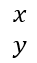

## **Vue d'ensemble**

PowerPoint stocke les équations au format Office Math Markup Language (OMML). Avec Aspose.Slides pour Python via Java, vous pouvez créer le même type de contenu mathématique de façon programmatique : fractions, radicaux, fonctions, limites, opérateurs N‑aires, matrices, tableaux et blocs mathématiques formatés.

Dans PowerPoint, les utilisateurs ajoutent généralement des équations via **Insertion > Équation** :


Le résultat est du texte mathématique modifiable sur la diapositive :


Aspose.Slides construit ce texte mathématique à l’aide de trois objets principaux :

- Une forme mathématique, créée avec [addMathShape](https://reference.aspose.com/slides/fr/python-java/aspose.slides/shapecollection/#addMathShape), est la forme qui contient l’équation.
- [MathPortion](https://reference.aspose.com/slides/fr/python-java/aspose.slides/mathportion/) stocke le contenu mathématique à l’intérieur du cadre de texte de la forme.
- [MathParagraph](https://reference.aspose.com/slides/fr/python-java/aspose.slides/mathparagraph/) contient un ou plusieurs objets [MathBlock](https://reference.aspose.com/slides/fr/python-java/aspose.slides/mathblock/).

La plupart des exemples ci‑dessous utilisent [MathematicalText](https://reference.aspose.com/slides/fr/python-java/aspose.slides/mathematicaltext/) et les méthodes fluides de [MathElementBase](https://reference.aspose.com/slides/fr/python-java/aspose.slides/mathelementbase/) pour garder le code court et lisible.

Pour les scénarios d’exportation MathML, voir [Exporter des équations mathématiques à partir de présentations en Python](/slides/fr/python-java/exporting-math-equations/).

## **Créer une équation**

Cet exemple crée une forme mathématique et ajoute le théorème de Pythagore :


```python
import jpype
import asposeslides

if not jpype.isJVMStarted():
    jpype.startJVM()

from asposeslides.api import MathematicalText, Presentation, SaveFormat

presentation = Presentation()
try:
    slide = presentation.getSlides().get_Item(0)

    math_shape = slide.getShapes().addMathShape(20, 20, 700, 120)
    math_paragraph = math_shape.getTextFrame().getParagraphs().get_Item(0).getPortions().get_Item(0).getMathParagraph()

    a_squared = MathematicalText("a").setSuperscript("2")
    b_squared = MathematicalText("b").setSuperscript("2")
    equation = MathematicalText("c").setSuperscript("2").join("=").join(a_squared).join("+").join(b_squared)

    math_paragraph.add(equation)

    presentation.save("pythagorean-theorem.pptx", SaveFormat.Pptx)
finally:
    presentation.dispose()
```

{}
[addMathShape](https://reference.aspose.com/slides/fr/python-java/aspose.slides/shapecollection/#addMathShape) crée une forme qui contient déjà un paragraphe mathématique. Accédez au premier [MathPortion](https://reference.aspose.com/slides/fr/python-java/aspose.slides/mathportion/), récupérez son [MathParagraph](https://reference.aspose.com/slides/fr/python-java/aspose.slides/mathparagraph/), et ajoutez des blocs mathématiques ou des éléments mathématiques.
{}

## **Ajouter des fractions**

Utilisez [divide](https://reference.aspose.com/slides/fr/python-java/aspose.slides/mathelementbase/#divide) pour créer une fraction. Vous pouvez choisir un style de fraction avec [MathFractionTypes](https://reference.aspose.com/slides/fr/python-java/aspose.slides/mathfractiontypes/).


```python
import jpype
import asposeslides

if not jpype.isJVMStarted():
    jpype.startJVM()

from asposeslides.api import MathBlock, MathFractionTypes, MathematicalText, Presentation, SaveFormat

presentation = Presentation()
try:
    slide = presentation.getSlides().get_Item(0)

    math_shape = slide.getShapes().addMathShape(20, 20, 700, 100)
    math_paragraph = math_shape.getTextFrame().getParagraphs().get_Item(0).getPortions().get_Item(0).getMathParagraph()

    fraction = MathematicalText("1").divide("x", MathFractionTypes.Skewed)

    math_block = MathBlock(fraction)
    math_paragraph.add(math_block)

    presentation.save("fraction.pptx", SaveFormat.Pptx)
finally:
    presentation.dispose()
```

Pour une fraction empilée, utilisez [MathFractionTypes.Bar](https://reference.aspose.com/slides/fr/python-java/aspose.slides/mathfractiontypes/#Bar) :

```python
import jpype
import asposeslides

if not jpype.isJVMStarted():
    jpype.startJVM()

from asposeslides.api import MathFractionTypes, MathematicalText

stacked_fraction = MathematicalText("x + 1").divide("y - 1", MathFractionTypes.Bar)
```

## **Ajouter des radicaux**

Utilisez [radical](https://reference.aspose.com/slides/fr/python-java/aspose.slides/mathelementbase/#radical) pour créer une racine carrée, une racine cubique ou toute autre racine. L’élément actuel devient la base, et l’argument devient le degré.


```python
import jpype
import asposeslides

if not jpype.isJVMStarted():
    jpype.startJVM()

from asposeslides.api import MathBlock, MathematicalText, Presentation, SaveFormat

presentation = Presentation()
try:
    slide = presentation.getSlides().get_Item(0)

    math_shape = slide.getShapes().addMathShape(20, 20, 700, 100)
    math_paragraph = math_shape.getTextFrame().getParagraphs().get_Item(0).getPortions().get_Item(0).getMathParagraph()

    radical = MathematicalText("x").radical("n")

    math_block = MathBlock(radical)
    math_paragraph.add(math_block)

    presentation.save("radical.pptx", SaveFormat.Pptx)
finally:
    presentation.dispose()
```

## **Ajouter des fonctions et des limites**

Utilisez [asArgumentOfFunction](https://reference.aspose.com/slides/fr/python-java/aspose.slides/mathelementbase/#asArgumentOfFunction) ou [function](https://reference.aspose.com/slides/fr/python-java/aspose.slides/mathelementbase/#function) pour des fonctions telles que `sin(x)`, `log(x)` ou des noms de fonctions personnalisés. Pour les limites, placez `lim` dans un [MathLimit](https://reference.aspose.com/slides/fr/python-java/aspose.slides/mathlimit/) ou utilisez [setLowerLimit](https://reference.aspose.com/slides/fr/python-java/aspose.slides/mathelementbase/#setLowerLimit).


```python
import jpype
import asposeslides

if not jpype.isJVMStarted():
    jpype.startJVM()

from asposeslides.api import MathBlock, MathematicalText, Presentation, SaveFormat

presentation = Presentation()
try:
    slide = presentation.getSlides().get_Item(0)

    math_shape = slide.getShapes().addMathShape(20, 20, 700, 100)
    math_paragraph = math_shape.getTextFrame().getParagraphs().get_Item(0).getPortions().get_Item(0).getMathParagraph()

    limit = MathematicalText("lim").setLowerLimit("x\u2192\u221E").function("x")

    math_block = MathBlock(limit)
    math_paragraph.add(math_block)

    presentation.save("functions-and-limits.pptx", SaveFormat.Pptx)
finally:
    presentation.dispose()
```

Pour un nom de fonction personnalisé, faites du nom de fonction l’élément actuel :

```python
import jpype
import asposeslides

if not jpype.isJVMStarted():
    jpype.startJVM()

from asposeslides.api import MathematicalText

custom_function = MathematicalText("f").function("x + 1")
```

## **Ajouter des opérateurs N‑aires et des intégrales**

Utilisez [nary](https://reference.aspose.com/slides/fr/python-java/aspose.slides/mathelementbase/#nary) pour les sommes, les unions, les intersections et d’autres grands opérateurs. Utilisez [integral](https://reference.aspose.com/slides/fr/python-java/aspose.slides/mathelementbase/#integral) pour les intégrales. Les deux méthodes vous permettent de définir les limites inférieure et supérieure.


```python
import jpype
import asposeslides

if not jpype.isJVMStarted():
    jpype.startJVM()

from asposeslides.api import MathBlock, MathNaryOperatorTypes, MathematicalText, Presentation, SaveFormat

presentation = Presentation()
try:
    slide = presentation.getSlides().get_Item(0)

    math_shape = slide.getShapes().addMathShape(20, 20, 700, 120)
    math_paragraph = math_shape.getTextFrame().getParagraphs().get_Item(0).getPortions().get_Item(0).getMathParagraph()

    a_power = MathematicalText("a").setSuperscript("n-k")
    summation_base = MathematicalText("x").setSuperscript("k").join(a_power)

    summation = summation_base.nary(MathNaryOperatorTypes.Summation, "k=0", "n")

    math_block = MathBlock(summation)
    math_paragraph.add(math_block)

    presentation.save("nary-operators.pptx", SaveFormat.Pptx)
finally:
    presentation.dispose()
```

Les opérateurs N‑aires sont destinés aux grands opérateurs avec limites facultatives. Les opérateurs simples tels que `+`, `-` et `=` sont généralement ajoutés en tant que [MathematicalText](https://reference.aspose.com/slides/fr/python-java/aspose.slides/mathematicaltext/) et joints à l’expression.

Pour une intégrale, utilisez [integral](https://reference.aspose.com/slides/fr/python-java/aspose.slides/mathelementbase/#integral) :

```python
import jpype
import asposeslides

if not jpype.isJVMStarted():
    jpype.startJVM()

from asposeslides.api import MathIntegralTypes, MathematicalText

differential = MathematicalText("dx").toBox()
integral_base = MathematicalText("x").join(differential)
integral = integral_base.integral(MathIntegralTypes.Simple, "0", "1")
```

## **Ajouter des matrices**

Utilisez [MathMatrix](https://reference.aspose.com/slides/fr/python-java/aspose.slides/mathmatrix/) pour les lignes et les colonnes. Les matrices n’incluent pas de crochets par défaut, donc encadrez la matrice lorsque vous avez besoin de parenthèses, crochets ou accolades.


```python
import jpype
import asposeslides

if not jpype.isJVMStarted():
    jpype.startJVM()

from asposeslides.api import MathBlock, MathMatrix, MathematicalText, Presentation, SaveFormat

presentation = Presentation()
try:
    slide = presentation.getSlides().get_Item(0)

    math_shape = slide.getShapes().addMathShape(20, 20, 700, 120)
    math_paragraph = math_shape.getTextFrame().getParagraphs().get_Item(0).getPortions().get_Item(0).getMathParagraph()

    matrix = MathMatrix(2, 3)
    cell_0_0 = MathematicalText("1")
    matrix.set_Item(0, 0, cell_0_0)
    cell_0_1 = MathematicalText("x")
    matrix.set_Item(0, 1, cell_0_1)
    cell_1_0 = MathematicalText("x")
    matrix.set_Item(1, 0, cell_1_0)
    cell_1_1 = MathematicalText("2")
    matrix.set_Item(1, 1, cell_1_1)
    cell_1_2 = MathematicalText("y")
    matrix.set_Item(1, 2, cell_1_2)

    math_block = MathBlock(matrix)
    math_paragraph.add(math_block)

    presentation.save("matrix.pptx", SaveFormat.Pptx)
finally:
    presentation.dispose()
```

## **Ajouter des tableaux d’équations**

Utilisez [toMathArray](https://reference.aspose.com/slides/fr/python-java/aspose.slides/mathelementbase/#toMathArray) lorsque vous avez besoin d’équations alignées ou d’une pile verticale d’expressions.



```python
import jpype
import asposeslides

if not jpype.isJVMStarted():
    jpype.startJVM()

from asposeslides.api import MathBlock, MathematicalText, Presentation, SaveFormat

presentation = Presentation()
try:
    slide = presentation.getSlides().get_Item(0)

    math_shape = slide.getShapes().addMathShape(20, 20, 700, 140)
    math_paragraph = math_shape.getTextFrame().getParagraphs().get_Item(0).getPortions().get_Item(0).getMathParagraph()

    equation_array = MathematicalText("x").join("y").toMathArray()

    math_block = MathBlock(equation_array)
    math_paragraph.add(math_block)

    presentation.save("equation-array.pptx", SaveFormat.Pptx)
finally:
    presentation.dispose()
```

## **Ajouter des fonctions trigonométriques**

Utilisez [asArgumentOfFunction](https://reference.aspose.com/slides/fr/python-java/aspose.slides/mathelementbase/#asArgumentOfFunction) lorsque l’argument est l’élément actuel et que le nom de la fonction est connu.


```python
import jpype
import asposeslides

if not jpype.isJVMStarted():
    jpype.startJVM()

from asposeslides.api import MathBlock, MathFunctionsOfOneArgument, MathematicalText, Presentation, SaveFormat

presentation = Presentation()
try:
    slide = presentation.getSlides().get_Item(0)

    math_shape = slide.getShapes().addMathShape(20, 20, 700, 100)
    math_paragraph = math_shape.getTextFrame().getParagraphs().get_Item(0).getPortions().get_Item(0).getMathParagraph()

    cosine = MathematicalText("2x").asArgumentOfFunction(MathFunctionsOfOneArgument.Cos)

    math_block = MathBlock(cosine)
    math_paragraph.add(math_block)

    presentation.save("trigonometric-function.pptx", SaveFormat.Pptx)
finally:
    presentation.dispose()
```

## **Ajouter des indices et des exposants**

Utilisez les aides d’indice et d’exposant pour les index et les puissances. Lorsque les index doivent apparaître à gauche de la base, utilisez [setSubSuperscriptOnTheLeft](https://reference.aspose.com/slides/fr/python-java/aspose.slides/mathelementbase/#setSubSuperscriptOnTheLeft).


```python
import jpype
import asposeslides

if not jpype.isJVMStarted():
    jpype.startJVM()

from asposeslides.api import MathBlock, MathematicalText, Presentation, SaveFormat

presentation = Presentation()
try:
    slide = presentation.getSlides().get_Item(0)

    math_shape = slide.getShapes().addMathShape(20, 20, 700, 100)
    math_paragraph = math_shape.getTextFrame().getParagraphs().get_Item(0).getPortions().get_Item(0).getMathParagraph()

    scripts = MathematicalText("Y").setSubSuperscriptOnTheLeft("1", "n")

    math_block = MathBlock(scripts)
    math_paragraph.add(math_block)

    presentation.save("subscript-superscript.pptx", SaveFormat.Pptx)
finally:
    presentation.dispose()
```

## **Ajouter des délimiteurs**

Utilisez [enclose](https://reference.aspose.com/slides/fr/python-java/aspose.slides/mathelementbase/#enclose) pour placer une expression entre délimiteurs. Vous pouvez également définir un caractère séparateur pour les expressions délimitées contenant plusieurs éléments.


```python
import jpype
import asposeslides

if not jpype.isJVMStarted():
    jpype.startJVM()

from asposeslides.api import MathBlock, MathematicalText, Presentation, SaveFormat

presentation = Presentation()
try:
    slide = presentation.getSlides().get_Item(0)

    math_shape = slide.getShapes().addMathShape(20, 20, 700, 100)
    math_paragraph = math_shape.getTextFrame().getParagraphs().get_Item(0).getPortions().get_Item(0).getMathParagraph()

    delimiter = MathematicalText("x").join("y").join("z").enclose('<', '>')
    delimiter.setSeparatorCharacter('|')

    math_block = MathBlock(delimiter)
    math_paragraph.add(math_block)

    presentation.save("delimiters.pptx", SaveFormat.Pptx)
finally:
    presentation.dispose()
```

## **Ajouter une boîte de bordure**

Utilisez [toBorderBox](https://reference.aspose.com/slides/fr/python-java/aspose.slides/mathelementbase/#toBorderBox) lorsque l’équation elle‑même doit être encadrée.


```python
import jpype
import asposeslides

if not jpype.isJVMStarted():
    jpype.startJVM()

from asposeslides.api import MathBlock, MathematicalText, Presentation, SaveFormat

presentation = Presentation()
try:
    slide = presentation.getSlides().get_Item(0)

    math_shape = slide.getShapes().addMathShape(20, 20, 700, 100)
    math_paragraph = math_shape.getTextFrame().getParagraphs().get_Item(0).getPortions().get_Item(0).getMathParagraph()

    b_squared = MathematicalText("b").setSuperscript("2")
    c_squared = MathematicalText("c").setSuperscript("2")
    boxed_equation = MathematicalText("a").setSuperscript("2").join("=").join(b_squared).join("+").join(c_squared).toBorderBox()

    math_block = MathBlock(boxed_equation)
    math_paragraph.add(math_block)

    presentation.save("border-box.pptx", SaveFormat.Pptx)
finally:
    presentation.dispose()
```

## **Grouper des termes**

Utilisez [group](https://reference.aspose.com/slides/fr/python-java/aspose.slides/mathelementbase/#group) pour placer un caractère de groupement au-dessus ou au-dessous d’une expression. Ajoutez une limite pour étiqueter les termes groupés.


```python
import jpype
import asposeslides

if not jpype.isJVMStarted():
    jpype.startJVM()

from asposeslides.api import MathBlock, MathTopBotPositions, MathematicalText, Presentation, SaveFormat

presentation = Presentation()
try:
    slide = presentation.getSlides().get_Item(0)

    math_shape = slide.getShapes().addMathShape(20, 20, 700, 120)
    math_paragraph = math_shape.getTextFrame().getParagraphs().get_Item(0).getPortions().get_Item(0).getMathParagraph()

    grouped = MathematicalText("x + y").group('\u23DF', MathTopBotPositions.Bottom, MathTopBotPositions.Top).setLowerLimit("any text")

    math_block = MathBlock(grouped)
    math_paragraph.add(math_block)

    presentation.save("grouped-terms.pptx", SaveFormat.Pptx)
finally:
    presentation.dispose()
```

## **Formater les éléments mathématiques**

Utilisez les aides de formatage uniquement lorsqu’elles clarifient la formule. Par exemple, [overbar](https://reference.aspose.com/slides/fr/python-java/aspose.slides/mathelementbase/#overbar) place une barre au-dessus d’un élément mathématique.


```python
import jpype
import asposeslides

if not jpype.isJVMStarted():
    jpype.startJVM()

from asposeslides.api import MathBlock, MathematicalText, Presentation, SaveFormat

presentation = Presentation()
try:
    slide = presentation.getSlides().get_Item(0)

    math_shape = slide.getShapes().addMathShape(20, 20, 700, 100)
    math_paragraph = math_shape.getTextFrame().getParagraphs().get_Item(0).getPortions().get_Item(0).getMathParagraph()

    overbar = MathematicalText("ABC").overbar()

    math_block = MathBlock(overbar)
    math_paragraph.add(math_block)

    presentation.save("overbar.pptx", SaveFormat.Pptx)
finally:
    presentation.dispose()
```

## **Référence rapide**

| Tâche | API principale |
| --- | --- |
| Créer du texte mathématique | [MathematicalText](https://reference.aspose.com/slides/fr/python-java/aspose.slides/mathematicaltext/) |
| Combiner des éléments | [MathElementBase.join](https://reference.aspose.com/slides/fr/python-java/aspose.slides/mathelementbase/#join) |
| Créer des fractions | [MathElementBase.divide](https://reference.aspose.com/slides/fr/python-java/aspose.slides/mathelementbase/#divide) |
| Ajouter un exposant ou un indice | [setSuperscript](https://reference.aspose.com/slides/fr/python-java/aspose.slides/mathelementbase/#setSuperscript), [setSubscript](https://reference.aspose.com/slides/fr/python-java/aspose.slides/mathelementbase/#setSubscript) |
| Ajouter des fonctions | [function](https://reference.aspose.com/slides/fr/python-java/aspose.slides/mathelementbase/#function), [asArgumentOfFunction](https://reference.aspose.com/slides/fr/python-java/aspose.slides/mathelementbase/#asArgumentOfFunction) |
| Ajouter des radicaux | [MathElementBase.radical](https://reference.aspose.com/slides/fr/python-java/aspose.slides/mathelementbase/#radical) |
| Ajouter des limites | [setLowerLimit](https://reference.aspose.com/slides/fr/python-java/aspose.slides/mathelementbase/#setLowerLimit), [setUpperLimit](https://reference.aspose.com/slides/fr/python-java/aspose.slides/mathelementbase/#setUpperLimit) |
| Ajouter des scripts du côté gauche | [setSubSuperscriptOnTheLeft](https://reference.aspose.com/slides/fr/python-java/aspose.slides/mathelementbase/#setSubSuperscriptOnTheLeft) |
| Ajouter des sommes et des intégrales | [nary](https://reference.aspose.com/slides/fr/python-java/aspose.slides/mathelementbase/#nary), [integral](https://reference.aspose.com/slides/fr/python-java/aspose.slides/mathelementbase/#integral) |
| Ajouter des matrices | [MathMatrix](https://reference.aspose.com/slides/fr/python-java/aspose.slides/mathmatrix/) |
| Ajouter des tableaux d’équations | [toMathArray](https://reference.aspose.com/slides/fr/python-java/aspose.slides/mathelementbase/#toMathArray) |
| Ajouter des délimiteurs | [enclose](https://reference.aspose.com/slides/fr/python-java/aspose.slides/mathelementbase/#enclose) |
| Ajouter des barres et des bordures | [overbar](https://reference.aspose.com/slides/fr/python-java/aspose.slides/mathelementbase/#overbar), [toBorderBox](https://reference.aspose.com/slides/fr/python-java/aspose.slides/mathelementbase/#toBorderBox) |
| Grouper des termes | [group](https://reference.aspose.com/slides/fr/python-java/aspose.slides/mathelementbase/#group) |

## **FAQ**

**Puis-je modifier une équation PowerPoint existante ?**

Oui. Ouvrez la présentation, trouvez la forme qui contient un [MathPortion](https://reference.aspose.com/slides/fr/python-java/aspose.slides/mathportion/), récupérez son [MathParagraph](https://reference.aspose.com/slides/fr/python-java/aspose.slides/mathparagraph/), et mettez à jour les blocs mathématiques dans ce paragraphe.

**Les équations sont‑elles enregistrées comme des mathématiques PowerPoint modifiables ?**

Oui. Lorsque vous enregistrez au format PPTX, Aspose.Slides écrit l’équation en tant que contenu mathématique Office modifiable.

**Puis‑je exporter les équations vers LaTeX ?**

Oui. Obtenez le [MathParagraph](https://reference.aspose.com/slides/fr/python-java/aspose.slides/mathparagraph/) de l’équation depuis son [MathPortion](https://reference.aspose.com/slides/fr/python-java/aspose.slides/mathportion/), puis appelez [MathParagraph.toLatex](https://reference.aspose.com/slides/fr/python-java/aspose.slides/mathparagraph/#toLatex) pour l’exporter directement. Pour un exemple complet, voir [Exporter des équations mathématiques à partir de présentations en Python](/slides/fr/python-java/exporting-math-equations/#export-math-equations-to-latex).