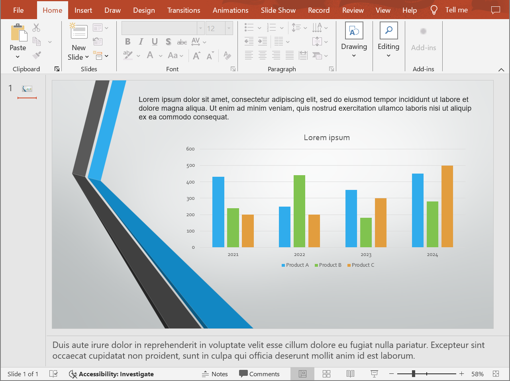

## **संक्षिप्त अवलोकन**

Aspose.Slides for Android via Java Microsoft PowerPoint के बिना PowerPoint प्रेज़ेंटेशन को HTML के रूप में सहेज सकता है। बुनियादी रूपांतरण केवल एक [Presentation](https://reference.aspose.com/slides/hi/androidjava/com.aspose.slides/presentation/) लोड और `save` कॉल के साथ [SaveFormat](https://reference.aspose.com/slides/hi/androidjava/com.aspose.slides/saveformat/) होता है। जब आपको निर्यातित लेआउट, फ़ॉन्ट, छवियां, नोट्स, टिप्पणी, SVG आउटपुट, या लिंक किए गए संसाधन नियंत्रित करने की आवश्यकता हो तो [HtmlOptions](https://reference.aspose.com/slides/hi/androidjava/com.aspose.slides/htmloptions/) का उपयोग करें।

यह गाइड व्यावहारिक HTML निर्यात परिदृश्यों पर केंद्रित है:

- पूरे प्रेज़ेंटेशन या चयनित स्लाइड्स को निर्यात करें।
- स्थिर-लेआउट, रिस्पॉन्सिव, या SVG-आधारित HTML बनाएं।
- स्पीकर नोट्स और टिप्पणियां शामिल करें।
- छवि गुणवत्ता और क्रॉप्ड इमेज डेटा को नियंत्रित करें।
- फ़ॉन्ट एम्बेड करें या फ़ॉन्ट फ़ाइलें अलग से सहेजें।
- बाहरी संसाधन और मीडिया फ़ाइलों को कैसे लिखा और संदर्भित किया जाए चुनें।

डिफ़ॉल्ट रूप से, HTML निर्यात एक self-contained HTML डॉक्यूमेंट बनाता है जहाँ अधिकांश संसाधन एम्बेड होते हैं। यह एक फ़ाइल साझा करने के लिए सुविधाजनक है, लेकिन आउटपुट आकार बढ़ा सकता है। वेब प्रकाशन के लिए, बाहरी संसाधन, कम इमेज DPI, और केवल उन फ़ॉन्ट को एम्बेड करने पर विचार करें जो लक्ष्य वातावरण में विश्वसनीय रूप से उपलब्ध नहीं हैं।

## **प्रेज़ेंटेशन को HTML में परिवर्तित करें**

एक प्रेज़ेंटेशन को HTML में निर्यात करने के लिए, इसे [Presentation](https://reference.aspose.com/slides/hi/androidjava/com.aspose.slides/presentation/) से लोड करें और इसे [SaveFormat.Html](https://reference.aspose.com/slides/hi/androidjava/com.aspose.slides/saveformat/) के साथ सहेजें।

```java
Presentation presentation = new Presentation("presentation.pptx");
try {
    presentation.save("presentation.html", SaveFormat.Html);
} finally {
    presentation.dispose();
}
```

यह उदाहरण एक HTML फ़ाइल लिखता है। `finally` ब्लॉक में प्रेज़ेंटेशन ऑब्जेक्ट डिस्पोज किया जाता है, जो निर्यात के बाद फ़ाइल हैंडल और रेंडरिंग संसाधन मुक्त करता है।

## **HtmlOptions का उपयोग करें**

[HtmlOptions](https://reference.aspose.com/slides/hi/androidjava/com.aspose.slides/htmloptions/) HTML निर्यात के लिए मुख्य कॉन्फ़िगरेशन क्लास है। सामान्य सेटिंग्स में शामिल हैं:

- `SlidesLayoutOptions`: नोट्स, टिप्पणियां, हैंडआउट्स, या अन्य लेआउट जानकारी जोड़ता है।
- `HtmlFormatter`: HTML दस्तावेज़ संरचना बदलता है या फॉर्मेटिंग को कंट्रोलर को सौंपता है।
- `SlideImageFormat`: स्लाइड्स के दर्शाने का तरीका बदलता है, उदाहरण के लिए SVG के रूप में।
- `PicturesCompression`: छवि DPI और आउटपुट आकार नियंत्रित करता है।
- `DeletePicturesCroppedAreas`: क्रॉप्ड इमेज डेटा को रखता या हटाता है।
- `SvgResponsiveLayout`: निर्यातित SVG सामग्री को उसके कंटेनर के अनुसार अनुकूल बनाता है।
- `ShowHiddenSlides`: आवश्यक होने पर छिपी स्लाइड्स को शामिल करता है।

निम्नलिखित अनुभाग सबसे सामान्य विकल्पों को अलग‑अलग दिखाते हैं ताकि आप केवल अपनी कार्यप्रवाह के अनुकूल विकल्पों को संयोजित कर सकें।

## **चयनित स्लाइड्स को HTML में परिवर्तित करें**

स्लाइड नंबर स्वीकार करने वाला `Presentation.save` ओवरलोड 1‑आधारित स्लाइड पोज़िशन का उपयोग करता है। नीचे दिया गया लूप हर स्लाइड को अलग‑अलग HTML फ़ाइल में सहेजता है।

```java
Presentation presentation = new Presentation("presentation.pptx");
try {
    int slideCount = presentation.getSlides().size();

    for (int slideIndex = 0; slideIndex < slideCount; slideIndex++) {
        int slideNumber = slideIndex + 1;
        int[] slideNumbers = { slideNumber };
        String htmlFileName = "slide-" + slideNumber + ".html";

        presentation.save(htmlFileName, slideNumbers, SaveFormat.Html);
    }
} finally {
    presentation.dispose();
}
```

जब किसी वेबसाइट या एप्लिकेशन को प्रति स्लाइड एक HTML पेज चाहिए तो इस पैटर्न का प्रयोग करें। यदि प्रत्येक स्लाइड को एक ही लेआउट चाहिए, तो एक [HtmlOptions](https://reference.aspose.com/slides/hi/androidjava/com.aspose.slides/htmloptions/) इंस्टेंस बनाएं और उसे प्रत्येक `save` कॉल में पास करें।

## **रिस्पॉन्सिव HTML बनाएं**

[ResponsiveHtmlController](https://reference.aspose.com/slides/hi/androidjava/com.aspose.slides/responsivehtmlcontroller/) [HtmlFormatter](https://reference.aspose.com/slides/hi/androidjava/com.aspose.slides/htmlformatter/) के माध्यम से रिस्पॉन्सिव HTML आउटपुट प्रदान करता है। जब निर्यातित पेज को ब्राउज़र की चौड़ाई के अनुसार बेहतर अनुकूल बनाना हो तो इसका उपयोग करें।

```java
Presentation presentation = new Presentation("presentation.pptx");
try {
    ResponsiveHtmlController controller = new ResponsiveHtmlController();
    HtmlFormatter formatter = HtmlFormatter.createCustomFormatter(controller);

    HtmlOptions htmlOptions = new HtmlOptions();
    htmlOptions.setHtmlFormatter(formatter);

    presentation.save("presentation-responsive.html", SaveFormat.Html, htmlOptions);
} finally {
    presentation.dispose();
}
```

SVG‑आधारित रिस्पॉन्सिव लेआउट के लिए, [HtmlOptions](https://reference.aspose.com/slides/hi/androidjava/com.aspose.slides/htmloptions/) पर `SvgResponsiveLayout` सेट करें। यह तब उपयोगी है जब स्लाइड सामग्री को स्केलेबल SVG मार्कअप के रूप में निर्यात किया गया हो।

```java
Presentation presentation = new Presentation("presentation.pptx");
try {
    HtmlOptions htmlOptions = new HtmlOptions();
    htmlOptions.setSvgResponsiveLayout(true);

    presentation.save("presentation-svg-responsive.html", SaveFormat.Html, htmlOptions);
} finally {
    presentation.dispose();
}
```

## **स्पीकर नोट्स और टिप्पणियों को शामिल करें**

स्पीकर नोट्स या टिप्पणियां शामिल करने के लिए `HtmlOptions.SlidesLayoutOptions` के माध्यम से [NotesCommentsLayoutingOptions](https://reference.aspose.com/slides/hi/androidjava/com.aspose.slides/notescommentslayoutingoptions/) का उपयोग करें। नोट्स और टिप्पणियां डिफ़ॉल्ट रूप से छिपी रहती हैं जब तक आप उनकी स्थितियां नहीं चुनते।

मान लीजिए स्रोत प्रेज़ेंटेशन में स्पीकर नोट्स हैं:



निम्नलिखित कोड स्लाइड सामग्री को स्लाइड के नीचे स्पीकर नोट्स के साथ निर्यात करता है।

```java
Presentation presentation = new Presentation("presentation.pptx");
try {
    NotesCommentsLayoutingOptions layoutOptions = new NotesCommentsLayoutingOptions();
    layoutOptions.setNotesPosition(NotesPositions.BottomFull);

    HtmlOptions htmlOptions = new HtmlOptions();
    htmlOptions.setSlidesLayoutOptions(layoutOptions);

    presentation.save("presentation-with-notes.html", SaveFormat.Html, htmlOptions);
} finally {
    presentation.dispose();
}
```

निर्यातित HTML में नोट्स क्षेत्र शामिल होता है:


टिप्पणियां निर्यात करने के लिए `CommentsPosition` सेट करें, उदाहरण के लिए `CommentsPositions.Right` या `CommentsPositions.Bottom`। यदि केवल टिप्पणियां चाहिए तो `NotesPosition` छोड़ दें। यदि दोनों चाहिए तो दोनों प्रॉपर्टी सेट करें।

## **छवि गुणवत्ता और क्रॉप्ड क्षेत्रों को नियंत्रित करें**

HTML निर्यात स्लाइड छवियों को संकुचित करके आउटपुट आकार घटा सकता है। जब आपको उच्च छवि गुणवत्ता चाहिए तो [PicturesCompression](https://reference.aspose.com/slides/hi/androidjava/com.aspose.slides/picturescompression/) से एक मान चुनकर `PicturesCompression` सेट करें।

```java
Presentation presentation = new Presentation("presentation.pptx");
try {
    HtmlOptions htmlOptions = new HtmlOptions();
    htmlOptions.setPicturesCompression(PicturesCompression.Dpi150);

    presentation.save("presentation-dpi-150.html", SaveFormat.Html, htmlOptions);
} finally {
    presentation.dispose();
}
```

डिफ़ॉल्ट रूप से, छवियों के क्रॉप्ड क्षेत्र निर्यातित आउटपुट से हटाए जा सकते हैं। केवल तभी क्रॉप्ड डेटा रखें जब उपयोगकर्ताओं को उन छिपे हिस्सों को पुनः प्राप्त या निरीक्षण करने की आवश्यकता हो। इसे रखे रखने से HTML आकार बढ़ सकता है।

```java
Presentation presentation = new Presentation("presentation.pptx");
try {
    HtmlOptions htmlOptions = new HtmlOptions();
    htmlOptions.setDeletePicturesCroppedAreas(false);

    presentation.save("presentation-with-cropped-areas.html", SaveFormat.Html, htmlOptions);
} finally {
    presentation.dispose();
}
```

## **CSS जोड़ें**

साधारण स्टाइलिंग के लिए, `HtmlFormatter.createDocumentFormatter` को एक CSS स्ट्रिंग पास करें। यह Aspose.Slides द्वारा स्लाइड सामग्री रेंडर होते हुए भी आसपास का HTML डॉक्यूमेंट बदल देता है।

```java
Presentation presentation = new Presentation("presentation.pptx");
try {
    String cssRules = "body { margin: 0; background: #f7f7f7; } .slide { margin: 24px auto; }";
    HtmlFormatter formatter = HtmlFormatter.createDocumentFormatter(cssRules, true);

    HtmlOptions htmlOptions = new HtmlOptions();
    htmlOptions.setHtmlFormatter(formatter);

    presentation.save("presentation-styled.html", SaveFormat.Html, htmlOptions);
} finally {
    presentation.dispose();
}
```

कस्टम डॉक्यूमेंट हेडर, लिंक्ड CSS फ़ाइल, या स्लाइड्स व शेप्स के चारों ओर कस्टम मार्कअप के लिए, [IHtmlFormattingController](https://reference.aspose.com/slides/hi/androidjava/com.aspose.slides/ihtmlformattingcontroller/) लागू करें और उसे `createCustomFormatter` के साथ [HtmlFormatter](https://reference.aspose.com/slides/hi/androidjava/com.aspose.slides/htmlformatter/) में पास करें।

## **फ़ॉन्ट एम्बेड करें**

यदि लक्ष्य वातावरण में प्रेज़ेंटेशन फ़ॉन्ट स्थापित नहीं हो सकते, तो [EmbedAllFontsHtmlController](https://reference.aspose.com/slides/hi/androidjava/com.aspose.slides/embedallfontshtmlcontroller/) का उपयोग करके फ़ॉन्ट HTML में एम्बेड करें। एम्बेड करने से दृश्य सटीकता बढ़ती है लेकिन आउटपुट आकार बढ़ता है।

```java
Presentation presentation = new Presentation("presentation.pptx");
try {
    String[] fontNamesToExclude = { "Arial", "Calibri" };
    EmbedAllFontsHtmlController fontController = new EmbedAllFontsHtmlController(fontNamesToExclude);
    HtmlFormatter formatter = HtmlFormatter.createCustomFormatter(fontController);

    HtmlOptions htmlOptions = new HtmlOptions();
    htmlOptions.setHtmlFormatter(formatter);

    presentation.save("presentation-embedded-fonts.html", SaveFormat.Html, htmlOptions);
} finally {
    presentation.dispose();
}
```

केवल तब फ़ॉन्ट को बाहर रखें जब आपको पूरी तरह भरोसा हो कि लक्ष्य ब्राउज़र या सिस्टम पहले से ही उन्हें प्रदान करते हैं। ब्रांड फ़ॉन्ट या कम सामान्य फ़ॉन्ट के लिए एम्बेड करना आमतौर पर सुरक्षित रहता है।

## **फ़ॉन्ट फ़ाइलों को लिंक करें बजाय एम्बेड करने के**

HTML फ़ाइल आकार घटाने के लिए, आप फ़ॉन्ट डेटा को अलग‑अलग WOFF फ़ाइलों में लिख सकते हैं और HTML में `@font-face` नियम जोड़ सकते हैं। नीचे दिया गया हेल्पर [EmbedAllFontsHtmlController](https://reference.aspose.com/slides/hi/androidjava/com.aspose.slides/embedallfontshtmlcontroller/) को विस्तारित करता है और `writeFont` को ओवरराइड करता है।

```java
class LinkedFontsHtmlController extends EmbedAllFontsHtmlController {
    private final String fontOutputDirectory;
    private final String fontUrlPrefix;

    LinkedFontsHtmlController(
            String fontOutputDirectory,
            String fontUrlPrefix) throws java.io.IOException {
        super(new String[0]);
        this.fontOutputDirectory = fontOutputDirectory;
        this.fontUrlPrefix = fontUrlPrefix.endsWith("/") ? fontUrlPrefix : fontUrlPrefix + "/";
        
        File dirs = new File(fontOutputDirectory);
        dirs.mkdirs();
    }

    @Override
    public void writeFont(
            IHtmlGenerator generator,
            IFontData originalFont,
            IFontData substitutedFont,
            String fontStyle,
            String fontWeight,
            byte[] fontData) {
        try {
            IFontData font = substitutedFont == null ? originalFont : substitutedFont;
            String safeFontName = makeSafeFileName(font.getFontName());
            String safeFontStyle = fontStyle == null || fontStyle.trim().isEmpty() ? "normal" : fontStyle;
            String safeFontWeight = fontWeight == null || fontWeight.trim().isEmpty() ? "normal" : fontWeight;
            String fontFileName = safeFontName + "-" + safeFontStyle + "-" + safeFontWeight + ".woff";
            String fontFilePath = fontOutputDirectory + "/" + fontFileName;

            FileOutputStream fos = new FileOutputStream(fontFilePath);
            fos.write(fontData);
            fos.close();

            String encodedFontFileName = java.net.URLEncoder.encode(fontFileName, "UTF-8");
            String fontUrl = fontUrlPrefix + encodedFontFileName.replace("+", "%20");
            String escapedBackslashes = font.getFontName().replace("\\", "\\\\");
            String fontFamily = escapedBackslashes.replace("'", "\\'");

            generator.addHtml("<style>");
            generator.addHtml("@font-face {");
            generator.addHtml("font-family: '" + fontFamily + "';");
            generator.addHtml("font-style: " + safeFontStyle + ";");
            generator.addHtml("font-weight: " + safeFontWeight + ";");
            generator.addHtml("src: url('" + fontUrl + "') format('woff');");
            generator.addHtml("}");
            generator.addHtml("</style>");
        } catch (java.io.IOException exception) {
            throw new RuntimeException("Unable to write an exported font.", exception);
        }
    }

    private String makeSafeFileName(String fileName) {
        String invalidCharacters = "\\/:*?\"<>|";
        char[] safeCharacters = fileName.toCharArray();

        for (int characterIndex = 0; characterIndex < safeCharacters.length; characterIndex++) {
            if (invalidCharacters.indexOf(safeCharacters[characterIndex]) >= 0) {
                safeCharacters[characterIndex] = '_';
            }
        }

        return new String(safeCharacters);
    }
}

String outputDirectory = System.getProperty("user.dir") + "/html-output";
String fontsDirectory = outputDirectory + "/fonts";
File dir = new File("path/to/folder");
dir.mkdir();

Presentation presentation = new Presentation("presentation.pptx");
try {
    LinkedFontsHtmlController fontController = new LinkedFontsHtmlController(fontsDirectory, "fonts");
    HtmlFormatter formatter = HtmlFormatter.createCustomFormatter(fontController);

    HtmlOptions htmlOptions = new HtmlOptions();
    htmlOptions.setHtmlFormatter(formatter);

    String htmlFilePath = outputDirectory + "/presentation.html";
    presentation.save(htmlFilePath.toString(), SaveFormat.Html, htmlOptions);
} finally {
    presentation.dispose();
}
```

इस उदाहरण में फ़ॉन्ट फ़ाइलें `html-output/fonts` में सहेजी जाती हैं, और HTML उनमें को `fonts/BrandFont-normal-400.woff` जैसे URL से संदर्भित करता है। यदि HTML फ़ाइल और फ़ॉन्ट किसी अन्य स्थान पर डिप्लॉय किए जाते हैं, तो `fontUrlPrefix` चुनें ताकि वह डिप्लॉय किए गए URL पाथ से मेल खाए।

## **संसाधनों को बाहरी रूप से सहेजें**

Self-contained HTML को ले जाना आसान है, लेकिन एम्बेडेड Base64 संसाधन फ़ाइल को बड़ा बना सकते हैं। यदि आपके एप्लिकेशन को बाहरी इमेज फ़ाइलों की आवश्यकता है, तो [ILinkEmbedController](https://reference.aspose.com/slides/hi/androidjava/com.aspose.slides/ilinkembedcontroller/) लागू करें और इसे [HtmlOptions](https://reference.aspose.com/slides/hi/androidjava/com.aspose.slides/htmloptions/) कंस्ट्रक्टर में पास करें।

जब आप संसाधनों को बाहरी बनाते हैं, तो दो पाथ सावधानीपूर्वक चुनें:

- फ़ाइल सिस्टम आउटपुट पथ, जहाँ आपका एप्लिकेशन जनरेटेड इमेज, फ़ॉन्ट, ऑडियो, या वीडियो लिखता है।
- URL पथ, जिसे ब्राउज़र HTML डॉक्यूमेंट से उन फ़ाइलों को लोड करने के लिए उपयोग करता है।

## **मीडिया फ़ाइलें निर्यात करें**

[VideoPlayerHtmlController](https://reference.aspose.com/slides/hi/androidjava/com.aspose.slides/videoplayerhtmlcontroller/) वीडियो और ऑडियो फ़ाइलें निर्यात करता है और HTML लिखता है जो ब्राउज़र में इन्हें चलाने में सक्षम है। इसके कन्स्ट्रक्टर में शामिल हैं:

- `path`: वह डायरेक्टरी जहाँ जनरेटेड मीडिया फ़ाइलें लिखी जाएँगी।
- `fileName`: उत्पन्न हो रहा HTML फ़ाइल नाम।
- `baseUri`: मीडिया फ़ाइलों के लिए HTML लिंक में उपयोग किया जाने वाला पूर्ण URI प्रीफ़िक्स।

यदि HTML फ़ाइल `html-output/presentation.html` है और मीडिया फ़ाइलें `html-output/media` में सहेजी गई हैं, तो `path` को डिस्क पर मीडिया डायरेक्टरी की ओर इशारा करना चाहिए, जबकि `baseUri` को ब्राउज़र के दृष्टिकोण से उसी डायरेक्टरी की ओर। स्थानीय प्रीव्यू के लिए आप मीडिया डायरेक्टरी से `file:///` URI बना सकते हैं। डिप्लॉय्ड एप्लिकेशन के लिए प्रकाशित मीडिया डायरेक्टरी का पूर्ण URL उपयोग करें।

```java
String outputDirectory = System.getProperty("user.dir") + "/html-output";
String mediaDirectory = outputDirectory + "/media";
File outDir = new File(outputDirectory);
outDir.mkdir();
File mediaDir = new File(mediaDirectory);
mediaDir.mkdir();

String htmlFileName = "presentation.html";
String mediaBaseUri = mediaDirectory;

Presentation presentation = new Presentation();
try {
    byte[] videoData = ...;// intro.mp4

    IVideo video = presentation.getVideos().addVideo(videoData);
    ISlide slide = presentation.getSlides().get_Item(0);
    slide.getShapes().addVideoFrame(20, 20, 480, 270, video);

    String mediaDirectoryPath = mediaDirectory;
    VideoPlayerHtmlController controller = new VideoPlayerHtmlController(mediaDirectoryPath, htmlFileName, mediaBaseUri);
    HtmlFormatter formatter = HtmlFormatter.createCustomFormatter(controller);
    SVGOptions svgOptions = new SVGOptions(controller);
    SlideImageFormat slideImageFormat = SlideImageFormat.svg(svgOptions);

    HtmlOptions htmlOptions = new HtmlOptions(controller);
    htmlOptions.setHtmlFormatter(formatter);
    htmlOptions.setSlideImageFormat(slideImageFormat);

    String htmlFilePath = outputDirectory + "/" + htmlFileName;
    presentation.save(htmlFilePath.toString(), SaveFormat.Html, htmlOptions);
} finally {
    presentation.dispose();
}
```

ऐसे आउटपुट डायरेक्टरी प्रयोग करें जो प्रत्येक निर्यात कार्य के लिए अद्वितीय हों, विशेषतः सर्वर एप्लिकेशन में। साझा आउटपुट पाथ अलग‑अलग रूपांतरण से फ़ाइलों के अधिलेखित होने का कारण बन सकते हैं।

## **प्रदर्शन और संसाधन प्रबंधन**

HTML रूपांतरण एक रेंडरिंग ऑपरेशन है, इसलिए प्रोसेसिंग समय और मेमोरी उपयोग स्लाइड गणना, इमेज रेज़ॉल्यूशन, फ़ॉन्ट, इफ़ेक्ट, चार्ट, और एम्बेडेड मीडिया पर निर्भर करता है। उच्च `PicturesCompression` DPI मान, एम्बेडेड फ़ॉन्ट, SVG आउटपुट, और रखे गए क्रॉप्ड इमेज एरिया फ़िडेलिटी बढ़ा सकते हैं लेकिन आमतौर पर आउटपुट आकार बढ़ाते हैं।

बैच रूपांतरण के लिए:

- प्रत्येक [Presentation](https://reference.aspose.com/slides/hi/androidjava/com.aspose.slides/presentation/) इंस्टेंस को तुरंत डिस्पोज करें।
- अलग-अलग कार्यों के लिए अलग आउटपुट डायरेक्टरी उपयोग करें।
- जब तक फ़िडेलिटी की आवश्यकता न हो, सामान्य फ़ॉन्ट को एम्बेड करने से बचें।
- जब HTML प्रीव्यू या थंबनेल के लिए हो तो इमेज DPI कम करें।
- डिप्लॉयमेंट पाथ अंतिम होने तक स्रोत प्रेज़ेंटेशन, जनरेटेड HTML, और बाहरी संसाधनों को साथ रखें।

## **FAQ**

**क्या हाइपरलिंक HTML आउटपुट में संरक्षित रहते हैं?**

हाँ। प्रेज़ेंटेशन के हाइपरलिंक HTML में निर्यात होते हैं और जब लक्ष्य URL वैध हो तो क्लिक करने योग्य रहते हैं।

**क्या मैं प्रेज़ेंटेशन को समानांतर में HTML में परिवर्तित कर सकता हूँ?**

हाँ, लेकिन एक ही [Presentation](https://reference.aspose.com/slides/hi/androidjava/com.aspose.slides/presentation/) इंस्टेंस को थ्रेड्स में साझा न करें। विभिन्न फ़ाइलों को अलग‑अलग प्रेज़ेंटेशन इंस्टेंस, अलग‑अलग स्ट्रीम और अलग‑अलग आउटपुट डायरेक्टरी के साथ प्रोसेस करें। विवरण के लिए [multithreading guidance](/slides/hi/androidjava/multithreading/) देखें।

**क्या Presentation ऑब्जेक्ट थ्रेड‑सेफ़ है?**

नहीं। एक ही [Presentation](https://reference.aspose.com/slides/hi/androidjava/com.aspose.slides/presentation/) इंस्टेंस को एक थ्रेड पर लोड, संशोधित, सहेज और डिस्पोज किया जाना चाहिए। समानांतर कार्य के लिए प्रत्येक थ्रेड या प्रोसेस के लिए स्वतंत्र इंस्टेंस बनाएं।

**जनरेटेड HTML फ़ाइल बहुत बड़ी क्यों है?**

डिफ़ॉल्ट निर्यात अक्सर संसाधन को सीधे HTML में एम्बेड करता है। एम्बेडेड फ़ॉन्ट, उच्च‑DPI इमेज, मीडिया, SVG कंटेंट, और रखे गए क्रॉप्ड इमेज एरिया भी आकार बढ़ाते हैं। बाहरी संसाधन उपयोग करें, सामान्य फ़ॉन्ट को एम्बेड न करें, और जब छोटे आउटपुट आकार अधिक महत्वपूर्ण हो तो `PicturesCompression` कम करें।

**PowerPoint में 24 pt फ़ॉन्ट आकार HTML में 17.999819 pt क्यों दिखता है?**

यह इसलिए हो सकता है क्योंकि PowerPoint और HTML अलग‑अलग DPI मॉडल उपयोग करते हैं। PowerPoint टेक्स्ट आकार 72 DPI के आधार पर टाइपोग्राफ़िक पॉइंट में सहेजता है, जबकि HTML लेआउट CSS पिक्सेल के 96 DPI मॉडल पर आधारित है। जब Aspose.Slides प्रेज़ेंटेशन को HTML में निर्यात करता है, तो फ़ॉन्ट आकार इन सिस्टमों के बीच अनूदित होता है, और परिवर्तन में छोटे राउंड‑ऑफ़ अंतर आ सकते हैं।

ये मान वास्तविक दृश्य फ़ॉन्ट‑साइज़ परिवर्तन नहीं दर्शाते; वे केवल PowerPoint और HTML के बीच टेक्स्ट मीट्रिक बदलने के गणितीय साइड‑इफ़ेक्ट हैं।

**मीडिया निर्यात के लिए baseUri कैसे चुनें?**

`baseUri` को ब्राउज़र के दृष्टिकोण से चुनें और इसे पूर्ण URI के रूप में पास करें। स्थानीय प्रीव्यू के लिए आप आउटपुट डायरेक्टरी से `mediaDirectory.toUri().toString()` का उपयोग करके बना सकते हैं। डिप्लॉयमेंट के लिए प्रकाशित मीडिया डायरेक्टरी का पूर्ण URL उपयोग करें। फ़ाइल सिस्टम `path` और ब्राउज़र `baseUri` को समान स्ट्रिंग होने की आवश्यकता नहीं, लेकिन उन्हें समान संसाधन स्थान का वर्णन करना चाहिए।

**क्या मैं छिपी स्लाइड्स शामिल कर सकता हूँ?**

हाँ। जब छिपी स्लाइड्स निर्यात करनी हों तो [HtmlOptions](https://reference.aspose.com/slides/hi/androidjava/com.aspose.slides/htmloptions/) पर `ShowHiddenSlides` को `true` सेट करें।