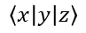

## **अवलोकन**

PowerPoint समीकरणों को Office Math Markup Language (OMML) के रूप में संग्रहीत करता है। Aspose.Slides for Android via Java के साथ, आप प्रोग्रामेटिक रूप से समान प्रकार की गणितीय सामग्री बना सकते हैं: भिन्न, मूल, फ़ंक्शन, सीमाएँ, N-ary ऑपरेटर, मैट्रिक्स, एरे और स्वरूपित गणित ब्लॉक्स।

PowerPoint में, उपयोगकर्ता आम तौर पर **Insert > Equation** से समीकरण जोड़ते हैं:


परिणाम स्लाइड पर एक संपादन योग्य गणितीय पाठ है:


Aspose.Slides तीन मुख्य ऑब्जेक्ट्स के माध्यम से वह गणितीय पाठ बनाता है:

- एक गणितीय आकृति, जिसे [addMathShape](https://reference.aspose.com/slides/hi/androidjava/com.aspose.slides/ishapecollection/) द्वारा बनाया जाता है, वह आकृति है जिसमें समीकरण होता है।
- [MathPortion](https://reference.aspose.com/slides/hi/androidjava/com.aspose.slides/mathportion/) आकृति के टेक्स्ट फ्रेम के अंदर गणितीय सामग्री संग्रहीत करता है।
- [MathParagraph](https://reference.aspose.com/slides/hi/androidjava/com.aspose.slides/mathparagraph/) एक या अधिक [MathBlock](https://reference.aspose.com/slides/hi/androidjava/com.aspose.slides/mathblock/) वस्तुओं को सम्मिलित करता है।

नीचे के अधिकांश उदाहरण [MathematicalText](https://reference.aspose.com/slides/hi/androidjava/com.aspose.slides/mathematicaltext/) और [IMathElement](https://reference.aspose.com/slides/hi/androidjava/com.aspose.slides/imathelement/) की फ़्लुएंट मेथड्स का उपयोग करते हैं ताकि कोड छोटा और पठनीय रहे।

MathML निर्यात परिदृश्यों के लिए, देखें [एंड्रॉइड पर प्रस्तुतियों से गणितीय समीकरण निर्यात करें](/slides/hi/androidjava/exporting-math-equations/)।

## **समीकरण बनाना**

यह उदाहरण एक गणितीय आकृति बनाता है और पायथागोरस प्रमेय जोड़ता है:


```java
Presentation presentation = new Presentation();
try {
    ISlide slide = presentation.getSlides().get_Item(0);

    IAutoShape mathShape = slide.getShapes().addMathShape(20, 20, 700, 120);
    IMathParagraph mathParagraph = ((MathPortion) mathShape.getTextFrame().getParagraphs()
            .get_Item(0).getPortions().get_Item(0)).getMathParagraph();

    IMathBlock equation = new MathematicalText("c")
            .setSuperscript("2")
            .join("=")
            .join(new MathematicalText("a").setSuperscript("2"))
            .join("+")
            .join(new MathematicalText("b").setSuperscript("2"));

    mathParagraph.add(equation);

    presentation.save("pythagorean-theorem.pptx", SaveFormat.Pptx);
} finally {
    presentation.dispose();
}
```

{}
`addMathShape` एक ऐसी आकृति बनाता है जिसमें पहले से ही एक गणितीय पैराग्राफ होता है। पहले `MathPortion` तक पहुँचें, उसका `MathParagraph` प्राप्त करें, और उसमें गणितीय ब्लॉक्स या गणितीय तत्व जोड़ें।
{}

## **भिन्न जोड़ें**

`divide` का उपयोग करके एक भिन्न बनाएँ। आप [MathFractionTypes](https://reference.aspose.com/slides/hi/androidjava/com.aspose.slides/mathfractiontypes/) से एक भिन्न शैली चुन सकते हैं।


```java
Presentation presentation = new Presentation();
try {
    ISlide slide = presentation.getSlides().get_Item(0);

    IAutoShape mathShape = slide.getShapes().addMathShape(20, 20, 700, 100);
    IMathParagraph mathParagraph = ((MathPortion) mathShape.getTextFrame().getParagraphs()
            .get_Item(0).getPortions().get_Item(0)).getMathParagraph();

    IMathFraction fraction = new MathematicalText("1")
            .divide("x", MathFractionTypes.Skewed);

    mathParagraph.add(new MathBlock(fraction));

    presentation.save("fraction.pptx", SaveFormat.Pptx);
} finally {
    presentation.dispose();
}
```

स्ट्रैक्ड भिन्न के लिए, `MathFractionTypes.Bar` का उपयोग करें:

```java
IMathFraction stackedFraction = new MathematicalText("x + 1").divide("y - 1", MathFractionTypes.Bar);
```

## **मूल जोड़ें**

`square root`, `cube root` या अन्य मूल बनाने के लिए `radical` का उपयोग करें। वर्तमान तत्व आधार बन जाता है, और तर्क डिग्री बन जाता है।


```java
Presentation presentation = new Presentation();
try {
    ISlide slide = presentation.getSlides().get_Item(0);

    IAutoShape mathShape = slide.getShapes().addMathShape(20, 20, 700, 100);
    IMathParagraph mathParagraph = ((MathPortion) mathShape.getTextFrame().getParagraphs()
            .get_Item(0).getPortions().get_Item(0)).getMathParagraph();

    IMathRadical radical = new MathematicalText("x")
            .radical("n");

    mathParagraph.add(new MathBlock(radical));

    presentation.save("radical.pptx", SaveFormat.Pptx);
} finally {
    presentation.dispose();
}
```

## **फ़ंक्शन और सीमाएँ जोड़ें**

`sin(x)`, `log(x)` या कस्टम फ़ंक्शन नामों जैसे फ़ंक्शन के लिए `asArgumentOfFunction` या `function` का उपयोग करें। सीमाओं के लिए, `lim` को एक [MathLimit](https://reference.aspose.com/slides/hi/androidjava/com.aspose.slides/mathlimit/) में रखें या `setLowerLimit` का उपयोग करें।


```java
Presentation presentation = new Presentation();
try {
    ISlide slide = presentation.getSlides().get_Item(0);

    IAutoShape mathShape = slide.getShapes().addMathShape(20, 20, 700, 100);
    IMathParagraph mathParagraph = ((MathPortion) mathShape.getTextFrame().getParagraphs()
            .get_Item(0).getPortions().get_Item(0)).getMathParagraph();

    IMathFunction limit = new MathematicalText("lim")
            .setLowerLimit("x→∞")
            .function("x");

    mathParagraph.add(new MathBlock(limit));

    presentation.save("functions-and-limits.pptx", SaveFormat.Pptx);
} finally {
    presentation.dispose();
}
```

कस्टम फ़ंक्शन नाम के लिए, फ़ंक्शन नाम को वर्तमान तत्व बनाएं:

```java
IMathFunction customFunction = new MathematicalText("f").function("x + 1");
```

## **N-ary ऑपरेटर और इंटीग्रल जोड़ें**

योगफल, यूनियन, इंटरसेक्शन और अन्य बड़े ऑपरेटर्स के लिए `nary` का उपयोग करें। इंटीग्रल के लिए `integral` का उपयोग करें। दोनों मेथड्स आपको निचली और ऊपरी सीमाएँ सेट करने की अनुमति देते हैं।


```java
Presentation presentation = new Presentation();
try {
    ISlide slide = presentation.getSlides().get_Item(0);

    IAutoShape mathShape = slide.getShapes().addMathShape(20, 20, 700, 120);
    IMathParagraph mathParagraph = ((MathPortion) mathShape.getTextFrame().getParagraphs()
            .get_Item(0).getPortions().get_Item(0)).getMathParagraph();

    IMathBlock summationBase = new MathematicalText("x")
            .setSuperscript("k")
            .join(new MathematicalText("a").setSuperscript("n-k"));

    IMathNaryOperator summation = summationBase.nary(MathNaryOperatorTypes.Summation, "k=0", "n");

    mathParagraph.add(new MathBlock(summation));

    presentation.save("nary-operators.pptx", SaveFormat.Pptx);
} finally {
    presentation.dispose();
}
```

N-ary ऑपरेटर्स बड़े ऑपरेटर्स के लिए होते हैं जिनमें वैकल्पिक सीमाएँ हो सकती हैं। `+`, `-`, `=` जैसे सरल ऑपरेटर्स आमतौर पर `MathematicalText` के रूप में जोड़े जाते हैं और अभिव्यक्ति में सम्मिलित होते हैं।

इंटीग्रल के लिए, `integral` का उपयोग करें:

```java
IMathBlock integralBase = new MathematicalText("x").join(new MathematicalText("dx").toBox());
IMathNaryOperator integral = integralBase.integral(MathIntegralTypes.Simple, "0", "1");
```

## **मैट्रिक्स जोड़ें**

पंक्तियों और स्तम्भों के लिए [MathMatrix](https://reference.aspose.com/slides/hi/androidjava/com.aspose.slides/mathmatrix/) का उपयोग करें। मैट्रिक्स डिफ़ॉल्ट रूप से कोष्ठक शामिल नहीं करते, इसलिए जब आपको कोष्ठक, ब्रैकेट या कर्ली ब्रेसेस की आवश्यकता हो तो मैट्रिक्स को इनसे घेरें।


```java
Presentation presentation = new Presentation();
try {
    ISlide slide = presentation.getSlides().get_Item(0);

    IAutoShape mathShape = slide.getShapes().addMathShape(20, 20, 700, 120);
    IMathParagraph mathParagraph = ((MathPortion) mathShape.getTextFrame().getParagraphs()
            .get_Item(0).getPortions().get_Item(0)).getMathParagraph();

    MathMatrix matrix = new MathMatrix(2, 3);
    matrix.set_Item(0, 0, new MathematicalText("1"));
    matrix.set_Item(0, 1, new MathematicalText("x"));
    matrix.set_Item(1, 0, new MathematicalText("x"));
    matrix.set_Item(1, 1, new MathematicalText("2"));
    matrix.set_Item(1, 2, new MathematicalText("y"));

    mathParagraph.add(new MathBlock(matrix));

    presentation.save("matrix.pptx", SaveFormat.Pptx);
} finally {
    presentation.dispose();
}
```

## **समीकरण एरे जोड़ें**

जब आपको संरेखित समीकरणों या अभिव्यक्तियों के एक लंबवत स्टैक की आवश्यकता हो तो `toMathArray` का उपयोग करें।


```java
Presentation presentation = new Presentation();
try {
    ISlide slide = presentation.getSlides().get_Item(0);

    IAutoShape mathShape = slide.getShapes().addMathShape(20, 20, 700, 140);
    IMathParagraph mathParagraph = ((MathPortion) mathShape.getTextFrame().getParagraphs()
            .get_Item(0).getPortions().get_Item(0)).getMathParagraph();

    IMathArray equationArray = new MathematicalText("x")
            .join("y")
            .toMathArray();

    mathParagraph.add(new MathBlock(equationArray));

    presentation.save("equation-array.pptx", SaveFormat.Pptx);
} finally {
    presentation.dispose();
}
```

## **त्रिकोणमितीय फ़ंक्शन जोड़ें**

जब तर्क वर्तमान तत्व हो और फ़ंक्शन नाम ज्ञात हो तो `asArgumentOfFunction` का उपयोग करें।


```java
Presentation presentation = new Presentation();
try {
    ISlide slide = presentation.getSlides().get_Item(0);

    IAutoShape mathShape = slide.getShapes().addMathShape(20, 20, 700, 100);
    IMathParagraph mathParagraph = ((MathPortion) mathShape.getTextFrame().getParagraphs()
            .get_Item(0).getPortions().get_Item(0)).getMathParagraph();

    IMathFunction cosine = new MathematicalText("2x")
            .asArgumentOfFunction(MathFunctionsOfOneArgument.Cos);

    mathParagraph.add(new MathBlock(cosine));

    presentation.save("trigonometric-function.pptx", SaveFormat.Pptx);
} finally {
    presentation.dispose();
}
```

## **सबस्क्रिप्ट और सुपर्स्क्रिप्ट जोड़ें**

सूचकांक और घातांक के लिए सबस्क्रिप्ट और सुपर्स्क्रिप्ट हेल्पर का उपयोग करें। जब सूचकांक आधार के बाएँ पक्ष पर दिखना आवश्यक हो, तो `setSubSuperscriptOnTheLeft` का उपयोग करें।


```java
Presentation presentation = new Presentation();
try {
    ISlide slide = presentation.getSlides().get_Item(0);

    IAutoShape mathShape = slide.getShapes().addMathShape(20, 20, 700, 100);
    IMathParagraph mathParagraph = ((MathPortion) mathShape.getTextFrame().getParagraphs()
            .get_Item(0).getPortions().get_Item(0)).getMathParagraph();

    IMathLeftSubSuperscriptElement scripts = new MathematicalText("Y")
            .setSubSuperscriptOnTheLeft("1", "n");

    mathParagraph.add(new MathBlock(scripts));

    presentation.save("subscript-superscript.pptx", SaveFormat.Pptx);
} finally {
    presentation.dispose();
}
```

## **डिलिमिटर जोड़ें**

एक अभिव्यक्ति को डिलिमिटर के भीतर रखने के लिए `enclose` का उपयोग करें। आप कई तत्वों वाली डिलिमिटर अभिव्यक्तियों के लिए एक विभाजक अक्षर भी सेट कर सकते हैं।



```java
Presentation presentation = new Presentation();
try {
    ISlide slide = presentation.getSlides().get_Item(0);

    IAutoShape mathShape = slide.getShapes().addMathShape(20, 20, 700, 100);
    IMathParagraph mathParagraph = ((MathPortion) mathShape.getTextFrame().getParagraphs()
            .get_Item(0).getPortions().get_Item(0)).getMathParagraph();

    IMathDelimiter delimiter = new MathematicalText("x")
            .join("y")
            .join("z")
            .enclose('<', '>');
    delimiter.setSeparatorCharacter('|');

    mathParagraph.add(new MathBlock(delimiter));

    presentation.save("delimiters.pptx", SaveFormat.Pptx);
} finally {
    presentation.dispose();
}
```

## **बॉर्डर बॉक्स जोड़ें**

जब समीकरण को स्वयं फ्रेम किया जाना चाहिये तो `toBorderBox` का उपयोग करें।


```java
Presentation presentation = new Presentation();
try {
    ISlide slide = presentation.getSlides().get_Item(0);

    IAutoShape mathShape = slide.getShapes().addMathShape(20, 20, 700, 100);
    IMathParagraph mathParagraph = ((MathPortion) mathShape.getTextFrame().getParagraphs()
            .get_Item(0).getPortions().get_Item(0)).getMathParagraph();

    IMathBorderBox boxedEquation = new MathematicalText("a")
            .setSuperscript("2")
            .join("=")
            .join(new MathematicalText("b").setSuperscript("2"))
            .join("+")
            .join(new MathematicalText("c").setSuperscript("2"))
            .toBorderBox();

    mathParagraph.add(new MathBlock(boxedEquation));

    presentation.save("border-box.pptx", SaveFormat.Pptx);
} finally {
    presentation.dispose();
}
```

## **टर्म्स को ग्रुप करें**

एक अभिव्यक्ति के ऊपर या नीचे ग्रुपिंग कैरेक्टर रखने के लिए `group` का उपयोग करें। ग्रुपेड टर्म्स को लेबल करने के लिए एक लिमिट जोड़ें।


```java
Presentation presentation = new Presentation();
try {
    ISlide slide = presentation.getSlides().get_Item(0);

    IAutoShape mathShape = slide.getShapes().addMathShape(20, 20, 700, 120);
    IMathParagraph mathParagraph = ((MathPortion) mathShape.getTextFrame().getParagraphs()
            .get_Item(0).getPortions().get_Item(0)).getMathParagraph();

    IMathLimit grouped = new MathematicalText("x + y")
            .group('\u23DF', MathTopBotPositions.Bottom, MathTopBotPositions.Top)
            .setLowerLimit("any text");

    mathParagraph.add(new MathBlock(grouped));

    presentation.save("grouped-terms.pptx", SaveFormat.Pptx);
} finally {
    presentation.dispose();
}
```

## **गणितीय तत्वों को फ़ॉर्मेट करें**

फ़ॉर्मेटिंग हेल्पर्स का उपयोग केवल तब करें जब वे सूत्र को स्पष्ट करें। उदाहरण के लिए, `overbar` गणितीय तत्व के ऊपर एक बार रखता है।


```java
Presentation presentation = new Presentation();
try {
    ISlide slide = presentation.getSlides().get_Item(0);

    IAutoShape mathShape = slide.getShapes().addMathShape(20, 20, 700, 100);
    IMathParagraph mathParagraph = ((MathPortion) mathShape.getTextFrame().getParagraphs()
            .get_Item(0).getPortions().get_Item(0)).getMathParagraph();

    IMathBar overbar = new MathematicalText("ABC").overbar();

    mathParagraph.add(new MathBlock(overbar));

    presentation.save("overbar.pptx", SaveFormat.Pptx);
} finally {
    presentation.dispose();
}
```

## **त्वरित संदर्भ**

| कार्य | मुख्य API |
| --- | --- |
| गणितीय पाठ बनाएं | [MathematicalText](https://reference.aspose.com/slides/hi/androidjava/com.aspose.slides/mathematicaltext/) |
| तत्वों को संयोजित करें | [IMathElement.join](https://reference.aspose.com/slides/hi/androidjava/com.aspose.slides/imathelement/) |
| भिन्न बनाएं | [IMathElement.divide](https://reference.aspose.com/slides/hi/androidjava/com.aspose.slides/imathelement/) |
| सुपर्स्क्रिप्ट या सबस्क्रिप्ट जोड़ें | [setSuperscript](https://reference.aspose.com/slides/hi/androidjava/com.aspose.slides/imathelement/), [setSubscript](https://reference.aspose.com/slides/hi/androidjava/com.aspose.slides/imathelement/) |
| फ़ंक्शन जोड़ें | [function](https://reference.aspose.com/slides/hi/androidjava/com.aspose.slides/imathelement/), [asArgumentOfFunction](https://reference.aspose.com/slides/hi/androidjava/com.aspose.slides/imathelement/) |
| मूल जोड़ें | [IMathElement.radical](https://reference.aspose.com/slides/hi/androidjava/com.aspose.slides/imathelement/) |
| सीमाएँ जोड़ें | [setLowerLimit](https://reference.aspose.com/slides/hi/androidjava/com.aspose.slides/imathelement/), [setUpperLimit](https://reference.aspose.com/slides/hi/androidjava/com.aspose.slides/imathelement/) |
| बाएँ‑साइड स्क्रिप्ट जोड़ें | [setSubSuperscriptOnTheLeft](https://reference.aspose.com/slides/hi/androidjava/com.aspose.slides/imathelement/) |
| योगफल और इंटीग्रल जोड़ें | [nary](https://reference.aspose.com/slides/hi/androidjava/com.aspose.slides/imathelement/), [integral](https://reference.aspose.com/slides/hi/androidjava/com.aspose.slides/imathelement/) |
| मैट्रिक्स जोड़ें | [MathMatrix](https://reference.aspose.com/slides/hi/androidjava/com.aspose.slides/mathmatrix/) |
| समीकरण एरे जोड़ें | [toMathArray](https://reference.aspose.com/slides/hi/androidjava/com.aspose.slides/imathelement/) |
| डिलिमिटर जोड़ें | [enclose](https://reference.aspose.com/slides/hi/androidjava/com.aspose.slides/imathelement/) |
| बार और बॉर्डर जोड़ें | [overbar](https://reference.aspose.com/slides/hi/androidjava/com.aspose.slides/imathelement/), [toBorderBox](https://reference.aspose.com/slides/hi/androidjava/com.aspose.slides/imathelement/) |
| टर्म्स को ग्रुप करें | [group](https://reference.aspose.com/slides/hi/androidjava/com.aspose.slides/imathelement/) |

## **FAQ**

**क्या मैं मौजूदा PowerPoint समीकरण को संपादित कर सकता हूँ?**

हां। प्रस्तुति खोलें, उस आकृति को खोजें जिसमें `MathPortion` हो, उसका `MathParagraph` प्राप्त करें, और उस पैराग्राफ में गणितीय ब्लॉक्स को अपडेट करें।

**क्या समीकरण को संपादन योग्य PowerPoint गणित के रूप में सहेजा जाता है?**

हां। जब आप PPTX में सहेजते हैं, Aspose.Slides समीकरण को संपादन योग्य Office गणित सामग्री के रूप में लिखता है।

**क्या मैं समीकरणों को LaTeX में निर्यात कर सकता हूँ?**

हां। समीकरण का [IMathParagraph](https://reference.aspose.com/slides/hi/androidjava/com.aspose.slides/imathparagraph/) उसके [IMathPortion](https://reference.aspose.com/slides/hi/androidjava/com.aspose.slides/imathportion/) से प्राप्त करें, और सीधे निर्यात करने के लिए [IMathParagraph.toLatex](https://reference.aspose.com/slides/hi/androidjava/com.aspose.slides/imathparagraph/#toLatex--) को कॉल करें। पूर्ण उदाहरण के लिए देखें [एंड्रॉइड पर प्रस्तुतियों से गणितीय समीकरण निर्यात करें](/slides/hi/androidjava/exporting-math-equations/#export-math-equations-to-latex)।