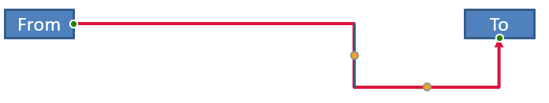

## **परिचय**

PowerPoint कनेक्टर एक विशेष रेखा है जो दो आकृतियों को जोड़ती या लिंक करती है और स्लाइड पर आकृति को खिसकाने या पुनःस्थित करने पर भी उसके साथ जुड़ा रहता है।  

कनेक्टर आम तौर पर *कनेक्शन डॉट्स* (हरी बिंदु) से जुड़े होते हैं, जो सभी आकृतियों में डिफ़ॉल्ट रूप से मौजूद होते हैं। कनेक्शन डॉट्स तब दिखते हैं जब कर्सर उनके पास आता है।

*समायोजन बिंदु* (नारंगी बिंदु), जो केवल कुछ कनेक्टरों में होते हैं, कनेक्टर की स्थितियों और आकार को बदलने के लिए उपयोग किए जाते हैं।

## **कनेक्टर के प्रकार**

PowerPoint में आप सीधी, कोहनी (कोणीय) और घुमावदार कनेक्टरों का उपयोग कर सकते हैं।  

Aspose.Slides इन कनेक्टरों को प्रदान करता है:

| कनेक्टर | छवि | समायोजन बिंदुओं की संख्या |
| ------------------------------ | ------------------------------------------------------------ | --------------------------- |
| `ShapeType.Line`               |       | 0                           |
| `ShapeType.StraightConnector1` |  | 0                           |
| `ShapeType.BentConnector2`     |   | 0                           |
| `ShapeType.BentConnector3`     |     | 1                           |
| `ShapeType.BentConnector4`     |     | 2                           |
| `ShapeType.BentConnector5`     |     | 3                           |
| `ShapeType.CurvedConnector2`   |  | 0                           |
| `ShapeType.CurvedConnector3`   |  | 1                           |
| `ShapeType.CurvedConnector4`   |  | 2                           |
| `ShapeType.CurvedConnector5`   |  | 3                           |

## **कनेक्टर का उपयोग करके आकृतियों को जोड़ें**

1. एक [प्रेजेंटेशन](https://apireference.aspose.com/slides/hi/androidjava/com.aspose.slides/Presentation) वर्ग का एक उदाहरण बनाएं।  
1. इंडेक्स के द्वारा स्लाइड का संदर्भ प्राप्त करें।  
1. `Shapes` ऑब्जेक्ट द्वारा प्रदान किए गए `addAutoShape` मेथड का उपयोग करके स्लाइड में दो [AutoShape](https://reference.aspose.com/slides/hi/androidjava/com.aspose.slides/AutoShape) जोड़ें।  
1. `Shapes` ऑब्जेक्ट द्वारा प्रदान किए गए `addConnector` मेथड का उपयोग करके कनेक्टर प्रकार निर्धारित कर एक कनेक्टर जोड़ें।  
1. कनेक्टर का उपयोग करके आकृतियों को जोड़ें।  
1. सबसे छोटे कनेक्शन पथ को लागू करने के लिए `reroute` मेथड को कॉल करें।  
1. प्रेजेंटेशन को सहेजें।  

यह Java कोड आपको दो आकृतियों (एक दीर्घवृत्त और आयत) के बीच एक बेंट कनेक्टर जोड़ने का तरीका दिखाता है:

```Java
// PPTX फ़ाइल का प्रतिनिधित्व करने वाले प्रस्तुति वर्ग का उदाहरण बनाता है
Presentation pres = new Presentation();
try {
    // किसी विशेष स्लाइड के लिए शैप्स संग्रह तक पहुंचता है
    IShapeCollection shapes = pres.getSlides().get_Item(0).getShapes();
    
    // एक एलिप्स ऑटोशेप जोड़ता है
    IAutoShape ellipse = shapes.addAutoShape(ShapeType.Ellipse, 0, 100, 100, 100);
    
    // एक रेक्टैंगल ऑटोशेप जोड़ता है
    IAutoShape rectangle = shapes.addAutoShape(ShapeType.Rectangle, 100, 300, 100, 100);
    
    // स्लाइड की शैप्स संग्रह में एक कनेक्टर आकार जोड़ता है
    IConnector connector = shapes.addConnector(ShapeType.BentConnector2, 0, 0, 10, 10);
    
    // कनेक्टर का उपयोग करके आकृतियों को जोड़ता है
    connector.setStartShapeConnectedTo(ellipse);
    connector.setEndShapeConnectedTo(rectangle);
    
    // reroute को कॉल करता है जो आकृतियों के बीच स्वत: सबसे छोटा पथ सेट करता है
    connector.reroute();
    
    // प्रेजेंटेशन को सहेजता है
    pres.save("output.pptx", SaveFormat.Pptx);
} finally {
    if (pres != null) pres.dispose();
}
```

{} 
`Connector.reroute` मेथड कनेक्टर को पुनः मार्गित करता है और उसे आकृतियों के बीच सबसे छोटा संभव पथ लेने के लिए बाध्य करता है। अपने लक्ष्य को प्राप्त करने के लिए, यह मेथड `setStartShapeConnectionSiteIndex` और `setEndShapeConnectionSiteIndex` बिंदुओं को बदल सकता है।  
{} 

## **कनेक्शन डॉट निर्दिष्ट करें**

यदि आप चाहते हैं कि कनेक्टर आकृतियों को विशिष्ट बिंदुओं के माध्यम से जोड़ें, तो आपको अपने पसंदीदा कनेक्शन डॉट्स इस प्रकार निर्दिष्ट करने होंगे:

1. एक [प्रेजेंटेशन](https://reference.aspose.com/slides/hi/androidjava/com.aspose.slides/Presentation) वर्ग का एक उदाहरण बनाएं।  
1. इंडेक्स के द्वारा स्लाइड का संदर्भ प्राप्त करें।  
1. `Shapes` ऑब्जेक्ट द्वारा प्रदान किए गए `addAutoShape` मेथड का उपयोग करके स्लाइड में दो [AutoShape](https://reference.aspose.com/slides/hi/androidjava/com.aspose.slides/AutoShape) जोड़ें।  
1. `Shapes` ऑब्जेक्ट द्वारा प्रदान किए गए `addConnector` मेथड का उपयोग करके कनेक्टर प्रकार निर्धारित कर एक कनेक्टर जोड़ें।  
1. कनेक्टर का उपयोग करके आकृतियों को जोड़ें।  
1. आकृतियों पर अपने पसंदीदा कनेक्शन डॉट्स सेट करें।  
1. प्रेजेंटेशन को सहेजें।  

यह Java कोड एक ऑपरेशन दर्शाता है जिसमें पसंदीदा कनेक्शन डॉट निर्दिष्ट किया गया है:

```java
// PPTX फ़ाइल का प्रतिनिधित्व करने वाले प्रस्तुति वर्ग का उदाहरण बनाता है
Presentation pres = new Presentation();
try {
    // किसी विशेष स्लाइड के लिए शैप्स संग्रह तक पहुंचता है
    IShapeCollection shapes = pres.getSlides().get_Item(0).getShapes();

    // एक एलिप्स ऑटोशेप जोड़ें
    IAutoShape ellipse = shapes.addAutoShape(ShapeType.Ellipse, 0, 100, 100, 100);

    // एक रेक्टैंगल ऑटोशेप जोड़ें
    IAutoShape rectangle = shapes.addAutoShape(ShapeType.Rectangle, 100, 300, 100, 100);

    // स्लाइड की शैप्स संग्रह में एक कनेक्टर आकार जोड़ता है
    IConnector connector = shapes.addConnector(ShapeType.BentConnector2, 0, 0, 10, 10);

    // कनेक्टर का उपयोग करके आकृतियों को जोड़ता है
    connector.setStartShapeConnectedTo(ellipse);
    connector.setEndShapeConnectedTo(rectangle);

    // एलिप्स आकृति पर पसंदीदा कनेक्शन डॉट सूचकांक सेट करता है
    int wantedIndex = 6;

    // जांचता है कि पसंदीदा सूचकांक अधिकतम साइट सूचकांक गिनती से कम है या नहीं
    if (ellipse.getConnectionSiteCount() > wantedIndex) 
    {
        // एलिप्स ऑटोशेप पर पसंदीदा कनेक्शन डॉट सेट करता है
        connector.setStartShapeConnectionSiteIndex(wantedIndex);
    }

    // प्रस्तुति को सहेजता है
    pres.save("output.pptx", SaveFormat.Pptx);
} finally {
    if (pres != null) pres.dispose();
}
```

## **कनेक्टर बिंदु को समायोजित करें**

आप मौजूदा कनेक्टर को उसके समायोजन बिंदुओं के माध्यम से समायोजित कर सकते हैं। केवल उन कनेक्टरों को इस प्रकार बदला जा सकता है जिनके पास समायोजन बिंदु होते हैं। **[कनेक्टर के प्रकार](/slides/hi/androidjava/connector/#types-of-connectors)** के अंतर्गत तालिका देखें।

### **सरल मामला**

दो आकृतियों (A और B) के बीच एक कनेक्टर जो तीसरी आकृति (C) के माध्यम से जाता है, को विचार करें:


```java
Presentation pres = new Presentation();
try {

    ISlide sld = pres.getSlides().get_Item(0);
    IShape shape = sld.getShapes().addAutoShape(ShapeType.Rectangle, 300, 150, 150, 75);
    IShape shapeFrom = sld.getShapes().addAutoShape(ShapeType.Rectangle, 500, 400, 100, 50);
    IShape shapeTo = sld.getShapes().addAutoShape(ShapeType.Rectangle, 100, 100, 70, 30);

    IConnector connector = sld.getShapes().addConnector(ShapeType.BentConnector5, 20, 20, 400, 300);

    connector.getLineFormat().setEndArrowheadStyle(LineArrowheadStyle.Triangle);
    connector.getLineFormat().getFillFormat().setFillType(FillType.Solid);
    connector.getLineFormat().getFillFormat().getSolidFillColor().setColor(Color.BLACK);

    connector.setStartShapeConnectedTo(shapeFrom);
    connector.setEndShapeConnectedTo(shapeTo);
    connector.setStartShapeConnectionSiteIndex(2);
} finally {
    if (pres != null) pres.dispose();
}
```

तीसरी आकृति से बचने या उसे बायपास करने के लिए हम कनेक्टर को इस तरह बाईं ओर उसकी लंबवत रेखा को ले जाकर समायोजित कर सकते हैं:


```java
IAdjustValue adj2 = connector.getAdjustments().get_Item(1);
adj2.setRawValue(adj2.getRawValue() + 10000);
```

### **जटिल मामलों** 

अधिक जटिल समायोजन करने के लिए आपको निम्न बातों को ध्यान में रखना होगा:

* कनेक्टर का समायोज्य बिंदु एक सूत्र से दृढ़ता से जुड़ा होता है जो उसकी स्थिति की गणना और निर्धारण करता है। इसलिए बिंदु की स्थिति में परिवर्तन कनेक्टर के आकार को बदल सकते हैं।  
* कनेक्टर के समायोजन बिंदुओं को एक सरणी में सख्त क्रम में परिभाषित किया जाता है। समायोजन बिंदु कनेक्टर के प्रारंभ बिंदु से अंत बिंदु तक क्रमांकित होते हैं।  
* समायोजन बिंदु मान कनेक्टर आकार की चौड़ाई/ऊँचाई के प्रतिशत को दर्शाते हैं।  
  * आकृति को कनेक्टर के प्रारंभ और अंत बिंदुओं को 1000 से गुणा करके सीमित किया जाता है।  
  * पहला बिंदु, दूसरा बिंदु, और तीसरा बिंदु क्रमशः चौड़ाई, ऊँचाई, और फिर से चौड़ाई के प्रतिशत को परिभाषित करते हैं।  
* कनेक्टर के समायोजन बिंदुओं के निर्देशांक निर्धारित करने वाले गणनाओं में आपको कनेक्टर के घूर्णन और उसकी प्रतिबिंब को ध्यान में रखना होगा। **ध्यान दें** कि **[कनेक्टर के प्रकार](/slides/hi/androidjava/connector/#types-of-connectors)** के तहत सभी कनेक्टरों का घूर्णन कोण 0 है।

#### **मामला 1**

दो टेक्स्ट फ्रेम ऑब्जेक्ट्स को एक कनेक्टर के माध्यम से जोड़ने वाले केस को देखें:


```java
// PPTX फ़ाइल का प्रतिनिधित्व करने वाले प्रस्तुति वर्ग का उदाहरण बनाता है
Presentation pres = new Presentation();
try {
    // प्रस्तुति में पहली स्लाइड प्राप्त करता है
    ISlide sld = pres.getSlides().get_Item(0);
    // ऐसी आकृतियों को जोड़ता है जो कनेक्टर द्वारा जोड़ी जाएँगी
    IAutoShape shapeFrom = sld.getShapes().addAutoShape(ShapeType.Rectangle, 100, 100, 60, 25);
    shapeFrom.getTextFrame().setText("From");
    IAutoShape shapeTo = sld.getShapes().addAutoShape(ShapeType.Rectangle, 500, 100, 60, 25);
    shapeTo.getTextFrame().setText("To");
    // एक कनेक्टर जोड़ता है
    IConnector connector = sld.getShapes().addConnector(ShapeType.BentConnector4, 20, 20, 400, 300);
    // कनेक्टर की दिशा निर्दिष्ट करता है
    connector.getLineFormat().setEndArrowheadStyle(LineArrowheadStyle.Triangle);
    // कनेक्टर का रंग निर्दिष्ट करता है
    connector.getLineFormat().getFillFormat().setFillType(FillType.Solid);
    connector.getLineFormat().getFillFormat().getSolidFillColor().setColor(Color.RED);
    // कनेक्टर की रेखा की मोटाई निर्दिष्ट करता है
    connector.getLineFormat().setWidth(3);
    
    // कनेक्टर के साथ आकृतियों को आपस में जोड़ता है
    connector.setStartShapeConnectedTo(shapeFrom);
    connector.setStartShapeConnectionSiteIndex(3);
    connector.setEndShapeConnectedTo(shapeTo);
    connector.setEndShapeConnectionSiteIndex(2);
    
    // कनेक्टर के समायोजन बिंदु प्राप्त करता है
    IAdjustValue adjValue_0 = connector.getAdjustments().get_Item(0);
    IAdjustValue adjValue_1 = connector.getAdjustments().get_Item(1);

} finally {
    if (pres != null) pres.dispose();
}
```

**समायोजन**

सम्बंधित चौड़ाई और ऊँचाई प्रतिशत को क्रमशः 20% और 200% बढ़ाकर हम कनेक्टर के समायोजन बिंदु मान बदल सकते हैं:

```java
// समायोजन बिंदुओं के मान बदलता है
adjValue_0.setRawValue(adjValue_0.getRawValue() + 20000);
adjValue_1.setRawValue(adjValue_1.getRawValue() + 200000);
```

परिणाम:


कनेक्टर के व्यक्तिगत भागों के निर्देशांक और आकार को निर्धारित करने वाला मॉडल बनाने के लिए, आइए वह आकृति बनाते हैं जो `connector.getAdjustments().get_Item(0)` बिंदु पर कनेक्टर के क्षैतिज घटक के अनुरूप हो:

```java
// कनेक्टर के लंबवत घटक को चित्रित करें
float x = connector.getX() + connector.getWidth() * adjValue_0.getRawValue() / 100000;
float y = connector.getY();
float height = connector.getHeight() * adjValue_1.getRawValue() / 100000;
sld.getShapes().addAutoShape( ShapeType .Rectangle, x, y, 0, height);
```

परिणाम:



#### **मामला 2**

**मामला 1** में हमने बुनियादी सिद्धांतों का उपयोग करके एक सरल कनेक्टर समायोजन ऑपरेशन दिखाया। सामान्य स्थितियों में आपको कनेक्टर के घूर्णन और उसके प्रदर्शन (जो `connector.getRotation()`, `connector.getFrame().getFlipH()`, और `connector.getFrame().getFlipV()` द्वारा सेट होते हैं) को ध्यान में रखना होगा। अब हम प्रक्रिया दिखाते हैं।

सबसे पहले, कनेक्शन के प्रयोजन से स्लाइड में एक नया टेक्स्ट फ्रेम ऑब्जेक्ट (**To 1**) जोड़ें और एक नया (हरा) कनेक्टर बनाएं जो इसे पहले से बनाई गई वस्तुओं से जोड़ता है।

```java
// एक नया बाइंडिंग ऑब्जेक्ट बनाता है
IAutoShape shapeTo_1 = sld.getShapes().addAutoShape(ShapeType.Rectangle, 100, 400, 60, 25);
shapeTo_1.getTextFrame().setText("To 1");
// एक नया कनेक्टर बनाता है
connector = sld.getShapes().addConnector(ShapeType.BentConnector4, 20, 20, 400, 300);
connector.getLineFormat().setEndArrowheadStyle(LineArrowheadStyle.Triangle);
connector.getLineFormat().getFillFormat().setFillType(FillType.Solid);
connector.getLineFormat().getFillFormat().getSolidFillColor().setColor(Color.CYAN);
connector.getLineFormat().setWidth(3);
// नए बनाए गए कनेक्टर का उपयोग करके वस्तुओं को जोड़ता है
connector.setStartShapeConnectedTo(shapeFrom);
connector.setStartShapeConnectionSiteIndex(2);
connector.setEndShapeConnectedTo(shapeTo_1);
connector.setEndShapeConnectionSiteIndex(3);
// कनेक्टर के समायोजन बिंदु प्राप्त करता है
adjValue_0 = connector.getAdjustments().get_Item(0);
adjValue_1 = connector.getAdjustments().get_Item(1);
// समायोजन बिंदुओं के मान बदलता है
adjValue_0.setRawValue(adjValue_0.getRawValue() + 20000);
adjValue_1.setRawValue(adjValue_1.getRawValue() + 200000);
```

परिणाम:


दूसरा, एक ऐसी आकृति बनाएं जो उस कनेक्टर के क्षैतिज घटक के अनुरूप हो जो नए कनेक्टर के समायोजन बिंदु `connector.getAdjustments().get_Item(0)` से गुजरती है। हम `connector.getRotation()`, `connector.getFrame().getFlipH()`, और `connector.getFrame().getFlipV()` के मानों का उपयोग करेंगे और दिए गए बिंदु x0 के चारों ओर घूर्णन के लिए लोकप्रिय निर्देशांक रूपांतरण सूत्र लगाएंगे:

X = (x — x0) * cos(alpha) — (y — y0) * sin(alpha) + x0;  
Y = (x — x0) * sin(alpha) + (y — y0) * cos(alpha) + y0;

हमारे मामले में वस्तु का घूर्णन कोन 90 डिग्री है और कनेक्टर लंबवत रूप से प्रदर्शित होता है, इसलिए संबंधित कोड यह है:

```java
// कनेक्टर निर्देशांक सहेजता है
x = connector.getX();
y = connector.getY();
// यदि यह दिखाई देता है तो कनेक्टर निर्देशांक को ठीक करता है
if (connector.getFrame().getFlipH() == NullableBool.True)
{
    x += connector.getWidth();
}
if (connector.getFrame().getFlipV() == NullableBool.True)
{
    y += connector.getHeight();
}
// समायोजन बिंदु मान को निर्देशांक के रूप में लेता है
x += connector.getWidth() * adjValue_0.getRawValue() / 100000;
//  निर्देशांक को परिवर्तित करता है क्योंकि Sin(90) = 1 और Cos(90) = 0
float xx = connector.getFrame().getCenterX() - y + connector.getFrame().getCenterY();
float yy = x - connector.getFrame().getCenterX() + connector.getFrame().getCenterY();
// दूसरे समायोजन बिंदु मान का उपयोग करके क्षैतिज घटक की चौड़ाई निर्धारित करता है
float width = connector.getHeight() * adjValue_1.getRawValue() / 100000;
IAutoShape shape = sld.getShapes().addAutoShape(ShapeType.Rectangle, xx, yy, width, 0);
shape.getLineFormat().getFillFormat().setFillType(FillType.Solid);
shape.getLineFormat().getFillFormat().getSolidFillColor().setColor(Color.RED);
```

परिणाम:


हमने सरल समायोजन और घूर्णन कोण वाले जटिल समायोजन बिंदुओं की गणनाएँ दिखायीं। इस ज्ञान का उपयोग करके आप अपना मॉडल विकसित कर सकते हैं (या कोड लिख सकते हैं) ताकि `GraphicsPath` ऑब्जेक्ट प्राप्त किया जा सके या विशिष्ट स्लाइड निर्देशांक के आधार पर कनेक्टर के समायोजन बिंदु मान सेट किए जा सकें।

## **कनेक्टर लाइनों का कोण खोजें**

1. वर्ग का एक उदाहरण बनाएं।  
1. इंडेक्स के द्वारा स्लाइड का संदर्भ प्राप्त करें।  
1. कनेक्टर लाइन आकृति तक पहुंचें।  
1. कोण की गणना करने के लिए रेखा की चौड़ाई, ऊँचाई, आकार फ्रेम की ऊँचाई और आकार फ्रेम की चौड़ाई का उपयोग करें।  

यह Java कोड एक ऐसी ऑपरेशन दर्शाता है जिसमें हमने कनेक्टर लाइन आकृति का कोण गणना किया:

```java
Presentation pres = new Presentation("ConnectorLineAngle.pptx");
try {
    Slide slide = (Slide)pres.getSlides().get_Item(0);
    
    for (int i = 0; i < slide.getShapes().size(); i++)
    {
        double dir = 0.0;
        Shape shape = (Shape)slide.getShapes().get_Item(i);
        if (shape instanceof AutoShape)
        {
            AutoShape ashp = (AutoShape)shape;
            if (ashp.getShapeType() == ShapeType.Line)
            {
                dir = getDirection(ashp.getWidth(), ashp.getHeight(),
                        ashp.getFrame().getFlipH() > 0, ashp.getFrame().getFlipV() > 0);
            }
        }
        else if (shape instanceof Connector)
        {
            Connector ashp = (Connector)shape;
            dir = getDirection(ashp.getWidth(), ashp.getHeight(),
                    ashp.getFrame().getFlipH() > 0, ashp.getFrame().getFlipV() > 0);
        }

        System.out.println(dir);
    }
} finally {
    if (pres != null) pres.dispose();
}
```

```java
public static double getDirection(float w, float h, boolean flipH, boolean flipV)
{
    float endLineX = w * (flipH ? -1 : 1);
    float endLineY = h * (flipV ? -1 : 1);
    float endYAxisX = 0;
    float endYAxisY = h;
    double angle = (Math.atan2(endYAxisY, endYAxisX) - Math.atan2(endLineY, endLineX));
    if (angle < 0) angle += 2 * Math.PI;
    return angle * 180.0 / Math.PI;
}
```

## **अक्सर पूछे जाने वाले प्रश्न**

**मैं कैसे पता करूँ कि क्या एक कनेक्टर किसी विशेष आकृति से "चिपक" सकता है?**  

जाँचें कि आकृति [कनेक्शन साइट्स](https://reference.aspose.com/slides/hi/androidjava/com.aspose.slides/shape/#getConnectionSiteCount--) प्रदान करती है या नहीं। यदि कोई नहीं है या गिनती शून्य है, तो चिपकाना उपलब्ध नहीं है; ऐसे में मुक्त अंत बिंदुओं का उपयोग करें और उन्हें मैन्युअल रूप से स्थित करें। कनेक्ट करने से पहले साइट गिनती जाँचना उचित है।

**यदि मैं जुड़े हुए आकारों में से एक को हटा दूँ तो कनेक्टर का क्या होता है?**  

उसके अंत अलग हो जाएंगे; कनेक्टर स्लाइड पर एक सामान्य रेखा के रूप में रह जाएगा जिसमें मुक्त प्रारंभ/अंत बिंदु होंगे। आप इसे हटा सकते हैं या कनेक्शन पुनः असाइन कर सकते हैं और आवश्यक होने पर [reroute](https://reference.aspose.com/slides/hi/androidjava/com.aspose.slides/connector/#reroute--) का उपयोग कर सकते हैं।

**क्या स्लाइड को किसी अन्य प्रेजेंटेशन में कॉपी करने पर कनेक्टर बाइंडिंग्स बनी रहती हैं?**  

आमतौर पर हाँ, बशर्ते लक्ष्य आकृतियाँ भी कॉपी हों। यदि स्लाइड को बिना जुड़े हुए आकारों के किसी अन्य फ़ाइल में डाला जाता है, तो अंत बिंदु मुक्त हो जाएंगे और आपको उन्हें पुनः जोड़ना पड़ेगा।