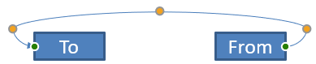

## **अवलोकन**

कनेक्टर एक रेखा है जो दो आकारों से जुड़ी रह सकती है जब भी कोई भी आकार हिले। इसके सिरों का जुड़ाव कनेक्शन साइट्स से होता है, जो PowerPoint में हरे बिंदुओं द्वारा दर्शाए जाते हैं। कुछ मोड़े हुए और घुमावदार कनेक्टर भी समायोजन बिंदु उज्ज्वल नारंगी बिंदुओं द्वारा प्रदर्शित करते हैं, जो व्यक्तिगत कनेक्टर खंडों की स्थिति को नियंत्रित करते हैं।

Aspose.Slides कनेक्टरों को [IConnector](https://reference.aspose.com/slides/hi/androidjava/com.aspose.slides/iconnector/) इंटरफ़ेस के माध्यम से प्रतिनिधित्व करता है। आप इन्हें बना सकते हैं, उनके सिरों को आकारों से जोड़ सकते हैं, कनेक्शन साइट्स चुन सकते हैं, उन्हें पुन:मार्गित कर सकते हैं, और उन कनेक्टरों की ज्यामिति को संशोधित कर सकते हैं जिनमें समायोजन बिंदु होते हैं।

## **कनेक्टर प्रकार**

[ShapeType](https://reference.aspose.com/slides/hi/androidjava/com.aspose.slides/shapetype/) वर्ग में सीधी, मोड़ी हुई, और घुमावदार कनेक्टर प्रीसेट शामिल हैं। नीचे दी गई तालिका उपलब्ध कनेक्टर ज्यामितियों और प्रत्येक प्रीसेट द्वारा परिभाषित समायोजन बिंदुओं की संख्या दिखाती है।

| कनेक्टर | छवि | समायोजन बिंदुओं की संख्या |
|---|---|---|
| `ShapeType.Line` |  | 0 |
| `ShapeType.StraightConnector1` |  | 0 |
| `ShapeType.BentConnector2` |  | 0 |
| `ShapeType.BentConnector3` |  | 1 |
| `ShapeType.BentConnector4` |  | 2 |
| `ShapeType.BentConnector5` |  | 3 |
| `ShapeType.CurvedConnector2` |  | 0 |
| `ShapeType.CurvedConnector3` |  | 1 |
| `ShapeType.CurvedConnector4` |  | 2 |
| `ShapeType.CurvedConnector5` |  | 3 |

समायोजन बिंदुओं की संख्या और अर्थ चयनित कनेक्टर प्रीसेट का भाग होते हैं। यह न मानें कि दो अलग-अलग कनेक्टर प्रकार समान संग्रह लेआउट दर्शाते हैं।

## **दो आकारों को जोड़ें**

[IShapeCollection.addConnector](https://reference.aspose.com/slides/hi/androidjava/com.aspose.slides/ishapecollection/#addConnector-int-float-float-float-float-) का उपयोग करके कनेक्टर जोड़ें, और [IConnector.setStartShapeConnectedTo](https://reference.aspose.com/slides/hi/androidjava/com.aspose.slides/iconnector/#setStartShapeConnectedTo-com.aspose.slides.IShape-) तथा [IConnector.setEndShapeConnectedTo](https://reference.aspose.com/slides/hi/androidjava/com.aspose.slides/iconnector/#setEndShapeConnectedTo-com.aspose.slides.IShape-) का उपयोग करके उसके सिरों को संलग्न करें। दोनों सिरों के जुड़ने के बाद, [IConnector.reroute](https://reference.aspose.com/slides/hi/androidjava/com.aspose.slides/iconnector/#reroute--) आकारों के बीच एक छोटा मार्ग चुनता है।

निम्न उदाहरण एक अण्डाकार और एक आयत को मोड़े हुए कनेक्टर से जोड़ता है:

```java
import com.aspose.slides.*;

Presentation presentation = new Presentation();
try {
    ISlide slide = presentation.getSlides().get_Item(0);

    IAutoShape ellipse = slide.getShapes().addAutoShape(ShapeType.Ellipse, 40, 80, 120, 80);
    IAutoShape rectangle = slide.getShapes().addAutoShape(ShapeType.Rectangle, 320, 240, 140, 80);
    IConnector connector = slide.getShapes().addConnector(ShapeType.BentConnector2, 0, 0, 10, 10);

    connector.setStartShapeConnectedTo(ellipse);
    connector.setEndShapeConnectedTo(rectangle);
    connector.reroute();

    presentation.save("connected-shapes.pptx", SaveFormat.Pptx);
} finally {
    presentation.dispose();
}
```

{}
`reroute` को कॉल करने से [setStartShapeConnectionSiteIndex](https://reference.aspose.com/slides/hi/androidjava/com.aspose.slides/iconnector/#setStartShapeConnectionSiteIndex-long-) और [setEndShapeConnectionSiteIndex](https://reference.aspose.com/slides/hi/androidjava/com.aspose.slides/iconnector/#setEndShapeConnectionSiteIndex-long-) मान बदल सकते हैं। यदि उन साइटों को स्थिर रखना है तो पुन:मार्गित करने के बाद विशिष्ट कनेक्शन साइट्स असाइन करें।
{}

## **कनेक्शन साइट चुनें**

प्रत्येक कनेक्टेबल आकार अपनी साइटों की संख्या [IShape.getConnectionSiteCount](https://reference.aspose.com/slides/hi/androidjava/com.aspose.slides/ishape/#getConnectionSiteCount--) के माध्यम से रिपोर्ट करता है। कनेक्टर के किसी भी सिर को असाइन करने से पहले वांछित शून्य-आधारित साइट सूचकांक को मान्य करें; साइट की गिनती आकार की ज्यामिति के अनुसार बदलती है।

यह उदाहरण अण्डाकार पर एक विशिष्ट साइट पर कनेक्टर को तब संलग्न करता है जब वह साइट मौजूद हो:

```java
import com.aspose.slides.*;

Presentation presentation = new Presentation();
try {
    ISlide slide = presentation.getSlides().get_Item(0);

    IAutoShape ellipse = slide.getShapes().addAutoShape(ShapeType.Ellipse, 40, 80, 120, 80);
    IAutoShape rectangle = slide.getShapes().addAutoShape(ShapeType.Rectangle, 320, 240, 140, 80);
    IConnector connector = slide.getShapes().addConnector(ShapeType.BentConnector3, 0, 0, 10, 10);

    connector.setStartShapeConnectedTo(ellipse);
    connector.setEndShapeConnectedTo(rectangle);

    long preferredSiteIndex = 2;
    if (preferredSiteIndex < ellipse.getConnectionSiteCount()) {
        connector.setStartShapeConnectionSiteIndex(preferredSiteIndex);
    } else {
        System.out.println("The ellipse has only " + ellipse.getConnectionSiteCount() + " connection sites.");
    }

    presentation.save("specific-connection-site.pptx", SaveFormat.Pptx);
} finally {
    presentation.dispose();
}
```

## **कनेक्टर बिंदु समायोजित करें**

समायोजन बिंदुओं वाले कनेक्टर इन्हें [IGeometryShape.getAdjustments](https://reference.aspose.com/slides/hi/androidjava/com.aspose.slides/igeometryshape/#getAdjustments--) के द्वारा उजागर करते हैं। प्रत्येक [IAdjustValue](https://reference.aspose.com/slides/hi/androidjava/com.aspose.slides/iadjustvalue/) का निरीक्षण करें और उसे बदलने से पहले उसके [getType](https://reference.aspose.com/slides/hi/androidjava/com.aspose.slides/iadjustvalue/#getType--) मान की जाँच करें, जिसे आप [setRawValue](https://reference.aspose.com/slides/hi/androidjava/com.aspose.slides/iadjustvalue/#setRawValue-long-) के साथ बदल सकते हैं। प्रीसेट आकार समायोजनों की पहचान के सामान्य नियम [Shape Manipulation](/slides/hi/androidjava/shape-manipulations/) में वर्णित हैं।

कनेक्टर समायोजनों की संख्या, क्रम, अर्थ और मान्य मान सीमा कनेक्टर प्रीसेट पर निर्भर करती है। समायोजन प्रकार केवल-पढ़ने योग्य है, जबकि समायोजन मान लिखने योग्य है। केवल-पढ़ने योग्य [getName](https://reference.aspose.com/slides/hi/androidjava/com.aspose.slides/iadjustvalue/#getName--) मेथड अतिरिक्त पहचान प्रदान करता है जब कनेक्टर में समान अर्थ वाले कई समायोजन होते हैं।

### **एक बाधा के चारों ओर मार्ग**

निम्न लेआउट में, दो आकारों के बीच एक `BentConnector5` कनेक्टर तीसरे आकार के माध्यम से गुजरता है:


यह कोड बाधित कनेक्टर बनाता है:

```java
import com.aspose.slides.*;
import android.graphics.Color;

Presentation presentation = new Presentation();
try {
    ISlide slide = presentation.getSlides().get_Item(0);

    slide.getShapes().addAutoShape(ShapeType.Rectangle, 300, 150, 150, 75);
    IAutoShape sourceShape = slide.getShapes().addAutoShape(ShapeType.Rectangle, 500, 400, 100, 50);
    IAutoShape targetShape = slide.getShapes().addAutoShape(ShapeType.Rectangle, 100, 100, 70, 30);
    IConnector connector = slide.getShapes().addConnector(ShapeType.BentConnector5, 20, 20, 400, 300);

    connector.getLineFormat().setEndArrowheadStyle(LineArrowheadStyle.Triangle);
    connector.getLineFormat().getFillFormat().setFillType(FillType.Solid);
    connector.getLineFormat().getFillFormat().getSolidFillColor().setColor(Color.BLACK);
    connector.setStartShapeConnectedTo(sourceShape);
    connector.setEndShapeConnectedTo(targetShape);
    connector.setStartShapeConnectionSiteIndex(2);

    presentation.save("connector-obstruction.pptx", SaveFormat.Pptx);
} finally {
    presentation.dispose();
}
```

वर्टिकल मोड़ को हलाने से मार्ग बदल जाता है जिससे कनेक्टर बाधा को बायपास करता है:


संग्रह सूचकांक `1` हमेशा वर्टिकल मोड़ दर्शाता है, यह मानने के बजाय, यह उदाहरण `ConnectorBendPositionY` को खोजता है और केवल तब बदलता है जब अपेक्षित अर्थ वाला प्रकार मौजूद हो:

```java
import com.aspose.slides.*;
import android.graphics.Color;

Presentation presentation = new Presentation();
try {
    ISlide slide = presentation.getSlides().get_Item(0);

    slide.getShapes().addAutoShape(ShapeType.Rectangle, 300, 150, 150, 75);
    IAutoShape sourceShape = slide.getShapes().addAutoShape(ShapeType.Rectangle, 500, 400, 100, 50);
    IAutoShape targetShape = slide.getShapes().addAutoShape(ShapeType.Rectangle, 100, 100, 70, 30);
    IConnector connector = slide.getShapes().addConnector(ShapeType.BentConnector5, 20, 20, 400, 300);

    connector.getLineFormat().setEndArrowheadStyle(LineArrowheadStyle.Triangle);
    connector.getLineFormat().getFillFormat().setFillType(FillType.Solid);
    connector.getLineFormat().getFillFormat().getSolidFillColor().setColor(Color.BLACK);
    connector.setStartShapeConnectedTo(sourceShape);
    connector.setEndShapeConnectedTo(targetShape);
    connector.setStartShapeConnectionSiteIndex(2);

    IAdjustValue verticalBend = null;
    for (int adjustmentIndex = 0; adjustmentIndex < connector.getAdjustments().size(); adjustmentIndex++) {
        IAdjustValue adjustment = connector.getAdjustments().get_Item(adjustmentIndex);
        System.out.println(adjustment.getName() + ": " + adjustment.getType() + ", raw value = " + adjustment.getRawValue());
        if (adjustment.getType() == ShapeAdjustmentType.ConnectorBendPositionY) {
            verticalBend = adjustment;
            break;
        }
    }

    if (verticalBend == null) {
        System.out.println("The connector does not expose a vertical bend adjustment.");
    } else {
        verticalBend.setRawValue(60000);
        presentation.save("connector-obstruction-fixed.pptx", SaveFormat.Pptx);
    }
} finally {
    presentation.dispose();
}
```

`BentConnector5` में दो `ConnectorBendPositionX` समायोजन और एक `ConnectorBendPositionY` समायोजन होता है। यदि आपको आवश्यक प्रकार एक से अधिक बार आता है, तो चयन करने से पहले `getName` और उस प्रीसेट की ज्ञात ज्यामिति देखें। यदि किसी समायोजन का `ShapeAdjustmentType.Custom` रिपोर्ट किया जाता है, तो उसके अर्थ और सीमा को प्रीसेट-विशिष्ट मानें और तब तक न बदलें जब तक वह अनुबंध ज्ञात न हो।

## **समायोजन मानों को कनेक्टर ज्यामिति से सम्बंधित करें**

बेंडेड कनेक्टरों के लिए, समायोजन मानों का उपयोग व्यक्तिगत खंडों की स्थितियों का अनुमान लगाने के लिए किया जा सकता है। ये गणनाएँ कनेक्टर प्रीसेट के अनुसार विशिष्ट हैं:

- `BentConnector4` सामान्यतः एक `ConnectorBendPositionX` और एक `ConnectorBendPositionY` समायोजन उजागर करता है।
- इन मोड़ स्थितियों के लिए, `getRawValue` द्वारा लौटाए गए मान को `100000f` से विभाजित करने से कनेक्टर फ्रेम की चौड़ाई या ऊँचाई के भाग का अंश प्राप्त होता है, जैसा कि नीचे के उदाहरणों में दिखाया गया है।
- कनेक्टर फ्रेम को घुमाया या उल्टा किया जा सकता है, इसलिए फ्रेम निर्देशांक को स्लाइड निर्देशांक के साथ तुलना करने से पहले रूपांतरित किया जाना चाहिए।

निम्न उदाहरण `getType` का उपयोग करके पहले समायोजन की पहचान करते हैं। वे संग्रह सूचकांकों को पोर्टेबल पहचानकर्ता नहीं मानते।

### **अघूर्णित कनेक्टर**

प्रारंभिक लेआउट में दो टेक्स्ट आकार एक `BentConnector4` द्वारा जुड़े हुए हैं:


यह उदाहरण कनेक्टर का निरीक्षण करता है और उसके क्षैतिज तथा लंबवत मोड़ समायोजन प्राप्त करता है:

```java
import com.aspose.slides.*;
import android.graphics.Color;

Presentation presentation = new Presentation();
try {
    ISlide slide = presentation.getSlides().get_Item(0);

    IAutoShape sourceShape = slide.getShapes().addAutoShape(ShapeType.Rectangle, 100, 100, 60, 25);
    sourceShape.getTextFrame().setText("From");
    IAutoShape targetShape = slide.getShapes().addAutoShape(ShapeType.Rectangle, 500, 100, 60, 25);
    targetShape.getTextFrame().setText("To");
    IConnector connector = slide.getShapes().addConnector(ShapeType.BentConnector4, 20, 20, 400, 300);

    connector.getLineFormat().setEndArrowheadStyle(LineArrowheadStyle.Triangle);
    connector.getLineFormat().getFillFormat().setFillType(FillType.Solid);
    connector.getLineFormat().getFillFormat().getSolidFillColor().setColor(Color.RED);
    connector.getLineFormat().setWidth(3);
    connector.setStartShapeConnectedTo(sourceShape);
    connector.setStartShapeConnectionSiteIndex(3);
    connector.setEndShapeConnectedTo(targetShape);
    connector.setEndShapeConnectionSiteIndex(2);

    for (int adjustmentIndex = 0; adjustmentIndex < connector.getAdjustments().size(); adjustmentIndex++) {
        IAdjustValue adjustment = connector.getAdjustments().get_Item(adjustmentIndex);
        System.out.println(adjustment.getName() + ": " + adjustment.getType() + ", raw value = " + adjustment.getRawValue());
    }
} finally {
    presentation.dispose();
}
```

दोनों मोड़ों को बदलने के लिए, प्रत्येक प्रत्याशित प्रकार का पता लगाएँ और दोनों मिलने के बाद ही मान बदलें:

```java
import com.aspose.slides.*;

Presentation presentation = new Presentation();
try {
    ISlide slide = presentation.getSlides().get_Item(0);

    IAutoShape sourceShape = slide.getShapes().addAutoShape(ShapeType.Rectangle, 100, 100, 60, 25);
    IAutoShape targetShape = slide.getShapes().addAutoShape(ShapeType.Rectangle, 500, 100, 60, 25);
    IConnector connector = slide.getShapes().addConnector(ShapeType.BentConnector4, 20, 20, 400, 300);
    connector.setStartShapeConnectedTo(sourceShape);
    connector.setStartShapeConnectionSiteIndex(3);
    connector.setEndShapeConnectedTo(targetShape);
    connector.setEndShapeConnectionSiteIndex(2);

    IAdjustValue horizontalBend = null;
    IAdjustValue verticalBend = null;
    for (int adjustmentIndex = 0; adjustmentIndex < connector.getAdjustments().size(); adjustmentIndex++) {
        IAdjustValue adjustment = connector.getAdjustments().get_Item(adjustmentIndex);
        if (adjustment.getType() == ShapeAdjustmentType.ConnectorBendPositionX) {
            horizontalBend = adjustment;
        } else if (adjustment.getType() == ShapeAdjustmentType.ConnectorBendPositionY) {
            verticalBend = adjustment;
        }
    }

    if (horizontalBend == null || verticalBend == null) {
        System.out.println("The connector does not expose the expected bend adjustments.");
    } else {
        horizontalBend.setRawValue(horizontalBend.getRawValue() + 20000);
        verticalBend.setRawValue(verticalBend.getRawValue() + 200000);
        presentation.save("connector-adjusted.pptx", SaveFormat.Pptx);
    }
} finally {
    presentation.dispose();
}
```

परिणामस्वरूप एक कनेक्टर प्राप्त होता है जिसकी क्षैतिज और लंबवत खंड स्थानांतरित हो गए हैं:


एक बार अर्थवान प्रकार ज्ञात हो जाने पर, उनके मान को कनेक्टर‑फ़्रेम निर्देशांकों में परिवर्तित किया जा सकता है। यह उदाहरण दो मोड़ समायोजन द्वारा नियंत्रित लंबवत खंड के ऊपर एक पतली आयत बनाता है:

```java
import com.aspose.slides.*;

Presentation presentation = new Presentation();
try {
    ISlide slide = presentation.getSlides().get_Item(0);

    IAutoShape sourceShape = slide.getShapes().addAutoShape(ShapeType.Rectangle, 100, 100, 60, 25);
    IAutoShape targetShape = slide.getShapes().addAutoShape(ShapeType.Rectangle, 500, 100, 60, 25);
    IConnector connector = slide.getShapes().addConnector(ShapeType.BentConnector4, 20, 20, 400, 300);
    connector.setStartShapeConnectedTo(sourceShape);
    connector.setStartShapeConnectionSiteIndex(3);
    connector.setEndShapeConnectedTo(targetShape);
    connector.setEndShapeConnectionSiteIndex(2);

    IAdjustValue horizontalBend = null;
    IAdjustValue verticalBend = null;
    for (int adjustmentIndex = 0; adjustmentIndex < connector.getAdjustments().size(); adjustmentIndex++) {
        IAdjustValue adjustment = connector.getAdjustments().get_Item(adjustmentIndex);
        if (adjustment.getType() == ShapeAdjustmentType.ConnectorBendPositionX) {
            horizontalBend = adjustment;
        } else if (adjustment.getType() == ShapeAdjustmentType.ConnectorBendPositionY) {
            verticalBend = adjustment;
        }
    }

    if (horizontalBend == null || verticalBend == null) {
        System.out.println("The connector does not expose the expected bend adjustments.");
    } else {
        float x = connector.getX() + connector.getWidth() * horizontalBend.getRawValue() / 100000f;
        float y = connector.getY();
        float height = connector.getHeight() * verticalBend.getRawValue() / 100000f;
        slide.getShapes().addAutoShape(ShapeType.Rectangle, x, y, 1, height);
        presentation.save("connector-segment-guide.pptx", SaveFormat.Pptx);
    }
} finally {
    presentation.dispose();
}
```

मार्गदर्शक आकार गणना किए गए खंड को चिह्नित करता है:


### **घूमाया या उल्टा कनेक्टर**

जब समान कनेक्टर ज्यामिति लंबवत रूप से अभिविन्यस्त होती है, तो उसके [IShape.getFrame](https://reference.aspose.com/slides/hi/androidjava/com.aspose.slides/ishape/#getFrame--), [ShapeFrame.getFlipH](https://reference.aspose.com/slides/hi/androidjava/com.aspose.slides/shapeframe/#getFlipH--), और [ShapeFrame.getFlipV](https://reference.aspose.com/slides/hi/androidjava/com.aspose.slides/shapeframe/#getFlipV--) मान कनेक्टर‑फ़्रेम निर्देशांक से स्लाइड निर्देशांक में रूपांतरण को प्रभावित करते हैं।

यह उदाहरण लंबवत अभिविन्यस्त कनेक्टर बनाता और समायोजित करता है:

```java
import com.aspose.slides.*;
import android.graphics.Color;

Presentation presentation = new Presentation();
try {
    ISlide slide = presentation.getSlides().get_Item(0);

    IAutoShape sourceShape = slide.getShapes().addAutoShape(ShapeType.Rectangle, 100, 100, 60, 25);
    sourceShape.getTextFrame().setText("From");
    IAutoShape targetShape = slide.getShapes().addAutoShape(ShapeType.Rectangle, 100, 400, 60, 25);
    targetShape.getTextFrame().setText("To 1");
    IConnector connector = slide.getShapes().addConnector(ShapeType.BentConnector4, 20, 20, 400, 300);

    connector.getLineFormat().setEndArrowheadStyle(LineArrowheadStyle.Triangle);
    connector.getLineFormat().getFillFormat().setFillType(FillType.Solid);
    int connectorColor = Color.rgb(102, 205, 170);
    connector.getLineFormat().getFillFormat().getSolidFillColor().setColor(connectorColor);
    connector.getLineFormat().setWidth(3);
    connector.setStartShapeConnectedTo(sourceShape);
    connector.setStartShapeConnectionSiteIndex(2);
    connector.setEndShapeConnectedTo(targetShape);
    connector.setEndShapeConnectionSiteIndex(3);

    for (int adjustmentIndex = 0; adjustmentIndex < connector.getAdjustments().size(); adjustmentIndex++) {
        IAdjustValue adjustment = connector.getAdjustments().get_Item(adjustmentIndex);
        if (adjustment.getType() == ShapeAdjustmentType.ConnectorBendPositionX) {
            adjustment.setRawValue(adjustment.getRawValue() + 20000);
        } else if (adjustment.getType() == ShapeAdjustmentType.ConnectorBendPositionY) {
            adjustment.setRawValue(adjustment.getRawValue() + 200000);
        }
    }

    presentation.save("vertical-connector-adjusted.pptx", SaveFormat.Pptx);
} finally {
    presentation.dispose();
}
```

समायोजित कनेक्टर आकारों के बीच लंबवत दिखाई देता है:


किसी भी मनमाने घूर्णन कोण `alpha` के लिए, कनेक्टर‑फ़्रेम बिंदु `(x, y)` को फ्रेम केंद्र `(x0, y0)` के चारों ओर घुमाएँ:

`X = (x - x0) * cos(alpha) - (y - y0) * sin(alpha) + x0`

`Y = (x - x0) * sin(alpha) + (y - y0) * cos(alpha) + y0`

निम्न कोड इस उदाहरण में उपयोग किए गए 90‑डिग्री अभिविन्यस्त को संभालता है और संबंधित कनेक्टर खंड के ऊपर लाल मार्गदर्शक रेखा बनाता है:

```java
import com.aspose.slides.*;
import android.graphics.Color;

Presentation presentation = new Presentation();
try {
    ISlide slide = presentation.getSlides().get_Item(0);

    IAutoShape sourceShape = slide.getShapes().addAutoShape(ShapeType.Rectangle, 100, 100, 60, 25);
    IAutoShape targetShape = slide.getShapes().addAutoShape(ShapeType.Rectangle, 100, 400, 60, 25);
    IConnector connector = slide.getShapes().addConnector(ShapeType.BentConnector4, 20, 20, 400, 300);
    connector.setStartShapeConnectedTo(sourceShape);
    connector.setStartShapeConnectionSiteIndex(2);
    connector.setEndShapeConnectedTo(targetShape);
    connector.setEndShapeConnectionSiteIndex(3);

    IAdjustValue horizontalBend = null;
    IAdjustValue verticalBend = null;
    for (int adjustmentIndex = 0; adjustmentIndex < connector.getAdjustments().size(); adjustmentIndex++) {
        IAdjustValue adjustment = connector.getAdjustments().get_Item(adjustmentIndex);
        if (adjustment.getType() == ShapeAdjustmentType.ConnectorBendPositionX) {
            horizontalBend = adjustment;
        } else if (adjustment.getType() == ShapeAdjustmentType.ConnectorBendPositionY) {
            verticalBend = adjustment;
        }
    }

    if (horizontalBend == null || verticalBend == null) {
        System.out.println("The connector does not expose the expected bend adjustments.");
    } else {
        horizontalBend.setRawValue(horizontalBend.getRawValue() + 20000);
        verticalBend.setRawValue(verticalBend.getRawValue() + 200000);

        float x = connector.getX();
        float y = connector.getY();
        if (connector.getFrame().getFlipH() == NullableBool.True) {
            x += connector.getWidth();
        }
        if (connector.getFrame().getFlipV() == NullableBool.True) {
            y += connector.getHeight();
        }

        x += connector.getWidth() * horizontalBend.getRawValue() / 100000f;
        float rotatedX = connector.getFrame().getCenterX() - y + connector.getFrame().getCenterY();
        float rotatedY = x - connector.getFrame().getCenterX() + connector.getFrame().getCenterY();
        float segmentWidth = connector.getHeight() * verticalBend.getRawValue() / 100000f;
        IAutoShape guide = slide.getShapes().addAutoShape(ShapeType.Rectangle, rotatedX, rotatedY, segmentWidth, 1);
        guide.getLineFormat().getFillFormat().setFillType(FillType.Solid);
        guide.getLineFormat().getFillFormat().getSolidFillColor().setColor(Color.RED);

        presentation.save("rotated-connector-segment-guide.pptx", SaveFormat.Pptx);
    }
} finally {
    presentation.dispose();
}
```

कोऑर्डिनेट रूपांतरण के बाद लाल मार्गदर्शक गणना किए गए खंड को चिह्नित करता है:


ये सूत्र उदाहरणों में उपयोग किए गए प्रीसेट को दर्शाते हैं, न कि एक सार्वभौमिक कनेक्टर मॉडल को। समान गणना को किसी अन्य प्रीसेट पर लागू करने से पहले समायोजन प्रकार, फ्रेम अभिविन्यास और मान रेंज की पुष्टि करें।

## **कनेक्टर दिशा कोण खोजें**

सीधी कनेक्टर की दिशा उसकी चौड़ाई और ऊँचाई से, क्षैतिज और लंबवत फ़्लिप लागू करके गणना की जा सकती है। निम्न उदाहरण स्लाइड निर्देशांकों में सकारात्मक क्षैतिज अक्ष से घड़ी की दिशा में कोनीय मान रिपोर्ट करता है:

```java
import com.aspose.slides.*;

Presentation presentation = new Presentation();
try {
    ISlide slide = presentation.getSlides().get_Item(0);
    IConnector connector = slide.getShapes().addConnector(ShapeType.StraightConnector1, 100, 100, 200, 100);

    boolean flipH = connector.getFrame().getFlipH() == NullableBool.True;
    boolean flipV = connector.getFrame().getFlipV() == NullableBool.True;
    float deltaX = connector.getWidth() * (flipH ? -1 : 1);
    float deltaY = connector.getHeight() * (flipV ? -1 : 1);
    double angle = Math.atan2(deltaY, deltaX) * 180.0 / Math.PI;

    if (angle < 0) {
        angle += 360;
    }

    System.out.printf("Connector direction: %.2f degrees%n", angle);
} finally {
    presentation.dispose();
}
```

## **प्रश्नोत्तर**

**मैं कैसे पता करूँ कि कनेक्टर किसी आकार से जुड़ सकता है?**  
आकार की [getConnectionSiteCount](https://reference.aspose.com/slides/hi/androidjava/com.aspose.slides/ishape/#getConnectionSiteCount--) मान जाँचें। सकारात्मक मान का अर्थ है कि आकार कनेक्शन साइट्स प्रदान करता है। कनेक्टर के किसी भी सिर को असाइन करने से पहले चयनित साइट सूचकांक को मान्य करें, क्योंकि साइट गणना आकार की ज्यामिति पर निर्भर करती है।

**क्या मैं कनेक्टर समायोजन को उसके संग्रह सूचकांक से पहचान सकता हूँ?**  
सूचकांक केवल ज्ञात कनेक्टर प्रीसेट और संग्रह लेआउट के लिए मायने रखता है। किसी मान को बदलने से पहले [IAdjustValue.getType](https://reference.aspose.com/slides/hi/androidjava/com.aspose.slides/iadjustvalue/#getType--) जाँचें, और जब समान अर्थ वाला प्रकार कई बार मौजूद हो तो अतिरिक्त जानकारी के लिए [IAdjustValue.getName](https://reference.aspose.com/slides/hi/androidjava/com.aspose.slides/iadjustvalue/#getName--) का उपयोग करें।

**जब जुड़ा हुआ आकार हटाया जाता है तो क्या होता है?**  
संबंधित कनेक्टर का सिर डिटैच हो जाता है। कनेक्टर स्लाइड पर बना रहता है और उसे हटाया जा सकता है, स्वतंत्र रेखा के रूप में स्थित किया जा सकता है, या किसी अन्य आकार से फिर से जोड़ सकते हैं।

**क्या स्लाइड कॉपी करने पर कनेक्टर बाइंडिंग्स संरक्षित रहती हैं?**  
सामान्यतः बाइंडिंग्स संरक्षित रहती हैं जब जुड़े आकार स्लाइड के साथ कॉपी किए जाते हैं। यदि कनेक्टर को उसकी लक्ष्य आकारों में से किसी एक के बिना कॉपी किया गया है, तो प्रभावित सिर को फिर से संलग्न करना होगा।