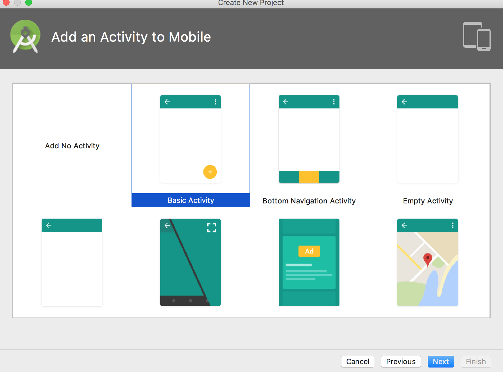
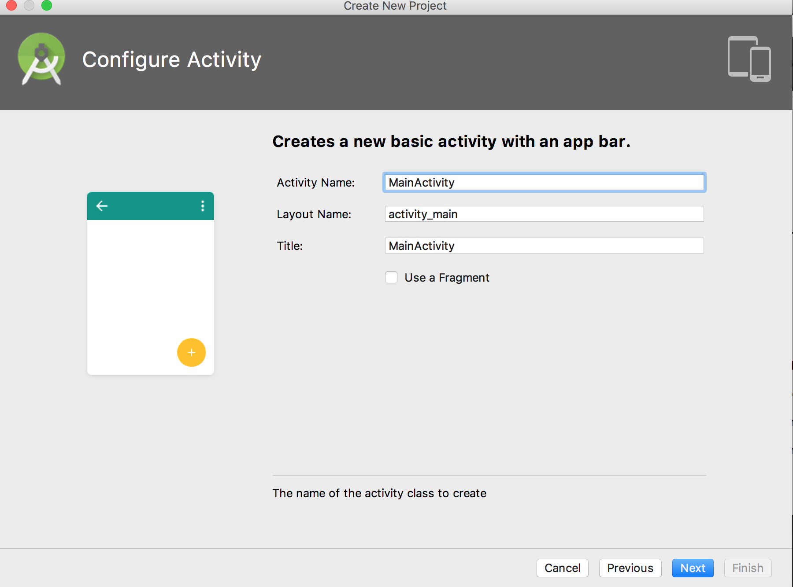

## **परिचय**

यह लेख बताता है कि Aspose.Slides for Android via Java को कैसे स्थापित करें और इसे Android प्रोजेक्ट में कैसे जोड़ें। यह दो स्थापित विकल्पों का वर्णन करता है: Aspose.Slides JAR फ़ाइल को मैन्युअल रूप से प्रोजेक्ट में जोड़ना और Maven रिपॉजिटरी से लाइब्रेरी स्थापित करना।

यह लेख एक चरण-दर-चरण उदाहरण भी प्रदान करता है जो दिखाता है कि Android Studio में नया Android एप्लिकेशन कैसे बनाएं, Aspose.Slides लाइब्रेरी को संदर्भित करें, प्रोग्रामेटिक रूप से PowerPoint प्रस्तुति बनाएं और उसे PPTX प्रारूप में सहेजें। इसमें संस्करण जानकारी के नोट्स और एकीकरण की पुष्टि, मेमोरी उपयोग प्रबंधन, तथा अंतिम JAR आकार को घटाने से संबंधित सामान्य प्रश्नों के उत्तर भी शामिल हैं।

## **स्थापना**
पहले, Aspose.Slides for Android via Java को एकल ZIP फ़ाइल के रूप में वितरित किया जाता था, जिसमें JAR फ़ाइल, डेमो, और उत्पाद दस्तावेज़ शामिल होते थे। 

1. यदि आप Aspose.Words for Android via Java 18.9 से पुराने संस्करण का उपयोग करना चाहते हैं, तो आपको Aspose.Slides.Android.zip के उस संस्करण को अपनी पसंदीदा डायरेक्टरी में अनज़िप करना होगा। 
1. निकालिए गई Jar फ़ाइल को Build Path कॉन्फ़िगरेशन का उपयोग करके अपने एप्लिकेशन में जोड़ें। 
### **Aspose.Slides for Android via Java Jar का संदर्भ जोड़ें**
1. डाउनलोड करें नवीनतम संस्करण [Aspose.Slides for Android via Java](https://downloads.aspose.com/slides/hi/androidjava)
1. aspose-slides-18.9-android.via.java.jar को अपने प्रोजेक्ट के *libs/*फ़ोल्डर में कॉपी करें


### **Maven रिपॉजिटरी से Aspose.Slides for Android via Java स्थापित करें**
1. अपने build.gradle में Maven रिपॉजिटरी जोड़ें। 
1. [Aspose.Slides for Android via Java](https://releases.aspose.com/java/repo/com/aspose/aspose-slides/) JAR को एक निर्भरता के रूप में जोड़ें।

``` java

 // 1. अपने build.gradle में maven रिपॉजिटरी जोड़ें 

repositories {

    mavenCentral()

    maven { url "https://releases.aspose.com/java/repo/" }

}

// 2. 'Aspose.Slides for Android via Java' JAR को एक निर्भरता के रूप में जोड़ें

dependencies {

    ...

    ...

    compile (group: 'com.aspose', name: 'aspose-slides', version: 'XX.XX', classifier: 'android.via.java')

}

```
## **Aspose.Slides for Android via Java का उपयोग करके आपका पहला एप्लिकेशन**
इस खंड में, आप सीखेंगे कि Aspose.Slides for Android via Java के साथ कैसे प्रारंभ करें। हम आपको दिखाएंगे कि कैसे नया Android प्रोजेक्ट शुरू से सेटअप करें, Aspose.Slides JAR का संदर्भ जोड़ें, और नई PowerPoint प्रस्तुति बनाकर उसे PPTX प्रारूप में डिस्क पर सहेजें। उदाहरण यहाँ [Android Studio](https://developer.android.com/studio/index.html) का उपयोग करता है और एप्लिकेशन Android Emulator पर चलाया जाता है। Aspose.Slides for Android via Java के साथ शुरू करने के लिए, इस चरण-दर-चरण ट्यूटोरियल का पालन करके एक ऐप बनायें जो Aspose.Slides for Android via Java का उपयोग करता हो:

1. डाउनलोड करें और [Android Studio](https://developer.android.com/studio/index.html) को किसी भी स्थान पर स्थापित करें। 
1. Android Studio चलाएँ। 
1. एक नया Android एप्लिकेशन प्रोजेक्ट बनाएँ।






1. aspose-slides-XX.XX-android.via.java.jar को अपने प्रोजेक्ट के libs/फ़ोल्डर में कॉपी करें


1. फ़ाइल मेन्यू से Project सेक्शन चुनें और Dependencies टैब पर क्लिक करें।
   1. “+” बटन पर क्लिक करें। फ़ाइल निर्भरता विकल्प चुनें।
   1. libs फ़ोल्डर से Aspose.Slides लाइब्रेरी चुनें और OK पर क्लिक करें।


1. यदि आवश्यक हो तो प्रोजेक्ट को Gradle फ़ाइलों के साथ सिंक करें। 


1. SDcard तक पहुँचने के लिए विशेष अनुमतियों को जोड़ना आवश्यक है। AndroidManifest.xml फ़ाइल पर क्लिक करें और XML दृश्य चुनें। फ़ाइल में यह लाइन जोड़ें <uses-permission android:name="android.permission.WRITE_EXTERNAL_STORAGE" />


1. ऐप के कोड सेक्शन में वापस जाएँ और ये इम्पोर्ट जोड़ें: 

``` java

 import java.io.File;

import com.aspose.slides.IAutoShape;

import com.aspose.slides.IParagraph;

import com.aspose.slides.IPortion;

import com.aspose.slides.ISlide;

import com.aspose.slides.ITextFrame;

import com.aspose.slides.Presentation;

import com.aspose.slides.SaveFormat;

import com.aspose.slides.ShapeType;

import android.os.Environment; 

```

अब, इस कोड को onCreate मेथड के शरीर में डालें ताकि Aspose.Slides का उपयोग करके शून्य से नई Presentation बनाकर उसे SDCard में PPTX प्रारूप में सहेजा जा सके।

``` java

 try
{
    // PPTX का प्रतिनिधित्व करने वाले Presentation क्लास का उदाहरण बनाएं
    Presentation pres = new Presentation();

    // पहली स्लाइड तक पहुँचें
    ISlide sld = pres.getSlides().get_Item(0);

    // Rectangle प्रकार का AutoShape जोड़ें
    IAutoShape ashp = sld.getShapes().addAutoShape(ShapeType.Rectangle, 150, 75, 150, 50);

    // Rectangle में TextFrame जोड़ें
    ashp.addTextFrame(" ");

    // TextFrame तक पहुँच रहा है
    ITextFrame txtFrame = ashp.getTextFrame();

    // TextFrame के लिए Paragraph ऑब्जेक्ट बनाएं
    IParagraph para = txtFrame.getParagraphs().get_Item(0);

    // Paragraph के लिए Portion ऑब्जेक्ट बनाएं
    IPortion portion = para.getPortions().get_Item(0);

    // टेक्स्ट सेट करें
    portion.setText("Aspose TextBox");

    // PPTX को कार्ड पर सहेजें
    String sdCardPath = Environment.getExternalStorageDirectory().getPath() + File.separator;
    pres.save(sdCardPath + "Textbox.pptx",SaveFormat.Pptx);
}
catch (Exception e)
{
   e.printStackTrace();
}
```

पूरा कोड इस प्रकार दिखना चाहिए:


1. अब एप्लिकेशन को फिर से चलाएँ। इस बार, Aspose.Slides कोड पृष्ठभूमि में चलेगा और एक दस्तावेज़ उत्पन्न करेगा जिसे SDcard में सहेजा जाएगा।


1. बनाए गए दस्तावेज़ को देखने के लिए, Tools मेन्यू पर जाएँ। Android चुनें और फिर Android Device Monitor चुनें


## **संस्करण**
2018 से, Aspose.Slides for Android via Java का संस्करण Aspose.Slides for Java के साथ मेल खाता है।

## **अक्सर पूछे जाने वाले प्रश्न**

**मैं यह कैसे सुनिश्चित कर सकता हूँ कि Aspose.Slides सही ढंग से एकीकृत हुआ है?**

अपने प्रोजेक्ट को बनाएं, एक खाली [Presentation](https://reference.aspose.com/slides/hi/androidjava/com.aspose.slides/presentation/) को इंस्टैंशिएट करें और उसे नई फ़ाइलनाम से सहेजें। यदि फ़ाइल बिना किसी अपवाद के बन जाती है, तो लाइब्रेरी सफलतापूर्वक एकीकृत हो गई है।

**बड़ी प्रस्तुतियों को प्रोसेस करते समय मेमोरी खपत को कैसे सीमित करूँ?**

JVM मेमोरी सीमाओं को केवल आवश्यकतानुसार ही बढ़ाएँ, और प्रत्येक [Presentation](https://reference.aspose.com/slides/hi/androidjava/com.aspose.slides/presentation/) इंस्टेंस को `finally` ब्लॉक में बंद करें ताकि कैश तुरंत रिलीज़ हो सके। इससे out‑of‑memory त्रुटियों से बचाव होता है और बैच ऑपरेशनों के दौरान कुल मेमोरी उपयोग पूर्वानुमेय रहता है।

**क्या मैं अनचाहे निर्यात फ़ॉर्मेट को बाहर कर अंतिम JAR आकार को छोटा कर सकता हूँ?**

वर्तमान Aspose.Slides रिलीज़ एकल एकीकृत लाइब्रेरी के रूप में वितरित की जाती हैं, इसलिए आप बिल्ड समय पर PDF या SVG जैसे विशिष्ट एक्सपोर्टर्स को निष्क्रिय नहीं कर सकते।