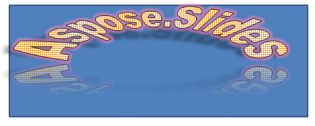

## **परिचय**

WordArt प्रभाव आपको अपने PowerPoint प्रस्तुतियों में दृश्यात्मक रूप से आकर्षक, शैलीबद्ध टेक्स्ट जोड़ने की सुविधा देते हैं। Aspose.Slides के साथ, डेवलपर्स प्रोग्रामैटिक रूप से WordArt को बनाने, अनुकूलित करने और प्रबंधित करने में सक्षम होते हैं, बिलकुल Microsoft PowerPoint की तरह—बिना Office स्थापित किए। यह लेख WordArt के साथ काम करने का अवलोकन प्रदान करता है, जिसमें टेक्स्ट ट्रांसफ़ॉर्मेशन, फ़िल स्टाइल, आउटलाइन, शैडो और अन्य फ़ॉर्मेटिंग विकल्पों को लागू करना शामिल है, ताकि आपकी प्रस्तुति सामग्री अधिक अभिव्यक्तिपूर्ण और आकर्षक बन सके। WordArt आपको टेक्स्ट को एक ग्राफिकल ऑब्जेक्ट की तरह मानने देता है। यह टेक्स्ट पर लागू किए गए प्रभावों या विशेष संशोधनों से बनता है ताकि वह अधिक आकर्षक या ध्यान आकर्षित करने वाला बन सके।

## **एक सरल WordArt टेम्पलेट बनाएं और इसे टेक्स्ट पर लागू करें**

**Aspose.Slides का उपयोग करके** 

पहले, हम इस C++ कोड का उपयोग करके एक सरल टेक्स्ट बनाते हैं: 

``` cpp 
auto pres = System::MakeObject<Presentation>();
auto slide = pres->get_Slides()->idx_get(0);
auto autoShape = slide->get_Shapes()->AddAutoShape(ShapeType::Rectangle, 200.0f, 200.0f, 400.0f, 200.0f);
auto textFrame = autoShape->get_TextFrame();

auto portion = textFrame->get_Paragraphs()->idx_get(0)->get_Portions()->idx_get(0);
portion->set_Text(u"Aspose.Slides");
```

अब, हम इस कोड के माध्यम से टेक्स्ट का फ़ॉन्ट आकार बड़ा रखते हैं ताकि प्रभाव अधिक स्पष्ट दिखे: 

``` cpp 
auto fontData = System::MakeObject<FontData>(u"Arial Black");
portion->get_PortionFormat()->set_LatinFont(fontData);
portion->get_PortionFormat()->set_FontHeight(36.0f);
```

**Microsoft PowerPoint का उपयोग करके**

Microsoft PowerPoint में WordArt प्रभाव मेनू पर जाएं: 


दाएँ मेनू से आप पूर्वनिर्धारित WordArt प्रभाव चुन सकते हैं। बाएँ मेनू से आप नए WordArt के लिए सेटिंग्स निर्धारित कर सकते हैं। 

उपलब्ध पैरामीटर या विकल्पों में से कुछ यह हैं: 


**Aspose.Slides का उपयोग करके**

यहाँ, हम SmallGrid पैटर्न रंग को टेक्स्ट पर लागू करते हैं और इस कोड के जरिए 1‑चौड़ाई का काला टेक्स्ट बॉर्डर जोड़ते हैं: 

``` cpp 
auto fillFormat = portion->get_PortionFormat()->get_FillFormat();
fillFormat->set_FillType(FillType::Pattern);
fillFormat->get_PatternFormat()->get_ForeColor()->set_Color(Color::get_DarkOrange());
fillFormat->get_PatternFormat()->get_BackColor()->set_Color(Color::get_White());
fillFormat->get_PatternFormat()->set_PatternStyle(PatternStyle::SmallGrid);

auto lineFillFormat = portion->get_PortionFormat()->get_LineFormat()->get_FillFormat();
lineFillFormat->set_FillType(FillType::Solid);
lineFillFormat->get_SolidFillColor()->set_Color(Color::get_Black());
```

परिणामी टेक्स्ट: 


## **अन्य WordArt प्रभाव लागू करें**

**Microsoft PowerPoint का उपयोग करके**

प्रोग्राम के इंटरफ़ेस से आप इन प्रभावों को टेक्स्ट, टेक्स्ट ब्लॉक, आकार या समान तत्व पर लागू कर सकते हैं: 


उदाहरण के लिए, Shadow, Reflection और Glow प्रभाव टेक्स्ट पर लागू किए जा सकते हैं; 3D Format और 3D Rotation प्रभाव टेक्स्ट ब्लॉक पर लागू होते हैं; Soft Edges प्रॉपर्टी Shape ऑब्जेक्ट पर लागू हो सकती है (भले ही 3D Format प्रॉपर्टी सेट न हो)। 

### **छाया प्रभाव टेक्स्ट पर लागू करें**

यहाँ, हम केवल टेक्स्ट से संबंधित प्रॉपर्टी सेट करने का इरादा रखते हैं। हम इस C++ कोड के जरिए टेक्स्ट पर शैडो प्रभाव लागू करते हैं: 

``` cpp 
auto effectFormat = portion->get_PortionFormat()->get_EffectFormat();
effectFormat->EnableOuterShadowEffect();

auto outerShadowEffect = effectFormat->get_OuterShadowEffect();
outerShadowEffect->get_ShadowColor()->set_Color(Color::get_Black());
outerShadowEffect->set_ScaleHorizontal(100);
outerShadowEffect->set_ScaleVertical(65);
outerShadowEffect->set_BlurRadius(4.73);
outerShadowEffect->set_Direction(230.0f);
outerShadowEffect->set_Distance(2);
outerShadowEffect->set_SkewHorizontal(30);
outerShadowEffect->set_SkewVertical(0);
outerShadowEffect->get_ShadowColor()->get_ColorTransform()->Add(ColorTransformOperation::SetAlpha, 0.32f);
```

Aspose.Slides API तीन प्रकार की शैडो का समर्थन करता है: OuterShadow, InnerShadow और PresetShadow। 

PresetShadow के साथ, आप प्रीसेट मानों का उपयोग करके टेक्स्ट पर शैडो लागू कर सकते हैं। 

**Microsoft PowerPoint का उपयोग करके**

PowerPoint में, आप केवल एक प्रकार की शैडो का उपयोग कर सकते हैं। यहाँ एक उदाहरण है: 


**Aspose.Slides का उपयोग करके**

Aspose.Slides वास्तव में एक साथ दो प्रकार की शैडो लागू करने की अनुमति देता है: InnerShadow और PresetShadow। 

**नोट्स:** 

- जब OuterShadow और PresetShadow एक साथ इस्तेमाल किए जाते हैं, तो केवल OuterShadow प्रभाव लागू होता है। 
- यदि OuterShadow और InnerShadow एक साथ उपयोग किए जाते हैं, तो लागू होने वाला प्रभाव PowerPoint संस्करण पर निर्भर करता है। उदाहरण के लिए, PowerPoint 2013 में प्रभाव दुगना हो जाता है, जबकि PowerPoint 2007 में OuterShadow प्रभाव लागू होता है। 

### **परावर्तन प्रभाव लागू करें**

हम इस C++ कोड नमूने के माध्यम से टेक्स्ट में परावर्तन जोड़ते हैं: 

``` cpp 
auto effectFormat = portion->get_PortionFormat()->get_EffectFormat();
effectFormat->EnableReflectionEffect();

auto reflectionEffect = effectFormat->get_ReflectionEffect();
reflectionEffect->set_BlurRadius(0.5);
reflectionEffect->set_Distance(4.72);
reflectionEffect->set_StartPosAlpha(0.f);
reflectionEffect->set_EndPosAlpha(60.f);
reflectionEffect->set_Direction(90.0f);
reflectionEffect->set_ScaleHorizontal(100);
reflectionEffect->set_ScaleVertical(-100);
reflectionEffect->set_StartReflectionOpacity(60.f);
reflectionEffect->set_EndReflectionOpacity(0.9f);
reflectionEffect->set_RectangleAlign(RectangleAlignment::BottomLeft);
```

### **ग्लो प्रभाव लागू करें**

हम इस कोड का उपयोग करके टेक्स्ट पर ग्लो प्रभाव लगाते हैं ताकि वह चमके या प्रमुख दिखे: 

``` cpp 
auto effectFormat = portion->get_PortionFormat()->get_EffectFormat();
effectFormat->EnableGlowEffect();

auto glowEffect = effectFormat->get_GlowEffect();
glowEffect->get_Color()->set_R(255);
glowEffect->get_Color()->get_ColorTransform()->Add(ColorTransformOperation::SetAlpha, 0.54f);
glowEffect->set_Radius(7);
```

ऑपरेशन का परिणाम: 


{} 
आप शैडो, डिस्प्ले और ग्लो के पैरामीटर बदल सकते हैं। प्रभावों की प्रॉपर्टीज़ टेक्स्ट के प्रत्येक हिस्से पर अलग‑अलग सेट होती हैं। 
{} 

### **WordArt में ट्रांसफ़ॉर्मेशन का उपयोग करें**

हम इस कोड के माध्यम से set_Transform मेथड (पूरे टेक्स्ट ब्लॉक पर लागू) का उपयोग करते हैं: 

``` cpp 
textFrame->get_TextFrameFormat()->set_Transform(TextShapeType::ArchUpPour);
```

परिणाम: 



{} 
Microsoft PowerPoint और Aspose.Slides for C++ दोनों कुछ पूर्वनिर्धारित ट्रांसफ़ॉर्मेशन प्रकार प्रदान करते हैं। 
{} 

**PowerPoint का उपयोग करके**

प्रीडिफाइंड ट्रांसफ़ॉर्मेशन प्रकारों तक पहुंचने के लिए जाएँ: **Format** -> **TextEffect** -> **Transform** 

**Aspose.Slides का उपयोग करके**

ट्रांसफ़ॉर्मेशन प्रकार चुनने के लिए TextShapeType एनाॅम का उपयोग करें। 

### **टेक्स्ट और आकारों पर 3D प्रभाव लागू करें**

हम इस नमूना कोड के साथ टेक्स्ट आकार पर 3D प्रभाव सेट करते हैं: 

``` cpp 
auto threeDFormat = autoShape->get_ThreeDFormat();

threeDFormat->get_BevelBottom()->set_BevelType(BevelPresetType::Circle);
threeDFormat->get_BevelBottom()->set_Height(10.5);
threeDFormat->get_BevelBottom()->set_Width(10.5);

threeDFormat->get_BevelTop()->set_BevelType(BevelPresetType::Circle);
threeDFormat->get_BevelTop()->set_Height(12.5);
threeDFormat->get_BevelTop()->set_Width(11);

threeDFormat->get_ExtrusionColor()->set_Color(Color::get_Orange());
threeDFormat->set_ExtrusionHeight(6);

threeDFormat->get_ContourColor()->set_Color(Color::get_DarkRed());
threeDFormat->set_ContourWidth(1.5);

threeDFormat->set_Depth(3);

threeDFormat->set_Material(MaterialPresetType::Plastic);

threeDFormat->get_LightRig()->set_Direction(LightingDirection::Top);
threeDFormat->get_LightRig()->set_LightType(LightRigPresetType::Balanced);
threeDFormat->get_LightRig()->SetRotation(0.0f, 0.0f, 40.0f);

threeDFormat->get_Camera()->set_CameraType(CameraPresetType::PerspectiveContrastingRightFacing);
```

परिणामी टेक्स्ट और उसका आकार: 


हम इस C++ कोड के साथ टेक्स्ट पर 3D प्रभाव लागू करते हैं: 

``` cpp 
auto threeDFormat = textFrame->get_TextFrameFormat()->get_ThreeDFormat();

threeDFormat->get_BevelBottom()->set_BevelType(BevelPresetType::Circle);
threeDFormat->get_BevelBottom()->set_Height(3.5);
threeDFormat->get_BevelBottom()->set_Width(3.5);

threeDFormat->get_BevelTop()->set_BevelType(BevelPresetType::Circle);
threeDFormat->get_BevelTop()->set_Height(4);
threeDFormat->get_BevelTop()->set_Width(4);

threeDFormat->get_ExtrusionColor()->set_Color(Color::get_Orange());
threeDFormat->set_ExtrusionHeight(6);

threeDFormat->get_ContourColor()->set_Color(Color::get_DarkRed());
threeDFormat->set_ContourWidth(1.5);

threeDFormat->set_Depth(3);

threeDFormat->set_Material(MaterialPresetType::Plastic);

threeDFormat->get_LightRig()->set_Direction(LightingDirection::Top);
threeDFormat->get_LightRig()->set_LightType(LightRigPresetType::Balanced);
threeDFormat->get_LightRig()->SetRotation(0.0f, 0.0f, 40.0f);

threeDFormat->get_Camera()->set_CameraType(CameraPresetType::PerspectiveContrastingRightFacing);
```

ऑपरेशन का परिणाम: 


{} 
टेक्स्ट या उनके आकारों पर 3D प्रभावों का प्रयोग और उनके बीच की इंटरैक्शन कुछ नियमों पर आधारित हैं। 

एक दृश्य (scene) को टेक्स्ट और उस टेक्स्ट को शामिल करने वाले आकार दोनों के लिए माना जाता है। 3D प्रभाव में 3D ऑब्जेक्ट प्रतिनिधित्व और वह दृश्य शामिल होता है जिस पर ऑब्जेक्ट रखा गया है। 

- जब दोनों आकार और टेक्स्ट के लिए दृश्य सेट किया जाता है, तो आकार का दृश्य उच्च प्राथमिकता लेता है—टेक्स्ट का दृश्य अनदेखा किया जाता है। 
- जब आकार के पास अपना स्वयं का दृश्य नहीं होता लेकिन 3D प्रतिनिधित्व है, तो टेक्स्ट का दृश्य प्रयोग किया जाता है। 
- अन्यथा—जब आकार में मूल रूप से कोई 3D प्रभाव नहीं होता—तो आकार समतल रहता है और 3D प्रभाव केवल टेक्स्ट पर लागू होता है। 

ये विवरण ThreeDFormat.getLightRig() और ThreeDFormat.getCamera() मेथड्स से जुड़े हैं। 
{} 

## **आकारों पर आउटर शैडो प्रभाव लागू करें**
Aspose.Slides for C++ [**IOuterShadow**](https://reference.aspose.com/slides/hi/cpp/class/aspose.slides.effects.i_outer_shadow) और [**IInnerShadow**](https://reference.aspose.com/slides/hi/cpp/class/aspose.slides.effects.i_inner_shadow) क्लास प्रदान करता है जो आपको TextFrame द्वारा धारण किए गए टेक्स्ट पर शैडो प्रभाव लागू करने देती हैं। इन चरणों का पालन करें: 

1. एक [Presentation](https://reference.aspose.com/slides/hi/cpp/class/aspose.slides.presentation) क्लास का इंस्टेंस बनाएं। 
2. उसके इंडेक्स का उपयोग करके स्लाइड का रेफरेंस प्राप्त करें। 
3. स्लाइड में Rectangle प्रकार का AutoShape जोड़ें। 
4. AutoShape से जुड़ा TextFrame एक्सेस करें। 
5. AutoShape का FillType NoFill सेट करें। 
6. OuterShadow क्लास का इंस्टेंस बनाएं। 
7. शैडो का BlurRadius सेट करें। 
8. शैडो की Direction सेट करें। 
9. शैडो की Distance सेट करें। 
10. RectanglelAlign को TopLeft सेट करें। 
11. शैडो का PresetColor Black सेट करें। 
12. प्रस्तुति को PPTX फ़ाइल के रूप में लिखें। 

यह C++ नमूना कोड—ऊपर दिए गए चरणों का कार्यान्वयन—दिखाता है कि कैसे टेक्स्ट पर आउटर शैडो प्रभाव लागू करें: 

``` cpp
auto pres = System::MakeObject<Presentation>();
// स्लाइड का रेफ़रेंस प्राप्त करें
auto sld = pres->get_Slides()->idx_get(0);

// Rectangle प्रकार का AutoShape जोड़ें
auto ashp = sld->get_Shapes()->AddAutoShape(ShapeType::Rectangle, 150.0f, 75.0f, 150.0f, 50.0f);

// Rectangle में TextFrame जोड़ें
ashp->AddTextFrame(u"Aspose TextBox");

// टेक्स्ट की छाया प्राप्त करने के लिए शेप फ़िल को अक्षम करें
ashp->get_FillFormat()->set_FillType(FillType::NoFill);

// आउटर शैडो जोड़ें और सभी आवश्यक पैरामीटर सेट करें
ashp->get_EffectFormat()->EnableOuterShadowEffect();
auto shadow = ashp->get_EffectFormat()->get_OuterShadowEffect();
shadow->set_BlurRadius(4.0);
shadow->set_Direction(45.0f);
shadow->set_Distance(3);
shadow->set_RectangleAlign(RectangleAlignment::TopLeft);
shadow->get_ShadowColor()->set_PresetColor(PresetColor::Black);

// प्रस्तुति को डिस्क पर सहेजें
pres->Save(u"pres_out.pptx", SaveFormat::Pptx);
```

## **आउटर शैडो प्रभाव को आकारों पर लागू करें**
इन चरणों का पालन करें: 

1. एक [Presentation](https://reference.aspose.com/slides/hi/cpp/class/aspose.slides.presentation) क्लास का इंस्टेंस बनाएं। 
2. स्लाइड का रेफ़रेंस प्राप्त करें। 
3. Rectangle प्रकार का AutoShape जोड़ें। 
4. InnerShadowEffect को सक्षम करें। 
5. सभी आवश्यक पैरामीटर सेट करें। 
6. ColorType को Scheme सेट करें। 
7. Scheme Color सेट करें। 
8. प्रस्तुति को एक [PPTX](https://docs.fileformat.com/presentation/pptx/) फ़ाइल के रूप में लिखें। 

यह C++ नमूना कोड (ऊपर दिए गए चरणों पर आधारित) दिखाता है कि कैसे दो आकारों के बीच एक कनेक्टर जोड़ें: 

``` cpp
auto presentation = System::MakeObject<Presentation>();
// स्लाइड का रेफ़रेंस प्राप्त करें
auto slide = presentation->get_Slides()->idx_get(0);

// Rectangle प्रकार का AutoShape जोड़ें
auto ashp = slide->get_Shapes()->AddAutoShape(ShapeType::Rectangle, 150.0f, 75.0f, 400.0f, 300.0f);
ashp->get_FillFormat()->set_FillType(FillType::NoFill);

// Rectangle में TextFrame जोड़ें
ashp->AddTextFrame(u"Aspose TextBox");
auto port = ashp->get_TextFrame()->get_Paragraphs()->idx_get(0)->get_Portions()->idx_get(0);
auto pf = port->get_PortionFormat();
pf->set_FontHeight(50.0f);

// InnerShadowEffect सक्षम करें    
auto ef = pf->get_EffectFormat();
ef->EnableInnerShadowEffect();

// सभी आवश्यक पैरामीटर सेट करें
auto shadow = ef->get_InnerShadowEffect();
shadow->set_BlurRadius(8.0);
shadow->set_Direction(90.0F);
shadow->set_Distance(6.0);
shadow->get_ShadowColor()->set_B(189);

// ColorType को Scheme के रूप में सेट करें
shadow->get_ShadowColor()->set_ColorType(ColorType::Scheme);

// Scheme Color सेट करें
shadow->get_ShadowColor()->set_SchemeColor(SchemeColor::Accent1);

// प्रेजेंटेशन सहेजें
presentation->Save(u"WordArt_out.pptx", SaveFormat::Pptx);
```

## **सामान्य प्रश्न**

**क्या मैं WordArt प्रभाव विभिन्न फ़ॉन्ट या स्क्रिप्ट (जैसे Arabic, Chinese) के साथ उपयोग कर सकता हूँ?**  

हाँ, Aspose.Slides Unicode का समर्थन करता है और सभी प्रमुख फ़ॉन्ट एवं स्क्रिप्ट के साथ काम करता है। Shadow, Fill, Outline आदि WordArt प्रभाव भाषा की परवाह किए बिना लागू किए जा सकते हैं, हालांकि फ़ॉन्ट की उपलब्धता और रेंडरिंग सिस्टम फ़ॉन्ट पर निर्भर हो सकती है।  

**क्या मैं स्लाइड मास्टर तत्वों पर WordArt प्रभाव लागू कर सकता हूँ?**  

हाँ, आप मास्टर स्लाइड पर स्थित आकारों, टाइटल प्लेसहोल्डर, फुटर या बैकग्राउंड टेक्स्ट पर WordArt प्रभाव लगा सकते हैं। मास्टर लेआउट में किए गए परिवर्तन सभी सम्बंधित स्लाइडों में प्रतिबिंबित होते हैं।  

**क्या WordArt प्रभाव प्रस्तुति फ़ाइल के आकार को प्रभावित करते हैं?**  

थोड़ा। Shadow, Glow, Gradient Fill जैसे प्रभाव फ़ॉर्मेटिंग मेटाडाटा जोड़ने के कारण फ़ाइल आकार में हल्का वृद्धि कर सकते हैं, लेकिन अंतर आमतौर पर नगण्य रहता है।  

**क्या मैं WordArt प्रभाव का परिणाम सहेजे बिना पूर्वावलोकन कर सकता हूँ?**  

हाँ, आप [IShape](https://reference.aspose.com/slides/hi/cpp/aspose.slides/ishape/) या [ISlide](https://reference.aspose.com/slides/hi/cpp/aspose.slides/islide/) इंटरफ़ेस की `GetImage` मेथड का उपयोग करके WordArt वाली स्लाइड को PNG, JPEG आदि छवियों में रेंडर कर सकते हैं। इससे आप पूर्ण प्रस्तुति को सहेजे या एक्सपोर्ट करने से पहले मेमोरी या स्क्रीन में परिणाम देख सकते हैं।